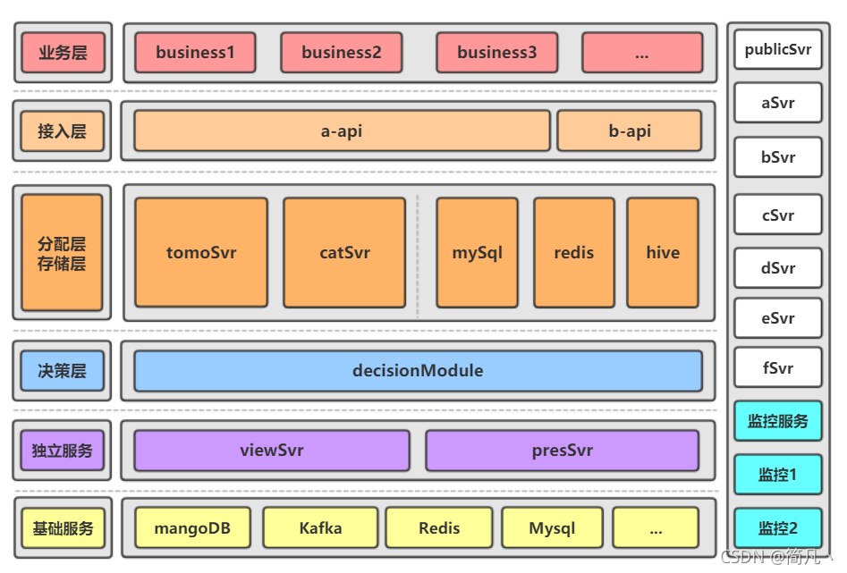
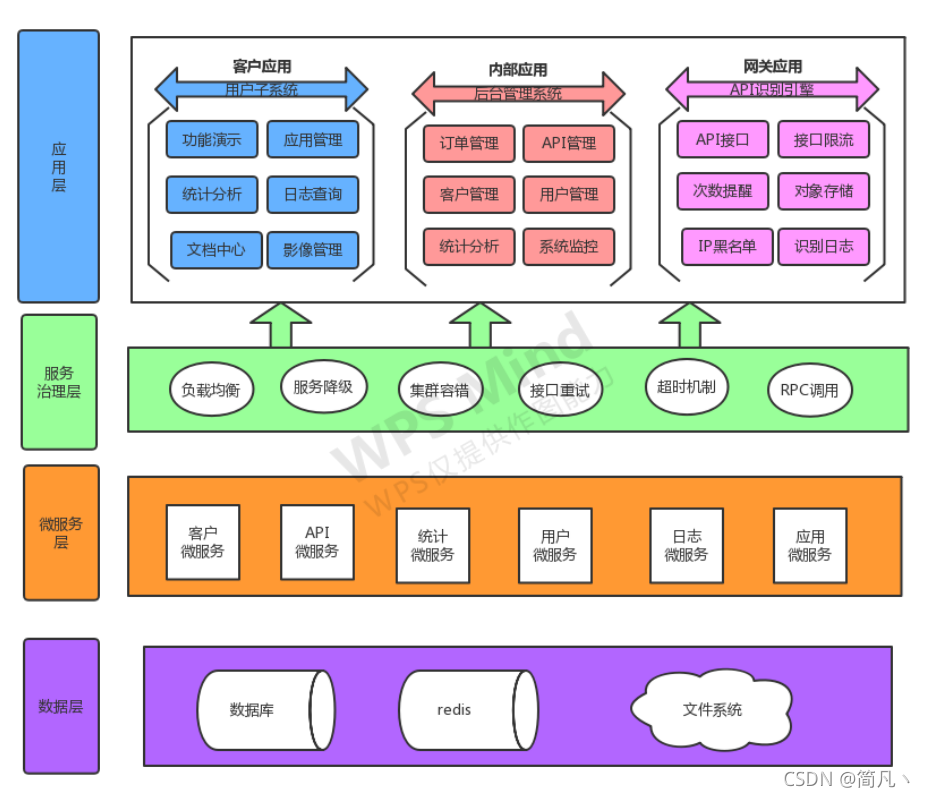
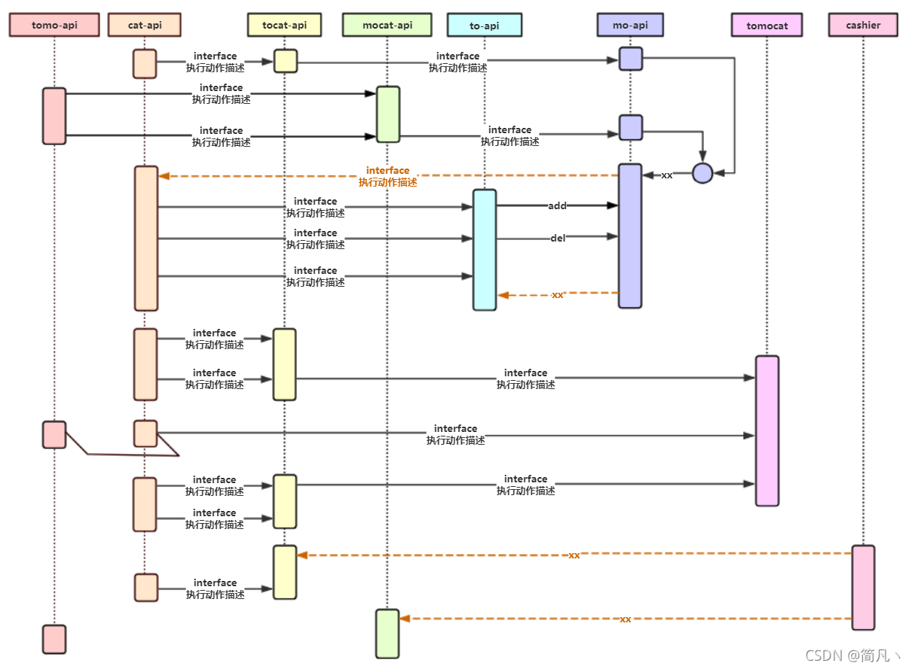
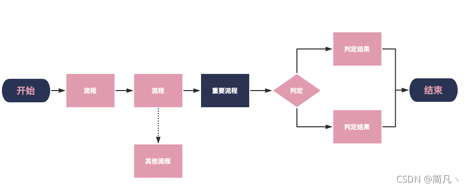
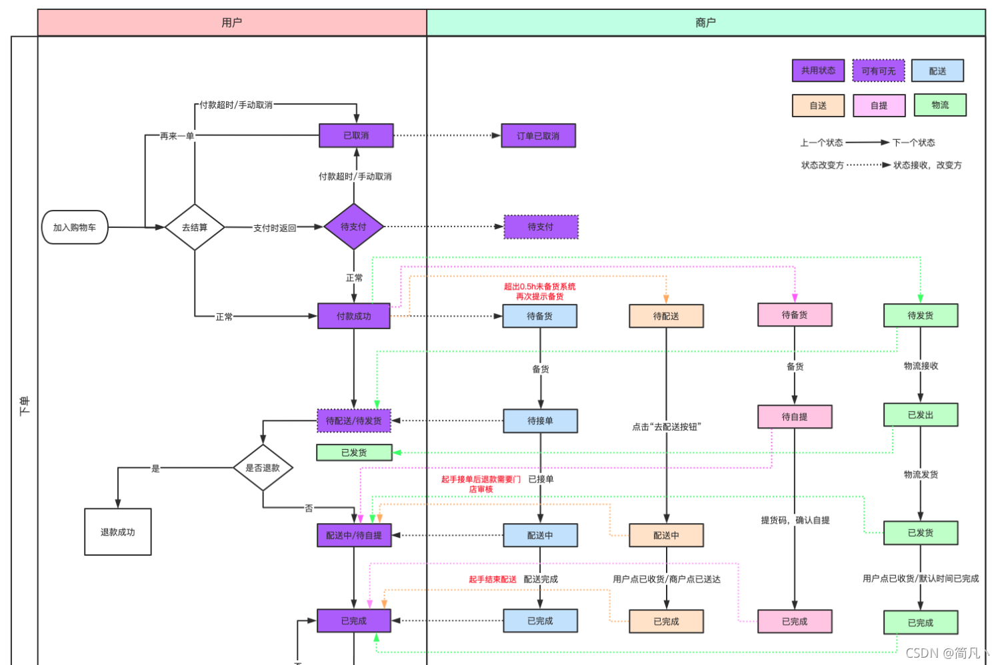

## 背景

软件研发过程中，我们常有如下的困惑：

1. 有时我们需要设计一个较大型的业务系统，或者做一个开源项目，我们该如何将这个系统的整体功能、逻辑细节一层层描述清楚呢？
2. 我们接手了一个大型复杂的系统，该如何一点点从宏观到微观的去梳理整个功能流转的脉络呢?

通过简单绘制系统的架构图、各模块之间的接口交互和时序图等，我可以更加直观地理解整个系统的运作模式，所谓的磨刀不误砍柴工。

## 系统架构图

​		系统架构图往往用于软件研发的总体设计阶段，通过简单分层来展示不同层次的模块，再加上基础服务、公共服务和监控服务等，就构成了系统层面的一个宏观的轮廓。无论是常见的MVC架构、还是DDD架构在整体系统设计层面都是差不多的，一个完整清晰的系统架构图往往会有以下用途：

+ 阐明了系统的各种依赖，包括底层中间件、外部系统、监控系统等，帮助我们更好的建立整个系统的监控体系，了解系统性能瓶颈点等
+ 在业务层阐述了系统的主要功能模块，可以好且快对外介绍我们的系统
+ 阐述了系统的整体技术架构，是微服务化的，还是单体的；有没有网关层、基础组件层等

这里有两张抽象的系统架构供参考：

## 时序图

时序图一般用于软件研发的详细设计阶段，可以用来描述系统间、微服务间、或者是功能模块间的交互过程，它展示了系统的总体调用链路，和数据流转的过程。基于时序图我们可以做以下事情：

+ 签署服务间的SLA，帮助我们推动微服务治理
+ 宏观上清晰的描述了功能实现的过程（业务流转、数据流转），协助我们在设计时思考，以防遗漏设计细节

## 程序流程图

​		详细设计阶段，在系统内部，我们需要清晰的描述业务实现的过程，包括顺序逻辑、条件判断、循环逻辑等。是我们在技术review阶段的重要工具，基本程序流程图设计好，代码中的可能异常和风险点也就分析的差不多了，基本就可以直接照着流程图进行编码了。对于一些比较注重系统稳定性的团队，在此阶段花费的时间，有时要比编码时间还长

## 状态流转图

有时除了关系业务处理逻辑，还要关心对象状态的流转，这里截取了一个电商网站在下单时的订单状态流转的示例。

