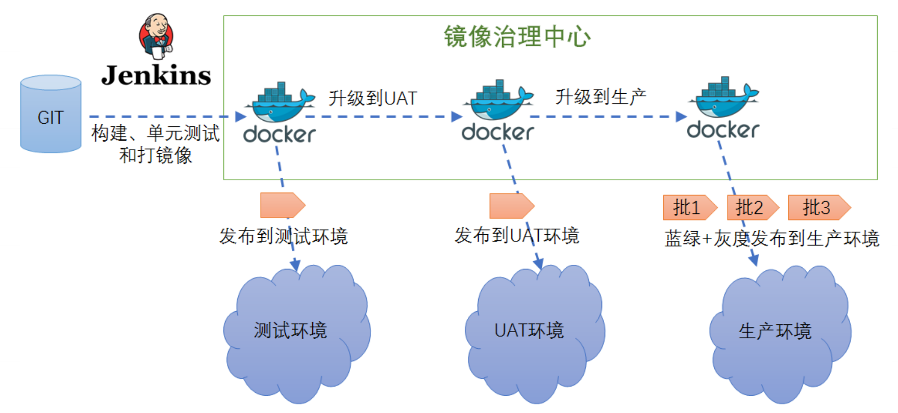
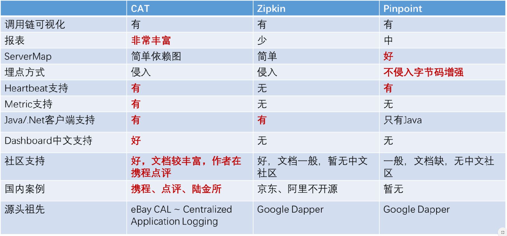
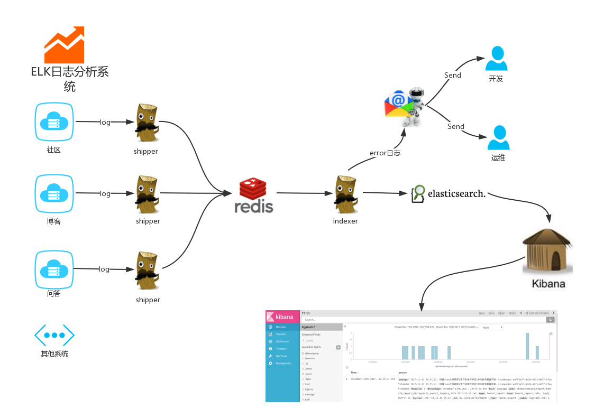
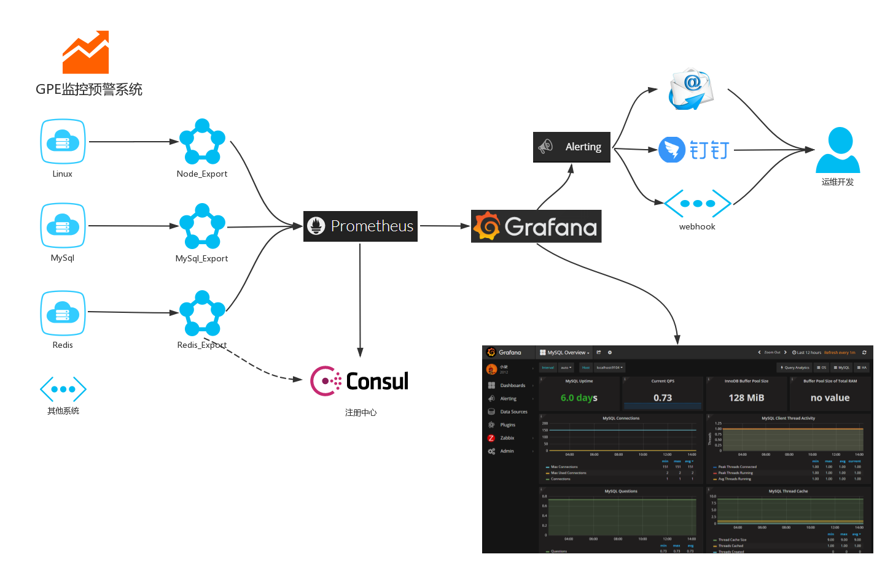
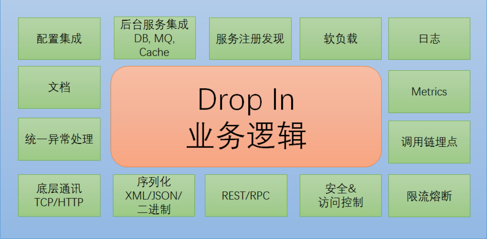

# 技术选型

## 选型原则

​		任何项目在实施之前都要进行技术选型，因为选型方案会影响到项目实施中开发的成本以及后期拓展维护的成本。下面就列一下技术选型所需要的几点基本准则，在IT行业中做任何项目，在选型时都可以套用。

1. 需求是衡量一切的标准，所以技术方案优先考虑是能满足我们的所有需求的
2. 在满足需求的条件下，选择学习成本最低的方案，因为学习成本低意味着使用简单、调试简单、维护简单且更便于掌握，对整个项目团队来说时间是最大的成本。
3. 在学习成本差不多一样的情况下，优先选择大公司的方案，因为大公司会有专人维护技术方案且经得起市场考验

以上三个条件都满足，且优先顺序是按1、2、3点顺序来的，就可以做出最合适最优的技术选型。

## 四个维度

是因为这方面我多有方法，而通常是很少有选择。在做技术选型的场景下基本有以下四个维度：

### 维度一：系统构成

第一种，有之前的老系统，需要重构

第二种，从零开始建的服务

### 维度二：稳定性

第一种，现在没有什么业务量，将来估计也不会有什么增长，甚至很可能不成

第二种，现在没有什么业务量，将来对稳定性要求很高

第三种，现在对有稳定性要求很高

### 维度三：环境

第一种，公司有很多基础设施

第二种，公司有一些基础设施

第三种，公司基本没有基础设施

### 维度四：要求

第一种，公司有标准化规范，需要用公司的统一组件

第二种，公司没有要求

### 各个维度组合的选项考虑

+ 从零开始项目现在没有什么业务量，将来估计也不会有什么增长
  + 从目标上，遇到这种项目，工作的重心就不在于把项目做好做坏，而在于人员培养。
  + 如果公司对组件上没有什么要求，那我的建议是大家想学什么，就用什么。直接拿学习的试验田来用，一举两得。
+ 如果公司有标准化规范，需要用公司的统一组件。但是公司的组件一般也是开源进行二次开发的，也一样可以想学什么就用什么，弄不明白的，还可以找维护组件的人请教。也可以用公司自研的，但是在业界有一定知名度的产品。研究的好可以作为面试的一个亮点。
  

## 技术类型

[相关技术官网站收集](https://blog.csdn.net/java_wxid/article/details/89704664)

-  网关：Nginx、Kong、Zuul
-  缓存：Redis、MemCached、OsCache、EhCache
-  搜索：ElasticSearch、Solr
-  熔断：Hystrix、resilience4j

------

-  负载均衡：DNS、F5、LVS、Nginx、OpenResty、HAproxy
-  注册中心：Eureka、Zookeeper、Redis、Etcd、Consul
-  认证鉴权：JWT
-  消费队列：RabbitMQ、ZeroMQ、Redis、ActiveMQ、Kafka

------

-  系统监控：Grafana、Prometheus、Influxdb、Telegraf、Lepus
-  文件系统：OSS、NFS、FastDFS、MogileFS
-  RPC框架： Dubbo、Motan、Thrift、grpc

------

-  构建工具：Maven、Gradle
-  集成部署：Docker、Jenkins、Git、Maven
-  分布式配置：Disconf、Apollo、Spring Cloud Config、Diamond
-  压测：LoadRunner、JMeter、AB、webbench

------

-  数据库：MySql、Redis、MongoDB、PostgreSQL、Memcache、HBase
-  网络：专用网络VPC、弹性公网IP、CDN
-  数据库中间件：DRDS、Mycat、360 Atlas、Cobar (不维护了)
-  分布式框架：Dubbo、Motan、Spring-Could

------

-  分布式任务：XXL-JOB、Elastic-Job、Saturn、Quartz
-  分布式追踪：Pinpoint、CAT、zipkin
-  分布式日志：elasticsearch、logstash、Kibana 、redis、kafka
-  版本发布：蓝绿部署、A/B测试、灰度发布／金丝雀发布

## 持续交付

## 监控架构

### 四层监控

- 前端监控：IP、PV、运营商、系统、性能、状态码
- 业务监控：登录、注册、下单、支付
- 应用层监控：service、sql、cache、相应时间
- 系统监控：物理机、虚拟机、容器，CPU、内存、IO、硬盘
- 基础监控：网络、交换机、路由器

### 监控分类

- 日志监控
- 调用链监控
- 告警系统
- Metrics监控
- 监控检查

Docker、Grafana、Prometheus、Telegraf、Influxdb、Lepus、[Elasticsearch](https://so.csdn.net/so/search?q=Elasticsearch&spm=1001.2101.3001.7020)、Logstash、Kibana、kafka、node插件、dashboards仪表盘、钉钉、邮件、微信。

## 服务框架和治理

## 架构必备

-  负载均衡（负载均衡算法）
-  反向代理
-  服务隔离
-  服务限流
-  服务降级（自动优雅降级）
-  失效转移
-  超时重试（代理超时、容器超时、前端超时、中间件超时、数据库超时、NoSql超时）
-  回滚机制（上线回滚、数据库版本回滚、事务回滚）

------

### 高并发

-  应用缓存
-  HTTP缓存
-  多级缓存
-  分布式缓存
-  连接池
-  异步并发

------

### 分布式事务

-  二阶段提交(强一致)
-  三阶段提交(强一致)
-  消息中间件(最终一致性)，推荐阿里的RocketMQ

### 队列

-  任务队列
-  消息队列
-  请求队列

------

### 扩容

-  单体垂直扩容
-  单体水平扩容
-  应用拆分
-  数据库拆分
-  数据库分库分表
-  数据异构
-  分布式任务

------

### 网络安全

-  SQL注入
-  XSS攻击
-  CSRF攻击
-  拒绝服务（DoS，Denial　of　Service）攻击