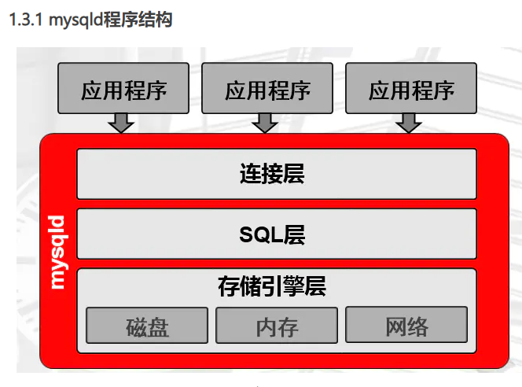
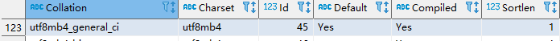
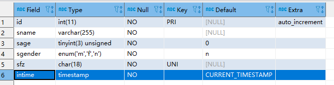
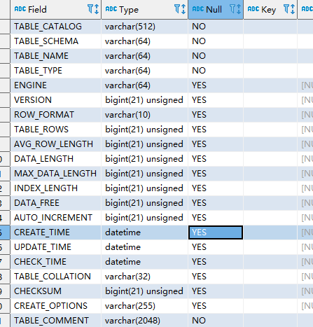

# Mysql

https://www.jianshu.com/p/edd2e20aeaee

## 基础认知

### 版本

+ 5.6.38 （20170913发布）
+ 5.7.20 （20170913发布）
+ 8.0 （近几年GA的产品）

### 基础指令

~~~sql
-- 查看Sql 版本
SELECT VERSION() ;
-- 查看现在 mysql的用户
select user,authentication_string,host from mysql.user;
-- 描述 myqsl的用户
desc  mysql.user;

-- 查看数据库目前的链接
 show processlist;
~~~

### Mysqld

```undefined
实例=mysqld后台守护进程+Master Thread +干活的Thread+预分配的内存
公司=老板+经理+员工+办公室
```



## Sql的执行过程

```ruby
1.3.2.1 连接层
（1）提供连接协议：TCP/IP 、SOCKET
（2）提供验证：用户、密码，IP，SOCKET
（3）提供专用连接线程：接收用户SQL，返回结果
通过以下语句可以查看到连接线程基本情况
mysql> show processlist;
```

###  SQL层 （重点）

```undefined
（1）接收上层传送的SQL语句
（2）语法验证模块：验证语句语法,是否满足SQL_MODE
（3）语义检查：判断SQL语句的类型
DDL ：数据定义语言
DCL ：数据控制语言
DML ：数据操作语言
DQL： 数据查询语言
...
（4）权限检查：用户对库表有没有权限
（5）解析器：对语句执行前,进行预处理，生成解析树(执行计划),说白了就是生成多种执行方案.
（6）优化器：根据解析器得出的多种执行计划，进行判断，选择最优的执行计划
        代价模型：资源（CPU IO MEM）的耗损评估性能好坏
（7）执行器：根据最优执行计划，执行SQL语句，产生执行结果
执行结果：在磁盘的xxxx位置上
（8）提供查询缓存（默认是没开启的），会使用redis tair替代查询缓存功能
（9）提供日志记录（日志管理章节）：binlog，默认是没开启的。
```

## 用户与权限

### 用户管理

白名单

~~~bash
用户名@'白名单'
白名单支持的方式？

-- 支持所有 ip
wordpress@'%'

-- 本机网段
wordpress@'localhost'

-- 其他网段（使用比较多,会针对到专门的计算机或用户）
wordpress@'10.0.0.200'
wordpress@'db02'
wordpress@'10.0.0.5%'
wordpress@'10.0.0.0/255.255.254.0'
~~~


~~~bash
增：
mysql> create user oldboy@'10.0.0.%' identified by '123';
查：
mysql> desc mysql.user;    ---->  authentication_string
mysql> select user ,host ,authentication_string from mysql.user
改:
mysql> alter user oldboy@'10.0.0.%' identified by '456';
删：
mysql> drop user oldboy@'10.0.0.%';
~~~

### 权限

权限管理操作：

```css
grant all on wordpress.* to wordpress@'10.0.0.%' 
    identified  by '123';
```

常用权限介绍:

```dart
ALL:
SELECT,INSERT, UPDATE, DELETE, CREATE, DROP,
RELOAD, SHUTDOWN, PROCESS, FILE, REFERENCES, 
INDEX, ALTER, SHOW DATABASES, SUPER, 
CREATE TEMPORARY TABLES, LOCK TABLES,
EXECUTE, REPLICATION SLAVE, REPLICATION CLIENT, 
CREATE VIEW, SHOW VIEW, CREATE ROUTINE, ALTER ROUTINE, 
CREATE USER, EVENT, TRIGGER, CREATE TABLESPACE
ALL : 以上所有权限，一般是普通管理员拥有的
with grant option：超级管理员才具备的，给别的用户授权的功能
```

权限作用范围:

```rust
*.*                  ---->管理员用户（所有的库和表）
wordpress.*          ---->开发和应用用户（某个库的所有表）
wordpress.t1		 ---->单张表
```

需求1：windows机器的navicat登录到linux中的MySQL，管理员用户。

```css
grant all 
on *.* 
to root@'10.0.0.%' 
identified by '123';
```

需求2：创建一个应用用户app用户，能从windows上登录mysql，并能操作app库

```csharp
grant select ,update,insert,delete 
on app.* 
to app@'10.0.0.%' 
identified by '123';
```

### 用户授权流程

~~~bash
1.权限
2.对谁操作
3.你从哪来
4.密码要求
~~~

#### 8.0在grant命令添加新特性

```undefined
建用户和授权分开了
grant 不再支持自动创建用户了，不支持改密码
授权之前，必须要提前创建用户。
```

#### 查看授权

~~~bash
show grants for app@'10.0.0.%';
~~~

#### 回收权限

```csharp
revoke delete on app.*  from app@'10.0.0.%'；
```

## Sql的基本应用

### 概念

**Sql常用类型**

+ DDL: 数据定义语言
+ DCL：数据控制语句
+ DML：数据操作语言
+ DQL：数据查询语句

**数据库逻辑结构**

+ 库
  + 库名
  + 属性：字符集、排序规则
+ 表
  + 表名
  + 存储引擎、字符集、排序规则
+ 列
  + 列表
  + 数据类型、约束、其他属性

### 字符集

~~~
show charset;
~~~

+ utf8 : 3个字节
+ utf8mb4：4个字节（建议使用）,它是utf8的一个超集

### 校对（排序）规则

~~~sql
-- 校对规则（排序规则）
show collation;
~~~

影响到的情况

+ 对英文字符串大小写是否敏感



~~~bash
general 代表通用校验规则
ci 		代表大小写不敏感
bin 	代表可以存储更多的格式（日文、韩文）
default 代表是否是默认的校验规则
~~~

## DDL应用

对库和表进行操作

### 建库

~~~bash
-- 创建 库
create database school;
-- 创建 
create schema sch;
-- 查看字符集
show charset;
-- 查看排序规则
show collation;
-- 实例（字符集一定要设置，排序规则可以不设置）
CREATE DATABASE test CHARSET utf8;
create database xyz charset utf8mb4 collate utf8mb4_bin;

建库规范：
1.库名不能有大写字母   
2.建库要加字符集         
3.库名不能有数字开头
4. 库名要和业务相关
~~~


### 修改库

```undefined
show databases；
SHOW CREATE DATABASE school;
ALTER DATABASE school  CHARSET utf8;
注意：修改字符集，修改后的字符集一定是原字符集的严格超集
```


### 建表

~~~sql
USE school;
CREATE TABLE stu(
id      INT NOT NULL PRIMARY KEY AUTO_INCREMENT COMMENT '学号',
sname   VARCHAR(255) NOT NULL COMMENT '姓名',
sage    TINYINT UNSIGNED NOT NULL DEFAULT 0 COMMENT '年龄',
sgender ENUM('m','f','n') NOT NULL DEFAULT 'n' COMMENT '性别' ,
sfz     CHAR(18) NOT NULL UNIQUE  COMMENT '身份证',
intime  TIMESTAMP NOT NULL DEFAULT NOW() COMMENT '入学时间'
) ENGINE=INNODB CHARSET=utf8 COMMENT '学生表';
~~~

查看表信息

~~~sql
desc stu;
~~~



建表规范：

```undefined
1. 表名小写
2. 不能是数字开头
3. 注意字符集和存储引擎
4. 表名和业务有关
5. 选择合适的数据类型
6. 每个列都要有注释
7. 每个列设置为非空，无法保证非空，用0来填充。
```

删除(生产中禁用命令)

~~~sql
drop table t1;
~~~

修改

```php
DESC stu;
ALTER TABLE stu ADD qq VARCHAR(20) NOT NULL UNIQUE COMMENT 'qq号';
```

在sname后加微信列

```php
ALTER TABLE stu ADD wechat VARCHAR(64) NOT NULL UNIQUE  COMMENT '微信号' AFTER sname ;
```

在id列前加一个新列num

```dart
ALTER TABLE stu ADD num INT NOT NULL COMMENT '数字' FIRST;
DESC stu;
```

把刚才添加的列都删掉(危险)

```dart
ALTER TABLE stu DROP num;
ALTER TABLE stu DROP qq;
ALTER TABLE stu DROP wechat;
```

修改sname数据类型的属性

```cpp
ALTER TABLE stu MODIFY sname VARCHAR(128)  NOT NULL ;
```

将sgender 改为 sg  数据类型改为 CHAR 类型

```php
ALTER TABLE stu CHANGE sgender sg CHAR(1) NOT NULL DEFAULT 'n' ;
DESC stu;
```

## DCL应用 

```undefined
grant 
revoke
```

## DML应用

INSERT\ UPDATE\DELETE

## DQL

### 单独使用

```css
-- select @@xxx 查看系统参数
SELECT @@port;
SELECT @@basedir;
SELECT @@datadir;
SELECT @@socket;
SELECT @@server_id;
```

### 对库和表

```dart
use school
show tables；
desc stu;
show create table stu；
CREATE TABLE ceshi LIKE stu;
```

### 元数据

**介绍：**

元数据是存储在"基表"中，

information_schema 中保存了大量的元数据查询视图，比如show 命令是封装好的，提供元数据查询基础功能

**information_schema：**

~~~sql
-- 保存了视图在 tables 中
use information_schema;
show tables;
SELECT * from TABLES t;
~~~




+ schema 库名
+ name 表名
+ engine 存储引擎
+ rows 行数
+ row_length 平均长度
+ index_Length 索引长度

查询整个数据库中所有库和所对应的表信息

```css
SELECT table_schema,GROUP_CONCAT(table_name)
FROM  information_schema.tables
GROUP BY table_schema;
```

统计所有库下的表个数

```css
SELECT table_schema,COUNT(table_name)
FROM information_schema.TABLES
GROUP BY table_schema
```

查询所有innodb引擎的表及所在的库

```go
SELECT table_schema,table_name,ENGINE FROM information_schema.`TABLES`
WHERE ENGINE='innodb';
```

统计world数据库下每张表的磁盘空间占用

```php
SELECT table_name,CONCAT((TABLE_ROWS*AVG_ROW_LENGTH+INDEX_LENGTH)/1024," KB")  AS size_KB
FROM information_schema.tables WHERE TABLE_SCHEMA='world';
```

统计所有数据库的总的磁盘空间占用

```objectivec
SELECT
TABLE_SCHEMA,
CONCAT(SUM(TABLE_ROWS*AVG_ROW_LENGTH+INDEX_LENGTH)/1024," KB") AS Total_KB
FROM information_schema.tables
GROUP BY table_schema;
```

生成整个数据库下的所有表的单独备份语句

```jsx
模板语句：
mysqldump -uroot -p123 world city >/tmp/world_city.sql

-- 模版 concat 拼接
SELECT CONCAT("mysqldump -uroot -p123 ",table_schema," ",table_name," >/tmp/",table_schema,"_",table_name,".sql" )
FROM information_schema.tables
WHERE table_schema NOT IN('information_schema','performance_schema','sys')
INTO OUTFILE '/tmp/bak.sh' ;

CONCAT("mysqldump -uroot -p123 ",table_schema," ",table_name," >/tmp/",table_schema,"_",table_name,".sql" )
```

107张表，都需要执行以下2条语句

```csharp
ALTER TABLE world.city DISCARD TABLESPACE;
ALTER TABLE world.city IMPORT TABLESPACE;
SELECT CONCAT("alter table ",table_schema,".",table_name," discard tablespace")
FROM information_schema.tables
WHERE table_schema='world'
INTO OUTFILE '/tmp/dis.sql';
```


**show介紹：**

```csharp
show databases;                          #查看所有数据库
show tables;                                          #查看当前库的所有表
SHOW TABLES FROM                        #查看某个指定库下的表
show create database world                #查看建库语句
show create table world.city                #查看建表语句
show grants for  root@'localhost'       #查看用户的权限信息
show charset；                                   #查看字符集
show collation                                      #查看校对规则
show processlist;                                  #查看数据库连接情况
show index from                                 #表的索引情况
show status                                         #数据库状态查看
SHOW STATUS LIKE '%lock%';         #模糊查询数据库某些状态
SHOW VARIABLES                             #查看所有配置信息
SHOW variables LIKE '%lock%';          #查看部分配置信息
show engines                                       #查看支持的所有的存储引擎
show engine innodb status\G               #查看InnoDB引擎相关的状态信息
show binary logs                                    #列举所有的二进制日志
show master status                                 #查看数据库的日志位置信息
show binlog evnets in                             #查看二进制日志事件
show slave status \G                             #查看从库状态
SHOW RELAYLOG EVENTS               #查看从库relaylog事件信息
desc  (show colums from city)               #查看表的列定义信息
http://dev.mysql.com/doc/refman/5.7/en/show.html
```

## 索引

### 查询

```ruby
db01 [world]>desc city;
+-------------+----------+------+-----+---------+----------------+
| Field      | Type    | Null | Key | Default | Extra          |
+-------------+----------+------+-----+---------+----------------+
| ID          | int(11)  | NO  | PRI | NULL    | auto_increment |
| Name        | char(35) | NO  |    |        |                |
| CountryCode | char(3)  | NO  | MUL |        |                |
| District    | char(20) | NO  |    |        |                |
| Population  | int(11)  | NO  |    | 0      |                |
+-------------+----------+------+-----+---------+----------------+
5 rows in set (0.00 sec)

Field :列名字
key  :有没有索引,索引类型
PRI: 主键索引
UNI: 唯一索引
MUL: 辅助索引(单列,联和,前缀)
```

### 创建索引

```csharp
db01 [world]>alter table city add index idx_name(name);
                             
db01 [world]>create index idx_name1 on city(name);
db01 [world]>show index from city;

注意:
以上操作不代表生产操作,我们不建议在一个列上建多个索引
同一个表中，索引名不能同名。
### 7.1.2 删除索引:
db01 [world]>alter table city drop index idx_name1;
                                       
```

### 覆盖索引(联合索引)

```csharp
alter table city add index idx_co_po(countrycode,population);
```

### 前缀索引

```csharp
db01 [world]>alter table city add index idx_di(district(5));
注意：数字列不能用作前缀索引。
```

### 唯一索引

```csharp
alter table city add unique index idx_uni1(name);
ERROR 1062 (23000): Duplicate entry 'San Jose' for key 'idx_uni1'
```

统计city表中，以省的名字为分组，统计组的个数

```csharp
select district,count(id) from city group by district;
需求: 找到world下,city表中 name列有重复值的行,最后删掉重复的行
select name,count(id) as cid from city group by name  having cid>1 order by cid desc;
select * from city where name='suzhou';
```


## 日志（工具日志）

## 备份管理


## 主从复制

