# Elasticsearch


## 倒排索引详解

​		倒排索引源于实际应用中需要根据属性的值来查找记录。这种索引表中的每一项都包括一个属性值和具有该属性值的各记录的地址。由于不是由记录来确定属性值，而是由属性值来确定记录的位置，因而称为倒排索引(inverted index)。带有倒排索引的文件我们称为倒排[索引文件](https://baike.baidu.com/item/索引文件)，简称 倒排文件

**1 索引过程**

在讲解倒排索引前，我们先了解索引创建，下图是 `Elasticsearch` 中数据索引过程的流程。

​		文档未在 ES 中进行索引，而是 由 Analyzer 组件对其执行一些操作并将其拆分为 token/term。然后将这些术语作为倒排索引存储在磁盘中。假设我们有两个名为 name 和 age 字段，当要将文档索引到 ES 时，Analyzers 组件 以某些定界符（有默认定界符，例如空格，句号等）将它们分割开获取 token，再对每个 token 应用特定的过滤器。经过分析的这些标记称为 term。然后将这些 term 针对该字段）存储在倒排列表中。

**2 倒排索引**

**2.1 正排与倒排索引**

​		搜索引擎其实跟我们的使用图书很相似，下面我来对图书和搜索引擎进行一个简单的类比，来看一下搜素引擎中正排和倒排索引。

- 图书
  - 正排索引-目录页
  - 倒排索引-索引页
- 搜索引擎
  - 正排索引-文档 Id 到文档内容和单词的关联
  - 倒排索引-单词到文档 Id 的关系

**2.2 倒排索引的核心组成**

举个例子，假设我们有 3 个文档：

```
Doc 1:breakthrough drug for schizophrenia
Doc 2:new schizophrenia drug 
Doc 3:new approach for treatment of schizophrenia
```

经过分析，文件中的术语如下

| 文档  | 分词结果                            |
| :---- | :---------------------------------- |
| Doc 1 | breakthrough,drug,for,schizophrenia |
| Doc 2 | new,schizophrenia,drug              |
| Doc 3 | new,approach,for,treatment,of       |

倒排列表的元数据结构：

```
(DocID;TF;<POS>)
```

其中：

- Doc ID：出现某单词的文档ID
- TF(词频)：单词在该文档中出现的次数
- POS：单词在文档中的位置

则它们生成的倒排索引

| 单词          | 逆向文档频率 | 倒排列表(DocID;TF;)) |
| :------------ | :----------- | :------------------- |
| breakthrough  | 1            | (1;1;<1>)            |
| drug          | 2            | (1;1;<2>),(2;1;<3>)  |
| for           | 2            | (1;1;<3>),(3;1;<3>)  |
| schizophrenia | 2            | (1;1;<4>),(2;1;<2>)  |
| new           | 2            | (2;1;<1>),(3;1;<1>)  |
| approach      | 1            | (3;1;<2>)            |
| treatment     | 1            | (3;1;<4>)            |
| of            | 1            | (3;1;<5>)            |

- ES 倒排索引包含两个部分
  - 单词词典 （Term Dictionary)，索引最小单位，记录所有文档的单词，记录单词到倒排列表的关联关系
    - 单词词典一般都会非常多，通过 B+ 树或 Hash 表方式以满足高性能的插入与查询
  - 倒排列表（Posting List)-由倒排索引项（Posting）组成
    - 文档 ID
    - 词频 TF，该单词在文档中出现的次数，用于相关性评分
    - 位置（Position)，单词在文档中分词的位置。用于语句搜索（phrase query)
    - 偏移（Offset)，记录单词的开始结束位置，实现高亮显示

 

### 分词

在创建索引之前，会对文档中的字符串进行分词。ES中字符串有两种类型，keyword和text。

- keyword类型的字符串不会被分词，搜索时全匹配查询
- text类型的字符串会被分词，搜索时是包含查询

不同的分词器对相同字符串分词的结果大有不同，选择不同的分词器对索引的创建有很大的影响

如拆分“中华人民共和国国歌”

1. ik_max_word分词器: 最细粒度拆分，分词结果如下：
   - 中华人民共和国
   - 中华人民
   - 中华
   - 华人
   - 人民共和国
   - 人民
   - 人
   - 民
   - 共和国
   - 共和
   - 和
   - 国国
   - 国歌
2. ik_smart分词器: 最粗粒度的拆分，分词结果如下：
   - 中华人民共和国
   - 国歌

可见，再ES中创建索引，选择合适的分词器是很重要的。

### 单词-文档矩阵

| -     | 单词1 | 单词2 | 单词3 | 单词4 |
| :---- | :---- | :---- | :---- | :---- |
| 文档1 | √     |       | √     |       |
| 文档2 |       | √     |       |       |
| 文档3 |       |       | √     |       |
| 文档4 | √     |       |       | √     |

该矩阵是表达单词和文档两者之间包含关系的概念模型。
从横向看，每行代表文档包含了哪些单词，比如文档1包含了单词1和单词3，而不包含其它单词。
从纵向看，每列代表了某个单词存在于哪些文档。比如单词1在文档1和文档4中出现过。

简单来说，索引就是实现“单词-文档矩阵”的具体数据结构，而倒排索引则是实现了这种数据结构的具体方式。

### 倒排索引

倒排索引由两部分构成：

- **单词词典**
- **倒排列表**


### 单词词典

单词词典的特性：

1. 是文档集合中所有单词的集合
2. 它是保存索引的最小单位
3. 其中记录着指向倒排列表的指针

单词词典的实现：

单词词典有两种数据结构实现：**B+树**和**Hash表**

B+树和Mysql索引结构中主键索引数据结构一样，这里就不再介绍了

哈希表的key是单词的hash值，值是单词的链表，因为hash算法会有冲突的情况发生，所以这里的值是一个集合，里面保存着相同hash值得单词以及改词指向倒排列表的指针

### 倒排列表

倒排列表特性：

1. 记录出现过某个单词的文档列表
2. 同时还记录单词在所有文档中的出现次数和偏移位置

倒排列表元素数据结构：

其中：

- DocID：出现某单词的文档ID
- TF(Term Frequency)：单词在该文档中出现的次数
- POS：单词在文档中的位置

### 举例

有下面单个文档

| -     | 内容                   |
| :---- | :--------------------- |
| 文档1 | 百度的年度目标         |
| 文档2 | AI技术生态部的年度目标 |
| 文档3 | AI市场的年度目标       |

则他们生成的倒排索引

| 单词ID | 单词 | 逆向文档频率 | 倒排列表(DocID;TF;<POS>)      |
| :----- | :--- | :----------- | :---------------------------- |
| 1      | 目标 | 3            | (1;1;<3>),(2;1;<5>),(3;1;<4>) |
| 2      | 年度 | 3            | (1;1;<2>),(2;1;<4>),(3;1;<3>) |
| 3      | AI   | 2            | (2;1;<1>),(3;1;<1>)           |
| 4      | 技术 | 1            | (2;1;<2>)                     |
| 5      | 生态 | 1            | (2;1;<3>)                     |
| 6      | 市场 | 1            | (3;1;<2>)                     |

比如单词“年度”，单词ID为2，在三个文档中出现过，所以逆向文档频率为3，同时倒排索引中的元素也有三个：`(1;1;<2>),(2;1;<4>),(3;1;<3>)`。拿第一个元素`(1;1;<2>)`进行说明，他表示“年度”再文档ID为1的文档中出现过1次，出现的位置是第二个单词


### 倒排索引的搜索过程

直到了倒排索引的内部结构之后，就能很好理解倒排索引的搜索过程了

 

## 题记：

Elasticsearch研究有一段时间了，现特将Elasticsearch相关核心知识、原理从初学者认知、学习的角度，从以下9个方面进行详细梳理。欢迎讨论……

## 带着问题上路——ES是如何产生的？

### 1. 思考：大规模数据如何检索？

如：当系统数据量上了10亿、100亿条的时候，我们在做系统架构的时候通常会从以下角度去考虑问题： 

1. 用什么数据库好？(mysql、sybase、oracle、达梦、神通、mongodb、hbase…) 
2. 如何解决单点故障；(lvs、F5、A10、Zookeep、MQ) 
3. 如何保证数据安全性；(热备、冷备、异地多活) 
4. 如何解决检索难题；(数据库代理中间件：mysql-proxy、Cobar、MaxScale等;) 
5. 如何解决统计分析问题；(离线、近实时)

### 2. 传统数据库的应对解决方案

对于关系型数据，我们通常采用以下或类似架构去解决查询瓶颈和写入瓶颈： 
解决要点： 

1. 通过主从备份解决数据安全性问题； 
2. 通过数据库代理中间件心跳监测，解决单点故障问题； 
3. 通过代理中间件将查询语句分发到各个slave节点进行查询，并汇总结果 


### 3. 非关系型数据库的解决方案

对于Nosql数据库，以mongodb为例，其它原理类似： 
解决要点： 

1. 通过副本备份保证数据安全性； 
2. 通过节点竞选机制解决单点问题； 
3. 先从配置库检索分片信息，然后将请求分发到各个节点，最后由路由节点合并汇总结果 
   


### 另辟蹊径——完全把数据放入内存怎么样？

​		我们知道，完全把数据放在内存中是不可靠的，实际上也不太现实，当我们的数据达到PB级别时，按照每个节点96G内存计算，在内存完全装满的数据情况下，我们需要的机器是：1PB=1024T=1048576G 
​		节点数=1048576/96=10922个 
​		实际上，考虑到数据备份，节点数往往在2.5万台左右。成本巨大决定了其不现实！

​		从前面讨论我们了解到，把数据放在内存也好，不放在内存也好，都不能完完全全解决问题。 全部放在内存速度问题是解决了，但成本问题上来了。 

为解决以上问题，从源头着手分析，通常会从以下方式来寻找方法： 

1. 存储数据时按有序存储； 
2. 将数据和索引分离； 
3. 压缩数据； 

这就引出了Elasticsearch。

## ES 基础一网打尽

### ES定义

​		ES=elaticsearch简写， Elasticsearch是一个开源的高扩展的分布式全文检索引擎，它可以近乎实时的存储、检索数据；本身扩展性很好，可以扩展到上百台服务器，处理PB级别的数据。 

### Lucene与ES关系？

1. Lucene只是一个库。想要使用它，你必须使用Java来作为开发语言并将其直接集成到你的应用中，更糟糕的是，Lucene非常复杂，你需要深入了解检索的相关知识来理解它是如何工作的。
2. Elasticsearch也使用Java开发并使用Lucene作为其核心来实现所有索引和搜索的功能，但是它的目的是通过简单的RESTful API来隐藏Lucene的复杂性，从而让全文搜索变得简单。


### ES主要解决问题：

1. 检索相关数据； 
2. 返回统计结果； 
3. 速度要快。

### ES工作原理

​		当ElasticSearch的节点启动后，它会利用多播(multicast)(或者单播，如果用户更改了配置)寻找集群中的其它节点，并与之建立连接。


### ES核心概念

#### Cluster：集群。

​		ES可以作为一个独立的单个搜索服务器。不过，为了处理大型数据集，实现容错和高可用性，ES可以运行在许多互相合作的服务器上。这些服务器的集合称为集群。

#### Node：节点。

​		形成集群的每个服务器称为节点。

#### Shard：分片。

​		当有大量的文档时，由于内存的限制、磁盘处理能力不足、无法足够快的响应客户端的请求等，一个节点可能不够。这种情况下，数据可以分为较小的分片。每个分片放到不同的服务器上。 
​		当你查询的索引分布在多个分片上时，ES会把查询发送给每个相关的分片，并将结果组合在一起，而应用程序并不知道分片的存在。即：这个过程对用户来说是透明的。

#### Replia：副本。

为提高查询吞吐量或实现高可用性，可以使用分片副本。 
副本是一个分片的精确复制，每个分片可以有零个或多个副本。ES中可以有许多相同的分片，其中之一被选择更改索引操作，这种特殊的分片称为主分片。 
当主分片丢失时，如：该分片所在的数据不可用时，集群将副本提升为新的主分片。

####  全文检索。

​		全文检索就是对一篇文章进行索引，可以根据关键字搜索，类似于mysql里的like语句。 
​		全文索引就是把内容根据词的意义进行分词，然后分别创建索引，例如”你们的激情是因为什么事情来的” 可能会被分词成：“你们“，”激情“，“什么事情“，”来“ 等token，这样当你搜索“你们” 或者 “激情” 都会把这句搜出来。

### ES数据架构的主要概念（与关系数据库Mysql对比） 

1. 关系型数据库中的数据库（DataBase），等价于ES中的索引（Index） 
2. 一个数据库下面有N张表（Table），等价于1个索引Index下面有N多类型（Type）， 
3. 一个数据库表（Table）下的数据由多行（ROW）多列（column，属性）组成，等价于1个Type由多个文档（Document）和多Field组成。 
4. 在一个关系型数据库里面，schema定义了表、每个表的字段，还有表和字段之间的关系。 与之对应的，在ES中：Mapping定义索引下的Type的字段处理规则，即索引如何建立、索引类型、是否保存原始索引JSON文档、是否压缩原始JSON文档、是否需要分词处理、如何进行分词处理等。 
5. 在数据库中的增insert、删delete、改update、查search操作等价于ES中的增PUT/POST、删Delete、改_update、查GET.


### ELK是什么？

ELK=elasticsearch+Logstash+kibana 

1. elasticsearch：后台分布式存储以及全文检索 
2. logstash: 日志加工、“搬运工” 
3. kibana：数据可视化展示。 

ELK架构为数据分布式存储、可视化查询和日志解析创建了一个功能强大的管理链。 三者相互配合，取长补短，共同完成分布式大数据处理工作。


## ES特点和优势

1. 分布式实时文件存储，可将每一个字段存入索引，使其可以被检索到。 
2. 实时分析的分布式搜索引擎。 
   1. 分布式：索引分拆成多个分片，每个分片可有零个或多个副本。集群中的每个数据节点都可承载一个或多个分片，并且协调和处理各种操作； 
   2. 负载再平衡和路由在大多数情况下自动完成。 
3. 可以扩展到上百台服务器，处理PB级别的结构化或非结构化数据。也可以运行在单台PC上（已测试） 
4. 支持插件机制，分词插件、同步插件、Hadoop插件、可视化插件等。

## ES性能

### 性能结果展示

1. 硬件配置： 
   CPU 16核 AuthenticAMD 
   内存 总量：32GB 
   硬盘 总量：500GB 非SSD

2. 在上述硬件指标的基础上测试性能如下： 
   1. 平均索引吞吐量： 12307docs/s（每个文档大小：40B/docs） 
   2. 平均CPU使用率： 887.7%（16核，平均每核：55.48%） 
   3. 构建索引大小： 3.30111 GB 
   4. 总写入量： 20.2123 GB 
   5. 测试总耗时： 28m 54s.

### 性能esrally工具（推荐）

使用参考：http://blog.csdn.net/laoyang360/article/details/52155481

## 为什么要用ES？

### ES国内外使用优秀案例

1. 2013年初，GitHub抛弃了Solr，采取ElasticSearch 来做PB级的搜索。 “GitHub使用ElasticSearch搜索20TB的数据，包括13亿文件和1300亿行代码”。
2. 维基百科：启动以elasticsearch为基础的核心搜索架构。 
3. SoundCloud：“SoundCloud使用ElasticSearch为1.8亿用户提供即时而精准的音乐搜索服务”。 
4. 百度：百度目前广泛使用ElasticSearch作为文本数据分析，采集百度所有服务器上的各类指标数据及用户自定义数据，通过对各种数据进行多维分析展示，辅助定位分析实例异常或业务层面异常。目前覆盖百度内部20多个业务线（包括casio、云分析、网盟、预测、文库、直达号、钱包、风控等），单集群最大100台机器，200个ES节点，每天导入30TB+数据。

### 我们也需要

1. 实际项目开发实战中，几乎每个系统都会有一个搜索的功能，当搜索做到一定程度时，维护和扩展起来难度就会慢慢变大，所以很多公司都会把搜索单独独立出一个模块，用ElasticSearch等来实现。
2. 近年ElasticSearch发展迅猛，已经超越了其最初的纯搜索引擎的角色，现在已经增加了数据聚合分析（aggregation）和可视化的特性，如果你有数百万的文档需要通过关键词进行定位时，ElasticSearch肯定是最佳选择。当然，如果你的文档是JSON的，你也可以把ElasticSearch当作一种“NoSQL数据库”， 应用ElasticSearch数据聚合分析（aggregation）的特性，针对数据进行多维度的分析。

## ES的应用场景是怎样的？

### 通常我们面临问题有两个：

1. 新系统开发尝试使用ES作为存储和检索服务器； 
2. 现有系统升级需要支持全文检索服务，需要使用ES。 
3. 以上两种架构的使用，以下链接进行详细阐述。 
   http://blog.csdn.net/laoyang360/article/details/52227541

### 一线公司ES使用场景：

1. 新浪ES 如何分析处理32亿条实时日志 http://dockone.io/article/505 
2. 阿里ES 构建挖财自己的日志采集和分析体系 http://afoo.me/columns/tec/logging-platform-spec.html 
3. 有赞ES 业务日志处理 http://tech.youzan.com/you-zan-tong-ri-zhi-ping-tai-chu-tan/ 
4. ES实现站内搜索 http://www.wtoutiao.com/p/13bkqiZ.html


## es的工作原理

### es写数据过程

1. 客户端选择一个node发送请求过去，这个node就是coordinating node（协调节点）
2. coordinating node，对document进行路由，将请求转发给对应的node（有primary shard）
3. 实际的node上的primary shard处理请求，然后将数据同步到replica node
4. coordinating node，如果发现primary node和所有replica node都搞定之后，就返回响应结果给客户端


### 读据过程

查询，GET某一条数据，写入了某个document，这个document会自动给你分配一个全局唯一的id，doc id，同时也是根据doc id进行hash路由到对应的primary shard上面去。也可以手动指定doc id，比如用订单id，用户id。你可以通过doc id来查询，会根据doc id进行hash，判断出来当时把doc id分配到了哪个shard上面去，从那个shard去查询

1. 客户端发送请求到任意一个node，成为coordinate node
2. coordinate node对document进行路由，将请求转发到对应的node，此时会使用round-robin随机轮询算法，在primary shard以及其所有replica中随机选择一个，让读请求负载均衡
3. 接收请求的node返回document给coordinate node
4. coordinate node返回document给客户端

### es搜索数据过程

1. 客户端发送请求到一个coordinate node
2. 协调节点将搜索请求转发到所有的shard对应的primary shard或replica shard也可以
3. query phase：每个shard将自己的搜索结果（其实就是一些doc id），返回给协调节点，由协调节点进行数据的合并、排序、分页等操作，产出最终结果
4. fetch phase：接着由协调节点，根据doc id去各个节点上拉取实际的document数据，最终返回给客户端

### **写数据底层原理**

1. 先写入buffer（缓冲区），在buffer里的时候数据是搜索不到的；同时将数据写入translog日志文件
2. 如果buffer快满了，或者到一定时间，就会将buffer数据refresh到一个新的segment file中，但是此时数据不是直接进入segment file的磁盘文件的，而是先进入os cache的。这个过程就是refresh。
   1. 每隔1秒钟，es将buffer中的数据写入一个新的segment file，每秒钟会产生一个新的磁盘文件，segment file，这个segment file中就存储最近1秒内buffer中写入的数据
   2. 但是如果buffer里面此时没有数据，那当然不会执行refresh操作咯，每秒创建换一个空的segment file，如果buffer里面有数据，默认1秒钟执行一次refresh操作，刷入一个新的segment file中
   3. 操作系统里面，磁盘文件其实都有一个东西，叫做os cache，操作系统缓存，就是说数据写入磁盘文件之前，会先进入os cache，先进入操作系统级别的一个内存缓存中去
   4. 只要buffer中的数据被refresh操作，刷入os cache中，就代表这个数据就可以被搜索到了
   5. 为什么叫es是准实时的？NRT，near real-time，准实时。默认是每隔1秒refresh一次的，所以es是准实时的，因为写入的数据1秒之后才能被看到。
   6. 可以通过es的restful api或者java api，手动执行一次refresh操作，就是手动将buffer中的数据刷入os cache中，让数据立马就可以被搜索到。
   7. 只要数据被输入os cache中，buffer就会被清空了，因为不需要保留buffer了，数据在translog里面已经持久化到磁盘去一份了
3. 只要数据进入os cache，此时就可以让这个segment file的数据对外提供搜索了
4. 重复1~3步骤，新的数据不断进入buffer和translog，不断将buffer数据写入一个又一个新的segment file中去，每次refresh完buffer清空，translog保留。随着这个过程推进，translog会变得越来越大。当translog达到一定长度的时候，就会触发commit操作。
   1. buffer中的数据，倒是好，每隔1秒就被刷到os cache中去，然后这个buffer就被清空了。所以说这个buffer的数据始终是可以保持住不会填满es进程的内存的。
   2. 每次一条数据写入buffer，同时会写入一条日志到translog日志文件中去，所以这个translog日志文件是不断变大的，当translog日志文件大到一定程度的时候，就会执行commit操作。
5. commit操作发生第一步，就是将buffer中现有数据refresh到os cache中去，清空buffer
6. 将一个commit point写入磁盘文件，里面标识着这个commit point对应的所有segment file
7. 强行将os cache中目前所有的数据都fsync到磁盘文件中去
   1. translog日志文件的作用是什么？就是在你执行commit操作之前，数据要么是停留在buffer中，要么是停留在os cache中，无论是buffer还是os cache都是内存，一旦这台机器死了，内存中的数据就全丢了。
   2. 所以需要将数据对应的操作写入一个专门的日志文件，translog日志文件中，一旦此时机器宕机，再次重启的时候，es会自动读取translog日志文件中的数据，恢复到内存buffer和os cache中去。
   3. commit操作：1、写commit point；2、将os cache数据fsync强刷到磁盘上去；3、清空translog日志文件
8. 将现有的translog清空，然后再次重启启用一个translog，此时commit操作完成。默认每隔30分钟会自动执行一次commit，但是如果translog过大，也会触发commit。整个commit的过程，叫做flush操作。我们可以手动执行flush操作，就是将所有os cache数据刷到磁盘文件中去。
   1. 不叫做commit操作，flush操作。es中的flush操作，就对应着commit的全过程。我们也可以通过es api，手动执行flush操作，手动将os cache中的数据fsync强刷到磁盘上去，记录一个commit point，清空translog日志文件。
9. translog其实也是先写入os cache的，默认每隔5秒刷一次到磁盘中去，所以默认情况下，可能有5秒的数据会仅仅停留在buffer或者translog文件的os cache中，如果此时机器挂了，会丢失5秒钟的数据。但是这样性能比较好，最多丢5秒的数据。也可以将translog设置成每次写操作必须是直接fsync到磁盘，但是性能会差很多。
   1. 实际上你在这里，如果面试官没有问你es丢数据的问题，你可以在这里给面试官炫一把，你说，其实es第一是准实时的，数据写入1秒后可以搜索到；可能会丢失数据的，你的数据有5秒的数据，停留在buffer、translog os cache、segment file os cache中，有5秒的数据不在磁盘上，此时如果宕机，会导致5秒的数据丢失。
   2. 如果你希望一定不能丢失数据的话，你可以设置个参数，官方文档，百度一下。每次写入一条数据，都是写入buffer，同时写入磁盘上的translog，但是这会导致写性能、写入吞吐量会下降一个数量级。本来一秒钟可以写2000条，现在你一秒钟只能写200条，都有可能。
10. 如果是删除操作，commit的时候会生成一个.del文件，里面将某个doc标识为deleted状态，那么搜索的时候根据.del文件就知道这个doc被删除了
11. 如果是更新操作，就是将原来的doc标识为deleted状态，然后新写入一条数据
12. buffer每次refresh一次，就会产生一个segment file，所以默认情况下是1秒钟一个segment file，segment file会越来越多，此时会定期执行merge
13. 每次merge的时候，会将多个segment file合并成一个，同时这里会将标识为deleted的doc给物理删除掉，然后将新的segment file写入磁盘，这里会写一个commit point，标识所有新的segment file，然后打开segment file供搜索使用，同时删除旧的segment file。
14. es里的写流程，有4个底层的核心概念，refresh、flush、translog、merge
15. 当segment file多到一定程度的时候，es就会自动触发merge操作，将多个segment file给merge成一个segment file。


## 部署ES

### 6.1 ES部署（无需安装）

1. 零配置，开箱即用 
2. 没有繁琐的安装配置 
3. java版本要求：最低1.7 
   我使用的1.8 
   [root@laoyang config_lhy]# echo $JAVA_HOME 
   /opt/jdk1.8.0_91 
4. 下载地址： 
   https://download.elastic.co/elasticsearch/release/org/elasticsearch/distribution/zip/elasticsearch/2.3.5/elasticsearch-2.3.5.zip 
5. 启动 
   cd /usr/local/elasticsearch-2.3.5 
   ./bin/elasticsearch 
   bin/elasticsearch -d(后台运行)

### 6.2 ES必要的插件

必要的Head、kibana、IK（中文分词）、graph等插件的详细安装和使用。

 [简单使用](https://blog.csdn.net/qq_26002283/article/details/107062665?ops_request_misc=&request_id=&biz_id=102&utm_term=server.port:%205601%20server.host:&utm_medium=distribute.pc_search_result.none-task-blog-2~all~sobaiduweb~default-0-107062665.142^v63^control_1,201^v3^add_ask,213^v2^t3_esquery_v1&spm=1018.2226.3001.4187)


### 6.3 ES windows下一键安装

自写bat脚本实现windows下一键安装。 

1. 一键安装ES及必要插件（head、kibana、IK、logstash等） 
2. 安装后以服务形式运行ES。 
3. 比自己摸索安装节省至少2小时时间，效率非常高。 
   脚本说明： 
   http://blog.csdn.net/laoyang360/article/details/51900235

## ES对外接口（开发人员关注）

### RESTful API接口

[常见的增、删、改、查操作实现](http://blog.csdn.net/laoyang360/article/details/51931981) 

### ES遇到问题怎么办？

1. [国外社区](https://discuss.elastic.co/) 
2. [国内中文社区](http://elasticsearch.cn/)


## 基本操作

### Window 启动

 ~~~bash
# elasticSearch
elasticSearch.bat

# Head
npm run start

#kibana
kibana.bat

注意三个软件的版本要保持一致，以免发生特殊的情况
windows系统作为显示，正常情况下，使用docker启动
 ~~~

### 基本指令

~~~json
#########################使用Web Api发送请求#################################
# cat 查看指令

http://localhost:9200/_cat/nodes
查看节点信息127.0.0.1 19 62 11    dim * DESKTOP-2TFJ9FH

http://localhost:9200/_cat/health 
查看健康状况 ：1605180693 11:31:33 elasticsearch yellow 1 1 5 5 0 0 2 0 - 71.4%

http://localhost:9200/_cat/master
查看主节点信息：NqURgTh4Royz8MqZsb-Pkw 127.0.0.1 127.0.0.1 DESKTOP-2TFJ9FH

http://localhost:9200/_cat/indices
查看索引库
green  open .kibana_task_manager_1   XML2Icy-TGSs_mS2ICR4_A 1 0  2 0  6.6kb  6.6kb
yellow open krest                    L-iygc_-Qd2_mNa34MYVMA 1 1  1 0  5.5kb  5.5kb
green  open .apm-agent-configuration _8g4nsYFQxuwXGSGsRSovg 1 0  0 0   283b   283b
green  open .kibana_1                2obByg3rTrqcORgP41ffbw 1 0 13 3 47.7kb 47.7kb
yellow open krest2                   8IWLZeWKRO2K0eLhdnYgog 1 1  2 0  3.6kb  3.6kb


##put 保存
#put customer/external/1  保存数据到customer索引、external类型、1指定的文档的索引，Put发送请求必须携带id。
数据格式为Json，所以测试用例
{
  "location": "中国四川",
  "name": "test",
  "sex": "女",
  "year": "23"
}

# PostMan使用Put请求
http://localhost:9200/customer/externer/1    
第一次发送，返回数据如下
{
# 如_index，带有下划线的都是元数据，es的基本信息
    "_index": "customer",   #
    "_type": "externer",
    "_id": "1",
    "_version": 1,
    "result": "created",   		# created代表新建数据
    "_shards": {                 # 分片，在集群中会有介绍
        "total": 2,
        "successful": 1,
        "failed": 0
    },
    "_seq_no": 0,
    "_primary_term": 1
}
# 第二次发送，返回数据如下
{
    "_index": "customer",
    "_type": "externer",
    "_id": "1",
    "_version": 2,  			# 版本号自动加1
    "result": "updated",		# 状态变为update
    "_shards": {
        "total": 2,
        "successful": 1,
        "failed": 0
    },
    "_seq_no": 1,
    "_primary_term": 1
}


##post 保存
http://localhost:9200/customer/externer      # 不添加Id
数据格式为 Json，所以测试用例
{
  "location": "中国四川",
  "name": "test",
  "sex": "女",
  "year": "23"
}
# 返回结果
{
    "_index": "customer",
    "_type": "externer",
    "_id": "xAZGvHUBsJ5sFs3Xs745",			# 会自动生成一个唯一Id，不加id多次发送，都会是新建，所以更新保存一定携带id。
    "_version": 1,
    "result": "created",
    "_shards": {
        "total": 2,
        "successful": 1,
        "failed": 0
    },
    "_seq_no": 2,
    "_primary_term": 1
}

# post更新文档
http://localhost:9200/customer/externer/1/_update      # _update会对比原来数据，如果一直，就不执行操作
# 发送数据（更新数据与索引库数据一直）
{
"doc":{               
        "sex": "男",
       }
}

# 返回数据
{
    "_index": "customer",
    "_type": "externer",
    "_id": "1",
    "_version": 3,
    "result": "noop",			# 代表更新数据一致，所以不做任何操作
    "_shards": {
        "total": 0,
        "successful": 0,
        "failed": 0
    },
    "_seq_no": 3,
    "_primary_term": 1
}


# Get查询
使用PostMan发送Get请求：http://localhost:9200/customer/externer/1
返回数据
{
    "_index": "customer",
    "_type": "externer",
    "_id": "1",
    "_version": 2,					# 有过更改操作就会加 1 
    "_seq_no": 1,					# 作为乐观锁进行使用，进行并发控制的字段
    "_primary_term": 1,		   		 # 集群使用
    "found": true,		
    "_source": {					# 经过查询得到的数据
        "location": "中国四川",
        "name": "test",
        "sex": "女",
        "year": "23"
    }
}


##===================================================================================
# delete 删除请求（只能删除索引和文档，不能够删除类型）
http://localhost:9200/customer/externer/xAZGvHUBsJ5sFs3Xs745
# 返回结果
{
    "_index": "customer",
    "_type": "externer",
    "_id": "xAZGvHUBsJ5sFs3Xs745",
    "_version": 2,
    "result": "deleted",     # 代表已经删除
    "_shards": {
        "total": 2,
        "successful": 1,
        "failed": 0
    },
    "_seq_no": 4,
    "_primary_term": 1
}
# 再次查询返回结果
{
    "_index": "customer",
    "_type": "externer",
    "_id": "xAZGvHUBsJ5sFs3Xs745",
    "found": false              # 结果：未找到数据
}

#删除索引 http://localhost:9200/customer
#返回数据
{
    "acknowledged": true
}
# 再次发送Get请求 http://localhost:9200/customer/externer/xAZGvHUBsJ5sFs3Xs745
# 返回结果
{
    "error": {
        "root_cause": [
            {
                "type": "index_not_found_exception",
                "reason": "no such index [customer]",
                "resource.type": "index_expression",
                "resource.id": "customer",
                "index_uuid": "_na_",
                "index": "customer"
            }
        ],
        "type": "index_not_found_exception",
        "reason": "no such index [customer]",
        "resource.type": "index_expression",
        "resource.id": "customer",
        "index_uuid": "_na_",
        "index": "customer"
    },
    "status": 404
}

~~~


### 使用kibana


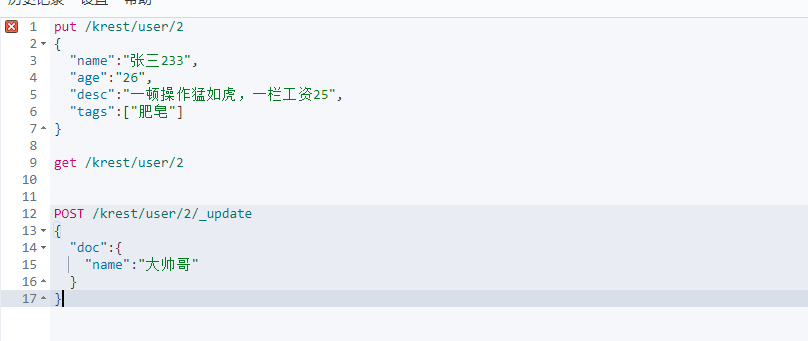


精确查找


keyword 只能支持精确查询，所以要用到text的类型

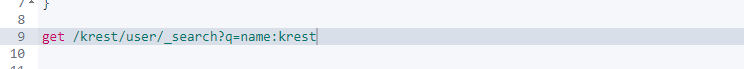

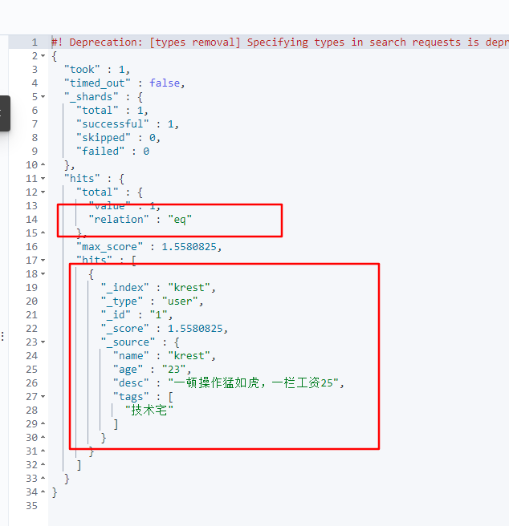


范围查询

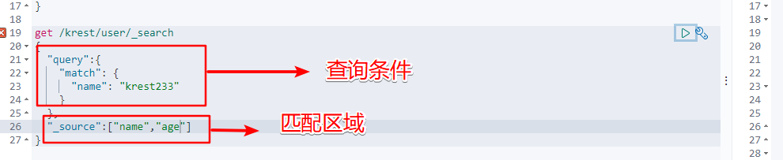

#

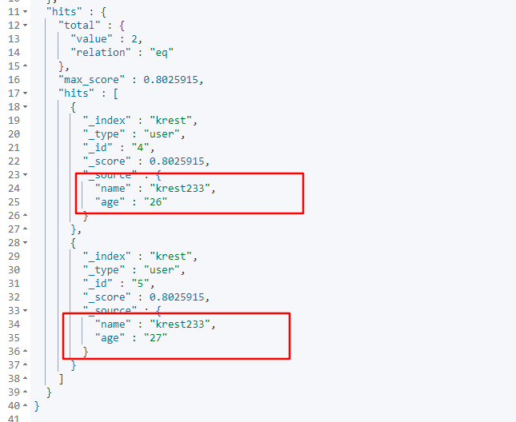、


~~~
#设置索引库的信息
PUT krest2
{
  "mappings": {
    "properties":{
      "name":{
        "type":"text"
      },
      "desc":{
        "type":"keyword"
      }
    }
  }
}

#分词器进行分词
GET _analyze
{
  "analyzer" :"standard",
  "text":"rtyuiop[cvbnm,"
}

# 排序
get /krest/user/_search
{
  "query":{
    "match": {
      "name": "krest233"
    }
  },
  "sort":[
      {
        "age":{
          "order":"desc"
        }
      }
    ]
}

#分页 form 第一页，size 返回数据多少
get /krest/user/_search
{
  "query":{
    "match": {
      "name": "krest233"
    }
  },
  "sort":[
      {
        "age": {
          "order":"desc"
        }
      }
    ],
    "form": 0,
    "size" ： 1,
}
~~~


### 进阶使用

1.  ES的两种检索方式
    + Url地址拼接
    + 通过是用Rest RequestBody 来发送请求体（常用方式）（存在多种语法）

~~~json
get /customer/_search
{
  "query":{
    "match_all": {}
  },
  "sort":[
    {
      "_id":"desc" 									# id按照降序方式查找
    }
  ]
}


返回结果
{
  "took" : 1,
  "timed_out" : false,
  "_shards" : {
    "total" : 1,
    "successful" : 1,
    "skipped" : 0,
    "failed" : 0
  },
  "hits" : {								# 数据存在于Hits中
    "total" : {
      "value" : 2,
      "relation" : "eq"
    },
    "max_score" : null,
    "hits" : [
      {
        "_index" : "customer",
        "_type" : "externer",
        "_id" : "2",
        "_score" : null,
        "_source" : {
          "location" : "中国香港",
          "name" : "Denny",
          "sex" : "男",
          "year" : "23"
        },
        "sort" : [
          "2"
        ]
      },
      {
        "_index" : "customer",
        "_type" : "externer",
        "_id" : "1",
        "_score" : null,
        "_source" : {
          "location" : "中国四川",
          "name" : "test",
          "sex" : "女",
          "year" : "23"
        },
        "sort" : [
          "1"
        ]
      }
    ]
  }
}


~~~

### 常用的进阶语法

1. sort ：排序字段
2. from：分页字段  from size
3. _source ：返回指定字段

~~~json
get /customer/_search
{
  "query":{
    "match": {  		
      "name": "krest test"           # 全文检索匹配这个词，模糊查询
    }
  }
}

get /customer/_search
{
  "query":{
    "match_phrase": {
      "name": "test krest" 			# 精确查询，不进行分词查询
    }
  }
}


get /customer/_search
{
  "query":{
    "multi_match": {				# 多字段进行匹配，也同样会进行分词
      "query": "test", 
     "fields": ["name","location"]		
    }
  }
}


get /customer/_search
{
  "query":{
    "bool": {				# 多条件查询
      "must": [				# 必须满足的条件
        {
          "match": {
            "name": "denny"
          }
        },
         { 
         "match": {
            "year": "23"
          }
        }
      ],
         "must_not": [ 			# 一定不满足的条件
        {
          "match": {
            "year": "26"
          }
        }
      ],
        "should": [				# 最好满足，不强求的条件
                {
              "match": {
                "location": "中国四川"
              }
        }
      ]	
    }
  }
}


~~~

#### Term与match

+ Term 是全字段匹配。一般来说非全文检索用term
+ match 是全文模糊匹配，会对查询条件进行分词匹配
+ keyword 精确匹配检索

#### Filter

+ 类似于Limit，对结果进行过滤，但是不会贡献得分

#### aggregatios(执行聚合)

+ 对多条件查询的结果进行整理统计，类似于 Group By、Count等


#### 分词器

~~~json
GET /customer/_mapping

POST _analyze
{
  "analyzer": "ik_max_word",
  "text":"我是中国人"
}

~~~

将ik分词器的文件放在远程的Nginx上面

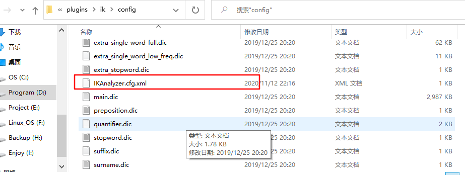

~~~
<entry key="remote_ext_dict">http://localhost:81/hello/ik.txt</entry>  

html文件夹下面，新建文件夹，加入txt文件即可，然后重启Es测试


# 测试
POST _analyze
{
  "analyzer": "ik_max_word",
  "text":"杜鑫大大好帅呀"
}
~~~


## Spring整合ES

ES 有两个端口

+ 9300 ： TCP 请求，但是 SpringBoot整合 版本不一致，最高到6.3.8
+ 9200： HTTP请求
  + JestClient 非官方，更新慢
  + RestTemplate 模拟Http，ES很多操作要自己封装，麻烦
  + HttpClient 同上
  + **Elasticsearch-Rest-Client** 官方，封装了很多ES语句，Api层次分明


​		前端服务器虽然可以直接访问ES，但是出于安全因素考虑，ES是我们的后端服务器，不可能被直接访问，最终还是要通过Java的接口，当然JS查询的不是太好操作ES


#### 整合流程

##### 1. 导入依赖

~~~xml
   <dependencies>
       <!--但是springdata的Es版本仅仅在6.8,所以修改版本-->
        <dependency>
            <groupId>org.springframework.data</groupId>
            <artifactId>spring-data-elasticsearch</artifactId>
        </dependency>

        <dependency>
            <groupId>org.springframework.boot</groupId>
            <artifactId>spring-boot-starter-web</artifactId>
        </dependency>
        <dependency>
            <groupId>org.springframework.boot</groupId>
            <artifactId>spring-boot-starter-test</artifactId>
            <scope>test</scope>
            <exclusions>
                <exclusion>
                    <groupId>org.junit.vintage</groupId>
                    <artifactId>junit-vintage-engine</artifactId>
                </exclusion>
            </exclusions>
        </dependency>
        <dependency>
            <groupId>org.projectlombok</groupId>
            <artifactId>lombok</artifactId>
        </dependency>
    </dependencies>
~~~

#### 修改ES版本

~~~Xml
	<properties>
        <elasticsearch.version>7.8.0</elasticsearch.version>
    </properties>
~~~

#### 增加配置项

~~~java
/**
 * @Auther: krest
 * @Date: 2020/11/12 22:59
 * @Description:
 */
public class ElasticSearchHighLevelClientConfig extends AbstractElasticsearchConfiguration {

    @Override
    @Bean
    public RestHighLevelClient elasticsearchClient() {
        final ClientConfiguration clientConfiguration = ClientConfiguration.builder()
                .connectedTo("127.0.0.1:9200")
                .build();

        System.out.println(RestClients.create(clientConfiguration).rest());
        return RestClients.create(clientConfiguration).rest();
    }
}
~~~

#### 注入对象并使用

~~~java
@SpringBootTest
public class EsTest {
    @Autowired
    private RestHighLevelClient restHighLevelClient;

    //删除方法
    @Test
    public void TestDelete() throws IOException {
        DeleteRequest deleteRequest = new DeleteRequest("customer","2");
        DeleteResponse delete = restHighLevelClient.delete(deleteRequest, RequestOptions.DEFAULT);
        RestStatus status = delete.status();
        System.out.println(status);
    }
    
    
    //查询方法
    @Test
    public void TestSearch() throws IOException {
        SearchRequest searchRequest = new SearchRequest("customer");
        SearchSourceBuilder searchSourceBuilder = new SearchSourceBuilder();
        searchSourceBuilder.query(QueryBuilders.matchAllQuery());
        searchRequest.source(searchSourceBuilder);
        //查询所有
        SearchResponse search = restHighLevelClient.search(searchRequest, RequestOptions.DEFAULT);
        System.out.println("符合条件的文档总是："+search.getHits().getTotalHits());
        SearchHit[] hits = search.getHits().getHits();
        for (int i = 0; i < hits.length; i++) {
            System.out.println(hits[i].getSourceAsMap());
        }
    }

}

~~~


### 牛逼的聚合

~~~java
    //复杂查询
    @Test
    public void complexSearch() throws IOException {
        SearchRequest searchRequest = new SearchRequest();
        //指定搜索的索引
        searchRequest.indices("user");
        //建立检索条件对象
        SearchSourceBuilder searchSourceBuilder = new SearchSourceBuilder();
        //构建检索条件
        //1.建立查询条件 2.使用QueryBuilders得到全检条件
        searchSourceBuilder.query(QueryBuilders.matchQuery("name","王5"));

        //聚合条件1，(tems 截取指定的字段存在的列)  统计每个相同字段的个数
        TermsAggregationBuilder aggregationBuilder = AggregationBuilders.terms("ageAgg").field("age").size(5);
        //然后将聚合条件给予检索对象
        searchSourceBuilder.aggregation(aggregationBuilder);

        //聚合条件2(求取年龄的平均值)
        AvgAggregationBuilder avgAggregationBuilder = AggregationBuilders.avg("balanceAge").field("age");
        searchSourceBuilder.aggregation(avgAggregationBuilder);

        //进行检索
        searchRequest.source(searchSourceBuilder);
        SearchResponse search = restHighLevelClient.search(searchRequest, RequestOptions.DEFAULT);
        System.out.println(search);
        //处理检索的结果
        //1. 获取所有的记录 search.getHits();
        //遍历打印检索结果
        SearchHit[] hits = search.getHits().getHits();
        //查看检索条数
        TotalHits totalHits = search.getHits().getTotalHits();
        System.out.println("一共有："+totalHits);
        //遍历检索结果
        for (int i = 0; i < hits.length; i++) {
            System.out.println(hits[i].getSourceAsMap());
            //装换成为指定的对象
            String sourceAsString = hits[i].getSourceAsString();
            User user = JSON.parseObject(sourceAsString, User.class);
            System.out.println(user.getName());
            System.out.println(user.getAge());
            System.out.println(user.getDate());
            System.out.println(user.getLocation());
        }


        //获得检索的结果信息
        Aggregations aggregations = search.getAggregations();
        Terms ageAgg = aggregations.get("ageAgg");
        Avg balanceAge = aggregations.get("balanceAge");
        for (Terms.Bucket bucket : ageAgg.getBuckets()) {
            System.out.println(bucket.getKeyAsString());
        }
        System.out.println(balanceAge.getValue());
    }


~~~

## 整合系统

### 确认关系映射（数据模型）

~~~Json
PUT blogs
{
  "mappings": {
    "properties": {
      "blogId":{
        "type":"long"				# 存储的文件类型
      },
      "blogTitle":{
        "type": "text",
       "analyzer": "ik_smart"		# 确认检索的分词器
      },
      "blogSortId":{
        "type": "long"
      },
      "blogimg":{	
        "type": "keyword",			#不需要进行分词
        "index": false,				#图片信息不需要检索
        "doc_values": false,		#不需要尽心聚合分析
      },
      "blogPrice":{
        "type": "keyword"
      },
      "openComment":{
        "type": "boolean"
      },
       "content":{
        "type": "text",
        "analyzer": "ik_smart"
      },
      "hotScore":{
        "type": "long"
      },
      "attrs":{					# 设置属性
        "type": "nested",		 # nestes 非常重要，对应的是一个数组，按照对象中的某些值进行检索，需要用到，作为内部属性，如果不用nested，它会将内部属性进行拆分组合，
        "properties": {
          "attrId":{
            "type":"long"
          },
          "attrName":{
            "type":"keyword",
            "index":false,
            "doc_values":false
          },
          "attrValue":{
            "type":"keyword"
          }
        }
      }
    }
  }
}
~~~

## 搜索引擎

### 建立查询接口

~~~java
  /**
     * 将页面提交的所有请求查询参数封装成一个对象
     * @param searchParam
     * @return
     */
    @PostMapping("/Search")
    public String Search(@RequestBody(required = false) SearchParam searchParam){
        ResponseParam responseParam = esService.search(searchParam);
        return "";
    }
~~~

### 封装所有可能的检索条件作为对象

~~~java
/**
 * @Auther: krest
 * @Date: 2020/11/13 23:30
 * @Description: 封装页面可能传来的所有查询条件
 *
 */
@Data
public class SearchParam {

    //页面输入的检索关键字-> 用作全文检索
    private String keyword;

    //按照分类查找
    private String BlogSrotId;

    /**
     * 不同的排序条件
     * 价格、热度、销量、评分、上架时间 等等
     * sort=sortCount_asc/desc
     * sort=salePrice_asc/desc
     * sort=hotScore_asc/desc
     * 等等
     */
    private String sort;


    /**
     * 过滤条件，会有很多
     * 1、是否有货->单选
     * hasStrock=0/1
     *
     * 2、价格区间->单选
     * sku_price=1-500/_500/500_
     *
     * 3、按照品牌选择->可以多选
     * bangId
     */
    //是否有库存
    private Integer hasStock;

    //拼接价格区间
    private String skuPrice;

    //拼接多个品牌Id
    private List<String> BandId;

    /**
     * 属性多选如颜色、屏幕大小、cpu型号
     */
    private List<String> attr;

    /**
     * 因为数据量很大，所以加入页码
     */
    private Integer pageNumber;

}

~~~

### 建立的检索结果，并返回对象

~~~java
/**
 * @Auther: krest
 * @Date: 2020/11/13 23:53
 * @Description: 通过搜索引擎返回的数据信息
 */
@Data
public class ResponseParam {

    //查询得到的所有商品信息
    private List<EsModel> products;

    //以下是分页信息
    private Long pageNum;

    private Long total;

    private Long totalPages;

    //返回的分类信息
    private List<BrandVo> brandList;

    //提交一个一级或者二级分类
    private List<CataLogVo> CataLogList;

    //所有属性列表
    private List<attrVo> attrList;

    //展示返回的所有品牌数据
    @Data
    private static class BrandVo{
        private String brandId;
        private String bandName;
        private String brangImg;
    }

    //所有属性的数据
    @Data
    private static class attrVo{
        private String attrId;
        private String attrName;
        //属性值可能有很多，所以用list封装
        private List<String> attrValueList;
    }

    //所有分类的信息
    @Data
    private static class CataLogVo{
        private String cataLogId;
        private String cataLogName;

    }
}

~~~

### 建立接口实现方法

~~~java
 /**
     * 得到检索的参数，然后得到结果进行返回
     * @param searchParam
     * @return
     */
    @Override
    public ResponseParam search(SearchParam searchParam) {


        return null;
    }
~~~


### ES中优先测试检索规律

~~~Json
GET product/_search
{
  "query": {					## 开始查询
    "bool":{					##多条件查询
      "must": [					## 必须符合的查询条件
        {						
          "match": {				## skutitle 中必须包含华为字段，使用关键字进行的查询
            "skuTitle": "华为"
          }
        }
      ],
      "filter":[					## 对结果进行过滤
        {
          "term":{					## 字段对应单值使用term
            "catalog":"255"
          }
        },
        {
          "terms": {					## 字段对应单多值使用terms
            "branId": [
              "1",
              "2"
          ]
        },
		{
            "range": {					## 查询价格区间
              "price": {
                "gte": 10,
                "lte": 20
              }
            }
          }	
        {
          "nested": {					## 对于嵌入式属性的查询使用nested
          "path": "attr",				## 匹配嵌入式的字段名称
          "query": {					## 开始查询
            "bool": {					## 多值匹配
              "must": [
                {
                  "term": {				## 单值匹配
                    "attrs.attrId": {
                      "value": "15"
                    }
                  },
                  "terms": {			## 多值匹配
                    "attrs.attrValue": [
                      "海思",
                      "以官网信息为准"
                    ]
                  }
                }
              ]
            }
          }
        }
        }
      ]
    }
  },
"sort": [				# 对得到的查询结果进行排序
         {
         "attrs.attrName": {
         "order": "desc"
         }
	}
]，
  "from": 0,				# 从第几页开始
  "size": 20,				# 每页多少数据
  "highlight": {			# 高亮字段
    "fields": {"attrs.attrValue": {}}, 			# 高亮的字段的属性
    "pre_tags": "<b style='color:red'>",		# 高亮的html标签
    "post_tags": "</b>"
  }
}
~~~

### 复杂查询的规律

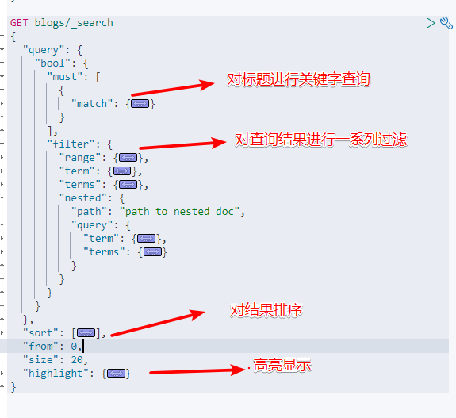

~~~json
GET blogs/_search
{
  "query": {
    "bool": {
      "must": [
        {
          "match": {
            "FIELD": "TEXT"
          }
        }
      ],
      "filter": {
        "range": {
          "FIELD": {
            "gte": 10,
            "lte": 20
          }
        },
        "term": {
          "FIELD": "VALUE"
        },
        "terms": {
          "FIELD": [
            "VALUE1",
            "VALUE2"
          ]
        },
        "nested": {
          "path": "path_to_nested_doc",
          "query": {
            "term": {
              "FIELD": {
                "value": "VALUE"
              }
            },
            "terms": {
              "FIELD": [
                "VALUE1",
                "VALUE2"
              ]
            }
          }
        }
      }
    }
  },
  "sort": [
    {
      "FIELD": {
        "order": "desc"
      }
    }
  ],
  "from": 0,
  "size": 20,
  "highlight": {
    "fields": {"attrs.attrValue": {}}, 
    "pre_tags": "<b style='color:red'>",
    "post_tags": "</b>"
  }
}

~~~

### 对结果进行聚合分析

#####  普通聚合

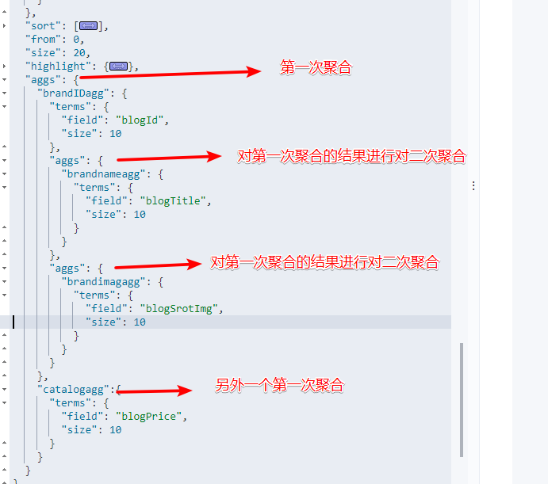

 

##### 嵌入式聚合

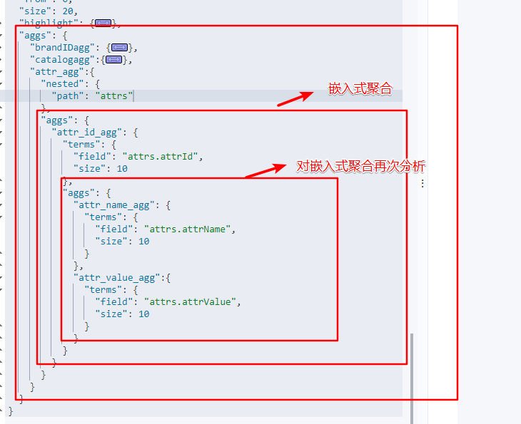


### 使用Java构建复杂的DSL语句

1. 程序结构

~~~java
  @Override
    public ResponseParam search(SearchParam searchParam) throws IOException {
        //建立检索请求
        SearchRequest searchRequest = new SearchRequest("products");


        //执行检索请求
        SearchResponse search = restHighLevelClient.search(searchRequest, RequestOptions.DEFAULT);

        
        //分析响应数据，封装需要格式
        
        
        //返回结果
        ResponseParam responseParam=null;

        return responseParam;
    }
~~~

2. 因为程序很长，所以对结构尽心再次封装，构建两个私有方法
   1. 检索条件方法私有
   2. 返回结果处理方法私有

~~~java
    @Override
    public ResponseParam search(SearchParam searchParam) throws IOException {
        //建立检索请求,将方法私有
        SearchRequest searchRequest = buildSearchRequest(searchParam);
        

        //执行检索请求
        SearchResponse search = restHighLevelClient.search(searchRequest, RequestOptions.DEFAULT);


        //分析响应数据，封装需要格式，返回结果
        ResponseParam responseParam= buildSearchResponse(search);

        return responseParam;
    }

    //将结果进行封装
    private ResponseParam buildSearchResponse(SearchResponse search) {

        return null;
    }

    //构建检索需求
    private SearchRequest buildSearchRequest(SearchParam searchParam) {


        return null;
    }
}
~~~

3. 构建私有的检索需求

~~~java
    //构建检索需求
    private SearchRequest buildSearchRequest(SearchParam searchParam) {
        // 指定检索的索引库
        SearchRequest searchRequest = new SearchRequest("product");
        //构建检索条件对象
        SearchSourceBuilder searchSourceBuilder = new SearchSourceBuilder();

        /**
         * 构建检索的条件
         * 1. 查询
         * 2. 过滤
         * 3. 聚合分析
         */

        //构建多条件查询对象
        BoolQueryBuilder boolQuery = new BoolQueryBuilder();
        //1.1 must 条件 模糊匹配,检查是否有关键字
        if(StringUtils.isEmpty(searchParam.getKeyword())){
            boolQuery.must(QueryBuilders.matchQuery("BlogTitle",searchParam.getKeyword()));
        }

        //1.2构建Filter
        //1.2.1 检查是否有三级分类的id
        if(searchParam.getParentId()!= null){
            boolQuery.filter(QueryBuilders.termQuery("ParentId",searchParam.getParentId()));
        }

        //1.2.2 检查是否有品牌Id
        if(searchParam.getBandId()!=null && searchParam.getBandId().size()>0){
            //searchParam.getBandId() 是一个list集合，所以使用termsQuery
            boolQuery.filter(QueryBuilders.termsQuery("bandId",searchParam.getBandId()));
        }

        //1.2.3 按照属性进行查询
        if(searchParam.getAttr() !=null && searchParam.getAttr().size()>0){

            for (String attr : searchParam.getAttr()) {
                BoolQueryBuilder nestedQueryBuilder = QueryBuilders.boolQuery();
                // attr的属性可能会传递多个,参数形式1- 5寸：8寸，2 - 8G：16G(id-属性)
                String[] attrs = attr.split("-");
                String attrId = attrs[0];
                String[] attrValues = attrs[1].split(":");
                nestedQueryBuilder.must(QueryBuilders.termQuery("atts.attrId",attrId));
                nestedQueryBuilder.must(QueryBuilders.termsQuery("attrValue",attrValues));
                //第一个参数：属性的名称，第二个参数查询条件，我们设置为nestedQueryBuilder，第三个查询结果是否参与评分，我们选择null
                NestedQueryBuilder nestedQuery = QueryBuilders.nestedQuery("attr", nestedQueryBuilder, ScoreMode.None);
                //每一个都羊属性都要形成于一个Filter进行过滤
                boolQuery.filter(nestedQuery);
            }
        }

        //1.2.4 安装库存进行过滤
        boolQuery.filter(QueryBuilders.termsQuery("hasStock",searchParam.getHasStock()==1));

        //1.2.5 检索价格区间
        if(!StringUtils.isEmpty(searchParam.getSkuPrice())){
            /** 查询条件的样子：1——500/-500/500-
             *  "range": {
             *           "FIELD": {
             *             "gte": 10,
             *             "lte": 20
             *           }
             */
            RangeQueryBuilder skuPrice= new RangeQueryBuilder("skuPrice");
            //对传递的字符串进行分割成为数组
            String[] s = searchParam.getSkuPrice().split("-");
            if(s.length==2){
                skuPrice.gte(s[0]).lte(s[1]);
            }else if(s.length==1){
                if(searchParam.getSkuPrice().startsWith("-")){
                    skuPrice.lte(s[0]);
                }
                if(searchParam.getSkuPrice().endsWith("-")){
                    skuPrice.gte(s[0]);
                }
            }


            boolQuery.filter(skuPrice);

        }

        //1.3 排序,参数形式  sort=hotScore——asc/desc
        if(!StringUtils.isEmpty(searchParam.getSort())){
            String sortString = searchParam.getSort();
            String[] strings = sortString.split("-");
            SortOrder order = strings[1].equalsIgnoreCase("asc")?SortOrder.DESC:SortOrder.ASC;
            searchSourceBuilder.sort(strings[0], order);
        }


        //1.4 分页 参数形式
        searchSourceBuilder.from(searchParam.getPageNumber()-1*pageSize);
        searchSourceBuilder.size(searchParam.getSizeNumber()*pageSize);

        //1.5 高亮
        if (!StringUtils.isEmpty(searchParam.getKeyword())){
            HighlightBuilder highlightBuilder = new HighlightBuilder();
            highlightBuilder.field("productTitle");
            highlightBuilder.preTags("<b style='color:red'>");
            highlightBuilder.postTags("<b style='color:red'>");
            searchSourceBuilder.highlighter(highlightBuilder);
        }


        //将 多条件查询对象 给予 检索条件对象
        searchSourceBuilder.query(boolQuery);

        // 查看构建的 searchSourceBuilder 语句
        String string = searchSourceBuilder.toString();
        System.out.println(string);


        //3. 聚合分析
        //3.1 品牌聚合
        TermsAggregationBuilder brand_agg = AggregationBuilders.terms("brand_agg");
        brand_agg.field("brand_id").size(50);

        //3.1.1品牌子聚合
        brand_agg.subAggregation(AggregationBuilders.terms("brand_name_agg").field("brand_name").size(1));
        brand_agg.subAggregation(AggregationBuilders.terms("brand_img_agg").field("brand_img").size(1));
        searchSourceBuilder.aggregation(brand_agg);

        //3.2 分类聚合
        TermsAggregationBuilder catelogAgg = AggregationBuilders.terms("vateLogAgg").field("catelogId").size(50);
        catelogAgg.subAggregation(AggregationBuilders.terms("catalogNameAgg").field("catalogname").size(1));
        catelogAgg.subAggregation(AggregationBuilders.terms("catelogValueAgg").field("catelogValue").size(1));
        searchSourceBuilder.aggregation(catelogAgg);

        //3.3.1嵌入聚合
        NestedAggregationBuilder nested_attr_agg = AggregationBuilders.nested("attrag","attr");
        //3.3.1.1聚合出所有的AttrID
        TermsAggregationBuilder attr_id_agg= AggregationBuilders.terms("attr_id_agg").field("attrs");
        // 3.3.1.2 根据Id 聚合出所有的 name 和 value
        attr_id_agg.subAggregation(AggregationBuilders.terms("attr_name_agg").field("attr_name").size(1));
        attr_id_agg.subAggregation(AggregationBuilders.terms("attr_value_agg").field("attr_value").size(50));

        //3.3.3 将嵌入式聚合放入 searchSourceBuilder中
        nested_attr_agg.subAggregation(attr_id_agg);
        searchSourceBuilder.aggregation(nested_attr_agg);


        // 4. 将检索条件对象传入检索对象
        searchRequest.source(searchSourceBuilder);
        return searchRequest;
    }
~~~

4. 封装返回数据的私有方法

~~~java
    //将结果进行封装
    private ResponseParam buildSearchResponse(SearchResponse search,SearchParam searchParam) {
        ResponseParam responseParam = new ResponseParam();
        //确定需要封装的数据
        //1. 封装产品信息
        SearchHits hits = search.getHits();
        List<EsModel> esModelList = new ArrayList<>();
        if(hits.getHits()!=null&& hits.getHits().length>0){
            for (SearchHit hit : hits.getHits()) {
                String sourceAsString = hit.getSourceAsString();
                EsModel esModel = JSON.parseObject(sourceAsString, EsModel.class);
                esModelList.add(esModel);
            }
        }
        responseParam.setProducts(esModelList);

        //属性来源于聚合信息
        List<ResponseParam.attrVo> attrVoList = new ArrayList<>();
        ParsedNested attr_agg = search.getAggregations().get("attr_agg");
        ParsedStringTerms attr_id_agg = attr_agg.getAggregations().get("attr_id_agg");
        for (Terms.Bucket bucket : attr_id_agg.getBuckets()) {
            ResponseParam.attrVo attrVo = new ResponseParam.attrVo();
            String keyAsString = bucket.getKeyAsString();
            ParsedStringTerms att_name_agg = bucket.getAggregations().get("att_name_agg");
            ParsedStringTerms att_value_agg = bucket.getAggregations().get("att_value_agg");
            String nameString1 = att_name_agg.getBuckets().get(0).getKeyAsString();
            
            List<String> attrValue = att_value_agg.getBuckets().stream().map(item -> {
                String itemKeyAsString = item.getKeyAsString();
                return itemKeyAsString;
            }).collect(Collectors.toList());
            
            attrVo.setAttrId(keyAsString);
            attrVo.setAttrName(nameString1);
            attrVo.setAttrValueList(attrValue);
            attrVoList.add(attrVo);
        }

        responseParam.setAttrList(attrVoList);


        //从聚合信息中得到所有的Brand信息
        List<ResponseParam.BrandVo> brandVoList = new ArrayList<>();
        ParsedLongTerms bandIdagg = search.getAggregations().get("bandId");
        for (Terms.Bucket bucket : bandIdagg.getBuckets()) {
            ResponseParam.BrandVo brandVo = new ResponseParam.BrandVo();
            brandVo.setBrandId(bucket.getKeyAsString());

            ParsedStringTerms brang_name_agg = bucket.getAggregations().get("brang_name");
            String keyAsString = brang_name_agg.getBuckets().get(0).getKeyAsString();
            brandVo.setBandName(keyAsString);

            ParsedStringTerms bran_img_agg = bucket.getAggregations().get("bran_img");
            String valueAsString = bran_img_agg.getBuckets().get(0).getKeyAsString();
            brandVo.setBrangImg(valueAsString);
            brandVoList.add(brandVo);
        }
        responseParam.setBrandList(brandVoList);


        //得到所有的Catelog信息
        List<ResponseParam.CataLogVo> cataLogList = new ArrayList<>();
        ParsedLongTerms catalogAgg = search.getAggregations().get("catalogAgg");
        List<? extends Terms.Bucket> buckets = catalogAgg.getBuckets();
        for (Terms.Bucket bucket : buckets) {
            ResponseParam.CataLogVo cataLogVo = new ResponseParam.CataLogVo();
            cataLogVo.setCataLogId((String)bucket.getKey());

            //然后再得到子聚合的信息 catelogName
            ParsedStringTerms catalogName_agg = bucket.getAggregations().get("catalogNameAgg");
            String keyAsString = catalogName_agg.getBuckets().get(0).getKeyAsString();
            cataLogVo.setCataLogName(keyAsString);

            //然后再得到子聚合的信息 catelogValue
            ParsedStringTerms catalogValue_agg = bucket.getAggregations().get("catalogvalueAgg");
            String valueAsString = catalogValue_agg.getBuckets().get(0).getKeyAsString();
            cataLogVo.setCataLogName(valueAsString);

            cataLogList.add(cataLogVo);
        }
        responseParam.setCataLogList(cataLogList);


        //封转当前页慢
        responseParam.setPageNum(searchParam.getPageNumber());

        //封装总的纪录数
        long value = hits.getTotalHits().value;
        responseParam.setTotal(value);

        //封装总页面
        int totalPages = value%pageSize ==0 ?(int)value/pageSize:((int)value/pageSize)+1;
        responseParam.setTotalPages((long) totalPages);
        
        return responseParam;
    }
~~~

~~~
{
  "attrSearch": [
    "1328967365962018816-1328967447243436032:1328967497092739072"
  ],
  "keyWords":"Iphone",
  "hasStock": true,
  "brandId": [
    "1",
    "1329379666938564608",
    "1328220583401369600"
  ],
  "pageNumber": 1,
  "sizeNumber": 2,
  "sortId": "1328013468502085632",
  "price":"1-5000"
}
~~~

~~~java
//    //将结果进行封装
//    private ResponseParam buildSearchResponse(SearchResponse search,SearchParam searchParam) {
//        ResponseParam responseParam = new ResponseParam();
//        //确定需要封装的数据
//        //1. 封装产品信息
//        SearchHits hits = search.getHits();
//        List<EsModel> esModelList = new ArrayList<>();
//        if(hits.getHits()!=null&& hits.getHits().length>0){
//            for (SearchHit hit : hits.getHits()) {
//                String sourceAsString = hit.getSourceAsString();
//                EsModel esModel = JSON.parseObject(sourceAsString, EsModel.class);
//                esModelList.add(esModel);
//                //设置高亮
//                if(StringUtils.isEmpty(searchParam.getKeyword())){
//                    HighlightField productName = hit.getHighlightFields().get("productName");
//                    String string = productName.getFragments()[0].toString();
//                    esModel.setBlogTitle(string);
//                 }
//            }
//        }
//        responseParam.setProducts(esModelList);
//
//        //属性来源于聚合信息
//        List<ResponseParam.attrVo> attrVoList = new ArrayList<>();
//        ParsedNested attr_agg = search.getAggregations().get("attr_agg");
//        ParsedStringTerms attr_id_agg = attr_agg.getAggregations().get("attr_id_agg");
//        for (Terms.Bucket bucket : attr_id_agg.getBuckets()) {
//            ResponseParam.attrVo attrVo = new ResponseParam.attrVo();
//            String keyAsString = bucket.getKeyAsString();
//            ParsedStringTerms att_name_agg = bucket.getAggregations().get("att_name_agg");
//            ParsedStringTerms att_value_agg = bucket.getAggregations().get("att_value_agg");
//            String nameString1 = att_name_agg.getBuckets().get(0).getKeyAsString();
//            List<String> attrValue = att_value_agg.getBuckets().stream().map(item -> {
//                String itemKeyAsString = item.getKeyAsString();
//                return itemKeyAsString;
//            }).collect(Collectors.toList());
//
//            attrVo.setAttrId(keyAsString);
//            attrVo.setAttrName(nameString1);
//            attrVo.setAttrValueList(attrValue);
//            attrVoList.add(attrVo);
//        }
//
//        responseParam.setAttrList(attrVoList);
//
//
//        //从聚合信息中得到所有的Brand信息
//        List<ResponseParam.BrandVo> brandVoList = new ArrayList<>();
//        ParsedLongTerms bandIdagg = search.getAggregations().get("bandId");
//        for (Terms.Bucket bucket : bandIdagg.getBuckets()) {
//            ResponseParam.BrandVo brandVo = new ResponseParam.BrandVo();
//            brandVo.setBrandId(bucket.getKeyAsString());
//
//            ParsedStringTerms brang_name_agg = bucket.getAggregations().get("brang_name");
//            String keyAsString = brang_name_agg.getBuckets().get(0).getKeyAsString();
//            brandVo.setBandName(keyAsString);
//
//            ParsedStringTerms bran_img_agg = bucket.getAggregations().get("bran_img");
//            String valueAsString = bran_img_agg.getBuckets().get(0).getKeyAsString();
//            brandVo.setBrangImg(valueAsString);
//            brandVoList.add(brandVo);
//        }
//        responseParam.setBrandList(brandVoList);
//
//
//        //得到所有的Catelog信息
//        List<ResponseParam.CataLogVo> cataLogList = new ArrayList<>();
//        ParsedLongTerms catalogAgg = search.getAggregations().get("catalogAgg");
//        List<? extends Terms.Bucket> buckets = catalogAgg.getBuckets();
//        for (Terms.Bucket bucket : buckets) {
//            ResponseParam.CataLogVo cataLogVo = new ResponseParam.CataLogVo();
//            cataLogVo.setCataLogId((String)bucket.getKey());
//
//            //然后再得到子聚合的信息 catelogName
//            ParsedStringTerms catalogName_agg = bucket.getAggregations().get("catalogNameAgg");
//            String keyAsString = catalogName_agg.getBuckets().get(0).getKeyAsString();
//            cataLogVo.setCataLogName(keyAsString);
//
//            //然后再得到子聚合的信息 catelogValue
//            ParsedStringTerms catalogValue_agg = bucket.getAggregations().get("catalogvalueAgg");
//            String valueAsString = catalogValue_agg.getBuckets().get(0).getKeyAsString();
//            cataLogVo.setCataLogName(valueAsString);
//
//            cataLogList.add(cataLogVo);
//        }
//        responseParam.setCataLogList(cataLogList);
//
//
//        //封转当前页慢
//        responseParam.setPageNum(searchParam.getPageNumber());
//
//        //封装总的纪录数
//        long value = hits.getTotalHits().value;
//        responseParam.setTotal(value);
//
//        //封装总页面
//        int totalPages = value%pageSize ==0 ?(int)value/pageSize:((int)value/pageSize)+1;
//        responseParam.setTotalPages((long) totalPages);
//
//        return responseParam;
//    }


    //构建检索需求
//    private SearchRequest buildSearchRequest(SearchParam searchParam) {
//        // 指定检索的索引库
//        SearchRequest searchRequest = new SearchRequest("product");
//        //构建检索条件对象
//        SearchSourceBuilder searchSourceBuilder = new SearchSourceBuilder();
//
//        /**
//         * 构建检索的条件
//         * 1. 查询
//         * 2. 过滤
//         * 3. 聚合分析
//         */
//
//        //构建多条件查询对象
//        BoolQueryBuilder boolQuery = new BoolQueryBuilder();
//        //1.1 must 条件 模糊匹配,检查是否有关键字
//        if(StringUtils.isEmpty(searchParam.getKeyword())){
//            boolQuery.must(QueryBuilders.matchQuery("BlogTitle",searchParam.getKeyword()));
//        }
//
//        //1.2构建Filter
//        //1.2.1 检查是否有三级分类的id
//        if(searchParam.getParentId()!= null){
//            boolQuery.filter(QueryBuilders.termQuery("ParentId",searchParam.getParentId()));
//        }
//
//        //1.2.3 按照属性进行查询
//        if(searchParam.getAttr() !=null && searchParam.getAttr().size()>0){
//
//            for (String attr : searchParam.getAttr()) {
//                BoolQueryBuilder nestedQueryBuilder = QueryBuilders.boolQuery();
//                // attr的属性可能会传递多个,参数形式1- 5寸：8寸，2 - 8G：16G(id-属性)
//                String[] attrs = attr.split("-");
//                String attrId = attrs[0];
//                String[] attrValues = attrs[1].split(":");
//                nestedQueryBuilder.must(QueryBuilders.termQuery("atts.attrId",attrId));
//                nestedQueryBuilder.must(QueryBuilders.termsQuery("attrValue",attrValues));
//                //第一个参数：属性的名称，第二个参数查询条件，我们设置为nestedQueryBuilder，第三个查询结果是否参与评分，我们选择null
//                NestedQueryBuilder nestedQuery = QueryBuilders.nestedQuery("attr", nestedQueryBuilder, ScoreMode.None);
//                //每一个都羊属性都要形成于一个Filter进行过滤
//                boolQuery.filter(nestedQuery);
//            }
//        }
//
//        //1.2.4 安装库存进行过滤
//        boolQuery.filter(QueryBuilders.termsQuery("hasStock",searchParam.getHasStock()==1));
//
//        //1.2.5 检索价格区间
//        if(!StringUtils.isEmpty(searchParam.getSkuPrice())){
//            /** 查询条件的样子：1——500/-500/500-
//             *  "range": {
//             *           "FIELD": {
//             *             "gte": 10,
//             *             "lte": 20
//             *           }
//             */
//            RangeQueryBuilder skuPrice= new RangeQueryBuilder("skuPrice");
//            //对传递的字符串进行分割成为数组
//            String[] s = searchParam.getSkuPrice().split("-");
//            if(s.length==2){
//                skuPrice.gte(s[0]).lte(s[1]);
//            }else if(s.length==1){
//                if(searchParam.getSkuPrice().startsWith("-")){
//                    skuPrice.lte(s[0]);
//                }
//                if(searchParam.getSkuPrice().endsWith("-")){
//                    skuPrice.gte(s[0]);
//                }
//            }
//
//
//            boolQuery.filter(skuPrice);
//
//        }
//
//
//        //1.3 排序,参数形式  sort=hotScore——asc/desc
//        if(!StringUtils.isEmpty(searchParam.getSort())){
//            String sortString = searchParam.getSort();
//            String[] strings = sortString.split("-");
//            SortOrder order = strings[1].equalsIgnoreCase("asc")?SortOrder.DESC:SortOrder.ASC;
//            searchSourceBuilder.sort(strings[0], order);
//        }
//
//
//        //1.4 分页 参数形式
//        searchSourceBuilder.from((int) (searchParam.getPageNumber()-1*pageSize));
//        searchSourceBuilder.size((int) (searchParam.getSizeNumber()*pageSize));
//
//        //1.5 高亮
//        if (!StringUtils.isEmpty(searchParam.getKeyword())){
//            HighlightBuilder highlightBuilder = new HighlightBuilder();
//            highlightBuilder.field("productTitle");
//            highlightBuilder.preTags("<b style='color:red'>");
//            highlightBuilder.postTags("<b style='color:red'>");
//            searchSourceBuilder.highlighter(highlightBuilder);
//        }
//
//
//        //将 多条件查询对象 给予 检索条件对象
//        searchSourceBuilder.query(boolQuery);
//
//        // 查看构建的 searchSourceBuilder 语句
//        String string = searchSourceBuilder.toString();
//        System.out.println(string);
//
//
//        //3. 聚合分析
//        //3.1 品牌聚合
//        TermsAggregationBuilder brand_agg = AggregationBuilders.terms("brand_agg");
//        brand_agg.field("brand_id").size(50);
//
//        //3.1.1品牌子聚合
//        brand_agg.subAggregation(AggregationBuilders.terms("brand_name_agg").field("brand_name").size(1));
//        brand_agg.subAggregation(AggregationBuilders.terms("brand_img_agg").field("brand_img").size(1));
//        searchSourceBuilder.aggregation(brand_agg);
//
//        //3.2 分类聚合
//        TermsAggregationBuilder catelogAgg = AggregationBuilders.terms("vateLogAgg").field("catelogId").size(50);
//        catelogAgg.subAggregation(AggregationBuilders.terms("catalogNameAgg").field("catalogname").size(1));
//        catelogAgg.subAggregation(AggregationBuilders.terms("catelogValueAgg").field("catelogValue").size(1));
//        searchSourceBuilder.aggregation(catelogAgg);
//
//        //3.3.1嵌入聚合
//        NestedAggregationBuilder nested_attr_agg = AggregationBuilders.nested("attrag","attr");
//        //3.3.1.1聚合出所有的AttrID
//        TermsAggregationBuilder attr_id_agg= AggregationBuilders.terms("attr_id_agg").field("attrs");
//        // 3.3.1.2 根据Id 聚合出所有的 name 和 value
//        attr_id_agg.subAggregation(AggregationBuilders.terms("attr_name_agg").field("attr_name").size(1));
//        attr_id_agg.subAggregation(AggregationBuilders.terms("attr_value_agg").field("attr_value").size(50));
//
//        //3.3.3 将嵌入式聚合放入 searchSourceBuilder中
//        nested_attr_agg.subAggregation(attr_id_agg);
//        searchSourceBuilder.aggregation(nested_attr_agg);
//
//
//        // 4. 将检索条件对象传入检索对象
//        searchRequest.source(searchSourceBuilder);
//        return searchRequest;
//    }
}
~~~


## 搜索引擎对比

### Solr简介

​		Solr（读作“solar”）是Apache Lucene项目的开源企业搜索平台。其主要功能包括全文检索、命中标示、分面搜索、动态聚类、数据库集成，以及富文本（如Word、PDF）的处理。Solr是高度可扩展的，并提供了分布式搜索和索引复制。Solr是最流行的企业级搜索引擎，Solr4 还增加了NoSQL支持。

​		Solr是用Java编写、运行在Servlet容器（如 Apache Tomcat 或Jetty）的一个独立的全文搜索服务器。 Solr采用了 Lucene Java 搜索库为核心的全文索引和搜索，并具有类似REST的HTTP/XML和JSON的API。Solr强大的外部配置功能使得无需进行Java编码，便可对其进行调整以适应多种类型的应用程序。Solr有一个插件架构，以支持更多的高级定制。
因为2010年 Apache Lucene 和 Apache Solr 项目合并，两个项目是由同一个Apache软件基金会开发团队制作实现的。提到技术或产品时，Lucene/Solr或Solr/Lucene是一样的。


**Solr的优缺点**

优点

1. Solr有一个更大、更成熟的用户、开发和贡献者社区。
2. 支持添加多种格式的索引，如：HTML、PDF、微软 Office 系列软件格式以及 JSON、XML、CSV 等纯文本格式。
3. Solr比较成熟、稳定。
4. 不考虑建索引的同时进行搜索，速度更快。

缺点

1. 建立索引时，搜索效率下降，实时索引搜索效率不高。
2. Elasticsearch与Solr的比较
3. 当单纯的对已有数据进行搜索时，Solr更快。

当实时建立索引时, Solr会产生io阻塞，查询性能较差, Elasticsearch具有明显的优势。

随着数据量的增加，Solr的搜索效率会变得更低，而Elasticsearch却没有明显的变化。

综上所述，Solr的架构不适合实时搜索的应用。


**Elasticsearch 与 Solr 的比较总结**

二者安装都很简单；

1. Solr 利用 Zookeeper 进行分布式管理，而 Elasticsearch 自身带有分布式协调管理功能;
2. Solr 支持更多格式的数据，而 Elasticsearch 仅支持json文件格式；
3. Solr 官方提供的功能更多，而 Elasticsearch 本身更注重于核心功能，高级功能多有第三方插件提供；
4. Solr 在传统的搜索应用中表现好于 Elasticsearch，但在处理实时搜索应用时效率明显低于 Elasticsearch。
5. Solr 是传统搜索应用的有力解决方案，但 Elasticsearch 更适用于新兴的实时搜索应用。


### 其他基于Lucene的开源搜索引擎解决方案

**直接使用 Lucene**

> 说明：Lucene 是一个 JAVA 搜索类库，它本身并不是一个完整的解决方案，需要额外的开发工作。
> 优点：成熟的解决方案，有很多的成功案例。apache 顶级项目，正在持续快速的进步。庞大而活跃的开发社区，大量的开发人员。它只是一个类库，有足够的定制和优化空间：经过简单定制，就可以满足绝大部分常见的需求；经过优化，可以支持 10亿+ 量级的搜索。
> 缺点：需要额外的开发工作。所有的扩展，分布式，可靠性等都需要自己实现；非实时，从建索引到可以搜索中间有一个时间延迟，而当前的“近实时”(Lucene Near Real Time search)搜索方案的可扩展性有待进一步完善

**Katta**

> 说明：基于 Lucene 的，支持分布式，可扩展，具有容错功能，准实时的搜索方案。
> 优点：开箱即用，可以与 Hadoop 配合实现分布式。具备扩展和容错机制。
> 缺点：只是搜索方案，建索引部分还是需要自己实现。在搜索功能上，只实现了最基本的需求。成功案例较少，项目的成熟度稍微差一些。因为需要支持分布式，对于一些复杂的查询需求，定制的难度会比较大。

Hadoop contrib/index

> 说明：Map/Reduce 模式的，分布式建索引方案，可以跟 Katta 配合使用。
> 优点：分布式建索引，具备可扩展性。
> 缺点：只是建索引方案，不包括搜索实现。工作在批处理模式，对实时搜索的支持不佳。

**LinkedIn 的开源方案**

> 说明：基于 Lucene 的一系列解决方案，包括 准实时搜索 zoie ，facet 搜索实现 bobo ，机器学习算法 decomposer ，摘要存储库 krati ，数据库模式包装 sensei 等等
> 优点：经过验证的解决方案，支持分布式，可扩展，丰富的功能实现
> 缺点：与 linkedin 公司的联系太紧密，可定制性比较差

**Lucandra**

> 说明：基于 Lucene，索引存在 cassandra 数据库中
> 优点：参考 cassandra 的优点
> 缺点：参考 cassandra 的缺点。另外，这只是一个 demo，没有经过大量验证

**HBasene**

> 说明：基于 Lucene，索引存在 HBase 数据库中
> 优点：参考 HBase 的优点
> 缺点：参考 HBase 的缺点。另外，在实现中，luc     ene terms 是存成行，但每个 term 对应的 posting lists 是以列的方式存储的。随着单个 term 的 posting lists 的增大，查询时的速度受到的影响会非常大


# Docker中安装ES


## 安装Elasticsearch

注意：使用版本为 7.6.0，你可以选择其他版本

### 拉取镜像

```
docker pull elasticsearch:7.6.0
```

### 启动容器

```
docker run --restart=always -p 9200:9200 -p 9300:9300 -e "discovery.type=single-node" \
-e ES_JAVA_OPTS="-Xms512m -Xmx512m" \
--name='elasticsearch' --cpuset-cpus="1" -m 2G -d elasticsearch:7.6.0
```

说明：

1. `-v /opt/hanlp:/opt/hanlp`如果使用了hanlp的分词，所以需要挂载词库
2. `ES_JAVA_OPTS`可以设置参数
3. 单节点启动

访问地址：`http://172.18.63.211:9200`

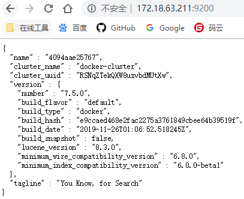

### 插件安装

安装ik 分词器
下载对应的版本：[elasticsearch-analysis-ik](https://github.com/medcl/elasticsearch-analysis-ik/releases)

为什么安装IK，轻量级。配置好词库也是可以用来中文分词，HanLP重量级，内置算法较多，不适合单独分词使用。

```
# 离线安装，下载对应插件zip
# https://github.com/medcl/elasticsearch-analysis-ik
docker cp /opt/elasticsearch-analysis-ik-7.6.2.zip elasticsearch:/opt
docker exec -it elasticsearch bash
cd plugins/
mkdir analysis-ik
unzip -d /usr/share/elasticsearch/plugins/analysis-ik/ /opt/elasticsearch-analysis-ik-7.6.2.zip 
exit
docker restart elasticsearch
```

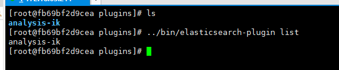

自定义词库

- 自定义字典
- 远程词库

参考：https://blog.csdn.net/qq_15973399/article/details/105793781

### 常用维护命令

```
# 查看所有索引信息
GET /_cat/indices?pretty
# 节点监控
GET /_cat/health?pretty
# 安装了哪些插件
GET _cat/plugins
123456
```

其他命令在用的时候再次整理，本文主要讲安装和部署。

## 监控和开发工具Kibana

Kibana 是为 Elasticsearch设计的开源分析和可视化平台。你可以使用 Kibana 来搜索，查看存储在 Elasticsearch 索引中的数据并与之交互。你可以很容易实现高级的数据分析和可视化，以图标的形式展现出来。

我们的服务器IP是`172.18.63.211`

```
docker run  --restart=always --link elasticsearch:elasticsearch --name kibana -p 5601:5601 -d kibana:7.6.2
```

进入容器修改配置文件`kibana.yml`

```
docker exec  -it kibana bash
vi config/kibana.yml
########################
# 指定es的地址
elasticsearch.hosts: ["http://172.17.59.5:9200"]
# 中文化
i18n.locale: "zh-CN"
# 修改外网访问 可选
server.host: "0.0.0.0"
exit
########################
docker restart kibana
```

打开地址：`http://172.18.63.211:5601`

测试分词工具

```
POST _analyze
{
  "text": "检测甘蓝型油菜抗磺酰脲类除草剂基因BnALS3R的引物与应用",
  "analyzer": "hanlp"
}
```

新增索引库

```
PUT achievement
{
  "settings": {
    "number_of_shards": 1,
    "number_of_replicas": 1
  }
}


PUT achievement/_mapping
{
  "properties": {
    "id": {
      "type": "text"
    },
    "owner": {
      "type": "text"
    },
    "title": {
      "type": "text",
      "analyzer": "hanlp"
    },
    "description": {
      "type": "text",
      "analyzer": "hanlp"
    },
    "update_time":{
      "type": "date"
    }
  }
}
```

## 数据同步Logstash

用于收集、解析和转换日志，同步数据等。

安装

```
docker pull logstash:7.5.0 
```

配置文件目录

```
mkdir -p /usr/local/logstash/config
cd /usr/local/logstash/config
touch logstash.yml
vi log4j2.properties
#####添加以下内容
logger.elasticsearchoutput.name = logstash.outputs.elasticsearch
logger.elasticsearchoutput.level = debug
#####
vi pipelines.yml
####
- pipeline.id: logstash-match
  path.config: "/usr/share/logstash/config/*.conf"
  pipeline.workers: 3
####
```

同时需要将MySQL的驱动包放入配置文件中。
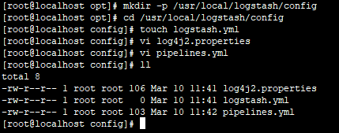

再创建配置文件即可
*这里给一个例子，是定时同步mysql数据到es中的。**

```
# logstash-mysql-es.conf
input{
  jdbc{
    jdbc_driver_class => "com.mysql.cj.jdbc.Driver"
    jdbc_connection_string => "jdbc:mysql://172.18.63.211:3306/open_intelligence?characterEncoding=utf8&serverTimezone=Asia/Shanghai"
    jdbc_user => "docker"
    jdbc_password => "docker@12345"
    jdbc_paging_enabled => true
    jdbc_page_size => 10000
    jdbc_fetch_size => 10000
    connection_retry_attempts => 3
    connection_retry_attempts_wait_time => 1
    jdbc_pool_timeout => 5
    use_column_value => true
    tracking_column => "update_time"
    tracking_column_type => "timestamp"
    record_last_run => true
    last_run_metadata_path => "/usr/share/logstash/mysql/goods_achievement"
    statement => "select * from goods_achievement where update_time > :sql_last_value"
    schedule => "* */30 * * * *"
  }
}

filter{
  mutate {
    split => { "feature1" => ";" }
  }
  mutate {
    split => { "feature2" => ";" }
  }
  mutate {
    split => { "feature3" => ";" }
  }
}

output {
  elasticsearch {
    document_id => "%{id}"
    index => "goods_achievement"
    hosts => ["http://172.18.63.211:9200"]
  }
}

```

启动

```
docker run -d -p 5044:5044 -p 9600:9600 -it \
-e TZ=Asia/Shanghai \
--name logstash --restart=always \
-v /usr/local/logstash/config/:/usr/share/logstash/config/ \
-v /usr/local/logstash/mysql/:/usr/share/logstash/mysql/ \
--privileged=true \
logstash:7.6.2

12345678
```

如果报错了

```
Error: com.mysql.cj.jdbc.Driver not loaded. :jdbc_driver_library is not set, are you sure you included the proper driver client libraries in your classpath?

12
```

可以尝试将驱动器即mysql-connector-java-xxxx-bin.jar拷贝到 logstash目录\logstash-core\lib\jars 下
如：

```
cd /usr/local/logstash/config
docker cp mysql-connector-java-8.0.17.jar logstash:/usr/share/logstash/logstash-core/lib/jars

123
```

检测配置文件

```
bin/logstash -f /usr/local/logstash/config/mysql-es-patent.conf -t
1
```

完成，你可以进行开发了。