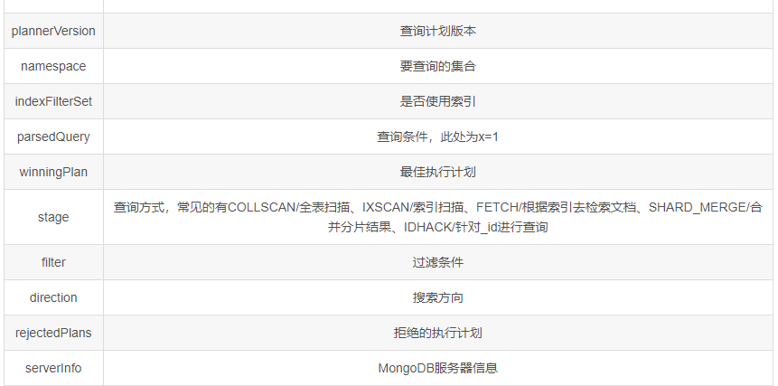
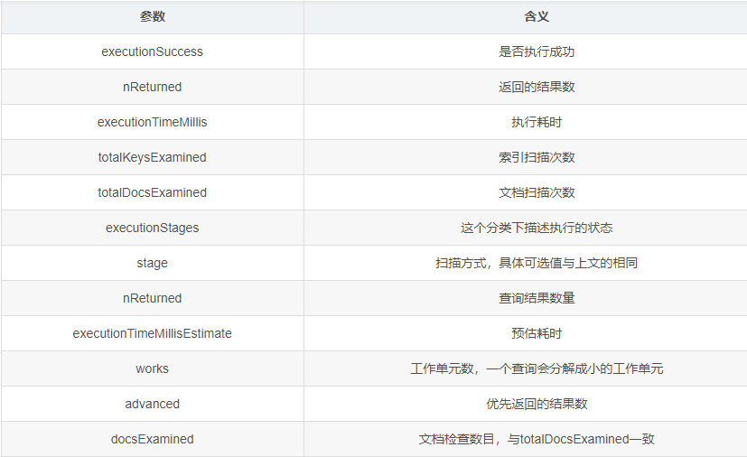

# MongoDB

## 简介

### MongoDB是什么？

1. MongoDB是由C++语言编写的，是一个基于分布式文件存储的开源数据库系统。 在高负载的情况下，添加更多的节点，可以保证服务器性能。 MongoDB旨在为WEB应用提供可扩展的高性能数据存储解决方案。
2. MongoDB将数据存储为一个文档，数据结构由键值(key=>value)对组成。 MongoDB文档类似于JSON对象。字段值可以包含其他文档，数组及文档数组。
2. MongoDB是一个介于关系数据库和非关系数据库之间的产品，是非关系数据库当中功能最丰富，最像关系数据库的。
2. Mongo最大的特点是它支持的查询语言非常强大，其语法有点类似于面向对象的查询语言，几乎可以实现类似关系数据库单表查询的绝大部分功能，而且还支持对数据建立索引。

### MongoDB有哪些特点？

1. MongoDB是一个面向文档存储的数据库，操作起来比较简单和容易。
2. 你可以在MongoDB记录中设置任何属性的索引 (如： FirstName=“Sameer”,Address=“8 Gandhi Road”)来实现更快的排序。
3. 你可以通过本地或者网络创建数据镜像，这使得MongoDB有更强的扩展性。
4. 如果负载的增加（需要更多的存储空间和更强的处理能力） ，它可以分布在计算机网络中的其他节点上这就是所谓的分片。
5. Mongo支持丰富的查询表达式。查询指令使用JSON形式的标记，可轻易查询文档中内嵌的对象及数组。
6. MongoDb使用update()命令可以实现替换完成的文档（数据）或者一些指定的数据字段 。
7. Mongodb中的Map/reduce主要是用来对数据进行批量处理和聚合操作。
8. Map和Reduce。 Map函数调用emit(key,value)遍历集合中所有的记录，将key与value传给Reduce函数进行处理。
9. Map函数和Reduce函数是使用Javascript编写的，并可以通过db.runCommand或mapreduce命令来执行MapReduce操作。
10. GridFS是MongoDB中的一个内置功能，可以用于存放大量小文件。
11. MongoDB允许在服务端执行脚本， 可以用Javascript编写某个函数，直接在服务端执行，也可以把函数的定义存储在服务端，下次直接调用即可。

### 文档的优点

- 文档（即对象）对应于许多编程语言中的本机数据类型。
- 嵌入式文档和数组减少了对昂贵连接的需求。
- 动态模式支持流畅的多态性。

### 集合

+ 集合就是一组文档，类似于关系数据库中的表。
+ 既然集合中可以存放任何类型的文档，那么为什么还需要使用多个集合？
  + 例如，对于网站的日志记录，可以根据日志的级别进行存储，
  + Info级别日志存放在Info 集合中，
  + Debug 级别日志存放在Debug 集合中，
+ 这样既方便了管理，也提供了查询性能。

### 数据库

​		一个MongoDB 实例可以承载多个数据库。它们之间可以看作相互独立，每个数据库都有独立的权限控制。在磁盘上，不同的数据库存放在不同的文件中。MongoDB 中存在以下系统数据库。

+ Admin 数据库：一个权限数据库，如果创建用户的时候将该用户添加到admin 数据库中，那么该用户就自动继承了所有数据库的权限。
+ Local 数据库：这个数据库永远不会被复制，可以用来存储本地单台服务器的任意集合。
+ Config 数据库：当MongoDB 使用分片模式时，config 数据库在内部使用，用于保存分片的信息。

### 数据模型

​		一个MongoDB 实例可以包含一组数据库，一个DataBase 可以包含一组Collection（集合），一个集合可以包含一组Document（文档）。一个Document包含一组field（字段），每一个字段都是一个key/value pair。

+ key: 必须为字符串类型。
+ value：可以包含如下类型。
  + 基本类型，例如，string，int，float，timestamp，binary 等类型。
  + 一个document。
  + 数组类型。

### 数据类型有哪些

- String：存储数据常用类型，仅支持UTF-8
- Integer：存储数字，根据服务器类型，可分为32位和64位
- Double：存储浮点数据
- Boolean：存储布尔值类型
- Object：用于内嵌文档
- Object ID：对象ID，用于创建文档ID
- Arrays：存储数组，将多个文档合并为一个ID
- Min/Max Keys：将一个值与Bson 元素的最高值和最低值进行对比
- Datetime：存储时间
- Code：代码类型，用于在文档中存储 Js 代码
- Regular Expression：正则表达式类型
- Binary Data：用于存储二进制数据
- Null：用于创建空文档

### 客户端对比

1.  Robo 3T (Robomong) 推荐
2. Navicat for MongoDB
3. MongoDB Compass：功能有限。免费简洁，不支持 SQL 查询

###  分析器

1. MongoDB中包括了一个可以显示数据库中每个操作性能特点的数据库分析器。
2. 通过这个分析器你可以找到比预期慢的查询(或写操作);利用这一信息，比如，可以确定是否需要添加索引。

### 名字空间

MongoDB存储BSON对象在丛集(collection)中。数据库名字和丛集名字以句点连结起来叫做名字空间(namespace)。

### 分片

​		分片是将数据水平切分到不同的物理节点。当应用数据越来越大的时候，数据量也会越来越大。当数据量增长时，单台机器有可能无法存储数据或可接受的读取写入吞吐量。利用分片技术可以添加更多的机器来应对数据量增加以及读写操作的要求

### “ObjectID”由哪些部分组成？

一共有四部分组成：时间戳、客户端ID、客户进程ID、三个字节的增量计数器。

_id是一个12字节长的十六进制数，它保证了每一个文档的唯一性。在插入文档时，需要提供_id。如果你不提供，那么MongoDB就会为每一文档提供一个唯一的id。_id的头4个字节代表的是当前的时间戳，接着的后3个字节表示的是机器id号，接着的2个字节表示MongoDB服务器进程id，最后的3个字节代表递增值。

### 聚合

聚合操作能够处理数据记录并返回计算结果。聚合操作能将多个文档中的值组合起来，对成组数据执行各种操作，返回单一的结果。它相当于 SQL 中的 count(*) 组合 group by。对于 MongoDB 中的聚合操作，应该使用aggregate()方法。

~~~bash
db.COLLECTION_NAME.aggregate(AGGREGATE_OPERATION)
~~~

### MongoDB中的副本集

​		在MongoDB中副本集由一组MongoDB实例组成，包括一个主节点多个次节点，MongoDB客户端的所有数据都写入主节点(Primary),副节点从主节点同步写入数据，以保持所有复制集内存储相同的数据，提高数据可用性

### MongoDB中的GridFS机制

​		GridFS是一种将大型文件存储在MongoDB中的文件规范。使用GridFS可以将大文件分隔成多个小文档存放，这样我们能够有效的保存大文档，而且解决了BSON对象有限制的问题

### 索引类型有哪些？

+ 单字段索引(Single Field Indexes)
+ 复合索引(Compound Indexes)
+ 多键索引(Multikey Indexes)
+ 全文索引(text Indexes)
+ Hash 索引(Hash Indexes)
+ 通配符索引(Wildcard Index)
+ 2dsphere索引(2dsphere Indexes)

### master或primary？

​		副本集只能有一个主节点能够确认写入操作来接收所有写操作，并记录其操作日志中的数据集的所有更改(记录在oplog中)。在集群中，当主节点（master）失效，Secondary节点会变为master

### 复制集节点类型有哪些？

- 优先级0型(Priority 0)节点
- 隐藏型(Hidden)节点
- 延迟型(Delayed)节点
- 投票型(Vote)节点以及不可投票节点

## Shell操作

### 插入操作

​		在MongoDB中，我们插入的每一条记录都是一个json字符串，这个json字符串我们称作文档，多个文档可以组成一个集合，这个文档就类似于我们关系型数据库中的一行数据，而集合就类似于关系型数据库中的一张表，集合也不用专门去创建，直接输入向哪个集合中插入数据即可，此时集合就会被自动的创建出来了。

​		当然我们也可以批量的添加文档，如下(批量添加一样也可以使用insert方法来完成)：

~~~bash
db.sang_collect.insertMany([{x:1},{x:2},{x:3}])
~~~

如果在插入某一个文档时出错，则其后面的文档就会插入失败，而在其之前已经插入的文档则不受影响，如下：

~~~bash
db.sang_collect.insertMany([{_id:99,x:99},{_id:99,x:98},{_id:97,x:97}])

~~~

### 查找操作

数据添加成功之后我们再来看看查询，利用db.sang.find()方法我们可以查看所有文档(所有记录)，如果只查看一个文档(一条记录)，可以通过db.sang.findOne()命令，在查看之前我先用一个for循环多插入几条数据，如下：

~~~js
for(var i=0; i<100; i++) db.sang_collect.insert({x:i})
~~~

然后分别调用find和findOne方法查看，如下：

~~~js
db.sang_collect.find() // 查找所有
db.sang_collect.findOne() // 查找第一个
~~~

### 修改操作

~~~js
db.sang_collect.update({x:1},{x:999})
~~~

### 删除操作

~~~js
db.sang_collect.remove({x:999})
~~~

### shell 其他操作

我们也可以将要执行的脚本放在一个js文件中，在使用shell脚本时指定要执行的js文件，如下：

~~~js
mongo ~/myjs.js
~~~

### 查看执行计划

#### 基本使用

~~~bash
db.sang_collect.find({x:1}).explain()
~~~

~~~json
{
    "queryPlanner" : {
        "plannerVersion" : 1,
        "namespace" : "sang.sang_collect",
        "indexFilterSet" : false,
        "parsedQuery" : {
            "x" : {
                "$eq" : 1.0
            }
        },
        "winningPlan" : {
            "stage" : "COLLSCAN",
            "filter" : {
                "x" : {
                    "$eq" : 1.0
                }
            },
            "direction" : "forward"
        },
        "rejectedPlans" : []
    },
    "serverInfo" : {
        "host" : "localhost.localdomain",
        "port" : 27017,
        "version" : "3.4.9",
        "gitVersion" : "876ebee8c7dd0e2d992f36a848ff4dc50ee6603e"
    },
    "ok" : 1.0
}

~~~

返回结果包含两大块信息，一个是 queryPlanner，即查询计划，还有一个是 serverInfo，即MongoDB服务的一些信息。

那么这里涉及到的参数比较多，我们来一一看一下：

#### 添加不同参数

`explain()` 也接收不同的参数，通过设置不同参数我们可以查看更详细的查询计划。

queryPlanner：是默认参数，添加queryPlanner参数的查询结果就是我们上文看到的查询结果，so，这里不再赘述。

executionStats：会返回最佳执行计划的一些统计信息，如下：

~~~json
{
    "queryPlanner" : {
        "plannerVersion" : 1,
        "namespace" : "sang.sang_collect",
        "indexFilterSet" : false,
        "parsedQuery" : {},
        "winningPlan" : {
            "stage" : "COLLSCAN",
            "direction" : "forward"
        },
        "rejectedPlans" : []
    },
    "executionStats" : {
        "executionSuccess" : true,
        "nReturned" : 10000,
        "executionTimeMillis" : 4,
        "totalKeysExamined" : 0,
        "totalDocsExamined" : 10000,
        "executionStages" : {
            "stage" : "COLLSCAN",
            "nReturned" : 10000,
            "executionTimeMillisEstimate" : 0,
            "works" : 10002,
            "advanced" : 10000,
            "needTime" : 1,
            "needYield" : 0,
            "saveState" : 78,
            "restoreState" : 78,
            "isEOF" : 1,
            "invalidates" : 0,
            "direction" : "forward",
            "docsExamined" : 10000
        }
    },
    "serverInfo" : {
        "host" : "localhost.localdomain",
        "port" : 27017,
        "version" : "3.4.9",
        "gitVersion" : "876ebee8c7dd0e2d992f36a848ff4dc50ee6603e"
    },
    "ok" : 1.0
}

~~~

这里除了我们上文介绍到的一些参数之外，还多了executionStats参数，含义如下：

### 索引

#### 创建索引

~~~js
db.sang_collect.getIndexes()
~~~

结果如下：

~~~json
[
    {
        "v" : 2,
        "key" : {
            "_id" : 1
        },
        "name" : "_id_",
        "ns" : "sang.sang_collect"
    }
]

~~~

我们看到这里只有一个索引，就是`_id`。

现在我的集合中有10000个文档，我想要查询 x 为1的文档，我的查询操作如下：

~~~js
db.sang_collect.find({x:1})
~~~

这种查询默认情况下会做全表扫描，我们可以用上篇文章介绍的`explain()`来查看一下查询计划，如下：

~~~json
{
    "queryPlanner" : {
    },
    "executionStats" : {
        "executionSuccess" : true,
        "nReturned" : 1,
        "executionTimeMillis" : 15,
        "totalKeysExamined" : 0,
        "totalDocsExamined" : 10000,
        "executionStages" : {
            "stage" : "COLLSCAN",
            "filter" : {
                "x" : {
                    "$eq" : 1.0
                }
            },
            "nReturned" : 1,
            "executionTimeMillisEstimate" : 29,
            "works" : 10002,
            "advanced" : 1,
            "needTime" : 10000,
            "needYield" : 0,
            "saveState" : 78,
            "restoreState" : 78,
            "isEOF" : 1,
            "invalidates" : 0,
            "direction" : "forward",
            "docsExamined" : 10000
        }
    },
    "serverInfo" : {
    },
    "ok" : 1.0
}

~~~

结果比较长，我摘取了关键的一部分。我们可以看到查询方式是全表扫描，一共扫描了10000个文档才查出来我要的结果。实际上我要的文档就排第二个，但是系统不知道这个集合中一共有多少个x为1的文档，所以会把全表扫描完，这种方式当然很低效，但是如果我加上 limit，如下：

~~~js
db.sang_collect.find({x:1}).limit(1)
~~~

此时再看查询计划发现只扫描了两个文档就有结果了，但是如果我要查询x为9999的记录，那还是得把全表扫描一遍，此时，我们就可以给该字段建立索引，索引建立方式如下：

~~~js
db.sang_collect.ensureIndex({x:1})
~~~

这个查询计划过长我就不贴出来了，我们可以重点关注查询要耗费的时间大幅度下降。

此时调用getIndexes()方法可以看到我们刚刚创建的索引，如下：

~~~js

[
    {
        "v" : 2,
        "key" : {
            "_id" : 1
        },
        "name" : "_id_",
        "ns" : "sang.sang_collect"
    },
    {
        "v" : 2,
        "key" : {
            "x" : 1.0
        },
        "name" : "x_1",
        "ns" : "sang.sang_collect"
    }
]

~~~

我们看到每个索引都有一个名字，默认的索引名字为字段名_排序值，当然我们也可以在创建索引时自定义索引名字，如下：

~~~js
db.sang_collect.ensureIndex({x:1},{name:"myfirstindex"})
~~~

此时创建好的索引如下：

~~~js
{
    "v" : 2,
    "key" : {
        "x" : 1.0
    },
    "name" : "myfirstindex",
    "ns" : "sang.sang_collect"
}
~~~

当然索引在创建的过程中还有许多其他可选参数，如下：

~~~js
db.sang_collect.ensureIndex({x:1},{name:"myfirstindex",dropDups:true,background:true,unique:true,sparse:true,v:1,weights:99999})
~~~

参数说明

~~~js
1.name表示索引的名称
2.dropDups表示创建唯一性索引时如果出现重复，则将重复的删除，只保留第一个
3.background是否在后台创建索引，在后台创建索引不影响数据库当前的操作，默认为false
4.unique是否创建唯一索引，默认false
5.sparse对文档中不存在的字段是否不起用索引，默认false
6.v表示索引的版本号，默认为2
7.weights表示索引的权重
~~~

此时创建好的索引如下：

~~~js
{
    "v" : 1,
    "unique" : true,
    "key" : {
        "x" : 1.0
    },
    "name" : "myfirstindex",
    "ns" : "sang.sang_collect",
    "background" : true,
    "sparse" : true,
    "weights" : 99999.0
}

~~~

####  查看索引

~~~s
db.sang_collect.totalIndexSize()
~~~

#### 删除索引

1. 删除单个索引

~~~js
db.sang_collect.dropIndex("xIndex")
~~~

2. 删除全部索引

~~~js
db.sang_collect.dropIndexes()
~~~

#### 总结

索引是个好东西，可以有效的提高查询速度，但是索引会降低插入、更新和删除的速度，因为这些操作不仅要更新文档，还要更新索引，MongoDB) 限制每个集合上最多有64个索引，我们在创建索引时要仔细斟酌索引的字段。

## 面试

### 如果用户移除对象的属性，该属性是否从存储层中删除?

是的，用户移除属性然后对象会重新保存(re-save())。

### 能否使用日志特征进行安全备份?

是的。

### 允许空值null吗?

对于对象成员而言，是的。然而用户不能够添加空值(null)到数据库丛集(collection)因为空值不是对象。然而用户能够添加空对象{}。

### 更新操作立刻fsync到磁盘?
不会，磁盘写操作默认是延迟执行的。写操作可能在两三秒(默认在60秒内)后到达磁盘。例如，如果一秒内数据库收到一千个对一个对象递增的操作，仅刷新磁盘一次。(注意，尽管fsync选项在命令行和经过getLastError_old是有效的)(译者：也许是坑人的面题?)。

### 如何执行事务/加锁?
MongoDB没有使用传统的锁或者复杂的带回滚的事务，因为它设计的宗旨是轻量，快速以及可预计的高性能。可以把它类比成MySQLMylSAM的自动提交模式。通过精简对事务的支持，性能得到了提升，特别是在一个可能会穿过多个服务器的系统里。

### 为什么我的数据文件如此庞大?

MongoDB会积极的预分配预留空间来防止文件系统碎片。

### 启用备份故障恢复需要多久?

​		从备份数据库声明主数据库宕机到选出一个备份数据库作为新的主数据库将花费10到30秒时间。这期间在主数据库上的操作将会失败–包括写入和强一致性读取(strong consistent read)操作。然而，你还能在第二数据库上执行最终一致性查询(eventually consistent query)(在slaveOk模式下)，即使在这段时间里。

### 什么是master或primary?

​		它是当前备份集群(replica set)中负责处理所有写入操作的主要节点/成员。在一个备份集群中，当失效备援(failover)事件发生时，一个另外的成员会变成primary。

### 什么是secondary或slave?

Seconday从当前的primary上复制相应的操作。它是通过跟踪复制oplog(local.oplog.rs)做到的。

### 我必须调用getLastError来确保写操作生效了么?

不用。不管你有没有调用getLastError(又叫"Safe Mode")服务器做的操作都一样。调用getLastError只是为了确认写操作成功提交了。当然，你经常想得到确认，但是写操作的安全性和是否生效不是由这个决定的。

### 我应该启动一个集群分片(sharded)还是一个非集群分片的 MongoDB环境?

为开发便捷起见，我们建议以非集群分片(unsharded)方式开始一个MongoDB环境，除非一台服务器不足以存放你的初始数据集。从非集群分片升级到集群分片(sharding)是无缝的，所以在你的数据集还不是很大的时候没必要考虑集群分片(sharding)。

### 分片(sharding)和复制(replication)是怎样工作的?

每一个分片(shard)是一个分区数据的逻辑集合。分片可能由单一服务器或者集群组成，我们推荐为每一个分片(shard)使用集群。

### 数据在什么时候才会扩展到多个分片(shard)里?

MongoDB分片是基于区域(range)的。所以一个集合(collection)中的所有的对象都被存放到一个块(chunk)中。只有当存在多余一个块的时候，才会有多个分片获取数据的选项。现在，每个默认块的大小是64Mb，所以你需要至少64Mb空间才可以实施一个迁移。

### 当我试图更新一个正在被迁移的块(chunk)上的文档时会发生什么?

更新操作会立即发生在旧的分片(shard)上，然后更改才会在所有权转移(ownership transfers)前复制到新的分片上。

### 如果在一个分片(shard)停止或者很慢的时候，我发起一个查询会怎样?
如果一个分片(shard)停止了，除非查询设置了“Partial”选项，否则查询会返回一个错误。如果一个分片(shard)响应很慢，MongoDB则会等待它的响应。

### 我可以把moveChunk目录里的旧文件删除吗?
没问题，这些文件是在分片(shard)进行均衡操作(balancing)的时候产生的临时文件。一旦这些操作已经完成，相关的临时文件也应该被删除掉。但目前清理工作是需要手动的，所以请小心地考虑再释放这些文件的空间。

### 我怎么查看 Mongo 正在使用的链接?
db._adminCommand(“connPoolStats”);

### 如果块移动操作(moveChunk)失败了，我需要手动清除部分转移的文档吗?

不需要，移动操作是一致(consistent)并且是确定性的(deterministic);一次失败后，移动操作会不断重试;当完成后，数据只会出现在新的分片里(shard)。

### 如果我在使用复制技术(replication)，可以一部分使用日志(journaling)而其他部分则不使用吗?
可以。

### 当更新一个正在被迁移的块（Chunk）上的文档时会发生什么？
答：

更新操作会立即发生在旧的块（Chunk）上，然后更改才会在所有权转移前复制到新的分片上。

### MongoDB在A:{B,C}上建立索引，查询A:{B,C}和A:{C,B}都会使用索引吗？
不会，只会在A:{B,C}上使用索引。

### 如果一个分片（Shard）停止或很慢的时候，发起一个查询会怎样？
如果一个分片停止了，除非查询设置了“Partial”选项，否则查询会返回一个错误。如果一个分片响应很慢，MongoDB会等待它的响应。

### MongoDB支持存储过程吗？如果支持的话，怎么用？

MongoDB支持存储过程，它是javascript写的，保存在db.system.js表中。

### 如何理解MongoDB中的GridFS机制，MongoDB为何使用GridFS来存储文件？
GridFS是一种将大型文件存储在MongoDB中的文件规范。使用GridFS可以将大文件分隔成多个小文档存放，这样我们能够有效的保存大文档，而且解决了BSON对象有限制的问题。

### 