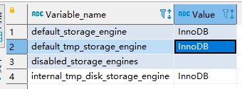

# MySql 实操

## 索引

### 建表

~~~sql
create database demo_01 default charset=utf8mb4;
use demo_01;
CREATE TABLE `city` (
`city_id` int(11) NOT NULL AUTO_INCREMENT,
`city_name` varchar(50) NOT NULL,
`country_id` int(11) NOT NULL,
PRIMARY KEY (`city_id`)
) ENGINE=InnoDB DEFAULT CHARSET=utf8;
CREATE TABLE `country` (
`country_id` int(11) NOT NULL AUTO_INCREMENT,
`country_name` varchar(100) NOT NULL,
PRIMARY KEY (`country_id`)
) ENGINE=InnoDB DEFAULT CHARSET=utf8;
insert into `city` (`city_id`, `city_name`, `country_id`) values(1,'西安',1);
insert into `city` (`city_id`, `city_name`, `country_id`) values(2,'NewYork',2);
insert into `city` (`city_id`, `city_name`, `country_id`) values(3,'北京',1);
insert into `city` (`city_id`, `city_name`, `country_id`) values(4,'上海',1);
insert into `country` (`country_id`, `country_name`) values(1,'China');
insert into `country` (`country_id`, `country_name`) values(2,'America');
insert into `country` (`country_id`, `country_name`) values(3,'Japan');
insert into `country` (`country_id`, `country_name`) values(4,'UK');
~~~


### 建索引

~~~sql
create index idx_city_name on city(city_name);
~~~


### 查看索引

~~~sql
show index from city;
~~~


### 删除索引

~~~sql
DROP INDEX idx_city_name ON city;
~~~


### ALTER命令

~~~sql
1). alter table tb_name add primary key(column_list);
--该语句添加一个主键，这意味着索引值必须是唯一的，且不能为NULL
2). alter table tb_name add unique index_name(column_list);
--这条语句创建索引的值必须是唯一的（除了NULL外，NULL可能会出现多次）
3). alter table tb_name add index index_name(column_list);
--添加普通索引， 索引值可以出现多次。
4). alter table tb_name add fulltext index_name(column_list);
--该语句指定了索引为FULLTEXT， 用于全文索引
~~~


## 存储引擎

### 显示所有存储引擎

~~~sql
show engines;
~~~


1. 创建新表时如果不指定存储引擎，那么系统就会使用默认的存储引擎，MySQL5.5之前的默认存储引擎是MyISAM，5.5之后就改为了InnoDB。

### 查看Mysql默认的存储引擎

 指令 ：

~~~~sql
show variables like '%storage_engine%';
~~~~




### innodb 事务

~~~sql
create table goods_innodb(
    id int NOT NULL AUTO_INCREMENT,
    name varchar(20) NOT NULL,
    primary key(id)
)ENGINE=innodb DEFAULT CHARSET=utf8;
~~~

开启事务

~~~sql
start transaction;
insert into goods_innodb(id,name)values(null,'Meta21');
commit;
~~~


## Sql优化

### 查看SQL执行频率

~~~sql
show status like 'Com_______';
~~~


### 查看存储引擎的状态

~~~sql
show status like 'Innodb_rows_%';
~~~


### 定位低效率执行SQL

~~~sql
show processlist
~~~

慢查询日志在查询结束以后才纪录，所以在应用反映执行效率出现问题的时候查询慢查询日志并不能定位问题，可以使用show processlist命令查看当前MySQL在进行的线程，包括线程的状态、是否锁表等，可以实时地查看 SQL 的执行情况，同时对一些锁表操作进行优化。


## Explain 概述

### 批量插入一百万数据

~~~sql
create table tb_item(
	item_id int NOT NULL AUTO_INCREMENT,
	item_name varchar(100) not null,
	item_price int not null,
	primary key(item_id)
)engine=InnoDB default charset=utf8;
 
delimiter $
 
create procedure pro_item_insert()
begin
   declare num int(11) default 1000000;
   ins:loop
   if num<=0 then
   leave ins;
   end if;
   insert into tb_item values(null,'小米mix',num);
   set num = num -1;
   end loop ins;
end$
 
delimiter ;
 
call pro_item_insert();
~~~


### explain

~~~sql
explain select * from tb_item where item_id = 1;
~~~


~~~sql
explain select * from tb_item where item_price = 987378;
~~~


	## Explain 详细

### 环境准备

~~~sql
CREATE TABLE `t_role` (
    `id` varchar(32) NOT NULL,
    `role_name` varchar(255) DEFAULT NULL,
    `role_code` varchar(255) DEFAULT NULL,
    `description` varchar(255) DEFAULT NULL,
    PRIMARY KEY (`id`),
    UNIQUE KEY `unique_role_name` (`role_name`)
) ENGINE=InnoDB DEFAULT CHARSET=utf8;
 
CREATE TABLE `t_user` (
    `id` varchar(32) NOT NULL,
    `username` varchar(45) NOT NULL,
    `password` varchar(96) NOT NULL,
    `name` varchar(45) NOT NULL,
    PRIMARY KEY (`id`),
    UNIQUE KEY `unique_user_username` (`username`)
) ENGINE=InnoDB DEFAULT CHARSET=utf8;
 
CREATE TABLE `user_role` (
    `id` int(11) NOT NULL auto_increment ,
    `user_id` varchar(32) DEFAULT NULL,
    `role_id` varchar(32) DEFAULT NULL,
    PRIMARY KEY (`id`),
    KEY `fk_ur_user_id` (`user_id`),
    KEY `fk_ur_role_id` (`role_id`),
    CONSTRAINT `fk_ur_role_id` FOREIGN KEY (`role_id`) REFERENCES `t_role` (`id`) ON DELETE NO ACTION ON UPDATE NO ACTION,
    CONSTRAINT `fk_ur_user_id` FOREIGN KEY (`user_id`) REFERENCES `t_user` (`id`) ON DELETE NO ACTION ON UPDATE NO ACTION
) ENGINE=InnoDB DEFAULT CHARSET=utf8;
~~~


~~~sql
insert into `t_user` (`id`, `username`, `password`, `name`) values('1','super','$2a$10$TJ4TmCdK.X4wv/tCqHW14.w70U3CC33CeVncD3SLmyMXMknstqKRe','超级管理员');
insert into `t_user` (`id`, `username`, `password`, `name`) values('2','admin','$2a$10$TJ4TmCdK.X4wv/tCqHW14.w70U3CC33CeVncD3SLmyMXMknstqKRe','系统管理员');
insert into `t_user` (`id`, `username`, `password`, `name`) values('3','itcast','$2a$10$8qmaHgUFUAmPR5pOuWhYWOr291WJYjHelUlYn07k5ELF8ZCrW0Cui','test02');
insert into `t_user` (`id`, `username`, `password`, `name`) values('4','stu1','$2a$10$pLtt2KDAFpwTWLjNsmTEi.oU1yOZyIn9XkziK/y/spH5rftCpUMZa','学生1');
insert into `t_user` (`id`, `username`, `password`, `name`) values('5','stu2','$2a$10$nxPKkYSez7uz2YQYUnwhR.z57km3yqKn3Hr/p1FR6ZKgc18u.Tvqm','学生2');
insert into `t_user` (`id`, `username`, `password`, `name`) values('6','t1','$2a$10$TJ4TmCdK.X4wv/tCqHW14.w70U3CC33CeVncD3SLmyMXMknstqKRe','老师1');
 
INSERT INTO `t_role` (`id`, `role_name`, `role_code`, `description`) VALUES('5','学生','student','学生');
INSERT INTO `t_role` (`id`, `role_name`, `role_code`, `description`) VALUES('7','老师','teacher','老师');
INSERT INTO `t_role` (`id`, `role_name`, `role_code`, `description`) VALUES('8','教学管理员','teachmanager','教学管理员');
INSERT INTO `t_role` (`id`, `role_name`, `role_code`, `description`) VALUES('9','管理员','admin','管理员');
INSERT INTO `t_role` (`id`, `role_name`, `role_code`, `description`) VALUES('10','超级管理员','super','超级管理员');
 
INSERT INTO user_role(id,user_id,role_id) VALUES(NULL, '1', '5'),(NULL, '1', '7'),
(NULL, '2', '8'),(NULL, '3', '9'),(NULL, '4', '8'),(NULL, '5', '10') ;
~~~


### explain 之 id

**id 字段是 select查询的序列号，是一组数字，表示的是查询中执行select子句或者是操作表的顺序。**id 情况有三种：

* id 相同表示加载表的顺序是从上到下

  ~~~sql
  explain
  select
      *
  from
      t_role r,
      t_user u,
      user_role ur
  where
      r.id = ur.role_id
      and u.id = ur.user_id;
  ~~~

  ~~~sql
  mysql> explain select * from t_role r, t_user u, user_role ur where r.id = ur.role_id and u.id = ur.user_id ;
  +----+-------------+-------+--------+-----------------------------+---------------+---------+--------------------+------+-------------+
  | id | select_type | table | type   | possible_keys               | key           | key_len | ref                | rows | Extra       |
  +----+-------------+-------+--------+-----------------------------+---------------+---------+--------------------+------+-------------+
  |  1 | SIMPLE      | r     | ALL    | PRIMARY                     | NULL          | NULL    | NULL               |    5 | NULL        |
  |  1 | SIMPLE      | ur    | ref    | fk_ur_user_id,fk_ur_role_id | fk_ur_role_id | 99      | demo_02.r.id       |    1 | Using where |
  |  1 | SIMPLE      | u     | eq_ref | PRIMARY                     | PRIMARY       | 98      | demo_02.ur.user_id |    1 | NULL        |
  +----+-------------+-------+--------+-----------------------------+---------------+---------+--------------------+------+-------------+
  ~~~

*  **id 不同id值越大，优先级越高，越先被执行。**

  ~~~sql
  EXPLAIN
  SELECT
      *
  FROM
      t_role
  WHERE
      id = (
          SELECT
              role_id
          FROM
              user_role
          WHERE
              user_id = (
                  SELECT
                      id
                  FROM
                      t_user
                  WHERE
                      username = 'stu1'
              )
      );
  ~~~

  ~~~sql
  mysql> EXPLAIN SELECT * FROM t_role WHERE id = (SELECT role_id FROM user_role WHERE user_id= (SELECT id FROM t_user WHERE username = 'stu1'));
  +----+-------------+-----------+-------+----------------------+----------------------+---------+-------+------+-------------+
  | id | select_type | table     | type  | possible_keys        | key                  | key_len | ref   | rows | Extra       |
  +----+-------------+-----------+-------+----------------------+----------------------+---------+-------+------+-------------+
  |  1 | PRIMARY     | t_role    | const | PRIMARY              | PRIMARY              | 98      | const |    1 | NULL        |
  |  2 | SUBQUERY    | user_role | ref   | fk_ur_user_id        | fk_ur_user_id        | 99      | const |    1 | Using where |
  |  3 | SUBQUERY    | t_user    | const | unique_user_username | unique_user_username | 137     | const |    1 | Using index |
  +----+-------------+-----------+-------+----------------------+----------------------+---------+-------+------+-------------+
  ~~~

*  **id 有相同，也有不同，同时存在。id相同的可以认为是一组，从上往下顺序执行；在所有的组中，id的值越大，优先级越高，越先执行。**

  ~~~sql
  EXPLAIN
  SELECT
      *
  FROM
      t_role r,
      (
          SELECT
              *
          FROM
              user_role ur
          WHERE
              ur.`user_id` = '2'
      ) a
  WHERE
      r.id = a.role_id;
  ~~~

  ~~~sql
  mysql> EXPLAIN SELECT * FROM t_role r , (SELECT * FROM user_role ur WHERE ur.`user_id` ='2') a WHERE r.id = a.role_id ;
  +----+-------------+------------+--------+---------------+---------------+---------+-----------+------+-----------------------+
  | id | select_type | table      | type   | possible_keys | key           | key_len | ref       | rows | Extra                 |
  +----+-------------+------------+--------+---------------+---------------+---------+-----------+------+-----------------------+
  |  1 | PRIMARY     | <derived2> | ALL    | NULL          | NULL          | NULL    | NULL      |    2 | Using where           |
  |  1 | PRIMARY     | r          | eq_ref | PRIMARY       | PRIMARY       | 98      | a.role_id |    1 | NULL                  |
  |  2 | DERIVED     | ur         | ref    | fk_ur_user_id | fk_ur_user_id | 99      | const     |    1 | Using index condition |
  +----+-------------+------------+--------+---------------+---------------+---------+-----------+------+-----------------------+
  ~~~

### explain 之 select_type

表示 SELECT 的类型，常见的取值，如下表所示：


### explain 之 table

展示这一行的数据是关于哪一张表的

###  explain 之 type

**type 显示的是访问类型**，是较为重要的一个指标，可取值为：


结果值从最好到最坏依次是：

~~~sql
NULL > system > const > eq_ref > ref > fulltext > ref_or_null > index_merge >unique_subquery > index_subquery > range > index > ALL
 
system > const > eq_ref > ref > range > index > ALL
~~~

**一般来说， 我们需要保证查询至少达到 range 级别， 最好达到ref 。**


### explain 之 key

+ possible_keys : 显示可能应用在这张表的索引， 一个或多个。
+ key ： 实际使用的索引， 如果为NULL， 则没有使用索引。
+ key_len : 表示索引中使用的字节数， 该值为索引字段最大可能长度，并非实际使用长度，在不损失精确性的前提下， 长度越短越好 。


### explain 之 rows

扫描行的数量。


### explain 之 extra

其他的额外的执行计划信息，在该列展示 。


## show profile分析SQL

​		Mysql从5.0.37版本开始增加了对 show profiles 和 show profile 语句的支持。show profiles 能够在做SQL优化时帮助我们了解时间都耗费到哪里去了。
​		通过 have_profiling 参数，能够看到当前MySQL是否支持profile：

~~~sql
select @@have_profiling;
~~~

~~~sql
mysql> select @@have_profiling;
+------------------+
| @@have_profiling |
+------------------+
| YES              |
+------------------+
~~~

**默认profiling是关闭的**，可以通过set语句在Session级别开启profiling：

~~~sql
mysql> select @@profiling;
+-------------+
| @@profiling |
+-------------+
|           0 |
+-------------+
1 row in set, 1 warning (0.00 sec)
 
mysql> set profiling=1;
Query OK, 0 rows affected, 1 warning (0.00 sec)
~~~

**通过profile，我们能够更清楚地了解SQL执行的过程。**
首先，我们可以执行一系列的操作，如下图所示：

~~~sql
show databases;
use demo_02;
show tables;
select * from tb_item where item_id < 5;
select count(*) from tb_item;
~~~

执行完上述命令之后，再执行**show profiles** 指令， 来查看SQL语句执行的耗时：

~~~sql
mysql> show profiles;
+----------+------------+-----------------------------------------+
| Query_ID | Duration   | Query                                   |
+----------+------------+-----------------------------------------+
|        1 | 0.00030250 | show databases                          |
|        2 | 0.00008200 | SELECT DATABASE()                       |
|        3 | 0.00021275 | show tables                             |
|        4 | 0.00032600 | select * from tb_item where item_id < 5 |
|        5 | 0.27474850 | select count(*) from tb_item            |
+----------+------------+-----------------------------------------+
~~~

通过**show profile for query query_id** 语句可以查看到该SQL执行过程中每个线程的状态和消耗的时间：

~~~sql
mysql> show profile for query 5;
+----------------------+----------+
| Status               | Duration |
+----------------------+----------+
| starting             | 0.000040 |
| checking permissions | 0.000005 |
| Opening tables       | 0.000016 |
| init                 | 0.000012 |
| System lock          | 0.000007 |
| optimizing           | 0.000005 |
| statistics           | 0.000011 |
| preparing            | 0.000009 |
| executing            | 0.000003 |
| Sending data         | 0.274468 |
| end                  | 0.000015 |
| query end            | 0.000006 |
| closing tables       | 0.000012 |
| freeing items        | 0.000124 |
| cleaning up          | 0.000016 |
+----------------------+----------+
15 rows in set, 1 warning (0.01 sec)
~~~

注意：Sending data 状态表示MySQL线程开始访问数据行并把结果返回给客户端，而不仅仅是返回个客户端。由于在Sending data状态下，MySQL线程往往需要做大量的磁盘读取操作，所以经常是整个查询中耗时最长的状态。

在获取到最消耗时间的线程状态后，MySQL支持进一步选择all、cpu、block io 、context switch、page faults等明细类型类查看MySQL在使用什么资源上耗费了过高的时间。例如，选择查看CPU的耗费时间 ：

~~~sql
mysql> show profile cpu for query 5;
+----------------------+----------+----------+------------+
| Status               | Duration | CPU_user | CPU_system |
+----------------------+----------+----------+------------+
| starting             | 0.000040 | 0.000000 |   0.000000 |
| checking permissions | 0.000005 | 0.000000 |   0.000000 |
| Opening tables       | 0.000016 | 0.000000 |   0.000000 |
| init                 | 0.000012 | 0.000000 |   0.000000 |
| System lock          | 0.000007 | 0.000000 |   0.000000 |
| optimizing           | 0.000005 | 0.000000 |   0.000000 |
| statistics           | 0.000011 | 0.000000 |   0.000000 |
| preparing            | 0.000009 | 0.000000 |   0.000000 |
| executing            | 0.000003 | 0.000000 |   0.000000 |
| Sending data         | 0.274468 | 0.266960 |   0.006999 |
| end                  | 0.000015 | 0.000000 |   0.000000 |
| query end            | 0.000006 | 0.000000 |   0.000000 |
| closing tables       | 0.000012 | 0.000000 |   0.000000 |
| freeing items        | 0.000124 | 0.000000 |   0.000000 |
| cleaning up          | 0.000016 | 0.000000 |   0.000000 |
+----------------------+----------+----------+------------+
15 rows in set, 1 warning (0.00 sec)
~~~


## 索引的使用

### 验证索引提升查询效率

~~~sql
select * from tb_item where item_id = 1999;
~~~

查询速度很快， 接近0s ， **主要的原因是因为id为主键， 有索引；**

~~~sql
select * from tb_item where item_price=998002;
~~~

查看SQL语句的执行计划 ：

~~~sql
mysql> explain select * from tb_item where item_price=998002;
*************************** 1. row ***************************
           id: 1
  select_type: SIMPLE
        table: tb_item
         type: ALL
possible_keys: NULL
          key: NULL
      key_len: NULL
          ref: NULL
         rows: 998187
        Extra: Using where
1 row in set (0.00 sec)
~~~

处理方案 ， 针对item_price字段， 创建索引 ：

~~~sql
create index idx_item_price on tb_item(item_price);
~~~

查询是否创建成功索引： 

~~~sql
mysql> mysql> show index from tb_item;
+---------+------------+----------------+--------------+-------------+-----------+-------------+----------+--------+------+------------+---------+---------------+
| Table   | Non_unique | Key_name       | Seq_in_index | Column_name | Collation | Cardinality | Sub_part | Packed | Null | Index_type | Comment | Index_comment |
+---------+------------+----------------+--------------+-------------+-----------+-------------+----------+--------+------+------------+---------+---------------+
| tb_item |          0 | PRIMARY        |            1 | item_id     | A         |      998187 |     NULL | NULL   |      | BTREE      |         |               |
| tb_item |          1 | idx_item_price |            1 | item_price  | A         |      998187 |     NULL | NULL   |      | BTREE      |         |               |
+---------+------------+----------------+--------------+-------------+-----------+-------------+----------+--------+------+------------+---------+---------------+
~~~

索引创建完成之后，再次进行查询 ：

```sql
mysql> select * from tb_item where item_price=998002 \G;
*************************** 1. row ***************************
   item_id: 1999
 item_name: 小米mix
item_price: 998002
1 row in set (0.00 sec)
```

发现耗费的时间也是接近0秒就出来了，然后通过explain进行分析，看是否使用了索引：

~~~sql
mysql> explain select * from tb_item where item_price=998002;
+----+-------------+---------+------+----------------+----------------+---------+-------+------+-------+
| id | select_type | table   | type | possible_keys  | key            | key_len | ref   | rows | Extra |
+----+-------------+---------+------+----------------+----------------+---------+-------+------+-------+
|  1 | SIMPLE      | tb_item | ref  | idx_item_price | idx_item_price | 4       | const |    1 | NULL  |
+----+-------------+---------+------+----------------+----------------+---------+-------+------+-------+
~~~


### 索引的使用

#### 准备环境

~~~sql

create table `tb_seller` (
    `sellerid` varchar (100),
    `name` varchar (100),
    `nickname` varchar (50),
    `password` varchar (60),
    `status` varchar (1),
    `address` varchar (100),
    `createtime` datetime,
    primary key(`sellerid`)
) engine = innodb default charset = utf8mb4;
 
insert into `tb_seller` (`sellerid`, `name`, `nickname`, `password`, `status`,`address`, `createtime`) values('alibaba','阿里巴巴','阿里小店','e10adc3949ba59abbe56e057f20f883e','1','北京市','2088-01-01 12:00:00');
insert into `tb_seller` (`sellerid`, `name`, `nickname`, `password`, `status`,`address`, `createtime`) values('baidu','百度科技有限公司','百度小店','e10adc3949ba59abbe56e057f20f883e','1','北京市','2088-01-01 12:00:00');
insert into `tb_seller` (`sellerid`, `name`, `nickname`, `password`, `status`,`address`, `createtime`) values('huawei','华为科技有限公司','华为小店','e10adc3949ba59abbe56e057f20f883e','0','北京市','2088-01-01 12:00:00');
insert into `tb_seller` (`sellerid`, `name`, `nickname`, `password`, `status`,`address`, `createtime`) values('itcast','传智播客教育科技有限公司','传智播客','e10adc3949ba59abbe56e057f20f883e','1','北京市','2088-01-01 12:00:00');
insert into `tb_seller` (`sellerid`, `name`, `nickname`, `password`, `status`,`address`, `createtime`) values('itheima','黑马程序员','黑马程序员','e10adc3949ba59abbe56e057f20f883e','0','北京市','2088-01-01 12:00:00');
insert into `tb_seller` (`sellerid`, `name`, `nickname`, `password`, `status`,`address`, `createtime`) values('luoji','罗技科技有限公司','罗技小店','e10adc3949ba59abbe56e057f20f883e','1','北京市','2088-01-01 12:00:00');
insert into `tb_seller` (`sellerid`, `name`, `nickname`, `password`, `status`,`address`, `createtime`) values('oppo','OPPO科技有限公司','OPPO官方旗舰店','e10adc3949ba59abbe56e057f20f883e','0','北京市','2088-01-01 12:00:00');
insert into `tb_seller` (`sellerid`, `name`, `nickname`, `password`, `status`,`address`, `createtime`) values('ourpalm','掌趣科技股份有限公司','掌趣小店','e10adc3949ba59abbe56e057f20f883e','1','北京市','2088-01-01 12:00:00');
insert into `tb_seller` (`sellerid`, `name`, `nickname`, `password`, `status`,`address`, `createtime`) values('qiandu','千度科技','千度小店','e10adc3949ba59abbe56e057f20f883e','2','北京市','2088-01-01 12:00:00');
insert into `tb_seller` (`sellerid`, `name`, `nickname`, `password`, `status`,`address`, `createtime`) values('sina','新浪科技有限公司','新浪官方旗舰店','e10adc3949ba59abbe56e057f20f883e','1','北京市','2088-01-01 12:00:00');
insert into `tb_seller` (`sellerid`, `name`, `nickname`, `password`, `status`,`address`, `createtime`) values('xiaomi','小米科技','小米官方旗舰店','e10adc3949ba59abbe56e057f20f883e','1','西安市','2088-01-01 12:00:00');
insert into `tb_seller` (`sellerid`, `name`, `nickname`, `password`, `status`,`address`, `createtime`) values('yijia','宜家家居','宜家家居旗舰店','e10adc3949ba59abbe56e057f20f883e','1','北京市','2088-01-01 12:00:00');
 
--创建复合索引
create index idx_seller_name_sta_addr on tb_seller(name,status,address);
~~~

#### 避免索引失效

1. **全值匹配 ，对索引中所有列都指定具体值。**该情况下，索引生效，执行效率高。

   ~~~sql
   explain
   select
       *
   from
       tb_seller
   where
       name = '小米科技'
       and status = '1'
       and address = '北京市';
   ~~~

   ~~~sql
   mysql> explain select * from tb_seller where name='小米科技' and status='1' and address='北京市';
   +----+-------------+-----------+------+--------------------------+--------------------------+---------+-------------------+------+-----------------------+
   | id | select_type | table     | type | possible_keys            | key                      | key_len | ref               | rows | Extra                 |
   +----+-------------+-----------+------+--------------------------+--------------------------+---------+-------------------+------+-----------------------+
   |  1 | SIMPLE      | tb_seller | ref  | idx_seller_name_sta_addr | idx_seller_name_sta_addr | 813     | const,const,const |    1 | Using index condition |
   +----+-------------+-----------+------+--------------------------+--------------------------+---------+-------------------+------+-----------------------+
   ~~~

2.  **最左前缀法则**，**如果索引了多列，要遵守最左前缀法则。指的是查询从索引的最左前列开始，并且不跳过索引中的列。**

   ~~~sql
   mysql> explain select * from tb_seller where name='小米科技';
   +----+-------------+-----------+------+--------------------------+--------------------------+---------+-------+------+-----------------------+
   | id | select_type | table     | type | possible_keys            | key                      | key_len | ref   | rows | Extra                 |
   +----+-------------+-----------+------+--------------------------+--------------------------+---------+-------+------+-----------------------+
   |  1 | SIMPLE      | tb_seller | ref  | idx_seller_name_sta_addr | idx_seller_name_sta_addr | 403     | const |    1 | Using index condition |
   +----+-------------+-----------+------+--------------------------+--------------------------+---------+-------+------+-----------------------+
   ~~~

   **上面的sql是会走索引的，我们可以看到key_len是403，这就是name的索引长度。**

   同理，下面的语句也会走索引：

   ~~~sql
   mysql> explain select * from tb_seller where name='小米科技' and status='1';
   +----+-------------+-----------+------+--------------------------+--------------------------+---------+-------------+------+-----------------------+
   | id | select_type | table     | type | possible_keys            | key                      | key_len | ref         | rows | Extra                 |
   +----+-------------+-----------+------+--------------------------+--------------------------+---------+-------------+------+-----------------------+
   |  1 | SIMPLE      | tb_seller | ref  | idx_seller_name_sta_addr | idx_seller_name_sta_addr | 410     | const,const |    1 | Using index condition |
   +----+-------------+-----------+------+--------------------------+--------------------------+---------+-------------+------+-----------------------+
   ~~~

   此时的索引长度key_len是410，说明name和status都是走的索引，因为之前的name的索引长度是403，所以剩下的7就是status的索引长度。

   我们从第一点全值匹配  可以知道， `select * from tb_seller where name='小米科技' and status='1' and address='北京市`';这语句也是走索引的。但是如果我们把条件的顺序调乱，是否还走索引呢？如下：

   ~~~sql
    select * from tb_seller where status='1' and address='北京市' and name='小米科技';
   ~~~

   通过explain进行分析，如下：

   ~~~sql
   mysql> explain select * from tb_seller where status='1' and address='北京市' and name='小米科技';
   +----+-------------+-----------+------+--------------------------+--------------------------+---------+-------------------+------+-----------------------+
   | id | select_type | table     | type | possible_keys            | key                      | key_len | ref               | rows | Extra                 |
   +----+-------------+-----------+------+--------------------------+--------------------------+---------+-------------------+------+-----------------------+
   |  1 | SIMPLE      | tb_seller | ref  | idx_seller_name_sta_addr | idx_seller_name_sta_addr | 813     | const,const,const |    1 | Using index condition |
   +----+-------------+-----------+------+--------------------------+--------------------------+---------+-------------------+------+-----------------------+
   ~~~

   可以看到，这同样是走了索引的，所以走不走索引跟字段的顺序没有关系。

3. **注意：下面的这种情况是不走索引的：**

   ~~~sql
   mysql> explain select * from tb_seller where status='1' and address='北京市';
   +----+-------------+-----------+------+---------------+------+---------+------+------+-------------+
   | id | select_type | table     | type | possible_keys | key  | key_len | ref  | rows | Extra       |
   +----+-------------+-----------+------+---------------+------+---------+------+------+-------------+
   |  1 | SIMPLE      | tb_seller | ALL  | NULL          | NULL | NULL    | NULL |   12 | Using where |
   +----+-------------+-----------+------+---------------+------+---------+------+------+-------------+
   ~~~

   而下面的这种情况是第一个name字段走了索引，但是address字段是不走索引的：**如果符合最左法则，但是出现跳跃某一列，只有最左列索引生效：**

   ~~~sql
   mysql> explain select * from tb_seller where name='小米科技' and address='北京市';
   +----+-------------+-----------+------+--------------------------+--------------------------+---------+-------+------+-----------------------+
   | id | select_type | table     | type | possible_keys            | key                      | key_len | ref   | rows | Extra                 |
   +----+-------------+-----------+------+--------------------------+--------------------------+---------+-------+------+-----------------------+
   |  1 | SIMPLE      | tb_seller | ref  | idx_seller_name_sta_addr | idx_seller_name_sta_addr | 403     | const |    1 | Using index condition |
   +----+-------------+-----------+------+--------------------------+--------------------------+---------+-------+------+-----------------------+
   ~~~

4. **范围查询右边的列，不能使用索引 。**

5. **不要在索引列上进行运算操作， 否则索引将失效。**

6. **字符串不加单引号，造成索引失效。**

7. **尽量使用覆盖索引，避免select \***

8. **如果查询列，超出索引列，也会降低性能。**

9.  **用or分割开的条件， 如果or前的条件中的列有索引，而后面的列中没有索引，那么涉及的索引都不会被用到。**示例，**name字段是索引列 ， 而nickname不是索引列，中间是or进行连接是不走索引的 ：**

   ~~~sql
   mysql> explain select * from tb_seller where name='华为科技有限公司' or nickname='华为小店';
   +----+-------------+-----------+------+--------------------------+------+---------+------+------+-------------+
   | id | select_type | table     | type | possible_keys            | key  | key_len | ref  | rows | Extra       |
   +----+-------------+-----------+------+--------------------------+------+---------+------+------+-------------+
   |  1 | SIMPLE      | tb_seller | ALL  | idx_seller_name_sta_addr | NULL | NULL    | NULL |   12 | Using where |
   +----+-------------+-----------+------+--------------------------+------+---------+------+------+-------------+
   ~~~

   而我们通过之前的知识知道，如果是使用的and，索引列是会生效的。

   ~~~sql
   mysql> explain select * from tb_seller where name='华为科技有限公司' and nickname='华为小店';
   +----+-------------+-----------+------+--------------------------+--------------------------+---------+-------+------+------------------------------------+
   | id | select_type | table     | type | possible_keys            | key                      | key_len | ref   | rows | Extra                              |
   +----+-------------+-----------+------+--------------------------+--------------------------+---------+-------+------+------------------------------------+
   |  1 | SIMPLE      | tb_seller | ref  | idx_seller_name_sta_addr | idx_seller_name_sta_addr | 403     | const |    1 | Using index condition; Using where |
   +----+-------------+-----------+------+--------------------------+--------------------------+---------+-------+------+------------------------------------+
   ~~~

10. **以%开头的Like模糊查询，索引失效。**

    1. **如果仅仅是尾部模糊匹配，索引不会失效。如果是头部模糊匹配，索引失效。**

       

    2. **解决方案 ：通过覆盖索引来解决**

       

11. **is NULL ， is NOT NULL 有时索引失效。**

12. **in 走索引， not in 索引失效。**

13. **单列索引和复合索引。**

### 查看索引使用情况

~~~sql
show status like 'Handler_read%';--查看当前会话的索引使用情况
show global status like 'Handler_read%';--查看全局的索引使用情况
~~~

+ Handler_read_first：索引中第一条被读的次数。如果较高，表示服务器正执行大量全索引扫描（这个值越低越好）。
+ Handler_read_key：如果索引正在工作，这个值代表一个行被索引值读的次数，如果值越低，表示索引得到的性能改善不高，因为索引不经常使用（这个值越高越好）。
+ Handler_read_next ：按照键顺序读下一行的请求数。如果你用范围约束或如果执行索引扫描来查询索引列，该值增加。
+ Handler_read_prev：按照键顺序读前一行的请求数。该读方法主要用于优化ORDER BY ... DESC。
+ Handler_read_rnd ：根据固定位置读一行的请求数。如果你正执行大量查询并需要对结果进行排序该值较高。你可能使用了大量需要MySQL扫描整个表的查询或你的连接没有正确使用键。这个值较高，意味着运行效率低，应该建立索引来补救。
+ Handler_read_rnd_next：在数据文件中读下一行的请求数。如果你正进行大量的表扫描，该值较高。通常说明你的表索引不正确或写入的查询没有利用索引。
  


## Sql优化

### 优化insert语句

当进行数据的insert操作的时候，可以考虑采用以下几种优化方案。
如果需要同时对一张表插入很多行数据时，**应该尽量使用多个值表的insert语句**，这种方式将大大的缩减客户端与数据库之间的连接、关闭等消耗。使得效率比分开执行的单个insert语句快。

**原始方式为：**

~~~sql
insert into tb_test values(1,'Tom');
insert into tb_test values(2,'Cat');
insert into tb_test values(3,'Jerry');
~~~

#### 优化后的方案为 ：

~~~sql
insert into tb_test values(1,'Tom'),(2,'Cat')，(3,'Jerry');
~~~

#### 在事务中进行数据插入。

~~~sql
start transaction;
insert into tb_test values(1,'Tom');
insert into tb_test values(2,'Cat');
insert into tb_test values(3,'Jerry');
commit;
~~~

#### **数据有序插入**

原始

~~~sql
insert into tb_test values(4,'Tim');
insert into tb_test values(1,'Tom');
insert into tb_test values(3,'Jerry');
insert into tb_test values(5,'Rose');
insert into tb_test values(2,'Cat');
~~~

优化后

~~~sql
insert into tb_test values(1,'Tom');
insert into tb_test values(2,'Cat');
insert into tb_test values(3,'Jerry');
insert into tb_test values(4,'Tim');
insert into tb_test values(5,'Rose');
~~~


### 优化order by语句

~~~sql
CREATE TABLE `emp` (
    `id` int(11) NOT NULL AUTO_INCREMENT,
    `name` varchar(100) NOT NULL,
    `age` int(3) NOT NULL,
    `salary` int(11) DEFAULT NULL,
    PRIMARY KEY (`id`)
) ENGINE=InnoDB DEFAULT CHARSET=utf8mb4;
 
insert into `emp` (`id`, `name`, `age`, `salary`) values('1','Tom','25','2300');
insert into `emp` (`id`, `name`, `age`, `salary`) values('2','Jerry','30','3500');
insert into `emp` (`id`, `name`, `age`, `salary`) values('3','Luci','25','2800');
insert into `emp` (`id`, `name`, `age`, `salary`) values('4','Jay','36','3500');
insert into `emp` (`id`, `name`, `age`, `salary`) values('5','Tom2','21','2200');
insert into `emp` (`id`, `name`, `age`, `salary`) values('6','Jerry2','31','3300');
insert into `emp` (`id`, `name`, `age`, `salary`) values('7','Luci2','26','2700');
insert into `emp` (`id`, `name`, `age`, `salary`) values('8','Jay2','33','3500');
insert into `emp` (`id`, `name`, `age`, `salary`) values('9','Tom3','23','2400');
insert into `emp` (`id`, `name`, `age`, `salary`) values('10','Jerry3','32','3100');
insert into `emp` (`id`, `name`, `age`, `salary`) values('11','Luci3','26','2900');
insert into `emp` (`id`, `name`, `age`, `salary`) values('12','Jay3','37','4500');
 
create index idx_emp_age_salary on emp(age,salary);
~~~

#### 两种排序方式

+ 第一种是**通过对返回数据进行排序，也就是通常说的 filesort 排序，所有不是通过索引直接返回排序结果的排序都叫 FileSort 排序。**

~~~sql
mysql> explain select * from emp order by age desc;
+----+-------------+-------+------+---------------+------+---------+------+------+----------------+
| id | select_type | table | type | possible_keys | key  | key_len | ref  | rows | Extra          |
+----+-------------+-------+------+---------------+------+---------+------+------+----------------+
|  1 | SIMPLE      | emp   | ALL  | NULL          | NULL | NULL    | NULL |   12 | Using filesort |
+----+-------------+-------+------+---------------+------+---------+------+------+----------------+
 
mysql> explain select * from emp order by age asc;
+----+-------------+-------+------+---------------+------+---------+------+------+----------------+
| id | select_type | table | type | possible_keys | key  | key_len | ref  | rows | Extra          |
+----+-------------+-------+------+---------------+------+---------+------+------+----------------+
|  1 | SIMPLE      | emp   | ALL  | NULL          | NULL | NULL    | NULL |   12 | Using filesort |
+----+-------------+-------+------+---------------+------+---------+------+------+----------------+
~~~

这里是filesort排序的主要原因是：我们查询的字段是*，包括了非索引列的数据，所以是先查询到数据，然后再对返回的数据进行排序，效率比较低。

+ **第二种通过有序索引顺序扫描直接返回有序数据，这种情况即为 using index，不需要额外排序，操作效率高**

~~~sql
mysql> explain select id from emp order by age asc;
+----+-------------+-------+-------+---------------+--------------------+---------+------+------+-------------+
| id | select_type | table | type  | possible_keys | key                | key_len | ref  | rows | Extra       |
+----+-------------+-------+-------+---------------+--------------------+---------+------+------+-------------+
|  1 | SIMPLE      | emp   | index | NULL          | idx_emp_age_salary | 9       | NULL |   12 | Using index |
+----+-------------+-------+-------+---------------+--------------------+---------+------+------+-------------+
1 row in set (0.00 sec)
 
mysql> explain select id,age,salary from emp order by age asc;
+----+-------------+-------+-------+---------------+--------------------+---------+------+------+-------------+
| id | select_type | table | type  | possible_keys | key                | key_len | ref  | rows | Extra       |
+----+-------------+-------+-------+---------------+--------------------+---------+------+------+-------------+
|  1 | SIMPLE      | emp   | index | NULL          | idx_emp_age_salary | 9       | NULL |   12 | Using index |
+----+-------------+-------+-------+---------------+--------------------+---------+------+------+-------------+
~~~


多字段排序：根据age和salary两个字段排序：

~~~sql
mysql> explain select id,age,salary from emp order by age asc ,salary asc;
+----+-------------+-------+-------+---------------+--------------------+---------+------+------+-------------+
| id | select_type | table | type  | possible_keys | key                | key_len | ref  | rows | Extra       |
+----+-------------+-------+-------+---------------+--------------------+---------+------+------+-------------+
|  1 | SIMPLE      | emp   | index | NULL          | idx_emp_age_salary | 9       | NULL |   12 | Using index |
+----+-------------+-------+-------+---------------+--------------------+---------+------+------+-------------+
1 row in set (0.00 sec)
 
mysql> explain select id,age,salary from emp order by age desc ,salary desc;
+----+-------------+-------+-------+---------------+--------------------+---------+------+------+-------------+
| id | select_type | table | type  | possible_keys | key                | key_len | ref  | rows | Extra       |
+----+-------------+-------+-------+---------------+--------------------+---------+------+------+-------------+
|  1 | SIMPLE      | emp   | index | NULL          | idx_emp_age_salary | 9       | NULL |   12 | Using index |
+----+-------------+-------+-------+---------------+--------------------+---------+------+------+-------------+
1 row in set (0.00 sec)
 
mysql> explain select id,age,salary from emp order by age asc ,salary desc;
+----+-------------+-------+-------+---------------+--------------------+---------+------+------+-----------------------------+
| id | select_type | table | type  | possible_keys | key                | key_len | ref  | rows | Extra                       |
+----+-------------+-------+-------+---------------+--------------------+---------+------+------+-----------------------------+
|  1 | SIMPLE      | emp   | index | NULL          | idx_emp_age_salary | 9       | NULL |   12 | Using index; Using filesort |
+----+-------------+-------+-------+---------------+--------------------+---------+------+------+-----------------------------+
1 row in set (0.00 sec)
 
mysql> explain select id,age,salary from emp order by salary desc,age desc;
+----+-------------+-------+-------+---------------+--------------------+---------+------+------+-----------------------------+
| id | select_type | table | type  | possible_keys | key                | key_len | ref  | rows | Extra                       |
+----+-------------+-------+-------+---------------+--------------------+---------+------+------+-----------------------------+
|  1 | SIMPLE      | emp   | index | NULL          | idx_emp_age_salary | 9       | NULL |   12 | Using index; Using filesort |
+----+-------------+-------+-------+---------------+--------------------+---------+------+------+-----------------------------+
~~~

​		了解了MySQL的排序方式，优化目标就清晰了：尽量减少额外的排序，通过索引直接返回有序数据。where 条件和Order by 使用相同的索引，并且Order By 的顺序和索引顺序相同， 并且Order by 的字段都是升序，或者都是降序。否则肯定需要额外的操作，这样就会出现FileSort。


### 优化group by 语句

​		由于GROUP BY 实际上也同样会进行排序操作，而且与ORDER BY 相比，GROUP BY 主要只是多了排序之后的分组操作。当然，如果在分组的时候还使用了其他的一些聚合函数，那么还需要一些聚合函数的计算。所以，在GROUP BY 的实现过程中，与 ORDER BY 一样也可以利用到索引。
​       如果查询包含 group by 但是用户想要避免排序结果的消耗， 则可以执行order by null 禁止**排序。**如下 ：

~~~sql
drop index idx_emp_age_salary on emp;
explain select age,count(*) from emp group by age;
~~~

~~~sql
mysql> explain select age,count(*) from emp group by age;
+----+-------------+-------+------+---------------+------+---------+------+------+---------------------------------+
| id | select_type | table | type | possible_keys | key  | key_len | ref  | rows | Extra                           |
+----+-------------+-------+------+---------------+------+---------+------+------+---------------------------------+
|  1 | SIMPLE      | emp   | ALL  | NULL          | NULL | NULL    | NULL |   12 | Using temporary; Using filesort |
+----+-------------+-------+------+---------------+------+---------+------+------+---------------------------------+
~~~

优化后：

~~~sql
explain select age,count(*) from emp group by age order by null;
~~~

~~~sql
mysql> explain select age,count(*) from emp group by age order by null;
+----+-------------+-------+------+---------------+------+---------+------+------+-----------------+
| id | select_type | table | type | possible_keys | key  | key_len | ref  | rows | Extra           |
+----+-------------+-------+------+---------------+------+---------+------+------+-----------------+
|  1 | SIMPLE      | emp   | ALL  | NULL          | NULL | NULL    | NULL |   12 | Using temporary |
+----+-------------+-------+------+---------------+------+---------+------+------+-----------------+
~~~


**从上面的例子可以看出，第一个SQL语句需要进行"filesort"，而第二个SQL由于order by null 不需要进行"filesort"， 而上文提过Filesort往往非常耗费时间。**

创建索引 ：

~~~sql
create index idx_emp_age_salary on emp(age,salary);
~~~

~~~sql
mysql> explain select age,count(*) from emp group by age order by null;
+----+-------------+-------+-------+--------------------+--------------------+---------+------+------+-------------+
| id | select_type | table | type  | possible_keys      | key                | key_len | ref  | rows | Extra       |
+----+-------------+-------+-------+--------------------+--------------------+---------+------+------+-------------+
|  1 | SIMPLE      | emp   | index | idx_emp_age_salary | idx_emp_age_salary | 9       | NULL |   12 | Using index |
+----+-------------+-------+-------+--------------------+--------------------+---------+------+------+-------------+
~~~

这个时候就会是using index了。

### 优化嵌套查询

​		Mysql4.1版本之后，开始支持SQL的子查询。这个技术可以使用SELECT语句来创建一个单列的查询结果，然后把这个结果作为过滤条件用在另一个查询中。使用子查询可以一次性的完成很多逻辑上需要多个步骤才能完成的SQL操作，同时也可以避免事务或者表锁死，并且写起来也很容易。但是，有些情况下，子查询是可以被更高效的连接（JOIN）替代。
​		示例 ，查找有角色的所有的用户信息 :

~~~sql
explain select * from t_user where id in (select user_id from user_role );
~~~

~~~sql
mysql> explain select * from t_user where id in (select user_id from user_role );
+----+--------------+-------------+--------+---------------+---------------+---------+-------------------+------+-------------+
| id | select_type  | table       | type   | possible_keys | key           | key_len | ref               | rows | Extra       |
+----+--------------+-------------+--------+---------------+---------------+---------+-------------------+------+-------------+
|  1 | SIMPLE       | t_user      | ALL    | PRIMARY       | NULL          | NULL    | NULL              |    6 | Using where |
|  1 | SIMPLE       | <subquery2> | eq_ref | <auto_key>    | <auto_key>    | 99      | demo_02.t_user.id |    1 | NULL        |
|  2 | MATERIALIZED | user_role   | index  | fk_ur_user_id | fk_ur_user_id | 99      | NULL              |    6 | Using index |
+----+--------------+-------------+--------+---------------+---------------+---------+-------------------+------+-------------+
~~~

使用连接查询优化后 :

~~~sql
explain select * from t_user u , user_role ur where u.id = ur.user_id;
~~~

~~~sql
mysql> explain select * from t_user u , user_role ur where u.id = ur.user_id;
+----+-------------+-------+------+---------------+---------------+---------+--------------+------+-------+
| id | select_type | table | type | possible_keys | key           | key_len | ref          | rows | Extra |
+----+-------------+-------+------+---------------+---------------+---------+--------------+------+-------+
|  1 | SIMPLE      | u     | ALL  | PRIMARY       | NULL          | NULL    | NULL         |    6 | NULL  |
|  1 | SIMPLE      | ur    | ref  | fk_ur_user_id | fk_ur_user_id | 99      | demo_02.u.id |    1 | NULL  |
+----+-------------+-------+------+---------------+---------------+---------+--------------+------+-------+
~~~

**连接(Join)查询之所以更有效率一些 ，是因为MySQL不需要在内存中创建临时表来完成这个逻辑上需要两个步骤的查询工作。**


### 优化OR条件

​		对于包含OR的查询子句，如果要利用索引，则OR之间的每个条件列都必须用到索引 ， 而且不能使用到复合索引； 如果没有索引，则应该考虑增加索引。

获取 emp 表中的所有的索引 ：

~~~sql
mysql> show index from emp;
+-------+------------+--------------------+--------------+-------------+-----------+-------------+----------+--------+------+------------+---------+---------------+
| Table | Non_unique | Key_name           | Seq_in_index | Column_name | Collation | Cardinality | Sub_part | Packed | Null | Index_type | Comment | Index_comment |
+-------+------------+--------------------+--------------+-------------+-----------+-------------+----------+--------+------+------------+---------+---------------+
| emp   |          0 | PRIMARY            |            1 | id          | A         |          12 |     NULL | NULL   |      | BTREE      |         |               |
| emp   |          1 | idx_emp_age_salary |            1 | age         | A         |          12 |     NULL | NULL   |      | BTREE      |         |               |
| emp   |          1 | idx_emp_age_salary |            2 | salary      | A         |          12 |     NULL | NULL   | YES  | BTREE      |         |               |
+-------+------------+--------------------+--------------+-------------+-----------+-------------+----------+--------+------+------------+---------+---------------+
~~~

执行计划:

```sql
explain select * from emp where id = 1 or age = 30;
```

**虽然id主键和age都是由索引的，但是age上面的是复合索引，使用or的时候，复合索引就失效了。**

当查询条件都是主键id的时候，执行or的时候，执行计划如下：


建议使用 union 替换 or 后的执行计划如下：

~~~sql
explain select * from emp where id = 1 union select * from emp where id = 10;
~~~


我们来比较下重要指标，发现主要差别是 **type 和 ref 这两项**
**type 显示的是访问类型，是较为重要的一个指标，结果值从好到坏依次是：**

~~~sql
system > const > eq_ref > ref > fulltext > ref_or_null > index_merge > unique_subquery > index_subquery > range > index > ALL
~~~

UNION 语句的 type 值为 ref，OR 语句的 type 值为 range，可以看到这是一个很明显的差距
UNION 语句的 ref 值为 const，OR 语句的 type 值为 null，const 表示是常量值引用，非常快。这两项的差距就说明了 UNION 要优于 OR 。


### 优化分页查询

**一般分页查询时，通过创建覆盖索引能够比较好地提高性能。一个常见又非常头疼的问题就是 limit 2000000,10 ，此时需要MySQL排序前2000010 记录，仅仅返回2000000 - 2000010 的记录，其他记录丢弃，查询排序的代价非常大 。**


所以，分页查询越到后面，查询时间越长。那么要怎么进行优化呢？针对不同的情况，有下面两种方式：

#### 优化思路一

**在索引上完成排序分页操作，最后根据主键关联回原表查询所需要的其他列内容。**

~~~sql
select
    *
from
    tb_item t,
(
        select
            item_id
        from
            tb_item
        order by
            item_id
        limit
            900000, 10
    ) a
where
    t.item_id = a.item_id;
~~~


#### 优化思路二

​		该方案适用于**主键自增的表**，可以把Limit 查询转换成某个位置的查询 。如果主键自增，但是主键数据有断层的话，也是不合适的。


### 使用SQL提示

SQL提示，是优化数据库的一个重要手段，**简单来说，就是在SQL语句中加入一些人为的提示来达到优化操作的目的。**

#### USE INDEX

​		在查询语句中表名的后面，添加 use index 来提供希望MySQL去参考的索引列表，就可以让MySQL不再考虑其他可用的索引。

​		准备工作，给tb_seller表的name字段添加单列索引，

~~~sql
create index idx_seller_name on tb_seller(name);
~~~

（之前已经创建了复合索引，里面页有name字段），所以这个时候在name字段就有两个索引存在，我们接下来看根据name查询的时候会使用哪个索引：


根据name查询的执行计划：

~~~sql
mysql> explain select * from tb_seller where name = 'СÃ׿Ƽ¼';
+----+-------------+-----------+------+------------------------------------------+--------------------------+---------+-------+------+-----------------------+
| id | select_type | table     | type | possible_keys                            | key                      | key_len | ref   | rows | Extra                 |
+----+-------------+-----------+------+------------------------------------------+--------------------------+---------+-------+------+-----------------------+
|  1 | SIMPLE      | tb_seller | ref  | idx_seller_name_sta_addr,idx_seller_name | idx_seller_name_sta_addr | 403     | const |    1 | Using index condition |
+----+-------------+-----------+------+------------------------------------------+--------------------------+---------+-------+------+-----------------------+
~~~

可以看到，最终使用的索引是idx_seller_name_sta_addr；我们可以使用use index来使用idx_seller_name

~~~sql
mysql> mexplain select * from tb_seller use index(idx_seller_name) where name = 'СÃ׿Ƽ¼';
+----+-------------+-----------+------+-----------------+-----------------+---------+-------+------+-----------------------+
| id | select_type | table     | type | possible_keys   | key             | key_len | ref   | rows | Extra                 |
+----+-------------+-----------+------+-----------------+-----------------+---------+-------+------+-----------------------+
|  1 | SIMPLE      | tb_seller | ref  | idx_seller_name | idx_seller_name | 403     | const |    1 | Using index condition |
+----+-------------+-----------+------+-----------------+-----------------+---------+-------+------+-----------------------+
~~~


####  IGNORE INDEX

如果用户只是单纯的想让MySQL忽略一个或者多个索引，则可以使用 ignore index 作为 hint 。


#### FORCE INDEX

为强制MySQL使用一个特定的索引，可在查询中使用 force index 作为hint 。

我们之前已经给tb_seller表创建过一个address列的索引：idx_address


## MySql中常用工具

### mysql

该mysql不是指mysql服务，而是指**mysql的客户端工具。**

#### 连接选项options

~~~sql参数 ：
-u, --user=name 指定用户名
-p, --password[=name] 指定密码
-h, --host=name 指定服务器IP或域名
-P, --port=# 指定连接端口
示例 ：
mysql -h 127.0.0.1 -P 3306 -u root -p
mysql -h127.0.0.1 -P3306 -uroot -p2143
~~~

#### 执行选项

~~~bash
-e, --execute=name 执行SQL语句并退出
~~~

此选项可以在**Mysql客户端执行SQL语句，而不用连接到MySQL数据库再执行，对于一些批处理脚本，这种方式尤其方便。**

~~~sql
mysql -uroot -p123456 demo_03 -e "select * from tb_book";
~~~

### mysqladmin

​		**mysqladmin 是一个执行管理操作的客户端程序。可以用它来检查服务器的配置和当前状态、创建并删除数据库等。**可以通过 ： mysqladmin --help 指令查看帮助文档

### mysqlbinlog

​		**由于服务器生成的二进制日志文件以二进制格式保存，所以如果想要查看这些文件的文本格式，就会使用到mysqlbinlog 日志管理工具。**

~~~sql
mysqlbinlog [options] log-files1 log-files2 ...
选项：
-d, --database=name : 指定数据库名称，只列出指定的数据库相关操作。
-o, --offset=# : 忽略掉日志中的前n行命令。
-r,--result-file=name : 将输出的文本格式日志输出到指定文件。
-s, --short-form : 显示简单格式， 省略掉一些信息。
--start-datatime=date1 --stop-datetime=date2 : 指定日期间隔内的所有日志。
--start-position=pos1 --stop-position=pos2 : 指定位置间隔内的所有日志。
~~~


### mysqldump

​		**mysqldump 客户端工具用来备份数据库或在不同数据库之间进行数据迁移。备份内容包含创建表，及插入表的SQL语句。**

~~~sql
mysqldump [options] db_name [tables]
mysqldump [options] --database/-B db1 [db2 db3...]
mysqldump [options] --all-databases/-A
~~~

#### 连接选项[options]

~~~bash
参数 ：
-u, --user=name 指定用户名
-p, --password[=name] 指定密码
-h, --host=name 指定服务器IP或域名
-P, --port=# 指定连接端口
~~~

####  输出内容选项

~~~bash
参数：
--add-drop-database 在每个数据库创建语句前加上 Drop database 语句
--add-drop-table 在每个表创建语句前加上 Drop table 语句 , 默认开启 ; 不开启 (--skip-add-drop-table)
-n, --no-create-db 不包含数据库的创建语句
-t, --no-create-info 不包含数据表的创建语句
-d --no-data 不包含数据
-T, --tab=name 自动生成两个文件：一个.sql文件，创建表结构的语句；一个.txt文件，数据文件，相当于select into outfile
~~~

#### 示例

1. 把 数据库库demo_03下面的表tb_book表的结构和数据都导出到一个文件a.sql中，（在每个数据库创建语句钱加上drop database语句，在每个创建表的语句前加上drop table语句）；

~~~sql
mysqldump -uroot -p123456 demo_03 tb_book --add-drop-database --add-drop-table > book.sql
~~~

2. 示例二：把数据库demo_03下面的tb_book表的结构和表中数据分别导出到/tmp目录下：

~~~sql
mysqldump  -uroot -p123456 demo_03 tb_took -T /tmp
~~~


### mysqlimport/source

**mysqlimport 是客户端数据导入工具，用来导入mysqldump 加 -T 参数后导出的文本文件。**

~~~bash
mysqlimport [options] db_name textfile1 [textfile2...]
~~~

需求；我们把demo_03数据库中的tb_book表中的数据全部删除，然后通过mysqlimport命令把文件/tmp/tb_sql.txt中的数据导入到表tb_book中：


**如果需要导入sql文件,可以使用mysql中的source 指令 ：**

需求：把demo_03数据库中的表tb_book删除，然后通过source命令导入/tmp/tb_book.sql来创建表tb_book，然后再次执行上一步的需求，导入数据：

~~~sql
source /tmp/tb_book.sql
 
mysqlimport -uroot -p123456 demo_03 /tmp/tb_book.txt
~~~

###  mysqlshow

mysqlshow 客户端对象查找工具，用来很快地查找存在哪些数据库、数据库中的表、表中的列或者索引。

~~~bash
mysqlshow [options] [db_name [table_name [col_name]]]

~~~

参数：

~~~bash
--count 显示数据库及表的统计信息（数据库，表 均可以不指定）
-i 显示指定数据库或者指定表的状态信息
~~~

示例：

~~~bash
#查询每个数据库的表的数量及表中记录的数量
mysqlshow -uroot -p2143 --count
#查询test库中每个表中的字段书，及行数
mysqlshow -uroot -p2143 demo_03 --count
#查询test库中book表的详细情况
mysqlshow -uroot -p2143 demo_03 tb_book --count
~~~


##  Mysql 日志

在任何一种数据库中，都会有各种各样的日志，记录着数据库工作的方方面面，以帮助数据库管理员追踪数据库曾经发生过的各种事件。MySQL 也不例外，在 MySQL 中，有 4 种不同的日志，分别是错误日志、二进制日志（BINLOG 日志）、查询日志和慢查询日志，这些日志记录着数据库在不同方面的踪迹。

### 错误日志

​		错误日志是 MySQL 中最重要的日志之一，它记录了当 mysqld 启动和停止时，以及服务器在运行过程中发生任何严重错误时的相关信息。当数据库出现任何故障导致无法正常使用时，可以首先查看此日志。
​       该日志是默认开启的 ， 默认存放目录为 mysql 的数据目录（var/lib/mysql）, 默认的日志文件名为hostname.err（hostname是主机名）。
查看日志位置指令 ：

~~~sql
mysql> show variables like 'log_error%';
+---------------+---------------------------------+
| Variable_name | Value                           |
+---------------+---------------------------------+
| log_error     | /var/lib/mysql/image-server.err |
+---------------+---------------------------------+
~~~

查看日志内容 ：

~~~bash
tail -f /var/lib/mysql/image-server.err
~~~


### 二进制日志

#### 概述

​		二进制日志（BINLOG）记录了所有的 DDL（数据定义语言）语句和 DML（数据操纵语言）语句，但是不包括数据查询语句。此日志对于灾难时的数据恢复起着极其重要的作用，MySQL的主从复制， 就是通过该binlog实现的。
​       二进制日志，默认情况下是没有开启的，需要到MySQL的配置文件中开启，并配置MySQL日志的格式。
​       配置文件位置 : /usr/my.cnf
​       日志存放位置 : 配置时，给定了文件名但是没有指定路径，日志默认写入Mysql的数据目录。

~~~sql
#配置开启binlog日志， 日志的文件前缀为 mysqlbin -----> 生成的文件名如 :mysqlbin.000001,mysqlbin.000002
log_bin=mysqlbin
#配置二进制日志的格式
binlog_format=STATEMENT
~~~

#### 二进制日志的格式

+ STATEMENT
         该日志格式在日志文件中记录的都是SQL语句（statement），每一条对数据进行修改的SQL都会记录在日志文件中，通过Mysql提供的mysqlbinlog工具，可以清晰的查看到每条语句的文本。主从复制的时候，从库（slave）会将日志解析为原文本，并在从库重新执行一次。

+ ROW
         该日志格式在日志文件中记录的是每一行的数据变更，而不是记录SQL语句。比如，执行SQL语句 ： update tb_book set status='1' , 如果是STATEMENT 日志格式，在日志中会记录一行SQL文件； 如果是ROW，由于是对全表进行更新，也就是每一行记录都会发生变更，ROW 格式的日志中会记录每一行的数据变更。

+ MIXED
         这是目前MySQL默认的日志格式，即混合了STATEMENT 和 ROW两种格式。默认情况下采用STATEMENT，但是在一些特殊情况下采用ROW来进行记录。MIXED 格式能尽量利用两种模式的优点，而避开他们的缺点。

#### 日志读取

由于日志以二进制方式存储，不能直接读取，需要用mysqlbinlog工具来查看，语法如下 ：

~~~sql
mysqlbinlog log-file；
~~~

##### 查看STATEMENT格式日志

执行插入语句 ：

~~~sql
insert into tb_book values(null,'Lucene','2088-05-01','0');
~~~

查看日志文件 ：


**mysqlbin.index : 该文件是日志索引文件 ， 记录日志的文件名；
mysqlbing.000001 ：日志文件**

通过mysqlbinlog来查看日志文件的内容：

~~~sql
mysqlbinlog mysqlbin.000001 ;
~~~


##### **查看ROW格式日志**

修改配置文件：

~~~ini
#配置开启binlog日志， 日志的文件前缀为 mysqlbin -----> 生成的文件名如 :mysqlbin.000001,mysqlbin.000002
log_bin=mysqlbin
#配置二进制日志的格式
binlog_format=ROW
~~~

重启mysql服务。

插入数据 :

~~~sql
insert into tb_book values(null,'SpringCloud实战','2088-05-05','0');
~~~

如果日志格式是 ROW , 直接查看数据 , 是查看不懂的 ; 可以在mysqlbinlog 后面加上参数 -vv

~~~sql
mysqlbinlog -vv mysqlbin.000002
~~~


### 日志删除

       对于比较繁忙的系统，由于每天生成日志量大 ，这些日志如果长时间不清楚，将会占用大量的磁盘空间。下面我们将会讲解几种删除日志的常见方法 ：
#### 方式一

通过 Reset Master 指令删除全部 binlog 日志，删除之后，日志编号，将从 xxxx.000001重新开始 。
查询之前 ，先查询下日志文件 ：


执行删除日志指令：Reset Master（是在连接mysql的情况下执行的）


再次查看日志文件，发现如下所示：


这个时候，mysqlbin.000001文件中的内容也是空：
#### 方式二

​		执行指令 purge master logs to 'mysqlbin.******' ，该命令将删除 ****** 编号之前的所有日志。

 

#### 方式三

​		执行指令 purge master logs before 'yyyy-mm-dd hh24:mi:ss' ，该命令将删除日志为 "yyyy-mm-dd hh24:mi:ss" 之前产生的所有日志 。


#### **方式四**

​    **设置参数 expire_logs_days=# ，此参数的含义是设置日志的过期天数， 过了指定的天数后日志将会被自动删除，这样将有利于减少DBA 管理日志的工作量。**


### 查询日志

**查询日志中记录了客户端的所有操作语句，而二进制日志不包含查询数据的SQL语句。**
**默认情况下， 查询日志是未开启的。如果需要开启查询日志，可以设置以下配置 ：**

在 mysql 的配置文件 /usr/my.cnf 中配置如下内容 ：

~~~ini
#该选项用来开启查询日志 ， 可选值 ： 0 或者 1 ； 0 代表关闭， 1 代表开启
general_log=1
#设置日志的文件名 ， 如果没有指定， 默认的文件名为 host_name.log
general_log_file=mysql_query.log
~~~

配置完毕之后，重启数据库服务，重新连接数据库，在数据库执行以下操作 ：

~~~sql
select * from tb_book;
select * from tb_book where id = 1;
update tb_book set name = 'lucene入门指南' where id = 5;
select * from tb_book where id < 8;
~~~

执行完毕之后， 再次来查询日志文件 ：


### 慢查询日志

​		慢查询日志记录了所有执行时间超过参数 long_query_time 设置值并且扫描记录数不小于`min_examined_row_limit` 的所有的SQL语句的日志。long_query_time 默认为 10 秒，最小为 0， 精度可以到微秒。

#### 文件位置和格式

**慢查询日志默认是关闭的 。可以通过两个参数来控制慢查询日志 ：**

在/usr/my.cnf中配置上述的参数，然后重启服务。 

~~~ini
# 该参数用来控制慢查询日志是否开启， 可取值： 1 和 0 ， 1 代表开启， 0 代表关闭
slow_query_log=1
# 该参数用来指定慢查询日志的文件名
slow_query_log_file=slow_query.log
# 该选项用来配置查询的时间限制， 超过这个时间将认为值慢查询， 将需要进行日志记录， 默认10s
long_query_time=0.5
~~~

#### 日志的读取

**和错误日志、查询日志一样，慢查询日志记录的格式也是纯文本，可以被直接读取。**
执行查询操作：

```sql
use demo_02;
select * from tb_item where item_price<900000;
```

查看慢查询日志文件:

直接通过cat 指令查询该日志文件 ：


如果慢查询日志内容很多， 直接查看文件，比较麻烦， 这个时候可以借助于mysql自带的 mysqldumpslow 工具， 来对慢查询日志进行分类汇总。

