# InnoDB

[参考资料地址](https://blog.csdn.net/m0_51295655/article/details/122990223?spm=1001.2101.3001.6650.9&utm_medium=distribute.pc_relevant.none-task-blog-2%7Edefault%7EBlogCommendFromBaidu%7ERate-9-122990223-blog-110679547.pc_relevant_recovery_v2&depth_1-utm_source=distribute.pc_relevant.none-task-blog-2%7Edefault%7EBlogCommendFromBaidu%7ERate-9-122990223-blog-110679547.pc_relevant_recovery_v2&utm_relevant_index=15)

## 存储结构

索引结构给我们提供了高效的索引方式，不过索引信息以及数据记录都是保存在文件上的，确切说是存储在页结构中。另一方面，索引是在存储引擎中实现的，MySQL服务器上的存储引擎负责对表中数据的读取和写入工作。不同存储引擎中存放的格式一般是不同的，甚至有的存储引擎比如Memory都不用磁盘来存储数据。

由于 InnoDB是MySQL的默认存储引擎，所以本章剖析InnoDB存储引擎的数据存储结构。

### 磁盘与内存交互基本单位:页

lnnoDB将数据划分为若干个页，InnoDB中页的大小默认为16KB。

以页作为磁盘和内存之间交互的基本单位，也就是一次最少从磁盘中读取16KB的内容到内存中，一次最少把内存中的16KB内容刷新到磁盘中。也就是说，在数据库中，不论读一行，还是读多行，都是将这些行所在的页进行加载。也就是说，数据库管理存储空间的基本单位是页(Page)，数据库V/O操作的最小单位是页。一个页中可以存储多个行记录。

> 记录是按照行来存储的，但是数据库的读取并不以行为单位，否则一次读取（也就是一次Ⅳ/o操作)只能处理一行数据，效率会非常低。

### 页的结构概述

页a、页b、页c …页n这些页可以不在物理结构上相连，只要通过双向链表逻辑相关联即可。每个数据页中的记录会按照主键值从小到大的顺序组成一个单向链表，每个数据页都会为存储在它里边的记录生成一个页目录，在通过主键查找某条记录的时候可以在页目录中使用二分法快速定位到对应的槽，然后再遍历该槽对应分组中的记录即可快速找到指定的记录。

### 页的大小

不同的数据库管理系统（简称DBMS ）的页大小不同。比如在MySQL的InnoDB存储引擎中，默认页的大小是16KB，我们可以通过下面的命令来进行查看:

~~~bin
mysql> show variables like '%innodb_page_size%';
~~~

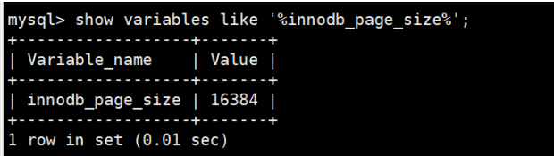

`SQL Server`中页的大小为 `8KB`，而在`oracle`中我们用术语`“块”(Block)`来代表“页”，**Oralce支持的块大小为2KB，4KB，8KB，16KB，32KB和64KB。**

### 页的上层结构

另外在数据库中，还存在着区(Extent)、段(Segment)和表空间(Tablespace)的概念。行、页、区、段、表空间的关系如下图所示:

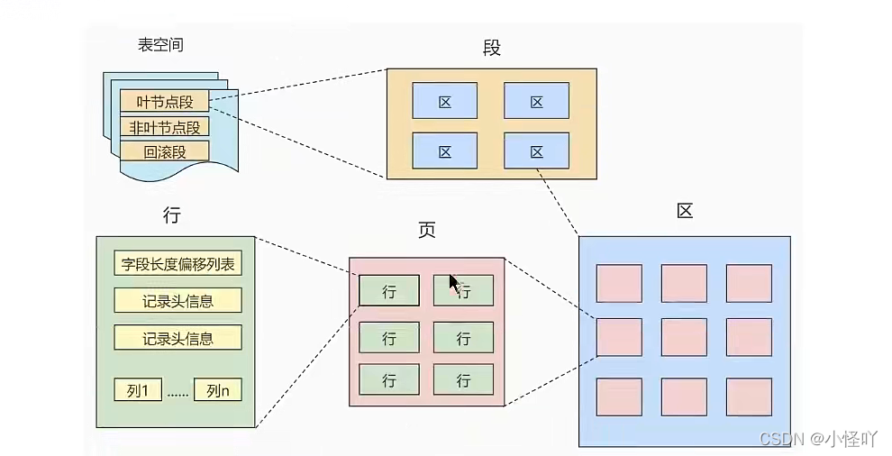

+ 区(Extent)是比页大一级的存储结构，在InnoDB存储引擎中，一个区会分配64个连续的页。因为InnoDB中的页大小默认是16KB，所以一个区的大小是64*16KB=1MB。
+ 段(Segment)由一个或多个区组成，区在文件系统是一个连续分配的空间(在InnoDB 中是连续的64个页)，不过在段中不要求区与区之间是相邻的。段是数据库中的分配单位，不同类型的数据库对象以不同的段形式存在。当我们创建数据表、索引的时候，就会相应创建对应的段，比如创建一张表时会创建一个表段，创建一个索引时会创建一个索引段。
+ 表空间(Tablespace)是一个逻辑容器，表空间存储的对象是段，在一个表空间中可以有一个或多个段，但是一个段只能属于一个表空间。数据库由一个或多个表空间组成，表空间从管理上可以划分为系统表空间、用户表空间、撤销表空间、临时表空间等。

## 页的内部结构

页如果按类型划分的话，常见的有数据页（保存B+树节点)、系统页、Undo页和事务数据页等。数据页是我们最常使用的页。

数据页的16KB大小的存储空间被划分为七个部分，分别是**文件头(File Header)、页头(Page Header)、最大最小记录（Infimum+supremum)、用户记录(User Records)、空闲空间(Free Space)、页目录(PageDirectory)和文件尾(File Tailer)** 。

页结构的示意图如下所示:

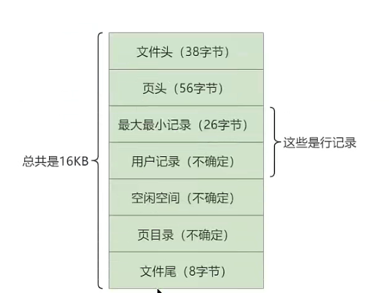

这7个部分作用分别如下，我们简单梳理如下表所示：

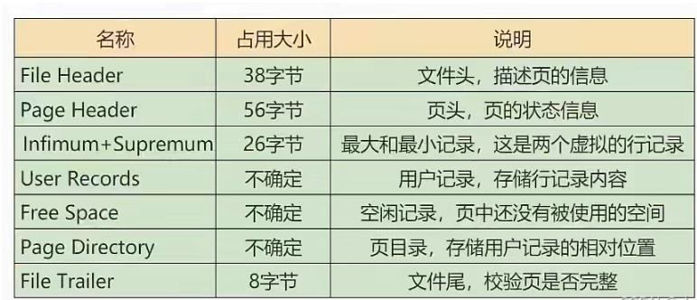

我们可以把这7个结构分成3个部分。

### 第1部分

File Header(文件头部)和 File Trailer (文件尾部)

首先是`文件通用`部分，也就是`文件头`和`文件尾`。

#### 文件头部

不同类型的页都会以`File Header`作为第一个组成部分，它描述了一些针对各种页都通用的一些信息，比方说这个页的编号是多少，它的上一个页、下一个页是谁等，`所有的数据页会组成一个双链表`。这个部分占用固定的 `38`个字节，由下面这些部分组成：

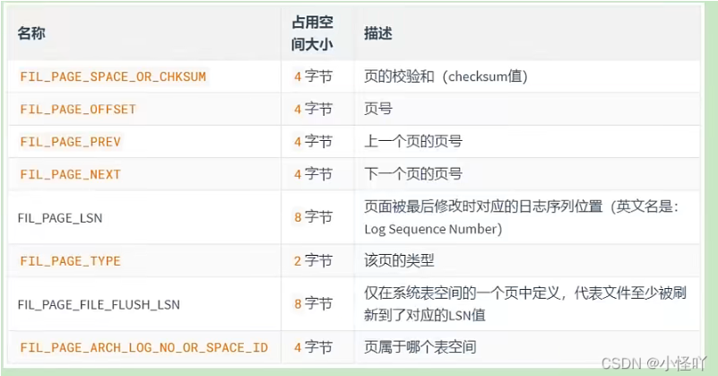

- `FIL_PAGE_OFFSET（4字节）`：每一个页都有一个单独的页号，就跟你的身份证号码一样，InnoDB通过页号可以唯一定位一个页。
- `FIL_PAGE_TYPE（2字节）`:这个代表当前页的类型。

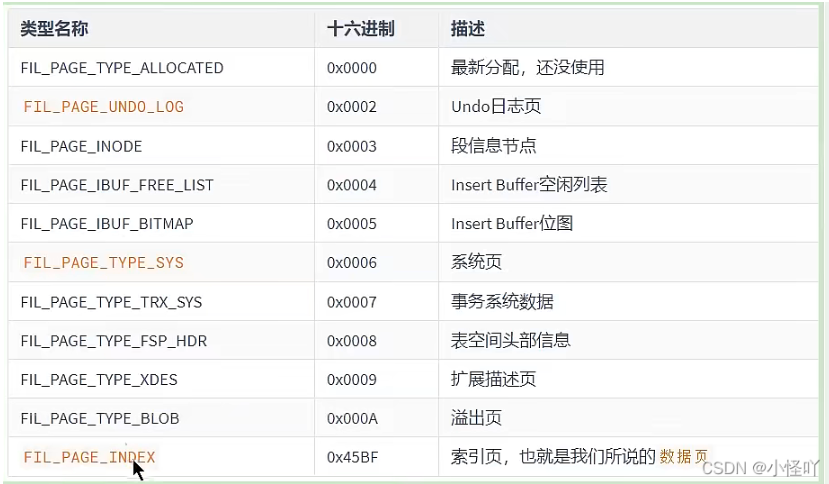

+ FIL_PAGE_PREV（4字节）和FIL_PAGE_NEXT（4字节）:InnoDB都是以页为单位存放数据的，如果数据分散到多个不连续的页中存储的话需要把这些页关联起来，FIL_PAGE_PREV和FIL_PAGE_NEXT就分别代表本页的上一个和下一个页的页号。这样通过建立一个双向链表把许许多多的页就都串联起来了，保证这些页之间不需要是物理上的连续，而是逻辑上的连续。
+ FIL_PAGE_SPACE_OR_CHKSUM（4字节）:代表当前页面的校验和（checksum）.
  + 什么是校验和？
    + 就是对于一个很长的字节串来说，我们会通过某种算法来计算一个比较短的值来代表这个很长的字节串，这个比较短的值就称为校验和。在比较两个很长的字节串之前，先比较这两个长字节串的校验和，如果校验和都不一样，则两个长字节串肯定是不同的，所以省去了直接比较两个比较长的字节串的时间损耗。
    + 文件头部和文件尾部都有属性:FIL_PAGE_SPACE_OR_CHKSUM
    + 作用:InnoDB存储引擎以页为单位把数据加载到内存中处理，如果该页中的数据在内存中被修改了，那么在修改后的某个时间需要把数据同步到磁盘中。但是在同步了一半的时候断电了，造成了该页传输的不完整。
      为了检测一个页是否完整（也就是在同步的时候有没有发生只同步一半的尴尬情况），这时可以通过文件尾的校验和（checksum值）与文件头的校验和做比对，如果两个值不相等则证明页的传输有问题，需要重新进行传输，否则认为页的传输已经完成。
    + 具体的:每当一个页面在内存中修改了，在同步之前就要把它的校验和算出来，因为FileHeader在页面的前边，所以校验和会被首先同步到磁盘，当完全写完时，校验和也会被写到页的尾部，如果完全同步成功，则页的首部和尾部的校验和应该是一致的。如果写了一半儿断电了，那么在File Header中的校验和就代表着已经修改过的页，而在FileTrailer中的校验和代表着原先的页，二者不同则意味着同步中间出了错。这里，校验方戈就是采用Hash 算法进行校验。
+ FIL_PAGE_LSN（8字节）:页面被最后修改时对应的日志序列位置（英文名是：Log Sequence Number）

#### 文件尾部

+ File Trailer（文件尾部）（8字节）:
  + 前4个字节代表页的校验和：这个部分是和File Header中的校验和相对应的。
  + 后4个字节代表页面被最后修改时对应的日志序列位置（LSN）：这个部分也是为了校验页的完整性的，如果首部和尾部的LSN值校验不成功的话，就说明同步过程出现了问题。

### 第2部分

**Free Space (空闲空间)，User Records (用户记录)，Infimum + Supremum（最小最大记录）**

第二个部分是记录部分，页的主要作用是存储记录，所以“最大和最小记录”和“用户记录”部分占了页结构的主要空间。

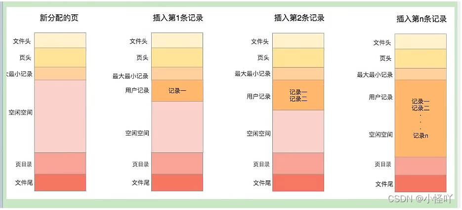

#### Free Space (空闲空间)

我们自己存储的记录会按照指定的行格式存储到User Records部分。但是在一开始生成页的时候，其实并没有User Records这个部分，每当我们插入一条记录，都会从Free Space部分，也就是尚未使用的存储空间中申请一个记录大小的空间划分到User Records部分，当Free Space部分的空间全部被User Records部分替代掉之后，也就意味着这个页使用完了，如果还有新的记录插入的话，就需要去申请新的页了。

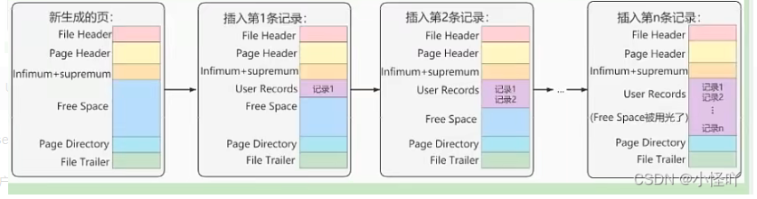

#### User Records (用户记录)

User Records中的这些记录按照指定的行格式一条一条摆在User Records部分，相互之间形成`单链表`。

用户记录里的一条条数据如何记录？

这里需要讲讲记录行格式的`记录头信息`。

#### Infimum + Supremum（最小最大记录）

记录可以比较大小吗？是的，记录可以比大小，对于一条完整的记录来说，比较记录的大小就是比较主键的大小。比方说我们插入的4行记录的主键值分别是：1、2、3、4，这也就意味着这4条记录是从小到大依次递增。

InnoDB规定的最小记录与最大记录这两条记录的构造十分简单，都是由5字节大小的记录头信息和8字节大小的一个固定的部分组成的，如图所示：

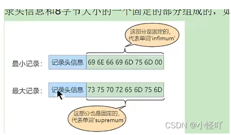

这两条记录不是我们自己定义的记录，所以它们并不存放在页的User Records部分，他们被单独放在一个称为Infimum + Supremum的部分，如图所示：

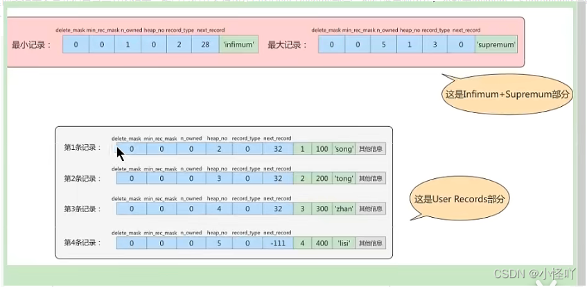

### 第3部分

**Page Directory（页目录）和 Page Header（页面头部）**

#### Page Directory（页目录）

为什么需要页目录？

在页中，记录是以单向链表的形式进行存储的。单向链表的特点就是插入、删除非常方便，但是检索效率不高，最差的情况下需要遍历链表上的所有节点才能完成检索。因此在页结构中专门设计了页目录这个模块，专门给记录做一个目录，通过二分查找法的方式进行检索，提升效率。

需求：根据主键值查找页中的某条记录，如何实现快速查找呢？
SELECT * FROM page_demo WHERE c1 = 3;

**方式**1：顺序查找

从Infimum记录（最小记录）开始，沿着链表一直往后找，总有一天会找到（或者找不到），在找的时候还能投机取巧，因为链表中各个记录的值是按照从小到大顺序排列的，所以当链表的某个节点代表的记录的主键值大于你想要查找的主键值时，你就可以停止查找了，因为该节点后边的节点的主键值依次递增。

**方式**2：使用页目录，二分法查找

1. 将所有的记录分成几个组，这些记录包括最小记录和最大记录，但不包括标记为“已删除”的记录。
2. 第1组，也就是最小记录所在的分组只有1个记录;最后一组，就是最大记录所在的分组，会有1-8条记录;其余的组记录数量在4-8条之间。这样做的好处是，除了第1组（最小记录所在组）以外，其余组的记录数会尽量平分。
3. 在每个组中最后一条记录的头信息中会存储该组一共有多少条记录，作为n_owned字段。
4. 页目录用来存储每组最后一条记录的地址偏移量，这些地址偏移量会按照先后顺序存储起来，每组的地址偏移量也被称之为槽（slot），每个槽相当于指针指向了不同组的最后一条记录

**举例1：**

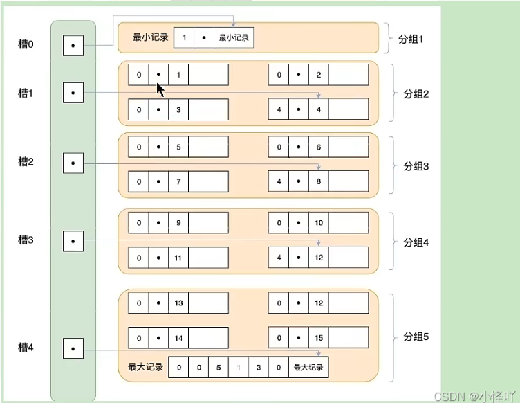

**举例2:**
现在的page_demo表中正常的记录共有6条，InnoDB会把它们分成两组，第一组中只有一个最小记录,第二组中是剩余的5条记录。如下图:

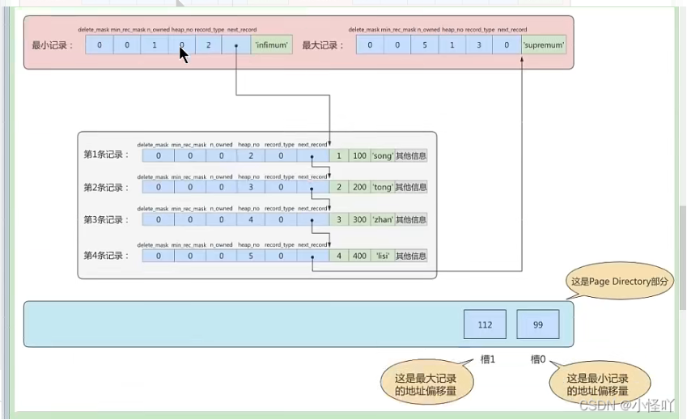

从这个图中我们需要注意这么几点:

+ 现在页目录部分中有两个槽，也就意味着我们的记录被分成了两个组，槽1中的值是112，代表最大记录的地址偏移量（就是从页面的0字节开始数，数112个字节）;槽0中的值是99，代表最小记录的地址偏移量。
+ 注意最小和最大记录的头信息中的n_owned属性
  + 最小记录的n_owned值为1，这就代表着以最小记录结尾的这个分组中只有1条记录,也就是最小记录本身。
  + 最大记录的n_owned值为5，这就代表着以最大记录结尾的这个分组中只有5条记录,包括最大记录本身还有我们自己插入的4条记录。用箭头指向的方式替代数字，这样更易于我们理解,修改后如下:

用箭头指向的方式替代数字，这样更易于我们理解,修改后如下:

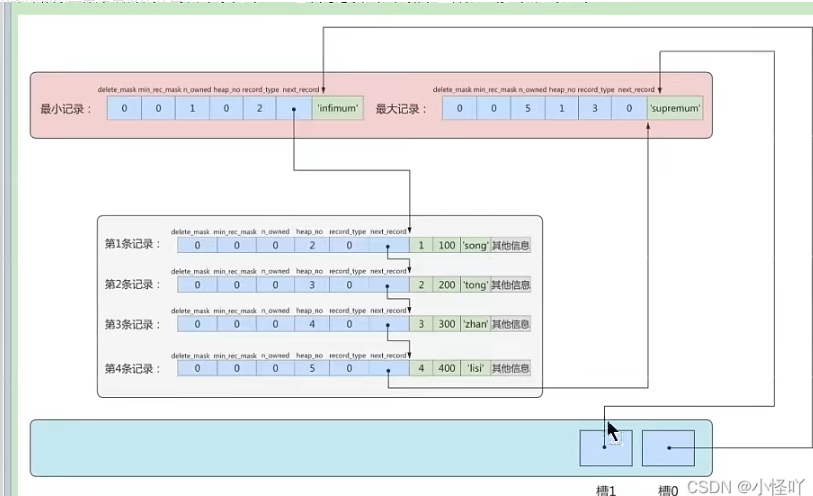

