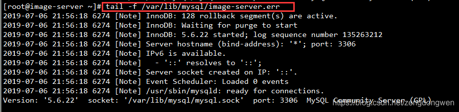

# MySQL

## 基础知识

### 谈谈你对Mysql理解？

1. 当数据量超过10万行的时候，一般的Xlsx性能就不足够了，这个时候，就需要使用到数据库，而当下最流行的就是Mysql
2. Mysql 可以经进行数据的持久化，同时支持了Sql进行数据查询，内置的存储引擎InnoDB 支持事务，同时在查找性能上也比较优秀
3. Mysql 开源、免费，已经在很多企业当中实际应用，从成本和市场认可度上面，Mysql 也很不错。

综上，所以我们使用了Mysql

### 发展简史

- 1995年，Michael Monty Widenius、David Axmark 和 Allan Larsson，在瑞典创立了MySQL AB公司。1996年，发布MySQL 1.0版本，“My”取自联合创始人Micheal Monty Widenius女儿的名字。同年10月，MySQL 3.11.1发布，没有2.x版本。
- 2000年，MySQL对原存储引擎进行了整理，命名为MyISAM
- 2001年，MySQL集成Heikki Tuuri的存储引擎InnoDB，实现了事务处理和行级锁的支持。该年发布的3.23 版本已支持大多数的基本的SQL 操作，并集成了MyISAM和InnoDB 存储引擎。
- 2003年3月，发布MySQL 4.0 ，支持查询缓存、集合并、全文索引，正式支持InnoDB存储引擎。
- 2004年10月，发布经典的MySQL 4.1 ，增加了子查询，utf8字符集等。
- 2005年10月，发布MySQL 5.0 ，增加了视图、存储过程、游标、触发器、分布式事务，迈出了高性能数据库步伐。
- 2008年1月，MySQL AB公司被Sun公司以10亿美金收购。
- 2009年4月，Oracle公司以74亿美元收购Sun公司，MySQL转入Oracle麾下。
- 2010年12月，发布MySQL 5.5 ，增加了半同步复制、信号异常处理、unicode字符集，InnoDB成为默认存储引擎。
- 2011年4月，发布MySQL 5.6 ，增加了GTID复制，支持延时复制、行级复制。
- 2013年2月，发布MySQL 5.7 ，支持原生JSON数据类型。
- 2016年9月，发布MySQL 8.0.0 ；可使用JSON数据的SQL机制；支持GIS；可靠性更高。
- 2018年4月，发布MySQL 8.0.11 GA ，支持NoSQL文档存储、原子的奔溃安全DDL语句、扩展JSON语法，新增JSON表函数，改进排序、分区更新功能。

### 版本性能对比

+ [MySQL 5.7与MySQL 8.0性能比拼，结果怎么样？](https://javazhiyin.blog.csdn.net/article/details/113830129?spm=1001.2101.3001.6650.2&utm_medium=distribute.pc_relevant.none-task-blog-2%7Edefault%7ECTRLIST%7ERate-2-113830129-blog-109376093.pc_relevant_default&depth_1-utm_source=distribute.pc_relevant.none-task-blog-2%7Edefault%7ECTRLIST%7ERate-2-113830129-blog-109376093.pc_relevant_default&utm_relevant_index=5)
+ [MySQL数据库 5.7 vs 8.0性能测评](https://blog.csdn.net/u012811805/article/details/115038167?spm=1001.2101.3001.6650.10&utm_medium=distribute.pc_relevant.none-task-blog-2~default~CTRLIST~Rate-10-115038167-blog-113903927.pc_relevant_layerdownloadsortv1&depth_1-utm_source=distribute.pc_relevant.none-task-blog-2~default~CTRLIST~Rate-10-115038167-blog-113903927.pc_relevant_layerdownloadsortv1&utm_relevant_index=11)


### 什么是高级Mysql优化？

 完整的mysql优化需要很深的功底，大公司甚至有专门的DBA（**数据库管理员**Database Administrator）写上述

- mysql内核
- sql优化工程师
- mysql服务器的优化
- 各种参数常量设定
- 查询语句优化
- 主从复制
- 软硬件升级
- 容灾备份
- sql编程


### 数据库三大范式是什么

1. 每个列都不可以再拆分。
2. 在第一范式的基础上，非主键列完全依赖于主键，而不能是依赖于主键的一部分。
3. 在第二范式的基础上，非主键列只依赖于主键，不依赖于其他非主键。

在设计数据库结构的时候，要尽量遵守三范式，如果不遵守，必须有足够的理由。比如性能。事实上我们经常会为了性能而妥协数据库的设计。


### mysql有关权限的表都有哪几个

​		MySQL服务器通过权限表来控制用户对数据库的访问，权限表存放在mysql数据库里，由mysql_install_db脚本初始化。这些权限表分别user，db，table_priv，columns_priv和host。下面分别介绍一下这些表的结构和内容：

- user **权限表**：记录允许连接到服务器的用户帐号信息，里面的权限是全局级的。
- db **权限表**：记录各个帐号在各个数据库上的操作权限。
- table_priv **权限表**：记录数据表级的操作权限。
- columns_priv **权限表**：记录数据列级的操作权限。
- host **权限表**：配合db权限表对给定主机上数据库级操作权限作更细致的控制。这个权限表不受GRANT和REVOKE语句的影响。


### 逻辑架构介绍

+ 和其它数据库相比，MySQL有点与众不同，它的架构可以在多种不同场景中应用并发挥良好作用。主要体现在存储引擎的架构上，**插件式的存储引擎架构将查询处理和其它的系统任务以及数据的存储提取相分离。**这种架构可以根据业务的需求和时机需要选择合适的存储引擎。
+ 从上到下，连接层，服务层，引擎层，存储层


### Mysql 服务器工作流程？

1. MySQL服务器端启动，申请3306端口，之后监听这个端口号，等待客户端进程进行连接
2. MySQL客户端启动
    1. 连接器 负责跟客户端建立连接、获取权限、维持和管理连接
    2. 连接完成后，如果你没有后续的动作，这个连接就处于空闲状态，如果太长时间没动静，连接器就会自动将它断开
    3. 建立连接的过程通常是比较复杂的，所以在使用中要尽量减少建立连接的动作，也就是尽量使用长连接。 但是全部使用长连接后，有些时候MySQL占用内存涨得特别快
3. MySQL客户端向MySQL服务器发送SQL语句处理的请求
4. MySQL服务器处理SQL命令具体流程
      1. 连接器：负责跟客户端建立连接、获取权限、维持和管理连
      2. 查询缓存：先把刚刚处理过的查询请求和结果缓存起来，如果下一次有一模一样的请求过来，直接从缓存中查找结果
      3. 分析器：MySQL服务器程序首先要对这段文本做分析，判断请求的语法是否正确，然后从文本中将要查询的表、各种查询条件都提取出来放到MySQL服务器内部使用的一些数据结构上来
      4. 优化器
           1. MySQL的优化程序会对我们的语句做一些优化，如外连接转换为内连接、表达式简化、子查询转为连接等
           2. 优化的结果就是**生成一个执行计划**，这个执行计划表明了应该使用哪些索引进行查询，表之间的连接顺序是什么样的
      5. 执行器：
           1. 开始执行的时候，要先判断一下你对这个表T有没有执行查询的权限，如果没有，就会返回没有权限的错误
           2. 如果有权限，就打开表继续执行


### MySQL的`binlog`有有几种录入格式？分别有什么区别？

有三种格式，statement，row和mixed。

- statement模式下，每一条会修改数据的sql都会记录在binlog中。不需要记录每一行的变化。
- row级别下，基本是可以全部记下来但是由于很多操作，会导致大量行的改动(，因此这种模式的文件保存的信息太多，日志量太大。
- mixed，一种折中的方案，普通操作使用statement记录，当无法使用statement的时候使用row。

此外，新版的MySQL中对row级别也做了一些优化，当表结构发生变化的时候，会记录语句而不是逐行记录。


## 数据类型

### mysql有哪些数据类型

| **分类**             | **类型名称** | **说明**                                                     |
| -------------------- | ------------ | ------------------------------------------------------------ |
| **整数类型**         | tinyInt      | 很小的整数(8位二进制)                                        |
|                      | smallint     | 小的整数(16位二进制)                                         |
|                      | mediumint    | 中等大小的整数(24位二进制)                                   |
|                      | int(integer) | 普通大小的整数(32位二进制)                                   |
| **小数类型**         | float        | 单精度浮点数                                                 |
|                      | double       | 双精度浮点数                                                 |
|                      | decimal(m,d) | 压缩严格的定点数                                             |
| **日期类型**         | year         | YYYY 1901~2155                                               |
|                      | time         | HH:MM:SS -838:59:59~838:59:59                                |
|                      | date         | YYYY-MM-DD 1000-01-01~9999-12-3                              |
|                      | datetime     | YYYY-MM-DD HH:MM:SS 1000-01-01 00:00:00~ 9999-12-31 23:59:59 |
|                      | timestamp    | YYYY-MM-DD HH:MM:SS 19700101 00:00:01 UTC~2038-01-19 03:14:07UTC |
| **文本、二进制类型** | CHAR(M)      | M为0~255之间的整数                                           |
|                      | VARCHAR(M)   | M为0~65535之间的整数                                         |
|                      | TINYBLOB     | 允许长度0~255字节                                            |
|                      | BLOB         | 允许长度0~65535字节                                          |
|                      | MEDIUMBLOB   | 允许长度0~167772150字节                                      |
|                      | LONGBLOB     | 允许长度0~4294967295字节                                     |
|                      | TINYTEXT     | 允许长度0~255字节                                            |
|                      | TEXT         | 允许长度0~65535字节                                          |
|                      | MEDIUMTEXT   | 允许长度0~167772150字节                                      |
|                      | LONGTEXT     | 允许长度0~4294967295字节                                     |
|                      | VARBINARY(M) | 允许长度0~M个字节的变长字节字符串                            |
|                      | BINARY(M)    | 允许长度0~M个字节的定长字节字符串                            |

- `1、整数类型`，包括TINYINT、SMALLINT、MEDIUMINT、INT、BIGINT，分别表示1字节、2字节、3字节、4字节、8字节整数。任何整数类型都可以加上UNSIGNED属性，表示数据是无符号的，即非负整数。
  `长度`：整数类型可以被指定长度，例如：INT(11)表示长度为11的INT类型。长度在大多数场景是没有意义的，它不会限制值的合法范围，只会影响显示字符的个数，而且需要和UNSIGNED ZEROFILL（自动用0补全其他位）属性配合使用才有意义。
  `例子`，假定类型设定为INT(5)，属性为UNSIGNED ZEROFILL，如果用户插入的数据为12的话，那么数据库实际存储数据为00012。

- `2、实数类型`，包括FLOAT、DOUBLE、DECIMAL。
  DECIMAL可以用于存储比BIGINT还大的整型，能存储精确的小数。
  而FLOAT和DOUBLE是有取值范围的，并支持使用标准的浮点进行近似计算。
  计算时FLOAT和DOUBLE相比DECIMAL效率更高一些，DECIMAL你可以理解成是用字符串进行处理。

- `3、字符串类型`，包括VARCHAR、CHAR、TEXT、BLOB
  VARCHAR用于存储可变长字符串，它比定长类型更节省空间。
  VARCHAR使用额外1或2个字节存储字符串长度。列长度小于255字节时，使用1字节表示，否则使用2字节表示。
  
  1. VARCHAR存储的内容超出设置的长度时，内容会被截断。
  2. CHAR是定长的，根据定义的字符串长度分配足够的空间。
  3. CHAR会根据需要使用空格进行填充方便比较。
  4. CHAR适合存储很短的字符串，或者所有值都接近同一个长度。
  5. CHAR存储的内容超出设置的长度时，内容同样会被截断。
  
  **使用策略：**
  
  1. 对于经常变更的数据来说，CHAR比VARCHAR更好，因为CHAR不容易产生碎片。
  2. 对于非常短的列，CHAR比VARCHAR在存储空间上更有效率。
  3. 使用时要注意只分配需要的空间，更长的列排序时会消耗更多内存。
  4. 尽量避免使用TEXT/BLOB类型，查询时会使用临时表，导致严重的性能开销。
  
- `4、枚举类型（ENUM）`，把不重复的数据存储为一个预定义的集合。
  
  1. 有时可以使用ENUM代替常用的字符串类型。
  2. ENUM存储非常紧凑，会把列表值压缩到一个或两个字节。
  3. ENUM在内部存储时，其实存的是整数。
  4. 尽量避免使用数字作为ENUM枚举的常量，因为容易混乱。
  5. 排序是按照内部存储的整数
  
- `5、日期和时间类型`，
  
  1. 尽量使用timestamp，空间效率高于datetime，
  2. 用整数保存时间戳通常不方便处理。
  3. 如果需要存储微妙，可以使用bigint存储。
  4. 看到这里，这道真题是不是就比较容易回答了。
  


### 设置`int`长度有用？

1. 整数类型可以被指定长度，例如：INT(11)表示长度为11的INT类型。长度在大多数场景是没有意义的，它不会限制值的合法范围，只会影响显示字符的个数，而且需要和UNSIGNED ZEROFILL（自动用0补全其他位）属性配合使用才有意义。
2. `例子`，假定类型设定为INT(5)，属性为UNSIGNED ZEROFILL，如果用户插入的数据为12的话，那么数据库实际存储数据为00012。

### 如何选择字符类型？

字符串类型：VARCHAR、CHAR、TEXT、BLOB

1. VARCHAR用于存储可变长字符串，它比定长类型更节省空间。
2. VARCHAR使用额外1或2个字节存储字符串长度。列长度小于255字节时，使用1字节表示，否则使用2字节表示。
3. VARCHAR存储的内容超出设置的长度时，内容会被截断。
4. CHAR是定长的，根据定义的字符串长度分配足够的空间。
5. CHAR会根据需要使用空格进行填充方便比较。
6. CHAR适合存储很短的字符串，或者所有值都接近同一个长度。
7. CHAR存储的内容超出设置的长度时，内容同样会被截断。

**使用策略：**

1. 对于经常变更的数据来说，CHAR比VARCHAR更好，因为CHAR不容易产生碎片。
2. 对于非常短的列，CHAR比VARCHAR在存储空间上更有效率。
3. 使用时要注意只分配需要的空间，更长的列排序时会消耗更多内存。
4. 尽量避免使用TEXT/BLOB类型，查询时会使用临时表，导致严重的性能开销。


### 如何使用枚举类型？

`枚举类型（ENUM）`，把不重复的数据存储为一个预定义的集合。

1. 有时可以使用ENUM代替常用的字符串类型。
2. ENUM存储非常紧凑，会把列表值压缩到一个或两个字节。
3. ENUM在内部存储时，其实存的是整数。
4. 尽量避免使用数字作为ENUM枚举的常量，因为容易混乱。
5. 排序是按照内部存储的整数


## 存储引擎

### 查看引擎

查看命令

- 如何用命令查看
  - 看你的mysql现在已提供什么存储引擎：show engines；
  - 看你的mysql当前默认的存储引擎：show variables like ‘%storage_engine%’;

~~~bash
# 查看搜索引擎
show engines
~~~


~~~bash
# 修改搜索引擎
alter table tableName engine = 存储引擎名;

# 显示索引的状态
SHOW ENGINE INNODB STATUS;
~~~


### 存储引擎种类

常用的存储引擎有以下：

- **Innodb引擎**：提供了对数据库ACID事务的支持。并且还提供了行级锁和外键的约束。它的设计的目标就是处理大数据容量的数据库系统。会有数据的缓冲池，进而提高查询效率。
- **MyIASM引擎**：不提供事务的支持，也不支持行级锁和外键，但是存储空间小，可节省空间，主要用作全文索引
- **MEMORY引擎**：所有的数据都在内存中，数据的处理速度快，但是安全性不高。


### MyISAM与InnoDB区别？

- InnoDB索引是聚簇索引，MyISAM索引是非聚簇索引。
- InnoDB的主键索引的叶子节点存储着行数据，因此主键索引非常高效。
- MyISAM索引的叶子节点存储的是行数据地址，需要再寻址一次才能得到数据。
- InnoDB非主键索引的叶子节点存储的是主键和其他带索引的列数据，因此查询时做到覆盖索引会非常高效。

它是Mysql中默认的引擎，它不支持行级锁和外键，它最大的特点就是它使用了表级锁（操作时需要锁定整个表），非聚簇索引（非聚簇索引的叶节点仍然是索引节点，并保留一个链接指向对应数据块与聚簇索引不同，聚簇索引是直接指向数据节点，所以会快一点）**但是由于它保存了行数**，在查询上会比InnoDB的效率要高一点。在不需要对数据库的支持，而且读操作多于写操作时，可以选择使用MyIASM引擎。


### InnoDB引擎的4大特性

- 插入缓冲 -> 保证写入性能
  - 插入缓存之前版本叫insert buffer，现版本 change buffer，主要提升插入性能，change buffer是insert buffer的加强，insert buffer只针对insert有效，change buffering对insert、delete、update(delete+insert)、purge都有效

- 二次写-.双写机制 -> 提升数据的可靠性
  - **Doublewrite缓存是位于系统表空间的存储区域**，用来缓存InnoDB的数据页从innodb buffer pool中flush之后并写入到数据文件之前，所以当操作系统或者数据库进程在数据页写磁盘的过程中崩溃，**Innodb可以在doublewrite缓存中找到数据页的备份而用来执行crash恢复**。数据页写入到doublewrite缓存的动作所需要的IO消耗要小于写入到数据文件的消耗，因为此写入操作会以一次大的连续块的方式写入
  - 在应用（apply）重做日志前，用户需要一个页的副本，当写入失效发生时，先通过页的副本来还原该页，再进行重做，这就是double write。doublewrite组成：
    - 内存中的doublewrite buffer,大小2M。
    - 物理磁盘上共享表空间中连续的128个页，即2个区（extend），大小同样为2M。

  - 对缓冲池的脏页进行刷新时，不是直接写磁盘，而是会通过memcpy()函数将脏页先复制到内存中的doublewrite buffer，之后通过doublewrite 再分两次，每次1M顺序地写入共享表空间的物理磁盘上，在这个过程中，因为doublewrite页是连续的，因此这个过程是顺序写的，开销并不是很大。在完成doublewrite页的写入后，再将doublewrite buffer 中的页写入各个 表空间文件中，此时的写入则是离散的。如果操作系统在将页写入磁盘的过程中发生了崩溃，在恢复过程中，innodb可以从共享表空间中的doublewrite中找到该页的一个副本，将其复制到表空间文件，再应用重做日志。

- 自适应哈希索引(ahi)
  -  哈希算法查找的时间复杂度的为O(1)，而利用的B+数的查找次序为3-4层，故需要查询的次数为3-4次查询数据。InnoDB存储引擎会建立会监控的对表上各种索引的查询的，如果观察到哈希索引带来的速度的提升，则建立的哈希索引结构。自称为的自适应哈希的索引。

- 预读(read ahead)
  - 预读操作是一种IO操作，用于异步将磁盘的中的数据的读取到buffer pool中，预料中的数据页会被马上读到，预读请求中的所有页会被添加到的一个的范围之内。InnoDB共有两个的预读算法。
    - 线性预读技术：在buffer pool中被访问到的数据的他临近的页会被的很快的访问到。能够通过的调整连续访问的页的数量来控住InnoDB中的预读操作，使用参数InnoDB_read_ahead_threshold配置，添加这个参数前，InnoDB会读取的当前区段的最后一页才开始进行预读。
    - 随机预读：通过buffer pool存中的预测哪些页很快被访问，而不考虑这些页的读取顺序，如果发现的buffer pool中存在的一个区段的13个连续的页，如果的innoDB会异步发起预读的请求占据的这个页。


### 存储引擎选择

如果没有特别的需求，使用默认的`Innodb`即可。

`MyISAM`：以读写插入为主的应用程序，比如博客系统、新闻门户网站。

`Innodb`：更新（删除）操作频率也高，或者要保证数据的完整性；并发量高，支持事务和外键。比如OA自动化办公系统。


## 索引

### 什么是索引？

​		索引是一种数据结构。索引的实现通常使用B树及其变种B+树。更通俗的说，索引就相当于目录。它是一个文件。


### 索引有哪些优缺点？

索引的优点

- 可以大大加快数据的检索速度。

索引的缺点

- 时间方面：创建索引和维护索引要耗费时间，大量的索引会降低了mysql的执行效率；
- 空间方面：索引需要占物理空间。


### 索引有哪几种类型？

**主键索引:** 数据列不允许重复，不允许为NULL，一个表只能有一个主键。

**唯一索引:** 数据列不允许重复，允许为NULL值，一个表允许多个列创建唯一索引。

**普通索引:** 基本的索引类型，没有唯一性的限制，允许为NULL值。

**全文索引：** 是目前搜索引擎使用的一种关键技术。


### InnoDB的索引数据结构有哪些？

​		在`MySQL`中使用较多的索引有**Hash索引**，**B+树索引**等，`InnoDB`存储引**擎的默认索引实现为：B+树索引**。对于哈希索引来说，底层的数据结构就是哈希表，因此在绝大多数需求为单条记录查询的时候，可以选择哈希索引，查询性能最快；其余大部分场景，建议选择`BTree`索引。

**B树索引**

​		`mysql`通过存储引擎取数据，基本上90%的人用的就是InnoDB了，按照实现方式分，InnoDB的索引类型目前只有两种：BTREE（B树）索引和HASH索引。B树索引是Mysql数据库中使用最频繁的索引类型，基本所有存储引擎都支持BTree索引。通常我们说的索引不出意外指的就是（B树）索引（实际是用B+树实现的，因为在查看表索引时，mysql一律打印BTREE，所以简称为B树索引）


查询方式：

​		主键索引区:PI(关联保存的时数据的地址)按主键查询,

​		普通索引区:`si`(关联的id的地址,然后再到达上面的地址)。所以按主键查询,速度最快


1. B+tree性质：

   1. n 棵子 tree 的节点包含 n 个关键字，不用来保存数据而是保存数据的索引。	
   2. 所有的叶子结点中包含了全部关键字的信息，及指向含这些关键字记录的指针，且叶子结点本身依关键字的大小自小而大顺序链接。
   3. 所有的非终端结点可以看成是索引部分，结点中仅含其子树中的最大（或最小）关键字。
   4. B+ 树中，数据对象的插入和删除仅在叶节点上进行。
   5. B+树有2个头指针，一个是树的根节点，一个是最小关键码的叶节点。

2. 哈希索引

   简要说下，类似于数据结构中简单实现的HASH表（散列表）一样，当我们在mysql中用哈希索引时，主要就是通过Hash算法（常见的Hash算法有直接定址法、平方取中法、折叠法、除数取余法、随机数法），将数据库字段数据转换成定长的Hash值，与这条数据的行指针一并存入Hash表的对应位置；如果发生Hash碰撞（两个不同关键字的Hash值相同），则在对应Hash键下以链表形式存储。当然这只是简略模拟图。


### B树和B+树的区别

- 在B树中，你可以将键和值存放在内部节点和叶子节点；但在B+树中，内部节点都是键，没有值，叶子节点同时存放键和值。

- B+树的叶子节点有一条链相连，而B树的叶子节点各自独立。

  


### 使用B树的好处

​		B树可以在内部节点同时存储键和值，因此，把频繁访问的数据放在靠近根节点的地方将会大大提高热点数据的查询效率。这种特性使得B树在特定数据重复多次查询的场景中更加高效。


### 使用B+树的好处

​		由于B+树的内部节点只存放键，不存放值，因此，一次读取，可以在内存页中获取更多的键，有利于更快地缩小查找范围。 B+树的叶节点由一条链相连，因此，当需要进行一次全数据遍历的时候，B+树只需要使用O(logN)时间找到最小的一个节点，然后通过链进行O(N)的顺序遍历即可。而B树则需要对树的每一层进行遍历，这会需要更多的内存置换次数，因此也就需要花费更多的时间


### Hash索引和B+树所有有什么区别或者说优劣呢?

​		首先要知道Hash索引和B+树索引的底层实现原理：

**hash索引底层就是hash表**，进行查找时，调用一次hash函数就可以获取到相应的键值，之后进行回表查询获得实际数据。**B+树底层实现是多路平衡查找树**。对于每一次的查询都是从根节点出发，查找到叶子节点方可以获得所查键值，然后根据查询判断是否需要回表查询数据。

那么可以看出他们有以下的不同：

- **hash索引进行等值查询更快(一般情况下)，但是却无法进行范围查询。**

  ​		因为在hash索引中经过hash函数建立索引之后，索引的顺序与原顺序无法保持一致，不能支持范围查询。而B+树的的所有节点皆遵循(左节点小于父节点，右节点大于父节点，多叉树也类似)，天然支持范围。

- hash索引不支持使用索引进行排序，原理同上。

- hash索引不支持模糊查询以及多列索引的最左前缀匹配。原理也是因为hash函数的不可预测。AAAA和AAAAB的索引没有相关性。

- hash索引任何时候都避免不了回表查询数据，而B+树在符合某些条件(聚簇索引，覆盖索引等)的时候可以只通过索引完成查询。

- **hash索引虽然在等值查询上较快，但是不稳定。性能不可预测，当某个键值存在大量重复的时候，发生hash碰撞**，（MySql 解决Hash冲突的方法是也是链表叠加的形式，类似 HashMap 中的链表）此时效率可能极差。而B+树的查询效率比较稳定，对于所有的查询都是从根节点到叶子节点，且树的高度较低。

  因此，在大多数情况下，直接选择B+树索引可以获得稳定且较好的查询速度。而不需要使用hash索引。


### 数据库为什么使用B+树而不是B树

- **B树只适合随机检索，而B+树同时支持随机检索和顺序检索；**
- **B+树空间利用率更高，可减少I/O次数，磁盘读写代价更低**。一般来说，索引本身也很大，不可能全部存储在内存中，因此索引往往以索引文件的形式存储的磁盘上。这样的话，索引查找过程中就要产生磁盘I/O消耗。B+树的内部结点并没有指向关键字具体信息的指针，只是作为索引使用，其内部结点比B树小，盘块能容纳的结点中关键字数量更多，一次性读入内存中可以查找的关键字也就越多，相对的，IO读写次数也就降低了。而IO读写次数是影响索引检索效率的最大因素；
- **B+树的查询效率更加稳定**。B树搜索有可能会在非叶子结点结束，越靠近根节点的记录查找时间越短，只要找到关键字即可确定记录的存在，其性能等价于在关键字全集内做一次二分查找。而在B+树中，顺序检索比较明显，随机检索时，任何关键字的查找都必须走一条从根节点到叶节点的路，所有关键字的查找路径长度相同，导致每一个关键字的查询效率相当。
- **B树在提高了磁盘IO性能的同时并没有解决元素遍历的效率低下的问题**。B+树的叶子节点使用指针顺序连接在一起，只要遍历叶子节点就可以实现整棵树的遍历。而且在数据库中基于范围的查询是非常频繁的，而B树不支持这样的操作。
- **增删文件（节点）时，效率更高。因为B+树的叶子节点包含所有关键字，并以有序的链表结构存储，这样可很好提高增删效率。**
- 在Mysql的命令行界面显示的索引数据类型是B树，但实际上是B+树
- B+树在满足聚簇索引和覆盖索引的时候不需要回表查询数据，在B+树的索引中，叶子节点可能存储了当前的key值，也可能存储了当前的key值以及整行的数据，这就是聚簇索引和非聚簇索引。 在InnoDB中，只有主键索引是聚簇索引，如果没有主键，则挑选一个唯一键建立聚簇索引。如果没有唯一键，则隐式的生成一个键来建立聚簇索引。
- 当查询使用聚簇索引时，在对应的叶子节点，可以获取到整行数据，因此不用再次进行回表查询。

### B+树对比红黑树？

红黑树是二叉搜索树，相较于B+树来说，每一层能够容纳的数据量有限，当数据比较多的时候，树的层高就会显得非常的高了，所以红黑树并不适合作为索引

### 索引的基本原理

​        索引用来快速地寻找那些具有特定值的记录。如果没有索引，一般来说执行查询时遍历整张表。索引的原理很简单，就是把无序的数据变成有序的查询。

1. 把创建了索引的列的内容进行排序
2. 对排序结果生成倒排表
3. 在倒排表内容上拼上数据地址链
4. 在查询的时候，先拿到倒排表内容，再取出数据地址链，从而拿到具体数据

### 索引设计的总则？

索引的是通过空间换时间的方式，所以索引总则：查询更快，占用空间更小

### 创建索引的注意事项？

索引虽好，但也不是无限制的使用，最好符合一下几个原则

1. 最左前缀匹配原则，组合索引非常重要的原则，mysql会一直向右匹配直到遇到范围查询(>、<、between、like)就停止匹配，比如a = 1 and b = 2 and c > 3 and d = 4 如果建立(a,b,c,d)顺序的索引，d是用不到索引的，如果建立(a,b,d,c)的索引则都可以用到，a,b,d的顺序可以任意调整。
2. 较频繁作为查询条件的字段才去创建索引
3. 更新频繁字段不适合创建索引
4. 需要能够有效区分数据的列做索引列(如性别，男女未知，最多也就三种，区分度实在太低，不适合作为索引)
5. 尽量的扩展索引，不要新建索引。比如表中已经有a的索引，现在要加(a,b)的索引，那么只需要修改原来的索引即可。
6. 定义有外键的数据列一定要建立索引。
7. 对于那些查询中很少涉及的列，重复值比较多的列不要建立索引。
8. 对于定义为text、image和bit的数据类型的列不要建立索引

### 使用索引一定能提高查询的性能吗？

通常，通过索引查询数据比全表扫描要快。但是我们也必须注意到它的代价。

- 索引需要空间来存储，也需要定期维护， 每当有记录在表中增减或索引列被修改时，索引本身也会被修改。那些不必要的索引反而会使MySql性能降低，频繁维护索引，导致查询效率降低

- 索引范围查询(INDEX RANGE SCAN)适用于两种情况:

  - 基于一个范围的检索，一般查询返回结果集小于表中记录数的30%
  - 基于非唯一性索引的检索


### 百万级别以上的数据删除

查询MySQL官方手册得知删除数据的速度和创建的索引数量是成正比的。

1. 所以我们想要删除百万数据的时候可以先删除索引（此时大概耗时三分多钟）
2. 然后删除其中无用数据（此过程需要不到两分钟）
3. 删除完成后重新创建索引(此时数据较少了)创建索引也非常快，约十分钟左右。
4. 与之前的直接删除绝对是要快速很多，更别说万一删除中断,一切删除会回滚。那更是坑了。

### 前缀索引

​		语法：`index(field(10))`，使用字段值的前10个字符建立索引，默认是使用字段的全部内容建立索引。

​		前提：前缀的标识度高。

​		实操的难度：在于前缀截取的长度。

​		我们可以利用`select count(*)/count(distinct left(password,prefixLen));`，通过从调整`prefixLen`的值（从1自增）查看不同前缀长度的一个平均匹配度，接近1时就可以了（表示一个密码的前`prefixLen`个字符几乎能确定唯一一条记录）

### 什么是最左前缀原则？

- 顾名思义，就是最左优先，在创建多列索引时，要根据业务需求，where子句中使用最频繁的一列放在最左边。
- 最左前缀匹配原则，非常重要的原则，mysql会一直向右匹配直到遇到范围查询(>、<、between、like)就停止匹配，比如a = 1 and b = 2 and c > 3 and d = 4 如果建立(a,b,c,d)顺序的索引，d是用不到索引的，如果建立(a,b,d,c)的索引则都可以用到，a,b,d的顺序可以任意调整。
- **=和in可以乱序，比如a = 1 and b = 2 and c = 3 建立(a,b,c)索引可以任意顺序**，mysql的查询优化器会帮你优化成索引可以识别的形式

### 什么聚簇索引与非聚簇索引

- 聚簇索引：将数据存储与索引放到了一块，找到索引也就找到了数据
- 非聚簇索引：将数据存储于索引分开结构，索引结构的叶子节点指向了数据的对应行，myisam通过key_buffer把索引先缓存到内存中，当需要访问数据时（通过索引访问数据），在内存中直接搜索索引，然后通过索引找到磁盘相应数据，这也就是为什么索引不在key buffer命中时，速度慢的原因

澄清一个概念：innodb中，在聚簇索引之上创建的索引称之为辅助索引，辅助索引访问数据总是需要二次查找，非聚簇索引都是辅助索引，像复合索引、前缀索引、唯一索引，辅助索引叶子节点存储的不再是行的物理位置，而是主键值

### 非聚簇索引一定会回表查询吗？

​		不一定，这涉及到查询语句所要求的字段是否全部命中了索引，如果全部命中了索引，那么就不必再进行回表查询。

​		举个简单的例子，假设我们在员工表的年龄上建立了索引，那么当进行`select age from employee where age < 20`的查询时，在索引的叶子节点上，已经包含了age信息，不会再次进行回表查询。


## MVCC

**MVCC** 并发版本控制，同时使用版本号来避免使用锁，从而提高数据库的读写性能

### 什么是当前读和快照读？

在学习MVCC多版本并发控制之前，我们必须先了解一下，什么是MySQL InnoDB下的`当前读`和`快照读`?

- **当前读**
  像select lock in share mode(`共享锁`), select for update ; update, insert ,delete(`排他锁`)这些操作都是一种当前读，为什么叫当前读？就是它读取的是记录的最新版本，读取时还要保证其他并发事务不能修改当前记录，会对读取的记录进行加锁
- **快照读**
  像`不加锁`的select操作就是快照读，即不加锁的非阻塞读；**串行级别下的快照读会退化成当前读**；快照读的实现是基于多版本并发控制，即MVCC,可以认为MVCC是行锁的一个变种，但它在很多情况下，避免了加锁操作，降低了开销；既然是基于多版本，即快照读可能读到的并不一定是数据的最新版本，而有可能是之前的历史版本

### MVCC能解决什么问题，好处是？

**数据库并发场景有三种，分别为：**

- `读-读`：不存在任何问题，也不需要并发控制
- `读-写`：有线程安全问题，可能会造成事务隔离性问题，可能遇到脏读，幻读，不可重复读
- `写-写`：有线程安全问题，可能会存在更新丢失问题，比如第一类更新丢失，第二类更新丢失

**MVCC带来的好处是？**

多版本并发控制（MVCC）是一种用来解决**`读-写冲突`**的无锁并发控制，也就是为事务分配单向增长的时间戳，为每个修改保存一个版本，版本与事务时间戳关联，读操作只读该事务开始前的数据库的快照。 所以MVCC可以为数据库解决以下问题

- 在并发读写数据库时，可以做到在读操作时不用阻塞写操作，写操作也不用阻塞读操作，提高了数据库并发读写的性能
- 同时还可以解决脏读，幻读，不可重复读等事务隔离问题，但不能解决更新丢失问题

**小结一下**

总之，MVCC就是因为大牛们，不满意只让数据库采用悲观锁这样性能不佳的形式去解决读-写冲突问题，而提出的解决方案，所以**在数据库中，因为有了MVCC，所以我们可以形成两个组合：**

- `MVCC + 悲观锁`：MVCC解决读写冲突，悲观锁解决写写冲突
- `MVCC + 乐观锁`：MVCC解决读写冲突，乐观锁解决写写冲突

这种组合的方式就可以最大程度的提高数据库并发性能，并解决读写冲突，和写写冲突导致的问题


### MVCC的实现原理	

​		**概念：**MvCC 主要用来并发多版本控制的，是行级锁的一个变种，为了避免在高并发的情况下，并发加锁和解锁带来的性能损耗，目前支持两种隔离级别：读已提交，可重复读。

​		**单条数据实现方式：**在Mysql中每张表的后面都有三个隐藏字段，主要用来记录事务ID、回滚指针、和一个隐藏的主键ID，当发生记录修改的时候，旧的数据会被写入到一个undoLog，然后数据中会记录一个事务Id和回滚指针，然后新的数据会被写入到数据表中，如果诗句不需要更改，那么mysql就会把数据回滚。

​		**多条数据的实现方式：**如果在写入数据的时候，有其他的数据插入，那么还会重新生成一条新的undoLog，这个时候undoLog表中会存在两条旧的数据，(**当每个事务开启时，都会被分配一个ID, 这个ID是递增的，所以最新的事务，ID值越大**）这个时候，数据库会根据对比事务Id的结果决定将那条数据回滚


## 数据库事务

### 几个日志文件？

+ undoLog
  + 记录了需要回宫的日志信息

### 什么是数据库事务？

​		事务是一个不可分割的数据库操作序列，也是数据库并发控制的基本单位，其执行的结果必须使数据库从一种一致性状态变到另一种一致性状态。事务是逻辑上的一组操作，要么都执行，要么都不执行。

​		事务最经典也经常被拿出来说例子就是转账了。

​		假如小明要给小红转账1000元，这个转账会涉及到两个关键操作就是：将小明的余额减少1000元，将小红的余额增加1000元。万一在这两个操作之间突然出现错误比如银行系统崩溃，导致小明余额减少而小红的余额没有增加，这样就不对了。事务就是保证这两个关键操作要么都成功，要么都要失败。


### 事务的四大特性(ACID)介绍一下?

关系性数据库需要遵循ACID规则，具体内容如下：


1. **原子性：** 事务是最小的执行单位，不允许分割。事务的原子性确保动作要么全部完成，要么完全不起作用；
2. **一致性：** 执行事务前后，数据保持一致，多个事务对同一个数据读取的结果是相同的；
3. **隔离性：** 并发访问数据库时，一个用户的事务不被其他事务所干扰，各并发事务之间数据库是独立的；
4. **持久性：** 一个事务被提交之后。它对数据库中数据的改变是持久的，即使数据库发生故障也不应该对其有任何影响。

### ACID是靠什么保证的？

+ 原子性是由undolog日志来保证的，它记录了需要回滚的日志信息，事务回滚时撤销已经执行成功的Sql
+ 一致性是由其他三大特性保证，程序代码需要保证业务上的一致性
+ 隔离性由MVCC来保证
+ 持久性由redolog来保证，mysql修改数据的时候，会在redolog中记录一份日志素具，就算数据保存没有成功，只有日志保存成功，数据仍然不会丢失

### 脏读？幻读？不可重复读？

- 脏读(Drity Read)：某个事务已更新一份数据，另一个事务在此时读取了同一份数据，由于某些原因，前一个RollBack了操作，则后一个事务所读取的数据就会是不正确的。
- 不可重复读(Non-repeatable read):在一个事务的两次查询之中数据不一致，这可能是两次查询过程中间插入了一个事务更新的原有的数据。
- 幻读(Phantom Read):在一个事务的两次查询中数据笔数不一致，例如有一个事务查询了几列(Row)数据，而另一个事务却在此时插入了新的几列数据，先前的事务在接下来的查询中，就会发现有几列数据是它先前所没有的。

### 什么是事务的隔离级别？MySQL的默认隔离级别是什么？

​		为了达到事务的四大特性，数据库定义了4种不同的事务隔离级别，由低到高依次为Read uncommitted、Read committed、Repeatable read、Serializable，这四个级别可以逐个解决脏读、不可重复读、幻读这几类问题。

| 隔离级别         | 脏读 | 不可重复读 | 幻影读 |
| ---------------- | ---- | ---------- | ------ |
| READ-UNCOMMITTED | √    | √          | √      |
| READ-COMMITTED   | ×    | √          | √      |
| REPEATABLE-READ  | ×    | ×          | √      |
| SERIALIZABLE     | ×    | ×          | ×      |

SQL 标准定义了四个隔离级别：

- READ-UNCOMMITTED(读取未提交)： 最低的隔离级别，允许读取尚未提交的数据变更，可能会导致脏读、幻读或不可重复读。

- READ-COMMITTED(读取已提交)： 允许读取并发事务已经提交的数据，可以阻止脏读，但是幻读或不可重复读仍有可能发生。

- REPEATABLE-READ(可重复读)： 对同一字段的多次读取结果都是一致的，除非数据是被本身事务自己所修改，可以阻止脏读和不可重复读，但幻读仍有可能发生。

- SERIALIZABLE(可串行化)： 最高的隔离级别，完全服从ACID的隔离级别。所有的事务依次逐个执行，这样事务之间就完全不可能产生干扰，也就是说，该级别可以防止脏读、不可重复读以及幻读。

这里需要注意的是：**Mysql 默认采用的 REPEATABLE_READ隔离级别，**Oracle 默认采用的 READ_COMMITTED隔离级别。事务隔离机制的实现基于锁机制和并发调度。其中并发调度使用的是MVVC（多版本并发控制），通过保存修改的旧版本信息来支持并发一致性读和回滚等特性。

因为隔离级别越低，事务请求的锁越少，所以大部分数据库系统的隔离级别都是**READ-COMMITTED(读取提交内容):**，**但是你要知道的是InnoDB 存储引擎默认使用 REPEATABLE-READ（可重读）并不会有任何性能损失。**

InnoDB 存储引擎在 **分布式事务** 的情况下一般会用到**SERIALIZABLE(可串行化)**隔离级别。


### 事务控制

~~~SQL
create table goods_innodb(  
    id int NOT NULL AUTO_INCREMENT,    
    name varchar(20) NOT NULL,
    primary key(id)
)ENGINE=innodb DEFAULT CHARSET=utf8;
~~~


~~~SQl
# 执行事务
start transaction;
	insert into goods_innodb(id,name)values(null,'Meta20');
commit;
~~~

​		上面的操作中，我们是手动开启事务的，在我们还没有commit提交事务的时候，我们可以复制一个窗口进行查询goods_innodb表，发现数据是还没有插入进去的，只有我们手动执行了commit操作，才是事务提交成功，数据才会保存到表中。所以，在InnoDB中是存在事务的。


## 数据库锁

### 对MySQL的锁了解吗

​		当数据库有并发事务的时候，可能会产生数据的不一致，这时候**需要一些机制来保证访问的次序**，锁机制就是这样的一个机制。

### 隔离级别与锁的关系

+ 在Read Uncommitted级别下，读取数据不需要加共享锁，这样就不会跟被修改的数据上的排他锁冲突
+ 在Read Committed级别下，读操作需要加共享锁，但是在语句执行完以后释放共享锁；
+ **在Repeatable Read级别下**，读操作需要加共享锁，但是在事务提交之前并不释放共享锁，也就是必须等待事务执行完毕以后才释放共享锁。
+ **SERIALIZABLE 是限制性最强的隔离级别**，因为该级别**锁定整个范围的键**，并一直持有锁，直到事务完成。

### Mysql锁

[参考资料](https://blog.csdn.net/bbj12345678/article/details/120797923?utm_medium=distribute.pc_relevant.none-task-blog-2~default~baidujs_baidulandingword~default-4-120797923-blog-114342619.pc_relevant_default&spm=1001.2101.3001.4242.3&utm_relevant_index=7)

在关系型数据库中，可以**按照锁的粒度把数据库锁分**为

+ 行级锁(INNODB引擎)（**操作时，会锁定当前操作行，行锁基于索引， 并发度最高**）
  + 行锁：锁定一行记录
  + 间隙锁：因为锁定了一个区间，所以防止发生幻读，
  + 临界锁：
+ 表级锁(MYISAM引擎)（**操作时，会锁定整个表。**）
  + 当update没有使用到索引的时候，也会变为表锁
+ 页级锁(BDB引擎 )
+ 元数据锁（Meta data lock）
  + 主要用户保护数据库中表的信息
  + 如果没有MDL的保护，T1在select t1的时候刚拿到t1的元数据，准备读数据的时候，恰好T2进来到存储引擎并马上将t1删除了，从而会在存储引擎出现错误。所以，有MDL锁的时候，如果T1先拿到锁，那么T2，就会被阻塞在sql层，等T1完成。


### MyISAM 表锁（了解即可）

​		MyISAM 存储引擎**只支持表锁**，这也是MySQL开始几个版本中唯一支持的锁类型。

#### 如何加表锁

​		MyISAM 在执行查询语句（SELECT）前，会自动给涉及的所有表加读锁，在执行更新操作（UPDATE、DELETE、INSERT 等）前，会自动给涉及的表加写锁，这个过程并不需要用户干预，因此，用户一般不需要直接用 LOCK TABLE 命令给 MyISAM 表显式加锁。

**显示加表锁语法：**

~~~
加读锁 ： lock table table_name read;
加写锁 ： lock table table_name write；
~~~


### InnoDB 行锁

#### 行锁介绍

行锁特点 ：偏向InnoDB 存储引擎，**开销大，加锁慢；会出现死锁；锁定粒度最小，发生锁冲突的概率最低,并发度也最高。**

**行锁（Record Locks）**

1. 行锁一定是作用在索引上的，特殊的表级AUTO-INC锁
2. 确保为给定的INSERT语句序列以可预测和可重复的顺序分配自动递增值，并确保自动递增由任何给定语句分配的值是连续的
3. 间隙锁、排他锁、共享锁
4. 分类
   1. 共享锁 / 排他锁（Shared and Exclusive Locks）
   2. 共享锁/排他锁都只是行锁，与间隙锁无关
   3. 共享锁是一个事务并发读取某一行记录所需要持有的锁，比如select ... in share mode；
   4. 排他锁是一个事务并发更新或删除某一行记录所需要持有的锁

**间隙锁（Gap Locks）**

1. 间隙锁一定是开区间，比如（3，5），
2. 设计目的：为了阻止多个事务将记录插入到同一范围内，而这会导致幻读问题的产生
3. 本质上是不区分共享间隙锁或互斥间隙锁的，而且间隙锁是不互斥的，即两个事务可以同时持有包含共同间隙的间隙锁
4. 两种场景
   1. 其一是两个间隙锁的间隙区间完全一样
   2. 其二是一个间隙锁包含的间隙区间是另一个间隙锁包含间隙区间的子集
      1. 作用：阻止其他事务在该间隙内插入新记录，而自身事务是允许在该间隙内插入数据的。也就是说间隙锁的应用场景包括并发读取、并发更新、并发删除和并发插入

**临键锁（Next-key Locks）**

1. 作用：innodb对于行的查询使用next-key lock，当查询的索引含有唯一属性时，将next-key lock降级为record key（行锁）
2. 理解：临键锁是行锁+间隙锁，即临键锁是是一个左开右闭的区间，比如（3，5]	
3. 这种级别下，如果你使用select ... in share mode或者select ... for update语句，那么InnoDB会使用临键锁，因而可以防止幻读；但即使你的隔离级别是RR，如果你这是使用普通的select语句，那么InnoDB将是快照读，不会使用任何锁，因而还是无法防止幻读


#### InnoDB 的行锁模式

##### 两种类型的行锁

对于UPDATE、DELETE和INSERT语句，InnoDB会自动给涉及数据集加排他锁（X)；

对于普通SELECT语句，InnoDB不会加任何锁；

**可以通过以下语句显示给记录集加共享锁或排他锁 ：**

~~~
共享锁（S）：SELECT * FROM table_name WHERE ... LOCK IN SHARE MODE
排他锁（X) ：SELECT * FROM table_name WHERE ... FOR UPDATE
~~~


##### 无索引 行锁 升级为 表锁

**如果不通过索引条件检索数据，那么InnoDB将对表中的所有记录加锁，实际效果跟表锁一样。**


#### 间隙锁危害

 **当我们用范围条件，而不是使用相等条件检索数据，并请求共享或排他锁时，InnoDB会给符合条件的已有数据进行加锁； 对于键值在条件范围内但并不存在的记录，叫做 "间隙（GAP）" ， InnoDB也会对这个 "间隙" 加锁，这种锁机制就是所谓的 间隙锁（Next-Key锁） 。**

#### InnoDB 行锁争用情况

~~~
show status like 'innodb_row_lock%';
~~~

~~~
mysql> show status like 'innodb_row_lock%';
+-------------------------------+-------+
| Variable_name                 | Value |
+-------------------------------+-------+
| Innodb_row_lock_current_waits | 0     |
| Innodb_row_lock_time          | 95062 |
| Innodb_row_lock_time_avg      | 23765 |
| Innodb_row_lock_time_max      | 51027 |
| Innodb_row_lock_waits         | 4     |
+-------------------------------+-------+
~~~

~~~
Innodb_row_lock_current_waits: 当前正在等待锁定的数量
Innodb_row_lock_time: 从系统启动到现在锁定总时间长度
Innodb_row_lock_time_avg:每次等待所花平均时长
Innodb_row_lock_time_max:从系统启动到现在等待最长的一次所花的时间
Innodb_row_lock_waits: 系统启动后到现在总共等待的次数
当等待的次数很高，而且每次等待的时长也不小的时候，我们就需要分析系统中为什么会有如此多的等待，
然后根据分析结果着手制定优化计划。
~~~


#### 总结

​		InnoDB存储引擎由于实现了行级锁定，虽然在锁定机制的实现方面带来了性能损耗可能比表锁会更高一些，但是在整体并发处理能力方面要远远由于MyISAM的表锁的。当系统并发量较高的时候，InnoDB的整体性能和MyISAM相比就会有比较明显的优势。

​		但是，InnoDB的行级锁同样也有其脆弱的一面，当我们使用不当的时候，可能会让InnoDB的整体性能表现不仅不能比MyISAM高，甚至可能会更差。


#### 行锁使用优化建议
1. 尽可能让所有数据检索都能通过索引来完成，避免无索引行锁升级为表锁。
2. 合理设计索引，尽量缩小锁的范围
3. 尽可能减少索引条件，及索引范围，避免间隙锁
4. 尽量控制事务大小，减少锁定资源量和时间长度
5. 尽可使用低级别事务隔离（但是需要业务层面满足需求）


### 什么是死锁？怎么解决？

死锁是指两个或多个事务在同一资源上相互占用，并请求锁定对方的资源，从而导致恶性循环的现象。

常见的解决死锁的方法，如果业务处理不好可以用分布式事务锁或者使用乐观锁

1. 如果不同程序会并发存取多个表，尽量约定以相同的顺序访问表，可以大大降低死锁机会。

2. 在同一个事务中，尽可能做到一次锁定所需要的所有资源，减少死锁产生概率；

3. 对于非常容易产生死锁的业务部分，可以尝试使用升级锁定颗粒度，通过表级锁定来减少死锁产生的概率；


### 数据库的乐观锁和悲观锁是什么？怎么实现的？

​		数据库管理系统（DBMS）中的并发控制的任务是确保在多个事务同时存取数据库中同一数据时不破坏事务的隔离性和统一性以及数据库的统一性。乐观并发控制（乐观锁）和悲观并发控制（悲观锁）是并发控制主要采用的技术手段。

**悲观锁**：假定会发生并发冲突，屏蔽一切可能违反数据完整性的操作。在查询完数据的时候就把事务锁起来，直到提交事务。实现方式：使用数据库中的锁机制

**乐观锁**：假设不会发生并发冲突，只在提交操作时检查是否违反数据完整性。在修改数据的时候把事务锁起来，通过version的方式来进行锁定。实现方式：乐一般会使用版本号机制或CAS算法实现。

**两种锁的使用场景**

​		从上面对两种锁的介绍，我们知道两种锁各有优缺点，不可认为一种好于另一种，像**乐观锁适用于写比较少的情况下（多读场景）**，即冲突真的很少发生的时候，这样可以省去了锁的开销，加大了系统的整个吞吐量。

​		

### 发生过Mysql的锁表么？

当事务太大的时候，可能会发生锁表的事情

最简单的事情就是将大的事务简化为小的事务


## SQL优化

### SQL性能下降的原因

执行时间长，等待时间长
- 查询语句写的烂
- 索引失效
  - 单值索引
  - 复合索引
- 关联查询太多join（设计缺陷或不得已的需求）
- 服务器调优及各个参数设置（缓冲、线程数等）


### Explain解析

+ 是什么（查看执行计划）

  ​	使用EXPLAIN关键字可以模拟优化器执行SQL查询语句，从而知道MySQL是如何处理你的SQL语句的。分析你的查询语句或是表结构的性能瓶颈。

+ 能干嘛

  + 表的读取顺序
  + 数据读取操作的操作类型
  + 哪些索引可以使用
  + 哪些索引被实际使用
  + 表之间的应用
  + 每张表有多少行被优化器查询

+ 对于低性能的SQL语句的定位，最重要也是最有效的方法就是使用执行计划，MySQL提供了explain命令来查看语句的执行计划。 我们知道，不管是哪种数据库，或者是哪种数据库引擎，在对一条SQL语句进行执行的过程中都会做很多相关的优化，**对于查询语句，最重要的优化方式就是使用索引**。 而**执行计划，就是显示数据库引擎对于SQL语句的执行的详细情况，其中包含了是否使用索引，使用什么索引，使用的索引的相关信息等**。


执行计划包含的信息 **id** 有一组数字组成。表示一个查询中各个子查询的执行顺序;

- id相同执行顺序由上至下。
- id不同，id值越大优先级越高，越先被执行。
- id为null时表示一个结果集，不需要使用它查询，常出现在包含union等查询语句中。

**select_type** 每个子查询的查询类型，一些常见的查询类型。

| id   | select_type  | description                               |
| ---- | ------------ | ----------------------------------------- |
| 1    | SIMPLE       | 不包含任何子查询或union等查询             |
| 2    | PRIMARY      | 包含子查询最外层查询就显示为 PRIMARY      |
| 3    | SUBQUERY     | 在select或 where字句中包含的查询          |
| 4    | DERIVED      | from字句中包含的查询                      |
| 5    | UNION        | 出现在union后的查询语句中                 |
| 6    | UNION RESULT | 从UNION中获取结果集，例如上文的第三个例子 |

**table** 查询的数据表，当从衍生表中查数据时会显示 x 表示对应的执行计划id **partitions** 表分区、表创建的时候可以指定通过那个列进行表分区。 举个例子：

```sql
create table tmp (    
    id int unsigned not null AUTO_INCREMENT,    
    name varchar(255),    
    PRIMARY KEY (id)
) engine = innodbpartition by key (id) partitions 5;
```

**type**(**非常重要**，可以看到有没有走索引) 访问类型

- ALL 扫描全表数据
- index 遍历索引
- range 索引范围查找
- index_subquery 在子查询中使用 ref
- unique_subquery 在子查询中使用 eq_ref
- ref_or_null 对Null进行索引的优化的 ref
- fulltext 使用全文索引
- ref 使用非唯一索引查找数据
- eq_ref 在join查询中使用PRIMARY KEYorUNIQUE NOT NULL索引关联。

**possible_keys** 可能使用的索引，注意不一定会使用。查询涉及到的字段上若存在索引，则该索引将被列出来。当该列为 NULL时就要考虑当前的SQL是否需要优化了。

**key** 显示MySQL在查询中实际使用的索引，若没有使用索引，显示为NULL。

**TIPS**:查询中若使用了覆盖索引(覆盖索引：索引的数据覆盖了需要查询的所有数据)，则该索引仅出现在key列表中

**key_length** 索引长度

**ref** 表示上述表的连接匹配条件，即哪些列或常量被用于查找索引列上的值

**rows** 返回估算的结果集数目，并不是一个准确的值。

**extra** 的信息非常丰富，常见的有：

1. Using index 使用覆盖索引
2. Using where 使用了用where子句来过滤结果集
3. Using filesort 使用文件排序，使用非索引列进行排序时出现，非常消耗性能，尽量优化。
4. Using temporary 使用了临时表 sql优化的目标可以参考阿里开发手册
5. Using join buffer：使用了连接缓存。
6. distinct：优化distinct操作，在找到第一匹配的元组后即停止找相同值的动作。

```
【推荐】SQL性能优化的目标：至少要达到 range 级别，要求是ref级别，如果可以是consts最好。 说明： 1） consts 单表中最多只有一个匹配行（主键或者唯一索引），在优化阶段即可读取到数据。 2） ref 指的是使用普通的索引（normal index）。 3） range 对索引进行范围检索。 反例：explain表的结果，type=index，索引物理文件全扫描，速度非常慢，这个index级别比较range还低，与全表扫描是小巫见大巫。
```


### Explain Case


### 一般的优化流程

+ 分析
  + 观察，至少跑1天，看看生产的慢SQL情况。
  + 开启慢查询日志，设置阈值，比如超过5秒钟的就是慢SQL，并将它抓取出来。
  + explain + 慢SQL分析
  + show profile
  + 运维经理 or DBA，进行SQL数据库服务器参数调优。

+ 总结
  + 慢查询的开启并捕获
  + explain + 慢SQL分析
  + show profile查询SQL在Mysql服务器里面的执行细节和生命周期情况
  + SQL数据库服务器的参数调优


### 大表数据查询，怎么优化

1. 优化shema、sql语句+索引；
2. 第二加缓存，memcached, redis；
3. 主从复制，读写分离；
4. 垂直拆分，根据你模块的耦合度，将一个大的系统分为多个小的系统，也就是分布式系统；
5. 水平切分，针对数据量大的表，这一步最麻烦，最能考验技术水平，要选择一个合理的sharding key, 为了有好的查询效率，表结构也要改动，做一定的冗余，应用也要改，sql中尽量带sharding key，将数据定位到限定的表上去查，而不是扫描全部的表；


### 超大分页怎么处理？

超大的分页一般从两个方向上来解决.

- 数据库层面,这也是我们主要集中关注的(虽然收效没那么大),类似于`select * from table where age > 20 limit 1000000,10;这种查询其实也是有可以优化的余地的. 这条语句需要load1000000 数据然后基本上全部丢弃,只取10条当然比较慢. 当时我们可以修改为`select * from table where id in (select id from table where age > 20 limit 1000000,10)`.这样虽然也load了一百万的数据,但是由于索引覆盖,要查询的所有字段都在索引中,所以速度会很快. 同时如果ID连续的好,我们还可以`select * from table where id > 1000000 limit 10`,效率也是不错的,优化的可能性有许多种,但是核心思想都一样,就是减少load的数据.
- 从需求的角度减少这种请求…主要是不做类似的需求(直接跳转到几百万页之后的具体某一页.只允许逐页查看或者按照给定的路线走,这样可预测,可缓存)以及防止ID泄漏且连续被人恶意攻击.

解决超大分页,其实主要是靠缓存,可预测性的提前查到内容,缓存至 redis 等 k-V 数据库中,直接返回即可.

在阿里巴巴《Java开发手册》中,对超大分页的解决办法是类似于上面提到的第一种.

```sql
【推荐】利用延迟关联或者子查询优化超多分页场景。 
说明：MySQL并不是跳过offset行，而是取offset+N行，然后返回放弃前offset行，
返回N行，那当offset特别大的时候，效率就非常的低下，要么控制返回的总页数，
要么对超过特定阈值的页数进行SQL改写。 正例：先快速定位需要获取的id段，
然后再关联： 
SELECT a.* FROM 表1 a, 
(select id from 表1 
 where 条件 
 LIMIT 100000,20 )
 b where a.id=b.id
```


### mysql 分页

​		LIMIT 子句可以被用于强制 SELECT 语句返回指定的记录数。LIMIT 接受一个或两个数字参数。参数必须是一个整数常量。如果给定两个参数，第一个参数指定第一个返回记录行的偏移量，第二个参数指定返回记录行的最大数目。初始记录行的偏移量是 0(而不是 1)

```
mysql> SELECT * FROM table LIMIT 5,10; // 检索记录行 6-15 
```

为了检索从某一个偏移量到记录集的结束所有的记录行，可以指定第二个参数为 -1：

```
mysql> SELECT * FROM table LIMIT 95,-1; // 检索记录行 96-last. 
```

如果只给定一个参数，它表示返回最大的记录行数目：

```
mysql> SELECT * FROM table LIMIT 5; //检索前 5 个记录行 
```

换句话说，LIMIT n 等价于 LIMIT 0,n。


### 慢查询日志

> ## 1. 查看慢查询的状态
>
> ```sql
> # 查看慢查询是都已经开启SHOW VARIABLES LIKE '%slow_query_log%'; 
> ```
>
> 
>
> ## 2. 慢查询日志开启
>
> 方法一：
>
> ```sql
> # 查看当前多少秒算慢查询show variables like '%long_query_time%';
> ```
>
> 这种方式只是开启当前数据库的慢查询日志，其他数据库不生效，且重启MySQL时，会恢复默认设置。
> 
> 方法二：
> 修改my.cnf文件，把slow_query_log = 1和slow_query_log_file = /var/lib/mysql/25f5fb0c6ff0-slow.log配置进配置文件，永久开启慢查询日志（25f5fb0c6ff0-slow.log这个文件名每个人不一样）。
>
> ## 3. 使用慢查询
>
> 1. 设置慢查询时间
>
> ```sql
> # 设置慢查询时间为3sSET GLOBAL long_query_time=3;
> ```
>
> 1. 查看慢查询时间是否更新
>
> ```sql
> SHOW GLOBAL VARIABLES LIKE 'long_query_time';
> ```
>
> 
>
> 3. 查看目前有多少条慢Sql
>
>    ~~~
>    show global status like '%Slow_queries%';
>    ~~~
>
>    


> ## 4. 测试sql
>
> ```sql
> SELECT SLEEP(4);
> ```
>
> ## 5. 进入慢查询日志文件
>
> 进入25f5fb0c6ff0-slow.log文件
> 
>
> ## 6. 测试结果
>
> 
>
> ## 7. 查询所有慢sql条数
>
> ```sql
> SHOW GLOBAL STATUS LIKE '%slow_queries%';
> ```
>
> 
>
> ## 8. mysqldumpslowsql分析工具
>
> 常用属性
> 
>
> 常用方法
> 


### 关心过业务系统里面的sql耗时吗？统计过慢查询吗？对慢查询都怎么优化过？

​		在业务系统中，除了使用主键进行的查询，其他的我都会在测试库上测试其耗时，慢查询的统计主要由运维在做，会定期将业务中的慢查询反馈给我们。

慢查询的优化首先要搞明白慢的原因是什么？ 是查询条件没有命中索引？是load了不需要的数据列？还是数据量太大？

所以优化也是针对这三个方向来的，

- 首先分析语句，看看是否load了额外的数据，可能是查询了多余的行并且抛弃掉了，可能是加载了许多结果中并不需要的列，对语句进行分析以及重写。

- 分析语句的执行计划，然后获得其使用索引的情况，之后修改语句或者修改索引，使得语句可以尽可能的命中索引。

- 如果对语句的优化已经无法进行，可以考虑表中的数据量是否太大，如果是的话可以进行横向或者纵向的分表。

  


## 其他优化

### 应用优化

#### 减少对MySQL的访问

比如 ，需要获取书籍的id 和name字段 ， 则查询如下：

~~~SQL
select id , name from tb_book;
~~~


之后，在业务逻辑中有需要获取到书籍状态信息， 则查询如下：

~~~SQL
select id , status from tb_book;
~~~


这样，就需要向数据库提交两次请求，数据库就要做两次查询操作。其实完全可以用一条SQL语句得到想要的结果。

~~~SQL
select id, name , status from tb_book;
~~~

#### 增加cache层

​		在应用中，我们可以在应用中增加 缓存层来达到减轻数据库负担的目的。缓存层有很多种，也有很多实现方式，只要能达到降低数据库的负担又能满足应用需求就可以。
 		因此可以部分数据从数据库中抽取出来放到应用端以文本方式存储， 或者使用框架(Mybatis, Hibernate)提供的一级缓存/二级缓存，或者使用redis数据库来缓存数据 。

#### 负载均衡

​       负载均衡是应用中使用非常普遍的一种优化方法，它的机制就是利用某种均衡算法，将固定的负载量分布到不同的服务器上， 以此来降低单台服务器的负载，达到优化的效果。

+ 主从复制

+ 分布式数据库架构


### 查询缓存优化

#### 基本情况

查看当前的MySQL数据库**是否支持查询缓存：**

~~~SQL
show variables like 'have_query_cache';
~~~


查看当前MySQL**是否开启了查询缓存 ：**

~~~SQl
show variables like 'query_cache_type';
~~~


查看**查询缓存的占用大小 ：**

~~~SQl
show variables like 'query_cache_size';
~~~


 查看**查询缓存的状态变量：**

~~~sql
show status like 'Qcache%';
~~~


各个变量的含义如下：


#### 操作

##### 开启查询缓存

MySQL的查询缓存默认是关闭的，需要手动配置参数 query_cache_type ， 来开启查询缓存。query_cache_type该参数的可取值有三个 


在 **/usr/my.cnf** 配置中，增加以下配置 ：

~~~bash
#开启MySQL的查询缓存query_cache_type=1
~~~

**配置完毕之后，重启服务既可生效 ；**

然后就可以在命令行执行SQL语句进行验证 ，执行一条比较耗时的SQL语句，然后再多执行几次，查看后面几次的执行时间；获取通过查看查询缓存的缓存命中数，来判定是否走查询缓存。


##### 查询缓存SELECT选项

可以在SELECT语句中指定两个与查询缓存相关的选项 ：
SQL_CACHE : 如果查询结果是可缓存的，并且 query_cache_type 系统变量的值为ON或 DEMAND ，则缓存查询结果 。
SQL_NO_CACHE : 服务器不使用查询缓存。它既不检查查询缓存，也不检查结果是否已缓存，也不缓存查询结果。
例子：**SQL_CACHE的使用**


**SQL_NO_CACHE** 的使用：


#### 查询缓存失效的情况

1） SQL 语句不一致的情况， 要想命中查询缓存，查询的SQL语句必须一致。

我们之前已经执行过：select count(*) from tb_item;  这条语句的结果已经进入了缓存的，下面我们执行 Select count(*) from tb_item; 这条语句和之前的只有S是大写，其他的完全一样，接下来看是否走缓存：


2） 当查询语句中有一些不确定的时，则不会缓存。如 ： now() , current_date() , curdate() , curtime() , rand() ,uuid() , user() , database() 。


3） 不使用任何表查询语句。

~~~
select 'A';
~~~


4） 查询 mysql， information_schema或 performance_schema 数据库中的表时，不会走查询缓存。

~~~
select * from information_schema.engines;
~~~


5） 在存储函数，存储过程，触发器或事件的主体内执行的查询，是不会走查询缓存的。

6） 如果表更改，则使用该表的所有高速缓存查询都将变为无效并从高速缓存中删除。这包括使用MERGE 映射到已更改表的表的查询。一个表可以被许多类型的语句，如被改变 INSERT， UPDATE， DELETE， TRUNCATETABLE， ALTER TABLE， DROP TABLE，或 DROP DATABASE 。


### 内存管理及优化

#### 内存优化原则

1. 将尽量多的内存分配给MySQL做缓存，但要给操作系统和其他程序预留足够内存。
2. MyISAM 存储引擎的数据文件读取依赖于操作系统自身的IO缓存，因此，如果有MyISAM表，就要预留更多的内存给操作系统做IO缓存。
3. 排序区、连接区等缓存是分配给每个数据库会话（session）专用的，其默认值的设置要根据最大连接数合理分配，如果设置太大，不但浪费资源，而且在并发连接较高时会导致物理内存耗尽。

#### InnoDB 内存优化

InnoDB 用一块内存区做IO缓存池，该缓存池不仅用来缓存InnoDB 的索引块，而且也用来缓存InnoDB 的数据块。

1. `innodb_buffer_pool_size`：该变量决定了` innodb` 存储引擎表数据和索引数据的最大缓存区大小。在保证操作系统及其他程序有足够内存可用的情况下，`innodb_buffer_pool_size` 的值越大，缓存命中率越高，访问InnoDB表需要的磁盘I/O 就越少，性能也就越高。

   也是在MySQL的参数文件（`/usr/my.cnf`）中进行设置：

~~~properties
# 默认128M
innodb_buffer_pool_size=512M
~~~

2. `innodb_log_buffer_size`：决定了`innodb`重做日志缓存的大小，对于可能产生大量更新记录的大事务，增加`innodb_log_buffer_size`的大小，可以避免`innodb`在事务提交前就执行不必要的日志写入磁盘操作。

~~~properties
innodb_log_buffer_size=10M
~~~


### 并发参数调整

从实现上来说，MySQL Server 是多线程结构，包括后台线程和客户服务线程。多线程可以有效利用服务器资源，提高数据库的并发性能。在Mysql中，控制并发连接和线程的主要参数包括 

+　max_connections、
+　back_log、
+　thread_cache_size、
+　table_open_cahce。


#### max_connections

 采用max_connections 控制允许连接到MySQL数据库的最大数量，默认值是 151。如果状态变量connection_errors_max_connections 不为零，并且一直增长，则说明不断有连接请求因数据库连接数已达到允许最大值而失败，这是可以考虑增大max_connections 的值。
       Mysql 最大可支持的连接数，取决于很多因素，包括给定操作系统平台的线程库的质量、内存大小、每个连接的负荷、CPU的处理速度，期望的响应时间等。**在Linux 平台下，性能好的服务器，支持 500-1000 个连接不是难事，需要根据服务器性能进行评估设定**。

查看和设置参数方式：

~~~properties
--查看参数的值(默认151)
show variables like 'max_connections';
--修改参数的值，修改/usr/my.cnf文件，添加如下的内容：
max_connections=168
~~~


#### back_log

​		back_log 参数控制MySQL监听TCP端口时设置的积压请求栈大小。如果MySql的连接数达到max_connections时，新来的请求将会被存在堆栈中，以等待某一连接释放资源，该堆栈的数量即back_log，如果等待连接的数量超过back_log，将不被授予连接资源，将会报错。5.6.6 版本之前默认值为 50 ， 之后的版本默认为 50 +（max_connections / 5）， 但最大不超过900。

​		如果需要数据库在较短的时间内处理大量连接请求， 可以考虑适当增大back_log 的值。


#### table_open_cache

该参数用来控制所有SQL语句执行线程可打开表缓存的数量， 而在执行SQL语句时，每一个SQL执行线程至少要打开 1 个表缓存。该参数的值应该根据设置的最大连接数 max_connections 以及每个连接执行关联查询中涉及的表的最大数量来N设定 ：

max_connections x N ；默认值是2000，如下所示：

~~~
mysql> show variables like 'table_open_cache';
+------------------+-------+| Variable_name    | Value |
+------------------+-------+| table_open_cache | 2000  |
+------------------+-------+
~~~


#### thread_cache_size

 为了加快连接数据库的速度，MySQL 会缓存一定数量的客户服务线程以备重用，通过参数 thread_cache_size 可控制 MySQL 缓存客户服务线程的数量。**默认是9：**

~~~
mysql> show variables like 'thread_cache_size';
+-------------------+-------+| Variable_name     | Value |
+-------------------+-------+| thread_cache_size | 9     |
+-------------------+-------+
~~~


####  innodb_lock_wait_timeout

**该参数是用来设置InnoDB 事务等待行锁的时间，默认值是50ms** ， 可以根据需要进行动态设置。对于需要快速反馈的业务系统来说，可以将行锁的等待时间调小，以避免事务长时间挂起； 对于后台运行的批量处理程序来说，可以将行锁的等待时间调大， 以避免发生大的回滚操作。

~~~
mysql> show variables like 'innodb_lock_wait_timeout';
+--------------------------+-------+| Variable_name            | Value |
+--------------------------+-------+| innodb_lock_wait_timeout | 50    |
+--------------------------+-------+
~~~

## 日志文件

​		在任何一种数据库中，都会有各种各样的日志，记录着数据库工作的方方面面，以帮助数据库管理员追踪数据库曾经发生过的各种事件。MySQL 也不例外，在 MySQL 中，有 4 种不同的日志，分别是**错误日志、二进制日志（BINLOG 日志）、查询日志和慢查询日志**，这些日志记录着数据库在不同方面的踪迹。

###  错误日志

​		错误日志是 MySQL 中最重要的日志之一，它记录了当 mysqld 启动和停止时，以及服务器在运行过程中发生任何严重错误时的相关信息。当数据库出现任何故障导致无法正常使用时，可以首先查看此日志。
​       该日志是默认开启的 ， 默认存放目录为 mysql 的数据目录`（var/lib/mysql）`, 默认的日志文件名为`hostname.err`（`hostname`是主机名）。

#### 查看日志位置指令

~~~
show variables like 'log_error%';
~~~

~~~
mysql> show variables like 'log_error%';
+---------------+---------------------------------+
| Variable_name | Value                           |
+---------------+---------------------------------+
| log_error     | /var/lib/mysql/image-server.err |
+---------------+---------------------------------+
~~~

#### 查看日志内容

~~~
tail -f /var/lib/mysql/image-server.err
~~~



### 二进制日志

#### 概述

 		二进制日志（BINLOG）记录了所有的 DDL（数据定义语言）语句和 DML（数据操纵语言）语句，但是不包括数据查询语句。此日志对于灾难时的数据恢复起着极其重要的作用，MySQL的主从复制， 就是通过该binlog实现的。
 	   二进制日志，默认情况下是没有开启的，需要到MySQL的配置文件中开启，并配置MySQL日志的格式。
 	   配置文件位置 : /etc/my.cnf
 	   日志存放位置 : 配置时，给定了文件名但是没有指定路径，日志默认写入Mysql的数据目录。

~~~bash
#配置开启binlog日志， 
#日志的文件前缀为 mysqlbin -----> 生成的文件名如 :mysqlbin.000001,mysqlbin.000002
log_bin=mysqlbin

#配置二进制日志的格式
binlog_format=STATEMENT
~~~


#### 二进制日志的格式

##### STATEMENT
​       该日志格式在日志文件中记录的都是SQL语句（statement），每一条对数据进行修改的SQL都会记录在日志文件中，通过Mysql提供的mysqlbinlog工具，可以清晰的查看到每条语句的文本。主从复制的时候，从库（slave）会将日志解析为原文本，并在从库重新执行一次。

##### ROW
​       该日志格式在日志文件中记录的是每一行的数据变更，而不是记录SQL语句。比如，执行SQL语句 ： update tb_book set status='1' , 如果是STATEMENT 日志格式，在日志中会记录一行SQL文件； 如果是ROW，由于是对全表进行更新，也就是每一行记录都会发生变更，ROW 格式的日志中会记录每一行的数据变更。

##### MIXED
​       这是目前MySQL默认的日志格式，即混合了STATEMENT 和 ROW两种格式。默认情况下采用STATEMENT，但是在一些特殊情况下采用ROW来进行记录。MIXED 格式能尽量利用两种模式的优点，而避开他们的缺点。


#### 日志读取

由于日志以二进制方式存储，不能直接读取，需要用mysqlbinlog工具来查看，语法如下 ：

~~~
mysqlbinlog log-file；
~~~


##### 查看STATEMENT格式日志

执行插入语句 ：

~~~
insert into tb_book values(null,'Lucene','2088-05-01','0');
~~~

查看日志文件 ：


**mysqlbin.index : 该文件是日志索引文件 ， 记录日志的文件名；
mysqlbing.000001 ：日志文件**


通过mysqlbinlog来查看日志文件的内容：

~~~bash
mysqlbinlog mysqlbin.000001 ;
~~~


##### **查看ROW格式日志**

修改配置文件：

~~~cnf
# 配置开启binlog日志， 
# 日志的文件前缀为 mysqlbin -----> 生成的文件名如 :mysqlbin.000001,mysqlbin.000002
log_bin=mysqlbin
# 配置二进制日志的格式
binlog_format=ROW
~~~

重启mysql服务。

插入数据 :

~~~sql
insert into tb_book values(null,'SpringCloud实战','2088-05-05','0');
~~~

如果日志格式是 ROW , 直接查看数据 , 是查看不懂的 ; 可以在mysqlbinlog 后面加上参数 -vv

~~~bash
mysqlbinlog -vv mysqlbin.000002
~~~


#### 日志删除

对于比较繁忙的系统，由于每天生成日志量大 ，这些日志如果长时间不清楚，将会占用大量的磁盘空间。下面我们将会讲解几种删除日志的常见方法 ：
方式一
       通过 Reset Master 指令删除全部 binlog 日志，删除之后，日志编号，将从 xxxx.000001重新开始 。
查询之前 ，先查询下日志文件 ：


执行删除日志指令：Reset Master（是在连接mysql的情况下执行的）


再次查看日志文件，发现如下所示：


这个时候，mysqlbin.000001文件中的内容也是空：

 

方式二

执行指令

~~~
 purge master logs to 'mysqlbin.******' ，
~~~

该命令将删除 `******`  编号之前的所有日志。


方式三

   	执行指令 `purge master logs before 'yyyy-mm-dd hh24:mi:ss' `，该命令将删除日志为 `"yyyy-mm-dd hh24:mi:ss" `之前产生的所有日志 。

方式四

​		设置参数` expire_logs_days=# `，此参数的含义是设置日志的过期天数， 过了指定的天数后日志将会被自动删除，这样将有利于减少`DBA `管理日志的工作量。


### 查询日志

**查询日志中记录了客户端的所有操作语句，而二进制日志不包含查询数据的SQL语句。**
**默认情况下， 查询日志是未开启的。如果需要开启查询日志，可以设置以下配置 ：**

~~~properties
#该选项用来开启查询日志 ， 可选值 ： 0 或者 1 ； 0 代表关闭， 1 代表开启
general_log=1
#设置日志的文件名 ， 如果没有指定， 默认的文件名为 host_name.log
general_log_file=mysql_query.log
~~~

在 mysql 的配置文件 /usr/my.cnf 中配置如下内容 ：


~~~sql
select * from tb_book;
select * from tb_book where id = 1;
update tb_book set name = 'lucene入门指南' where id = 5;
select * from tb_book where id < 8;
~~~

执行完毕之后， 再次来查询日志文件 ：


### 慢查询日志

 **慢查询日志记录了所有执行时间超过参数 long_query_time 设置值并且扫描记录数不小于min_examined_row_limit 的所有的SQL语句的日志。long_query_time 默认为 10 秒，最小为 0， 精度可以到微秒。**

#### 文件位置和格式

**慢查询日志默认是关闭的 。可以通过两个参数来控制慢查询日志 ：**

~~~
# 该参数用来控制慢查询日志是否开启， 可取值： 1 和 0 ， 1 代表开启， 0 代表关闭
slow_query_log=1
# 该参数用来指定慢查询日志的文件名
slow_query_log_file=slow_query.log
# 该选项用来配置查询的时间限制， 超过这个时间将认为值慢查询， 将需要进行日志记录， 默认10s
long_query_time=0.5
~~~

在`/etc/my.cnf`中配置上述的参数，然后重启服务。 


#### 日志的读取

**和错误日志、查询日志一样，慢查询日志记录的格式也是纯文本，可以被直接读取。**
执行查询操作：

~~~sql
use demo_02;
select * from tb_item where item_price<900000;
~~~

查看慢查询日志文件:

直接通过cat 指令查询该日志文件 ：


如果慢查询日志内容很多， 直接查看文件，比较麻烦， 这个时候可以借助于mysql自带的 `mysqldumpslow` 工具， 来对慢查询日志进行分类汇总。


## 常用工具

### mysql

该mysql不是指mysql服务，而是指**mysql的客户端工具。**

语法 ：

```sql
mysql [options] [database]
```

#### 连接选项options

~~~~
参数 ：
-u, --user=name 指定用户名
-p, --password[=name] 指定密码
-h, --host=name 指定服务器IP或域名
-P, --port=# 指定连接端口
示例 ：
mysql -h 127.0.0.1 -P 3306 -u root -p
mysql -h127.0.0.1 -P3306 -uroot -p2143
~~~~

#### 执行选项

~~~SQl
-e, --execute=name 执行SQL语句并退出
~~~

此选项可以在**Mysql客户端执行SQL语句，而不用连接到MySQL数据库再执行，对于一些批处理脚本，这种方式尤其方便。**

~~~Sql
mysql -uroot -pBob.123456 demo_03 -e "select * from tb_book";
~~~


### mysqladmin

**mysqladmin 是一个执行管理操作的客户端程序。可以用它来检查服务器的配置和当前状态、创建并删除数据库等。**
可以通过 ： mysqladmin --help 指令查看帮助文档


### mysqlbinlog

**由于服务器生成的二进制日志文件以二进制格式保存，所以如果想要查看这些文件的文本格式，就会使用到mysqlbinlog 日志管理工具。**

~~~SQl
mysqlbinlog [options] log-files1 log-files2 ...
选项：
-d, --database=name : 指定数据库名称，只列出指定的数据库相关操作。
-o, --offset=# : 忽略掉日志中的前n行命令。
-r,--result-file=name : 将输出的文本格式日志输出到指定文件。
-s, --short-form : 显示简单格式， 省略掉一些信息。
--start-datatime=date1 --stop-datetime=date2 : 指定日期间隔内的所有日志。
--start-position=pos1 --stop-position=pos2 : 指定位置间隔内的所有日志。
~~~


### mysqldump

**mysqldump 客户端工具用来备份数据库或在不同数据库之间进行数据迁移。备份内容包含创建表，及插入表的SQL语句。**

~~~
mysqldump [options] db_name [tables]
mysqldump [options] --database/-B db1 [db2 db3...]
mysqldump [options] --all-databases/-A
~~~

#### 连接选项[options]

~~~
参数 ：
-u, --user=name 指定用户名
-p, --password[=name] 指定密码
-h, --host=name 指定服务器IP或域名
-P, --port=# 指定连接端口
~~~

#### 输出内容选项

~~~
参数：
--add-drop-database 在每个数据库创建语句前加上 Drop database 语句
--add-drop-table 在每个表创建语句前加上 Drop table 语句 , 默认开启 ;
				不开启 (--skip-add-drop-table)
-n, --no-create-db 不包含数据库的创建语句
-t, --no-create-info 不包含数据表的创建语句
-d --no-data 不包含数据
-T, --tab=name 自动生成两个文件：一个.sql文件，创建表结构的语句；
				一个.txt文件，数据文件，相当于select into outfile
~~~


