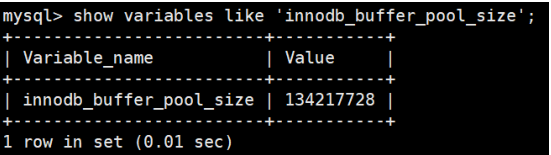
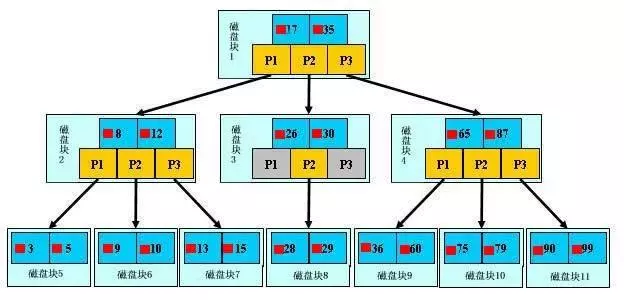

# MySQL

## 基础知识

### 为什么使用数据量

1. 当数据量超过10万行的时候，一般的Xlsx性能就不足够了，这个时候，就需要使用到数据库，而当下最流行的就是Mysql
2. Mysql 可以经进行数据的持久化，同时支持了Sql进行数据查询，内置的多种存储引擎，默认使用的InnoDB， 支持事务，同时在查找性能上也比较优秀
3. Mysql 开源、免费，已经在很多企业当中实际应用，从成本和市场认可度上面，Mysql 也很不错。

综上，所以我们使用了Mysql，同样作为数据库学习的重点

### Mysql的发展简史

- 1995年，Michael Monty Widenius、David Axmark 和 Allan Larsson，在瑞典创立了MySQL AB公司。1996年，发布MySQL 1.0版本，“My”取自联合创始人Micheal Monty Widenius女儿的名字。同年10月，MySQL 3.11.1发布，没有2.x版本。
- 2000年，MySQL对原存储引擎进行了整理，命名为MyISAM
- 2001年，MySQL集成Heikki Tuuri的存储引擎InnoDB，实现了事务处理和行级锁的支持。该年发布的3.23 版本已支持大多数的基本的SQL 操作，并集成了MyISAM和InnoDB 存储引擎。
- 2003年3月，发布MySQL 4.0 ，支持查询缓存、集合并、全文索引，正式支持InnoDB存储引擎。
- 2004年10月，发布经典的MySQL 4.1 ，增加了子查询，utf8字符集等。
- 2005年10月，发布MySQL 5.0 ，增加了视图、存储过程、游标、触发器、分布式事务，迈出了高性能数据库步伐。
- 2008年1月，MySQL AB公司被Sun公司以10亿美金收购。
- 2009年4月，Oracle公司以74亿美元收购Sun公司，MySQL转入Oracle麾下。
- 2010年12月，发布MySQL 5.5 ，增加了半同步复制、信号异常处理、unicode字符集，InnoDB成为默认存储引擎。
- 2011年4月，发布MySQL 5.6 ，增加了GTID复制，支持延时复制、行级复制。
- 2013年2月，发布MySQL 5.7 ，支持原生JSON数据类型。
- 2016年9月，发布MySQL 8.0.0 ；可使用JSON数据的SQL机制；支持GIS；可靠性更高。
- 2018年4月，发布MySQL 8.0.11 GA ，支持NoSQL文档存储、原子的奔溃安全DDL语句、扩展JSON语法，新增JSON表函数，改进排序、分区更新功能。

### 数字版本对比

+ [MySQL 5.7与MySQL 8.0性能比拼，结果怎么样？](https://javazhiyin.blog.csdn.net/article/details/113830129?spm=1001.2101.3001.6650.2&utm_medium=distribute.pc_relevant.none-task-blog-2%7Edefault%7ECTRLIST%7ERate-2-113830129-blog-109376093.pc_relevant_default&depth_1-utm_source=distribute.pc_relevant.none-task-blog-2%7Edefault%7ECTRLIST%7ERate-2-113830129-blog-109376093.pc_relevant_default&utm_relevant_index=5)
+ [MySQL数据库 5.7 vs 8.0性能测评](https://blog.csdn.net/u012811805/article/details/115038167?spm=1001.2101.3001.6650.10&utm_medium=distribute.pc_relevant.none-task-blog-2~default~CTRLIST~Rate-10-115038167-blog-113903927.pc_relevant_layerdownloadsortv1&depth_1-utm_source=distribute.pc_relevant.none-task-blog-2~default~CTRLIST~Rate-10-115038167-blog-113903927.pc_relevant_layerdownloadsortv1&utm_relevant_index=11)

截止目前，官方最新版本为 8.0.27 。

此前，8.0.0 在 2016.9.12日就发布了。

此外，官方还提供了 MySQL Workbench （GUITOOL）一款专为MySQL设计的 ER/数据库建模工具 。它是著名的数据库设计工具DBDesigner4的继任者。MySQLWorkbench又分为两个版本，分别是 社区版（MySQL Workbench OSS）、 商用版 （MySQL WorkbenchSE）。

### 发行版本对比

+ MySQL Community Server 社区版本，开源免费，自由下载，但不提供官方技术支持，适用于大多数普通用户。
+ MySQL Enterprise Edition 企业版本，需付费，不能在线下载，可以试用30天。提供了更多的功能和更完备的技术支持，更适合于对数据库的功能和可靠性要求较高的企业客户。
+ MySQL Cluster 集群版，开源免费。用于架设集群服务器，可将几个MySQL Server封装成一个Server。需要在社区版或企业版的基础上使用。
+ MySQL Cluster CGE 高级集群版，需付费。

### 数据库三大范式是什么

1. 每个列都不可以再拆分。
2. 在第一范式的基础上，非主键列完全依赖于主键，而不能是依赖于主键的一部分。
3. 在第二范式的基础上，非主键列只依赖于主键，不依赖于其他非主键。

在设计数据库结构的时候，要尽量遵守三范式，如果不遵守，必须有足够的理由。比如性能。事实上我们经常会为了性能而妥协数据库的设计。

### mysql有关权限的表都有哪几个

​		MySQL服务器通过权限表来控制用户对数据库的访问，权限表存放在mysql数据库里，由mysql_install_db脚本初始化。这些权限表分别user，db，table_priv，columns_priv和host。下面分别介绍一下这些表的结构和内容：

- user **权限表**：记录允许连接到服务器的用户帐号信息，里面的权限是全局级的。
- db **权限表**：记录各个帐号在各个数据库上的操作权限。
- table_priv **权限表**：记录数据表级的操作权限。
- columns_priv **权限表**：记录数据列级的操作权限。
- host **权限表**：配合db权限表对给定主机上数据库级操作权限作更细致的控制。这个权限表不受GRANT和REVOKE语句的影响。

### 逻辑架构介绍

+ 和其它数据库相比，MySQL有点与众不同，它的架构可以在多种不同场景中应用并发挥良好作用。主要体现在存储引擎的架构上，**插件式的存储引擎架构将查询处理和其它的系统任务以及数据的存储提取相分离。**这种架构可以根据业务的需求和时机需要选择合适的存储引擎。
+ 从上到下，连接层，服务层，引擎层，存储层

### Mysql 服务器工作流程？

1. MySQL服务器端启动，申请3306端口，之后监听这个端口号，等待客户端进程进行连接
2. MySQL客户端启动
    1. 连接器 负责跟客户端建立连接、获取权限、维持和管理连接
    2. 连接完成后，如果你没有后续的动作，这个连接就处于空闲状态，如果太长时间没动静，连接器就会自动将它断开
    3. 建立连接的过程通常是比较复杂的，所以在使用中要尽量减少建立连接的动作，也就是尽量使用长连接。 但是全部使用长连接后，有些时候MySQL占用内存涨得特别快
3. MySQL客户端向MySQL服务器发送SQL语句处理的请求
4. MySQL服务器处理SQL命令具体流程
      1. 连接器：负责跟客户端建立连接、获取权限、维持和管理连
      2. 查询缓存：先把刚刚处理过的查询请求和结果缓存起来，如果下一次有一模一样的请求过来，直接从缓存中查找结果
      3. 分析器：MySQL服务器程序首先要对这段文本做分析，判断请求的语法是否正确，然后从文本中将要查询的表、各种查询条件都提取出来放到MySQL服务器内部使用的一些数据结构上来
      4. 优化器
           1. MySQL的优化程序会对我们的语句做一些优化，如外连接转换为内连接、表达式简化、子查询转为连接等
           2. 优化的结果就是**生成一个执行计划**，这个执行计划表明了应该使用哪些索引进行查询，表之间的连接顺序是什么样的
      5. 执行器：
           1. 开始执行的时候，要先判断一下你对这个表T有没有执行查询的权限，如果没有，就会返回没有权限的错误
           2. 如果有权限，就打开表继续执行

### `binlog`的类型

有三种格式，statement，row和mixed。

- statement模式下，每一条会修改数据的sql都会记录在binlog中。不需要记录每一行的变化。
- row级别下，基本是可以全部记下来但是由于很多操作，会导致大量行的改动(，因此这种模式的文件保存的信息太多，日志量太大。
- mixed，一种折中的方案，普通操作使用statement记录，当无法使用statement的时候使用row。

此外，新版的MySQL中对row级别也做了一些优化，当表结构发生变化的时候，会记录语句而不是逐行记录。

## 数据库缓冲池

+ InnoDB 存储引擎是以页为单位来管理存储空间的，我们进行的增删改查操作其实本质上都是在访问页面（包括读页面、写页面、创建新页面等操作）。而磁盘 I/O 需要消耗的时间很多，而在内存中进行操作，效率则会高很多，为了能让数据表或者索引中的数据随时被我们所用，DBMS 会申请 占用内存来作为数据缓冲池 ，在真正访问页面之前，需要把在磁盘上的页缓存到内存中的 Buffer Pool 之后才可以访问。
+ 这样做的好处是可以让磁盘活动最小化，从而 减少与磁盘直接进行 I/O 的时间 。要知道，这种策略对提升 SQL 语句的查询性能来说至关重要。如果索引的数据在缓冲池里，那么访问的成本就会降低很多。

### 缓冲池（Buffer Pool）

首先我们需要了解在 InnoDB 存储引擎中，缓冲池都包括了哪些。

在 InnoDB 存储引擎中有一部分数据会放到内存中，缓冲池则占了这部分内存的大部分，它用来存储各种数据的缓存，如下图所示

从图中，你能看到 InnoDB 缓冲池包括了数据页、索引页、插入缓冲、锁信息、自适应 Hash 和数据字典信息等。

**缓存原则：**

“ 位置 * 频次 ”这个原则，可以帮我们对 I/O 访问效率进行优化。

+ 首先，位置决定效率，提供缓冲池就是为了在内存中可以直接访问数据。
+ 其次，频次决定优先级顺序。因为缓冲池的大小是有限的，比如磁盘有 200G，但是内存只有 16G，缓冲池大小只有 1G，就无法将所有数据都加载到缓冲池里，这时就涉及到优先级顺序，会优先对使用频次高的热数据进行加载 。

### 查询缓存

查询缓存是提前把 查询结果缓存 起来，这样下次不需要执行就可以直接拿到结果。需要说明的是，在MySQL 中的查询缓存，不是缓存查询计划，而是查询对应的结果。因为命中条件苛刻，而且只要数据表发生变化，查询缓存就会失效，因此命中率低。

### 缓冲池如何读取数据

缓冲池管理器会尽量将经常使用的数据保存起来，在数据库进行页面读操作的时候，首先会判断该页面是否在缓冲池中，如果存在就直接读取，如果不存在，就会通过内存或磁盘将页面存放到缓冲池中再进行读取。

缓存在数据库中的结构和作用如下图所示：

### 查看设置缓冲池的大小

~~~sql
show variables like 'innodb_buffer_pool_size';
~~~

你能看到此时 InnoDB 的缓冲池大小只有 134217728/1024/1024=128MB。我们可以修改缓冲池大小，比如改为256MB，方法如下：

~~~sql
set global innodb_buffer_pool_size = 268435456;
~~~

## 数据类型

### mysql有哪些数据类型

| **分类**             | **类型名称** | **说明**                                                     |
| -------------------- | ------------ | ------------------------------------------------------------ |
| **整数类型**         | tinyInt      | 很小的整数(8位二进制)                                        |
|                      | smallint     | 小的整数(16位二进制)                                         |
|                      | mediumint    | 中等大小的整数(24位二进制)                                   |
|                      | int(integer) | 普通大小的整数(32位二进制)                                   |
| **小数类型**         | float        | 单精度浮点数                                                 |
|                      | double       | 双精度浮点数                                                 |
|                      | decimal(m,d) | 压缩严格的定点数                                             |
| **日期类型**         | year         | YYYY 1901~2155                                               |
|                      | time         | HH:MM:SS -838:59:59~838:59:59                                |
|                      | date         | YYYY-MM-DD 1000-01-01~9999-12-3                              |
|                      | datetime     | YYYY-MM-DD HH:MM:SS 1000-01-01 00:00:00~ 9999-12-31 23:59:59 |
|                      | timestamp    | YYYY-MM-DD HH:MM:SS 19700101 00:00:01 UTC~2038-01-19 03:14:07UTC |
| **文本、二进制类型** | CHAR(M)      | M为0~255之间的整数                                           |
|                      | VARCHAR(M)   | M为0~65535之间的整数                                         |
|                      | TINYBLOB     | 允许长度0~255字节                                            |
|                      | BLOB         | 允许长度0~65535字节                                          |
|                      | MEDIUMBLOB   | 允许长度0~167772150字节                                      |
|                      | LONGBLOB     | 允许长度0~4294967295字节                                     |
|                      | TINYTEXT     | 允许长度0~255字节                                            |
|                      | TEXT         | 允许长度0~65535字节                                          |
|                      | MEDIUMTEXT   | 允许长度0~167772150字节                                      |
|                      | LONGTEXT     | 允许长度0~4294967295字节                                     |
|                      | VARBINARY(M) | 允许长度0~M个字节的变长字节字符串                            |
|                      | BINARY(M)    | 允许长度0~M个字节的定长字节字符串                            |

- `1、整数类型`，包括TINYINT、SMALLINT、MEDIUMINT、INT、BIGINT，分别表示1字节、2字节、3字节、4字节、8字节整数。任何整数类型都可以加上UNSIGNED属性，表示数据是无符号的，即非负整数。
  `长度`：整数类型可以被指定长度，例如：INT(11)表示长度为11的INT类型。长度在大多数场景是没有意义的，它不会限制值的合法范围，只会影响显示字符的个数，而且需要和UNSIGNED ZEROFILL（自动用0补全其他位）属性配合使用才有意义。
  `例子`，假定类型设定为INT(5)，属性为UNSIGNED ZEROFILL，如果用户插入的数据为12的话，那么数据库实际存储数据为00012。

- `2、实数类型`，包括FLOAT、DOUBLE、DECIMAL。
  DECIMAL可以用于存储比BIGINT还大的整型，能存储精确的小数。
  而FLOAT和DOUBLE是有取值范围的，并支持使用标准的浮点进行近似计算。
  计算时FLOAT和DOUBLE相比DECIMAL效率更高一些，DECIMAL你可以理解成是用字符串进行处理。

- `3、字符串类型`，包括VARCHAR、CHAR、TEXT、BLOB
  VARCHAR用于存储可变长字符串，它比定长类型更节省空间。
  VARCHAR使用额外1或2个字节存储字符串长度。列长度小于255字节时，使用1字节表示，否则使用2字节表示。
  
  1. VARCHAR存储的内容超出设置的长度时，内容会被截断。
  2. CHAR是定长的，根据定义的字符串长度分配足够的空间。
  3. CHAR会根据需要使用空格进行填充方便比较。
  4. CHAR适合存储很短的字符串，或者所有值都接近同一个长度。
  5. CHAR存储的内容超出设置的长度时，内容同样会被截断。
  
  **使用策略：**
  
  1. 对于经常变更的数据来说，CHAR比VARCHAR更好，因为CHAR不容易产生碎片。
  2. 对于非常短的列，CHAR比VARCHAR在存储空间上更有效率。
  3. 使用时要注意只分配需要的空间，更长的列排序时会消耗更多内存。
  4. 尽量避免使用TEXT/BLOB类型，查询时会使用临时表，导致严重的性能开销。
  
- `4、枚举类型（ENUM）`，把不重复的数据存储为一个预定义的集合。
  
  1. 有时可以使用ENUM代替常用的字符串类型。
  2. ENUM存储非常紧凑，会把列表值压缩到一个或两个字节。
  3. ENUM在内部存储时，其实存的是整数。
  4. 尽量避免使用数字作为ENUM枚举的常量，因为容易混乱。
  5. 排序是按照内部存储的整数
  
- `5、日期和时间类型`，
  
  1. 尽量使用timestamp，空间效率高于datetime，
  2. 用整数保存时间戳通常不方便处理。
  3. 如果需要存储微妙，可以使用bigint存储。
  4. 看到这里，这道真题是不是就比较容易回答了。
  

### 设置`int`长度有用？

1. 整数类型可以被指定长度，例如：INT(11)表示长度为11的INT类型。长度在大多数场景是没有意义的，它不会限制值的合法范围，只会影响显示字符的个数，而且需要和UNSIGNED ZEROFILL（自动用0补全其他位）属性配合使用才有意义。
2. `例子`，假定类型设定为INT(5)，属性为UNSIGNED ZEROFILL，如果用户插入的数据为12的话，那么数据库实际存储数据为00012。

### 如何选择字符类型？

字符串类型：VARCHAR、CHAR、TEXT、BLOB

1. VARCHAR用于存储可变长字符串，它比定长类型更节省空间。
2. VARCHAR使用额外1或2个字节存储字符串长度。列长度小于255字节时，使用1字节表示，否则使用2字节表示。
3. VARCHAR存储的内容超出设置的长度时，内容会被截断。
4. CHAR是定长的，根据定义的字符串长度分配足够的空间。
5. CHAR会根据需要使用空格进行填充方便比较。
6. CHAR适合存储很短的字符串，或者所有值都接近同一个长度。
7. CHAR存储的内容超出设置的长度时，内容同样会被截断。

**使用策略：**

1. 对于经常变更的数据来说，CHAR比VARCHAR更好，因为CHAR不容易产生碎片。
2. 对于非常短的列，CHAR比VARCHAR在存储空间上更有效率。
3. 使用时要注意只分配需要的空间，更长的列排序时会消耗更多内存。
4. 尽量避免使用TEXT/BLOB类型，查询时会使用临时表，导致严重的性能开销。

### 如何使用枚举类型？

`枚举类型（ENUM）`，把不重复的数据存储为一个预定义的集合。

1. 有时可以使用ENUM代替常用的字符串类型。
2. ENUM存储非常紧凑，会把列表值压缩到一个或两个字节。
3. ENUM在内部存储时，其实存的是整数。
4. 尽量避免使用数字作为ENUM枚举的常量，因为容易混乱。
5. 排序是按照内部存储的整数

## 存储引擎

### 查看引擎

查看命令

- 如何用命令查看
  - 看你的mysql现在已提供什么存储引擎：show engines；
  - 看你的mysql当前默认的存储引擎：show variables like ‘%storage_engine%’;

~~~bash
# 查看搜索引擎
show engines
~~~

~~~bash
# 修改搜索引擎
alter table tableName engine = 存储引擎名;

# 显示索引的状态
SHOW ENGINE INNODB STATUS;
~~~

### 存储引擎种类

常用的存储引擎有以下：

- **Innodb引擎**：提供了对数据库ACID事务的支持。并且还提供了行级锁和外键的约束。它的设计的目标就是处理大数据容量的数据库系统。会有数据的缓冲池，进而提高查询效率。
- **MyIASM引擎**：不提供事务的支持，也不支持行级锁和外键，但是存储空间小，可节省空间，主要用作全文索引
- **MEMORY引擎**：所有的数据都在内存中，数据的处理速度快，但是安全性不高。

### Memory 引擎

**概述**：

Memory采用的逻辑介质是 内存 ， 响应速度很快 ，但是当mysqld守护进程崩溃的时候 数据会丢失 。另外，要求存储的数据是数据长度不变的格式，比如，Blob和Text类型的数据不可用(长度不固定的)。

**主要特征**：

+ Memory同时 支持哈希（HASH）索引 和 B+树索引 。
+ Memory表至少比MyISAM表要 快一个数量级 。
+ MEMORY 表的大小是受到限制 的。表的大小主要取决于两个参数，分别是max_rows 和max_heap_table_size 。其中，max_rows可以在创建表时指定；max_heap_table_size的大小默认为16MB，可以按需要进行扩大。
+ 数据文件与索引文件分开存储。
+ 缺点：
  + 其数据易丢失，生命周期短。
  + 基于这个缺陷，选择MEMORY存储引擎时需要特别小心。

**使用Memory存储引擎的场景：**

1.  目标数据比较小 ，而且非常 频繁的进行访问 ，在内存中存放数据，如果太大的数据会造成 内存溢出 。可以通过参数 max_heap_table_size 控制Memory表的大小，限制Memory表的最大的大小。
2.  如果 数据是临时的 ，而且 必须立即可用 得到，那么就可以放在内存中。
3. 存储在Memory表中的数据如果突然间 丢失的话也没有太大的关系 。

### MyISAM 引擎

**主要的非事务处理存储引擎**

+ MyISAM提供了大量的特性，包括全文索引、压缩、空间函数(GIS)等，但MyISAM 不支持事务、行级锁、外键 ，有一个毫无疑问的缺陷就是 崩溃后无法安全恢复 。
+ 5.5之前默认的存储引擎
+ 优势是访问的 速度快 ，对事务完整性没有要求或者以SELECT、INSERT为主的应用
+ 针对数据统计有额外的常数存储。故而 count(*) 的查询效率很高
+ 数据文件结构：
  + 表名.frm 存储表结构
  + 表名.MYD 存储数据 (MYData)
  + 表名.MYI 存储索引 (MYIndex)
+ 应用场景：只读应用或者以读为主的业务

###  InnoDB 引擎

**具备外键支持功能的事务存储引擎**

+ MySQL从3.23.34a开始就包含InnoDB存储引擎。 大于等于5.5之后，默认采用InnoDB引擎 。
+ InnoDB是MySQL的 默认事务型引擎 ，它被设计用来处理大量的短期(short-lived)事务。可以确保事务的完整提交(Commit)和回滚(Rollback)。
+ 除了增加和查询外，还需要更新、删除操作，那么，应优先选择InnoDB存储引擎。
+ 除非有非常特别的原因需要使用其他的存储引擎，否则应该优先考虑InnoDB引擎。
+ 数据文件结构：
  + 表名.frm 存储表结构（MySQL8.0时，合并在表名.ibd中）
  + 表名.ibd 存储数据和索引
+ InnoDB是 为处理巨大数据量的最大性能设计 。
  + 在以前的版本中，字典数据以元数据文件、非事务表等来存储。现在这些元数据文件被删除了。比如： .frm ，  .par ， .trn ，  .isl ， .db.opt 等都在MySQL8.0中不存在了。
+ 对比MyISAM的存储引擎， InnoDB写的处理效率差一些 ，并且会占用更多的磁盘空间以保存数据和索引。
+ MyISAM只缓存索引，不缓存真实数据；InnoDB不仅缓存索引还要缓存真实数据， 对内存要求较高 ，而且内存大小对性能有决定性的影响。

### InnoDB引擎的4大特性

- 插入缓冲 -> 保证写入性能
  - 插入缓存之前版本叫insert buffer，现版本 change buffer，主要提升插入性能，change buffer是insert buffer的加强，insert buffer只针对insert有效，change buffering对insert、delete、update(delete+insert)、purge都有效

- 二次写-.双写机制 -> 提升数据的可靠性
  - **Doublewrite缓存是位于系统表空间的存储区域**，用来缓存InnoDB的数据页从innodb buffer pool中flush之后并写入到数据文件之前，所以当操作系统或者数据库进程在数据页写磁盘的过程中崩溃，**Innodb可以在doublewrite缓存中找到数据页的备份而用来执行crash恢复**。数据页写入到doublewrite缓存的动作所需要的IO消耗要小于写入到数据文件的消耗，因为此写入操作会以一次大的连续块的方式写入
  - 在应用（apply）重做日志前，用户需要一个页的副本，当写入失效发生时，先通过页的副本来还原该页，再进行重做，这就是double write。doublewrite组成：
    - 内存中的doublewrite buffer,大小2M。
    - 物理磁盘上共享表空间中连续的128个页，即2个区（extend），大小同样为2M。

  - 对缓冲池的脏页进行刷新时，不是直接写磁盘，而是会通过memcpy()函数将脏页先复制到内存中的doublewrite buffer，之后通过doublewrite 再分两次，每次1M顺序地写入共享表空间的物理磁盘上，在这个过程中，因为doublewrite页是连续的，因此这个过程是顺序写的，开销并不是很大。在完成doublewrite页的写入后，再将doublewrite buffer 中的页写入各个 表空间文件中，此时的写入则是离散的。如果操作系统在将页写入磁盘的过程中发生了崩溃，在恢复过程中，innodb可以从共享表空间中的doublewrite中找到该页的一个副本，将其复制到表空间文件，再应用重做日志。

- 自适应哈希索引(ahi)
  -  哈希算法查找的时间复杂度的为O(1)，而利用的B+数的查找次序为3-4层，故需要查询的次数为3-4次查询数据。InnoDB存储引擎会建立会监控的对表上各种索引的查询的，如果观察到哈希索引带来的速度的提升，则建立的哈希索引结构。自称为的自适应哈希的索引。

- 预读(read ahead)
  - 预读操作是一种IO操作，用于异步将磁盘的中的数据的读取到buffer pool中，预料中的数据页会被马上读到，预读请求中的所有页会被添加到的一个的范围之内。InnoDB共有两个的预读算法。
    - 线性预读技术：在buffer pool中被访问到的数据的他临近的页会被的很快的访问到。能够通过的调整连续访问的页的数量来控住InnoDB中的预读操作，使用参数InnoDB_read_ahead_threshold配置，添加这个参数前，InnoDB会读取的当前区段的最后一页才开始进行预读。
    - 随机预读：通过buffer pool存中的预测哪些页很快被访问，而不考虑这些页的读取顺序，如果发现的buffer pool中存在的一个区段的13个连续的页，如果的innoDB会异步发起预读的请求占据的这个页。

### 存储引擎选择

如果没有特别的需求，使用默认的`Innodb`即可。

+ `MyISAM`：以读写插入为主的应用程序，比如博客系统、新闻门户网站。
+ `Innodb`：更新（删除）操作频率也高，或者要保证数据的完整性；并发量高，支持事务和外键。比如OA自动化办公系统。

## 索引

### 什么是索引？

​		索引是一种数据结构。索引的实现通常使用B树及其变种B+树。更通俗的说，索引就相当于目录。它是一个文件。

### 索引有哪些优缺点？

索引的优点

- 可以大大加快数据的检索速度。

索引的缺点

- 时间方面：创建索引和维护索引要耗费时间，大量的索引会降低了mysql的执行效率；
- 空间方面：索引需要占物理空间。

### 索引有哪几种类型？

**主键索引:** 数据列不允许重复，不允许为NULL，一个表只能有一个主键。

**唯一索引:** 数据列不允许重复，允许为NULL值，一个表允许多个列创建唯一索引。

**普通索引:** 基本的索引类型，没有唯一性的限制，允许为NULL值。

**全文索引：** 是目前搜索引擎使用的一种关键技术。

### InnoDB的索引数据结构有哪些？

​		在`MySQL`中使用较多的索引有**Hash索引**，**B+树索引**等，`InnoDB`存储引**擎的默认索引实现为：B+树索引**。对于哈希索引来说，底层的数据结构就是哈希表，因此在绝大多数需求为单条记录查询的时候，可以选择哈希索引，查询性能最快；其余大部分场景，建议选择`BTree`索引。

**B树索引**

​		`mysql`通过存储引擎取数据，基本上90%的人用的就是InnoDB了，按照实现方式分，InnoDB的索引类型目前只有两种：BTREE（B树）索引和HASH索引。B树索引是Mysql数据库中使用最频繁的索引类型，基本所有存储引擎都支持BTree索引。通常我们说的索引不出意外指的就是（B树）索引（实际是用B+树实现的，因为在查看表索引时，mysql一律打印BTREE，所以简称为B树索引）

查询方式：

​		主键索引区:PI(关联保存的时数据的地址)按主键查询,

​		普通索引区:`si`(关联的id的地址,然后再到达上面的地址)。所以按主键查询,速度最快

1. B+tree性质：

   1. n 棵子 tree 的节点包含 n 个关键字，不用来保存数据而是保存数据的索引。	
   2. 所有的叶子结点中包含了全部关键字的信息，及指向含这些关键字记录的指针，且叶子结点本身依关键字的大小自小而大顺序链接。
   3. 所有的非终端结点可以看成是索引部分，结点中仅含其子树中的最大（或最小）关键字。
   4. B+ 树中，数据对象的插入和删除仅在叶节点上进行。
   5. B+树有2个头指针，一个是树的根节点，一个是最小关键码的叶节点。

2. 哈希索引

   简要说下，类似于数据结构中简单实现的HASH表（散列表）一样，当我们在mysql中用哈希索引时，主要就是通过Hash算法（常见的Hash算法有直接定址法、平方取中法、折叠法、除数取余法、随机数法），将数据库字段数据转换成定长的Hash值，与这条数据的行指针一并存入Hash表的对应位置；如果发生Hash碰撞（两个不同关键字的Hash值相同），则在对应Hash键下以链表形式存储。当然这只是简略模拟图。

### B树和B+树的区别

- 在B树中，你可以将键和值存放在内部节点和叶子节点；但在B+树中，内部节点都是键，没有值，叶子节点同时存放键和值。

- B+树的叶子节点有一条链相连，而B树的叶子节点各自独立。

  

### 使用B树的好处

​		B树可以在内部节点同时存储键和值，因此，把频繁访问的数据放在靠近根节点的地方将会大大提高热点数据的查询效率。这种特性使得B树在特定数据重复多次查询的场景中更加高效。

### 使用B+树的好处

​		由于B+树的内部节点只存放键，不存放值，因此，一次读取，可以在内存页中获取更多的键，有利于更快地缩小查找范围。 B+树的叶节点由一条链相连，因此，当需要进行一次全数据遍历的时候，B+树只需要使用O(logN)时间找到最小的一个节点，然后通过链进行O(N)的顺序遍历即可。而B树则需要对树的每一层进行遍历，这会需要更多的内存置换次数，因此也就需要花费更多的时间

### Hash索引和B+树所有有什么区别或者说优劣呢?

​		首先要知道Hash索引和B+树索引的底层实现原理：

**hash索引底层就是hash表**，进行查找时，调用一次hash函数就可以获取到相应的键值，之后进行回表查询获得实际数据。**B+树底层实现是多路平衡查找树**。对于每一次的查询都是从根节点出发，查找到叶子节点方可以获得所查键值，然后根据查询判断是否需要回表查询数据。

那么可以看出他们有以下的不同：

- **hash索引进行等值查询更快(一般情况下)，但是却无法进行范围查询。**

  ​		因为在hash索引中经过hash函数建立索引之后，索引的顺序与原顺序无法保持一致，不能支持范围查询。而B+树的的所有节点皆遵循(左节点小于父节点，右节点大于父节点，多叉树也类似)，天然支持范围。

- hash索引不支持使用索引进行排序，原理同上。

- hash索引不支持模糊查询以及多列索引的最左前缀匹配。原理也是因为hash函数的不可预测。AAAA和AAAAB的索引没有相关性。

- hash索引任何时候都避免不了回表查询数据，而B+树在符合某些条件(聚簇索引，覆盖索引等)的时候可以只通过索引完成查询。

- **hash索引虽然在等值查询上较快，但是不稳定。性能不可预测，当某个键值存在大量重复的时候，发生hash碰撞**，（MySql 解决Hash冲突的方法是也是链表叠加的形式，类似 HashMap 中的链表）此时效率可能极差。而B+树的查询效率比较稳定，对于所有的查询都是从根节点到叶子节点，且树的高度较低。

  因此，在大多数情况下，直接选择B+树索引可以获得稳定且较好的查询速度。而不需要使用hash索引。

### 数据库为什么使用B+树而不是B树

- **B树只适合随机检索，而B+树同时支持随机检索和顺序检索；**
- **B+树空间利用率更高，可减少I/O次数，磁盘读写代价更低**。一般来说，索引本身也很大，不可能全部存储在内存中，因此索引往往以索引文件的形式存储的磁盘上。这样的话，索引查找过程中就要产生磁盘I/O消耗。B+树的内部结点并没有指向关键字具体信息的指针，只是作为索引使用，其内部结点比B树小，盘块能容纳的结点中关键字数量更多，一次性读入内存中可以查找的关键字也就越多，相对的，IO读写次数也就降低了。而IO读写次数是影响索引检索效率的最大因素；
- **B+树的查询效率更加稳定**。B树搜索有可能会在非叶子结点结束，越靠近根节点的记录查找时间越短，只要找到关键字即可确定记录的存在，其性能等价于在关键字全集内做一次二分查找。而在B+树中，顺序检索比较明显，随机检索时，任何关键字的查找都必须走一条从根节点到叶节点的路，所有关键字的查找路径长度相同，导致每一个关键字的查询效率相当。
- **B树在提高了磁盘IO性能的同时并没有解决元素遍历的效率低下的问题**。B+树的叶子节点使用指针顺序连接在一起，只要遍历叶子节点就可以实现整棵树的遍历。而且在数据库中基于范围的查询是非常频繁的，而B树不支持这样的操作。
- **增删文件（节点）时，效率更高。因为B+树的叶子节点包含所有关键字，并以有序的链表结构存储，这样可很好提高增删效率。**
- 在Mysql的命令行界面显示的索引数据类型是B树，但实际上是B+树
- B+树在满足聚簇索引和覆盖索引的时候不需要回表查询数据，在B+树的索引中，叶子节点可能存储了当前的key值，也可能存储了当前的key值以及整行的数据，这就是聚簇索引和非聚簇索引。 在InnoDB中，只有主键索引是聚簇索引，如果没有主键，则挑选一个唯一键建立聚簇索引。如果没有唯一键，则隐式的生成一个键来建立聚簇索引。
- 当查询使用聚簇索引时，在对应的叶子节点，可以获取到整行数据，因此不用再次进行回表查询。

### B+树对比红黑树？

红黑树是二叉搜索树，相较于B+树来说，每一层能够容纳的数据量有限，当数据比较多的时候，树的层高就会显得非常的高了，所以红黑树并不适合作为索引

### 索引的基本原理

​        索引用来快速地寻找那些具有特定值的记录。如果没有索引，一般来说执行查询时遍历整张表。索引的原理很简单，就是把无序的数据变成有序的查询。

1. 把创建了索引的列的内容进行排序
2. 对排序结果生成倒排表
3. 在倒排表内容上拼上数据地址链
4. 在查询的时候，先拿到倒排表内容，再取出数据地址链，从而拿到具体数据

### 索引设计的总则？

索引的是通过空间换时间的方式，所以索引总则：查询更快，占用空间更小

### 创建索引的注意事项？

索引虽好，但也不是无限制的使用，最好符合一下几个原则

1. 最左前缀匹配原则，组合索引非常重要的原则，mysql会一直向右匹配直到遇到范围查询(>、<、between、like)就停止匹配，比如a = 1 and b = 2 and c > 3 and d = 4 如果建立(a,b,c,d)顺序的索引，d是用不到索引的，如果建立(a,b,d,c)的索引则都可以用到，a,b,d的顺序可以任意调整。
2. 较频繁作为查询条件的字段才去创建索引
3. 更新频繁字段不适合创建索引
4. 需要能够有效区分数据的列做索引列(如性别，男女未知，最多也就三种，区分度实在太低，不适合作为索引)
5. 尽量的扩展索引，不要新建索引。比如表中已经有a的索引，现在要加(a,b)的索引，那么只需要修改原来的索引即可。
6. 定义有外键的数据列一定要建立索引。
7. 对于那些查询中很少涉及的列，重复值比较多的列不要建立索引。
8. 对于定义为text、image和bit的数据类型的列不要建立索引

### 使用索引一定能提高查询的性能吗？

通常，通过索引查询数据比全表扫描要快。但是我们也必须注意到它的代价。

- 索引需要空间来存储，也需要定期维护， 每当有记录在表中增减或索引列被修改时，索引本身也会被修改。那些不必要的索引反而会使MySql性能降低，频繁维护索引，导致查询效率降低

- 索引范围查询(INDEX RANGE SCAN)适用于两种情况:

  - 基于一个范围的检索，一般查询返回结果集小于表中记录数的30%
  - 基于非唯一性索引的检索

### 百万级别以上的数据删除

查询MySQL官方手册得知删除数据的速度和创建的索引数量是成正比的。

1. 所以我们想要删除百万数据的时候可以先删除索引（此时大概耗时三分多钟）
2. 然后删除其中无用数据（此过程需要不到两分钟）
3. 删除完成后重新创建索引(此时数据较少了)创建索引也非常快，约十分钟左右。
4. 与之前的直接删除绝对是要快速很多，更别说万一删除中断,一切删除会回滚。那更是坑了。

### 前缀索引

​		语法：`index(field(10))`，使用字段值的前10个字符建立索引，默认是使用字段的全部内容建立索引。

​		前提：前缀的标识度高。

​		实操的难度：在于前缀截取的长度。

​		我们可以利用`select count(*)/count(distinct left(password,prefixLen));`，通过从调整`prefixLen`的值（从1自增）查看不同前缀长度的一个平均匹配度，接近1时就可以了（表示一个密码的前`prefixLen`个字符几乎能确定唯一一条记录）

### 什么是最左前缀原则？

- 顾名思义，就是最左优先，在创建多列索引时，要根据业务需求，where子句中使用最频繁的一列放在最左边。
- 最左前缀匹配原则，非常重要的原则，mysql会一直向右匹配直到遇到范围查询(>、<、between、like)就停止匹配，比如a = 1 and b = 2 and c > 3 and d = 4 如果建立(a,b,c,d)顺序的索引，d是用不到索引的，如果建立(a,b,d,c)的索引则都可以用到，a,b,d的顺序可以任意调整。
- **=和in可以乱序，比如a = 1 and b = 2 and c = 3 建立(a,b,c)索引可以任意顺序**，mysql的查询优化器会帮你优化成索引可以识别的形式

### 什么聚簇索引与非聚簇索引

- 聚簇索引：将数据存储与索引放到了一块，找到索引也就找到了数据
- 非聚簇索引：将数据存储于索引分开结构，索引结构的叶子节点指向了数据的对应行，myisam通过key_buffer把索引先缓存到内存中，当需要访问数据时（通过索引访问数据），在内存中直接搜索索引，然后通过索引找到磁盘相应数据，这也就是为什么索引不在key buffer命中时，速度慢的原因

澄清一个概念：innodb中，在聚簇索引之上创建的索引称之为辅助索引，辅助索引访问数据总是需要二次查找，非聚簇索引都是辅助索引，像复合索引、前缀索引、唯一索引，辅助索引叶子节点存储的不再是行的物理位置，而是主键值

### 非聚簇索引一定会回表查询吗？

​		不一定，这涉及到查询语句所要求的字段是否全部命中了索引，如果全部命中了索引，那么就不必再进行回表查询。

​		举个简单的例子，假设我们在员工表的年龄上建立了索引，那么当进行`select age from employee where age < 20`的查询时，在索引的叶子节点上，已经包含了age信息，不会再次进行回表查询。

### 什么情况下会索引失效？

+ 没有使用where语句
+ 对索引列进行函数计算
+ 对索引列进行类型转换：比如索引是数字，但传入的是字符串
+ 使用 like 通配符在开头
+ 使用 or 条件查询时，不包含索引列
+ 查询条件涉及大量数据（Mysql认为这个时候使用索引的意义不大）

## MVCC

**MVCC** 并发版本控制，同时使用版本号来避免使用锁，从而提高数据库的读写性能

### 当前读和快照读

在学习MVCC多版本并发控制之前，我们必须先了解一下，什么是MySQL InnoDB下的`当前读`和`快照读`?

- **当前读**
  像select lock in share mode(`共享锁`), select for update ; update, insert ,delete(`排他锁`)这些操作都是一种当前读，为什么叫当前读？就是它读取的是记录的最新版本，读取时还要保证其他并发事务不能修改当前记录，会对读取的记录进行加锁
- **快照读**
  像`不加锁`的select操作就是快照读，即不加锁的非阻塞读；**串行级别下的快照读会退化成当前读**；快照读的实现是基于多版本并发控制，即MVCC,可以认为MVCC是行锁的一个变种，但它在很多情况下，避免了加锁操作，降低了开销；既然是基于多版本，即快照读可能读到的并不一定是数据的最新版本，而有可能是之前的历史版本

### MVCC能解决什么问题，好处是？

**数据库并发场景有三种，分别为：**

- `读-读`：不存在任何问题，也不需要并发控制
- `读-写`：有线程安全问题，可能会造成事务隔离性问题，可能遇到脏读，幻读，不可重复读
- `写-写`：有线程安全问题，可能会存在更新丢失问题，比如第一类更新丢失，第二类更新丢失

**MVCC带来的好处是？**

多版本并发控制（MVCC）是一种用来解决**`读-写冲突`**的无锁并发控制，也就是为事务分配单向增长的时间戳，为每个修改保存一个版本，版本与事务时间戳关联，读操作只读该事务开始前的数据库的快照。 所以MVCC可以为数据库解决以下问题

- 在并发读写数据库时，可以做到在读操作时不用阻塞写操作，写操作也不用阻塞读操作，提高了数据库并发读写的性能
- 同时还可以解决脏读，幻读，不可重复读等事务隔离问题，
- 但不能解决更新丢失问题

**小结一下**

总之，MVCC就是因为大牛们，不满意只让数据库采用悲观锁这样性能不佳的形式去解决读-写冲突问题，而提出的解决方案，所以**在数据库中，因为有了MVCC，所以我们可以形成两个组合：**

- `MVCC + 悲观锁`：MVCC解决读写冲突，悲观锁解决写写冲突
- `MVCC + 乐观锁`：MVCC解决读写冲突，乐观锁解决写写冲突

这种组合的方式就可以最大程度的提高数据库并发性能，并解决读写冲突，和写写冲突导致的问题

### MVCC的实现原理	

+ **概念：**MvCC 主要用来并发多版本控制的，是行级锁的一个变种，为了避免在高并发的情况下，并发加锁和解锁带来的性能损耗，目前支持两种隔离级别：读已提交，可重复读。
+ **单条数据实现方式：**
  + 在 Mysql 中每张表的后面都有三个隐藏字段，
    + 主要用来记录事务ID: trx_id
    + 回滚指针：roll_pointer
    + 和一个隐藏的主键ID，
  + 当发生记录修改的时候，旧的数据会被写入到一个undoLog，然后数据中会记录一个事务Id和回滚指针，然后新的数据会被写入到数据表中，如果数据不需要更改，那么mysql就会把数据回滚。
+ **多条数据的实现方式：**
  + 如果在写入数据的时候，有其他的数据插入，那么还会重新生成一条新的undoLog，
  + 这个时候undoLog表中会存在两条旧的数据，(**当每个事务开启时，都会被分配一个ID, 这个ID是递增的，所以最新的事务，ID值越大**）
  + 数据库会根据对比事务Id的结果决定将那条数据回滚

## 数据库事务

### 事务日志

事务有4种特性：原子性、一致性、隔离性和持久性。那么事务的四种特性到底是基于什么机制实现呢？

+ 事务的隔离性由 锁机制 实现。
  + 而事务的原子性、一致性和持久性由事务的 redo 日志和undo 日志来保证。
    REDO LOG 称为 重做日志 ，提供再写入操作，恢复提交事务修改的页操作，用来保证事务的持久性。
  + UNDO LOG 称为 回滚日志 ，回滚行记录到某个特定版本，用来保证事务的原子性、一致性。

有的DBA或许会认为 UNDO 是 REDO 的逆过程，其实不然。

### redo日志

#### 为什么需要REDO日志

一方面，缓冲池可以帮助我们消除CPU和磁盘之间的鸿沟，checkpoint机制可以保证数据的最终落盘，然而由于checkpoint 并不是每次变更的时候就触发 的，而是master线程隔一段时间去处理的。所以最坏的情况就是事务提交后，刚写完缓冲池，数据库宕机了，那么这段数据就是丢失的，无法恢复。

另一方面，事务包含 持久性 的特性，就是说对于一个已经提交的事务，在事务提交后即使系统发生了崩溃，这个事务对数据库中所做的更改也不能丢失。

那么如何保证这个持久性呢？ 一个简单的做法 ：在事务提交完成之前把该事务所修改的所有页面都刷新到磁盘，但是这个简单粗暴的做法有些问题

另一个解决的思路 ：我们只是想让已经提交了的事务对数据库中数据所做的修改永久生效，即使后来系统崩溃，在重启后也能把这种修改恢复出来。所以我们其实没有必要在每次事务提交时就把该事务在内存中修改过的全部页面刷新到磁盘，只需要把 修改 了哪些东西 记录一下 就好。比如，某个事务将系统表空间中 第10号 页面中偏移量为 100 处的那个字节的值 1 改成 2 。我们只需要记录一下：将第0号表空间的10号页面的偏移量为100处的值更新为2。

#### REDO日志的好处、特点

1. 好处
  1. redo日志降低了刷盘频率
  2. redo日志占用的空间非常小
2. 特点
  1. redo日志是顺序写入磁盘的
  2. 事务执行过程中，redo log不断记录

#### redo的组成

Redo log可以简单分为以下两个部分：

+ 重做日志的缓冲 (redo log buffer) ，保存在内存中，是易失的。
  + 参数设置：innodb_log_buffer_size：
  + redo log buffer 大小，默认 16M ，最大值是4096M，最小值为1M。

~~~sql
mysql> show variables like '%innodb_log_buffer_size%';
+------------------------+----------+
| Variable_name     | Value  |
+------------------------+----------+
| innodb_log_buffer_size | 16777216 |
+------------------------+----------+
~~~

+ 重做日志文件 (redo log file) ，保存在硬盘中，是持久的。

### 什么是数据库事务？

​		事务是一个不可分割的数据库操作序列，也是数据库并发控制的基本单位，其执行的结果必须使数据库从一种一致性状态变到另一种一致性状态。事务是逻辑上的一组操作，要么都执行，要么都不执行。

​		事务最经典也经常被拿出来说例子就是转账了。

​		假如小明要给小红转账1000元，这个转账会涉及到两个关键操作就是：将小明的余额减少1000元，将小红的余额增加1000元。万一在这两个操作之间突然出现错误比如银行系统崩溃，导致小明余额减少而小红的余额没有增加，这样就不对了。事务就是保证这两个关键操作要么都成功，要么都要失败。

### 事务的四大特性(ACID)介绍一下?

关系性数据库需要遵循ACID规则，具体内容如下：

1. **原子性：** 事务是最小的执行单位，不允许分割。事务的原子性确保动作要么全部完成，要么完全不起作用；
2. **一致性：** 执行事务前后，数据保持一致，多个事务对同一个数据读取的结果是相同的；
3. **隔离性：** 并发访问数据库时，一个用户的事务不被其他事务所干扰，各并发事务之间数据库是独立的；
4. **持久性：** 一个事务被提交之后。它对数据库中数据的改变是持久的，即使数据库发生故障也不应该对其有任何影响。

### ACID是靠什么保证的？

+ 原子性是由undolog日志来保证的，它记录了需要回滚的日志信息，事务回滚时撤销已经执行成功的Sql
+ 一致性是由其他三大特性保证，程序代码需要保证业务上的一致性
+ 隔离性由MVCC来保证
+ 持久性由redolog来保证，mysql修改数据的时候，会在redolog中记录一份日志素具，就算数据保存没有成功，只有日志保存成功，数据仍然不会丢失

### mysql的二阶段提交？

二阶段提交发生在redolog和binlog的写入阶段，也就是把日志写入和日志提交分成两个阶段，来确保日志写入的一致性

+ 第一阶段是prepare阶段：Mysql会把事务操作记录到redolog中，并标记为prepare状态
+ 第二阶段是commit阶段，事务提交时Mysql会把事务的操作记录到binlog中，然后把redolog中的日志设置位commit状态

所以Mysql在写redolog的时候，并不是一次写完的，而是包含了两个阶段，通过这种形式，保证了redolog和binlog之间的数据一致性

### 脏读？幻读？不可重复读？

- 脏读(Drity Read)：某个事务已更新一份数据，另一个事务在此时读取了同一份数据，由于某些原因，前一个RollBack了操作，则后一个事务所读取的数据就会是不正确的。
- 不可重复读(Non-repeatable read):在一个事务的两次查询之中数据不一致，这可能是两次查询过程中间插入了一个事务更新的原有的数据。
- 幻读(Phantom Read):在一个事务的两次查询中数据笔数不一致，例如有一个事务查询了几列(Row)数据，而另一个事务却在此时插入了新的几列数据，先前的事务在接下来的查询中，就会发现有几列数据是它先前所没有的。

### 什么是事务的隔离级别？MySQL的默认隔离级别是什么？

​		为了达到事务的四大特性，数据库定义了4种不同的事务隔离级别，由低到高依次为Read uncommitted、Read committed、Repeatable read、Serializable，这四个级别可以逐个解决脏读、不可重复读、幻读这几类问题。

| 隔离级别         | 脏读 | 不可重复读 | 幻影读 |
| ---------------- | ---- | ---------- | ------ |
| READ-UNCOMMITTED | √    | √          | √      |
| READ-COMMITTED   | ×    | √          | √      |
| REPEATABLE-READ  | ×    | ×          | √      |
| SERIALIZABLE     | ×    | ×          | ×      |

SQL 标准定义了四个隔离级别：

- READ-UNCOMMITTED(读取未提交)： 最低的隔离级别，允许读取尚未提交的数据变更，可能会导致脏读、幻读或不可重复读。

- READ-COMMITTED(读取已提交)： 允许读取并发事务已经提交的数据，可以阻止脏读，但是幻读或不可重复读仍有可能发生。

- REPEATABLE-READ(可重复读)： 对同一字段的多次读取结果都是一致的，除非数据是被本身事务自己所修改，可以阻止脏读和不可重复读，但幻读仍有可能发生。

- SERIALIZABLE(可串行化)： 最高的隔离级别，完全服从ACID的隔离级别。所有的事务依次逐个执行，这样事务之间就完全不可能产生干扰，也就是说，该级别可以防止脏读、不可重复读以及幻读。

这里需要注意的是：**Mysql 默认采用的 REPEATABLE_READ隔离级别，**Oracle 默认采用的 READ_COMMITTED隔离级别。事务隔离机制的实现基于锁机制和并发调度。其中并发调度使用的是MVVC（多版本并发控制），通过保存修改的旧版本信息来支持并发一致性读和回滚等特性。

因为隔离级别越低，事务请求的锁越少，所以大部分数据库系统的隔离级别都是**READ-COMMITTED(读取提交内容):**，**但是你要知道的是InnoDB 存储引擎默认使用 REPEATABLE-READ（可重读）并不会有任何性能损失。**

InnoDB 存储引擎在 **分布式事务** 的情况下一般会用到**SERIALIZABLE(可串行化)**隔离级别。

### 事务控制

~~~SQL
create table goods_innodb(  
    id int NOT NULL AUTO_INCREMENT,    
    name varchar(20) NOT NULL,
    primary key(id)
)ENGINE=innodb DEFAULT CHARSET=utf8;
~~~

~~~SQl
# 执行事务
start transaction;
	insert into goods_innodb(id,name)values(null,'Meta20');
commit;
~~~

​		上面的操作中，我们是手动开启事务的，在我们还没有commit提交事务的时候，我们可以复制一个窗口进行查询goods_innodb表，发现数据是还没有插入进去的，只有我们手动执行了commit操作，才是事务提交成功，数据才会保存到表中。所以，在InnoDB中是存在事务的。

### 指令实操

~~~sql
-- 查看事务的隔离级别
SHOW VARIABLES LIKE 'tx_isolation';
+---------------+-----------------+
| Variable_name | Value      |
+---------------+-----------------+
| tx_isolation | REPEATABLE-READ |
+---------------+-----------------+
1 row in set (0.00 sec)

-- 设置事务的隔离级别
SET [GLOBAL|SESSION] TRANSACTION ISOLATION LEVEL 隔离级别;

#其中，隔离级别格式：
> READ UNCOMMITTED
> READ COMMITTED
> REPEATABLE READ
> SERIALIZABLE

~~~

## 数据库设计建议

### 关于库

1. 【强制】库的名称必须控制在32个字符以内，只能使用英文字母、数字和下划线，建议以英文字母开头。
2. 【强制】库名中英文 一律小写 ，不同单词采用 下划线 分割。须见名知意。
3. 【强制】库的名称格式：业务系统名称_子系统名。
4. 【强制】库名禁止使用关键字（如type,order等）。
5. 【强制】创建数据库时必须 显式指定字符集 ，并且字符集只能是utf8或utf8mb4。创建数据库SQL举例：CREATE DATABASE crm_fund  DEFAULT CHARACTER SET 'utf8' ;
6. 【建议】对于程序连接数据库账号，遵循权限最小原则使用数据库账号只能在一个DB下使用，不准跨库。程序使用的账号 原则上不准有drop权限 。
7. 【建议】临时库以 tmp_ 为前缀，并以日期为后缀；备份库以  bak_ 为前缀，并以日期为后缀。

### 关于表、列

1. 【强制】表和列的名称必须控制在32个字符以内，表名只能使用英文字母、数字和下划线，建议以 英文字母开头 。
2. 【强制】 表名、列名一律小写 ，不同单词采用下划线分割。须见名知意。
3. 【强制】表名要求有模块名强相关，同一模块的表名尽量使用 统一前缀 。比如：crm_fund_item
4. 【强制】创建表时必须 显式指定字符集 为utf8或utf8mb4。
5. 【强制】表名、列名禁止使用关键字（如type,order等）。
6. 【强制】创建表时必须 显式指定表存储引擎 类型。如无特殊需求，一律为InnoDB。
7. 【强制】建表必须有comment。
8. 【强制】字段命名应尽可能使用表达实际含义的英文单词或 缩写 。如：公司 ID，不要使用corporation_id, 而用corp_id 即可。
9. 【强制】布尔值类型的字段命名为 is_描述 。如member表上表示是否为enabled的会员的字段命名为 is_enabled。
10. 【强制】禁止在数据库中存储图片、文件等大的二进制数据通常文件很大，短时间内造成数据量快速增长，数据库进行数据库读取时，通常会进行大量的随机IO操作，文件很大时，IO操作很耗时。通常存储于文件服务器，数据库只存储文件地址信息。
11. 【建议】建表时关于主键： 表必须有主键 (1)强制要求主键为id，类型为int或bigint，且为auto_increment 建议使用unsigned无符号型。 (2)标识表里每一行主体的字段不要设为主键，建议设为其他字段如user_id，order_id等，并建立unique key索引。因为如果设为主键且主键值为随机插入，则会导致innodb内部页分裂和大量随机I/O，性能下降。
12. 【建议】核心表（如用户表）必须有行数据的 创建时间字段 （create_time）和 最后更新时间字段（update_time），便于查问题。
13. 【建议】表中所有字段尽量都是 NOT NULL 属性，业务可以根据需要定义 DEFAULT值 。 因为使用NULL值会存在每一行都会占用额外存储空间、数据迁移容易出错、聚合函数计算结果偏差等问题。
14. 【建议】所有存储相同数据的 列名和列类型必须一致 （一般作为关联列，如果查询时关联列类型不一致会自动进行数据类型隐式转换，会造成列上的索引失效，导致查询效率降低）。
15. 【建议】中间表（或临时表）用于保留中间结果集，名称以 tmp_ 开头。备份表用于备份或抓取源表快照，名称以 bak_ 开头。中间表和备份表定期清理。
16. 【示范】一个较为规范的建表语句：

~~~sql
CREATE TABLE user_info (
    `id` int unsigned NOT NULL AUTO_INCREMENT COMMENT '自增主键',
    `user_id` bigint(11) NOT NULL COMMENT '用户id',
    `username` varchar(45) NOT NULL COMMENT '真实姓名',
    `email` varchar(30) NOT NULL COMMENT '用户邮箱',
    `nickname` varchar(45) NOT NULL COMMENT '昵称',
    `birthday` date NOT NULL COMMENT '生日',
    `sex` tinyint(4) DEFAULT '0' COMMENT '性别',
    `short_introduce` varchar(150) DEFAULT NULL COMMENT '一句话介绍自己，最多50个汉字',
    `user_resume` varchar(300) NOT NULL COMMENT '用户提交的简历存放地址',
    `user_register_ip` int NOT NULL COMMENT '用户注册时的源ip',
    `create_time` timestamp NOT NULL DEFAULT CURRENT_TIMESTAMP COMMENT '创建时间',
    `update_time` timestamp NOT NULL DEFAULT CURRENT_TIMESTAMP ON UPDATE CURRENT_TIMESTAMP COMMENT '修改时间',
    `user_review_status` tinyint NOT NULL COMMENT '用户资料审核状态，1为通过，2为审核中，3为未通过，4为还未提交审核',
    PRIMARY KEY (`id`),
    UNIQUE KEY `uniq_user_id` (`user_id`),
    KEY `idx_username`(`username`),
    KEY `idx_create_time_status`(`create_time`, `user_review_status`)
) ENGINE = InnoDB DEFAULT CHARSET = utf8 COMMENT = '网站用户基本信息'
~~~

### 关于索引

1. 【强制】InnoDB表必须主键为id int/bigint auto_increment，且主键值 禁止被更新。
2. 【强制】InnoDB和MyISAM存储引擎表，索引类型必须为 BTREE 。
3. 【建议】主键的名称以  pk_ 开头，唯一键以  uni_ 或  uk_ 开头，普通索引以  idx_ 开头，一律使用小写格式，以字段的名称或缩写作为后缀。
4. 【建议】多单词组成的columnname，取前几个单词首字母，加末单词组成column_name。如:sample 表 member_id 上的索引：idx_sample_mid。
5. 【建议】单个表上的索引个数 不能超过6个 。
6. 【建议】在建立索引时，多考虑建立 联合索引 ，并把区分度最高的字段放在最前面。
7. 【建议】在多表 JOIN 的SQL里，保证被驱动表的连接列上有索引，这样JOIN 执行效率最高。
8. 【建议】建表或加索引时，保证表里互相不存在 冗余索引 。 比如：如果表里已经存在key(a,b)，则key(a)为冗余索引，需要删除。

### SQL编写

1. 【强制】程序端SELECT语句必须指定具体字段名称，禁止写成 *。
2. 【建议】程序端insert语句指定具体字段名称，不要写成INSERT INTO t1 VALUES(…)。
3. 【建议】除静态表或小表（100行以内），DML语句必须有WHERE条件，且使用索引查找。
4. 【建议】INSERT INTO…VALUES(XX),(XX),(XX).. 这里XX的值不要超过5000个。 值过多虽然上线很快，但会引起主从同步延迟。
5. 【建议】SELECT语句不要使用UNION，推荐使用UNION ALL，并且UNION子句个数限制在5个以内。
6. 【建议】线上环境，多表 JOIN 不要超过5个表。
7. 【建议】减少使用ORDER BY，和业务沟通能不排序就不排序，或将排序放到程序端去做。ORDERBY、GROUP BY、DISTINCT 这些语句较为耗费CPU，数据库的CPU资源是极其宝贵的。
8. 【建议】包含了ORDER BY、GROUP BY、DISTINCT 这些查询的语句，WHERE 条件过滤出来的结果集请保持在1000行以内，否则SQL会很慢。
9. 【建议】对单表的多次alter操作必须合并为一次对于超过100W行的大表进行alter table，必须经过DBA审核，并在业务低峰期执行，多个alter需整合在一起。 因为alter table会产生 表锁 ，期间阻塞对于该表的所有写入，对于业务可能会产生极
   大影响。
10. 【建议】批量操作数据时，需要控制事务处理间隔时间，进行必要的sleep。
11. 【建议】事务里包含SQL不超过5个。因为过长的事务会导致锁数据较久，MySQL内部缓存、连接消耗过多等问题。
12. 【建议】事务里更新语句尽量基于主键或UNIQUE KEY，如UPDATE… WHERE id=XX;否则会产生间隙锁，内部扩大锁定范围，导致系统性能下降，产生死锁。

## 数据库锁

### 对MySQL的锁了解吗

​		当数据库有并发事务的时候，可能会产生数据的不一致，这时候**需要一些机制来保证访问的次序**，锁机制就是这样的一个机制。

### 隔离级别与锁的关系

+ 在Read Uncommitted级别下，读取数据不需要加共享锁，这样就不会跟被修改的数据上的排他锁冲突
+ 在Read Committed级别下，读操作需要加共享锁，但是在语句执行完以后释放共享锁；
+ **在Repeatable Read级别下**，读操作需要加共享锁，但是在事务提交之前并不释放共享锁，也就是必须等待事务执行完毕以后才释放共享锁。
+ **SERIALIZABLE 是限制性最强的隔离级别**，因为该级别**锁定整个范围的键**，并一直持有锁，直到事务完成。

### Mysql锁汇总

[参考资料](https://blog.csdn.net/bbj12345678/article/details/120797923?utm_medium=distribute.pc_relevant.none-task-blog-2~default~baidujs_baidulandingword~default-4-120797923-blog-114342619.pc_relevant_default&spm=1001.2101.3001.4242.3&utm_relevant_index=7)

在关系型数据库中，可以**按照锁的粒度把数据库锁分**为

+ 行级锁(INNODB引擎)（**操作时，会锁定当前操作行，行锁基于索引， 并发度最高**）
  + 行锁：锁定一行记录
  + 间隙锁：因为锁定了一个区间，所以防止发生幻读，
  + 临界锁：
+ 表级锁(MYISAM引擎)（**操作时，会锁定整个表。**）
  + 当update没有使用到索引的时候，也会变为表锁
+ 页级锁(BDB引擎 )
+ 元数据锁（Meta data lock）
  + 主要用户保护数据库中表的信息
  + 如果没有MDL的保护，T1在select t1的时候刚拿到t1的元数据，准备读数据的时候，恰好T2进来到存储引擎并马上将t1删除了，从而会在存储引擎出现错误。所以，有MDL锁的时候，如果T1先拿到锁，那么T2，就会被阻塞在sql层，等T1完成。

### MyISAM 表锁（了解即可）

​		MyISAM 存储引擎**只支持表锁**，这也是MySQL开始几个版本中唯一支持的锁类型。

#### 如何加表锁

​		MyISAM 在执行查询语句（SELECT）前，会自动给涉及的所有表加读锁，在执行更新操作（UPDATE、DELETE、INSERT 等）前，会自动给涉及的表加写锁，这个过程并不需要用户干预，因此，用户一般不需要直接用 LOCK TABLE 命令给 MyISAM 表显式加锁。

**显示加表锁语法：**

~~~
加读锁 ： lock table table_name read;
加写锁 ： lock table table_name write；
~~~

### InnoDB 行锁

#### 行锁介绍

行锁特点 ：偏向InnoDB 存储引擎，**开销大，加锁慢；会出现死锁；锁定粒度最小，发生锁冲突的概率最低,并发度也最高。**

**行锁（Record Locks）**

1. 行锁一定是作用在索引上的，特殊的表级AUTO-INC锁
2. 确保为给定的INSERT语句序列以可预测和可重复的顺序分配自动递增值，并确保自动递增由任何给定语句分配的值是连续的
3. 间隙锁、排他锁、共享锁
4. 分类
   1. 共享锁 / 排他锁（Shared and Exclusive Locks）
   2. 共享锁/排他锁都只是行锁，与间隙锁无关
   3. 共享锁是一个事务并发读取某一行记录所需要持有的锁，比如select ... in share mode；
   4. 排他锁是一个事务并发更新或删除某一行记录所需要持有的锁

**间隙锁（Gap Locks）**

1. 间隙锁一定是开区间，比如（3，5），
2. 设计目的：为了阻止多个事务将记录插入到同一范围内，而这会导致幻读问题的产生
3. 本质上是不区分共享间隙锁或互斥间隙锁的，而且间隙锁是不互斥的，即两个事务可以同时持有包含共同间隙的间隙锁
4. 两种场景
   1. 其一是两个间隙锁的间隙区间完全一样
   2. 其二是一个间隙锁包含的间隙区间是另一个间隙锁包含间隙区间的子集
      1. 作用：阻止其他事务在该间隙内插入新记录，而自身事务是允许在该间隙内插入数据的。也就是说间隙锁的应用场景包括并发读取、并发更新、并发删除和并发插入

**临键锁（Next-key Locks）**

1. 作用：innodb对于行的查询使用next-key lock，当查询的索引含有唯一属性时，将next-key lock降级为record key（行锁）
2. 理解：临键锁是行锁+间隙锁，即临键锁是是一个左开右闭的区间，比如（3，5]	
3. 这种级别下，如果你使用select ... in share mode或者select ... for update语句，那么InnoDB会使用临键锁，因而可以防止幻读；但即使你的隔离级别是RR，如果你这是使用普通的select语句，那么InnoDB将是快照读，不会使用任何锁，因而还是无法防止幻读

#### InnoDB 的行锁模式

##### 两种类型的行锁

对于UPDATE、DELETE和INSERT语句，InnoDB会自动给涉及数据集加排他锁（X)；

对于普通SELECT语句，InnoDB不会加任何锁；

**可以通过以下语句显示给记录集加共享锁或排他锁 ：**

~~~
共享锁（S）：SELECT * FROM table_name WHERE ... LOCK IN SHARE MODE
排他锁（X) ：SELECT * FROM table_name WHERE ... FOR UPDATE
~~~

##### 无索引 行锁 升级为 表锁

**如果不通过索引条件检索数据，那么InnoDB将对表中的所有记录加锁，实际效果跟表锁一样。**

#### 间隙锁危害

 **当我们用范围条件，而不是使用相等条件检索数据，并请求共享或排他锁时，InnoDB会给符合条件的已有数据进行加锁； 对于键值在条件范围内但并不存在的记录，叫做 "间隙（GAP）" ， InnoDB也会对这个 "间隙" 加锁，这种锁机制就是所谓的 间隙锁（Next-Key锁） 。**

#### InnoDB 行锁争用情况

~~~
show status like 'innodb_row_lock%';
~~~

~~~
mysql> show status like 'innodb_row_lock%';
+-------------------------------+-------+
| Variable_name                 | Value |
+-------------------------------+-------+
| Innodb_row_lock_current_waits | 0     |
| Innodb_row_lock_time          | 95062 |
| Innodb_row_lock_time_avg      | 23765 |
| Innodb_row_lock_time_max      | 51027 |
| Innodb_row_lock_waits         | 4     |
+-------------------------------+-------+
~~~

~~~
Innodb_row_lock_current_waits: 当前正在等待锁定的数量
Innodb_row_lock_time: 从系统启动到现在锁定总时间长度
Innodb_row_lock_time_avg:每次等待所花平均时长
Innodb_row_lock_time_max:从系统启动到现在等待最长的一次所花的时间
Innodb_row_lock_waits: 系统启动后到现在总共等待的次数
当等待的次数很高，而且每次等待的时长也不小的时候，我们就需要分析系统中为什么会有如此多的等待，
然后根据分析结果着手制定优化计划。
~~~

#### 总结

​		InnoDB存储引擎由于实现了行级锁定，虽然在锁定机制的实现方面带来了性能损耗可能比表锁会更高一些，但是在整体并发处理能力方面要远远由于MyISAM的表锁的。当系统并发量较高的时候，InnoDB的整体性能和MyISAM相比就会有比较明显的优势。

​		但是，InnoDB的行级锁同样也有其脆弱的一面，当我们使用不当的时候，可能会让InnoDB的整体性能表现不仅不能比MyISAM高，甚至可能会更差。

#### 行锁使用优化建议
1. 尽可能让所有数据检索都能通过索引来完成，避免无索引行锁升级为表锁。
2. 合理设计索引，尽量缩小锁的范围
3. 尽可能减少索引条件，及索引范围，避免间隙锁
4. 尽量控制事务大小，减少锁定资源量和时间长度
5. 尽可使用低级别事务隔离（但是需要业务层面满足需求）

### 什么是死锁？怎么解决？

死锁是指两个或多个事务在同一资源上相互占用，并请求锁定对方的资源，从而导致恶性循环的现象。

常见的解决死锁的方法，如果业务处理不好可以用分布式事务锁或者使用乐观锁

1. 如果不同程序会并发存取多个表，尽量约定以相同的顺序访问表，可以大大降低死锁机会。

2. 在同一个事务中，尽可能做到一次锁定所需要的所有资源，减少死锁产生概率；

3. 对于非常容易产生死锁的业务部分，可以尝试使用升级锁定颗粒度，通过表级锁定来减少死锁产生的概率；

### 数据库的乐观锁和悲观锁是什么？怎么实现的？

​		数据库管理系统（DBMS）中的并发控制的任务是确保在多个事务同时存取数据库中同一数据时不破坏事务的隔离性和统一性以及数据库的统一性。乐观并发控制（乐观锁）和悲观并发控制（悲观锁）是并发控制主要采用的技术手段。

**悲观锁**：假定会发生并发冲突，屏蔽一切可能违反数据完整性的操作。在查询完数据的时候就把事务锁起来，直到提交事务。实现方式：使用数据库中的锁机制

**乐观锁**：假设不会发生并发冲突，只在提交操作时检查是否违反数据完整性。在修改数据的时候把事务锁起来，通过version的方式来进行锁定。实现方式：乐一般会使用版本号机制或CAS算法实现。

**两种锁的使用场景**

​		从上面对两种锁的介绍，我们知道两种锁各有优缺点，不可认为一种好于另一种，像**乐观锁适用于写比较少的情况下（多读场景）**，即冲突真的很少发生的时候，这样可以省去了锁的开销，加大了系统的整个吞吐量。

​		

### 发生过Mysql的锁表么？

当事务太大的时候，可能会发生锁表的事情

最简单的事情就是将大的事务简化为小的事务

