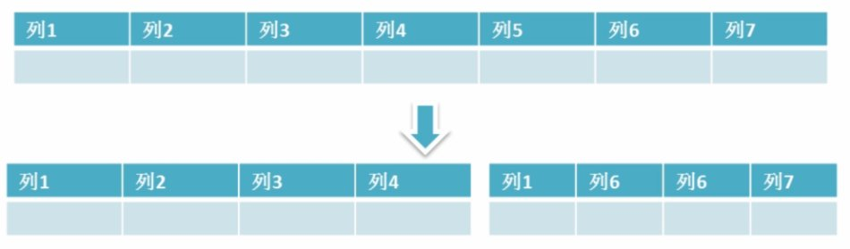
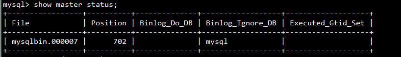
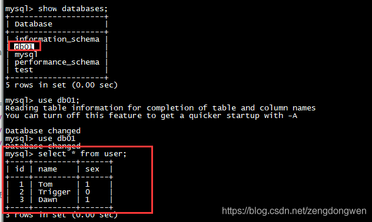

## 数据库设计优化

### 为什么要优化

- 系统的吞吐量瓶颈往往出现在数据库的访问速度上
- 随着应用程序的运行，数据库的中的数据会越来越多，处理时间会相应变慢
- 数据是存放在磁盘上的，读写速度无法和内存相比

优化原则：减少系统瓶颈，减少资源占用，增加系统的反应速度。

### 数据库结构优化

一个好的数据库设计方案对于数据库的性能往往会起到事半功倍的效果。需要考虑数据冗余、查询和更新的速度、字段的数据类型是否合理等多方面的内容。

1. **将字段很多的表分解成多个表**

​		对于字段较多的表，如果有些字段的使用频率很低，可以将这些字段分离出来形成新表。

​		因为当一个表的数据量很大时，会由于使用频率低的字段的存在而变慢。

2. **增加中间表**

​		对于需要经常联合查询的表，可以建立中间表以提高查询效率。

​		通过建立中间表，将需要通过联合查询的数据插入到中间表中，然后将原来的联合查询改为对中间表的查询。

3. **合理增加冗余字段**

​		设计数据表时应尽量遵循范式理论的规约，尽可能的减少冗余字段，让数据库设计看起来精致、优雅。但是，合理的加入冗余字段可以提高查询速度。

​		表的规范化程度越高，表和表之间的关系越多，需要连接查询的情况也就越多，性能也就越差。

**注意：**

**冗余字段的值在一个表中修改了，就要想办法在其他表中更新，否则就会导致数据不一致的问题。**

### 数据库的设计

1. 库名与应用名称尽量一致库名与应用名称尽量一致
2. 表名、字段名必须使用小写字母或数字，禁止出现数字开头，
3. 表名不使用复数名词
4. 表的命名最好是加上“业务名称_表的作用”。如，edu_teacher
5. 表必备三字段：id, gmt_create, gmt_modified

> 说明：
>
> 其中 id 必为主键，类型为 bigint unsigned、单表时自增、步长为 1。
>
> （如果使用分库分表集群部署，则id类型为verchar，非自增，业务中使用分布式id生成器）
>
> gmt_create, gmt_modified 的类型均为 datetime 类型，前者现在时表示主动创建，后者过去分词表示被 动更新。
>
> 

6. 单表行数超过 500 万行或者单表容量超过 2GB，才推荐进行分库分表。 说明：如果预计三年后的数据量根本达不到这个级别，请不要在创建表时就分库分表。 

7. 表达是与否概念的字段，必须使用 is_xxx 的方式命名，数据类型是 unsigned tinyint （1 表示是，0 表示否）。 

   说明：任何字段如果为非负数，必须是 unsigned。 

   注意：POJO 类中的任何布尔类型的变量，都不要加 is 前缀。数据库表示是与否的值，使用 tinyint 类型，坚持 is_xxx 的 命名方式是为了明确其取值含义与取值范围。 

   正例：表达逻辑删除的字段名 is_deleted，1 表示删除，0 表示未删除。 

8. 小数类型为 decimal，禁止使用 float 和 double。 说明：float 和 double 在存储的时候，存在精度损失的问题，很可能在值的比较时，得到不 正确的结果。如果存储的数据范围超过 decimal 的范围，建议将数据拆成整数和小数分开存储。

9. 如果存储的字符串长度几乎相等，使用 char 定长字符串类型。 

10. varchar 是可变长字符串，不预先分配存储空间，长度不要超过 5000，如果存储长度大于此值，定义字段类型为 text，独立出来一张表，用主键来对应，避免影响其它字段索 引效率。

11. 唯一索引名为 uk_字段名；普通索引名则为 idx_字段名。

    说明：uk_ 即 unique key；idx_ 即 index 的简称

12. 不得使用外键与级联，一切外键概念必须在应用层解决。外键与级联更新适用于单机低并发，不适合分布式、高并发集群；级联更新是强阻塞，存在数据库更新风暴的风险；外键影响数据库的插入速度。 

### MySQL数据库cpu飙升到500%的话他怎么处理？

​		当 cpu 飙升到 500%时，先用操作系统命令 top 命令观察是不是 mysqld 占用导致的，如果不是，找出占用高的进程，并进行相关处理。如果是 mysqld 造成的， show processlist，看看里面跑的 session 情况，是不是有消耗资源的 sql 在运行。找出消耗高的 sql，看看执行计划是否准确， index 是否缺失，或者实在是数据量太大造成。

​		一般来说，肯定要 kill 掉这些线程(同时观察 cpu 使用率是否下降)，等进行相应的调整(比如说加索引、改 sql、改内存参数)之后，再重新跑这些 SQL。

​		也有可能是每个 sql 消耗资源并不多，但是突然之间，有大量的 session 连进来导致 cpu 飙升，这种情况就需要跟应用一起来分析为何连接数会激增，再做出相应的调整，比如说限制连接数等

## 大表优化？

### 概念

当MySQL单表记录数过大时，数据库的CRUD性能会明显下降，一些常见的优化措施如下：

1. **限定数据的范围：** 务必禁止不带任何限制数据范围条件的查询语句。比如：我们当用户在查询订单历史的时候，我们可以控制在一个月的范围内。；
2. **读/写分离：** 经典的数据库拆分方案，主库负责写，从库负责读；
3. **缓存：** 使用MySQL的缓存，另外对重量级、更新少的数据可以考虑使用应用级别的缓存；

还有就是通过分库分表的方式进行优化，主要有垂直分表和水平分表

### 分库分表方案

#### 垂直分区

​		**根据数据库里面数据表的相关性进行拆分。** 例如，用户表中既有用户的登录信息又有用户的基本信息，可以将用户表拆分成两个单独的表，甚至放到单独的库做分库。

**简单来说垂直拆分是指数据表列的拆分，把一张列比较多的表拆分为多张表。** 如下图所示，这样来说大家应该就更容易理解了。

**垂直拆分的优点：** 可以使得行数据变小，在查询时减少读取的Block数，减少I/O次数。此外，垂直分区可以简化表的结构，易于维护。

**垂直拆分的缺点：** 主键会出现冗余，需要管理冗余列，并会引起Join操作，可以通过在应用层进行Join来解决。此外，垂直分区会让事务变得更加复杂；

##### 拆分方式

​		把主键和一些列放在一个表，然后把主键和另外的列放在另一个表中

##### 适用场景

- 1、如果一个表中某些列常用，另外一些列不常用
- 2、可以使数据行变小，一个数据页能存储更多数据，查询时减少I/O次数

##### 缺点

- 有些分表的策略基于应用层的逻辑算法，一旦逻辑算法改变，整个分表逻辑都会改变，扩展性较差
- 对于应用层来说，逻辑算法增加开发成本
- 管理冗余列，查询所有数据需要join操作

**水平分区**

​		**保持数据表结构不变，通过某种策略存储数据分片。这样每一片数据分散到不同的表或者库中，达到了分布式的目的。 水平拆分可以支撑非常大的数据量。**

​		水平拆分是指数据表行的拆分，表的行数超过200万行时，就会变慢，这时可以把一张的表的数据拆成多张表来存放。举个例子：我们可以将用户信息表拆分成多个用户信息表，这样就可以避免单一表数据量过大对性能造成影响。

​		水平拆分可以支持非常大的数据量。需要注意的一点是:分表仅仅是解决了单一表数据过大的问题，但由于表的数据还是在同一台机器上，其实对于提升MySQL并发能力没有什么意义，所以 **水平拆分最好分库** 。

水平拆分能够 **支持非常大的数据量存储，应用端改造也少**，但 **分片事务难以解决** ，跨界点Join性能较差，逻辑复杂。

​		《Java工程师修炼之道》的作者推荐 **尽量不要对数据进行分片，因为拆分会带来逻辑、部署、运维的各种复杂度** ，一般的数据表在优化得当的情况下支撑千万以下的数据量是没有太大问题的。如果实在要分片，尽量选择客户端分片架构，这样可以减少一次和中间件的网络I/O。

#### 水平分表

表很大，分割后可以低在查询时需要读的数据和索引的页数，同时也降低了索引的层数，提高查询次数

##### 拆分方式

1. 区域法：根据id划分区域，例如：0-1000一个表，1001-2000一个表
2. 哈希法：根据id哈希后取余数划分，例如：hash(id)%256==1，就存入第1号表中
3. 互联网一般采用的是哈希法进行分库分表，因为数据更加均衡，但是不利于将来扩容迁移数据（区域法与之相反）

##### 适用场景

- 1、表中的数据本身就有独立性，例如表中分表记录各个地区的数据或者不同时期的数据，特别是有些数据常用，有些不常用。
- 2、需要把数据存放在多个介质上。

##### 缺点

- 1、给应用增加复杂度，通常查询时需要多个表名，查询所有数据都需UNION操作
- 2、在许多数据库应用中，这种复杂度会超过它带来的优点，查询时会增加读一个索引层的磁盘次数

**下面补充一下数据库分片的两种常见方案：**

- **客户端代理：** **分片逻辑在应用端，封装在jar包中，通过修改或者封装JDBC层来实现。** 当当网的 **Sharding-JDBC** 、阿里的TDDL是两种比较常用的实现。
- **中间件代理：** **在应用和数据中间加了一个代理层。分片逻辑统一维护在中间件服务中。** 我们现在谈的 **Mycat** 、360的Atlas、网易的DDB等等都是这种架构的实现。

### 分库分表后产生的问题

#### 分布式id

twitter的snowflake算法

#### 分布式事务

**事务支持** 分库分表后，就成了分布式事务了。如果依赖数据库本身的分布式事务管理功能去执行事务，将付出高昂的性能代价； 如果由应用程序去协助控制，形成程序逻辑上的事务，又会造成编程方面的负担。

解决方案

- TCC 三阶段提交
- XA 两阶段提交
- 消息最终一致性
- 最大努力消息通知

#### 分布式查询数据

##### 跨库join

只要是进行切分，跨节点Join的问题是不可避免的。但是良好的设计和切分却可以减少此类情况的发生。解决这一问题的普遍做法是分两次查询实现。在第一次查询的结果集中找出关联数据的id,根据这些id发起第二次请求得到关联数据。 分库分表方案产品

- 解决方案
  - 不在数据库层做Join，单用单表查询，在代码层做结果拼装
  - 宽表，新建立一个表，提前把Join后的视图写入这个表，重写轻读
  - 搜索引擎ES
  - CQRS，读写模型分离，读的模型通过监听主库变化，实现写好读模型（Join后的数据）

- **跨节点的count,order by,group by以及聚合函数问题** 这些是一类问题，因为它们都需要基于全部数据集合进行计算。多数的代理都不会自动处理合并工作。
  - 解决方案：
    - 方案1：映射表新建一个表存放orderId与userid的映射关联，先根据userid查询到orderid，然后找到所在的表，然后在这张表中执行SQL即可
      - 新的问题：新增一张表后，新增一条记录，需要改2张表，而且映射表也可能分库分表。可能设置两个不同数据库之间的分布式事务问题。
    - 方案2 ：业务双写
      - 问题：双写复杂性，两套分库分表同样存在分布式事务问题，多存储一份数据，资源浪费
    - 方案3：双纬度合一，把订单id和userid合并到一个纬度中，既能通过order查询得到，也能通过userid查询得到

##### 跨分片的排序分页

- 方案1：曲线救国，维护一张"索引表"，但是这张索引表也会存在分页的问题
- 方案2：直接干
  - 第一种（查询数据量比较大）：需要第三页的数据,就把所有分表的前三页数据都拿出来,利用程序做排序,然后再取真正第三页的数据	
  - 第二种（不精确查找）：全局找的折中处理，如果业务不需要那么精确地分页,那么问题迎刃而解,比如要找第12页的数据,假设分表是三个,那我们在三个分表中分表取四条,就是12页的全局数据,这样也是极好的,只是数据不再那么精确.
  - 第三种（查询数据库次数较多）：二次查找（特点：精确查找，但是需要两次查询数据库，但却是推荐使用）
    - 首次查询查询每个库的select * from table order by time offset 10 limit 10;得到10条数据。这里的offset是总offset/分库数
    - 服务层得到来自两个分库的结果集,得到最小的time,也就是最顶层的time，这个time满足最少有10条记录在它前面.然后分别记录每个库的最大time
    - 分别再次查询最小time->每个库上一次的最大time的数据，得到每个库的查询结果
    - 在每个集合的最小time都是相同的，所以可以得到该最小time在整个数据库中的offset，加起来就是这个最小time在全局库的offset位置。
    - 再将第二次查询的结果集拼起来和得到的最小time的offset，推导出 offset 20 limit 10的一页记录。

## MySQL集群

### 主从复制

主从复制：将主数据库中的DDL和DML操作通过二进制日志（BINLOG）传输到从数据库上，然后将这些日志重新执行（重做）；从而使得从数据库的数据与主数据库保持一致。

**主从复制的作用**

1. 主数据库出现问题，可以切换到从数据库。
2. 可以进行数据库层面的读写分离。
3. 可以在从数据库上进行日常备份。

**MySQL主从复制解决的问题**

- 数据分布：随意开始或停止复制，并在不同地理位置分布数据备份
- 负载均衡：降低单个服务器的压力
- 高可用和故障切换：帮助应用程序避免单点失败
- 升级测试：可以用更高版本的MySQL作为从库

**MySQL主从复制工作原理**

- 在主库上把数据变更记录到二进制日志
- 从库将主库的日志复制到自己的中继日志
- 从库读取中继日志的事件，将其重放到从库数据中

**基本原理流程，3个线程以及之间的关联**

**主**：binlog线程——记录下所有改变了数据库数据的语句，放进master上的binlog中；

**从**：io线程——在使用start slave 之后，负责从master上拉取 binlog 内容，放进自己的relay log中；

**从**：sql执行线程——执行relay log中的语句；

### 读写分离

​		读写分离是依赖于主从复制，而主从复制又是为读写分离服务的。因为主从复制要求`slave`不能写只能读（如果对`slave`执行写操作，那么`show slave status`将会呈现`Slave_SQL_Running=NO`，此时你需要按照前面提到的手动同步一下`slave`）。

#### Mysql 读写分离方案

**方案一**

​		使用mysql-proxy代理

​		优点：直接实现读写分离和负载均衡，不用修改代码，master和slave用一样的帐号，mysql官方不建议实际生产中使用

​		缺点：降低性能， 不支持事务

**方案二**
		如果采用了mybatis， 可以将读写分离放在ORM层，比如mybatis可以通过mybatis plugin拦截sql语句，所有的insert/update/delete都访问master库，所有的select 都访问salve库，这样对于dao层都是透明。 plugin实现时可以通过注解或者分析语句是读写方法来选定主从库。不过这样依然有一个问题， 也就是不支持事务， 所以我们还需要重写一下DataSourceTransactionManager， 将read-only的事务扔进读库， 其余的有读有写的扔进写库。

**方案三**

​		使用AbstractRoutingDataSource+aop+annotation在service层决定数据源，可以支持事务.

​		缺点：类内部方法通过this.xx()方式相互调用时，aop不会进行拦截，需进行特殊处理。

### MySql主从复制配置

#### master

在master 的配置文件（/usr/my.cnf）中，配置如下内容：

~~~properties
#mysql 服务ID,保证整个集群环境中唯一
server-id=1
#mysql binlog 日志的存储路径和文件名
log-bin=/var/lib/mysql/mysqlbin
 
#错误日志,默认已经开启
#log-err
#mysql的安装目录
#basedir
#mysql的临时目录
#tmpdir
#mysql的数据存放目录
#datadir
 
#是否只读,1 代表只读, 0 代表读写
read-only=0
#忽略的数据, 指不需要同步的数据库
binlog-ignore-db=mysql
 
#指定同步的数据库
#binlog-do-db=db01
~~~

 执行完毕之后，需要重启Mysql：

~~~
service mysql restart ;
~~~

重新连接，创建同步数据的账户，并且进行授权操作：

~~~
grant replication slave on *.* to 'root'@'192.168.137.136' identified by '123456';
 
flush privileges;
~~~

查看master状态：

~~~
show master status;
~~~

~~~
File : 从哪个日志文件开始推送日志文件
Position ： 从哪个位置开始推送日志
Binlog_Ignore_DB : 指定不需要同步的数据库
~~~

#### slave

1） 在 slave 端配置文件中，配置如下内容：

~~~properties
#mysql服务端ID,唯一
server-id=2
#指定binlog日志
log-bin=/var/lib/mysql/mysqlbin
~~~

2） 执行完毕之后，需要重启Mysql：

~~~
service mysql restart
~~~

3） 执行如下指令 ：

~~~bash
change master to master_host= '192.168.137.136',
master_user='root', 
master_password='123456', 
master_log_file='mysqlbin.000007', 
master_log_pos=702;
~~~

指定当前从库对应的主库的IP地址，用户名，密码，从哪个日志文件开始的那个位置开始同步推送日志。

4） 开启同步操作

~~~
start slave;
show slave status;
~~~

5） 停止同步操作

~~~
stop slave;
~~~

#### 验证同步操作

1） 在主库中创建数据库，创建表，并插入数据

~~~SQl
create database db01;
use db01;

create table user(
    id int(11) not null auto_increment,
    name varchar(50) not null,
    sex varchar(1),
    primary key (id)
)engine=innodb default charset=utf8;
insert into user(id,name,sex) values(null,'Tom','1');
insert into user(id,name,sex) values(null,'Trigger','0');
insert into user(id,name,sex) values(null,'Dawn','1');
~~~

 2） 在从库中查询数据，进行验证 ：
在从库中，可以查看到刚才创建的数据库：

我们在主库做的任何操作，都会同步复制到从库中。

### 数据修复

使用 myisamchk 来修复，具体步骤：

- 修复前将mysql服务停止。
- 打开命令行方式，然后进入到mysql的/bin目录。
- 执行myisamchk –recover 数据库所在路径/*.MYI

​        使用repair table 或者 OPTIMIZE table命令来修复，REPAIR TABLE table_name 修复表 OPTIMIZE TABLE table_name 优化表 REPAIR TABLE 用于修复被破坏的表。 OPTIMIZE TABLE 用于回收闲置的数据库空间，当表上的数据行被删除时，所占据的磁盘空间并没有立即被回收，使用了OPTIMIZE TABLE命令后这些空间将被回收，并且对磁盘上的数据行进行重排（注意：是磁盘上，而非数据库）

