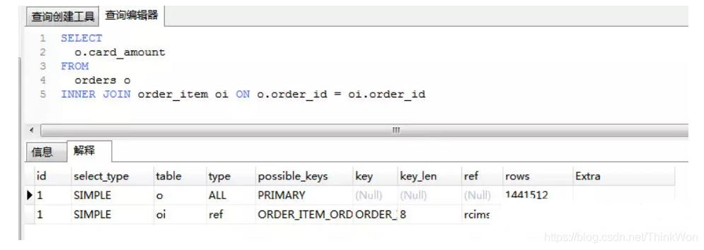
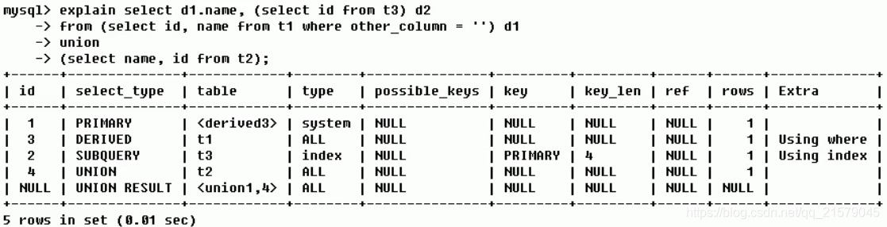
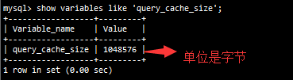
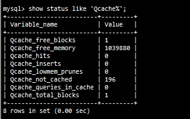
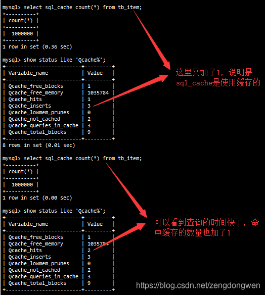
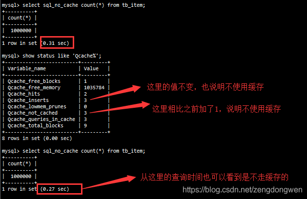
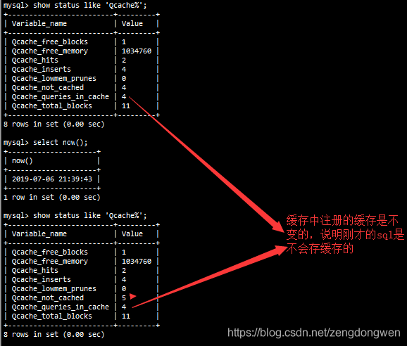
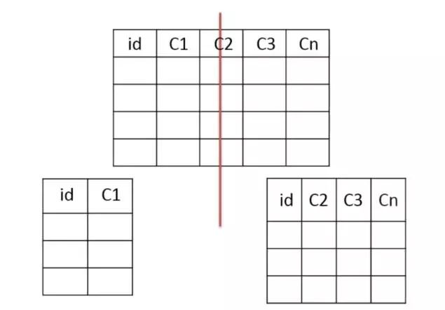
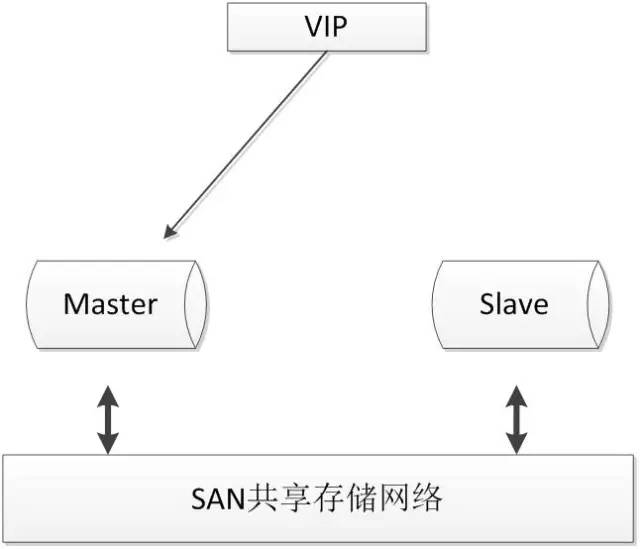

## 数据库设计优化

### 什么是Mysql优化？

 完整的mysql优化需要很深的功底，大公司甚至有专门的DBA（**数据库管理员**Database Administrator）写上述

- mysql内核
- sql优化工程师
- mysql服务器的优化
- 各种参数常量设定
- 查询语句优化
- 主从复制
- 软硬件升级
- 容灾备份
- sql编程

### 为什么要优化

- 系统的吞吐量瓶颈往往出现在数据库的访问速度上
- 随着应用程序的运行，数据库的中的数据会越来越多，处理时间会相应变慢
- 数据是存放在磁盘上的，读写速度无法和内存相比

优化原则：减少系统瓶颈，减少资源占用，增加系统的反应速度。


### 数据库结构优化

一个好的数据库设计方案对于数据库的性能往往会起到事半功倍的效果。需要考虑数据冗余、查询和更新的速度、字段的数据类型是否合理等多方面的内容。

1. **将字段很多的表分解成多个表**
   + 对于字段较多的表，如果有些字段的使用频率很低，可以将这些字段分离出来形成新表.
   + 因为当一个表的数据量很大时，会由于使用频率低的字段的存在而变慢。

2. **增加中间表**
   + 对于需要经常联合查询的表，可以建立中间表以提高查询效率。
   + 通过建立中间表，将需要通过联合查询的数据插入到中间表中，然后将原来的联合查询改为对中间表的查询。

3. **合理增加冗余字段**
   + 设计数据表时应尽量遵循范式理论的规约，尽可能的减少冗余字段，让数据库设计看起来精致、优雅。但是，合理的加入冗余字段可以提高查询速度。
   + 表的规范化程度越高，表和表之间的关系越多，需要连接查询的情况也就越多，性能也就越差。

**注意：**

**冗余字段的值在一个表中修改了，就要想办法在其他表中更新，否则就会导致数据不一致的问题。**


### 数据库的设计

1. 库名与应用名称尽量一致库名与应用名称尽量一致
2. 表名、字段名必须使用小写字母或数字，禁止出现数字开头，
3. 表名不使用复数名词
4. 表的命名最好是加上“业务名称_表的作用”。如，edu_teacher
5. 表必备三字段：id, gmt_create, gmt_modified

> 说明：其中 id 必为主键，类型为 bigint unsigned、单表时自增、步长为 1。（如果使用分库分表集群部署，则id类型为verchar，非自增，业务中使用分布式id生成器）gmt_create, gmt_modified 的类型均为 datetime 类型，前者现在时表示主动创建，后者过去分词表示被动更新。
>

6. 单表行数超过 500 万行或者单表容量超过 2GB，才推荐进行分库分表。 说明：如果预计三年后的数据量根本达不到这个级别，请不要在创建表时就分库分表。 
7. 表达是与否概念的字段，必须使用 is_xxx 的方式命名，数据类型是 unsigned tinyint （1 表示是，0 表示否）。
   + 说明：任何字段如果为非负数，必须是 unsigned。
   + 注意：POJO 类中的任何布尔类型的变量，都不要加 is 前缀。数据库表示是与否的值，使用 tinyint 类型，坚持 is_xxx 的 命名方式是为了明确其取值含义与取值范围。
   + 正例：表达逻辑删除的字段名 is_deleted，1 表示删除，0 表示未删除。 
8. 小数类型为 decimal，禁止使用 float 和 double。 说明：float 和 double 在存储的时候，存在精度损失的问题，很可能在值的比较时，得到不 正确的结果。如果存储的数据范围超过 decimal 的范围，建议将数据拆成整数和小数分开存储。
9. 如果存储的字符串长度几乎相等，使用 char 定长字符串类型。 
10. varchar 是可变长字符串，不预先分配存储空间，长度不要超过 5000，如果存储长度大于此值，定义字段类型为 text，独立出来一张表，用主键来对应，避免影响其它字段索 引效率。
11. 唯一索引名为 uk_字段名；普通索引名则为 idx_字段名。
    + 说明：uk_ 即 unique key；idx_ 即 index 的简称
12. 不得使用外键与级联，一切外键概念必须在应用层解决。外键与级联更新适用于单机低并发，不适合分布式、高并发集群；级联更新是强阻塞，存在数据库更新风暴的风险；外键影响数据库的插入速度。 


### MySQL数据库cpu飙升到100%怎么处理？

​		当 cpu 飙升到 500%时，先用操作系统命令 top 命令观察是不是 mysqld 占用导致的，如果不是，找出占用高的进程，并进行相关处理。如果是 mysqld 造成的， show processlist，看看里面跑的 session 情况，是不是有消耗资源的 sql 在运行。找出消耗高的 sql，看看执行计划是否准确， index 是否缺失，或者实在是数据量太大造成。

​		一般来说，肯定要 kill 掉这些线程(同时观察 cpu 使用率是否下降)，等进行相应的调整(比如说加索引、改 sql、改内存参数)之后，再重新跑这些 SQL。

​		也有可能是每个 sql 消耗资源并不多，但是突然之间，有大量的 session 连进来导致 cpu 飙升，这种情况就需要跟应用一起来分析为何连接数会激增，再做出相应的调整，比如说限制连接数等


## 查询速度优化

### 优化顺序


小结：


### 查看系统性能参数

在MySQL中，可以使用 SHOW STATUS 语句查询一些MySQL数据库服务器的 性能参数、 执行频率 。

SHOW STATUS语句语法如下：

~~~sql
SHOW [GLOBAL|SESSION] STATUS LIKE '参数';
~~~

一些常用的性能参数如下： 

+ Connections：连接MySQL服务器的次数。 
+ Uptime：MySQL服务器的上线时间。
+ Slow_queries：慢查询的次数。 
+ Innodb_rows_read：Select查询返回的行数 
+ Innodb_rows_inserted：执行INSERT操作插入的行数
+ Innodb_rows_updated：执行UPDATE操作更新的行数
+ Innodb_rows_deleted：执行DELETE操作删除的行数
+ Com_select：查询操作的次数。 
+ Com_insert：插入操作的次数。对于批量插入的 INSERT 操作，只累加一次。 
+ Com_update：更新操作的次数。
+ Com_delete：删除操作的次数。

## SQL优化

### SQL性能下降的原因

执行时间长，等待时间长

- 查询语句写的烂
- 索引失效
  - 单值索引
  - 复合索引
- 关联查询太多join（设计缺陷或不得已的需求）
- 服务器调优及各个参数设置（缓冲、线程数等）


### Explain解析

+ 是什么（查看执行计划）

  ​	使用EXPLAIN关键字可以模拟优化器执行SQL查询语句，从而知道MySQL是如何处理你的SQL语句的。分析你的查询语句或是表结构的性能瓶颈。

+ 能干嘛

  + 表的读取顺序
  + 数据读取操作的操作类型
  + 哪些索引可以使用
  + 哪些索引被实际使用
  + 表之间的应用
  + 每张表有多少行被优化器查询

+ 对于低性能的SQL语句的定位，最重要也是最有效的方法就是使用执行计划，MySQL提供了explain命令来查看语句的执行计划。 我们知道，不管是哪种数据库，或者是哪种数据库引擎，在对一条SQL语句进行执行的过程中都会做很多相关的优化，**对于查询语句，最重要的优化方式就是使用索引**。 而**执行计划，就是显示数据库引擎对于SQL语句的执行的详细情况，其中包含了是否使用索引，使用什么索引，使用的索引的相关信息等**。



执行计划包含的信息 **id** 有一组数字组成。表示一个查询中各个子查询的执行顺序;

- id相同执行顺序由上至下。
- id不同，id值越大优先级越高，越先被执行。
- id为null时表示一个结果集，不需要使用它查询，常出现在包含union等查询语句中。

**select_type** 每个子查询的查询类型，一些常见的查询类型。

| id   | select_type  | description                               |
| ---- | ------------ | ----------------------------------------- |
| 1    | SIMPLE       | 不包含任何子查询或union等查询             |
| 2    | PRIMARY      | 包含子查询最外层查询就显示为 PRIMARY      |
| 3    | SUBQUERY     | 在select或 where字句中包含的查询          |
| 4    | DERIVED      | from字句中包含的查询                      |
| 5    | UNION        | 出现在union后的查询语句中                 |
| 6    | UNION RESULT | 从UNION中获取结果集，例如上文的第三个例子 |

**table** 查询的数据表，当从衍生表中查数据时会显示 x 表示对应的执行计划id **partitions** 表分区、表创建的时候可以指定通过那个列进行表分区。 举个例子：

```sql
create table tmp (    
    id int unsigned not null AUTO_INCREMENT,    
    name varchar(255),    
    PRIMARY KEY (id)
) engine = innodbpartition by key (id) partitions 5;
```

**type**(**非常重要**，可以看到有没有走索引) 访问类型

- ALL 扫描全表数据
- index 遍历索引
- range 索引范围查找
- index_subquery 在子查询中使用 ref
- unique_subquery 在子查询中使用 eq_ref
- ref_or_null 对Null进行索引的优化的 ref
- fulltext 使用全文索引
- ref 使用非唯一索引查找数据
- eq_ref 在join查询中使用PRIMARY KEYorUNIQUE NOT NULL索引关联。

**possible_keys** 可能使用的索引，注意不一定会使用。查询涉及到的字段上若存在索引，则该索引将被列出来。当该列为 NULL时就要考虑当前的SQL是否需要优化了。

**key** 显示MySQL在查询中实际使用的索引，若没有使用索引，显示为NULL。

**TIPS**:查询中若使用了覆盖索引(覆盖索引：索引的数据覆盖了需要查询的所有数据)，则该索引仅出现在key列表中

**key_length** 索引长度

**ref** 表示上述表的连接匹配条件，即哪些列或常量被用于查找索引列上的值

**rows** 返回估算的结果集数目，并不是一个准确的值。

**extra** 的信息非常丰富，常见的有：

1. Using index 使用覆盖索引
2. Using where 使用了用where子句来过滤结果集
3. Using filesort 使用文件排序，使用非索引列进行排序时出现，非常消耗性能，尽量优化。
4. Using temporary 使用了临时表 sql优化的目标可以参考阿里开发手册
5. Using join buffer：使用了连接缓存。
6. distinct：优化distinct操作，在找到第一匹配的元组后即停止找相同值的动作。

```
【推荐】SQL性能优化的目标：至少要达到 range 级别，要求是ref级别，如果可以是consts最好。 说明： 1） consts 单表中最多只有一个匹配行（主键或者唯一索引），在优化阶段即可读取到数据。 2） ref 指的是使用普通的索引（normal index）。 3） range 对索引进行范围检索。 反例：explain表的结果，type=index，索引物理文件全扫描，速度非常慢，这个index级别比较range还低，与全表扫描是小巫见大巫。
```


### Explain Case




### 一般的优化流程

+ 分析
  + 观察，至少跑1天，看看生产的慢SQL情况。
  + 开启慢查询日志，设置阈值，比如超过5秒钟的就是慢SQL，并将它抓取出来。
  + explain + 慢SQL分析
  + show profile
  + 运维经理 or DBA，进行SQL数据库服务器参数调优。

+ 总结
  + 慢查询的开启并捕获
  + explain + 慢SQL分析
  + show profile查询SQL在Mysql服务器里面的执行细节和生命周期情况
  + SQL数据库服务器的参数调优


### 大表数据查询，怎么优化

1. 优化shema、sql语句+索引；
2. 第二加缓存，memcached, redis；
3. 主从复制，读写分离；
4. 垂直拆分，根据你模块的耦合度，将一个大的系统分为多个小的系统，也就是分布式系统；
5. 水平切分，针对数据量大的表，这一步最麻烦，最能考验技术水平，要选择一个合理的sharding key, 为了有好的查询效率，表结构也要改动，做一定的冗余，应用也要改，sql中尽量带sharding key，将数据定位到限定的表上去查，而不是扫描全部的表；


### 超大分页怎么处理？

超大的分页一般从两个方向上来解决.

- 数据库层面,这也是我们主要集中关注的(虽然收效没那么大),类似于`select * from table where age > 20 limit 1000000,10;这种查询其实也是有可以优化的余地的. 这条语句需要load1000000 数据然后基本上全部丢弃,只取10条当然比较慢. 当时我们可以修改为`select * from table where id in (select id from table where age > 20 limit 1000000,10)`.这样虽然也load了一百万的数据,但是由于索引覆盖,要查询的所有字段都在索引中,所以速度会很快. 同时如果ID连续的好,我们还可以`select * from table where id > 1000000 limit 10`,效率也是不错的,优化的可能性有许多种,但是核心思想都一样,就是减少load的数据.
- 从需求的角度减少这种请求…主要是不做类似的需求(直接跳转到几百万页之后的具体某一页.只允许逐页查看或者按照给定的路线走,这样可预测,可缓存)以及防止ID泄漏且连续被人恶意攻击.

解决超大分页,其实主要是靠缓存,可预测性的提前查到内容,缓存至 redis 等 k-V 数据库中,直接返回即可.

在阿里巴巴《Java开发手册》中,对超大分页的解决办法是类似于上面提到的第一种.

```sql
【推荐】利用延迟关联或者子查询优化超多分页场景。 
说明：MySQL并不是跳过offset行，而是取offset+N行，然后返回放弃前offset行，
返回N行，那当offset特别大的时候，效率就非常的低下，要么控制返回的总页数，
要么对超过特定阈值的页数进行SQL改写。 正例：先快速定位需要获取的id段，
然后再关联： 
SELECT a.* FROM 表1 a, 
(select id from 表1 
 where 条件 
 LIMIT 100000,20 )
 b where a.id=b.id
```


### mysql 分页

​		LIMIT 子句可以被用于强制 SELECT 语句返回指定的记录数。LIMIT 接受一个或两个数字参数。参数必须是一个整数常量。如果给定两个参数，第一个参数指定第一个返回记录行的偏移量，第二个参数指定返回记录行的最大数目。初始记录行的偏移量是 0(而不是 1)

```
mysql> SELECT * FROM table LIMIT 5,10; // 检索记录行 6-15 
```

为了检索从某一个偏移量到记录集的结束所有的记录行，可以指定第二个参数为 -1：

```
mysql> SELECT * FROM table LIMIT 95,-1; // 检索记录行 96-last. 
```

如果只给定一个参数，它表示返回最大的记录行数目：

```
mysql> SELECT * FROM table LIMIT 5; //检索前 5 个记录行 
```

换句话说，LIMIT n 等价于 LIMIT 0,n。


## 其他优化

### 应用优化

#### 减少对MySQL的访问

比如 ，需要获取书籍的id 和name字段 ， 则查询如下：

~~~SQL
select id , name from tb_book;
~~~


之后，在业务逻辑中有需要获取到书籍状态信息， 则查询如下：

~~~SQL
select id , status from tb_book;
~~~


这样，就需要向数据库提交两次请求，数据库就要做两次查询操作。其实完全可以用一条SQL语句得到想要的结果。

~~~SQL
select id, name , status from tb_book;
~~~

#### 增加cache层

​		在应用中，我们可以在应用中增加 缓存层来达到减轻数据库负担的目的。缓存层有很多种，也有很多实现方式，只要能达到降低数据库的负担又能满足应用需求就可以。
 		因此可以部分数据从数据库中抽取出来放到应用端以文本方式存储， 或者使用框架(Mybatis, Hibernate)提供的一级缓存/二级缓存，或者使用redis数据库来缓存数据 。

#### 负载均衡

​       负载均衡是应用中使用非常普遍的一种优化方法，它的机制就是利用某种均衡算法，将固定的负载量分布到不同的服务器上， 以此来降低单台服务器的负载，达到优化的效果。

+ 主从复制

+ 分布式数据库架构


### 查询缓存优化

#### 基本情况

查看当前的MySQL数据库**是否支持查询缓存：**

~~~SQL
show variables like 'have_query_cache';
~~~


查看当前MySQL**是否开启了查询缓存 ：**

~~~SQl
show variables like 'query_cache_type';
~~~


查看**查询缓存的占用大小 ：**

~~~SQl
show variables like 'query_cache_size';
~~~



 查看**查询缓存的状态变量：**

~~~sql
show status like 'Qcache%';
~~~




各个变量的含义如下：


#### 操作

##### 开启查询缓存

MySQL的查询缓存默认是关闭的，需要手动配置参数 query_cache_type ， 来开启查询缓存。query_cache_type该参数的可取值有三个 


在 **/usr/my.cnf** 配置中，增加以下配置 ：

~~~bash
#开启MySQL的查询缓存query_cache_type=1
~~~

**配置完毕之后，重启服务既可生效 ；**

然后就可以在命令行执行SQL语句进行验证 ，执行一条比较耗时的SQL语句，然后再多执行几次，查看后面几次的执行时间；获取通过查看查询缓存的缓存命中数，来判定是否走查询缓存。


##### 查询缓存SELECT选项

可以在SELECT语句中指定两个与查询缓存相关的选项 ：

+ SQL_CACHE : 如果查询结果是可缓存的，并且 query_cache_type 系统变量的值为ON或 DEMAND ，则缓存查询结果 。
+ SQL_NO_CACHE : 服务器不使用查询缓存。它既不检查查询缓存，也不检查结果是否已缓存，也不缓存查询结果。

例子：**SQL_CACHE的使用**




**SQL_NO_CACHE** 的使用：




#### 查询缓存失效的情况

1） SQL 语句不一致的情况， 要想命中查询缓存，查询的SQL语句必须一致。

我们之前已经执行过：select count(*) from tb_item;  这条语句的结果已经进入了缓存的，下面我们执行 Select count(*) from tb_item; 这条语句和之前的只有S是大写，其他的完全一样，接下来看是否走缓存：


2） 当查询语句中有一些不确定的时，则不会缓存。如 ： now() , current_date() , curdate() , curtime() , rand() ,uuid() , user() , database() 。




3） 不使用任何表查询语句。

~~~
select 'A';
~~~


4） 查询 mysql， information_schema或 performance_schema 数据库中的表时，不会走查询缓存。

~~~
select * from information_schema.engines;
~~~


5） 在存储函数，存储过程，触发器或事件的主体内执行的查询，是不会走查询缓存的。

6） 如果表更改，则使用该表的所有高速缓存查询都将变为无效并从高速缓存中删除。这包括使用MERGE 映射到已更改表的表的查询。一个表可以被许多类型的语句，如被改变 INSERT， UPDATE， DELETE， TRUNCATETABLE， ALTER TABLE， DROP TABLE，或 DROP DATABASE 。


### 内存管理及优化

#### 内存优化原则

1. 将尽量多的内存分配给MySQL做缓存，但要给操作系统和其他程序预留足够内存。
2. MyISAM 存储引擎的数据文件读取依赖于操作系统自身的IO缓存，因此，如果有MyISAM表，就要预留更多的内存给操作系统做IO缓存。
3. 排序区、连接区等缓存是分配给每个数据库会话（session）专用的，其默认值的设置要根据最大连接数合理分配，如果设置太大，不但浪费资源，而且在并发连接较高时会导致物理内存耗尽。

#### InnoDB 内存优化

InnoDB 用一块内存区做IO缓存池，该缓存池不仅用来缓存InnoDB 的索引块，而且也用来缓存InnoDB 的数据块。

1. `innodb_buffer_pool_size`：该变量决定了` innodb` 存储引擎表数据和索引数据的最大缓存区大小。在保证操作系统及其他程序有足够内存可用的情况下，`innodb_buffer_pool_size` 的值越大，缓存命中率越高，访问InnoDB表需要的磁盘I/O 就越少，性能也就越高。

   也是在MySQL的参数文件（`/usr/my.cnf`）中进行设置：

~~~properties
# 默认128M
innodb_buffer_pool_size=512M
~~~

2. `innodb_log_buffer_size`：决定了`innodb`重做日志缓存的大小，对于可能产生大量更新记录的大事务，增加`innodb_log_buffer_size`的大小，可以避免`innodb`在事务提交前就执行不必要的日志写入磁盘操作。

~~~properties
innodb_log_buffer_size=10M
~~~


### 并发参数调整

从实现上来说，MySQL Server 是多线程结构，包括后台线程和客户服务线程。多线程可以有效利用服务器资源，提高数据库的并发性能。在Mysql中，控制并发连接和线程的主要参数包括 

+　max_connections、
+　back_log、
+　thread_cache_size、
+　table_open_cahce。


#### max_connections

 采用max_connections 控制允许连接到MySQL数据库的最大数量，默认值是 151。如果状态变量connection_errors_max_connections 不为零，并且一直增长，则说明不断有连接请求因数据库连接数已达到允许最大值而失败，这是可以考虑增大max_connections 的值。
       Mysql 最大可支持的连接数，取决于很多因素，包括给定操作系统平台的线程库的质量、内存大小、每个连接的负荷、CPU的处理速度，期望的响应时间等。**在Linux 平台下，性能好的服务器，支持 500-1000 个连接不是难事，需要根据服务器性能进行评估设定**。

查看和设置参数方式：

~~~properties
--查看参数的值(默认151)
show variables like 'max_connections';
--修改参数的值，修改/usr/my.cnf文件，添加如下的内容：
max_connections=168
~~~


#### back_log

​		back_log 参数控制MySQL监听TCP端口时设置的积压请求栈大小。如果MySql的连接数达到max_connections时，新来的请求将会被存在堆栈中，以等待某一连接释放资源，该堆栈的数量即back_log，如果等待连接的数量超过back_log，将不被授予连接资源，将会报错。5.6.6 版本之前默认值为 50 ， 之后的版本默认为 50 +（max_connections / 5）， 但最大不超过900。

​		如果需要数据库在较短的时间内处理大量连接请求， 可以考虑适当增大back_log 的值。


#### table_open_cache

该参数用来控制所有SQL语句执行线程可打开表缓存的数量， 而在执行SQL语句时，每一个SQL执行线程至少要打开 1 个表缓存。该参数的值应该根据设置的最大连接数 max_connections 以及每个连接执行关联查询中涉及的表的最大数量来N设定 ：

max_connections x N ；默认值是2000，如下所示：

~~~
mysql> show variables like 'table_open_cache';
+------------------+-------+| Variable_name    | Value |
+------------------+-------+| table_open_cache | 2000  |
+------------------+-------+
~~~


#### thread_cache_size

 为了加快连接数据库的速度，MySQL 会缓存一定数量的客户服务线程以备重用，通过参数 thread_cache_size 可控制 MySQL 缓存客户服务线程的数量。**默认是9：**

~~~
mysql> show variables like 'thread_cache_size';
+-------------------+-------+| Variable_name     | Value |
+-------------------+-------+| thread_cache_size | 9     |
+-------------------+-------+
~~~


####  innodb_lock_wait_timeout

**该参数是用来设置InnoDB 事务等待行锁的时间，默认值是50ms** ， 可以根据需要进行动态设置。对于需要快速反馈的业务系统来说，可以将行锁的等待时间调小，以避免事务长时间挂起； 对于后台运行的批量处理程序来说，可以将行锁的等待时间调大， 以避免发生大的回滚操作。

~~~
mysql> show variables like 'innodb_lock_wait_timeout';
+--------------------------+-------+| Variable_name            | Value |
+--------------------------+-------+| innodb_lock_wait_timeout | 50    |
+--------------------------+-------+
~~~

### 参考配置：

~~~ini
[mysqld]
port = 3306 
serverid = 1 
socket = /tmp/mysql.sock  
skip-locking #避免MySQL的外部锁定，减少出错几率增强稳定性。  
skip-name-resolve #禁止MySQL对外部连接进行DNS解析，使用这一选项可以消除MySQL进行DNS解析的时间。但需要注意，如果开启该选项，则所有远程主机连接授权都要使用IP地址方式，否则MySQL将无法正常处理连接请求！  
back_log = 384
key_buffer_size = 256M 
max_allowed_packet = 4M 
thread_stack = 256K
table_cache = 128K 
sort_buffer_size = 6M 
read_buffer_size = 4M
read_rnd_buffer_size=16M 
join_buffer_size = 8M 
myisam_sort_buffer_size =64M 
table_cache = 512 
thread_cache_size = 64 
query_cache_size = 64M
tmp_table_size = 256M 
max_connections = 768 
max_connect_errors = 10000000
wait_timeout = 10 
thread_concurrency = 8 #该参数取值为服务器逻辑CPU数量*2，在本例中，服务器有2颗物理CPU，而每颗物理CPU又支持H.T超线程，所以实际取值为4*2=8  
skip-networking #开启该选项可以彻底关闭MySQL的TCP/IP连接方式，如果WEB服务器是以远程连接的方式访问MySQL数据库服务器则不要开启该选项！否则将无法正常连接！  
table_cache=1024
innodb_additional_mem_pool_size=4M #默认为2M  
innodb_flush_log_at_trx_commit=1
innodb_log_buffer_size=2M #默认为1M  
innodb_thread_concurrency=8 #你的服务器CPU有几个就设置为几。建议用默认一般为8  
tmp_table_size=64M #默认为16M，调到64-256最挂
thread_cache_size=120 
query_cache_size=32M
~~~


## 大表优化？

### 概念

当MySQL单表记录数过大时，数据库的CRUD性能会明显下降，一些常见的优化措施如下：

1. **限定数据的范围：** 务必禁止不带任何限制数据范围条件的查询语句。比如：我们当用户在查询订单历史的时候，我们可以控制在一个月的范围内。；
2. **读/写分离：** 经典的数据库拆分方案，主库负责写，从库负责读；
3. **缓存：** 使用MySQL的缓存，另外对重量级、更新少的数据可以考虑使用应用级别的缓存；

还有就是通过分库分表的方式进行优化，主要有垂直分表和水平分表


### 分库分表方案

#### 垂直分区

​		**根据数据库里面数据表的相关性进行拆分。** 例如，用户表中既有用户的登录信息又有用户的基本信息，可以将用户表拆分成两个单独的表，甚至放到单独的库做分库。

**简单来说垂直拆分是指数据表列的拆分，把一张列比较多的表拆分为多张表。** 如下图所示，这样来说大家应该就更容易理解了。


**垂直拆分的优点：** 可以使得行数据变小，在查询时减少读取的Block数，减少I/O次数。此外，垂直分区可以简化表的结构，易于维护。

**垂直拆分的缺点：** 主键会出现冗余，需要管理冗余列，并会引起Join操作，可以通过在应用层进行Join来解决。此外，垂直分区会让事务变得更加复杂；

##### 拆分方式

​		把主键和一些列放在一个表，然后把主键和另外的列放在另一个表中



##### 适用场景

- 如果一个表中某些列常用，另外一些列不常用
- 可以使数据行变小，一个数据页能存储更多数据，查询时减少I/O次数

##### 缺点

- 有些分表的策略基于应用层的逻辑算法，一旦逻辑算法改变，整个分表逻辑都会改变，扩展性较差
- 对于应用层来说，逻辑算法增加开发成本
- 管理冗余列，查询所有数据需要join操作


**水平分区**

​		**保持数据表结构不变，通过某种策略存储数据分片。这样每一片数据分散到不同的表或者库中，达到了分布式的目的。 水平拆分可以支撑非常大的数据量。**

​		水平拆分是指数据表行的拆分，表的行数超过200万行时，就会变慢，这时可以把一张的表的数据拆成多张表来存放。举个例子：我们可以将用户信息表拆分成多个用户信息表，这样就可以避免单一表数据量过大对性能造成影响。


​		水平拆分可以支持非常大的数据量。需要注意的一点是:分表仅仅是解决了单一表数据过大的问题，但由于表的数据还是在同一台机器上，其实对于提升MySQL并发能力没有什么意义，所以 **水平拆分最好分库** 。

水平拆分能够 **支持非常大的数据量存储，应用端改造也少**，但 **分片事务难以解决** ，跨界点Join性能较差，逻辑复杂。

​		《Java工程师修炼之道》的作者推荐 **尽量不要对数据进行分片，因为拆分会带来逻辑、部署、运维的各种复杂度** ，一般的数据表在优化得当的情况下支撑千万以下的数据量是没有太大问题的。如果实在要分片，尽量选择客户端分片架构，这样可以减少一次和中间件的网络I/O。


#### 水平分表

表很大，分割后可以低在查询时需要读的数据和索引的页数，同时也降低了索引的层数，提高查询次数


##### 拆分方式

1. 区域法：根据id划分区域，例如：0-1000一个表，1001-2000一个表
2. 哈希法：根据id哈希后取余数划分，例如：hash(id)%256==1，就存入第1号表中
3. 互联网一般采用的是哈希法进行分库分表，因为数据更加均衡，但是不利于将来扩容迁移数据（区域法与之相反）

##### 适用场景

- 表中的数据本身就有独立性，例如表中分表记录各个地区的数据或者不同时期的数据，特别是有些数据常用，有些不常用。
- 需要把数据存放在多个介质上。


##### 缺点

- 给应用增加复杂度，通常查询时需要多个表名，查询所有数据都需UNION操作
- 在许多数据库应用中，这种复杂度会超过它带来的优点，查询时会增加读一个索引层的磁盘次数


**下面补充一下数据库分片的两种常见方案：**

- **客户端代理：** **分片逻辑在应用端，封装在jar包中，通过修改或者封装JDBC层来实现。** 当当网的 **Sharding-JDBC** 、阿里的TDDL是两种比较常用的实现。
- **中间件代理：** **在应用和数据中间加了一个代理层。分片逻辑统一维护在中间件服务中。** 我们现在谈的 **Mycat** 、360的Atlas、网易的DDB等等都是这种架构的实现。

### 分库分表后产生的问题

#### 分布式id

twitter的snowflake算法

#### 分布式事务

**事务支持** 分库分表后，就成了分布式事务了。如果依赖数据库本身的分布式事务管理功能去执行事务，将付出高昂的性能代价； 如果由应用程序去协助控制，形成程序逻辑上的事务，又会造成编程方面的负担。

解决方案

- TCC 三阶段提交
- XA 两阶段提交
- 消息最终一致性
- 最大努力消息通知

#### 分布式查询数据

##### 跨库join

只要是进行切分，跨节点Join的问题是不可避免的。但是良好的设计和切分却可以减少此类情况的发生。解决这一问题的普遍做法是分两次查询实现。在第一次查询的结果集中找出关联数据的id,根据这些id发起第二次请求得到关联数据。 分库分表方案产品

- 解决方案
  - 不在数据库层做Join，单用单表查询，在代码层做结果拼装
  - 宽表，新建立一个表，提前把Join后的视图写入这个表，重写轻读
  - 搜索引擎ES
  - CQRS，读写模型分离，读的模型通过监听主库变化，实现写好读模型（Join后的数据）

- **跨节点的count,order by,group by以及聚合函数问题** 这些是一类问题，因为它们都需要基于全部数据集合进行计算。多数的代理都不会自动处理合并工作。
  - 解决方案：
    - 方案1：映射表新建一个表存放orderId与userid的映射关联，先根据userid查询到orderid，然后找到所在的表，然后在这张表中执行SQL即可
      - 新的问题：新增一张表后，新增一条记录，需要改2张表，而且映射表也可能分库分表。可能设置两个不同数据库之间的分布式事务问题。
    - 方案2 ：业务双写
      - 问题：双写复杂性，两套分库分表同样存在分布式事务问题，多存储一份数据，资源浪费
    - 方案3：双纬度合一，把订单id和userid合并到一个纬度中，既能通过order查询得到，也能通过userid查询得到


##### 跨分片的排序分页

- 方案1：曲线救国，维护一张"索引表"，但是这张索引表也会存在分页的问题
- 方案2：直接干
  - 第一种（查询数据量比较大）：需要第三页的数据,就把所有分表的前三页数据都拿出来,利用程序做排序,然后再取真正第三页的数据	
  - 第二种（不精确查找）：全局找的折中处理，如果业务不需要那么精确地分页,那么问题迎刃而解,比如要找第12页的数据,假设分表是三个,那我们在三个分表中分表取四条,就是12页的全局数据,这样也是极好的,只是数据不再那么精确.
  - 第三种（查询数据库次数较多）：二次查找（特点：精确查找，但是需要两次查询数据库，但却是推荐使用）
    - 首次查询查询每个库的select * from table order by time offset 10 limit 10;得到10条数据。这里的offset是总offset/分库数
    - 服务层得到来自两个分库的结果集,得到最小的time,也就是最顶层的time，这个time满足最少有10条记录在它前面.然后分别记录每个库的最大time
    - 分别再次查询最小time->每个库上一次的最大time的数据，得到每个库的查询结果
    - 在每个集合的最小time都是相同的，所以可以得到该最小time在整个数据库中的offset，加起来就是这个最小time在全局库的offset位置。
    - 再将第二次查询的结果集拼起来和得到的最小time的offset，推导出 offset 20 limit 10的一页记录。

## Mysql主从

### 主从复制

主从复制：将主数据库中的DDL和DML操作通过二进制日志（BINLOG）传输到从数据库上，然后将这些日志重新执行（重做）；从而使得从数据库的数据与主数据库保持一致。

#### 主从复制的作用

1. 主数据库出现问题，可以切换到从数据库。
2. 可以进行数据库层面的读写分离。
3. 可以在从数据库上进行日常备份。

#### MySQL主从复制解决的问题

- 数据分布：随意开始或停止复制，并在不同地理位置分布数据备份
- 负载均衡：降低单个服务器的压力
- 高可用和故障切换：帮助应用程序避免单点失败
- 升级测试：可以用更高版本的MySQL作为从库

#### MySQL主从复制工作原理

- 在主库上把数据变更记录到二进制日志
- 从库将主库的日志复制到自己的中继日志
- 从库读取中继日志的事件，将其重放到从库数据中

#### 基本原理流程，3个线程以及之间的关联

**主**：binlog线程——记录下所有改变了数据库数据的语句，放进master上的binlog中；

**从**：io线程——在使用start slave 之后，负责从master上拉取 binlog 内容，放进自己的relay log中；

**从**：sql执行线程——执行relay log中的语句；

#### 主从同步的几种模式：

+ 异步模式： 在这种同步策略下，主库按照自己的流程处理完数据，会直接返回结果，不会等待主库和从库之间的数据同步。 优点：效率高。 缺点：Master节点挂掉之后，Slave节点会丢失数据。
+ 全同步模式：主库会等待所有从库都执行完sql语句并ACK完成，才返回成功。 优点：有很好的数据一致性保障。 缺点：会造成数据操作延迟，降低了MySQL的吞吐量。
+ 半同步模式：主库会等待至少有一个从库把数据写入relay log并ACK完成，才成功返回结果。 半同步模式介于异步和全同步之间。（但是某些情况下，仍然会出现数据不一致的问题）
  + 主机数据写入Binlog，但是还没有来得及发送数据就已经宕机
  + 当主机再次恢复过来，可以从binlog恢复数据，但是Slave没有接受到宕机前的数据
  + 就会导致主从之间的数据不一致情况

### 读写分离

​		读写分离是依赖于主从复制，而主从复制又是为读写分离服务的。因为主从复制要求`slave`不能写只能读（如果对`slave`执行写操作，那么`show slave status`将会呈现`Slave_SQL_Running=NO`，此时你需要按照前面提到的手动同步一下`slave`）。

#### Mysql 读写分离方案

**方案一**：使用mysql-proxy代理

+ 优点：直接实现读写分离和负载均衡，不用修改代码，master和slave用一样的帐号，mysql官方不建议实际生产中使用
+ 缺点：降低性能， 不支持事务

**方案二**：如果采用了mybatis， 可以将读写分离放在ORM层。

+ 比如mybatis可以通过mybatis plugin拦截sql语句，所有的insert/update/delete都访问master库，所有的select 都访问salve库，这样对于dao层都是透明。 plugin实现时可以通过注解或者分析语句是读写方法来选定主从库。
+ 不过这样依然有一个问题， 也就是不支持事务， 所以我们还需要重写一下DataSourceTransactionManager， 将read-only的事务扔进读库， 其余的有读有写的扔进写库。

**方案三**：使用AbstractRoutingDataSource+aop+annotation在service层决定数据源，

+ 可以支持事务.
+ 缺点：类内部方法通过this.xx()方式相互调用时，aop不会进行拦截，需进行特殊处理。

### MySql主从复制配置

#### master

在master 的配置文件（/usr/my.cnf）中，配置如下内容：

~~~properties
#mysql 服务ID,保证整个集群环境中唯一
server-id=1
#mysql binlog 日志的存储路径和文件名
log-bin=/var/lib/mysql/mysqlbin
 
#错误日志,默认已经开启
#log-err
#mysql的安装目录
#basedir
#mysql的临时目录
#tmpdir
#mysql的数据存放目录
#datadir
 
#是否只读,1 代表只读, 0 代表读写
read-only=0
#忽略的数据, 指不需要同步的数据库
binlog-ignore-db=mysql
 
#指定同步的数据库
#binlog-do-db=db01
~~~

 执行完毕之后，需要重启Mysql：

~~~
service mysql restart ;
~~~

重新连接，创建同步数据的账户，并且进行授权操作：

~~~
grant replication slave on *.* to 'root'@'192.168.137.136' identified by '123456';
 
flush privileges;
~~~


查看master状态：

~~~
show master status;
~~~


~~~
File : 从哪个日志文件开始推送日志文件
Position ： 从哪个位置开始推送日志
Binlog_Ignore_DB : 指定不需要同步的数据库
~~~


#### slave

1. 在 slave 端配置文件中，配置如下内容：

~~~properties
#mysql服务端ID,唯一
server-id=2
#指定binlog日志
log-bin=/var/lib/mysql/mysqlbin
~~~

2. 执行完毕之后，需要重启Mysql：

~~~
service mysql restart
~~~

3. 执行如下指令 ：指定当前从库对应的主库的IP地址，用户名，密码，从哪个日志文件开始的那个位置开始同步推送日志。

~~~bash
change master to master_host= '192.168.137.136',
master_user='root', 
master_password='123456', 
master_log_file='mysqlbin.000007', 
master_log_pos=702;
~~~

4. 开启同步操作

~~~
start slave;
show slave status;
~~~

5. 停止同步操作

~~~
stop slave;
~~~


#### 验证同步操作

1. 在主库中创建数据库，创建表，并插入数据

~~~SQl
create database db01;
use db01;

create table user(
    id int(11) not null auto_increment,
    name varchar(50) not null,
    sex varchar(1),
    primary key (id)
)engine=innodb default charset=utf8;

insert into user(id,name,sex) values(null,'Tom','1');
insert into user(id,name,sex) values(null,'Trigger','0');
insert into user(id,name,sex) values(null,'Dawn','1');
~~~

2. 在从库中查询数据，进行验证 ：在从库中，可以查看到刚才创建的数据库：


我们在主库做的任何操作，都会同步复制到从库中。


### 数据修复

使用 myisamchk 来修复，具体步骤：

- 修复前将mysql服务停止。
- 打开命令行方式，然后进入到mysql的/bin目录。
- 执行myisamchk –recover 数据库所在路径/*.MYI

​        使用repair table 或者 OPTIMIZE table命令来修复，REPAIR TABLE table_name 修复表 OPTIMIZE TABLE table_name 优化表 REPAIR TABLE 用于修复被破坏的表。 OPTIMIZE TABLE 用于回收闲置的数据库空间，当表上的数据行被删除时，所占据的磁盘空间并没有立即被回收，使用了OPTIMIZE TABLE命令后这些空间将被回收，并且对磁盘上的数据行进行重排（注意：是磁盘上，而非数据库）


### MGR

MGR全称为MySQL Group Replication组复制，采用ROW格式日志文件+GTID的方式工作。

1. 高一致性：基于原生复制及paxos协议的组复制手艺，并以插件的方式提供，提供一致数据平安保证；
2. 高容错性：只要不是大多数节点坏掉就可以继续事情，有自动检测机制，当差别节点发生资源争用冲突时，不会泛起错误，根据先到者优先原则举行处置，而且内置了自动化脑裂防护机制；
3. 高扩展性：节点的新增和移除都是自动的，新节点加入后，会自动从其他节点上同步状态，直到新节点和其他节点保持一致，若是某节点被移除了，其他节点自动更新组信息，自动维护新的组信息；
4. 高灵活性：有单主模式和多主模式，单主模式下，会自动选主，所有更新操作都在主上举行；多主模式下，所有server都可以同时处置更新操作。

MGR是一种分布式集群，基于paxos协议，数据具备准数据同步性，而且满足share nothing特点。具备很好的弹性可扩展特性，最高支持9个节点，具备故障检测和自动切换功能。具备冲突检测认证机制，具备单主或者多主模式。

特别注意：**MGR本身无法处理客户端访问的故障转移，需要通过其他中间件处理。后续将通过官方原生的MySQL Router来解决故障迁移问题，但是Mysql Router 功能过于简单，我个人推荐使用ProxySql进行代替，再加上Keepalived可以实现Mysql集群的高可用**

遇到的大坑的解决办法

1. 白名单：因为在k8s、openshift平台下，容器化部署的mysql数据库存在跨网段访问，需要通过mysql mgr的白名单来解决。
2. mysql8.0 之后加密规则变成 caching_sha2_password了，造成复制通道无法正常通讯，需要开启公钥访问功能。


## Mysql 高可用

### 概述

+ 主主半同步复制
+ MMM 最古老的架构
+ MHA 日本工程师发明，可以实现故障转移，结合半同步复制实现高可用，但是配置复杂繁琐
+ MGR（推荐）- 全同步复制，推荐使用单主模式，无需部署额外的监控节点
+ Mysql Cluster（官方），支持NDB引擎，国内使用少，配置比较复杂
+ Galera Cluster（第三方插件），也有互联网公司使用，整体也不错
+ PXC（类似Gelera）

### MySQL传统高可用

MySQL 有一些传统高可用技术，广为使用的模式主要有三种：

+ 主备复制：在这种模式中主备实例的复制是异步复制，主实例可读写，备实例可读。从库起 IO 线程连接主库，获取主库二进制日志写到本地中继日志，并更新 master-info 文件(存放主库相关信息)，从库再利用 SQL 线程执行中继日志。
+ 半同步复制在第一种主从复制的基础上、利用插件完成半同步复制。传统的主从复制，不管从库是否正确获取到二进制日志，主库不断更新。而半同步复制则当确认了从库把二进制日志写入中继日志才会允许提交，如果从库迟迟不返回 ack，主库会自动将半同步复制状态取消，进入最基本的主从复制模式。
+ 组复制 (MySQL Group Replication，简称 MGR)。MGR 是 MySQL 官方于 2016 年 12 月推出的一个全新的高可用与高扩展的解决方案。MGR 是 MySQL 官方在 5.7.17 版本引进的一个数据库高可用与高扩展的解决方案。MGR 在原生复制技术之上引入分布式强一致性协议 Paxos，以插件的方式提供。官方还基于 MGR 推出了 MySQL InnoDB Cluster 为 MySQL 提供了完整的高可用性解决方案。

传统的主从复制模式的发展历程

+ MySQL5.1.30支持Row-base异步复制。
+ MySQL5.5.8开始支持半同步复制。
+ MySQL5.6.10支持GTID和多线程回放。
+ MySQL5.7.9开始支持增强半同步复制，支持XA事务，支持多源复制。
+ MySQL5.7.17基于MGR单主/多主组同步复制。

### 主从或主主半同步复制


**优点：**

1. 架构比较简单，使用原生半同步复制作为数据同步的依据；
2. 双节点，没有主机宕机后的选主问题，直接切换即可；
3. 双节点，需求资源少，部署简单；

**缺点：**

1. 完全依赖于半同步复制，如果半同步复制退化为异步复制，数据一致性无法得到保证；
2. 需要额外考虑haproxy、keepalived的高可用机制。


#### 半同步复制优化

半同步复制机制是可靠的。如果半同步复制一直是生效的，那么便可以认为数据是一致的。但是由于网络波动等一些客观原因，导致半同步复制发生超时而切换为异步复制，那么这时便不能保证数据的一致性。所以尽可能的保证半同步复制，便可提高数据的一致性。

该方案同样使用双节点架构，但是在原有半同复制的基础上做了功能上的优化，使半同步复制的机制变得更加可靠。

可参考的优化方案如下：

##### 双通道复制


半同步复制由于发生超时后，复制断开，当再次建立起复制时，同时建立两条通道，其中一条半同步复制通道从当前位置开始复制，保证从机知道当前主机执行的进度。另外一条异步复制通道开始追补从机落后的数据。当异步复制通道追赶到半同步复制的起始位置时，恢复半同步复制。

#####  binlog文件服务器


搭建两条半同步复制通道，其中连接文件服务器的半同步通道正常情况下不启用，当主从的半同步复制发生网络问题退化后，启动与文件服务器的半同步复制通道。当主从半同步复制恢复后，关闭与文件服务器的半同步复制通道。

**优点：**

1. 双节点，需求资源少，部署简单；
2. 架构简单，没有选主的问题，直接切换即可;
3. 相比于原生复制，优化后的半同步复制更能保证数据的一致性。

**缺点：**

1. 需要修改内核源码或者使用mysql通信协议。需要对源码有一定的了解，并能做一定程度的二次开发。
2. 依旧依赖于半同步复制，没有从根本上解决数据一致性问题。

### **高可用架构优化**

1. 将双节点数据库扩展到多节点数据库，或者多节点数据库集群。可以根据自己的需要选择一主两从、一主多从或者多主多从的集群。
2. 由于半同步复制，存在接收到一个从机的成功应答即认为半同步复制成功的特性，所以多从半同步复制的可靠性要优于单从半同步复制的可靠性。并且多节点同时宕机的几率也要小于单节点宕机的几率，所以多节点架构在一定程度上可以认为高可用性是好于双节点架构。
3. 但是由于数据库数量较多，所以需要数据库管理软件来保证数据库的可维护性。可以选择MMM、MHA或者各个版本的proxy等等。

###  MHA+多节点集群


MHA Manager会定时探测集群中的master节点，当master出现故障时，它可以自动将最新数据的slave提升为新的master，然后将所有其他的slave重新指向新的master，整个故障转移过程对应用程序完全透明。

MHA Node运行在每台MySQL服务器上，主要作用是切换时处理二进制日志，确保切换尽量少丢数据。

**MHA也可以扩展到如下的多节点集群：**


**优点：**

1. 可以进行故障的自动检测和转移;
2. 可扩展性较好，可以根据需要扩展MySQL的节点数量和结构;
3. 相比于双节点的MySQL复制，三节点/多节点的MySQL发生不可用的概率更低


**缺点：**

1. 至少需要三节点，相对于双节点需要更多的资源;
2. 逻辑较为复杂，发生故障后排查问题，定位问题更加困难;
3. 数据一致性仍然靠原生半同步复制保证，仍然存在数据不一致的风险;
4. 可能因为网络分区发生脑裂现象;


### zookeeper+proxy

Zookeeper使用分布式算法保证集群数据的一致性，使用zookeeper可以有效的保证proxy的高可用性，可以较好的避免网络分区现象的产生。


**优点：**

1. 较好的保证了整个系统的高可用性，包括proxy、MySQL;
2. 扩展性较好，可以扩展为大规模集群;

**缺点：**

1. 数据一致性仍然依赖于原生的mysql半同步复制;
2. 引入zk，整个系统的逻辑变得更加复杂;

### 共享存储

共享存储实现了数据库服务器和存储设备的解耦，不同数据库之间的数据同步不再依赖于MySQL的原生复制功能，而是通过磁盘数据同步的手段，来保证数据的一致性。

SAN的概念是允许存储设备和处理器（服务器）之间建立直接的高速网络（与LAN相比）连接，通过这种连接实现数据的集中式存储。常用架构如下：




使用共享存储时，MySQL服务器能够正常挂载文件系统并操作，如果主库发生宕机，备库可以挂载相同的文件系统，保证主库和备库使用相同的数据。


**优点：**

1. 两节点即可，部署简单，切换逻辑简单；
2. 很好的保证数据的强一致性；
3. 不会因为MySQL的逻辑错误发生数据不一致的情况；

**缺点：**

1. 需要考虑共享存储的高可用；
2. 价格昂贵；

### DRBD磁盘复制


DRBD是一种基于软件、基于网络的块复制存储解决方案，主要用于对服务器之间的磁盘、分区、逻辑卷等进行数据镜像，当用户将数据写入本地磁盘时，还会将数据发送到网络中另一台主机的磁盘上，这样的本地主机(主节点)与远程主机(备节点)的数据就可以保证实时同步。常用架构如下：


当本地主机出现问题，远程主机上还保留着一份相同的数据，可以继续使用，保证了数据的安全。

DRBD是linux内核模块实现的快级别的同步复制技术，可以与SAN达到相同的共享存储效果。

**优点：**

1. 两节点即可，部署简单，切换逻辑简单；
2. 相比于SAN储存网络，价格低廉；
3. 保证数据的强一致性；

**缺点：**

1. 对io性能影响较大；
2. 从库不提供读操作；


###  MySQL cluster

MySQL cluster是官方集群的部署方案，通过使用NDB存储引擎实时备份冗余数据，实现数据库的高可用性和数据一致性。


**优点：**

1. 全部使用官方组件，不依赖于第三方软件；
2. 可以实现数据的强一致性；

**缺点：**

1. 国内使用的较少；
2. 配置较复杂，需要使用NDB储存引擎，与MySQL常规引擎存在一定差异；
3. 至少三节点；


### Galera

基于Galera的MySQL高可用集群， 是多主数据同步的MySQL集群解决方案，使用简单，没有单点故障，可用性高。常见架构如下：


**优点：**

1. 多主写入，无延迟复制，能保证数据强一致性；
2. 有成熟的社区，有互联网公司在大规模的使用；
3. 自动故障转移，自动添加、剔除节点；


**缺点：**

1. 需要为原生MySQL节点打wsrep补丁
2. 只支持innodb储存引擎
3. 至少三节点；


### 总结

1. 随着人们对数据一致性的要求不断的提高，越来越多的方法被尝试用来解决分布式数据一致性的问题，如MySQL自身的优化、MySQL集群架构的优化、Paxos、Raft、2PC算法的引入等等。
2. 而使用分布式算法用来解决MySQL数据库数据一致性的问题的方法，也越来越被人们所接受，一系列成熟的产品如PhxSQL、MariaDB Galera Cluster、Percona XtraDB Cluster等越来越多的被大规模使用。
3. 随着官方MySQL Group Replication的GA，使用分布式协议来解决数据一致性问题已经成为了主流的方向。期望越来越多优秀的解决方案被提出，MySQL高可用问题可以被更好的解决。


