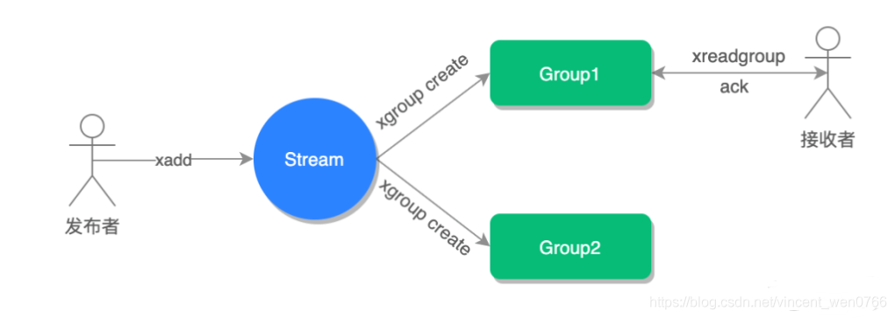
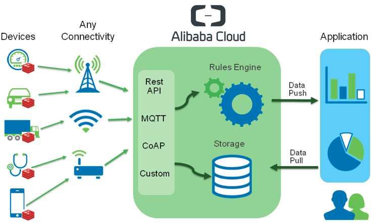
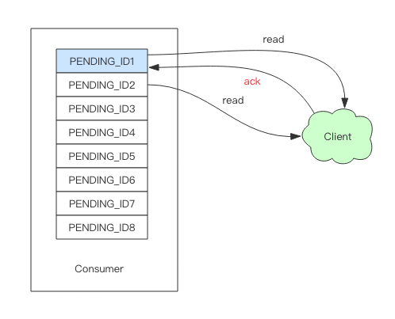

# Redis 实现消息队列

## 原理

### 第一阶段

早在 **Redis 2.0 版本之前**使用 Redis 实现消息队列的方式有两种

- 使用 List 类型实现
- 使用 ZSet 类型实现

其中使用**List 类型实现的方式最为简单和直接**，它主要是**通过 `lpush、rpop` 存入和读取实现消息队列**的，如下图所示



**`lpush` 可以把最新的消息存储到消息队列（List 集合）的首部，而 `rpop` 可以读取消息队列的尾部，这样就实现了先进先出**，如下图所示


~~~bash
127.0.0.1:6379> lpush mq "java" #推送消息 java
(integer) 1
 
127.0.0.1:6379> lpush mq "msg" #推送消息 msg
(integer) 2
 
127.0.0.1:6379> rpop mq #接收到消息 java
"java"
 
127.0.0.1:6379> rpop mq #接收到消息 msg
"mq"
~~~

1. mq 相当于消息队列的名称，
2. lpush 用于生产并添加消息，
3. rpop 用于拉取并消费消息。

使用 List 实现消息队列的优点是：消息可以被持久化，List 可以借助 Redis 本身的持久化功能，AOF（增量备份） 或者是 RDB（全量备份） 或混合持久化的方式，用于把数据保存至磁盘，这样当 Redis 重启之后，消息不会丢失，

但使用 List 同样存在一定的问题，比如消息不支持重复消费、没有按照主题订阅的功能、不支持消费消息确认等


ZSet 实现消息队列的方式和 List 类似，它是利用 zadd 和 zrangebyscore 来实现存入和读取消息的，但 ZSet 的实现方式更为复杂一些，因为 ZSet 多了一个分值（score）属性，我们可以使用它来实现更多的功能，比如用它来存储时间戳，以此来实现延迟消息队列等

ZSet 同样具备持久化的功能，List存在的问题它也同样存在，不但如此，**使用ZSet 还不能存储相同元素的值**。因为**它是有序集合，\**有序集合的存储元素值是不能重复的\**，但分值可以重复，也就是说当消息值重复时，只能存储一条信息在 ZSet 中**


### 第二阶段

在 **Redis 2.0 之后** `Redis` 就新增了专门的发布和订阅的类型，**`Publisher`（发布者）和 `Subscriber`（订阅者）来实现消息队列**了，它们对应的执行命令如下

- 发布消息，publish channel "message"
- 订阅消息，subscribe channel

使用**发布和订阅的类型，我们可以实现主题订阅的功能，也就是 `Pattern Subscribe` 的功能。因此我们可以使用一个消费者“`queue_\*`”来订阅所有以“`queue_`”开头的消息队列**，如下图所示


发布订阅模式的优点很明显，但同样存在以下 3 个问题：

+ 无法持久化保存消息，如果 Redis 服务器宕机或重启，那么所有的消息将会丢失；
+ 发布订阅模式是“发后既忘”的工作模式，如果有订阅者离线重连之后就不能消费之前的历史消息；
+ 不支持消费者确认机制，稳定性不能得到保证，例如当消费者获取到消息之后，还没来得及执行就宕机了。因为没有消费者确认机制，Redis 就会误以为消费者已经执行了，因此就不会重复发送未被正常消费的消息了，这样整体的 Redis 稳定性就被没有办法得到保障了
  


### 第三阶段

然而在 **`Redis 5.0` 之后**新增了 **`Stream`** 类型，我们就**可以使用 `Stream` 的 `xadd` 和 `xrange` 来实现消息的`存入`和`读取`了，并且 `Stream` 提供了 `xack` 手动确认消息消费的命令，用它我们就可以实现消费者确认的功能了**，使用命令如

~~~bash
127.0.0.1:6379> xack mq group1 1580959593553-0
(integer) 1
~~~

相关语法如下

```bash
xack key group-key ID [ID ...]
```

**消费确认增加了消息的可靠性，一般在业务处理完成之后，需要执行 ack 确认消息已经被消费完成**，整个流程的执行如下图所示


其中**“Group”为群组，消费者也就是接收者需要订阅到群组才能正常获取到消息**


## Stream

 Redis Stream 主要用于消息队列（MQ，Message Queue），Redis 本身是有一个 Redis 发布订阅 (pub/sub) 来实现消息队列的功能，但它有个缺点就是消息无法持久化，如果出现网络断开、Redis 宕机等，消息就会被丢弃。

  简单来说发布订阅 (pub/sub) 可以分发消息，但无法记录历史消息。而 Redis Stream 提供了消息的持久化和主备复制功能，可以让任何客户端访问任何时刻的数据，并且能记住每一个客户端的访问位置，还能保证消息不丢失。


### 基础

​		从redis5.0开始，推出了Stream功能。在Stream中有一个消息链表，所有加入链表中的消息都会被串起来，每一条消息都有自己唯一的ID，还有对应的消息内容，消息内容就是key-value。一个Stream上可以有多个消费者，每个消费者都有一个游标，用于访问消息，在消息链表移动就代表着消费消息，多个消费者之间互不影响。

​		但是基于`PUB/SUB`构建的IRC，有一个问题是`PUB/SUB`的消息模型是`Fire and Forgot`。也就是说Redis本身并不保存任何历史消息，如果IRC中某个用户的网络连接出现异常，重新加入IRC后，他是看不到断链期间的聊天记录的，新加入的用户同样也看不到最近一段时间的历史记录，这个对用户迅速的理解当前讨论的问题非常不便。此外，如果Redis发生了重启，所有的用户也需要重新订阅频道。


### 使用

#### 创建频道

~~~bash
# 目前Redis还不支持创建空的stream，所以我们可以添加一个特殊消息,
# 来创建一个新的stream(频道)
ip:7000> xadd channel1 * create-channel null
1528702126345-0
~~~


#### 发送消息

~~~~bash
# 发送一条消息，只需要使用xadd命令即可，我们可以给每条消息命名，顺便带上消息来源，方便业务逻辑处理。
# 我们也可以一次发送多条消息，可以作为优化网络开销的一种手段。
ip:7000> xadd channel1 * msg1-tony "Hello everyone."
1528702503377-0
ip:7000> xadd channel1 * msg2-tony "I am a big Redis fan." msg3-tony "Hope we can learn from each other.:-)"
1528702573546-0
~~~~


#### 接收消息

~~~~bash
# 新用户初次加入频道时，指定'$'作为一个特殊起始ID读取消息，表示只接收最新的频道消息
# 之后如果新消息，只需从上一次的返回结果ID继续读取即可
# 当没有新消息时，xread命令返回空集
ip:7000> xread BLOCK 100 STREAMS channel1 $
1) 1) "channel1"
   2) 1) 1) 1528703048021-0
         2) 1) "msg1-tony"
            2) "Hello everyone."
ip:7000> xread BLOCK 100 STREAMS channel1 1528703048021-0
1) 1) "channel1"
   2) 1) 1) 1528703061087-0
         2) 1) "msg2-tony"
            2) "I am a big Redis fan."
            3) "msg3-tony"
            4) "Hope we can learn from each other.:-)"
ip:7000> xread BLOCK 100 STREAMS channel1 1528703061087-0
(nil)
~~~~


#### **获取历史消息**

前面我们提到了，`Redis Stream`和`PUB/SUB`相比，一个重要的区别是，`Redis Stream`可以获取历史发送的消息，所以当一个用户断开连接重新加入IRC时，可以通过如下方式获取历史消息：

~~~bash
# 1528703061087-0 为用户记录的最后接收的消息的ID
ip:7000> xrange channel1 1528703061087-0 +
1) 1) 1528706457462-0
   2) 1) "msg1-andy"
      2) "Nice to meet you guys."
2) 1) 1528706497200-0
   2) 1) "msg4-tony"
      2) "When will Redis 5.0 GA comes out?"
3) 1) 1528706601973-0
   2) 1) "msg1-antirez"
      2) "I think it will arrive in the second half of 2018."
~~~


### IoT 数据采集

​		Redis除了强大而且丰富的数据结构支持，还有一个很重要的能力是跨平台，甚至是作为一个嵌入式的存储系统跑在基于ARM的平台上，比如作者之前就宣称，Redis成功的跑在了“树莓派”上

​		试想一下，在 IoT 时代，会有无数随时随地可以接入互联网的智能设备，你家里的冰箱会实时的汇报，冰箱里面有哪些食物，数量多少，新鲜程度如何，空调会汇报现在温度多少，空气质量如何，你的车会不断的汇报发动机的各项数据，变速箱的各项数据，车内空气的各项数据。这么多的IoT设备会形成巨大的数据洪流，采集完成后在云端进行分析，产生巨大的用户价值。

​		这些数据虽然内容各个不同，但是都有一个共同的特点，都是一种时序数据。看到这里，你可能会突然发现，Redis Stream从设计初就是为了支持时间序列数据而生，Redis又成功的跑在了ARM平台，而未来物联网会有[万亿级的设备基于ARM平台。所以，我们不由自主的可以猜想，除了现在在各种互联网服务中作为Cache和KV存储广泛应用，Redis下一个大放异彩的领域也许就在物联网。



上面这个图，就是一个典型的物联网设备信息采集，分析，展示的架构。Redis作为一个嵌入式的存储系统跑在各个IoT设备上，各个设备使用`Redis Stream`暂存产生的时序数据，然后再异步的推送到云端。云上部署的各个业务程序，会读取推送的原始数据，基于一定的规则进行分析，然后将结果写入可靠的数据存储系统。用户读取结果，在APP或者web页面上进行展示，从而整个系统形成一个闭环。


### 其他问题

#### Stream消息太多怎么办

读者很容易想到，要是消息积累太多，Stream的链表岂不是很长，内容会不会爆掉就是个问题了。xdel指令又不会删除消息，它只是给消息做了个标志位。

Redis自然考虑到了这一点，所以它提供了一个定长Stream功能。在xadd的指令提供一个定长长度maxlen，就可以将老的消息干掉，确保最多不超过指定长度。

~~~bash
127.0.0.1:6379> xlen codehole
(integer)5
127.0.0.1:6379> xadd codehole maxlen 3 * name xiaorui age 
11527855160273-0
127.0.0.1:6379> xlen codehole
(integer) 3
~~~

我们看到Stream的长度被砍掉了。

#### 消息如果忘记ACK会怎样

Stream在每个消费者结构中保存了正在处理中的消息ID列表PEL，如果消费者收到了消息处理完了但是没有回复ack，就会导致PEL列表不断增长，如果有很多消费组的话，那么这个PEL占用的内存就会放大。



#### PEL如何避免消息丢失 

​		在客户端消费者读取Stream消息时，Redis服务器将消息回复给客户端的过程中，客户端突然断开了连接，消息就丢失了。但是PEL里已经保存了发出去的消息ID。待客户端重新连上之后，可以再次收到PEL中的消息ID列表。不过此时xreadgroup的起始消息ID不能为参数>，而必须是任意有效的消息ID，一般将参数设为0-0，表示读取所有的PEL消息以及自`last_delivered_id`之后的新消息。

### 结论

​		Stream的消费模型借鉴了kafka的消费分组的概念，它弥补了Redis Pub/Sub不能持久化消息的缺陷。但是它又不同于kafka，kafka的消息可以分 partition，而Stream不行。如果非要分parition的话，得在客户端做，提供不同的Stream名称，对消息进行hash取模来选择往哪个Stream里塞。**所以最终的结果还是Redis作为消息队列的功能目前不够完善**