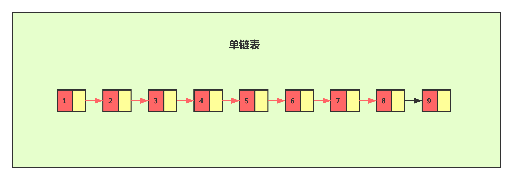
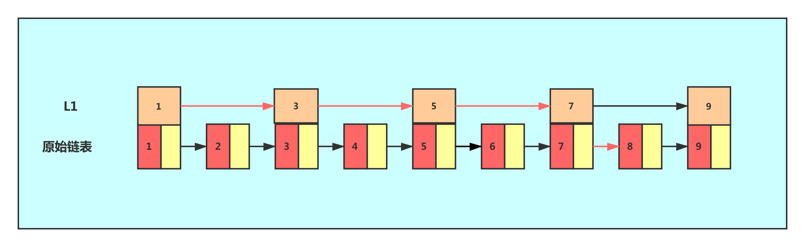
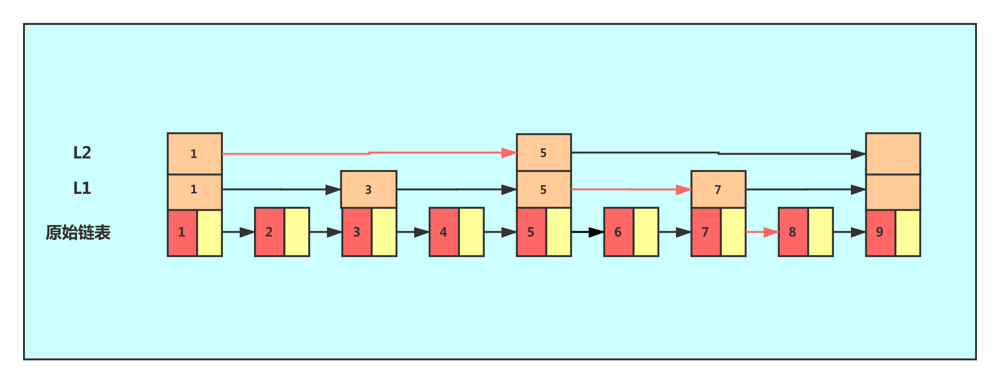
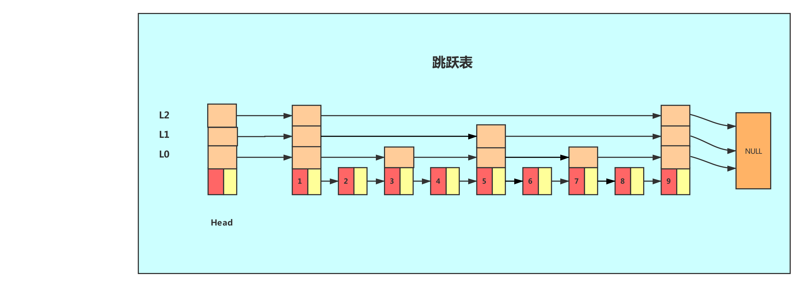
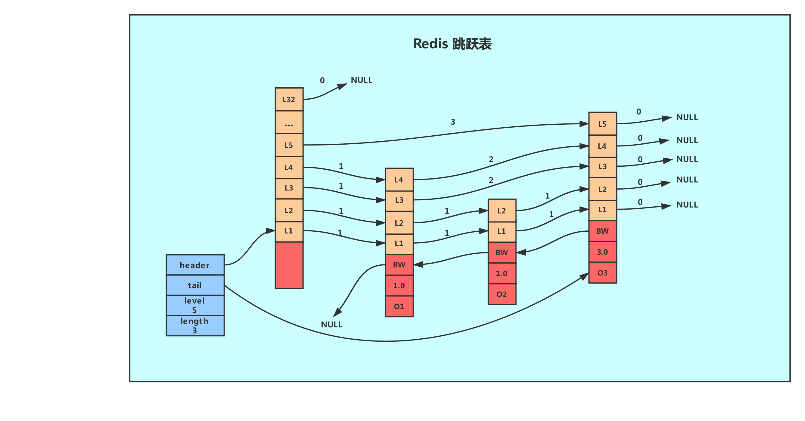

## 一、经典Skiplist 跳跃表

跳表由 William Pugh 于1990年发表的论文 Skip lists: a probabilistic alternative to balanced trees 中被首次提出，查找时间复杂度为平均 O ( l o g N ) O(logN)*O*(*l**o**g**N*)，最差 O ( N ) O(N)*O*(*N*)，在大部分情况下效率可与平衡树相媲美，但实现比平衡树简单的多，跳表是一种典型的以空间换时间的数据结构。

#### 1.1 什么是跳跃表

对于一个单链表来讲，即便链表中存储的数据是有序的，如果我们要想在其中查找某个数据，也只能从头到尾遍历链表。这样查找效率就会很低，时间复杂度会很高，是 O(n)。


如果我们想要提高其查找效率，可以考虑在链表上建索引的方式。每两个结点提取一个结点到上一级，我们把抽出来的那一级叫作索引。


这个时候，我们假设要查找节点8，我们可以先在索引层遍历，当遍历到索引层中值为 7 的结点时，发现下一个节点是9，那么要查找的节点8肯定就在这两个节点之间。我们下降到链表层继续遍历就找到了8这个节点。原先我们在单链表中找到8这个节点要遍历8个节点，而现在有了一级索引后只需要遍历五个节点。

从这个例子里，我们看出，加来一层索引之后，查找一个结点需要遍的结点个数减少了，也就是说查找效率提高了，同理再加一级索引。


从图中我们可以看出，查找效率又有提升。在例子中我们的数据很少，当有大量的数据时，我们可以增加多级索引，其查找效率可以得到明显提升。


像这种链表加多级索引的结构，就是跳跃表！

------

#### 1.2 跳表特点

**跳表具有以下几个特点：**

- 由许多层结构组成。
- 每一层都是一个有序的链表。
- 最底层 (Level 1) 的链表包含所有元素。
- 如果一个元素出现在 Level i 的链表中，则它在 Level i 之下的链表也都会出现。

每个节点包含两个指针，一个指向同一链表中的下一个元素，一个指向下面一层的元素。

+ 跳表的查找会从顶层链表的头部元素开始，然后遍历该链表，直到找到元素大于或等于目标元素的节点，如果当前元素正好等于目标，那么就直接返回它。如果当前元素小于目标元素，那么就垂直下降到下一层继续搜索，如果当前元素大于目标或到达链表尾部，则移动到前一个节点的位置，然后垂直下降到下一层。正因为 Skiplist 的搜索过程会不断地从一层跳跃到下一层的，所以被称为跳跃表。

跳表是一个“概率型”的数据结构，这一句话十分有意思，指的就是**跳表在插入操作时，元素的插入层数完全是随机指定的。**实际上该决定插入层数的随机函数对跳表的查找性能有着很大影响，这并不是一个普通的服从均匀分布的随机数，它的计算过程如下：

- 指定一个节点最大的层数 MaxLevel，指定一个概率 p， 层数 lvl 默认为 1 。
- 生成一个 0~1 的随机数 r，若 r < p，且 lvl < MaxLevel ，则执行 lvl ++。
- 重复第 2 步，直至生成的 r > p 为止，此时的 lvl 就是要插入的层数。

- 在 Redis 的 skiplist 实现中，p = 1 / 4p = 1/4*p*=1/4 ，M a x L e v e l = 32MaxLevel = 32*M**a**x**L**e**v**e**l*=32。

------

## 二、Redis跳跃表

Redis使用跳跃表作为有序集合键的底层实现之一,如果一个有序集合包含的元素数量比较多,又或者有序集合中元素的成员是比较长的字符串时, Redis就会使用跳跃表来作为有序集合健的底层实现。

这里我们需要思考一个问题——为什么元素数量比较多或者成员是比较长的字符串的时候Redis要使用跳跃表来实现？

从上面我们可以知道，跳跃表在链表的基础上增加了多级索引以提升查找的效率，但其是一个空间换时间的方案，必然会带来一个问题——索引是占内存的。原始链表中存储的有可能是很大的对象，而索引结点只需要存储关键值值和几个指针，并不需要存储对象，因此当节点本身比较大或者元素数量比较多的时候，其优势必然会被放大，而缺点则可以忽略。

#### 2.1 Redis中跳跃表的实现

Redis的跳跃表由zskiplistNode和zskiplist两个结构定义,其中 zskiplistNode结构用于表示跳跃表节点,而 zskiplist结构则用于保存跳跃表节点的相关信息,比如节点的数量,以及指向表头节点和表尾节点的指针等等。

** zskiplistNode 和 zskiplist结构定义：**

```
typedef struct zskiplistNode {
    // member 对象
    robj *obj;
    // 分值
    double score;
    // 后退指针
    struct zskiplistNode *backward;
    // 层
    struct zskiplistLevel {
        // 前进指针
        struct zskiplistNode *forward;

        // 这个层跨越的节点数量
        unsigned int span;
    } level[];

} zskiplistNode;

typedef struct zskiplist {
    // 头节点，尾节点
    struct zskiplistNode *header, *tail;
    // 节点数量
    unsigned long length;
    // 目前表内节点的最大层数
    int level;
} zskiplist;

```

多个跳跃表节点构成一个跳跃表：


上图展示了一个跳跃表示例,其中最左边的是`zskiplist`结构,该结构包含以下属性。

- header:指向跳跃表的表头节点，通过这个指针程序定位表头节点的时间复杂度就为O(1)
- tail:指向跳跃表的表尾节点,通过这个指针程序定位表尾节点的时间复杂度就为O(1)
- level:记录目前跳跃表内,层数最大的那个节点的层数(表头节点的层数不计算在内)，通过这个属性可以再O(1)的时间复杂度内获取层高最好的节点的层数。
  length:记录跳跃表的长度,也即是,跳跃表目前包含节点的数量(表头节点不计算在内)，通过这个属性，程序可以再O(1)的时间复杂度内返回跳跃表的长度。

结构右方的是四个`zskiplistNode`结构,该结构包含以下属性

层(level):

- 节点中用1、2、L3等字样标记节点的各个层,L1代表第一层,L代表第二层,以此类推。
- 每个层都带有两个属性:前进指针和跨度。前进指针用于访问位于表尾方向的其他节点,而跨度则记录了前进指针所指向节点和当前节点的距离(跨度越大、距离越远)。在上图中,连线上带有数字的箭头就代表前进指针,而那个数字就是跨度。当程序从表头向表尾进行遍历时,访问会沿着层的前进指针进行。
- 每次创建一个新跳跃表节点的时候,程序都根据幂次定律(powerlaw,越大的数出现的概率越小)随机生成一个介于1和32之间的值作为level数组的大小,这个大小就是层的“高度”。

后退(backward)指针：

+ 节点中用BW字样标记节点的后退指针,它指向位于当前节点的前一个节点。后退指针在程序从表尾向表头遍历时使用。与前进指针所不同的是每个节点只有一个后退指针，因此每次只能后退一个节点。

分值(score):

+ 各个节点中的1.0、2.0和3.0是节点所保存的分值。在跳跃表中,节点按各自所保存的分值从小到大排列。

成员对象(oj)

+ 各个节点中的o1、o2和o3是节点所保存的成员对象。在同一个跳跃表中,各个节点保存的成员对象必须是唯一的,但是多个节点保存的分值却可以是相同的: **分值相同的节点将按照成员对象在字典序中的大小来进行排序,** 成员对象较小的节点会排在前面(靠近表头的方向),而成员对象较大的节点则会排在后面(靠近表尾的方向)。

------

## 三、分析

#### 3.1 Redis中的Skiplist与经典Skiplist的区别

**Redis中的 Skiplist 与经典 Skiplist 相比，有如下不同：**

- 分数(score)允许重复，即 Skiplist 的 key 允许重复，经典 Skiplist 中是不允许的。
- 在比较时，不仅比较分数（相当于 Skiplist 的 key），还比较数据本身。在 Redis 的 Skiplist 实现中，数据本身的内容唯一标识这份数据，而不是由 key 来唯一标识。**另外，当多个元素分数相同的时候，还需要根据数据内容来进字典排序**。
- 第 1 层链表不是一个单向链表，而是一个双向链表。这是为了方便以倒序方式获取一个范围内的元素。

**此外，JDK 提供了以下两种跳表实现：**
ConcurrentSkipListMap：在功能上类似 HashMap。
ConcurrentSkipListSet ： 在功能上类似 HashSet。

------

#### 3.2 Skiplist与平衡树、哈希表的比较

+ Skiplist 和各种平衡树（如AVL、红黑树等）的元素是有序排列的，而哈希表不是有序的。因此，在哈希表上只能做单个 key 的查找，不适宜做范围查找。

+ 从内存占用上来说，Skiplist 比平衡树更灵活一些。一般来说，平衡树每个节点包含 2 个指针（分别指向左右子树），而 Skiplist 每个节点包含的指针数目平均为1 / ( 1 − p ) 1/(1-p)1/(1−*p*)，具体取决于参数 p p*p* 的大小。如果像 Redis 里的实现一样，取 p = 1 / 4 p=1/4*p*=1/4，那么平均每个节点包含 1.33 个指针，比平衡树更有优势。

+ 查找单个 key，Skiplist 和平衡树的时间复杂度都为 O ( l o g N ) O(logN)*O*(*l**o**g**N*)；而哈希表在保持较低的哈希值冲突概率的前提下，查找时间复杂度接近 O ( 1 ) O(1)*O*(1)，性能更高一些。

+ 从算法实现难度上来比较，Skiplist 比平衡树要简单得多。

#### 3.3 Redis Zset 采用跳表而不是平衡树的原因

平衡树涉及到树的再平衡，而跳表的数据结构相对简单，同时查找性能也不错

#### 3.4 Mqsql为什么是用B+树而不是调表

Mysql 基于数据库操作数据，相同的数据量，B+树磁盘IO的次数要远远必跳表小很多，所以在稍微比较大的数据量的情况下，B+树的查找性能也会比跳表好。

