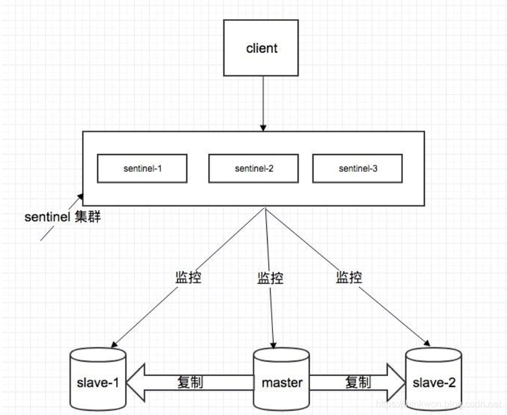
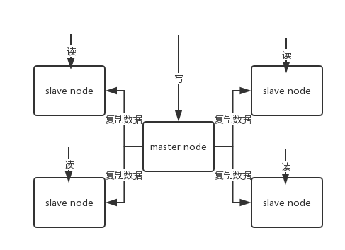
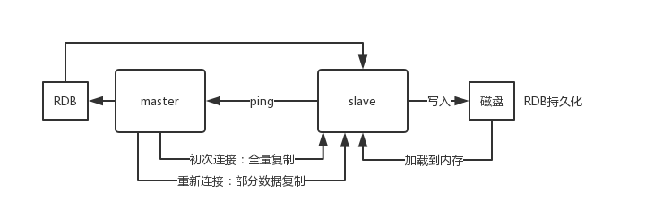
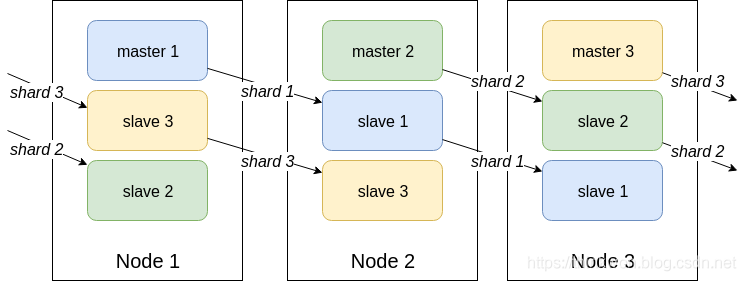
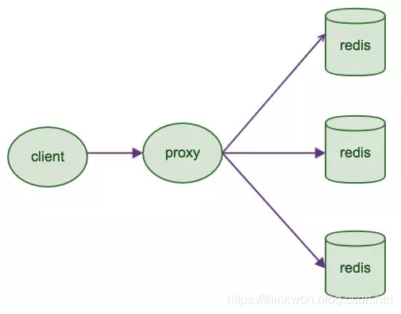
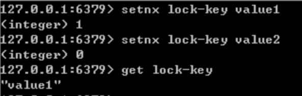

# Redis

## 概述

### 什么是 Redis

​			Redis 是一个使用 C 语言编写的，开源的高性能非关系型的键值对数据库。键的类型只能为字符串，值支持多种数据类型，包括（5中基本数据结构）：**字符串、列表、集合、散列表、有序集合**，其他：bitmap、geohash、hyperloglog、streams 组成。

​		Redis 的数据是存在内存中的，所以读写速度非常快，因此 redis 被广泛应用于缓存方向，每秒可以处理超过 10万次读写操作，**是已知性能最快的 K-V DB**。另外，Redis 也经常用来做分布式锁。除此之外，Redis 支持事务 、持久化、LUA 脚本、LRU 驱动事件、多种集群方案。

### 6.0 版本新特性

1. **多线程IO**：Redis 6引入多线程IO，但多线程部分只是用来处理网络数据的读写和协议解析，执行命令仍然是单线程。之所以这么设计是不想因为多线程而变得复杂，需要去控制 key、lua、事务，LPUSH/LPOP 等等的并发问题。
2. 重新设计了客户端缓存功能：实现了Client-side-caching（客户端缓存）功能。放弃了caching slot，而只使用key names。Redis server-assisted client side caching
3. RESP3协议
   + RESP（Redis Serialization Protocol）是 Redis 服务端与客户端之间通信的协议。Redis 5 使用的是 RESP2，而 Redis 6 开始在兼容 RESP2 的基础上，开始支持 RESP3。
   + 推出RESP3的目的：一是因为希望能为客户端提供更多的语义化响应，以开发使用旧协议难以实现的功能；另一个原因是实现 Client-side-caching（客户端缓存）功能。
4. 支持SSL，更加安全。
5. **ACL权限控制**：
   + 支持对客户端的权限控制，实现对不同的key授予不同的操作权限。
   + 有一个新的ACL日志命令，允许查看所有违反ACL的客户机、访问不应该访问的命令、访问不应该访问的密钥，或者验证尝试失败。这对于调试ACL问题非常有用。
6. 提升了RDB日志加载速度：根据文件的实际组成（较大或较小的值），可以预期20/30%的改进。当有很多客户机连接时，信息也更快了，这是一个老问题，现在终于解决了。
7. **发布官方的Redis集群代理模块 Redis Cluster proxy**：在 Redis 集群中，客户端会非常分散，现在为此引入了一个集群代理，可以为客户端抽象 Redis 群集，使其像正在与单个实例进行对话一样。同时在简单且客户端仅使用简单命令和功能时执行多路复用。
8. **相关阅读**
   + [Redis6新特性详解](https://blog.csdn.net/b416055728/article/details/121759018?utm_medium=distribute.pc_relevant.none-task-blog-2~default~baidujs_utm_term~default-0-121759018-blog-113182479.pc_relevant_3mothn_strategy_and_data_recovery&spm=1001.2101.3001.4242.1&utm_relevant_index=3)

### Redis有哪些优缺点

优点

- 读写性能优异， Redis能读的速度是110000次/s，写的速度是81000次/s。
- 默认最大1万个连接数，但是如果真的连接1万，CPU也会遇到性能瓶颈
- 支持数据持久化，支持 AOF 和 RDB 两种持久化方式。
- 支持事务，Redis的所有操作都是原子性的，同时Redis还支持对几个操作合并后的原子性执行。
- 数据结构丰富，除了支持string类型的value外还支持hash、set、zset、list等数据结构。
- 支持主从复制，主机会自动将数据同步到从机，可以进行读写分离。

缺点

+ 数据库容量受到物理内存的限制，不太适合作为海量数据的高性能读写

- Redis 不具备自动容错和恢复功能，主机从机的宕机都会导致前端部分读写请求失败

- 主从同步不是强一致性，主机宕机，从机可能会存在**数据不一致**

- Redis 较难支持在线扩容，在集群容量达到上限时在线扩容会变得很复杂。

  

### 为什么要用 Redis /为什么要用缓存

提升系统数据的读取性能，应对高频的读服务

+ **高性能：**操作缓存就是直接操作内存，所以速度相当快
+ **高并发：**直接操作缓存能够承受的请求是远远大于直接访问数据库的。

### 为什么要用 Redis 而不用 map/guava 做缓存?

​		以 Java 为例，使用自带的 map 或者 guava（谷歌在 JDK 上面的扩展） 实现的是**本地缓存**，使用 redis 或 memcached 之类的称为**分布式缓存**，多实例共用一份缓存数据，缓存具有一致性。详细的区别：

1. Redis 可以用几十 G 内存来做缓存，Map 不行，一般 JVM 也就分几个 G 数据就够大了
2. Redis 的缓存可以持久化，Map 是内存对象，程序一重启数据就没了
3. Redis 可以实现分布式的缓存，Map 只能存在创建它的程序里
4. Redis 可以处理每秒百万级的并发，是专业的缓存服务，Map 只是一个普通的对象
5. Redis 缓存有过期机制，Map 本身无此功能
6. Redis 有丰富的 Api，Map 就简单太多了

### 对比MongoDB

之前也用过redis，当时是用来存储一些热数据，量也不大，但是操作很频繁。现在项目中用的是MongoDB，目前是百万级的数据，将来会有千万级、亿级。大家一般称之为**Redis缓存、MongoDB数据库**。这也是有道有理有根据的，

+ Redis主要把数据存储在内存中，其“缓存”的性质远大于其“数据存储“的性质，其中数据的增删改查也只是像变量操作一样简单；
+ MongoDB却是一个“存储数据”的系统，增删改查可以添加很多条件，就像SQL数据库一样灵活，这一点在面试的时候很受用。

#### 对比ES

ES 主要作为海量数据搜索的功能，适合频繁的数据读取，所以适合用于一次性写入数据，多次查询的场景

### Redis 为什么这么快

1. 完全基于内存，绝大部分请求是纯粹的内存操作，非常快速。

2. 数据结构简单，对数据操作也简单，

3. 采用单线程，避免了不必要的上下文切换和竞争条件，也不存在多进程或者多线程导致的切换而消耗 CPU，

4. 使用多路 I/O 复用模型，非阻塞 IO；

5. Redis 直接自己构建了 VM 机制 ，因为一般的系统调用系统函数的话，会浪费一定的时间去移动和请求；

### Redis 为什么不用多线程

​		跟多线程相比较，线程切换需要切换到内核进行线程切换，需要消耗时间和资源.而I/O多路复用不需要切换线/进程，效率相对较高,特别是对高并发的应用 nginx 就是用I/O多路复用，故而性能极佳，但多线程编程逻辑和处理上比I/O多路复用简单，而I/O多路复用处理起来较为复杂。

## 数据类型

### Redis有哪些数据类型

Redis主要有 9 种数据类型，基本类型包括**String，List，Set，Zset，Hash，**满足大部分的使用要求

| 数据类型 | 可以存储的值           | 操作                                                         | 应用场景                                                     |
| -------- | ---------------------- | ------------------------------------------------------------ | ------------------------------------------------------------ |
| STRING   | 字符串、整数或者浮点数 | 对整个字符串或者字符串的其中一部分执行操作 对整数和浮点数执行自增或者自减操作 | 做简单的键值对缓存                                           |
| LIST     | 列表                   | 从两端压入或者弹出元素 对单个或者多个元素进行修剪， 只保留一个范围内的元素 | 存储一些列表型的数据结构，类似粉丝列表、文章的评论列表之类的数据 |
| SET      | 无序集合               | 添加、获取、移除单个元素 检查一个元素是否存在于集合中 计算交集、并集、差集 从集合里面随机获取元素 | 交集、并集、差集的操作，比如交集，可以把两个人的粉丝列表整一个交集 |
| HASH     | 包含键值对的无序散列表 | 添加、获取、移除单个键值对 获取所有键值对 检查某个键是否存在 | 结构化的数据，比如一个对象                                   |
| ZSET     | 有序集合               | 添加、获取、删除元素 根据分值范围或者成员来获取元素 计算一个键的排名 | 去重但可以排序，如获取排名前几名的用户                       |

### Redis的应用场景

#### 总结一

**计数器**

​		对 String 进行自增自减运算，从而实现计数器功能。Redis 读写性能非常高，很适合存储频繁读写的计数量。

**缓存**

​		将热点数据放到内存中，设置内存的最大使用量以及淘汰策略来保证缓存的命中率。

**会话缓存**

​		可以使用 Redis 来统一存储多台应用服务器的会话信息。当应用服务器不再存储用户的会话信息，也就不再具有状态，一个用户可以请求任意一个应用服务器，从而更容易实现高可用性以及可伸缩性。

**全页缓存（FPC）**

​		除基本的会话token之外，Redis还提供很简便的FPC平台。以Magento为例，Magento提供一个插件来使用Redis作为全页缓存后端。此外，对WordPress的用户来说，Pantheon有一个非常好的插件 wp-redis，这个插件能帮助你以最快速度加载你曾浏览过的页面。

**查找表**

​		例如 DNS 记录就很适合使用 Redis 进行存储。查找表和缓存类似，也是利用了 Redis 快速的查找特性。但是查找表的内容不能失效，而缓存的内容可以失效，因为缓存不作为可靠的数据来源。

**消息队列(发布/订阅功能)**

​		List 是一个双向链表，可以通过 lpush 和 rpop 写入和读取消息。不过最好使用 Kafka、RabbitMQ 等消息中间件。

**分布式锁实现**

​		在分布式场景下，无法使用单机环境下的锁来对多个节点上的进程进行同步。可以使用 Redis 自带的 SETNX 命令实现分布式锁，除此之外，还可以使用官方提供的 RedLock 分布式锁实现。

**布隆过滤器**

​		Redis高级客户端Redisson可以实现布隆过滤器

**位图**

​		简单记录千万数据的状态

**其它**

​		Set 可以实现交集、并集等操作，从而实现共同好友等功能。ZSet 可以实现有序性操作，从而实现排行榜等功能。

## 持久化

### Redis 键值是如何保存的呢

​		Redis 为了快速访问键值对，采用了**哈希表**来保存所有的键值对，一个哈希表对应了多个**哈希桶**，所谓的哈希桶是指哈希表数组中的每一个元素，当然哈希表中保存的不是值本身，是指向值的指针，如下图。

​		其中哈希桶中的 entry 元素中保存了*key 和*value 指针，分别指向了实际的键和值。通过 Redis 可以在 O(1)的时间内找到键值对，只需要计算 key 的哈希值就可以定位位置，但从下图可以看出，在 4 号位置出现了冲突，两个 key 映射到了同一个位置，这就产生了哈希冲突，会导致哈希表的操作变慢。虽然 Redis 通过链式冲突解决该问题，但如果数据持续增多，产生的哈希冲突也会越来越多，会加重 Redis 的查询时间；

为了解决上述的哈希冲突问题，Redis 会对哈希表进行**rehash**操作，也就是增加目前的哈希桶数量，使得 key 更加分散，进而减少哈希冲突的问题，主要流程如下：

1. 采用两个 hash 表进行操作，当哈希表 A 需要进行扩容时，给哈希表 B 分配两倍的空间；
2.  将哈希表 A 的数据重新映射并拷贝给哈希表 B；
3. 释放 A 的空间。

上述的步骤可能会存在一个问题，当哈希表 A 向 B 复制的时候，是需要一定的时间的，可能会造成 Redis 的线程阻塞，就无法服务其他的请求了。

针对上述问题，Redis 采用了**渐进式 rehash**，主要的流程是：Redis 还是继续处理客户端的请求，每次处理一个请求的时候，就会将该位置所有的 entry 都拷贝到哈希表 B 中，当然也会存在某个位置一直没有被请求。Redis 也考虑了这个问题，通过设置一个定时任务进行 rehash，在一些键值对一直没有操作的时候，会周期性的搬移一些数据到哈希表 B 中，进而缩短 rehash 的过程。

### 什么是Redis持久化？

​		持久化就是把内存的数据写到磁盘中去，防止服务宕机了内存数据丢失。

### Redis 的持久化机制是什么？各自的优缺点？

​		Redis 提供两种持久化机制 **RDB（默认） 和 AOF 机制**:

#### RDB 模式

​		RDB 是Redis DataBase 缩写快照

​		RDB 是Redis默认的持久化方式。按照一定的时间将内存的数据以快照的形式保存到硬盘中，对应产生的数据文件为dump.rdb。通过配置文件中的save参数来定义快照的周期。

##### 优点：

- 只有一个文件 dump.rdb，方便持久化。
- 容灾性好，一个文件可以保存到安全的磁盘。
- 使用单独子进程来进行持久化，主进程不会进行任何 IO 操作，保证了 redis 的高性能
- 比 AOF 的启动效率更高。

##### 缺点：

- 数据安全性低。RDB 是间隔一段时间进行持久化，如果持久化之间 redis 发生故障，会发生数据丢失。

##### 指令

Redis 提供了两个命令来生成 RDB 文件，分别是**save**和**bgsave**：

- save：在主线程中执行，会导致阻塞；
- bgsave：会创建一个子进程，该进程专门用于写入 RDB 文件，可以避免主线程的阻塞，也是默认的方式。

我们可以采用 bgsave 的命令来执行全量快照，提供了数据的可靠性保证，也避免了对 Redis 的性能影响。执行快照期间数据能不能修改呢?如果不能修改，快照过程中如果有新的写操作，数据就会不一致，这肯定是不符合预期的。Redis 借用了操作系统的**写时复制**，在执行快照的期间，正常处理写操作。

##### 主要流程为：

- bgsave 子进程是由主线程 fork 出来的，可以共享主线程的所有内存数据；
- bgsave 子进程运行后，开始读取主线程的内存数据，并把它们写入 RDB 文件中；
- 如果主线程对这些数据都是读操作，例如 A，那么主线程和 bgsave 子进程互不影响；
- 如果主线程需要修改一块数据，如 C，这块数据会被复制一份，生成数据的副本，然主线程在这个副本上进行修改；bgsave 子进程可以把原来的数据 C 写入 RDB 文件；

通过上述方法就可以保证快照的完整性，也可以允许主线程处理写操作，可以避免对业务的影响。**那多久进行一次快照呢**？

+ 理论上来说快照时间间隔越短越好，可以减少数据的丢失，毕竟 fork 的子进程不会阻塞主线程，但是频繁的将数据写入磁盘，会给磁盘带来很多压力，也可能会存在多个快照竞争磁盘带宽（当前快照没结束，下一个就开始了）。另一方面，虽然 fork 出的子进程不会阻塞，但 fork 这个创建过程是会阻塞主线程的，当主线程需要的内存越大，阻塞时间越长；
+ 针对上面的问题，Redis 采用了**增量快照**，在做一次全量快照后，后续的快照只对修改的数据进行记录，需要记住哪些数据被修改了，可以避免全量快照带来的开销。（进程之间通过管道的方式进行通信，先将新增或修改的命令保存下来，等到做完一次全量快照以后，再读取管道里面余下的命令，做一次增量快照）

#### AOF 模式

​		AOF持久化(即Append Only File持久化)，则是将Redis执行的每次写命令记录到单独的日志文件中，当重启Redis会重新将持久化的日志中文件恢复数据。当两种方式同时开启时，数据恢复Redis会优先选择AOF恢复。

##### 优点：

- 数据安全，`aof` 持久化可以配置 `appendfsync` 属性，有 always，每进行一次 命令操作就记录到 `aof` 文件中一次。
- 通过 append 模式写文件，即使中途服务器宕机，可以通过 `redis-check-aof` 工具解决数据一致性问题。
- AOF 机制的 rewrite 模式。AOF 文件没被 rewrite 之前（文件过大时会对命令 进行合并重写），可以删除其中的某些命令（比如误操作的 `flushall`)

##### 缺点：

- AOF 文件比 RDB 文件大，且恢复速度慢。 
- 数据集大的时候，比 RDB 启动效率低。

##### AOF 什么时候写入磁盘?

对于这个问题 AOF 机制提供了三种选择（appendfsync 的三个可选值），分别是**Always、Everysec、No**具体如下：

1. Always 可靠性较高，数据基本不丢失，但是对性能的影响较大；
2. Everysec 性能适中，即使宕机也只会丢失 1 秒的数据；
3. No 性能好，但是如果宕机丢失的数据较多。

虽然有一定的写回策略，但毕竟 AOF 是通过文件的形式记录所有的写命令，但如果指令越来越多的时候，AOF 文件就会越来越大，可能会超出文件大小的限制；另外，如果文件过大再次写入指令的话效率也会变低；如果发生宕机，需要把 AOF 所有的命令重新执行，以用于故障恢复，数据过大的话这个恢复过程越漫长，也会影响 Redis 的使用。

##### AOF 重写机制

AOF 重写就是根据所有的键值对创建一个新的 AOF 文件，可以减少大量的文件空间，减少的原因是：AOF 对于命令的添加是追加的方式，逐一记录命令，但有可能存在某个键值被反复更改，产生了一些冗余数据，这样在重写的时候就可以过滤掉这些指令，从而更新当前的最新状态。

AOF 重写的过程是通过主线程 fork 后台的 bgrewriteaof 子进程来实现的，可以避免阻塞主进程导致性能下降，整个过程如下：

- AOF 每次重写，fork 过程会把主线程的内存拷贝一份 bgrewriteaof 子进程，里面包含了数据库的数据，拷贝的是父进程的页表，可以在不影响主进程的情况下逐一把拷贝的数据记入重写日志；
- 因为主线程没有阻塞，仍然可以处理新来的操作，如果这时候存在写操作，会先把操作先放入缓冲区，对于正在使用的日志，如果宕机了这个日志也是齐全的，可以用于恢复；对于正在更新的日志，也不会丢失新的操作，等到数据拷贝完成，就可以将缓冲区的数据写入到新的文件中，保证数据库的最新状态。

两种备份方式的优缺点是什么？

- AOF 文件比 RDB 更新频率高，优先使用 AOF 还原数据。
- AOF 比 RDB 更安全也更大
- RDB 性能比 AOF 好
- 如果两个都配了优先加载 AOF

### 如何选择合适的持久化方式

- 如果你非常关心你的数据， 但仍然可以承受数分钟以内的数据丢失，那么你可以只使用RDB持久化。
- 有很多用户都只使用AOF持久化，但并不推荐这种方式，因为定时生成RDB快照（snapshot）非常便于进行数据库备份， 并且 RDB 恢复数据集的速度也要比AOF恢复的速度要快，除此之外，使用RDB还可以避免AOF程序的bug。
- 如果你只希望你的数据在服务器运行的时候存在，你也可以不使用任何持久化方式。

### Redis持久化数据和缓存怎么做扩容？

- 如果 Redis 被当做缓存使用，使用**一致性哈希**实现动态扩容缩容，也就是Redis Cluster。
- 如果 Redis 被当做一个持久化存储使用，必须使用固定的 keys-to-nodes 映射关系，节点的数量一旦确定不能变化。否则的话（ 即Redis 节点需要动态变化的情况），必须使用可以在运行时进行数据再平衡的一套系统，而当前只有Redis集群可以做到这样。

### 混合使用 AOF 日志和 RDB 快照

​		虽然跟 AOF 相比，RDB 快照的恢复速度快，但快照的频率不好把握，如果频率太低，两次快照间一旦宕机，就可能有比较多的数据丢失。如果频率太高，又会产生额外开销，那么，还有什么方法既能利用 RDB 的快速恢复，又能以较小的开销做到尽量少丢数据呢？

​		在 Redis4.0 提出了**混合使用 AOF 和 RDB 快照**的方法，也就是两次 RDB 快照期间的所有命令操作由 AOF 日志文件进行记录。这样的好处是 RDB 快照不需要很频繁的执行，可以避免频繁 fork 对主线程的影响，而且 AOF 日志也只记录两次快照期间的操作，不用记录所有操作，也不会出现文件过大的情况，避免了重写开销。

通过上述方法既可以享受 RDB 快速恢复的好处，也可以享受 AOF 记录简单命令的优势。

**对于 AOF 和 RDB 的选择问题：**

- **数据不能丢失时，内存快照和 AOF 的混合使用是一个很好的选择；**
- **如果允许分钟级别的数据丢失，可以只使用 RDB；**
- **如果只用 AOF，优先使用 everysec 的配置选项，因为它在可靠性和性能之间取了一个平衡。**

## 过期键的删除策略

### Redis的过期键的删除策略

- 定时过期：每个设置过期时间的 key 都需要创建一个定时器，到过期时间就会立即清除。该策略可以立即清除过期的数据，对内存很友好；但是会占用大量的CPU资源去处理过期的数据，从而影响缓存的响应时间和吞吐量。
- **惰性过期**：只有当访问一个key时，才会判断该key是否已过期，过期则清除。该策略可以最大化地节省CPU资源，却对内存非常不友好。
- **定期过期**：每隔一定的时间，会扫描一定数量的数据库的expires字典中一定数量的key，并清除其中已过期的key。该策略是前两者的一个折中方案。

**Redis中同时使用了惰性过期和定期过期两种过期策略。**

### Redis key 过期时间和永久有效分别怎么设置？

EXPIRE 和 PERSIST 命令。

## 内存相关

### MySQL里有2000w数据，redis中只存20w的数据，如何保证redis中的数据都是热点数据

​		redis内存数据集大小上升到一定大小的时候，就会施行数据淘汰策略。

### Redis的内存淘汰策略有哪些

​		Redis的内存淘汰策略是指在Redis的用于缓存的内存不足时，怎么处理需要新写入且需要申请额外空间的数据。

**全局的键空间选择性移除**

- Noeviction：当内存不足以容纳新写入数据时，新写入操作会报错。
- Allkeys-LRU：当内存不足以容纳新写入数据时，在键空间中，移除最近最少使用的key。（这个是**最常用**的）
- Allkeys-random：当内存不足以容纳新写入数据时，在键空间中，随机移除某个key。

**设置过期时间的键空间选择性移除**

- volatile-lru：当内存不足以容纳新写入数据时，在设置了过期时间的键空间中，移除最近最少使用的key。
- volatile-random：当内存不足以容纳新写入数据时，在设置了过期时间的键空间中，随机移除某个key。
- volatile-ttl：当内存不足以容纳新写入数据时，在设置了过期时间的键空间中，有更早过期时间的key优先移除。

**总结**

​		Redis的内存淘汰策略的选取并不会影响过期的key的处理。内存淘汰策略用于处理内存不足时的需要申请额外空间的数据；过期策略用于处理过期的缓存数据。

### Redis主要消耗什么物理资源？

​		内存。

### Redis的内存用完了会发生什么？

​		如果达到设置的上限，Redis的写命令会返回错误信息（但是读命令还可以正常返回。）或者你可以配置内存淘汰机制，当Redis达到内存上限时会冲刷掉旧的内容。

### Redis如何做内存优化？

原则：尽可能小的空间，存储更多的数据

1. 使用Hash数据结构，会更加紧凑一些
2. 数据压缩算法

## Spring Boot 集成Redis

### 缓存@Cacheable

根据方法对其返回结果进行缓存，下次请求时，如果缓存存在，则直接读取缓存数据返回；如果缓存不存在，则执行方法，并把返回的结果存入缓存中。一般用在查询方法上。

查看源码，属性值如下：

| **属性/方法名** | **解释**                                         |
| --------------- | ------------------------------------------------ |
| value           | 缓存名，必填，它指定了你的缓存存放在哪块命名空间 |
| cacheNames      | 与 value 差不多，二选一即可                      |
| key             | 可选属性，可以使用 SpEL 标签自定义缓存的key      |

### 缓存@CachePut

使用该注解标志的方法，每次都会执行，并将结果存入指定的缓存中。其他方法可以直接从响应的缓存中读取缓存数据，而不需要再去查询数据库。一般用在新增方法上。

查看源码，属性值如下：

| **属性/方法名** | **解释**                                         |
| --------------- | ------------------------------------------------ |
| value           | 缓存名，必填，它指定了你的缓存存放在哪块命名空间 |
| cacheNames      | 与 value 差不多，二选一即可                      |
| key             | 可选属性，可以使用 SpEL 标签自定义缓存的key      |

### 缓存@CacheEvict

使用该注解标志的方法，会清空指定的缓存。一般用在更新或者删除方法上

查看源码，属性值如下：

| **属性/方法名**  | **解释**                                                     |
| ---------------- | ------------------------------------------------------------ |
| value            | 缓存名，必填，它指定了你的缓存存放在哪块命名空间             |
| cacheNames       | 与 value 差不多，二选一即可                                  |
| key              | 可选属性，可以使用 SpEL 标签自定义缓存的key                  |
| allEntries       | 是否清空所有缓存，默认为 false。如果指定为 true，则方法调用后将立即清空所有的缓存 |
| beforeInvocation | 是否在方法执行前就清空，默认为 false。如果指定为 true，则在方法执行前就会清空缓存 |

## 线程模型

### Redis线程（网络）模型

​		Redis基于Reactor模式开发了网络事件处理器，这个处理器被称为**文件事件处理器**（file event handler）。它的组成结构为4部分：多个套接字、IO多路复用程序、文件事件分派器、事件处理器。**因为文件事件分派器队列的消费是单线程的**，所以Redis才叫单线程模型。

- 文件事件处理器使用 I/O 多路复用（multiplexing）程序来同时监听多个套接字， 并根据套接字目前执行的任务来为套接字关联不同的事件处理器。
- 当被监听的套接字准备好执行连接应答（accept）、读取（read）、写入（write）、关闭（close）等操作时， 与操作相对应的文件事件就会产生， 这时文件事件处理器就会调用套接字之前关联好的事件处理器来处理这些事件。

**虽然文件事件处理器以单线程方式运行， 但通过使用 I/O 多路复用程序来监听多个套接字， 文件事件处理器既实现了高性能的网络通信模型， 又可以很好地与 redis 服务器中其他同样以单线程方式运行的模块进行对接， 这保持了 Redis 内部单线程设计的简单性**。

最底层的话还是基于Epoll来实现网络通信的

### Redis为什么使用的是单线程？

Redis 基于内存操作数据，基于单线程天然保证了原子性，如果使用多线程，反正要涉及各种的锁和线程切换，而且Redis的瓶颈主要还是在IO上面，而非CPU上面，所以一般的单线程已经足够了

## Redis事务（了解）

### Redis事务的概念

​		Redis 事务的本质是通过MULTI、EXEC、WATCH等一组命令的集合。事务支持一次执行多个命令，一个事务中所有命令都会被序列化。在事务执行过程，会按照顺序串行化执行队列中的命令，其他客户端提交的命令请求不会插入到事务执行命令序列中。

​		总结说：redis事务就是一次性、顺序性、排他性的执行一个队列中的一系列命令。

### Redis事务的三个阶段

1. 事务开始 MULTI
2. 命令入队
3. 事务执行 EXEC

事务执行过程中，如果服务端收到有EXEC、DISCARD、WATCH、MULTI之外的请求，将会把请求放入队列中排队

### Redis事务相关命令

​		Redis事务功能是通过MULTI、EXEC、DISCARD和WATCH 四个原语实现的

​		Redis会将一个事务中的所有命令序列化，然后按顺序执行。

1. **redis 不支持回滚**，“Redis 在事务失败时不进行回滚，而是继续执行余下的命令”， 所以 Redis 的内部可以保持简单且快速。
2. **如果在一个事务中的命令出现错误，那么所有的命令都不会执行**；
3. **如果在一个事务中出现运行错误，那么正确的命令会被执行**。

- WATCH 命令是一个乐观锁，可以为 Redis 事务提供 check-and-set （CAS）行为。 可以监控一个或多个键，一旦其中有一个键被修改（或删除），之后的事务就不会执行，监控一直持续到EXEC命令。
- MULTI命令用于开启一个事务，它总是返回OK。 MULTI执行之后，客户端可以继续向服务器发送任意多条命令，这些命令不会立即被执行，而是被放到一个队列中，当EXEC命令被调用时，所有队列中的命令才会被执行。
- EXEC：执行所有事务块内的命令。返回事务块内所有命令的返回值，按命令执行的先后顺序排列。 当操作被打断时，返回空值 nil 。
- 通过调用DISCARD，客户端可以清空事务队列，并放弃执行事务， 并且客户端会从事务状态中退出。
- UNWATCH命令可以取消watch对所有key的监控。

### 事务管理（ACID）概述

**Redis的事务总是具有ACID中的一致性和隔离性**，其他特性是不支持的。当服务器运行在*AOF*持久化模式下，并且appendfsync选项的值为always时，事务也具有耐久性。

### Redis事务支持隔离性吗

Redis 是单进程程序，并且它保证在执行事务时，不会对事务进行中断，事务可以运行直到执行完所有事务队列中的命令为止。因此，**Redis 的事务是总是带有隔离性的**。

### Redis事务保证原子性吗，支持回滚吗

Redis中，单条命令是原子性执行的，但**事务不保证原子性，且没有回滚**。事务中任意命令执行失败，其余的命令仍会被执行。

### Redis事务其他实现

- 基于Lua脚本，Redis可以保证脚本内的命令一次性、按顺序地执行，
  其同时也不提供事务运行错误的回滚，执行过程中如果部分命令运行错误，剩下的命令还是会继续运行完
- 基于中间标记变量，通过另外的标记变量来标识事务是否执行完成，读取数据时先读取该标记变量判断是否事务执行完成。但这样会需要额外写代码实现，比较繁琐

## 哨兵+主从架构

### 哨兵模式

**哨兵的介绍**

sentinel，中文名是哨兵。哨兵是 redis 集群机构中非常重要的一个组件，主要有以下功能：

- 集群监控：负责监控 redis master 和 slave 进程是否正常工作。
- 消息通知：如果某个 redis 实例有故障，那么哨兵负责发送消息作为报警通知给管理员。
- 故障转移：如果 master node 挂掉了，会自动转移到 slave node 上。
- 配置中心：如果故障转移发生了，通知 client 客户端新的 master 地址。

**哨兵用于实现 redis 集群的高可用**，本身也是分布式的，作为一个哨兵集群去运行，互相协同工作。

- 故障转移时，判断一个 master node 是否宕机了，需要大部分的哨兵都同意才行，涉及到了分布式选举的问题。
- 即使部分哨兵节点挂掉了，哨兵集群还是能正常工作的，因为如果一个作为高可用机制重要组成部分的故障转移系统本身是单点的，那就很坑爹了。

**哨兵的核心知识**

- 哨兵至少需要 3 个实例，来保证自己的健壮性。
- 哨兵 + redis 主从的部署架构，是**不保证数据零丢失**的，只能保证 redis 集群的高可用性。
- 对于哨兵 + redis 主从这种复杂的部署架构，尽量在测试环境和生产环境，都进行充足的测试和演练。

### Redis 主从架构

​		单机的 redis，能够承载的 QPS 大概就在上万到几万不等。对于缓存来说，一般都是用来支撑**读高并发**的。因此架构做成主从(master-slave)架构，一主多从，主负责写，并且将数据复制到其它的 slave 节点，从节点负责读。所有的**读请求全部走从节点**。这样也可以很轻松实现水平扩容，**支撑读高并发读性能**。

​		redis replication -> 主从架构 -> 读写分离 -> 水平扩容支撑读高并发

##### redis replication （数据迁移）的核心机制

- redis 采用**异步方式**复制数据到 slave 节点，不过 redis2.8 开始，slave node 会周期性地确认自己每次复制的数据量；
- 一个 master node 是可以配置多个 slave node 的；slave node 也可以连接其他的 slave node；
- slave node 做复制的时候，不会 block master node 的正常工作；
- slave node 在做复制的时候，也不会 block 对自己的查询操作，它会用旧的数据集来提供服务；但是复制完成的时候，需要删除旧数据集，加载新数据集，这个时候就会暂停对外服务了；
- slave node 主要用来进行横向扩容，做读写分离，扩容的 slave node 可以提高读的吞吐量。

​		注意，如果采用了主从架构，那么建议必须**开启** master node 的持久化，**不建议用 slave node 作为 master node 的数据热备**，因为那样的话，如果你关掉 master 的持久化，可能在 master 宕机重启的时候数据是空的，然后可能一经过复制， slave node 的数据也丢了。

​		另外，master 的各种备份方案，也需要做。万一本地的所有文件丢失了，从备份中挑选一份 rdb 去恢复 master，这样才能**确保启动的时候，是有数据的**，即使采用了后续讲解的高可用机制，slave node 可以自动接管 master node，但也可能 sentinel 还没检测到 master failure，master node 就自动重启了，还是可能导致上面所有的 slave node 数据被清空。

#####  redis 主从复制的核心原理

1. 当启动一个 slave node 的时候，它会发送一个 `PSYNC` 命令给 master node。
2. 如果这是 slave node 初次连接到 master node，那么会触发一次 `full resynchronization` 全量复制。此时 master 会启动一个后台线程，开始生成一份 `RDB` 快照文件，
3. 同时还会将从客户端 client 新收到的所有写命令缓存在内存中。`RDB` 文件生成完毕后， master 会将这个 `RDB` 发送给 slave，slave 会先**写入本地磁盘，然后再从本地磁盘加载到内存**中，
4. 接着 master 会将内存中缓存的写命令发送到 slave，slave 也会同步这些数据。
5. slave node 如果跟 master node 有网络故障，断开了连接，会自动重连，连接之后 master node 仅会复制给 slave 部分缺少的数据。

**过程原理**

1. 当从库和主库建立MS关系后，会向主数据库发送SYNC命令
2. 主库接收到SYNC命令后会开始在后台保存快照(RDB持久化过程)，并将期间接收到的写命令缓存起来
3. 当快照完成后，主Redis会将快照文件和所有缓存的写命令发送给从Redis
4. 从Redis接收到后，会载入快照文件并且执行收到的缓存的命令
5. 之后，主Redis每当接收到写命令时就会将命令发送从Redis，从而保证数据的一致

**缺点**

​		所有的slave节点数据的复制和同步都由master节点来处理，会照成master节点压力太大，使用主从从结构来解决

### Redis 数据同步

​		当 Redis 发生宕机的时候，可以通过 AOF 和 RDB 文件的方式恢复数据，从而保证数据的丢失从而提高稳定性。但如果 Redis 实例宕机了，在恢复期间就无法服务新来的数据请求；AOF 和 RDB 虽然可以保证数据尽量的少丢失，但无法保证服务尽量少中断，这就会影响业务的使用，不能保证 Redis 的高可靠性。

​		Redis 其实采用了主从库的模式，以保证数据副本的一致性，主从库采用读写分离的方式：从库和主库都可以接受读操作；对于写操作，首先要到主库执行，然后主库再将写操作同步到从库；

​		只有主库接收写操作可以避免客户端将数据修改到不同的 Redis 实例上，其他客户端进行读取时可能就会读取到旧的值；当然，如果非要所有的库都可以进行写操作，就要涉及到锁、实例间协商是否完成修改等一系列操作，会带来额外的开销；

## Redis 集群

###　Redis集群的实现方案

关于redis的集群化方案 目前有三种 

1. Twitter开发的twemproxy
2. 豌豆荚开发的codis
3. redis官方的redis-cluster

​        twemproxy架构简单 就是用proxy对后端redis server进行代理 但是由于代理层的消耗性能很低 而且通常涉及多个key的操作都是不支持的 而且本身不支持动态扩容和透明的数据迁移 而且也失去维护 Twitter内部已经不使用了

​		redis-cluster是三个里性能最强大的 因为他使用去中心化的思想 使用hash slot方式 将16348个hash slot 覆盖到所有节点上 对于存储的每个key值 使用CRC16(KEY)&16348=slot 得到他对应的hash slot 并在访问key时就去找他的hash slot在哪一个节点上 然后由当前访问节点从实际被分配了这个hash slot的节点去取数据 节点之间使用轻量协议通信 减少带宽占用 性能很高 自动实现负载均衡与高可用 自动实现failover  并且支持动态扩展 官方已经玩到可以1000个节点 实现的复杂度低 总之个人比较喜欢这个架构 因为他的去中心化思想免去了proxy的消耗 是全新的思路

​		但是它也有一些不足 例如官方没有提供图形化管理工具 运维体验差 全手工数据迁移 并且自己对自己本身的redis命令支持也不完全等 但是这些问题 我觉得不能掩盖他关键的新思想所带来的的优势 随着官方的推进 这些问题应该都能在一定时间内得到解决 那么这时候去中心化思想带来的高性能就会表现出他巨大的优势 

​		codis使用的也是proxy思路 但是做的比较好 是这两种之间的一个中间级 而且支持redis命令是最多的 有图形化GUI管理和监控工具 运维友好 这个过段时间会详细另外写出来原理 工作机制和搭建实现

### 官方Redis Cluster 方案

​		redis 集群模式的工作原理能说一下么？在集群模式下，redis 的 key 是如何寻址的？分布式寻址都有哪些算法？了解一致性 hash 算法吗？

**简介**

​		Redis Cluster是一种服务端Sharding技术，3.0版本开始正式提供。Redis Cluster并没有使用一致性hash，而是采用slot(槽)的概念，一共分成16384个槽。将请求发送到任意节点，接收到请求的节点会将查询请求发送到正确的节点上执行

**方案说明**

1. 通过哈希的方式，将数据分片，每个节点均分存储一定哈希槽(哈希值)区间的数据，默认分配了16384 个槽位
2. 每份数据分片会存储在多个互为主从的多节点上
3. 数据写入先写主节点，再同步到从节点(支持配置为阻塞同步)
4. 同一分片多个节点间的数据不保持一致性
5. 读取数据时，当客户端操作的key没有分配在该节点上时，redis会返回转向指令，指向正确的节点
6. 扩容时时需要需要把旧节点的数据迁移一部分到新节点

在 redis cluster 架构下，每个 redis 要放开两个端口号，比如一个是 6379，另外一个就是 加1w 的端口号，比如 16379。

​		16379 端口号是用来进行节点间通信的，也就是 cluster bus 的东西，cluster bus 的通信，用来进行故障检测、配置更新、故障转移授权。cluster bus 用了另外一种二进制的协议，`gossip` 协议，用于节点间进行高效的数据交换，占用更少的网络带宽和处理时间。

**节点间的内部通信机制**

​		基本通信原理

​		集群元数据的维护有两种方式：集中式、Gossip 协议。redis cluster 节点间采用 gossip 协议进行通信。

**分布式寻址算法**

- hash 算法（大量缓存重建）
- 一致性 hash 算法（自动缓存迁移）+ 虚拟节点（自动负载均衡）
- redis cluster 的 hash slot 算法

**优点**

- 无中心架构，支持动态扩容，对业务透明
- 具备Sentinel的监控和自动Failover(故障转移)能力
- 客户端不需要连接集群所有节点，连接集群中任何一个可用节点即可
- 高性能，客户端直连redis服务，免去了proxy代理的损耗

**缺点**

- 运维也很复杂，数据迁移需要人工干预
- 只能使用0号数据库
- 不支持批量操作(pipeline管道操作)
- 分布式逻辑和存储模块耦合等

### 基于客户端分配

**简介**

​		Redis Sharding是Redis Cluster出来之前，业界普遍使用的多Redis实例集群方法。其主要思想是采用哈希算法将Redis数据的key进行散列，通过hash函数，特定的key会映射到特定的Redis节点上。Java redis客户端驱动jedis，支持Redis Sharding功能，即ShardedJedis以及结合缓存池的ShardedJedisPool

**优点**

​		优势在于非常简单，服务端的Redis实例彼此独立，相互无关联，每个Redis实例像单服务器一样运行，非常容易线性扩展，系统的灵活性很强

**缺点**

- 由于sharding处理放到客户端，规模进一步扩大时给运维带来挑战。
- 客户端sharding不支持动态增删节点。服务端Redis实例群拓扑结构有变化时，每个客户端都需要更新调整。连接不能共享，当应用规模增大时，资源浪费制约优化

### 基于代理服务器分片

**简介**

​		客户端发送请求到一个代理组件，代理解析客户端的数据，并将请求转发至正确的节点，最后将结果回复给客户端

**特征**

- 透明接入，业务程序不用关心后端Redis实例，切换成本低
- Proxy 的逻辑和存储的逻辑是隔离的
- 代理层多了一次转发，性能有所损耗

**业界开源方案**

- Twtter开源的Twemproxy
- 豌豆荚开源的Codis

### Redis集群的主从复制模型是怎样的？

​		为了使在部分节点失败或者大部分节点无法通信的情况下集群仍然可用，所以集群使用了主从复制模型，每个节点都会有N-1个复制品。

### 说说Redis哈希槽的概念？

​		Redis 集群中内置了 16384 个哈希槽，当需要在 Redis 集群中放置一个 key-value时，redis 先对 key 使用 crc16 算法算出一个结果，然后把结果对 16384 求余数，这样每个 key 都会对应一个编号在 0-16383 之间的哈希槽，redis 会根据节点数量大致均等的将哈希槽映射到不同的节点。

​		**Redis 集群没有使用一致性hash, 而是引入了哈希槽的概念。**

​		Redis 集群有16384个哈希槽,每个key通过CRC16校验后对16384取模来决定放置哪个槽，集群的每个节点负责一部分hash槽。这种结构很容易添加或者删除节点，并且无论是添加删除或者修改某一个节点，都不会造成集群不可用的状态。**使用哈希槽的好处就在于可以方便的添加或移除节点。**

​		当需要增加节点时，只需要把其他节点的某些哈希槽挪到新节点就可以了；

​		当需要移除节点时，只需要把移除节点上的哈希槽挪到其他节点就行了；

​		在这一点上，我们以后新增或移除节点的时候不用先停掉所有的 redis 服务。

### Redis集群会有写操作丢失吗？为什么？

​		Redis并不能保证数据的强一致性，这意味这在实际中集群在特定的条件下可能会丢失写操作。

### Redis集群之间是如何复制的？

​		异步复制

### Redis集群最大节点个数是多少？

​		16384个

### Redis集群如何选择数据库？

​		Redis集群目前无法做数据库选择，默认在0数据库。

## 分布式问题

### 热K的处理？

**处理方案**

分情况：

+ 热K 数量比较少，类似与微博热搜，可以使用客户端本地缓存
+ 热K 比较多，不知道哪个K会变成热K
  + 京东方案：这个时候可以使用一个热K的探查技术，主动推送热点数据到客户端，然后缓存下来
  + 阿里方案：新增一个代理，专门存储热K

**为什么不使用客户端取统计热K？**

​		客户端统计热K的话，那么每个客户端就需要去做同样的事情，而且客户端可能需要记录所有的K，这样子的话，设计会浪费大量内存，不合适，而且未来某一天，万一这个热K的代理成为了性能瓶颈，那么只需要横向扩展这个热 Key 就可以了

### Redis实现分布式锁

​		Redis为单进程单线程模式，采用队列模式将并发访问变成串行访问，且多客户端对Redis的连接并不存在竞争关系Redis中可以使用SETNX命令实现分布式锁。

​		当且仅当 key 不存在，将 key 的值设为 value。 若给定的 key 已经存在，则 SETNX 不做任何动作

​		SETNX 是『SET if Not eXists』(如果不存在，则 SET)的简写。

​		返回值：设置成功，返回 1 。设置失败，返回 0 。

使用SETNX完成同步锁的流程及事项如下：

**使用SETNX命令获取锁，若返回0（key已存在，锁已存在）则获取失败，反之获取成功**

​		**为了防止获取锁后程序出现异常，导致其他线程/进程调用SETNX命令总是返回0而进入死锁状态，需要为该key设置一个“合理”的过期时间释放锁，使用DEL命令将锁数据删除**

### 如何解决 Redis 的并发竞争 Key 问题

​		所谓 Redis 的并发竞争 Key 的问题也就是多个系统同时对一个 key 进行操作，但是最后执行的顺序和我们期望的顺序不同，这样也就导致了结果的不同！

​		推荐一种方案：分布式锁（zookeeper 和 redis 都可以实现分布式锁）。（**如果不存在 Redis 的并发竞争 Key 问题**，不要使用分布式锁，这样会影响性能）

​		**基于zookeeper临时有序节点可以实现的分布式锁。**大致思想为：每个客户端对某个方法加锁时，在zookeeper上的与该方法对应的指定节点的目录下，生成一个唯一的瞬时有序节点。 判断是否获取锁的方式很简单，只需要判断有序节点中序号最小的一个。 当释放锁的时候，只需将这个瞬时节点删除即可。同时，其可以避免服务宕机导致的锁无法释放，而产生的死锁问题。完成业务流程后，删除对应的子节点释放锁。

在实践中，当然是从以可靠性为主。所以首推Zookeeper。

### 分布式Redis是前期做还是后期规模上来了再做好？为什么？

​		既然Redis是如此的轻量（单实例只使用1M内存），**为防止以后的扩容，最好的办法就是一开始就启动较多实例**。即便你只有一台服务器，你也可以一开始就让Redis以分布式的方式运行，使用分区，在同一台服务器上启动多个实例。

​		一开始就多设置几个Redis实例，例如32或者64个实例，对大多数用户来说这操作起来可能比较麻烦，但是从长久来看做这点牺牲是值得的。

​		这样的话，当你的数据不断增长，需要更多的Redis服务器时，你需要做的就是仅仅将Redis实例从一台服务迁移到另外一台服务器而已（而不用考虑重新分区的问题）。一旦你添加了另一台服务器，你需要将你一半的Redis实例从第一台机器迁移到第二台机器。

### 什么是 RedLock

​		Redis 官方站提出了一种权威的基于 Redis 实现分布式锁的方式名叫 *Redlock*，全名叫做 Redis Distributed Lock; 即使用 redis 实现的分布式锁；此种方式比原先的单节点的方法更安全。它可以保证以下特性：

1. 安全特性：互斥访问，即永远只有一个 client 能拿到锁
2. 避免死锁：最终 client 都可能拿到锁，不会出现死锁的情况，即使原本锁住某资源的 client crash 了或者出现了网络分区
3. 容错性：只要大部分 Redis 节点存活就可以正常提供服务

#### 传统的Redis分布式锁有缺点：
1. 传统的Redis锁只作用在一个Redis节点上，即使Redis通过sentinel保证高可用，如果这个master节点由于某些原因发生了主从切换，那么就会出现锁丢失的情况.
2. 比如说在Redis的master节点上拿到了锁,但是这个加锁的key还没有同步到slave节点,master故障，发生故障转移，slave节点升级为master节点.但是这个新的Master并没有锁信息,此时就导致锁丢失.
3. 就会出现严重的问题.因为锁丢失了,此时新的线程来尝试获取锁,就能获取到了.这样的话程序就有了严重的bug.
4. 由此 redis官方推荐 redlock 来解决这个问题

#### RedLock原理简述

1. 假设有5个redis节点，这些节点之间既没有主从，也没有集群关系。
2. 客户端用相同的key和随机值在5个节点上请求锁，请求锁的超时时间应小于锁自动释放时间。
3. 当在3个（超过半数）redis上请求到锁的时候，才算是真正获取到了锁。如果没有获取到锁，则把部分已锁的redis释放掉。

#### Redlock 算法
算法很易懂，起 5 个 master 节点，分布在不同的机房尽量保证可用性。为了获得锁，client 会进行如下操作：

1. 得到当前的时间，微秒单位
2. 尝试顺序地在 5 个实例上申请锁，当然需要使用相同的 key 和 random value，这里一个 client 需要合理设置与 master 节点沟通的 timeout 大小，避免长时间和一个 fail 了的节点浪费时间
3. 当 client 在大于等于 3 个 master 上成功申请到锁的时候，且它会计算申请锁消耗了多少时间，这部分消耗的时间采用获得锁的当下时间减去第一步获得的时间戳得到，如果锁的持续时长（lock validity time）比流逝的时间多的话，那么锁就真正获取到了。
4. 如果锁申请到了，那么锁真正的 lock validity time 应该是 origin（lock validity time） - 申请锁期间流逝的时间
5. 如果 client 申请锁失败了，那么它就会在少部分申请成功锁的 master 节点上执行释放锁的操作，重置状态

#### 失败重试
​		如果一个 client 申请锁失败了，那么它需要稍等一会在重试避免多个 client 同时申请锁的情况，最好的情况是一个 client 需要几乎同时向 5 个 master 发起锁申请。另外就是如果 client 申请锁失败了它需要尽快在它曾经申请到锁的 master 上执行 unlock 操作，便于其他 client 获得这把锁，避免这些锁过期造成的时间浪费，当然如果这时候网络分区使得 client 无法联系上这些 master，那么这种浪费就是不得不付出的代价了。

#### 放锁

​		放锁操作很简单，就是依次释放所有节点上的锁就行了

#### 性能、崩溃恢复和 fsync
​			如果我们的节点没有持久化机制，client 从 5 个 master 中的 3 个处获得了锁，然后其中一个重启了，这是注意 整个环境中又出现了 3 个 master 可供另一个 client 申请同一把锁！ 违反了互斥性。如果我们开启了 AOF 持久化那么情况会稍微好转一些，因为 Redis 的过期机制是语义层面实现的，所以在 server 挂了的时候时间依旧在流逝，重启之后锁状态不会受到污染。但是考虑断电之后呢，AOF部分命令没来得及刷回磁盘直接丢失了，除非我们配置刷回策略为 fsnyc = always，但这会损伤性能。解决这个问题的方法是，当一个节点重启之后，我们规定在 max TTL 期间它是不可用的，这样它就不会干扰原本已经申请到的锁，等到它 crash 前的那部分锁都过期了，环境不存在历史锁了，那么再把这个节点加进来正常工作。

### Wath Dog的自动延期机制

#### 原理

1. 如果拿到分布式锁的节点宕机，且这个锁正好处于锁住的状态时，会出现锁死的状态，为了避免这种情况的发生，锁都会设置一个过期时间。这样也存在一个问题，加入一个线程拿到了锁设置了30s超时，在30s后这个线程还没有执行完毕，锁超时释放了，就会导致问题，Redisson给出了自己的答案，就是 watch dog 自动延期机制。
2. Redisson提供了一个监控锁的看门狗，它的作用是在Redisson实例被关闭前，不断的延长锁的有效期，也就是说，如果一个拿到锁的线程一直没有完成逻辑，那么看门狗会帮助线程不断的延长锁超时时间，锁不会因为超时而被释放。
3. 默认情况下，看门狗的续期时间是30s，也可以通过修改Config.lockWatchdogTimeout来另行指定。另外Redisson 还提供了可以指定leaseTime参数的加锁方法来指定加锁的时间。超过这个时间后锁便自动解开了，不会延长锁的有效期。

#### 总结

1. watch dog 在当前节点存活时每10s给分布式锁的key续期 30s；
2. watch dog 机制启动，且代码中没有释放锁操作时，watch dog 会不断的给锁续期；
3. 如果程序释放锁操作时因为异常没有被执行，那么锁无法被释放，所以释放锁操作一定要放到 finally {} 中；
4. 要使 watchLog机制生效 ，lock时 不要设置 过期时间
5. watchlog的延时时间 可以由 lockWatchdogTimeout指定默认延时时间，但是不要设置太小。如100
6. watchdog 会每 lockWatchdogTimeout/3时间，去延时。
7. watchdog 通过 类似netty的 Future功能来实现异步延时
8. watchdog 最终还是通过 lua脚本来进行延时

## 缓存异常

### 缓存雪崩

**缓存雪崩**：是指缓存同一时间大面积的失效，所以，后面的请求都会落到数据库上，造成数据库短时间内承受大量请求而崩掉。

**解决方案**

1. **缓存数据的过期时间设置随机，防止同一时间大量数据过期现象发生。**
2. **一般并发量不是特别多的时候，使用最多的解决方案是加锁排队。**
3. 给每一个缓存数据增加相应的缓存标记，记录缓存的是否失效，如果缓存标记失效，则更新数据缓存。

### 缓存穿透

**缓存穿透**是指缓存和数据库中都没有的数据，导致所有的请求都落到数据库上，造成数据库短时间内承受大量请求而崩掉。

**解决方案**

1. 接口层增加校验，如用户鉴权校验，id做基础校验，id<=0的直接拦截；
2. 从缓存取不到的数据，在数据库中也没有取到，**这时也可以将key-value对写为key-null，缓存有效时间可以设置短点，如30秒**（设置太长会导致正常情况也没法使用）。这样可以防止攻击用户反复用同一个id暴力攻击
3. 采用布隆过滤器，将所有可能存在的数据哈希到一个足够大的 bitmap 中，一个一定不存在的数据会被这个 bitmap 拦截掉，从而避免了对底层存储系统的查询压力

**附加**

对于空间的利用到达了一种极致，那就是Bitmap和布隆过滤器(Bloom Filter)。

1. Bitmap： 典型的就是哈希表
   缺点是，Bitmap对于每个元素只能记录1bit信息，如果还想完成额外的功能，恐怕只能靠牺牲更多的空间、时间来完成了。
2. 布隆过滤器（推荐）
   Bloom-Filter一般用于在大数据量的集合中判定某元素是否存在。

### 缓存击穿（难点）

**缓存击穿**：是指缓存中没有但数据库中有的数据（一般是缓存时间到期），这时由于并发用户特别多，同时读缓存没读到数据，又同时去数据库去取数据，引起数据库压力瞬间增大，造成过大压力。和缓存雪崩不同的是，**缓存击穿指并发查同一条数据，缓存雪崩是不同数据都过期了**，很多数据都查不到从而查数据库。

**解决方案**

1. 设置热点数据永远不过期。
2. **加互斥锁，互斥锁**，也就是分布式的锁，

分布式锁问题点（SetNX 并不推荐）

​		分布式锁特别的影响性能，同时在执行分布式锁时，如果程序奔溃，其他业务逻辑无法获得该锁，就造成了死锁，程序的高可用性就变相降低了。（可以通过设置过期时间来进行解决，但是同样会存在问题，就是在设置过期时间的同时发生了问题，也会死锁，所以在设置分布式锁的时候，命令一定要是原子性的

~~~java
# 设置锁的名称、锁的值（随便写）、过期时间、过期时间单位 
redisTemplate.opsForValue().setIfAbsent("lock",1111,300, TimeUnit.HOURS)
~~~

​		但是、删除锁的过程中，也会存在更多的并发问题，就是其他的线程正在使用的锁，可能会被删除，导致锁消失

​		解决方案：给每一个加上自己锁对应的唯一ID，只有value相同，才能执行删除逻辑	

~~~java
   		String uuid= UUID.randomUUID().toString();
        redisTemplate.opsForValue().setIfAbsent("lock",uuid,30,TimeUnit.HOURS);
		//但是删除锁存在网络延时等问题，如果在确认信息的过程中，锁自动删除，同时其他线程占用新锁，就会导致其他锁被删除
        String value = (String) redisTemplate.opsForValue().get("lock");
		if (uuid.equals(value)){
            redisTemplate.delete("lock");
        }
~~~

​		所以最终解决方案：在Redis中加入Lua脚本，让Redis去删除锁

### 缓存预热

**缓存预热**：就是系统上线后，将相关的缓存数据直接加载到缓存系统。这样就可以避免在用户请求的时候，先查询数据库，然后再将数据缓存的问题！用户直接查询事先被预热的缓存数据！

**解决方案**

1. 直接写个缓存刷新页面，上线时手工操作一下；
2. 数据量不大，可以在项目启动的时候自动进行加载；
3. 定时刷新缓存；

### Redisson完成分布式锁

​		基于Redis上面，实现的分布式服务，对Redis的进一步封装，Redisson也是一个链接Redis的客户端，但是会比Jedis和Luttuce更加强大

1. 导入依赖

### 缓存降级

​		当访问量剧增、服务出现问题（如响应时间慢或不响应）或非核心服务影响到核心流程的性能时，仍然需要保证服务还是可用的，即使是有损服务。系统可以根据一些关键数据进行自动降级，也可以配置开关实现人工降级。

**缓存降级**：的最终目的是保证核心服务可用，即使是有损的。而且有些服务是无法降级的（如加入购物车、结算）。

​	    服务降级的目的，是为了防止Redis服务故障，导致数据库跟着一起发生雪崩问题。因此，对于不重要的缓存数据，可以采取服务降级策略，例如一个比较常见的做法就是，Redis出现问题，不去数据库查询，而是直接返回默认值给用户。

### 热点数据和冷数据

​		热点数据，缓存才有价值

​		对于冷数据而言，大部分数据可能还没有再次访问到就已经被挤出内存，不仅占用内存，而且价值不大。频繁修改的数据，看情况考虑使用缓存

​		对于热点数据，比如我们的某IM产品，生日祝福模块，当天的寿星列表，缓存以后可能读取数十万次。再举个例子，某导航产品，我们将导航信息，缓存以后可能读取数百万次。

​		数据更新前至少读取两次，缓存才有意义。这个是最基本的策略，如果缓存还没有起作用就失效了，那就没有太大价值了。

​		那存不存在，修改频率很高，但是又不得不考虑缓存的场景呢？有！比如，这个读取接口对数据库的压力很大，但是又是热点数据，这个时候就需要考虑通过缓存手段，减少数据库的压力，**比如我们的某助手产品的，点赞数，收藏数，分享数等是非常典型的热点数据，但是又不断变化，此时就需要将数据同步保存到Redis缓存，减少数据库压力**。

### 缓存热点key

​		缓存中的一个Key(比如一个促销商品)，在某个时间点过期的时候，恰好在这个时间点对这个Key有大量的并发请求过来，这些请求发现缓存过期一般都会从后端DB加载数据并回设到缓存，这个时候大并发的请求可能会瞬间把后端DB压垮。

**解决方案**

​		对缓存查询加锁，如果KEY不存在，就加锁，然后查DB入缓存，然后解锁；其他进程如果发现有锁就等待，然后等解锁后返回数据或者进入DB查询

## 常用工具

### Redis支持的Java客户端都有哪些？官方推荐用哪个？

​		Redisson、Jedis、lettuce等等，官方推荐使用Redisson。

### Redis和Redisson有什么关系？

​		Redisson是一个高级的分布式协调Redis客服端，能帮助用户在分布式环境中轻松实现一些Java的对象 (Bloom filter, BitSet, Set, SetMultimap, ScoredSortedSet, SortedSet, Map, ConcurrentMap, List, ListMultimap, Queue, BlockingQueue, Deque, BlockingDeque, Semaphore, Lock, ReadWriteLock, AtomicLong, CountDownLatch, Publish / Subscribe, HyperLogLog)。

### Jedis与Redisson对比有什么优缺点？

​		Jedis是Redis的Java实现的客户端，其API提供了比较全面的Redis命令的支持；Redisson实现了分布式和可扩展的Java数据结构，和Jedis相比，功能较为简单，不支持字符串操作，不支持排序、事务、管道、分区等Redis特性。Redisson的宗旨是促进使用者对Redis的关注分离，从而让使用者能够将精力更集中地放在处理业务逻辑上。

## 其他问题

### 如何保证缓存与数据库双写时的数据一致性？

​		一般来说，就是如果你的系统不是严格要求缓存+数据库必须一致性的话，缓存可以稍微的跟数据库偶尔有不一致的情况，最好不要做这个方案，读请求和写请求串行化，串到一个内存队列里去，这样就可以保证一定不会出现不一致的情况

​		串行化之后，就会导致系统的吞吐量会大幅度的降低，用比正常情况下多几倍的机器去支撑线上的一个请求。

​		还有一种方式就是可能会暂时产生不一致的情况，但是发生的几率特别小，就是**先更新数据库，然后再删除缓存。**

### Redis常见性能问题和解决方案？

1. Master最好不要做任何持久化工作，包括内存快照和AOF日志文件，特别是不要启用内存快照做持久化。
2. 如果数据比较关键，某个Slave开启AOF备份数据，策略为每秒同步一次。
3. 为了主从复制的速度和连接的稳定性，Slave和Master最好在同一个局域网内。
4. 尽量避免在压力较大的主库上增加从库
5. Master调用BGREWRITEAOF重写AOF文件，AOF在重写的时候会占大量的CPU和内存资源，导致服务load过高，出现短暂服务暂停现象。
6. **为了Master的稳定性，主从复制不要用图状结构，用单向链表结构更稳定**，即主从关系为：Master<–Slave1<–Slave2<–Slave3…，这样的结构也方便解决单点故障问题，实现Slave对Master的替换，也即，如果Master挂了，可以立马启用Slave1做Master，其他不变。

### Redis官方为什么不提供Windows版本？

​		因为目前Linux版本已经相当稳定，而且用户量很大，无需开发windows版本，反而会带来兼容性等问题。

### 一个字符串类型的值能存储最大容量是多少？

​		512M

### Redis如何做大量数据插入？

​		Redis2.6开始redis-cli支持一种新的被称之为pipe mode的新模式用于执行大量数据插入工作。

### 假如Redis里面有1亿个key，其中有10w个key是以某个固定的已知的前缀开头的，如果将它们全部找出来？

​		使用keys指令可以扫出指定模式的key列表。
​		对方接着追问：如果这个redis正在给线上的业务提供服务，那使用keys指令会有什么问题？
​		这个时候你要回答redis关键的一个特性：redis的单线程的。keys指令会导致线程阻塞一段时间，线上服务会停顿，直到指令执行完毕，服务才能恢复。这个时候可以使用scan指令，scan指令可以无阻塞的提取出指定模式的key列表，但是会有一定的重复概率，在客户端做一次去重就可以了，但是整体所花费的时间会比直接用keys指令长。

### 使用Redis做过异步队列吗，是如何实现的

​		使用list类型保存数据信息，rpush生产消息，lpop消费消息，当lpop没有消息时，可以sleep一段时间，然后再检查有没有信息，如果不想sleep的话，可以使用blpop, 在没有信息的时候，会一直阻塞，直到信息的到来。redis可以通过pub/sub主题订阅模式实现一个生产者，多个消费者，当然也存在一定的缺点，当消费者下线时，生产的消息会丢失。

### Redis如何实现延时队列

​		使用sortedset，使用时间戳做score, 消息内容作为key,调用zadd来生产消息，消费者使用zrangbyscore获取n秒之前的数据做轮询处理。

### Redis回收进程如何工作的？

1. 一个客户端运行了新的命令，添加了新的数据。
2. Redis检查内存使用情况，如果大于maxmemory的限制， 则根据设定好的策略进行回收。
3. 一个新的命令被执行，等等。
4. 所以我们不断地穿越内存限制的边界，通过不断达到边界然后不断地回收回到边界以下。

如果一个命令的结果导致大量内存被使用（例如很大的集合的交集保存到一个新的键），不用多久内存限制就会被这个内存使用量超越。

### Redis回收使用的是什么算法？

LRU 算法 - 最近最少使用，Redis 3.0 中近似 LRU 算法

LFU 算法 - 最不经常使用，Redis 4.0 中新增的 LFU 算法

## 相关资料

+ [知乎-带你走进 Redis](https://zhuanlan.zhihu.com/p/567374196?utm_campaign=shareopn&utm_medium=social&utm_oi=976755020490846208&utm_psn=1558441907398909952&utm_source=wechat_session)
