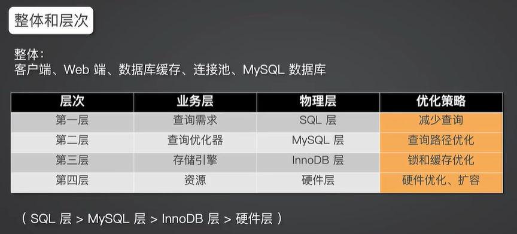

## 常用SQL语句区别

### mysql中 in 和 exists 区别

mysql中的in语句是把外表和内表作hash 连接，而exists语句是对外表作loop循环，每次loop循环再对内表进行查询。一直大家都认为exists比in语句的效率要高，这种说法其实是不准确的。这个是要区分环境的。

1. 如果查询的两个表大小相当，那么用in和exists差别不大。
2. 如果两个表中一个较小，一个是大表，则子查询表大的用exists，子查询表小的用in。
3. not in 和not exists：如果查询语句使用了not in，那么内外表都进行全表扫描，没有用到索引；而not extsts的子查询依然能用到表上的索引。所以无论那个表大，用not exists都比not in要快。

### varchar与char的区别

**char的特点**

- char表示定长字符串，长度是固定的；
- 如果插入数据的长度小于char的固定长度时，则用空格填充；
- 因为长度固定，所以存取速度要比varchar快很多，甚至能快50%，但正因为其长度固定，所以会占据多余的空间，是空间换时间的做法；
- 对于char来说，最多能存放的字符个数为255，和编码无关

**varchar的特点**

- varchar表示可变长字符串，长度是可变的；
- 插入的数据是多长，就按照多长来存储；
- varchar在存取方面与char相反，它存取慢，因为长度不固定，但正因如此，不占据多余的空间，是时间换空间的做法；
- 对于varchar来说，最多能存放的字符个数为65532

总之，结合性能角度（char更快）和节省磁盘空间角度（varchar更小），具体情况还需具体来设计数据库才是妥当的做法。

### varchar(50)中50的涵义

最多存放50个字符，varchar(50)和(200)存储hello所占空间一样，但后者在排序时会消耗更多内存，因为order by col采用fixed_length计算col长度(memory引擎也一样)。在早期 MySQL 版本中， 50 代表字节数，现在代表字符数。

### int(20) 中 20 的涵义

是指显示字符的长度。20表示最大显示宽度为20，但仍占4字节存储，存储范围不变；

不影响内部存储，只是影响带 zerofill 定义的 int 时，前面补多少个 0，易于报表展示

### mysql为什么这么设计

对大多数应用没有意义，只是规定一些工具用来显示字符的个数；int(1)和int(20)存储和计算均一样；

### mysql中int(10)和char(10)以及varchar(10)的区别

- int(10)的10表示显示的数据的长度，不是存储数据的大小；chart(10)和varchar(10)的10表示存储数据的大小，即表示存储多少个字符。

  int(10) 10位的数据长度 9999999999，占32个字节，int型4位
  char(10) 10位固定字符串，不足补空格 最多10个字符
  varchar(10) 10位可变字符串，不足补空格 最多10个字符

- char(10)表示存储定长的10个字符，不足10个就用空格补齐，占用更多的存储空间

- varchar(10)表示存储10个变长的字符，存储多少个就是多少个，空格也按一个字符存储，这一点是和char(10)的空格不同的，char(10)的空格表示占位不算一个字符

### FLOAT和DOUBLE的区别是什么？

- FLOAT类型数据可以存储至多8位十进制数，并在内存中占4字节。
- DOUBLE类型数据可以存储至多18位十进制数，并在内存中占8字节。

### drop、delete与truncate的区别

三者都表示删除，但是三者有一些差别：

因此，在不再需要一张表的时候，用drop；在想删除部分数据行时候，用delete；在保留表而删除所有数据的时候用truncate。

### UNION与UNION ALL的区别？

- 如果使用UNION ALL，不会合并重复的记录行
- 效率 UNION 高于 UNION ALL

### 为什么要尽量设定一个主键？	

​		主键是数据库确保数据行在整张表唯一性的保障，即使业务上本张表没有主键，也建议添加一个自增长的ID列作为主键。设定了主键之后，在后续的删改查的时候可能更加快速以及确保操作数据范围安全。

### 字段为什么要求定义为not null？

+ null值会占用更多的字节，且会在程序中造成很多与预期不符的情况。
+ 在程序中可以减少空值的判断
+ 避免不完整的数据，如比用户信息中的用户名、密码之类的字段

### 如果要存储用户的密码散列，应该使用什么字段进行存储？

​		密码散列，盐，用户身份证号等固定长度的字符串应该使用char而不是varchar来存储，这样可以节省空间且提高检索效率。

### 优化查询过程中的数据访问

- 访问数据太多导致查询性能下降
- 确定应用程序是否在检索大量超过需要的数据，可能是太多行或列
- 确认MySQL服务器是否在分析大量不必要的数据行
- 避免犯如下SQL语句错误
- 查询不需要的数据。解决办法：使用limit解决
- 多表关联返回全部列。解决办法：指定列名
- 总是返回全部列。解决办法：避免使用SELECT *
- 重复查询相同的数据。解决办法：可以缓存数据，下次直接读取缓存
- 是否在扫描额外的记录。解决办法：
- 使用explain进行分析，如果发现查询需要扫描大量的数据，但只返回少数的行，可以通过如下技巧去优化：
- 使用索引覆盖扫描，把所有的列都放到索引中，这样存储引擎不需要回表获取对应行就可以返回结果。
- 改变数据库和表的结构，修改数据表范式
- 重写SQL语句，让优化器可以以更优的方式执行查询。

### 优化长难的查询语句

- 一个复杂查询还是多个简单查询
- MySQL内部每秒能扫描内存中上百万行数据，相比之下，响应数据给客户端就要慢得多
- 使用尽可能小的查询是好的，但是有时将一个大的查询分解为多个小的查询是很有必要的。
- 切分查询
- 将一个大的查询分为多个小的相同的查询
- 一次性删除1000万的数据要比一次删除1万，暂停一会的方案更加损耗服务器开销。
- 分解关联查询，让缓存的效率更高。
- 执行单个查询可以减少锁的竞争。
- 在应用层做关联更容易对数据库进行拆分。
- 查询效率会有大幅提升。
- 较少冗余记录的查询。

### 优化特定类型的查询语句

- count(*)会忽略所有的列，直接统计所有列数，不要使用count(列名)
- MyISAM中，没有任何where条件的count(*)非常快。
- 当有where条件时，MyISAM的count统计不一定比其它引擎快。
- 可以使用explain查询近似值，用近似值替代count(*)
- 增加汇总表
- 使用缓存

### 优化关联查询

- 确定ON或者USING子句中是否有索引。
- 确保GROUP BY和ORDER BY只有一个表中的列，这样MySQL才有可能使用索引。

### 优化子查询

- 用关联查询替代
- 优化GROUP BY和DISTINCT
- 这两种查询据可以使用索引来优化，是最有效的优化方法
- 关联查询中，使用标识列分组的效率更高
- 如果不需要ORDER BY，进行GROUP BY时加ORDER BY NULL，MySQL不会再进行文件排序。
- WITH ROLLUP超级聚合，可以挪到应用程序处理

### 优化LIMIT分页

- LIMIT偏移量大的时候，查询效率较低
- 可以记录上次查询的最大ID，下次查询时直接根据该ID来查询

### 优化UNION查询

- UNION ALL的效率高于UNION

### 优化WHERE子句

解题方法

对于此类考题，先说明如何定位低效SQL语句，然后根据SQL语句可能低效的原因做排查，先从索引着手，如果索引没有问题，考虑以上几个方面，数据访问的问题，长难查询句的问题还是一些特定类型优化的问题，逐一回答。

SQL语句优化的一些方法？

- 1.对查询进行优化，应尽量避免全表扫描，首先应考虑在 where 及 order by 涉及的列上建立索引。
- 2.应尽量避免在 where 子句中对字段进行 null 值判断，否则将导致引擎放弃使用索引而进行全表扫描，如：

- 3.应尽量避免在 where 子句中使用!=或<>操作符，否则引擎将放弃使用索引而进行全表扫描。
- 4.应尽量避免在 where 子句中使用or 来连接条件，否则将导致引擎放弃使用索引而进行全表扫描，如：

- 5.in 和 not in 也要慎用，否则会导致全表扫描，如：

- 6.下面的查询也将导致全表扫描：select id from t where name like ‘%李%’若要提高效率，可以考虑全文检索。
- 7.如果在 where 子句中使用参数，也会导致全表扫描。因为SQL只有在运行时才会解析局部变量，但优化程序不能将访问计划的选择推迟到运行时；它必须在编译时进行选择。然 而，如果在编译时建立访问计划，变量的值还是未知的，因而无法作为索引选择的输入项

- 8.应尽量避免在 where 子句中对字段进行表达式操作，这将导致引擎放弃使用索引而进行全表扫描。如：

- 9.应尽量避免在where子句中对字段进行函数操作，这将导致引擎放弃使用索引而进行全表扫描。如：

- 10.不要在 where 子句中的“=”左边进行函数、算术运算或其他表达式运算，否则系统将可能无法正确使用索引。

## Sql优化方法论

### 层次介绍

+ 尽量从上层做优化
+ 减少查询：减少不必要的查询
+ 查询路径优化
+ 锁和缓存的优化：避免大事务
+ 硬件优化：参数调优

### 1. 数据库响应慢、负载突然增加如何解决？

+ 并非第一时间增加资源
+ 使用缓存
+ 减少不必要的Sql查询
+ 优化Sql语句

### 2. 查询优化

+ 关联查询：小表驱动大表
+ 减少表的关联查询

