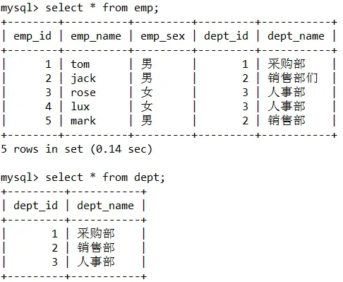

# Sql查询

## 基本用法

### 其他资料

+ [知乎：如何学习Sql](https://www.zhihu.com/question/19552975/answer/2594604218)

### 查询的基本原理

1. 单表查询：根据WHERE条件过滤表中的记录，形成中间表（这个中间表对用户是不可见的）；然后根据SELECT的选择列选择相应的列进行返回最终结果。
2. 两表连接查询：对两表求积（笛卡尔积）并用ON条件和连接连接类型进行过滤形成中间表；然后根据WHERE条件过滤中间表的记录，并根据SELECT指定的列返回查询结果。
3. 多表连接查询：先对第一个和第二个表按照两表连接做查询，然后用查询结果和第三个表做连接查询，以此类推，直到所有的表都连接上为止，最终形成一个中间的结果表，然后根据WHERE条件过滤中间表的记录，并根据SELECT指定的列返回查询结果。
   理解SQL查询的过程是进行SQL优化的理论依据。

### Sql 指令的执行顺序

1. FROM：对 FROM 子句中的前两个表执行笛卡尔积（Cartesian product)(交叉联接），生成虚拟表VT1
2. ON：对VT1应用ON筛选器。只有那些使<join_condition>为真的行才被插入VT2。
3. OUTER(JOIN)：如 果指定了OUTER JOIN（相对于CROSS JOIN 或(INNER JOIN),保留表（preserved table：左外部联接把左表标记为保留表，右外部联接把右表标记为保留表，完全外部联接把两个表都标记为保留表）中未找到匹配的行将作为外部行添加到 VT2,生成VT3.如果FROM子句包含两个以上的表，则对上一个联接生成的结果表和下一个表重复执行步骤1到步骤3，直到处理完所有的表为止。
4. WHERE：对VT3应用WHERE筛选器。只有使<where_condition>为true的行才被插入VT4.
5. GROUP BY：按GROUP BY子句中的列列表对VT4中的行分组，生成VT5.
6. CUBE|ROLLUP：把超组(Suppergroups)插入VT5,生成VT6.
7. HAVING：对VT6应用HAVING筛选器。只有使<having_condition>为 true 的组才会被插入VT7.
8. SELECT：处理SELECT列表，产生VT8.
9. DISTINCT：将重复的行从VT8中移除，产生VT9.
10. ORDER BY：将VT9中的行按RDER BY 子句中的列列表排序，生成游标（VC10).
11. TOP：从VC10的开始处选择指定数量或比例的行，生成表VT11,并返回调用者。

注：步骤10，按ORDER BY子句中的列列表排序上步返回的行，返回游标VC10.这一步是第一步也是唯一 一步可以使用SELECT列表中的列别名的步骤。这一步不同于其它步骤的 是，它不返回有效的表，而是返回一个游标。SQL是基于集合理论的。集合不会预先对它的行排序，它只是成员的逻辑集合，成员的顺序无关紧要。对表进行排序 的查询可以返回一个对象，包含按特定物理顺序组织的行。ANSI把这种对象称为游标。理解这一步是正确理解SQL的基础。

所以要记住，不要为表中的行假设任何特定的顺序。换句话说，除非你确定要有序行，否则不要指定 ORDER BY 子句。排序是需要成本的，SQL Server需要执行有序索引扫描或使用排序运行符。

## 常用Sql语句

### Select

~~~Sql
SELECT
    column_name,
    column_name
FROM
    table_name;

SELECT
    *
FROM
    table_name;

# DISTINCT 关键词用于返回唯一不同的值。
SELECT
    DISTINCT column_name,
    column_name
FROM
    table_name;

# WHERE 子句用于提取那些满足指定条件的记录。
SELECT
    column_name,
    column_name
FROM
    table_name
WHERE
    column_name operator value;

# AND & OR 运算符用于基于一个以上的条件对记录进行过滤。
SELECT
    *
FROM
    Websites
WHERE
    country = 'CN'
    AND alexa > 50;
    
SELECT
    *
FROM
    Websites
WHERE
    country = 'USA'
    OR country = 'CN';
    
# 结合 and 和 or
SELECT
    *
FROM
    Websites
WHERE
    alexa > 15
    AND (
        country = 'CN'
        OR country = 'USA'
    );

# 选取数据库中的部分数据
SELECT
    *
FROM
    Websites
LIMIT
    2;
    
    
SELECT
    TOP 50 PERCENT *
FROM
    Websites;

# 进行排序
SELECT
    column_name,
    column_name
FROM
    table_name
ORDER BY
    column_name,
    column_name ASC | DESC;
~~~

### INSERT INTO

~~~Sql
# 插入新的数据
INSERT INTO
    table_name (column1, column2, column3,...)
VALUES
    (value1, value2, value3,...);

# 复制 "apps" 中的数据插入到 "Websites" 中：
INSERT INTO
    Websites (name, country)
SELECT
    app_name,
    country
FROM
    apps;
~~~

### Update

~~~sql
# 更新数据库
UPDATE
    Websites
SET
    alexa = '5000',
    country = 'USA'
WHERE
    name = '菜鸟教程';
~~~

### Delete

~~~Sql
# 删除相关信息
DELETE FROM
    table_name
WHERE
    some_column = some_value;
~~~

### 通配符

~~~SQL
# url 以字母 "https" 开始的所有网站：
SELECT
    *
FROM
    Websites
WHERE
    url LIKE 'https%';

# 选取 name 以一个任意字符开始，然后是 "oogle" 的所有客户：
SELECT
    *
FROM
    Websites
WHERE
    name LIKE '_oogle';

~~~

### In

~~~Sql
# IN 操作符允许您在 WHERE 子句中规定多个值。
SELECT
    column_name(s)
FROM
    table_name
WHERE
    column_name IN (value1, value2,...);

SELECT
    *
FROM
    Websites
WHERE
    NAME IN ('Google', '菜鸟教程');
~~~

### BETWEEN 

~~~SQl
# 取介于两个值之间的数据范围内的值。这些值可以是数值、文本或者日期。
SELECT
    column_name(s)
FROM
    table_name
WHERE
    column_name BETWEEN value1
    AND value2;
    
SELECT
    *
FROM
    Websites
WHERE
    alexa BETWEEN 1
    AND 20;

# not Between
SELECT
    *
FROM
    Websites
WHERE
    alexa NOT BETWEEN 1
    AND 20;
    

# IN 的 BETWEEN  alexa 介于 1 和 20 之间但 country 不为 USA 和 IND 的所有网站：
SELECT
    *
FROM
    Websites
WHERE
    (
        alexa BETWEEN 1
        AND 20
    )
    AND country NOT IN ('USA', 'IND');

~~~

### 别名

~~~Sql
# 可以为表名称或列名称指定别名
SELECT
    column_name AS alias_name
FROM
    table_name;
~~~

### Join

~~~sql
# 左连接
SELECT
    Websites.name,
    access_log.count,
    access_log.date
FROM
    Websites
    LEFT JOIN access_log ON Websites.id = access_log.site_id
ORDER BY
    access_log.count DESC;
~~~

### union

~~~sql
# UNION 操作符用于合并两个或多个 SELECT 语句的结果集。
# 请注意，UNION 内部的每个 SELECT 语句必须拥有相同数量的列。列也必须拥有相似的数据类型
SELECT
    country
FROM
    Websites
UNION
ALL
SELECT
    country
FROM
    apps
ORDER BY
    country;
~~~

### CREATE 

~~~SQl
CREATE TABLE Persons
(
	PersonID int,
	LastName varchar(255),
	FirstName varchar(255),
	Address varchar(255),
	City varchar(255)
);
~~~

~~~Sql
CREATE TABLE `t_order` (
  `id` char(19) NOT NULL DEFAULT ''COMMENT '订单号',
  `order_detail_id` char(19) DEFAULT NULL COMMENT '订单详细Id',
  `member_id` varchar(19) NOT NULL DEFAULT '' COMMENT '会员id',
  `nickname` varchar(50) DEFAULT NULL COMMENT '会员昵称',
  `mobile` varchar(11) DEFAULT NULL COMMENT '会员手机',
  `total_fee` decimal(10,2) DEFAULT '0.01' COMMENT '订单金额（分）',
  `pay_type` tinyint(3) DEFAULT NULL COMMENT '支付类型（1：微信 2：支付宝）',
  `status` tinyint(3) DEFAULT NULL COMMENT '订单状态（0：未支付 1：已支付 2: 超时取消）',
  `is_deleted` tinyint(1) unsigned NOT NULL DEFAULT '0' COMMENT '逻辑删除 1（true）已删除， 0（false）未删除',
  `gmt_create` datetime NOT NULL COMMENT '创建时间',
  `gmt_modified` datetime NOT NULL COMMENT '更新时间',
  PRIMARY KEY (`id`),
  KEY `idx_order_detail_id` (`order_detail_id`),
  KEY `idx_member_id` (`member_id`)
) ENGINE=InnoDB DEFAULT CHARSET=utf8mb4 COMMENT='订单表';
~~~

### 约束

~~~SQl
在 SQL 中，我们有如下约束：
NOT NULL - 指示某列不能存储 NULL 值。
UNIQUE - 保证某列的每行必须有唯一的值。
PRIMARY KEY - NOT NULL 和 UNIQUE 的结合。确保某列（或两个列多个列的结合）有唯一标识，有助于更容易更快速地找到表中的一个特定的记录。
FOREIGN KEY - 保证一个表中的数据匹配另一个表中的值的参照完整性。
CHECK - 保证列中的值符合指定的条件。
DEFAULT - 规定没有给列赋值时的默认值。
~~~

### Drop

~~~sql
# 删除某个索引
ALTER TABLE
    table_name DROP INDEX index_name

# 删除表
DROP TABLE table_name

# 删除数据库
DROP DATABASE database_name
~~~

### ALTER 

~~~sql
# 在表中添加列
ALTER TABLE
    table_name
ADD
    column_name datatype
    
# 删除表中的列（某些数据库不允许该操作）
ALTER TABLE
    table_name DROP COLUMN column_name
    
# 改变表中列的数据类型
ALTER TABLE
    table_name
MODIFY
    COLUMN column_name datatype
~~~

### AUTO INCREMENT

~~~sql
# 定义自增
CREATE TABLE Persons
(
	ID int NOT NULL AUTO_INCREMENT,
	LastName varchar(255) NOT NULL,
	FirstName varchar(255),
	Address varchar(255),
	City varchar(255),
	PRIMARY KEY (ID)
)

# 修改每次自增100
ALTER TABLE
    Persons AUTO_INCREMENT = 100
~~~

## 函数

### AVG() 

~~~sql
# 求取平均值
SELECT AVG(column_name) FROM table_name

# avg应用 —— 选择访问量高于平均访问量的 "site_id" 和 "count"：
SELECT
    *
FROM
    websites
WHERE
    alexa > (
        SELECT
            AVG(alexa)
        FROM
            websites
    );
~~~

### COUNT()

~~~sql
# 返回指定列的值的数目（NULL 不计入）
SELECT COUNT(column_name) FROM table_name;

# count 应用
SELECT
    COUNT(count) AS nums
FROM
    access_log
WHERE
    site_id = 3;
~~~

### FIRST() / LAST() 

（只有 MS Access 支持 FIRST() 函数。）

~~~sql
# 返回指定的列中第一个记录的值。
SELECT column_name FROM table_name ORDER BY column_name ASC LIMIT 1;

# 应用
SELECT
    name AS FirstSite
FROM
    Websites
LIMIT
    1;
~~~

### MAX() 

~~~sql
# 选取在最大值
SELECT
    MAX(alexa) AS max_alexa
FROM
    websites;
~~~

### MIN() 

~~~sql
# 选取最小值
SELECT
    MIN(alexa) AS min_alexa
FROM
    websites;
~~~

### SUM()

~~~sql
# 去取总和
SELECT
    SUM(alexa) AS nums
FROM
    websites;
~~~

### GROUP BY

​		用于结合聚合函数，根据一个或多个列对结果集进行分组。

~~~sql
 # 统计 access_log 各个 site_id 的访问量：
SELECT NAME, SUM(url)  FROM  websites GROUP  BY  NAME


# 多表连接
SELECT
    Websites.name,
    COUNT(access_log.aid) AS nums
FROM
    access_log
    LEFT JOIN Websites ON access_log.site_id = Websites.id
GROUP BY
    Websites.name;
~~~

### HAVING

增加 HAVING 子句原因是，WHERE 关键字无法与聚合函数一起使用。HAVING 子句可以让我们筛选分组后的各组数据。

~~~SQl
# 想要查找总访问量大于 200 的网站
SELECT
    Websites.name,
    Websites.url,
    SUM(access_log.count) AS nums
FROM
    (
        access_log
        INNER JOIN Websites ON access_log.site_id = Websites.id
    )
GROUP BY
    Websites.name
HAVING
    SUM(access_log.count) > 200;
~~~

### UCASE()

把字段的值转换为大写

### LCASE()

 函数把字段的值转换为小写。

### MID() 

MID() 函数用于从文本字段中提取字符。

~~~sql
# 从 "Websites" 表的 "name" 列中提取前 4 个字符：
SELECT
    MID(column_name, start [,length])
FROM
    table_name;
    
    
SELECT
    MID(name, 1, 4) AS ShortTitle
FROM
    Websites;
~~~

### LEN() 函数

LEN() 函数返回文本字段中值的长度。

~~~sql
SELECT LEN(column_name) FROM table_name;

SELECT
    name,
    LENGTH(url) as LengthOfURL
FROM
    Websites;
~~~

### 日期函数

#### NOW()

返回当前系统的日期和时间。

~~~sql
SELECT
    name,
    url,
    Now() AS date
FROM
    Websites;
~~~

#### CURDATE()

~~~sql
select CURDATE()
~~~

#### CURTIME()

~~~sql
select CURTIME()
~~~

#### EXTRACT

抽取年份

~~~sql
SELECT
    EXTRACT(
        YEAR
        FROM
            OrderDate
    ) AS OrderYear,
    EXTRACT(
        MONTH
        FROM
            OrderDate
    ) AS OrderMonth,
    EXTRACT(
        DAY
        FROM
            OrderDate
    ) AS OrderDay
FROM
    Orders
WHERE
    OrderId = 1
~~~

#### DATE_ADD() 

追加45天

~~~sql
SELECT 
	OrderId,
	DATE_ADD(OrderDate,INTERVAL 45 DAY) AS OrderPayDate
FROM Orders
~~~

#### DATE_SUB();

~~~sql
SELECT 
	OrderId,
	DATE_SUB(OrderDate,INTERVAL 5 DAY) AS SubtractDate
FROM Orders
~~~

#### DATEDIFF()

~~~sql
SELECT DATEDIFF('2008-11-30','2008-11-29') AS DiffDate
~~~

#### DATE_FORMAT()

~~~sql
DATE_FORMAT(NOW(),'%b %d %Y %h:%i %p')
DATE_FORMAT(NOW(),'%m-%d-%Y')
DATE_FORMAT(NOW(),'%d %b %y')
DATE_FORMAT(NOW(),'%d %b %Y %T:%f')

-- 结果
Nov 04 2008 11:45 PM
11-04-2008
04 Nov 08
04 Nov 2008 11:45:34:243

%a	缩写星期名
%b	缩写月名
%d	月的天，数值（00-31）
%Y	年，4 位
%H	小时（00-23
%p	AM 或 PM
%m	月，数值（00-12）
%f	微秒
%T	时间, 24-小时（hh:mm:ss）
~~~


### FORMAT()

函数用于对字段的显示进行格式化。

~~~sql
SELECT
    FORMAT(column_name, format)
FROM
    table_name;

# 从 "Websites" 表中选取 name, url 以及格式化为 YYYY-MM-DD 的日期：
SELECT
    name,
    url,
    DATE_FORMAT(Now(), '%Y-%m-%d') AS date
FROM
    Websites;
~~~

### Round()

~~~sql
DROP TABLE IF EXISTS `Products`;

CREATE TABLE IF NOT EXISTS `Products` (
    `prod_id` VARCHAR(255) NOT NULL COMMENT '产品 ID',
    `prod_price` DOUBLE NOT NULL COMMENT '产品价格'
);

INSERT INTO
    `Products`
VALUES
    ('a0011', 9.49),
    ('a0019', 600),
    ('b0019', 1000);
    
    
-- 保留几位小数
select
    prod_id,
    prod_price,
    round(prod_price * 0.911, 10) as sale_price
from
    Products;
~~~


### CONVERT

**排序**

~~~sql
SELECT
    *
from
    teacher t
order by
    CONVERT(tname USING utf8mb4) desc;
-- 可以转化字符类型排序，中文排序可以使用GBK
~~~


### 窗口函数

目前mysql从8.0开始支持窗口函数，使用窗口函数，会令我们的分组查询变得便捷。

窗口函数：对一个查询SQL，将其结果集按指定的规则进行分区，每个分区可以看作是一个窗口，分区内的每一行，根据其所属分区内的行数据进行函数计算，获取计算结果，作为该行的窗口函数结果值。


## 高级

### 递归

~~~ sql
CREATE TABLE `t_elsign_document` (
  `fid` varchar(32) CHARACTER SET utf8mb4 COLLATE utf8mb4_0900_ai_ci NOT NULL COMMENT '主键',
  `ffile_id` varchar(100) CHARACTER SET utf8mb4 COLLATE utf8mb4_0900_ai_ci NOT NULL COMMENT '附件id',
  `fcontranct_name` varchar(200) CHARACTER SET utf8mb4 COLLATE utf8mb4_0900_ai_ci DEFAULT NULL COMMENT '合同名称',
  `fstatus` varchar(50) CHARACTER SET utf8mb4 COLLATE utf8mb4_0900_ai_ci DEFAULT NULL COMMENT '状态 签署状态；DRAFT（草稿），FILLING（填参中），WAITING（等待签署）SIGNING（签署中），COMPLETE（已完成），TERMINATING（作废中），TERMINATED（作废完成）',
  `fdocument_id` bigint DEFAULT NULL COMMENT '文档id',
  `fsource_id` varchar(32) CHARACTER SET utf8mb4 COLLATE utf8mb4_0900_ai_ci DEFAULT NULL COMMENT '关联业务主键',
  `fcontranct_id` bigint DEFAULT NULL COMMENT '合同id',
  `fsign_type` tinyint DEFAULT NULL COMMENT '用印方式：1 线上 2 线下',
  `ffilenum` int DEFAULT NULL COMMENT '线下用印份数',
  `fcreate_time` datetime DEFAULT NULL COMMENT '创建时间',
  `fupdate_time` datetime DEFAULT NULL COMMENT '修改时间',
  `fcreate_user` int DEFAULT NULL COMMENT '创建人',
  `fupdate_user` int DEFAULT NULL COMMENT '最近修改人',
  `fdel` tinyint(1) DEFAULT NULL COMMENT '删除 1 是 0 否',
  `fis_Appended` tinyint NOT NULL DEFAULT '0' COMMENT '是否被追加补盖的文件',
  `ffrom_fileId` varchar(32) CHARACTER SET utf8mb4 COLLATE utf8mb4_0900_ai_ci DEFAULT NULL COMMENT '被此文件补盖的文件',
  `fsigned_file_id` varchar(32) CHARACTER SET utf8mb4 COLLATE utf8mb4_0900_ai_ci DEFAULT NULL COMMENT '签署完成后下载的文件',
  `frequire_position` tinyint(1) DEFAULT '0' COMMENT '是否需要手动指定位置',
  PRIMARY KEY (`fid`) USING BTREE,
  KEY `idx_el_doc_file_id` (`ffile_id`) USING BTREE,
  KEY `idx_el_doc_source_id` (`fsource_id`) USING BTREE
) ENGINE=InnoDB DEFAULT CHARSET=utf8mb4 COLLATE=utf8mb4_0900_ai_ci ROW_FORMAT=DYNAMIC;
~~~

~~~sql
INSERT INTO plm_base_admin.t_elsign_document
(fid, ffile_id, fcontranct_name, fstatus, fdocument_id, fsource_id, fcontranct_id, fsign_type, ffilenum, fcreate_time, fupdate_time, fcreate_user, fupdate_user, fdel, fis_Appended, ffrom_fileId, fsigned_file_id, frequire_position)
VALUES('20221219143644000001', '12191436330909514946', NULL, 'DRAFT', NULL, NULL, NULL, 2, NULL, '2022-12-19 14:36:45', NULL, 134, NULL, 0, 0, NULL, NULL, 0);
INSERT INTO plm_base_admin.t_elsign_document
(fid, ffile_id, fcontranct_name, fstatus, fdocument_id, fsource_id, fcontranct_id, fsign_type, ffilenum, fcreate_time, fupdate_time, fcreate_user, fupdate_user, fdel, fis_Appended, ffrom_fileId, fsigned_file_id, frequire_position)
VALUES('20221219150728000001', '12191507245611366417', '说明3', 'COMPLETE', 3042353692238783217, NULL, 3042353692444304115, 1, NULL, '2022-12-19 15:07:28', '2022-12-19 15:07:58', 172, 172, 0, 0, NULL, '12191507580251399881', 0);
INSERT INTO plm_base_admin.t_elsign_document
(fid, ffile_id, fcontranct_name, fstatus, fdocument_id, fsource_id, fcontranct_id, fsign_type, ffilenum, fcreate_time, fupdate_time, fcreate_user, fupdate_user, fdel, fis_Appended, ffrom_fileId, fsigned_file_id, frequire_position)
VALUES('20221219150926000001', '12191507580251399881', '说明3', 'COMPLETE', 3042354189054092224, '12191507245611366417', 3042354189179921346, 1, NULL, '2022-12-19 15:09:26', '2022-12-19 15:09:48', 172, NULL, 0, 1, '12191507245611366417', '12191509476031509459', 1);
INSERT INTO plm_base_admin.t_elsign_document
(fid, ffile_id, fcontranct_name, fstatus, fdocument_id, fsource_id, fcontranct_id, fsign_type, ffilenum, fcreate_time, fupdate_time, fcreate_user, fupdate_user, fdel, fis_Appended, ffrom_fileId, fsigned_file_id, frequire_position)
VALUES('20221219151731000001', '12191516149241896780', 'test1', 'COMPLETE', 3042356316514132705, NULL, 3042356316618990307, 1, NULL, '2022-12-19 15:17:54', '2022-12-19 16:06:49', 136, 136, 0, 0, NULL, '12191606486184930474', 0);
INSERT INTO plm_base_admin.t_elsign_document
(fid, ffile_id, fcontranct_name, fstatus, fdocument_id, fsource_id, fcontranct_id, fsign_type, ffilenum, fcreate_time, fupdate_time, fcreate_user, fupdate_user, fdel, fis_Appended, ffrom_fileId, fsigned_file_id, frequire_position)
VALUES('20221219153944000001', '12191515053781827234', NULL, 'DRAFT', NULL, NULL, NULL, 2, NULL, '2022-12-19 15:39:44', NULL, 134, NULL, 0, 0, NULL, NULL, 0);
INSERT INTO plm_base_admin.t_elsign_document
(fid, ffile_id, fcontranct_name, fstatus, fdocument_id, fsource_id, fcontranct_id, fsign_type, ffilenum, fcreate_time, fupdate_time, fcreate_user, fupdate_user, fdel, fis_Appended, ffrom_fileId, fsigned_file_id, frequire_position)
VALUES('20221219154620000001', '12191546169963698852', NULL, 'DRAFT', NULL, NULL, NULL, 2, NULL, '2022-12-19 15:46:21', NULL, 134, NULL, 0, 0, NULL, NULL, 0);
INSERT INTO plm_base_admin.t_elsign_document
(fid, ffile_id, fcontranct_name, fstatus, fdocument_id, fsource_id, fcontranct_id, fsign_type, ffilenum, fcreate_time, fupdate_time, fcreate_user, fupdate_user, fdel, fis_Appended, ffrom_fileId, fsigned_file_id, frequire_position)
VALUES('20221219154629000001', '12191546095853691441', NULL, 'DRAFT', NULL, NULL, NULL, 2, NULL, '2022-12-19 15:46:30', NULL, 134, NULL, 0, 0, NULL, NULL, 0);
INSERT INTO plm_base_admin.t_elsign_document
(fid, ffile_id, fcontranct_name, fstatus, fdocument_id, fsource_id, fcontranct_id, fsign_type, ffilenum, fcreate_time, fupdate_time, fcreate_user, fupdate_user, fdel, fis_Appended, ffrom_fileId, fsigned_file_id, frequire_position)
VALUES('20221219154825000001', '12191548166383818494', NULL, 'DRAFT', NULL, NULL, NULL, 2, NULL, '2022-12-19 15:48:25', NULL, 134, NULL, 0, 0, NULL, NULL, 0);
INSERT INTO plm_base_admin.t_elsign_document
(fid, ffile_id, fcontranct_name, fstatus, fdocument_id, fsource_id, fcontranct_id, fsign_type, ffilenum, fcreate_time, fupdate_time, fcreate_user, fupdate_user, fdel, fis_Appended, ffrom_fileId, fsigned_file_id, frequire_position)
VALUES('20221219160857000001', '12191606486184930474', 'test1', 'COMPLETE', 3042369165659579313, '12191516149241896780', 3042369165802185651, 1, NULL, '2022-12-19 16:08:57', '2022-12-19 16:09:23', 172, NULL, 0, 1, '12191516149241896780', '12191609229905084846', 1);
INSERT INTO plm_base_admin.t_elsign_document
(fid, ffile_id, fcontranct_name, fstatus, fdocument_id, fsource_id, fcontranct_id, fsign_type, ffilenum, fcreate_time, fupdate_time, fcreate_user, fupdate_user, fdel, fis_Appended, ffrom_fileId, fsigned_file_id, frequire_position)
VALUES('20221219162124000001', '12191621083925790248', NULL, 'DRAFT', NULL, NULL, NULL, 2, NULL, '2022-12-19 16:21:24', NULL, 134, NULL, 0, 0, NULL, NULL, 0);
INSERT INTO plm_base_admin.t_elsign_document
(fid, ffile_id, fcontranct_name, fstatus, fdocument_id, fsource_id, fcontranct_id, fsign_type, ffilenum, fcreate_time, fupdate_time, fcreate_user, fupdate_user, fdel, fis_Appended, ffrom_fileId, fsigned_file_id, frequire_position)
VALUES('20221219162227000001', '12191621536835835539', NULL, 'DRAFT', NULL, NULL, NULL, 2, NULL, '2022-12-19 16:22:27', NULL, 136, NULL, 0, 0, NULL, '12191639031586865014', 0);
~~~

查询

~~~sql
select 
	t2.*
from (
	select 
		@fsigned_file_id as _fsigned_file_id,	
		(
			select @fsigned_file_id := ffile_id from t_elsign_document where fsigned_file_id = _fsigned_file_id
		) as _ffile_id,
		@beforeFile := (
			select ffile_id from t_elsign_document where fsigned_file_id = _fsigned_file_id
		)as file_flag,
		@l := @l+1 as lvl
	from 
		(
			select  @fsigned_file_id :=fsigned_file_id, @l :=0, @beforeFile := fsigned_file_id
			from t_elsign_document 
			where fsigned_file_id = '1110133059195948347'
		) vars,
		t_elsign_document
	where 
		@beforeFile is not null
	) t4,
	t_elsign_document t2
where 
	t2.ffile_id = t4._ffile_id
order by 
	t2.fupdate_time
asc

~~~


### 自定义排序字段

之前


~~~sql
SELECT
    *
from
    order_diy
ORDER BY
    FIELD(
        title,
        '九阴真经',
        '降龙十八掌',
        '九阴白骨爪',
        '双手互博',
        '桃花岛主',
        '全真内功心法',
        '蛤蟆功',
        '销魂掌',
        '灵白山少主'
    );
~~~


### Case 表达式

~~~sql
SELECT
    *,
    case
        when money > 60 then '高级'
        when money > 30 then '中级'
        else '低级'
    END level
from
    order_diy;
~~~


### exist

它的作用是**根据主查询的数据，每一行都放到子查询中做条件验证，根据验证结果（TRUE 或者 FALSE），TRUE的话该行数据就会保留**，下面用 emp 表和 dept 表进行举例，表结构以及数据展示

之前



假如我们现在想找到 emp 表中 dept_name 与 dept表中 dept_name 对应不上的员工数据，也就是 emp 表第二行记录，sql 如下：

~~~sql
SELECT *
from emp e
where exists (
        SELECT  *
        from dept p
        where e.dept_id = p.dept_id
            and e.dept_name != p.dept_name
    )
~~~


### GROUP_CONCAT

~~~sql
SELECT
    name,
    GROUP_CONCAT(
        title
        ORDER BY id desc 
        SEPARATOR '-'
    )
from order_diy
GROUP BY name
ORDER BY NULL;
~~~


### 自连接查询

自连接查询是 sql 语法里常用的一种写法，掌握了自连接的用法我们可以在 sql 层面轻松解决很多问题。这里用 tree 表举例，结构以及表数据展示：


tree 表中通过 pid 字段与 id 字段进行父子关联，假如现在有一个需求，我们想按照父子层级将 tree 表数据转换成 `一级职位 二级职位 三级职位` 三个列名进行展示，sql 如下：

~~~sql
SELECT
    t1.job_name '一级职位',
    t2.job_name '二级职位',
    t3.job_name '三级职位'
from
    tree t1
join tree t2 on t1.id = t2.pid
left join tree t3 on t2.id = t3.pid
where
    t1.pid = 0;
~~~


### 动态更新

这里继续使用上文提到的 emp 表和 dept 表，数据如下：


可以看到上述 emp 表中 jack 的部门名称与 dept 表实际不符合，现在我们想将 jack 的部门名称更新成 dept 表的正确数据，sql 如下：

```sql
update
    emp,
    dept
set
    emp.dept_name = dept.dept_name
where
    emp.dept_id = dept.dept_id;
```


### ORDER BY 空值 NULL 排序

ORDER BY 字句中可以跟我们要排序的字段名称，但是当字段中存在 null 值时，会对我们的排序结果造成影响。我们可以通过 **ORDER BY IF(ISNULL(title), 1, 0)** 语法将 null 值转换成0或1，来达到将 null 值放到前面还是后面进行排序的效果。这里继续用 order_diy 表举例，sql 如下：

~~~sql
SELECT
    *
FROM
    order_diy
ORDER BY
    IF(ISNULL(title), 0, 1),
    money;
~~~


### with rollup 

MySql 中可以使用 with rollup 在分组统计数据的基础上再进行统计汇总，即用来得到 group by 的汇总信息。这里继续用order_diy 表举例，sql 如下：

~~~sql
SELECT
    name,
    SUM(money) as money
FROM
    order_diy
GROUP BY
    name WITH ROLLUP;
~~~


可以看到通过 **GROUP BY name WITH ROLLUP** 语句，查询结果最后一列显示了分组统计的汇总结果。但是 name 字段汇总后显示为 null，我们可以通过 `COALESCE(value,...)` 比较函数，返回第一个非空参数。

~~~sql
SELECT
    coalesce(name, '总金额') name,
    SUM(money) as money
FROM
    order_diy
GROUP BY
    name WITH ROLLUP;
~~~


### with as

with as 语法需要 MySql 8.0以上版本，它的作用主要是提取子查询，方便后续共用，更多情况下会用在数据分析的场景上。

如果一整句查询中**多个子查询都需要使用同一个子查询**的结果，那么就可以用with as，将共用的子查询提取出来，加个别名。后面查询语句可以直接用，对于大量复杂的SQL语句起到了很好的优化作用。这里继续用 order_diy 表举例，这里使用with as给出sql 如下：

~~~sql
with t1 as (
    SELECT
        *
    from
        order_diy
    where
        money > 30
),
t2 as (
    SELECT
        *
    from
        order_diy
    where
        money > 60
)
SELECT
    *
from
    t1
where
    t1.id not in (
        SELECT
            id
        from
            t2
    )
    and t1.name = '周伯通';
~~~


这个 sql 查询了 order_diy 表中 money 大于30且小于等于60之间并且 name 是周伯通的记录。

### 存在就更新，不存在就插入

MySql 中通过**on duplicate key update**语法来实现存在就更新，不存在就插入的逻辑。插入或者更新时，它会根据表中主键索引或者唯一索引进行判断，如果主键索引或者唯一索引有冲突，就会执行**on duplicate key update**后面的赋值语句。 这里通过 news 表举例，表结构和说数据展示，其中 news_code 字段有唯一索引：


添加sql：

~~~sql
-- 第一次执行添加语句
INSERT INTO `news` (`news_title`, `news_auth`, `news_code`) 
VALUES ('新闻3', '小花', 'wx-0003') 
on duplicate key update news_title = '新闻3';

-- 第二次执行修改语句
INSERT INTO `news` (`news_title`, `news_auth`, `news_code`) 
VALUES ('新闻4', '小花', 'wx-0003') 
on duplicate key update news_title = '新闻4';
~~~


on duplicate key update高并发场景下游死锁的风险

### char_length

有时候我们需要获取字符的`长度`，然后根据字符的长度进行`排序`。MYSQL给我们提供了一些有用的函数，比如：`char_length`。通过该函数就能获取字符长度。获取字符长度并且排序的sql如下：

~~~sql
select
    *
from
    brand
where
    name like '%苏三%'
order by
    char_length(name) asc
limit 5;
~~~


name字段使用关键字`模糊查询`之后，再使用`char_length`函数获取name字段的字符长度，然后按长度`升序`。

### locate

有时候我们在查找某个关键字，比如：`苏三`，需要明确知道它在某个字符串中的位置时，该怎么办呢？

答：使用`locate`函数。

使用locate函数改造之后sql如下：

~~~sql
select
    *
from
    brand
where
    name like '%苏三%'
order by
    char_length(name) asc,
    locate('苏三', name) asc
limit
    5, 5;
~~~


先按长度排序，小的排在前面。如果长度相同，则按关键字从左到右进行排序，越靠左的越排在前面。

另外一种用法

~~~sql
        select
            *
        from t_demand_info tdi
        where locate('2321312', tdi.FOTHER_ITEM_PERSON ) > 0;
~~~


### replace

我们经常会有替换字符串中部分内容的需求，比如：将字符串中的字符A替换成B。

这种情况就能使用`replace`函数。

例如：

~~~sql
update
    brand
set
    name = REPLACE(name, 'A', 'B')
where
    id = 1;
~~~

这样就能轻松实现字符替换功能。

也能用该函数去掉`前后空格`：

~~~sql
update brand set name=REPLACE(name,' ','') where name like ' %';
update brand set name=REPLACE(name,' ','') where name like '% ';
~~~

使用该函数还能替换`json格式`的数据内容，真的非常有用。

### now

时间是个好东西，用它可以快速缩小数据范围，我们经常有获取当前时间的需求。

在MYSQL中获取`当前时间`，可以使用`now()`函数，例如：

~~~sql
select now() from brand limit 1;
~~~


如果你还想返回`毫秒`，可以使用`now(3)`，例如：

~~~sql
select now(3) from brand limit 1;
~~~


### insert into ... select

在工作中很多时候需要`插入数据`。传统的插入数据的sql是这样的：

```sql
INSERT INTO
    `brand`(`id`, `code`, `name`, `edit_date`)
VALUES
    (5, '108', '苏三', '2022-09-02 19:42:21');
```

它主要是用于插入少量并且已经确定的数据。但如果有大批量的数据需要插入，特别是是需要插入的数据来源于，另外一张表或者多张表的结果集中。

这种情况下，使用传统的插入数据的方式，就有点束手无策了。

这时候就能使用MYSQL提供的：`insert into ... select`语法。

例如：

```sql
INSERT INTO
    `brand`(`id`, `code`, `name`, `edit_date`)
select
    null,
    code,
    name,
    now(3)
from
    `order`
where
    code in ('004', '005');
```

这样就能将order表中的部分数据，非常轻松插入到brand表中。

### insert into ... ignore

不知道你有没有遇到过这样的场景：在插入1000个品牌之前，需要先根据name，判断一下是否存在。如果存在，则不插入数据。如果不存在，才需要插入数据。

当然很多人通过在sql语句后面拼接`not exists`语句，也能达到防止出现重复数据的目的，比如：

~~~sql
INSERT INTO
    `brand`(`id`, `code`, `name`, `edit_date`)
select
    null,
    '108',
    '苏三',
    now(3)
from
    dual
where
    not exists (
        select  *
        from `brand`
        where name = '苏三'
    );
~~~

这条sql确实能够满足要求，但是总觉得有些麻烦。那么，有没有更简单的做法呢？

~~~sql
INSERT
    ignore INTO `brand`(`id`, `code`, `name`, `edit_date`)
VALUES
    (123, '108', '苏三', now(3));
~~~

这样改造之后，如果brand表中没有name为苏三的数据，则可以直接插入成功。

但如果brand表中已经存在name为苏三的数据了，则该sql语句也能正常执行，并不会报错。

因为它会忽略异常，返回的执行结果影响行数为0，它不会重复插入数据。

### create table ... select

有时候，我们需要快速备份表。

通常情况下，可以分两步走：

1. 创建一张临时表
2. 将数据插入临时表

~~~sql
create table order_2022121819 like `order`;
insert into order_2022121819 select * from `order`;
~~~

但有没有命令，一个命令就能实现上面这两步的功能呢？

~~~sql
create table order_2022121820
select
    *
from
    `order`;
~~~

### show processlist

有些时候我们线上sql或者数据库出现了问题。比如出现了数据库连接过多问题，或者发现有一条sql语句的执行时间特别长。

这时候该怎么办呢？

答：我们可以使用`show processlist`命令查看`当前线程执行情况`。


从执行结果中，我们可以查看当前的连接状态，帮助识别出有问题的查询语句。

- id 线程id
- User 执行sql的账号
- Host 执行sql的数据库的ip和端号
- db 数据库名称
- Command 执行命令，包括：Daemon、Query、Sleep等。
- Time 执行sql所消耗的时间
- State 执行状态
- info 执行信息，里面可能包含sql信息。

如果发现了异常的sql语句，可以直接kill掉，确保数据库不会出现严重的问题。

### mysqldump

有时候我们需要导出MYSQL表中的数据。

这种情况就可以使用`mysqldump`工具，该工具会将数据查出来，转换成insert语句，写入到某个文件中，相当于`数据备份`。

我们获取到该文件，然后执行相应的insert语句，就能创建相关的表，并且写入数据了，这就相当于`数据还原`。

mysqldump命令的语法为： `mysqldump -h主机名 -P端口 -u用户名 -p密码 参数1,参数2.... > 文件名称.sql`

备份远程数据库中的数据库：

```java
mysqldump -h 192.22.25.226 -u root -p123456 dbname > backup.sql
```

### find_in_set

MySQL有提供一个字符串函数find_in_set(str1,str2)函数，用于返回str2中str1所在的位置索引，如果找到了，则返回true(1)，否则返回false(0)，其中str2必须以半角符号的逗号【,】分割开。

select * from user where find_in_set('yanggb', hobby);

匹配的字符串作为第一参数时，适用的场景是找到hobby中存在yanggb的记录(hobby为多个以逗号隔开的值)。

~~~sql
select * from user where find_in_set(hobby, 'yanggb1,yanggb2,yanggb3')
~~~

匹配的字符串作为第二参数时，适用的场景是找到hobby中有yanggb1、yanggb2和yanggb3其中一个的记录(hobby为单个值)。
