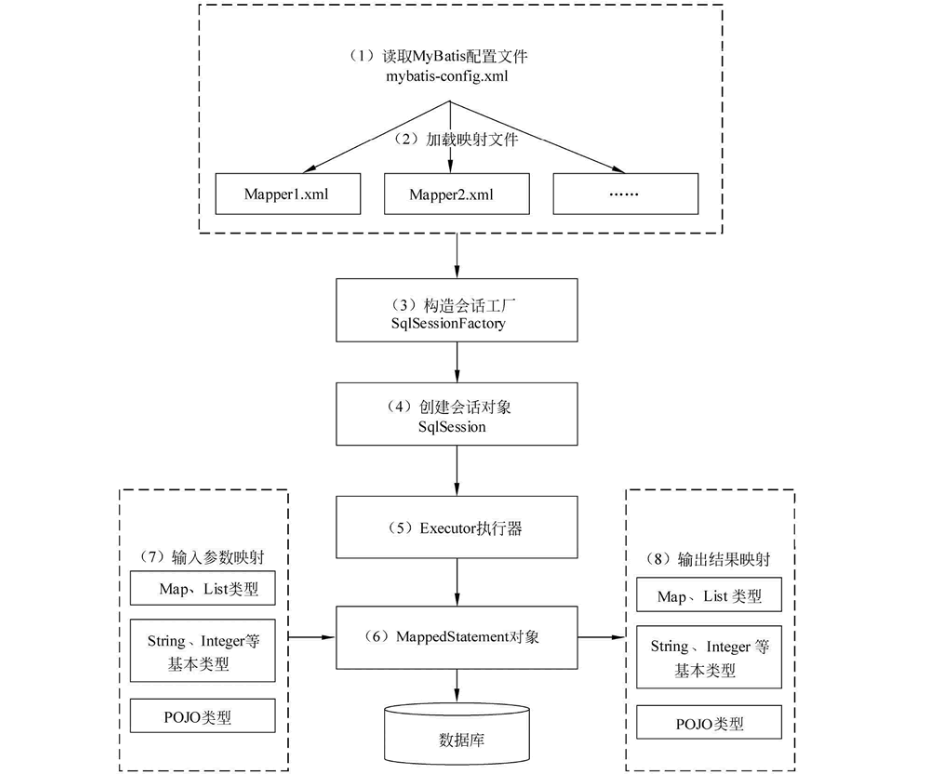

# Spring-JPA

## 概念

### JPA

全称Java Persistence [API](https://so.csdn.net/so/search?q=API&spm=1001.2101.3001.7020)，可以通过注解或者XML描述【对象-关系表】之间的映射关系，并将实体对象持久化到数据库中。JPA 的API：用来操作实体对象，执行CRUD操作，框架在后台替我们完成所有的事情，**开发者从繁琐的JDBC和SQL代码中解脱出来**。

### SpringBoot JPA

spirng data jpa是spring提供的一套简化JPA开发的框架，按照约定好的【方法命名规则】写dao层接口，就可以在不写接口实现的情况下，实现对数据库的访问和操作。同时提供了很多除了CRUD之外的功能，如分页、排序、复杂查询等等。

Spring Data JPA 可以理解为 JPA 规范的再次封装抽象，底层还是使用了 Hibernate 的 JPA 技术实现。

### JPA 优势

1. 标准化：JPA 是 JCP 组织发布的 Java EE 标准之一，因此任何声称符合 JPA 标准的框架都遵循同样的架构，提供相同的访问API，这保证了基于JPA开发的企业应用能够经过少量的修改就能够在不同的JPA框架下运行。
2. 容器级特性的支持：JPA框架中支持大数据集、事务、并发等容器级事务，这使得 JPA 超越了简单持久化框架的局限，在企业应用发挥更大的作用。
3. 简单方便：JPA的主要目标之一就是提供更加简单的编程模型：在JPA框架下创建实体和创建Java 类一样简单，没有任何的约束和限制，只需要使用 `javax.persistence.Entity`进行注释，JPA的框架和接口也都非常简单，没有太多特别的规则和设计模式的要求，开发者可以很容易的掌握。JPA基于非侵入式原则设计，因此可以很容易的和其它框架或者容器集成。
4. 查询能力：JPA的查询语言是面向对象而非面向数据库的，它以面向对象的自然语法构造查询语句，可以看成是Hibernate HQL的等价物。JPA定义了独特的JPQL（Java Persistence Query Language），JPQL是EJB QL的一种扩展，它是针对实体的一种查询语言，操作对象是实体，而不是关系数据库的表，而且能够支持批量更新和修改、JOIN、GROUP BY、HAVING 等通常只有 SQL 才能够提供的高级查询特性，甚至还能够支持子查询。
5. 高级特性：JPA 中能够支持面向对象的高级特性，如类之间的继承、多态和类之间的复杂关系，这样的支持能够让开发者最大限度的使用面向对象的模型设计企业应用，而不需要自行处理这些特性在关系数据库的持久化。


### 对比 MyBatis

1. JPA可以屏蔽底层数据库的差异，但是针对多表操作会非常的麻烦，性能方面也不好做优化，比较适合中小型项目，对性能要求不高
2. Mybatis需要自己编写Sql，数据库移植方面会比较差，通过优化Sql可以提升数据的查询能力和性能
3. 个人感觉Mybatis-Plus是JPA同Mybatis之间一个很不错的结合，既可以操作单表，又可以手写Sql，使用框架自带的单表操作方法


### 当前版本


## 使用教程

[基本使用 + 一对多](https://blog.csdn.net/qq_43692950/article/details/107443104?ops_request_misc=&request_id=&biz_id=102&utm_term=spring%20boot%20jpa%20%E5%A4%9A%E8%A1%A8&utm_medium=distribute.pc_search_result.none-task-blog-2~all~sobaiduweb~default-0-107443104.142^v52^pc_rank_34_1,201^v3^control_2&spm=1018.2226.3001.4187)

[基本使用 + 条件查询](https://blog.csdn.net/weixin_43257585/article/details/125603836?spm=1001.2101.3001.6661.1&utm_medium=distribute.pc_relevant_t0.none-task-blog-2%7Edefault%7ECTRLIST%7ERate-1-125603836-blog-115288653.pc_relevant_multi_platform_whitelistv3&depth_1-utm_source=distribute.pc_relevant_t0.none-task-blog-2%7Edefault%7ECTRLIST%7ERate-1-125603836-blog-115288653.pc_relevant_multi_platform_whitelistv3&utm_relevant_index=1)

[使用@Query完成查询](https://blog.csdn.net/qq_42289636/article/details/108906165?ops_request_misc=%257B%2522request%255Fid%2522%253A%2522166529504316782388027540%2522%252C%2522scm%2522%253A%252220140713.130102334..%2522%257D&request_id=166529504316782388027540&biz_id=0&utm_medium=distribute.pc_search_result.none-task-blog-2~all~sobaiduend~default-2-108906165-null-null.142^v52^pc_rank_34_1,201^v3^control_2&utm_term=Spring%20jpa%20Query&spm=1018.2226.3001.4187)


# MyBatis

## 概述


### 概念

MyBatis 是一款优秀的持久层框架，一个半 ORM（对象关系映射）框架，它支持定制化 SQL、存储过程以及高级映射。

### 最新版本

1. 最近更新日期：2022.9.22， 最新版本：3.5.11


### ORM是什么

ORM，对象关系映射，是一种为了解决关系型数据库数据与简单Java对象（POJO）的映射关系的技术。


### 半自动ORM与全自动ORM

1. Hibernate，**使用Hibernate查询关联对象或者关联集合对象时**，可以根据对象关系模型直接获取，所以它是全自动的。
2. Mybatis在查询关联对象或关联集合对象时，**需要手动编写sql来完成**，所以，称之为半自动ORM映射工具。


### 传统JDBC开发存在的问题

- 频繁创建数据库连接对象、释放，容易造成系统资源浪费，影响系统性能。
- sql语句定义卸载了代码中，业务改变需要修改java代码，不好维护。
- 因为sql语句的where条件不一定，可能多也可能少，修改sql还要修改代码，系统不易维护。
- 结果集处理存在重复代码，处理麻烦。如果可以映射成Java对象会比较方便。

### MyBatis优化传统JDBC开发难点

- 基于SQL语句编程，相当灵活，SQL写在XML里，解除sql与程序代码的耦合，便于统一管理；
- 与JDBC相比，减少了50%以上的代码量，消除了JDBC大量冗余的代码，不需要手动开关连接
- 很好的与各种数据库兼容
- 提供映射标签，支持对象与数据库的ORM字段关系映射；提供对象关系映射标签，支持对象关系组件维护
- 能够与Spring进行完美的集成

### MyBatis框架适用场景

- MyBatis专注于SQL本身，是一个足够灵活的DAO层解决方案。
- 对性能的要求很高，或者需求变化较多的项目，如互联网项目，MyBatis将是不错的选择

### Hibernate和MyBatis的区别

**相同点**

都是对jdbc的封装，都是持久层的框架，都用于dao层的开发。

**不同点**

映射关系

- MyBatis 是一个半自动映射的框架，配置Java对象与sql语句执行结果的对应关系，多表关联关系配置简单
- Hibernate 是一个全表映射的框架，配置Java对象与数据库表的对应关系，多表关联关系配置复杂

SQL优化和移植性

- Hibernate 对SQL语句封装，提供了日志、缓存、级联（级联比 MyBatis 强大）等特性，数据库无关性支持好，但会多消耗性能。如果项目需要支持多种数据库，代码开发量少，但SQL语句优化困难。
- MyBatis 需要手动编写 SQL，支持动态 SQL、处理列表、动态生成表名、支持存储过程。开发工作量相对大些。

开发难易程度和学习成本

- Hibernate 是重量级框架，学习使用门槛高，适合于需求相对稳定，中小型的项目，比如：办公自动化系统
- MyBatis 是轻量级框架，学习使用门槛低，适合于需求变化频繁，大型的项目，比如：互联网电子商务系统

**总结**

+ MyBatis 是一个小巧、方便、高效、简单、直接、半自动化的持久层框架，
+ Hibernate 是一个强大、方便、高效、复杂、间接、全自动化的持久层框架。


## MyBatis的解析和运行原理

### MyBatis编程步骤

1. 创建SqlSessionFactory
2.  通过SqlSessionFactory创建SqlSession
3.  通过sqlsession执行数据库操作
4. 调用session.commit()提交事务
5. 调用session.close()关闭会话


### MyBatis工作原理

工作原理如下图



1. 读取 MyBatis 配置文件：mybatis-config.xml 为 MyBatis 的全局配置文件，配置了 MyBatis 的运行环境等信息，例如数据库连接信息。
2. 加载映射文件。映射文件即 SQL 映射文件，该文件中配置了操作数据库的 SQL 语句，需要在 MyBatis 配置文件 mybatis-config.xml 中加载。mybatis-config.xml 文件可以加载多个映射文件，每个文件对应数据库中的一张表。
3. 构造会话工厂：通过 MyBatis 的环境等配置信息构建会话工厂 SqlSessionFactory。
4. 创建会话对象：由会话工厂创建 SqlSession 对象，该对象中包含了执行 SQL 语句的所有方法。
5. Executor 执行器：MyBatis 底层定义了一个 Executor 接口来操作数据库，它将根据 SqlSession 传递的参数动态地生成需要执行的 SQL 语句，同时负责查询缓存的维护。
6. MappedStatement 对象：在 Executor 接口的执行方法中有一个 MappedStatement 类型的参数，该参数是对映射信息的封装，用于存储要映射的 SQL 语句的 id、参数等信息。
7. 输入参数映射：输入参数类型可以是 Map、List 等集合类型，也可以是基本数据类型和 POJO 类型。输入参数映射过程类似于 JDBC 对 preparedStatement 对象设置参数的过程。
8. 输出结果映射：输出结果类型可以是 Map、 List 等集合类型，也可以是基本数据类型和 POJO 类型。输出结果映射过程类似于 JDBC 对结果集的解析过程。


### MyBatis的功能架构


我们把Mybatis的功能架构分为三层：

- API接口层：提供给外部使用的接口API，开发人员通过这些本地API来操纵数据库。接口层一接收到调用请求就会调用数据处理层来完成具体的数据处理。
- 数据处理层：负责具体的SQL查找、SQL解析、SQL执行和执行结果映射处理等。它主要的目的是根据调用的请求完成一次数据库操作。
- 基础支撑层：负责最基础的功能支撑，包括连接管理、事务管理、配置加载和缓存处理，这些都是共用的东西，将他们抽取出来作为最基础的组件。为上层的数据处理层提供最基础的支撑。


### MyBatis的框架架构设计是怎么样的


这张图从上往下看。MyBatis的初始化，会从mybatis-config.xml配置文件，解析构造成Configuration这个类，就是图中的红框。

1. 加载配置：配置来源于两个地方，一处是配置文件，一处是Java代码的注解，将SQL的配置信息加载成为一个个MappedStatement对象（包括了传入参数映射配置、执行的SQL语句、结果映射配置），存储在内存中。

2. SQL解析：当API接口层接收到调用请求时，会接收到传入SQL的ID和传入对象（可以是Map、JavaBean或者基本数据类型），Mybatis会根据SQL的ID找到对应的MappedStatement，然后根据传入参数对象对MappedStatement进行解析，解析后可以得到最终要执行的SQL语句和参数。

3. SQL执行：将最终得到的SQL和参数拿到数据库进行执行，得到操作数据库的结果。

4. 结果映射：将操作数据库的结果按照映射的配置进行转换，可以转换成HashMap、JavaBean或者基本数据类型，并将最终结果返回。


### 为什么需要预编译

1. 定义：SQL 预编译指的是数据库驱动在发送 SQL 语句和参数给 DBMS 之前对 SQL 语句进行编译，这样 DBMS 执行 SQL 时，就不需要重新编译。
2. 为什么需要预编译：预编译阶段可以优化 SQL 的执行。预编译之后的 SQL 多数情况下可以直接执行，DBMS 不需要再次编译，越复杂的SQL，编译的复杂度将越大，预编译阶段可以合并多次操作为一个操作。同时预编译语句对象可以重复利用。把一个 SQL 预编译后产生的 PreparedStatement 对象缓存下来，下次对于同一个SQL，可以直接使用这个缓存的 PreparedState 对象。Mybatis默认情况下，将对所有的 SQL 进行预编译。


### Mybatis都有哪些Executor执行器？它们之间的区别是什么？

Mybatis有三种基本的Executor执行器，SimpleExecutor、ReuseExecutor、BatchExecutor。

1. **SimpleExecutor**：每执行一次update或select，就开启一个Statement对象，用完立刻关闭Statement对象。
2. **ReuseExecutor**：执行update或select，以sql作为key查找Statement对象，存在就使用，不存在就创建，用完后，不关闭Statement对象，而是放置于Map<String, Statement>内，供下一次使用。简言之，就是重复使用Statement对象
3. **BatchExecutor**：执行update（没有select，JDBC批处理不支持select），将所有sql都添加到批处理中（addBatch()），等待统一执行（executeBatch()），它缓存了多个Statement对象，每个Statement对象都是addBatch()完毕后，等待逐一执行executeBatch()批处理。与JDBC批处理相同。


### Mybatis中如何指定使用哪一种Executor执行器？

​		在Mybatis配置文件中，在设置（settings）可以指定默认的ExecutorType执行器类型，也可以手动给DefaultSqlSessionFactory的创建SqlSession的方法传递ExecutorType类型参数，如SqlSession openSession(ExecutorType execType)。

​		配置默认的执行器。SIMPLE 就是普通的执行器；REUSE 执行器会重用预处理语句（prepared statements）； BATCH 执行器将重用语句并执行批量更新。


### Mybatis是否支持延迟加载？如果支持，它的实现原理是什么？

**概念**

MyBatis中的延迟加载，也称为**懒加载**，是指在进行关联查询时，按照设置延迟规则推迟对关联对象的select查询。延迟加载可以有效的减少数据库压力。

**优缺点**

- 深度延迟加载的使用会提升性能。
- 如果延迟加载的表数据太多，此时会产生N+1问题，主信息加载一次算1次，而从信息是会根据主信息传递过来的条件，去查询从表多次。

**实现方式**

Mybatis 仅支持 association 关联对象和 collection 关联集合对象的延迟加载，association 指的就是一对一，collection 指的就是一对多查询。在 Mybatis 配置文件中，可以配置是否启用延迟加载lazyLoadingEnabled=true|false。

它的原理是，使用 CGLIB 创建目标对象的代理对象，当调用目标方法时，进入拦截器方法，比如调用 a.getB().getName() ，拦截器invoke() 方法发现 a.getB() 是 null 值，那么就会单独发送事先保存好的查询关联B对象的 sql ，把 B 查询上来，然后调用a.setB(b)，于是a的对象b属性就有值了，接着完成a.getB().getName()方法的调用。这就是延迟加载的基本原理。

当然了，不光是Mybatis，几乎所有的包括Hibernate，支持延迟加载的原理都是一样的。


### 解决N+1问题

1. 通过连接（内，左、右连接）解决
2. JPA的配置`spring.jpa.properties.hibernate.default_batch_fetch_size=??`为批量执行大小原理是将之前每个sql的执行改为通过关键词in来执行。？为in里面的个数
3. @BatchSize(size=?)注解跟JPA配置的原理一致，但@BatchSize的使用具有局限性，不能作用于 @ManyToOne和@OneToOne的关联关系上，只能使用在@ManyToMany和@OneToMany
4. 使用@Fetch()注解
   + @Fetch(FetchMode.JOIN)： 始终立刻加载，使用外连(outer join)查询的同时加载关联对象，忽略FetchType.LAZY设定。
   + @Fetch(FetchMode.SELECT) ：默认懒加载(除非设定关联属性lazy=false)，当访问每一个关联对象时加载该对象，会累计产生N+1条sql语句
   + @Fetch(FetchMode.SUBSELECT) 默认懒加载(除非设定关联属性lazy=false),在访问第一个关联对象时加载所有的关联对象。会累计产生两条sql语句。且FetchType设定有效。


## 映射器

### #{}和${}的区别

- \#{}是占位符，预编译处理；${}是拼接符，字符串替换，没有预编译处理。
- Mybatis在处理#{}时，#{}传入参数是以字符串传入，会将SQL中的#{}替换为?号，调用PreparedStatement的set方法来赋值。
- Mybatis在处理时，是原值传入，就是把{}时，是原值传入，就是把时，是原值传入，就是把{}替换成变量的值，相当于JDBC中的Statement编译
- 变量替换后，#{} 对应的变量自动加上单引号 ‘’；变量替换后，${} 对应的变量不会加上单引号 ‘’
- \#{} 可以有效的防止SQL注入，提高系统安全性；${} 不能防止SQL 注入
- \#{} 的变量替换是在DBMS 中；${} 的变量替换是在 DBMS 外


### 模糊查询like语句该怎么写

1. ’%${question}%’ 可能引起SQL注入，不推荐

2. "%"#{question}"%" 注意：因为#{…}解析成sql语句时候，会在变量外侧自动加单引号’ '，所以这里 % 需要使用双引号" "，不能使用单引号 ’ '，不然会查不到任何结果。

3. CONCAT(’%’,#{question},’%’) 使用CONCAT()函数，推荐

4. 使用bind标签

```xml
<select id="listUserLikeUsername" resultType="com.jourwon.pojo.User">
　　<bind name="pattern" value="'%' + username + '%'" />
　　select id,sex,age,username,password from person where username LIKE #{pattern}
</select>
```


### 在mapper中如何传递多个参数

**方法1：顺序传参法**

```java
public User selectUser(String name, int deptId);

<select id="selectUser" resultMap="UserResultMap">
    select * from user
    where user_name = #{0} and dept_id = #{1}
</select>
```

\#{}里面的数字代表传入参数的顺序。

这种方法不建议使用，sql层表达不直观，且一旦顺序调整容易出错。

**方法2：@Param注解传参法**

```java
public User selectUser(@Param("userName") String name, int @Param("deptId") deptId);

<select id="selectUser" resultMap="UserResultMap">
    select * from user
    where user_name = #{userName} and dept_id = #{deptId}
</select>
```

\#{}里面的名称对应的是注解@Param括号里面修饰的名称。

这种方法在参数不多的情况还是比较直观的，推荐使用。

**方法3：Map传参法**

```java
public User selectUser(Map<String, Object> params);

<select id="selectUser" parameterType="java.util.Map" resultMap="UserResultMap">
    select * from user
    where user_name = #{userName} and dept_id = #{deptId}
</select>
```

\#{}里面的名称对应的是Map里面的key名称。

这种方法适合传递多个参数，且参数易变能灵活传递的情况。

**方法4：Java Bean传参法**

```java
public User selectUser(User user);

<select id="selectUser" parameterType="com.jourwon.pojo.User" resultMap="UserResultMap">
    select * from user
    where user_name = #{userName} and dept_id = #{deptId}
</select>
```

\#{}里面的名称对应的是User类里面的成员属性。

这种方法直观，需要建一个实体类，扩展不容易，需要加属性，但代码可读性强，业务逻辑处理方便，推荐使用。

### Mybatis如何执行批量操作

**使用foreach标签**

foreach的主要用在构建in条件中，它可以在SQL语句中进行迭代一个集合。foreach标签的属性主要有item，index，collection，open，separator，close。

- item　　表示集合中每一个元素进行迭代时的别名，随便起的变量名；
- index　　指定一个名字，用于表示在迭代过程中，每次迭代到的位置，不常用；
- open　　表示该语句以什么开始，常用“(”；
- separator表示在每次进行迭代之间以什么符号作为分隔符，常用“,”；
- close　　表示以什么结束，常用“)”。

在使用foreach的时候最关键的也是最容易出错的就是collection属性，该属性是必须指定的，但是在不同情况下，该属性的值是不一样的，主要有一下3种情况：

1. 如果传入的是单参数且参数类型是一个List的时候，collection属性值为list
2. 如果传入的是单参数且参数类型是一个array数组的时候，collection的属性值为array
3. 如果传入的参数是多个的时候，我们就需要把它们封装成一个Map了，当然单参数也可以封装成map，实际上如果你在传入参数的时候，在MyBatis里面也是会把它封装成一个Map的，
   map的key就是参数名，所以这个时候collection属性值就是传入的List或array对象在自己封装的map里面的key

具体用法如下：

```xml
<!-- 批量保存(foreach插入多条数据两种方法)
       int addEmpsBatch(@Param("emps") List<Employee> emps); -->
<!-- MySQL下批量保存，可以foreach遍历 mysql支持values(),(),()语法 --> //推荐使用
<insert id="addEmpsBatch">
    INSERT INTO emp(ename,gender,email,did)
    VALUES
    <foreach collection="emps" item="emp" separator=",">
        (#{emp.eName},#{emp.gender},#{emp.email},#{emp.dept.id})
    </foreach>
</insert>

<!-- 这种方式需要数据库连接属性allowMutiQueries=true的支持
 如jdbc.url=jdbc:mysql://localhost:3306/mybatis?allowMultiQueries=true -->  
<insert id="addEmpsBatch">
    <foreach collection="emps" item="emp" separator=";">                                 
        INSERT INTO emp(ename,gender,email,did)
        VALUES(#{emp.eName},#{emp.gender},#{emp.email},#{emp.dept.id})
    </foreach>
</insert>
```

**使用ExecutorType.BATCH**

Mybatis内置的ExecutorType有3种，默认为simple,该模式下它为每个语句的执行创建一个新的预处理语句，单条提交sql；而batch模式重复使用已经预处理的语句，并且批量执行所有更新语句，显然batch性能将更优； 但batch模式也有自己的问题，比如在Insert操作时，在事务没有提交之前，是没有办法获取到自增的id，这在某型情形下是不符合业务要求的

具体用法如下

```java
//批量保存方法测试
@Test  
public void testBatch() throws IOException{
    SqlSessionFactory sqlSessionFactory = getSqlSessionFactory();
    //可以执行批量操作的sqlSession
    SqlSession openSession = sqlSessionFactory.openSession(ExecutorType.BATCH);

    //批量保存执行前时间
    long start = System.currentTimeMillis();
    try {
        EmployeeMapper mapper = openSession.getMapper(EmployeeMapper.class);
        for (int i = 0; i < 1000; i++) {
            mapper.addEmp(new Employee(UUID.randomUUID().toString().substring(0, 5), "b", "1"));
        }

        openSession.commit();
        long end = System.currentTimeMillis();
        //批量保存执行后的时间
        System.out.println("执行时长" + (end - start));
        //批量 预编译sql一次==》设置参数==》10000次==》执行1次   677
        //非批量  （预编译=设置参数=执行 ）==》10000次   1121

    } finally {
        openSession.close();
    }
}
```

mapper和mapper.xml如下

```java
public interface EmployeeMapper {   
    //批量保存员工
    Long addEmp(Employee employee);
}

<mapper namespace="com.jourwon.mapper.EmployeeMapper"
     <!--批量保存员工 -->
    <insert id="addEmp">
        insert into employee(lastName,email,gender)
        values(#{lastName},#{email},#{gender})
    </insert>
</mapper>
1234567
```

### 如何获取生成的主键

**对于支持主键自增的数据库（MySQL）**

```xml
<insert id="insertUser" useGeneratedKeys="true" keyProperty="userId" >
    insert into user( 
    user_name, user_password, create_time) 
    values(#{userName}, #{userPassword} , #{createTime, jdbcType= TIMESTAMP})
</insert>
```

parameterType 可以不写，Mybatis可以推断出传入的数据类型。如果想要访问主键，那么应当parameterType 应当是java实体或者Map。这样数据在插入之后 可以通过ava实体或者Map 来获取主键值。通过 getUserId获取主键

**不支持主键自增的数据库（Oracle）**

对于像Oracle这样的数据，没有提供主键自增的功能，而是使用序列的方式获取自增主键。
可以使用`＜selectKey＞`标签来获取主键的值，这种方式不仅适用于不提供主键自增功能的数据库，也适用于提供主键自增功能的数据库
`＜selectKey＞`一般的用法

```xml
<selectKey keyColumn="id" resultType="long" keyProperty="id" order="BEFORE">
</selectKey> 
```

| 属性          | 描述                                                         |
| ------------- | ------------------------------------------------------------ |
| keyProperty   | selectKey 语句结果应该被设置的目标属性。如果希望得到多个生成的列，也可以是逗号分隔的属性名称列表。 |
| keyColumn     | 匹配属性的返回结果集中的列名称。如果希望得到多个生成的列，也可以是逗号分隔的属性名称列表。 |
| resultType    | 结果的类型，MyBatis 通常可以推算出来。MyBatis 允许任何简单类型用作主键的类型，包括字符串。如果希望作用于多个生成的列，则可以使用一个包含期望属性的 Object 或一个 Map。 |
| order         | 值可为BEFORE 或 AFTER。如果是 BEFORE，那么它会先执行selectKey设置 keyProperty 然后执行插入语句。如果为AFTER则相反。 |
| statementType | 使用何种语句类型，默认PREPARED。 有STATEMENT，PREPARED 和 CALLABLE 语句的映射类型。 |

```xml
<insert id="insertUser" >
	<selectKey keyColumn="id" resultType="long" keyProperty="userId" order="BEFORE">
		SELECT USER_ID.nextval as id from dual 
	</selectKey> 
	insert into user( 
	user_id,user_name, user_password, create_time) 
	values(#{userId},#{userName}, #{userPassword} , #{createTime, jdbcType= TIMESTAMP})
</insert>
```

此时会将Oracle生成的主键值赋予userId变量。这个userId 就是USER对象的属性，这样就可以将生成的主键值返回了。如果仅仅是在insert语句中使用但是不返回，此时keyProperty=“任意自定义变量名”，resultType 可以不写。
Oracle 数据库中的值要设置为 BEFORE ，这是因为 Oracle中需要先从序列获取值，然后将值作为主键插入到数据库中。

**扩展**
如果Mysql 使用selectKey的方式获取主键，需要注意下面两点：

order ： AFTER
获取递增主键值 ：SELECT LAST_INSERT_ID()

### 当实体类中的属性名和表中的字段名不一样 ，怎么办

第1种： 通过在查询的SQL语句中定义字段名的别名，让字段名的别名和实体类的属性名一致。

```xml
<select id="getOrder" parameterType="int" resultType="com.jourwon.pojo.Order">
       select order_id id, order_no orderno ,order_price price form orders where order_id=#{id};
</select>
```

第2种： 通过`<resultMap>`来映射字段名和实体类属性名的一一对应的关系。

```xml
<select id="getOrder" parameterType="int" resultMap="orderResultMap">
	select * from orders where order_id=#{id}
</select>

<resultMap type="com.jourwon.pojo.Order" id="orderResultMap">
    <!–用id属性来映射主键字段–>
    <id property="id" column="order_id">

    <!–用result属性来映射非主键字段，property为实体类属性名，column为数据库表中的属性–>
    <result property ="orderno" column ="order_no"/>
    <result property="price" column="order_price" />
</reslutMap>
```

### Mapper 编写有哪几种方式？

第一种：接口实现类继承 SqlSessionDaoSupport：使用此种方法需要编写mapper 接口，mapper 接口实现类、mapper.xml 文件。

1. 在 sqlMapConfig.xml 中配置 mapper.xml 的位置

```xml
<mappers>
    <mapper resource="mapper.xml 文件的地址" />
    <mapper resource="mapper.xml 文件的地址" />
</mappers>
```

2. 定义 mapper 接口 
3. 实现类集成 SqlSessionDaoSupport mapper 方法中可以 this.getSqlSession()进行数据增删改查。

4. spring 配置

```xml
<bean id=" " class="mapper 接口的实现">
    <property name="sqlSessionFactory"
    ref="sqlSessionFactory"></property>
</bean>
```

第二种：使用 org.mybatis.spring.mapper.MapperFactoryBean：

1. 在 sqlMapConfig.xml 中配置 mapper.xml 的位置，如果 mapper.xml 和mappre 接口的名称相同且在同一个目录，这里可以不用配置

```xml
<mappers>
    <mapper resource="mapper.xml 文件的地址" />
    <mapper resource="mapper.xml 文件的地址" />
</mappers>
```

2. 定义 mapper 接口：

3. mapper.xml 中的 namespace 为 mapper 接口的地址

4. mapper 接口中的方法名和 mapper.xml 中的定义的 statement 的 id 保持一致

5. Spring 中定义

```xml
<bean id="" class="org.mybatis.spring.mapper.MapperFactoryBean">
    <property name="mapperInterface" value="mapper 接口地址" />
    <property name="sqlSessionFactory" ref="sqlSessionFactory" />
</bean>
```

第三种：使用 mapper 扫描器：

1. mapper.xml 文件编写：

mapper.xml 中的 namespace 为 mapper 接口的地址；

mapper 接口中的方法名和 mapper.xml 中的定义的 statement 的 id 保持一致；

如果将 mapper.xml 和 mapper 接口的名称保持一致则不用在 sqlMapConfig.xml中进行配置。

2. 定义 mapper 接口：

注意 mapper.xml 的文件名和 mapper 的接口名称保持一致，且放在同一个目录

3. 配置 mapper 扫描器：

```xml
<bean class="org.mybatis.spring.mapper.MapperScannerConfigurer">
    <property name="basePackage" value="mapper 接口包地址
    "></property>
    <property name="sqlSessionFactoryBeanName"
    value="sqlSessionFactory"/>
</bean>
```

4. 使用扫描器后从 spring 容器中获取 mapper 的实现对象。


### 什么是MyBatis的接口绑定？有哪些实现方式？

接口绑定，就是在MyBatis中任意定义接口，然后把接口里面的方法和SQL语句绑定，我们直接调用接口方法就可以，这样比起原来了SqlSession提供的方法我们可以有更加灵活的选择和设置。

接口绑定有两种实现方式

通过注解绑定，就是在接口的方法上面加上 @Select、@Update等注解，里面包含Sql语句来绑定；

通过xml里面写SQL来绑定， 在这种情况下，要指定xml映射文件里面的namespace必须为接口的全路径名。当Sql语句比较简单时候，用注解绑定， 当SQL语句比较复杂时候，用xml绑定，一般用xml绑定的比较多。


### 使用MyBatis的mapper接口调用时有哪些要求？

1. Mapper接口方法名和mapper.xml中定义的每个sql的id相同。
2. Mapper接口方法的输入参数类型和mapper.xml中定义的每个sql 的parameterType的类型相同。
3. Mapper接口方法的输出参数类型和mapper.xml中定义的每个sql的resultType的类型相同。
4. Mapper.xml文件中的namespace即是mapper接口的类路径。


### 最佳实践中，通常一个Xml映射文件，都会写一个Dao接口与之对应，请问，这个Dao接口的工作原理是什么？Dao接口里的方法，参数不同时，方法能重载吗

​		Dao接口，就是人们常说的Mapper接口，接口的全限名，就是映射文件中的namespace的值，接口的方法名，就是映射文件中MappedStatement的id值，接口方法内的参数，就是传递给sql的参数。Mapper接口是没有实现类的，当调用接口方法时，接口全限名+方法名拼接字符串作为key值，可唯一定位一个MappedStatement，举例：com.mybatis3.mappers.StudentDao.findStudentById，可以唯一找到namespace为com.mybatis3.mappers.StudentDao下面id = findStudentById的MappedStatement。在Mybatis中，每一个`<select>`、`<insert>`、`<update>`、`<delete>`标签，都会被解析为一个MappedStatement对象。

​		Dao接口里的方法，是不能重载的，因为是全限名+方法名的保存和寻找策略。

​		Dao接口的工作原理是JDK动态代理，Mybatis运行时会使用JDK动态代理为Dao接口生成代理proxy对象，代理对象proxy会拦截接口方法，转而执行MappedStatement所代表的sql，然后将sql执行结果返回。

### Mybatis的Xml映射文件中，不同的Xml映射文件，id是否可以重复？

​		不同的Xml映射文件，如果配置了namespace，那么id可以重复；如果没有配置namespace，那么id不能重复；毕竟namespace不是必须的，只是最佳实践而已。

​		原因就是namespace+id是作为Map<String, MappedStatement>的key使用的，如果没有namespace，就剩下id，那么，id重复会导致数据互相覆盖。有了namespace，自然id就可以重复，namespace不同，namespace+id自然也就不同。

### 简述Mybatis的Xml映射文件和Mybatis内部数据结构之间的映射关系？

​		答：Mybatis将所有Xml配置信息都封装到All-In-One重量级对象Configuration内部。在Xml映射文件中，`<parameterMap>`标签会被解析为ParameterMap对象，其每个子元素会被解析为ParameterMapping对象。`<resultMap>`标签会被解析为ResultMap对象，其每个子元素会被解析为ResultMapping对象。每一个`<select>`、`<insert>`、`<update>`、`<delete>`标签均会被解析为MappedStatement对象，标签内的sql会被解析为BoundSql对象。

### Mybatis是如何将sql执行结果封装为目标对象并返回的？都有哪些映射形式？

​		第一种是使用`<resultMap>`标签，逐一定义列名和对象属性名之间的映射关系。

​		第二种是使用sql列的别名功能，将列别名书写为对象属性名，比如T_NAME AS NAME，对象属性名一般是name，小写，但是列名不区分大小写，Mybatis会忽略列名大小写，智能找到与之对应对象属性名，你甚至可以写成T_NAME AS NaMe，Mybatis一样可以正常工作。

​		有了列名与属性名的映射关系后，Mybatis通过反射创建对象，同时使用反射给对象的属性逐一赋值并返回，那些找不到映射关系的属性，是无法完成赋值的。

### Xml映射文件中，除了常见的select|insert|updae|delete标签之外，还有哪些标签？

​		还有很多其他的标签，`<resultMap>`、`<parameterMap>`、`<sql>`、`<include>`、`<selectKey>`，加上动态sql的9个标签，trim|where|set|foreach|if|choose|when|otherwise|bind等，其中`<sql>`为sql片段标签，通过`<include>`标签引入sql片段，`<selectKey>`为不支持自增的主键生成策略标签。

### Mybatis映射文件中，如果A标签通过include引用了B标签的内容，请问，B标签能否定义在A标签的后面，还是说必须定义在A标签的前面？

​		虽然Mybatis解析Xml映射文件是按照顺序解析的，但是，被引用的B标签依然可以定义在任何地方，Mybatis都可以正确识别。

原理是，Mybatis解析A标签，发现A标签引用了B标签，但是B标签尚未解析到，尚不存在，此时，Mybatis会将A标签标记为未解析状态，然后继续解析余下的标签，包含B标签，待所有标签解析完毕，Mybatis会重新解析那些被标记为未解析的标签，此时再解析A标签时，B标签已经存在，A标签也就可以正常解析完成了。

## 高级查询

### MyBatis实现一对一，一对多有几种方式，怎么操作的？

​		有联合查询和嵌套查询。联合查询是几个表联合查询，只查询一次，通过在resultMap里面的association，collection节点配置一对一，一对多的类就可以完成

​		嵌套查询是先查一个表，根据这个表里面的结果的外键id，去再另外一个表里面查询数据，也是通过配置association，collection，但另外一个表的查询通过select节点配置。


### Mybatis是否可以映射Enum枚举类？

1. Mybatis可以映射枚举类，不单可以映射枚举类，Mybatis可以映射任何对象到表的一列上。映射方式为自定义一个TypeHandler，实现TypeHandler的setParameter()和getResult()接口方法。
2. TypeHandler有两个作用，一是完成从javaType至jdbcType的转换，二是完成jdbcType至javaType的转换，体现为setParameter()和getResult()两个方法，分别代表设置sql问号占位符参数和获取列查询结果。


## 动态SQL

### Mybatis动态sql是做什么的？都有哪些动态sql？能简述一下动态sql的执行原理不？

Mybatis动态sql可以让我们在Xml映射文件内，以标签的形式编写动态sql，完成逻辑判断和动态拼接sql的功能，Mybatis提供了9种动态sql标签trim|where|set|foreach|if|choose|when|otherwise|bind。

其执行原理为，使用OGNL从sql参数对象中计算表达式的值，根据表达式的值动态拼接sql，以此来完成动态sql的功能。


## 插件模块

### 什么是Mybatis插件？

+ 一般情况下，开源框架都会提供插件或其他形式的拓展点，供开发者自行拓展。这样的好处是显而易见的，一是增加了框架的灵活性。二是开发者可以结合实际需求，对框架进行拓展，使其能够更好的工作。以MyBatis为例，我们可基于MyBatis插件机制实现分页、分表，监控等功能。由于插件和业务 无关，业务也无法感知插件的存在。因此可以无感植入插件，在无形中增强功能
+ Mybatis作为一个应用广泛的优秀的ORM开源框架，这个框架具有强大的灵活性，在四大组件(Executor、StatementHandler、ParameterHandler、ResultSetHandler)处提供了简单易用的插 件扩展机制。Mybatis对持久层的操作就是借助于四大核心对象。MyBatis支持用插件对四大核心对象进行拦截，对mybatis来说插件就是拦截器，用来增强核心对象的功能，增强功能本质上是借助于底层的动态代理实现的，换句话说，MyBatis中的四大对象都是代理对象


MyBatis所允许拦截的方法如下：

1. 执行器Executor (update、query、commit、rollback等方法)；
2. SQL语法构建器StatementHandler (prepare、parameterize、batch、updates query等方 法)；
3. 参数处理器ParameterHandler (getParameterObject、setParameters方法)；
4. 结果集处理器ResultSetHandler (handleResultSets、handleOutputParameters等方法)；


### 简述Mybatis的插件运行原理，以及如何编写一个插件。

在四大对象创建的时候：
1. 每个创建出来的对象不是直接返回的，而是interceptorChain.pluginAll(parameterHandler);
2. 获取到所有的Interceptor (拦截器)(插件需要实现的接口)；调用 interceptor.plugin(target);返回 target 包装后的对象
3. 插件机制，我们可以使用插件为目标对象创建一个代理对象；AOP (面向切面)我们的插件可以为四大对象创建出代理对象，代理对象就可以拦截到四大对象的每一个执行；

###### 拦截

插件具体是如何拦截并附加额外的功能的呢？以ParameterHandler来说

~~~java
public ParameterHandler newParameterHandler(MappedStatement mappedStatement,Object object, BoundSql sql, InterceptorChain interceptorChain){
	ParameterHandler parameterHandler =
	mappedStatement.getLang().createParameterHandler(mappedStatement,object,sql);
	parameterHandler = (ParameterHandler)
	interceptorChain.pluginAll(parameterHandler);
	return parameterHandler;
}
public Object pluginAll(Object target) {
	for (Interceptor interceptor : interceptors) {
		target = interceptor.plugin(target);
	}
	return target;
}
~~~


​		`interceptorChain`保存了所有的拦截器`(interceptors)`，是`mybatis`初始化的时候创建的。调用拦截器链中的拦截器依次的对目标进行拦截或增强。interceptor.plugin(target)中的target就可以理解为mybatis中的四大对象。返回的target是被重重代理后的对象

​		Mybatis仅可以编写针对ParameterHandler、ResultSetHandler、StatementHandler、Executor这4种接口的插件，Mybatis使用JDK的动态代理，为需要拦截的接口生成代理对象以实现接口方法拦截功能，每当执行这4种接口对象的方法时，就会进入拦截方法，具体就是InvocationHandler的invoke()方法，当然，只会拦截那些你指定需要拦截的方法。

​		实现Mybatis的Interceptor接口并复写intercept()方法，然后在给插件编写注解，指定要拦截哪一个接口的哪些方法即可，记住，别忘了在配置文件中配置你编写的插件。

[自定义Mybatis插件案例](https://blog.csdn.net/wangkaizheng123/article/details/122386195?spm=1001.2101.3001.6650.11&utm_medium=distribute.pc_relevant.none-task-blog-2%7Edefault%7EBlogCommendFromBaidu%7ERate-11-122386195-blog-77749218.pc_relevant_aa_2&depth_1-utm_source=distribute.pc_relevant.none-task-blog-2%7Edefault%7EBlogCommendFromBaidu%7ERate-11-122386195-blog-77749218.pc_relevant_aa_2&utm_relevant_index=12)


### Mybatis是如何进行分页的？分页插件的原理是什么？

​		Mybatis使用RowBounds对象进行分页，它是针对ResultSet结果集执行的内存分页，而非物理分页，可以在sql内直接书写带有物理分页的参数来完成物理分页功能，也可以使用分页插件来完成物理分页。

​		分页插件的基本原理是使用Mybatis提供的插件接口，实现自定义插件，在插件的拦截方法内拦截待执行的sql，然后重写sql，根据dialect方言，添加对应的物理分页语句和物理分页参数。

举例：select * from student，拦截sql后重写为：select t.* from (select * from student) t limit 0, 10


## 缓存

### Mybatis的一级、二级缓存

1. 一级缓存: 基于 PerpetualCache 的 HashMap 本地缓存，其存储作用域为 Session，当 Session flush 或 close 之后，该 Session 中的所有 Cache 就将清空，默认打开一级缓存。

2. 二级缓存与一级缓存其机制相同，默认也是采用 PerpetualCache，HashMap 存储，不同在于其存储作用域为 Mapper(Namespace)，并且可自定义存储源，如 Ehcache。默认不打开二级缓存，要开启二级缓存，使用二级缓存属性类需要实现Serializable序列化接口(可用来保存对象的状态),可在它的映射文件中配置`<cache/>` ；

3. 对于缓存数据更新机制，当某一个作用域(一级缓存 Session/二级缓存Namespaces)的进行了C/U/D 操作后，默认该作用域下所有 select 中的缓存将被 clear。


# Mybatis-Plus

MyBatis-Plus（简称 MP）是一个 MyBatis的增强工具，在 MyBatis 的基础上只做增强不做改变，为简化开发、提高效率而生。 

## 特性

- **无侵入**：只做增强不做改变，引入它不会对现有工程产生影响，如丝般顺滑
- **损耗小**：启动即会自动注入基本 CURD，性能基本无损耗，直接面向对象操作
- **强大的 CRUD 操作**：内置通用 Mapper、通用 Service，仅仅通过少量配置即可实现单表大部分 CRUD 操作，更有强大的条件构造器，满足各类使用需求
- **支持 Lambda 形式调用**：通过 Lambda 表达式，方便的编写各类查询条件，无需再担心字段写错
- **支持主键自动生成**：支持多达 4 种主键策略（内含分布式唯一 ID 生成器 - Sequence），可自由配置，完美解决主键问题
- **支持 ActiveRecord 模式**：支持 ActiveRecord 形式调用，实体类只需继承 Model 类即可进行强大的 CRUD 操作
- **支持自定义全局通用操作**：支持全局通用方法注入（ Write once, use anywhere ）
- **内置代码生成器**：采用代码或者 Maven 插件可快速生成 Mapper 、 Model 、 Service 、 Controller 层代码，支持模板引擎，更有超多自定义配置等您来使用
- **内置分页插件**：基于 MyBatis 物理分页，开发者无需关心具体操作，配置好插件之后，写分页等同于普通 List 查询
- **分页插件支持多种数据库**：支持 MySQL、MariaDB、Oracle、DB2、H2、HSQL、SQLite、Postgre、SQLServer 等多种数据库
- **内置性能分析插件**：可输出 Sql 语句以及其执行时间，建议开发测试时启用该功能，能快速揪出慢查询
- **内置全局拦截插件**：提供全表 delete 、 update 操作智能分析阻断，也可自定义拦截规则，预防误操作

## 支持数据库

- mysql 、 mariadb 、 oracle 、 db2 、 h2 、 hsql 、 sqlite 、 postgresql 、 sqlserver
- 达梦数据库 、 虚谷数据库 、 人大金仓数据库

## 框架结构


# Sharding-Proxy

## Sharding-Sphere概览

+ [官网](https://shardingsphere.apache.org/document/legacy/3.x/document/cn/overview/)

Sharding-Proxy定位为透明化的数据库代理端，提供封装了数据库二进制协议的服务端版本，用于完成对异构语言的支持。目前先提供MySQL版本，它可以使用任何兼容MySQL协议的访问客户端操作数据（如：MySQLCommandClient、MySQLWorkbench等），对DBA更加友好。

- 对应用程序完全透明，可直接当做MySQL使用；
- 适用于任何兼容MySQL协议的客户端。

与其他两个产品（Sharding-JDBC、Sharding-Sidecar）的对比：


它们既可以独立使用，也可以相互配合，以不同的架构模型、不同的切入点，实现相同的功能目标。而其核心功能，如数据分片、读写分离、柔性事务等，都是同一套实现代码。

## 功能列表

### 数据分片

- 分库 & 分表
- 读写分离
- 分布式主键

### 分布式事务(Doing)

- XA强一致事务
- 柔性事务

### 数据库治理

- 配置动态化
- 熔断 & 禁用
- 调用链路追踪
- 弹性伸缩 (Planning)

## 规划线路图


## 数据迁移案例

+ [原文地址](https://juejin.cn/post/7283766466083323940)

### 分库分表的大小评估

> 目标表**现存数据量**：3.8亿
>
> **日新增数据**：70W(随着业务增加，数据可能增加)
>
> **年新增数据**：70W * 30 * 12 = 2.5亿
>
> **5年后数据总量**：16.3亿
>
> 大表拆分为几个库，每个库拆分成多少表应根据以上关键指标进行合理评估，拆分的库表太小了，则拆分后每个库表也容易变为大表，拆分的太大了，服务器，数据库成本又太高。
>
> 所以综合以上数据**采用32个库x8张表进行分库分表**,5年后每张表平均数据量为：**636W**
>
> **单表数据量不超过千万，查询性能在当前机器配置下可以接受，如果未来数据过多，可以根据数据创建时间根据年限进行归档处理，保留最近5年用户最新数据，做冷热分离改造**

### 大表改造的基本步骤


> 1.上线双写以及数据迁移,数据对比程序,此时业务还是**读取旧库**
>
> 2.**双写读旧**：切换apollo之类的开关（apollo对应配置）以及记录双写开始时原数据库的最大主键ID及上线双写时间，方便后续数据迁移
>
> 3.**数据迁移**:开启定时任务，在夜间访问低峰期分页迁移历史数据（ID小于双写时记录的最大主键ID的数据）
>
> 4.**数据对比**:等所有历史数据迁移完成，校验历史数据是否全部迁移完成。可以采用
>
> **分页对比，抽样对比，中断对比后重新对比**
>
> （模拟发布重启时的异常情况）
>
> 5.**双写读新**：修改读写策略为双写读新库 观察切换读取新库一段时间（具体时长待定），若没有问题则修改读写策略为读写新库策略，若观察到日志异常或用户反馈则切回旧库，问题解决后再观察一段时间
>
> 6.**写新读新**:日志观察没问题，也没有异常反馈时，切换数据库的访问读写均为新库,完成大表改造
>
> 7.**数据清理**:针对老表的历史数据进行归档清理

### 异构数据查询


> 上面是只有C端用户访问的一些通用大表治理方法，但实际上**除了C端用户（点查）还有有B端运营的数据统计分析，方便售后，促销等（范围查询）**，但分片键是以用户维度确定的，B端用户无法进行分片查询，这时需要引入**ES**将原数据中的索引信息实时同步到ES中。**对于B端的访问，先查询ES中的索引信息，再根据ES中的信息点查数据库中的信息做聚合**。


# Mycat

## 概念

​		MyCat是一个开源的分布式数据库系统，是一个实现了MySQL协议的服务器，前端用户可以把它看作是一个数据库代理，用MySQL客户端工具和命令行访问，而其后端可以用MySQL原生协议与多个MySQL服务器通信，也可以用JDBC协议与大多数主流数据库服务器通信，其核心功能是分表分库，即将一个大表水平分割为N个小表，存储在后端MySQL服务器里或者其他数据库里。

​		MyCat发展到目前的版本，已经不是一个单纯的MySQL代理了，它的后端可以支持MySQL、SQL Server、Oracle、DB2、PostgreSQL等主流数据库，也支持MongoDB这种新型NoSQL方式的存储，未来还会支持更多类型的存储。而在最终用户看来，无论是那种存储方式，在MyCat里，都是一个传统的数据库表，支持标准的SQL语句进行数据的操作，这样一来，对前端业务系统来说，可以大幅降低开发难度，提升开发速度。

​		我们的应用只需要一台数据库服务器的时候我们并不需要Mycat，而如果你需要分库甚至分表，这时候应用要面对很多个数据库的时候，这个时候就需要对数据库层做一个抽象，来管理这些数据库，而最上面的应用只需要面对一个数据库层的抽象或者说数据库中间件就好了，这就是Mycat的核心作用。

​		总结：Mycat是一个广受好评的数据库中间件，为了减轻单数据库的压力，可以实现主从、热备、分表分库，从而实现数据库的分布式架构。

[参考博客](https://blog.csdn.net/nxw_tsp/article/details/56277430)

## 原理

Mycat的原理中最重要的一个动词是“拦截”，它拦截了用户发送过来的SQL语句，首先对SQL语句做了一些特定的分析：如分片分析、路由分析、读写分离分析、缓存分析等，然后将此SQL发往后端的真实数据库，并将返回的结果做适当的处理，最终再返回给用户。

上述图片里，应用程序不再直接访问数据库，而是访问Mycat，由Mycat与数据库交互，数据库数据返回给Mycat，Mycat再返回给应用程序。三个Database才是真正的数据库，又称为三个节点，也称为三个分片。

总结：Mycat作为一个中间件，应用程序直接访问它，不用 再去管真实的数据库，而由Mycat来与真实的数据库进行交互，真实的数据库可能有多个，这就是分布式架构，即多节点（多分片）

## 应用场景

Mycat发展到现在，适用的场景已经很丰富，而且不断有新用户给出新的创新性的方案，以下是几个典型的应用场景：

+ 单纯的读写分离，此时配置最为简单，支持读写分离，主从切换分表分库，对于超过1000万的表进行分片，最大支持1000亿的单表分片
+ 多租户应用，每个应用一个库，但应用程序只连接Mycat，从而不改造程序本身，实现多租户化
+ 报表系统，借助于Mycat的分表能力，处理大规模报表的统计
+ 替代Hbase，分析大数据：作为海量数据实时查询的一种简单有效方案，比如100亿条频繁查询的记录需要在3秒内查询出来结果，除了基于主键的查询，还可能存在范围查询或其他属性查询，此时Mycat可能是最简单有效的选择

## 长期路线图

强化分布式数据库中间件的方面的功能，使之具备丰富的插件、强大的数据库智能优化功能、全面的系统监控能力、以及方便的数据运维工具，实现在线数据扩容、迁移等高级功能

进一步挺进大数据计算领域，深度结合Spark Stream和Storm等分布式实时流引擎，能够完成快速的巨表关联、排序、分组聚合等 OLAP方向的能力，并集成一些热门常用的实时分析算法，让工程师以及DBA们更容易用Mycat实现一些高级数据分析处理功能。


