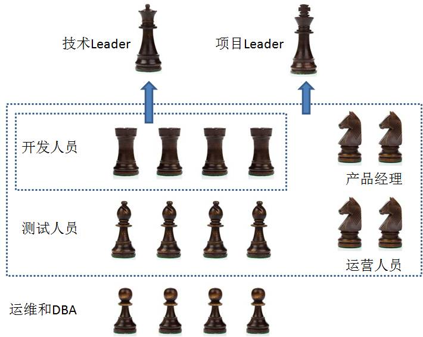

## 什么是架构师

​			架构师英文architect，这个词源于建筑学。软件工程当中的架构师和建筑工程当中建筑师有许多相通之处，都是负责“产品”宏观的架构设计。

​			在一个团队里，架构师充当了技术Leader的角色，不仅要完成项目的整体设计和规划，还要带领技术团队一起解决实际问题，攻克技术难点，使得软件的设计、开发、测试、发布流程得以顺利完成。

​			下面这张图，表达了一个应用架构师（技术Leader）在团队当中的角色：

​			需要注意的是，这张图中的架构师只是**应用架构师**，所以运维和`DBA`人员没有归入到他的管辖范围。同时，每个公司的具体组织结构也不尽相同。

## 架构师工作

1. 架构设计
   + 架构师，顾名思义，第一职责就是在软件设计阶段，做好软件“骨架”的设计。架构师需要把产品的需求翻译成软件工程的设计文档，确定各个系统与模块的边界，评估系统的量级。

2. 技术选型
   + 从前端到后端，从缓存到数据库，面对为数众多的第三方组件，架构师需要作出合理的选择。
     + 前端页面选择模板引擎还是动静分离？
     + 服务端选择Java还是Node.js？
     + 服务治理选择DubboX还是Spring Cloud？
     + 消息队列选择RocketMQ还是Kafka？
     + 分布式缓存选择Redis Cluster 还是 Codis？
     + 数据库选择Mysql还是Oracle？
     + 全文检索选择Solr还是ES？
   + 技术没有绝对的好坏之分，关键看是否适用于公司的业务场景。

3. 管理非功能性需求
   + 满足需求是项目开发和架构设计的根本，而管理非功能性需求则是项目的升华。
     + 在公司从0到1的创业阶段，开发者更关注的是功能性需求，往往一个简单粗暴的MVC项目就可以搞定一切。当业务量级逐渐增大，用户需求逐渐多样化，非功能性需求的重要性就逐渐显现。 
   + 非功能性需求都包含哪些内容呢？
     + 性能（响应时间）
     + 可扩展性（适应需求的快速变化）
     + 可用性 （四个9，五个9，必要时的限流和降级）
     + 安全性（防范各种恶意攻击，实现风控）
     + 可监控（完善的监控和报警机制）
     + 灵活性（便于非开发人员进行配置）
     + 可维护（持续集成，持续部署）
     + 国际化（冲出国门）

4. 攻克技术难题
   + 架构师不只需要关注宏观的设计，也需要具有攻克技术细节的能力。在团队开发过程中遇到难以实现和优化的技术问题时，架构师需要发挥技术优势，解决系统的疑难杂症。

5. 技术人员的管理和指导
   + 架构师不只是一个技术大牛，也应该是一个好的管理者，在工作中需要把较大的项目和需求拆分一个个Story，依照每个人的情况分配给研发团队的成员，并且在必要的时候进行技术上的培训指导。

## 架构师种类

1. 应用架构师
   + 应用架构师是行业中数量最多的架构师，主要负责公司产品的技术架构。产品架构师需要对业务有足够的理解，根据产品需求设计架构，在运营团队的协助下评估量级，并管理项目的整个生命周期。

2. 中间件架构师
   + 中间件架构师主要负责基础框架、公共组件，通用服务的搭建。比如分布式服务框架诸如Dubbo，HSF；比如消息队列诸如 RocketMQ，Kafka。在大型互联网公司中，往往不是把开源框架简单“拿来”，而是研发出符合自身业务的企业中间件。

3. 基础设施架构师
   + 基础设施架构师负责服务器资源、网络资源、数据库等基础设施的建设；以及持续集成工具、持续部署工具的搭建。

以上所说的三种，只是架构师最基本的分类。一些特殊领域也有着专门的架构师，比如网络安全架构师、大数据架构师等等。

## 架构师路线

1. 技术的深度和广度
   + 有一句话说得好，将军就是更优秀的士兵。架构师作为程序员中的将军，首先需要有足够的技术深度，同时需要广泛了解行业内的主流技术，以便更好地设计架构和技术选型。

2. 业务的理解
   + 抛开业务谈架构就是耍流氓。这一点对应用架构师来说尤其重要。只有对业务有了充分的理解，才能对项目的设计和扩展做出合理的规划。

3. 良好的沟通能力
   + 架构师不只是低头做技术，更需要协调指挥团队内的成员，也需要跨部门和产品、运营、项目经理等人员做及时有效的沟通，所以沟通能力是必不可少的。

## 大型互联网系统

### 系统特点

1. 高并发，大流量（用户量增加）
2. 高可用
3. 海量数据（大量用户产生了大量的数据）
4. 用户广泛
5. 安全环境恶劣（容易受到黑客攻击）
6. 需求变换快

### 解决方案

1. 垂直伸缩
   1. 花钱购买计算资源，价格上涨
   2. 存在物理极限
2. 水平伸缩
   1. 少量应用：单机系统
   2. 万级用户：数据库应用分离
   3. 十万级用户：使用缓存改善性能、应用集群化
   4. 百万级用户：反向代理、CDN加速、数据库读写分离
   5. 千万级用户：分布式文件系统、分布式数据库系统
   6. 亿级用户：使用搜索引擎、NoSql、消息队列

### 缓存

#### 分布式缓存

存储方式

1. 缓存数据存储（hash表）
2. 计算hashcode
3. 计算hashcode对应的哈希表

缓存的关键指标（命中率）

1. 查询一个缓存，十次有九次能够得到正确结果，那么命中率就是90%
2. 影响命中率的3个重要元素
   1. 缓存键集合大小（尽可能减少缓存键的存在）
   2. 内存空间（空间越大，缓存数据越多）
   3. 缓存寿命（寿命越长，被重用的可能性就越高）
3. 缓存的类别
   1. 代理缓存
   2. 反向代理缓存
   3. 多层反向代理缓存
   4. 内容分发网路CDN

## 系统故障

事故故障类别

1. A类：核心功能不可用
2. B类：非核心功能不可用
3. C类：以上故障以外的故障

