# 系统架构设计

## 服务过载保护

### 概念

#### 什么是服务过载?

​			服务过载就是服务的请求量超过服务所能承受的最大值，从而导致服务器负载过高，响应延迟加大，用户侧表现就是无法加载或者加载缓慢，这会引起用户进一步的重试，服务一直在处理过去的无效请求，导致有效请求跌 0，甚至导致整个系统产生雪崩。

#### 为什么会发生服务过载？

​			互联网天生就会有突发流量，秒杀，抢购，突发大事件，节日，甚至恶意攻击等，都会造成服务承受平时数倍的压力，微博经常出现某明星官宣结婚或者离婚导致服务器崩溃的场景，这就是服务过载。

#### 过载保护的好处

​			主要是为了提升用户体验，保障服务质量，在发生突发流量时仍然能够提供一部分服务能力，而不是整个系统瘫痪，系统瘫痪就意味着用户流失，口碑变差，夫妻吵架，甚至威胁生命安全（假如腾讯文档崩溃，这个文档正好用于救灾）。

### 微信如何防止崩溃？

#### 微信中的过载场景

​			微信采用的是微服务，说是微服务，其实我理解就是采用统一的 RPC 框架搭建的一个个独立的服务，服务之间互相调用，实现各种各样的功能，这也是现代服务的基本架构。毕竟谁也不想看到我朋友圈崩了，导致我聊天也不行了。

​			微信这边的服务是分三层，接入服务，逻辑服务，基础服务，大多数服务属于逻辑服务，接入服务比如登录，发消息，支付服务，每日请求量在 10 亿-100 亿之间，入口协议触发对逻辑服务和基础服务更多的请求，核心服务每秒要处理上亿次的请求。

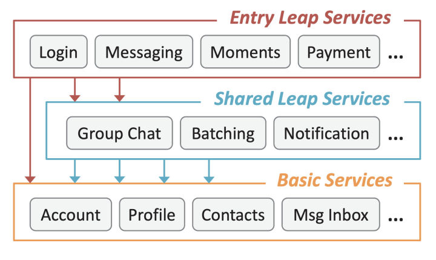

​			在大规模微服务场景下，过载会变得比较复杂，如果是单体服务，一个事件只用一个请求，但微服务下，一个事件可能要请求很多的服务，任何一个服务过载失败，就会造成其他的请求都是无效的。如下图所示。

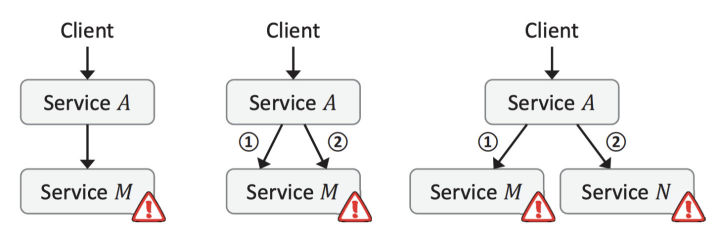

​			比如在一个转账服务下，需要查询分别两者的卡号， 再查询 A 时成功了，但查询 B 失败，对于查卡号这个事件就算失败了，比如查询成功率只有 50%， 那对于查询两者卡号这个成功率只有 50% * 50% = 25% 了， 一个事件调用的服务次数越多，那成功率就会越低。

#### 如何判断过载

1. 通常判断过载可以使用吞吐量，延迟，CPU 使用率，丢包率，待处理请求数，请求处理事件等等。微信使用在请求在队列中的平均等待时间作为判断标准，就是从请求到达，到开始处理的时间。
2. 为啥不使用响应时间？ 因为响应时间是跟服务相关的，很多微服务是链式调用，响应时间是不可控的，也是无法标准化的，很难作为一个统一的判断依据。
3. 那为什么不使用 CPU 负载作为判断标准呢， 因为 CPU 负载高不代表服务过载，因为一个服务请求处理及时，CPU 处于高位反而是比较良好的表现。实际上 CPU 负载高，监控服务是会告警出来，但是并不会直接进入过载处理流程。
4. 腾讯微服务默认的超时时间是 500ms，通过计算每秒或每 2000 个请求的平均等待时间是否超过 20ms，判断是否过载，这个 20ms 是根据微信后台 5 年摸索出来的门槛值。
5. 采用平均等待时间还有一个好处，是这个是独立于服务的，可以应用于任何场景，而不用关联于业务，可以直接在框架上进行改造。
6. 当平均等待时间大于 20ms 时，以一定的降速因子过滤调部分请求，如果判断平均等待时间小于 20ms，则以一定的速率提升通过率，一般采用快降慢升的策略，防止大的服务波动，整个策略相当于一个负反馈电路。

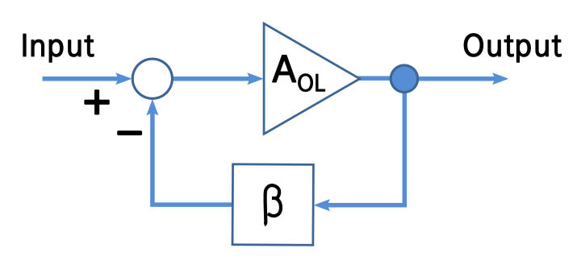

#### 过载保护策略

​			一旦检测到服务过载，需要按照一定的策略对请求进行过滤，前面分析过，对于链式调用的微服务场景，随机丢弃请求会导致整体服务的成功率很低。所以请求是按照优先级进行控制的， 优先级低的请求会优先丢弃。

##### 业务优先级

1. 对于不同的业务场景优先级是不同的， 比如登录场景是最重要的业务，不能登录一切都白瞎，另外支付消息比普通消息优先级高，因为用户对金钱是更敏感的，但普通消息又比朋友圈消息优先级高，所以在微信内是天然存在业务优先级的。
2. 用户的每个请求都会分配一个优先级，并且在微服务的链式调用下，下游请求的优先级也是继承的，比如我请求登录，那么检查账号密码等一系列的的后续请求都是继承登录优先级的，这就保证了优先级的一致性。
3. 每个后台服务维护了业务优先级的 hash 表，微信的业务太多了，不是每个业务都记录在表里，不在表里的业务就是最低优先级。

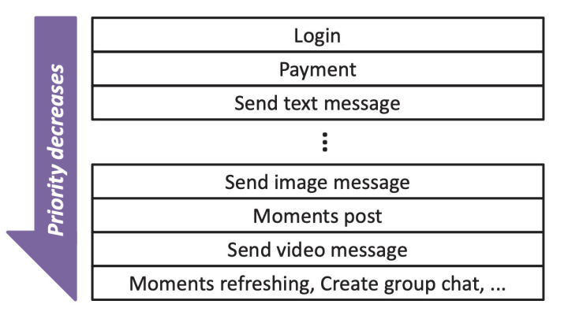

##### 用户优先级

1. 很明显，只基于业务优先级的控制是不够的，首先不可能因为负载高，丢弃或允许通过一整个业务的请求，因为每个业务的请求量很大，那一定会造成负载的大幅波动，另外如果在业务中随机丢弃请求，在过载情况下还是会导致整体成功率很低。
2. 为了解决这个问题，可以引入用户优先级，首先用户优先级也不应该相同，对于普通人来说通过 hash 用户唯一 ID，计算用户优先级，为了防止出现总是打豆豆的现象，hash 函数每小时更换，跟业务优先级一样，单个用户的访问链条上的优先级总是一致的。
3. 这里有个疑问，为啥不采用会话 ID 计算优先级呢，从理论上来说采用会话 ID 和用户 ID 效果是一样的，但是采用会话 ID 在用户重新登录时刷新，这个时候可能用户的优先级可能变了，在过载的情况下，他可能因为提高了优先级就恢复了，这样用户会养成坏习惯，在服务有问题时就会重新登录，这样无疑进一步加剧了服务的过载情况。
4. 因为引入了用户优先级，那就和业务优先级组成了一个二维控制平面，根据负载情况，决定这台服务器的准入优先级(B,U)，当过来的请求业务优先级大于 B，或者业务优先级等于 B，但用户优先级高于 U 时，则通过，否则决绝。

##### 自适应优先级调整

1. 在大规模微服务场景下，服务器的负载是变化非常频繁的，所以服务器的准入优先级是需要动态变化的，微信分了几十个业务优先级，每个业务优先级下有 128 个用户优先级，所以总的优先级是几千个。
2. 如何根据负载情况调整优先级呢？最简单的方式是从右到左遍历，每调整一次判断下负载情况，这个时间复杂度是 O(n), 就算使用二分法，时间复杂度也为 O(logn)，在数千个优先级下，可能需要数十次调整才能确定一个合适的优先级，每次调整好再统计优先级，可能几十秒都过去了，这个方法无疑是非常低效的。
3. 微信提出了一种基于直方图统计的方法快速调整准入优先级，服务器上维护者目前准入优先级下，过去一个周期的（1s 或 2000 次请求）每个优先级的请求量，当过载时，通过消减下一个周期的请求量来减轻负载，假设上一个周期所有优先级的通过的请求总和是 N，下一个周期的请求量要减少 N*a，怎么去减少呢，每提升一个优先级就减少一定的请求量，一直提升到 减少的数目大于目标量，恢复负载使用相反的方法，只不是系数为 b ，比 a 小，也是为了快降慢升。根据经验值 a 为 5%，b 为 1%。

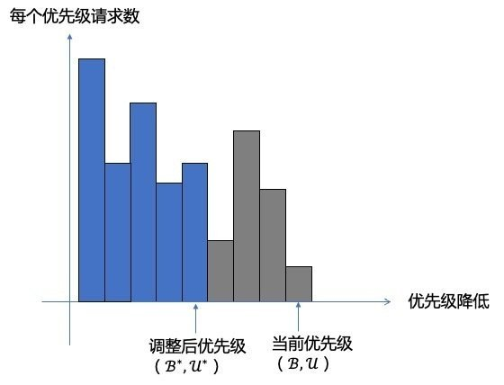

4. 为了进一步减轻过载机器的压力，能不能在下游过载的情况下不把请求发到下游呢？ 否则下游还是要接受请求，解包，丢弃请求，白白的浪费带宽，也加重了下游的负载。
5. 为了实现这个能力，在每次请求下游服务时，下游把当前服务的准入优先级返回给上游，上游维护下游服务的准入优先级，如果发现请求优先级达不到下游服务的准入门槛，直接丢弃，而不再请求下游，进一步减轻下游的压力。

#### 总结

微信整个负载控制的流程如图所示：

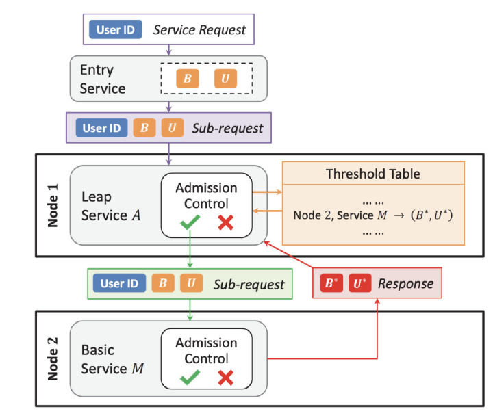

1. 当用户从微信发起请求，请求被路由到接入层服务，分配统一的业务和用户优先级，所有到下游的字请求都继承相同的优先级。
2. 根据业务逻辑调用 1 个或多个下游服务，当服务收到请求，首先根据自身服务准入优先级判断请求是接受还是丢弃。服务本身根据负载情况周期性的调整准入优先级。
3. 当服务需要再向下游发起请求时，判断本地记录的下游服务准入优先级，如果小于则丢弃，如果没有记录或优先级大于记录则向下游发起请求。
4. 下游服务返回上游服务需要的信息，并且在信息中携带自身准入优先级。
5. 上游接受到返回后解析信息，并更新本地记录的下游服务准入优先级。

整个过载保护的策略有以下三个特点：

1. 业务无关的，使用请求等待时间而不是响应时间，制定用户和业务优先级，这些都与业务本身无关。
2. 独立控制和联合控制结合，准入优先级取决于独立的服务，但又可以联合下游服务的情况，优化服务过载时的表现。
3. 高效且公平， 请求链条的优先级是一致的，并且会定时改变 hash 函数调整用户优先级，过载情况下，不会总是影响固定的用户。

## 业务单系统设计

### 概述

作为一个业务开发工程师，工作中最多的是需求开发，把需求从ppt到落地实现。随着工作的深入，工作面也变得更广和更深，需要面对更多的系统，更加复杂的场景。这时完成功能实现是基本要求了，想要开发能力上一个台阶，需要做好架构设计。常见的架构有：洋葱架构、六边形架构、整洁架构、SOA架构、CQRS架构等等。

这些架构都有一个共同点，分层。针对业务开发系统，本文总结如下业务架构，总共分为5部分：api层、流程层、服务层、数据访问层、指令输出层。

#### API层

功能：隔离本系统与外部其他系统的交互，交互方式有rpc接口，http，mq, 定时任务等方式。 api层接收和处理入口参数以及凭借和转换参数，映射为内部服务，并处理内部服务出参。api层不只是做转换，还需要理解内部服务的模型定义和领域能力，对参数建立合理的模型。

api层在设计上需要尽量满足以下四个原则：

+ api层尽可能薄。api层不要业务逻辑，业务逻辑下沉到流程层和服务层里面。
+ 满足弹性设计，减少后续对api定义的改动。api层是跟外部交互，接口定义上尽量减少变动。弹性设计方法有：
  + 对入参和出参使用一个大对象包装，后续变更参数时，变动收缩在对象内部；
  + 使用Map来传递一些可变参数；
  + 通过List实现参数规模的弹性，不断丰富Condition模型来支持更多的参数结构和含义，比如范围搜索、模糊搜索、并联或者互斥条件含义。
+ 参数归一化。所有外部的请求，业务上一般需要记录上游方的调用信息，方便后面追溯请求和做业务监控。因而，需要抽离出公共模型，专门记录调用方相关信息。所有返回结果，根据是否成功有可能性：成功，失败。 在定义成功和失败上，为了便于上游，需要统一成功和失败的code，在设计返回结果时需要抽离出一个标准返回模型，统一定义成功和失败的code。比如http，只有200才表示成功，其他错误码都是不同失败原因。
+ 上游参数映射：尽力隔离上游系统的领域内容，防止上游定义变更，带来的大批量修改灾难。

当然，api层可以做一些非业务功能，比如用户鉴权，接口限流。

#### 流程层(biz层）

负责流程编排。将服务层的逻辑串联起来完成业务逻辑。流程层主要负责组织串联服务，可以将组织串联功能沉淀出基础组件功能便于复用。  流程层可以留有简单的业务逻辑，如果本身不复杂，业务逻辑可以直接放到流程层，不必下沉到服务层再被流程层调用，业务架构设计中可根据情况具体分析。

#### 服务层(service)

系统核心模型和能力弹性的承载层，是系统功能和扩展性张力来源。服务层内部要进行划分成不同的功能区，划分方法可参考DDD，原则上各个功能区是独立的，不应存在跨功能区调用的情况。

#### 数据访问层

对接数据存储，对外提供统一的接口，屏蔽存储实现，数据存储有mySQL, Redis, ES等。

#### 输出指令层

输出指令数据，方式有RPC, MQ, 以及http等服务。在层级上跟数据访问层处于同一层级。输出指令层也是跟外部服务进行交互，如有必要进行参数映射，防止下游定义变更，带来的大批量修改灾难

### 业务复用

1. 随着系统壮大，越来越多新的功能加入，如果新功能跟现有功能在流程上具备相似之处，从原则上应该复用现有逻辑。复用现有逻辑，一方面能够减少开发量，只需要专注差异点的开发，能够快速交付上线；另一方面，从长远来看，便于维护，无需多次改动。
2. 不同业务具备公共业务点和差异业务点，业务复用可以在两个地方实现：流程层重新编排和服务层子服务开启差异点扩展。
3. 流程层重新编排是指各个业务线在流程层各自写一套服务编排逻辑，被编排的子服务可以分为公共子服务和差异子服务， 公共业务点放到公共子服务中，差异业务点放到差异子服务。
	

服务层子服务开启差异点扩展是指流程编排是相同的，在子服务中根据不同的业务线实现差异点，为了在子服务中实现差异点，需要在流程上下文中带上业务标识。

流程层重新编排适合差异点比较大的情况下，差异子服务并非一个服务的不同实现，这种情况下将差异点直接编排成子服务更合适。服务层子服务开启差异点适合差异比较小的场景，对于某个功能点各个服务都有自己不同的实现，这种有个好处是便于定义标准扩展接口，做成SPI还能够支持动态扩展。实际业务线采用哪种方式要根据具体业务来定，或者两种都采用。

### 扩展点

#### 链式扩展

用更形象的表述，就如数据结构中的链表一样，链表中的节点为扩展节点，链表将多个扩展节点串联起来执行。链式又可以分为单链和双链。单链中每个节点只有一个处理器，双链每个节点分为前置和后置处理器，双链在执行上，节点前置处理器先正序执行，执行完后，后置处理器再逆序执行。

#### 星型扩展

星型扩展组成上有一个分发器和多个扩展节点。分发器根据分发条件分发到响应的扩展点进行处理。

## 订单系统设计

### 背景简介

订单其实很常见，在电商购物、外卖点餐、手机话费充值等生活场景中，都能见到它的影子。那么，一笔订单的交易过程是什么样子的呢？文章尝试从订单业务架构和产品功能流程，描述对订单的理解。

### 订单业务

用户、平台和商户是订单业务的核心参与者，订单流程的搭建就是围绕三方的交易场景展开的。

- 用户：在应用端选择商品、下单支付、查看订单。
- 平台：实现订单交易链路，提供支付能力和对账清算能力；
- 商户：提供商品信息和交付能力。

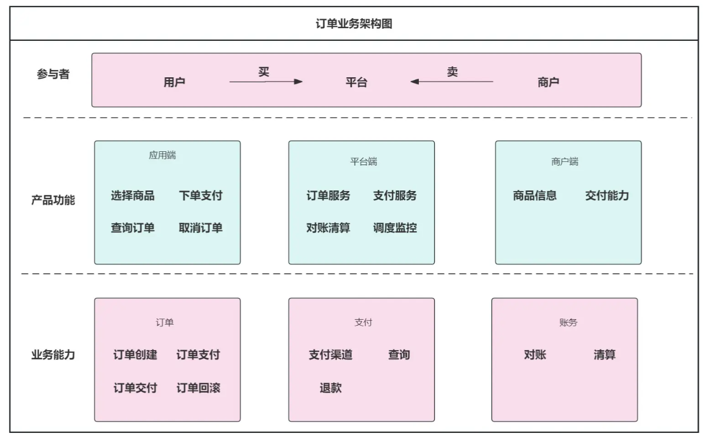

### 订单流程

订单流程有三个核心阶段：创建、支付、交付。

- 订单创建：用户选择商品并下单，完成订单创建。
- 订单支付：对接各种支付渠道，完成订单支付。
- 订单交付：支付成功后，通知商户交付商品。商品交付成功即订单完成。

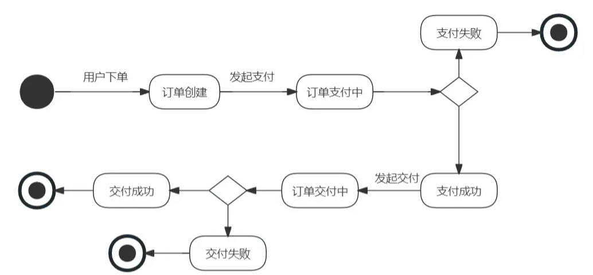

#### 订单支付流程（正向交易）

在理想状态下，订单流程从用户下单开始，支付成功之后，商户交付商品，即订单结束。流程如下：

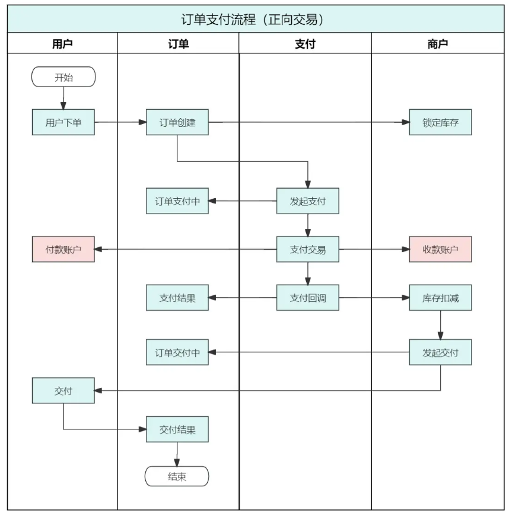

#### 订单退款流程（逆向交易）

订单涉及下单、支付、交付等诸多环节，一旦某个环节失败了，都可能导致订单回滚。所以要全面地考虑各种退款场景，并且提供相应地解决方案。

- 主动取消：用户取消订单，发起退款；商户交付失败，发起退回。
- 超时情况：用户支付超时；商家交付超时。
- 异常情况：平台、支付渠道、商户等系统的程序异常或业务异常，导致支付失败或交付失败；

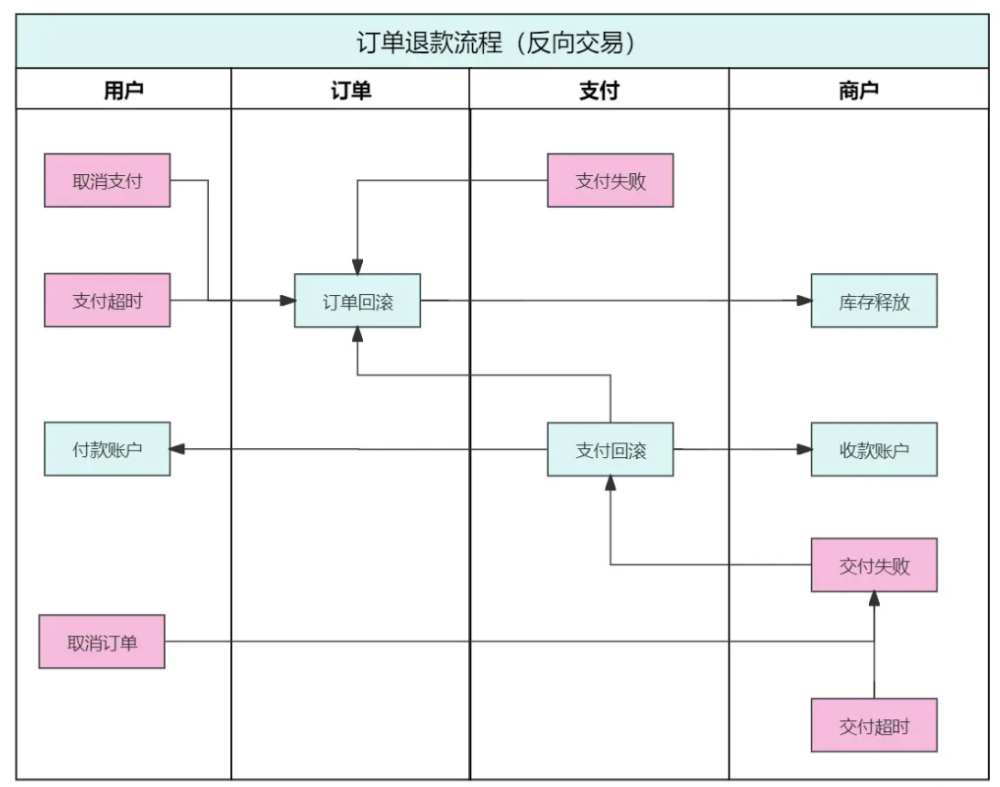

### 系统监控和自动任务

订单流程复杂，且涉及资金交易，对系统稳定性要求极高。主要依赖于系统监控和自动任务，提高订单的成功率，降低人工干预的风险和成本。

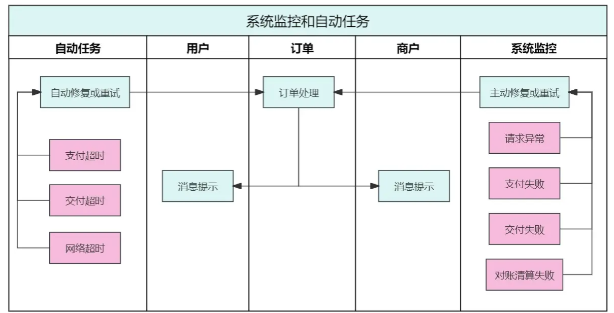

#### 系统监控

监控订单流程的异常情况，及时通知系统人员，做主动修复或重试处理。例如，接口请求失败频率超出阈值时，一般是网络或系统问题，及时通知系统人员排查；支付失败或交付失败时，短信告警；对账或清算失败时，通知及时处理，否则可能影响日终。

####  自动任务

订单流程是异步的，自然依赖于任务调度，对超时场景做自动修复或重试处理。例如，支付超时会持续锁定库存，需要及时关单处理；交付超时会影响用户体验，需要及时通知商户处理或退回；请求超时，需要重试处理，提高成功率。

## 饿了么-订单系统架构

### 服务从单体拆分

怎么拆分呢？面向服务有很多拆分原则。我将拆分过程中最具帮助和指导性的点罗列了以下几条。

- **第一是明确的定义。**之前也确实犯了一些错误，为了拆而拆。其实我们需要更明确，什么才算是一个服务？服务一定具有非常独立的技术能力或者业务能力，而且一定意义上能够很抽象。
- **第二是松耦合。**最基本的松耦合就是Customer的消费不依赖于Provider的某一个特定实现，这样服务器的内部变更不会影响外部消费，消费者可以切换到其他服务能力的提供方，这是最基本的松耦合。还有时间上的松耦合或者位置上的松耦合，我们希望的松耦合是消费方和服务方是可以分离的。
- **第三是基于领域的认知，这对于整个产品起到非常大的作用。**因为当时整个饿了么所有系统是在一起的，基于领域的认知，在面向用户的维度和面向商户的维度做了切分，还有基于交易链路做了切分。
- **第四是单一职责和关注分离。**简单说，我们希望一个服务或者一个模块拥有单一的能力，而不是承担过多的职责，否则责任不清晰，导致能力也不清晰。
- **最后一点是可被验证的结果。**在订单拆分的过程中我们犯了一些错误，当时认为这样拆分是没有问题的，但是过一、两个月，并没有带来效率和能力的提升，反而是跨团队的要求越来越多，能力要求也越来越多。这时候可能是拆错了。如果是一个好的拆分一定有利于发展，拆分之后的发展是更迅速的。

基于这几条原则，我们对饿了么的整体服务做拆分之后，如上图所示，架构就有了一些变化，看起来跟刚才架构区别不大。把Order Service做了分离。当时拆分虽然比较垂直，但是用户、商户、金融、订单等还是有一些横向交互。

一个接口有一个非常明确的Owner，一个表、一个库也能保证仅有单一的操作方，让我感受比较直接的是，为服务的治理奠定了基础，以后可以针对某项特定业务做一些降级、熔断，以及单独的监控。拆分实际上是让各自模块的掌控力变得更强了，对业务起到更好的支撑作用。

这时每个部门或者每个团队都负责自己独立的领域，代码和数据都拆分完毕是不是就可以了？但是后来发现好像还不对。因为虽然大的领域上确实已经干净了，但是在小的领域上依然问题很多，订单并不仅仅只有一张表，一个单一的模块，其实还有很多复杂的内容。

### 订单服务定义

+ **第一，订单是整个交易链路的核心**，围绕了一些相关服务，比如金额计算服务、催单服务、售中异常服务等，我们希望这些服务之间有明确的区别。
+ **第二，订单实时处理是整个链路的中心**，我们将这个过程定义得尽量简洁。一笔交易中，订单被推进得越复杂，说明系统设计得越复杂，出问题的概率也会越高。所以我们希望订单核心流程非常简单、轻薄，把复杂的东西剥离出来，把简单和复杂明确成两个部分。
+ **第三，**考虑到交易的时效性和异常场景越来越复杂，**将交易分成正向交易流程和逆向交易流程两个部分**。正向交易流程，99%的订单会根据这个流程走完生命周期；逆向交易流程，比如说退单要求时效性比较低，处理会牵扯多方业务可能很复杂，所以通过一个逆向的交易流程来解决。
+ **第四，能够在功能和业务上独立的部分，尽可能抽象为单独的模块或服务**。简单来说，比如催单的服务，它其实对交易链路无法起到推进作用，它只是一个动作或者附带服务，我们把它单独抽象出来，为后面的发展做出铺垫。

### 监控和告警

+ **第一，对于订单而言，吞吐量是最需要重点关注的指标。**一开始对业务指标的感知并不是特别清晰，就在某一个接口耗费了很多时间。后来发现一些很小BD的问题不太容易从小接口感知到，但是从业务方面感知就比较明显，所以就更多关注业务指标的控制。
+ **第二，通常我们重视系统指标，而容易忽视业务指标，其实业务指标更能反映出隐晦的问题。**
+ **第三，目前我们致力于基于监控和数据学习的过载保护和业务自动降级。**虽然现在还没有完全做好，但是已经能感觉到一些效果。如果商户长时间不接单，用户会自动取消订单，自动取消功能的开关目前是人工控制的，我们更希望是系统来控制。

比如说有大量订单取消了，有可能是接单功能出了问题，就需要临时关闭这个功能，如果还是依靠人来做，往往已经来不及，这时候就应该基于数据的学习，让系统自动降级这个功能。

### 失败机制

就订单系统而言主要有以下四个内容。第一是消息广播补偿，第二是主流程补偿，第三是灾备，第四是随机故障测试系统。

+ **首先是消息广播补偿。**对于订单来说，MQ是非常核心的基础组件，如果它出现问题，一些订单处理就会受影响。为了避免这种情况发生，我们做了一个补偿的内容，这个补偿其实很简单，就是在订单状态发生消息变化的时候，我们会同时落一份消息数据，目前会存储最近一小时的消息。如果MQ系统或者集群当前有问题或者抖动，消息广播补偿可以起到一个备线的作用。消息广播补偿不能应付所有问题，但是对于订单系统的稳定和健壮而言还是非常有用的。
+ **第二是主流程的补偿。**什么是主流程？就是交易的正向流程。99%的交易都会是正向的，就是下单、付款，顺利吃饭。在这个过程中，只要用户有通过饿了么吃饭的意向，就尽全力一定让他完成最终的交易，不要因为系统的原因影响到他。主流程主要是针对链路本身出问题的情况，以最大程度保证交易的进行，也是对主要链路的保护。
+ **第三是灾备。**目前订单系统做了一个比较简单的灾备，就是两个机房的切换。切换的时候是全流量切换的，我们会把流量从A机房切到B机房。订单的主要操作是在切换的过程中要进行修复数据。
+ **第四是随机故障测试系统**

