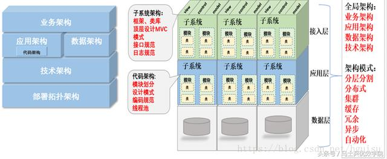
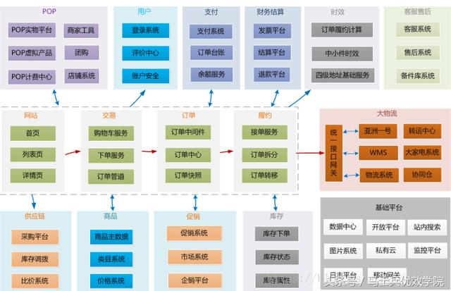
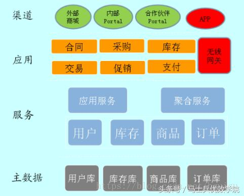
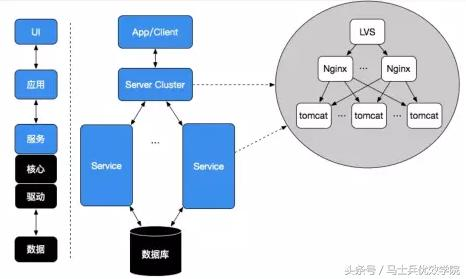
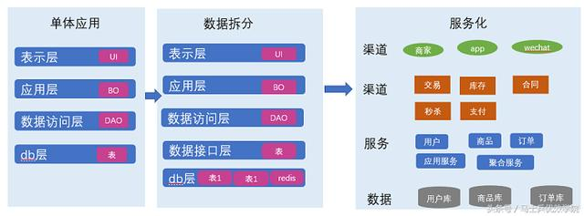
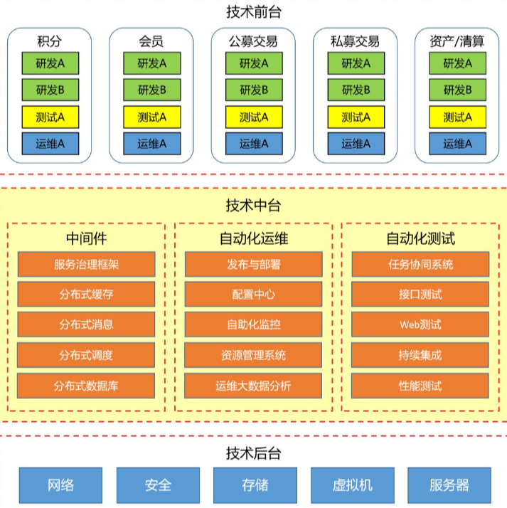

# 系统架构

## 前言

​		这里讲的系统设计都是**系统设计面试**，而非是工业上的设计系统。系统设计，其实就是一个“吹牛逼”的行为，在和面试官你来我往的沟通中，用“嘴皮子”创建一个系统，讨论系统。

**我简单总结了一下系统设计面试相关问题的问法：**

> **设计某某系统 Design XXX System**
>
> - 设计微博 Design Twitter
> - 设计滴滴 Design Uber
> - 设计微信 Design Whatsapp
> - 设计点评 Design Yelp
> - 设计短网址系统 Design Tiny URL
> - 设计NoSQL数据库 Design NoSQL ……
>
> **设计一个功能实现对用户访问频率的限制**
>
> - 设计一个功能实现统计某个具体事件的历史发生次数
> - 设计删除一个 Tweet 的功能
> - 设计邮件系统中将所有邮件标记为已读的功能 ……
>
> **某某系统的技术选型比如缓存用**`Redis` 还是 `Memcached`、**网关用** `Spring Cloud Gateway` 还是 `Netflix Zuul2` 。 …

​		所谓知己知彼，百战不殆，弄清面试官的意图很重要。

​		系统设计面试不是希望你在`30min`左右设计出一个完整的系统，而是考察你在**面对一个复杂的问题时，如何把它进行拆解、细化、运用现有的系统知识完成一个具体的项目，实现工作中leader需要你实现的功能。**

## 什么是架构和架构本质

​		在软件行业，对于什么是架构，都有很多的争论，每个人都有自己的理解。 此君说的架构和彼君理解的架构未必是一回事。我们主要针对互联网服server系统（类似网站）来定义架构：架构是系统的骨架，支撑和链接各个部分，包括组件、连接件、约束规范，以及指导这些内容设计与演化的原理。

+ **组件：**类似应用服务，独立模块、数据库、[nginx](https://so.csdn.net/so/search?q=nginx&spm=1001.2101.3001.7020)等等、
+ **连接件：**分布式调用、进程间调用、调用使用http协议还是tcp协议、组件之间的交互关系、
+ **约束规范：** 定规则做限制：例如设计原则、编码规范等等。

​			是系统性地思考，权衡利弊之后在现有资源约束下的“最合理决策”，并由它来指导团队中的每个人思想层面上的一致。即架构=组件+交互。这类似建筑设计规划，城市总体规划等，其实就是架构，只是应用的场景不同。盖一座小房子，可以拍脑袋干起来，但是当你要盖一座大楼，如果没有一个建筑设计规划，可以想象搭理最后是什么样？

​		架构的本质就是对系统进行有序化地重构以致符合当前业务的发展，并可以快速扩展。那什么样的系统要考虑做架构设计?

1. 需求相对复杂.
2. 非功能性需求在整个系统占据重要位置.
3. 系统生命周期长,有扩展性需求.
4. 系统基于组件或者集成的需要.
5. 业务流程再造的需要.

## 架构分类

架构可细分为

+ 业务架构：业务战略、治理、组织和关键业务流程
+ 应用架构：秒速被部署的耽搁应用系统、系统之间的交互、以及它们与组织核心业务流程之间的关系蓝图
+ 技术架构：支持业务、数据和应用服务的能力，包括IT基础设施、中间件、网络、通信、部署处理和一些标准等
+ 代码架构
+ 部署架构

业务架构是战略，应用架构是战术，技术架构是装备。其中应用架构承上启下，一方面承接业务架构的落地，另一方面影响技术选型。

熟悉业务，形成业务架构，根据业务架构，做出相应的应用架构，最后技术架构落地实施。

如何针对当前需求，选择合适的应用架构，如何面向未来，保证架构平滑过渡，这个是软件开发者，特别是架构师，都需要深入思考的问题。

### 业务架构（俯视架构）

包括：业务规划，业务模块、业务流程，对整个系统的业务进行拆分，对领域模型进行设计，把现实的业务转化成抽象对象。

没有最优的架构，只有最合适的架构，一切系统设计原则都要以解决业务问题为最终目标，脱离实际业务的技术情怀架构往往会给系统带入大坑，任何不基于业务做异想天开的架构都是耍流氓。

所有问题的前提要搞清楚我们今天面临的业务量有多大，增长走势是什么样，而且解决高并发的过程，一定是一个循序渐进逐步的过程。 合理的架构能够提前预见业务发展1~2年为宜。这样可以付出较为合理的代价换来真正达到技术引领业务成长的效果。

看看京东业务架构（网上分享图）：

### 应用架构（剖面架构，也叫逻辑架构图）

硬件到应用的抽象，包括抽象层和编程接口。应用架构和业务架构是相辅相成的关系。业务架构的每一部分都有应用架构。

类似：

**应用架构：**应用作为独立可部署的单元，为系统划分了明确的边界，深刻影响系统功能组织、代码开发、部署和运维等各方面. 应用架构定义系统有哪些应用、以及应用之间如何分工和合作。这里所谓应用就是各个逻辑模块或者子系统。

**应用架构图关键有2点：**

1. 职责划分: 明确应用（各个逻辑模块或者子系统）边界
   1. 逻辑分层
   2. 子系统、模块定义
   3. 关键类。
2. 职责之间的协作：
   1. 接口协议：应用对外输出的接口。
   2. 协作关系：应用之间的调用关系。

**应用分层有两种方式：**

1. **一种是水平分（横向）**，按照功能处理顺序划分应用，比如把系统分为web前端/中间服务/后台任务，这是面向业务深度的划分。

2. **另一种是垂直分（纵向）**，按照不同的业务类型划分应用，比如进销存系统可以划分为三个独立的应用，这是面向业务广度的划分。

应用的合反映应用之间如何协作，共同完成复杂的业务case，主要体现在应用之间的通讯机制和数据格式，通讯机制可以是同步调用/异步消息/共享DB访问等，数据格式可以是文本/XML/JSON/二进制等。

应用的分偏向于业务，反映业务架构，应用的合偏向于技术，影响技术架构。分降低了业务复杂度，系统更有序，合增加了技术复杂度，系统更无序。

应用架构的本质是通过系统拆分，平衡业务和技术复杂性，保证系统形散神不散。

系统采用什么样的应用架构，受业务复杂性影响，包括企业发展阶段和业务特点；同时受技术复杂性影响，包括IT技术发展阶段和内部技术人员水平。业务复杂性（包括业务量大）必然带来技术复杂性，应用架构目标是解决业务复杂性的同时，避免技术太复杂，确保业务架构落地。

### 代码架构（也叫开发架构）

子系统代码架构主要为开发人员提供切实可行的指导，如果代码架构设计不足，就会造成影响全局的架构设计。比如公司内不同的开发团队使用不同的技术栈或者组件，结果公司整体架构设计就会失控。

代码架构主要定义：

1. 代码单元:
   1. 配置设计
   2. 框架、类库。
2. 代码单元组织：
   1. 编码规范，编码的惯例。
   2. 项目模块划分
   3. 顶层文件结构设计，比如`mvc`设计。
   4. 依赖关系

### 技术架构，也可以叫系统架构

​			技术架构：确定组成应用系统的实际运行组件（lvs，nginx，tomcat，php-fpm等），这些运行组件之间的关系，以及部署到硬件的策略。

​			技术架构主要考虑系统的非功能性特征，对系统的高可用、高性能、扩展、安全、伸缩性、简洁等做系统级的把握。系统架构的设计要求架构师具备软件和硬件的功能和性能的过硬知识，这也是架构设计工作中最为困难的工作。

## 应用架构

架构演进路程：

+ 初始阶段：LAMP,部署在一台服务器
+ 应用服务器和数据服务器分离
+ 使用缓存改善性能
+ 使用集群改善并发
+ 数据库地读写分离
+ 使用反向代理和cdn加速
+ 使用分布式文件和分布式数据库
+ 业务拆分
+ 分布式服务

​			业务架构是生产力，应用架构是生产关系，技术架构是生产工具。业务架构决定应用架构，应用架构需要适配业务架构，并随着业务架构不断进化，同时应用架构依托技术架构最终落地。

​			企业一开始业务比较简单，比如进销存，此时面向内部用户，提供简单的信息管理系统（MIS），支持数据增删改查即可，单体应用可以满足要求。

​			随着业务深入，进销存每块业务都变复杂，同时新增客户关系管理，以更好支持营销，业务的深度和广度都增加，这时需要对系统按照业务拆分，变成一个分布式系统。

​			更进一步，企业转向互联网+战略，拓展在线交易，线上系统和内部系统业务类似，没必要重做一套，此时把内部系统的逻辑做服务化改造，同时供线上线下系统使用，变成一个简单的SOA架构。

​			紧接着业务模式越来越复杂，订单、商品、库存、价格每块玩法都很深入，比如价格区分会员等级，访问渠道（无线还是PC），销售方式（团购还是普通）等，还有大量的价格促销，这些规则很复杂，容易相互冲突，需要把分散到各个业务的价格逻辑进行统一管理，以基础价格服务的方式透明地提供给上层应用，变成一个微内核的SOA架构。

​			同时不管是企业内部用户，还是外部顾客所需要的功能，都由很多细分的应用提供支持，需要提供portal，集成相关应用，为不同用户提供统一视图，顶层变成一个AOA的架构（application orientated architecture）。

## 衡量架构的合理性

架构为业务服务，没有最优的架构，只有最合适的架构， 架构始终以高效，稳定，安全为目标来衡量其合理性。

1. 稳定性。指标：高可用：要尽可能的提高软件的可用性，我想每个操作人都不愿意看到自己的工作无法正常进行。黑盒白盒测试、单元测试、自动化测试、故障注入测试、提高测试覆盖率等方式来一步一步推进。
2. 高效指标：
   1. 文档化：不管是整体还是部分的整个生命周期内都必须做好文档化，变动的来源包括但不限于BUG，需求。
   2. 可扩展：软件的设计秉承着低耦合的理念去做，注意在合理的地方抽象。方便功能更改、新增和运用技术的迭代，并且支持在适时对架构做出重构。
   3. 高复用：为了避免重复劳动，为了降低成本，我们希望能够重用之前的代码、之前的设计。这点对于架构环境的依赖是最大的
3. 安全指标：组织的运作过程中产生的数据都是具有商业价值的，保证数据的安全也是刻不容缓的一部分。以免出现XX门之类丑闻。加密、https等为普遍手段

## 常见架构误区

+ 误区1：架构专门由架构师来做，业务开发人员无需关注：架构的再好，最终还是需要代码来落地，并且组织越大这个落地的难度越大。不单单是系统架构，每个解决方案每个项目也由自己的架构，如分层、设计模式等。如果每一块砖瓦不够坚固，那么整个系统还是会由崩塌的风险。所谓“千里之堤，溃于蚁穴”。
+ 误区2：架构师确定了架构蓝图之后任务就结束了：架构不是“空中楼阁”，最终还是要落地的，但是架构师完全不去深入到第一线怎么知道“地”在哪？怎么才能落的稳稳当当。
+ 误区3：不做出完美的架构设计不开工：世上没有最好架构，只有最合适的架构。我们需要的不是一下子造出一辆汽车，而是从单轮车 --> 自行车 --> 摩托车，最后再到汽车。想象一下2年后才能造出的产品，当初市场还存在吗？

## 架构知识体系

**架构演进**

- 初始阶段：LAMP,部署在一台服务器
- 应用服务器和数据服务器分离
- 使用缓存改善性能
- 使用集群改善并发
- 数据库地读写分离
- 使用反向代理和cdn加速
- 使用分布式文件和分布式数据库
- 业务拆分
- 分布式服务

**架构模式**

- 分层：横向分层：应用层，服务层，数据层
- 分割：纵向分割：拆分功能和服务
- 分布式
- 分布式应用和服务
- 分布式静态资源
- 分布式数据和存储
- 分布式计算
- 集群：提高并发和可用性
- 缓存：优化系统性能
- cdn
- 方向代理访问资源
- 本地缓存
- 分布式缓存
- 异步：降低系统的耦合性
- 提供系统的可用性
- 加快响应速度
- 冗余：冷备和热备，保证系统的可用性
- 自动化：发布，测试，部署，监控，报警，失效转移，故障恢复
- 安全：

**架构核心要素**

- 高性能：网站的灵魂
- 性能测试
- 前端优化
- 应用优化
- 数据库优化
- 可用性：保证服务器不宕机，一般通过冗余部署备份服务器来完成
- 负载均衡
- 数据备份
- 自动发布
- 灰度发布
- 监控报警
- 伸缩性：建集群，是否快速应对大规模增长的流量，容易添加新的机器
- 集群
- 负载均衡
- 缓存负载均衡
- 可扩展性：主要关注功能需求，应对业务的扩展，快速响应业务的变化。是否做法开闭原则，系统耦合依赖
- 分布式消息
- 服务化
- 安全性：网站的各种攻击，各种漏洞是否堵住，架构是否可以做到限流作用，防止ddos攻击。
- xss攻击
- sql注入
- csr攻击
- web防火墙漏洞
- 安全漏洞
- ssl

## 架构书籍推荐

1. 《大型网站技术架构：核心原理与案例分析》：这是比较早，比较系统介绍大型网站技术架构的书，通俗易懂又充满智慧，即便你之前完全没接触过网站开发，通读前几章，也能快速获取到常见的网站技术架构及其应用场景。非常赞。

2. 《亿级流量网站架构核心技术》：相比《大型网站技术架构》的高屋建瓴，开涛的这本《亿级流量网站架构核心技术》则落实到细节，网站架构中常见的各种技术，比如缓存、队列、线程池、代理……，统统都讲到了，而且配有核心代码。甚至连 Nginx 的配置都有！如果你想在实现大流量网站时找参考技术和代码，这本书最合适啦。

3. 《架构即未来》：这是一本“神书”啦，超越具体技术层面，着重剖析架构问题的根源，帮助我们弄清楚应该以何种方式管理、领导、组织和配置团队。

4. 《分布式服务架构：原理、设计与实战》：这本书全面介绍了分布式服务架构的原理与设计，并结合作者在实施微服务架构过程中的实践经验，总结了保障线上服务健康、可靠的最佳方案，是一本架构级、实战型的重量级著作。

5. 《聊聊架构》：这算是架构方面的一本神书了，从架构的原初谈起，从业务的拆分谈起，谈到架构的目的，架构师的角色，架构师如何将架构落地……强烈推荐。不过，对于没有架构实践经验的小伙伴来讲，可能会觉得这本书比较虚，概念多，实战少。但如果你有过一两个项目的架构经验，就会深深认同书中追本溯源探讨的架构理念。

6. 《软件架构师的12项修炼》：大多数时候所谓的“技术之玻璃天花板”其实只是缺乏软技能而已。这些技能可以学到，缺乏的知识可以通过决定改变的努力来弥补。

## 技术中台

### 概述

技术中台：说白了就是强调资源整合、能力沉淀的平台体系，当「技术前台」实现业务功能时，为他们提供底层的技术、数据等资源和能力的支持。

**「技术中台」**有点像编程时的**适配层**，起到**承上启下**的作用，将整个公司的**技术能力与业务能力分离**，并以产品化方式**向前台提供技术赋能**，形成强力支撑。

### 技术中台的前提

要想做「技术中台」，客观环境需先满足两个前提：**技术组织结构垂直化**、**业务线又多又复杂**。

否则，「技术中台」的结果只会是两种：一场闹剧 或者 一笔赔钱的买卖。

#### 技术组织结构垂直化

当用户的需求开始变的多种多样，业务方时不时的就要上一个新功能，做一个新系统的时候，你会发现开发出来的系统很难变更，至少很难快速变更。

于是，你把开发按系统功能进行重组，每个团队都围绕 “交付速度” 开展工作，但这样又遇到了两个新的问题：

+ 多种多样的中间件，每个团队独立选型中间件，没有统一的维护，没有统一的知识积累，无法统一保障SLA。
+ 开发与测试、运维之间目标不一致（比如测试A君，开发要求你只做功能测试，快上线，但测试老大却要求你做非功能测试，保障质量，避免背锅……到底听谁的？），陷入永无休止的扯皮与争吵。

面对这两个新的问题，我们做出了调整：

+ 成立平台架构组，负责中间件、自动化测试/运维、数据库等技术工具或服务的开发、维护。
+ 把质量管理部中的测试团队，与系统运维部中的应用运维团队，按照系统功能拆分至各开发团队，由原开发经理负责，形成各自独立的Feature Team。

这更像平台化的另一种雏形，就是**逐渐把一些公共、底层的技术能力抽象出来，与业务逻辑分离，并形成各种接入式基础服务，同时可以为多个业务线提供服务。也就是说，打造「技术中台」的前提是平台化**，而平台化的先决条件是**「组织结构垂直化，技术工具公共化」**。

#### 业务线又多又复杂

对业务驱动型的公司来说，技术的核心价值是 **“降低成本，提升效率”**，而单从架构设计的角度来看，**想达成这项目标的两个手段是「通用性」与「复用性」**。为满足企业规模扩大和多样化经营对组织机构的要求，公司开始转向事业部制，按产品、地区或市场(顾客) 划分经营单位。

为了应对业务方的这次调整，我们开始将业务开发中的一些共享服务分离出来，成立了业务中台组（由于本文以技术中台为主，业务中台的内容将不进行展开说明）;

将可以复用的服务和代码，交由这几个组开发出服务来，给业务组使用，这样数据模型会统一，业务开发的时候，首先先看看有哪些现成的服务可以使用，不用全部从零开发，也会提高开发效率。

与「业务中台」相呼应，「技术中台」就像一个工具大仓库，里面放满了各式各样的技术工具，无论是哪个团队，哪个人，快速找到自己的工具，拿来就用就行了。而维护工具的这群人，不用贴近业务开发，每天的任务就是研究如何使用这些工具，如何调优，遇到问题如何Debug，形成知识积累。有了这么一群专职的人，就可以根据自身的情况，选择有限几个技术栈集中研究，限定业务组只使用这些工具，可保证选型的一致性。如果你只有一条业务线，那就别搞「技术中台」，又省钱，又省力。

### 如今产业弊端

理论上讲，当业务线变多且越来越复杂，前台与后台之间的“技术债”会随之变多，重复造轮子与沟通成本太高的现象会增多，通过技术中台可以一定程度上来解决这个问题。这种理论看似完美，

但在实际执行上却困难重重。

+ **如果「技术中台」做得太多，资源投入就会很大，无法形成正向的利益传导；**
+ **如果「技术中台」做得太少，又无法深入理解业务，导致适配方案落地性变差，渐渐失去价值。**

十年之间，一件金融公司，随着客户数的增多，成本与效率/质量的矛盾日益凸显。

设想下，从一波人维护一套代码，渐渐变成一波人维护几套代码，这样一来，Bug增多，效率下降，抱怨也随之变多，再加上甲方挖人，最后人员离职，团队土崩瓦解，Game Over……

在这种情况下，一般公司会采取三种应对措施：

+ **一对一服务** - 项目制：多个团队，多套代码，多套标准，服务多家客户，但这样一来成本又难以承受，时间一长，肯定资不抵债。
+ **一对多服务** - **标准化**：一个团队，一套代码，一套标准，服务多家客户，但客户不买账，客户说我的需求都是个性化的，你别来某某标准来引导我，叫你咋做，你就咋做，不愿意？那您走，我找别人家做。
+ **一对多服务** - **产品化**：一个团队，一套代码，多套标准，服务多家客户，通过技术与配置化的手段，利用SOA思想，打造自己的产品化平台，但对技术投入要求较高，尤其是核心人才的依赖较大，中小型企业一般都很难留住这些人，只要他们一走，公司基本完蛋。

回想下，当年那些叱诧风云的软件公司，又有几家活下来了？以金融业为例，**恒生算是在第二条路上走的比较成功的**，而我们当年却死在了第三条路上。

在我看来，我们的「技术中台」就是一家 “乙方服务公司”，而我们的「技术前台」更像是一家 “甲方电商公司”。

不可否认，有了这家 “乙方服务公司” 之后，在面对大型项目及快速多变的业务时，技术的投入与主动权更强了，但由于理念、职责、节奏与使命不同，外加 “屁股决定脑袋” 的立场，前台与中台之间很容易引发矛盾。

从职责角度来说，前台是 “快速应对业务变化”，中台是 “稳定高效提供服务”。一个追求效率，一个追求质量，这矛盾是天然存在的。

### 现实问题举例

1. 前台部门的A团队和B团队，由于业务需要同时向「技术中台」提出要接入缓存服务的需求
2. 「技术中台」的中间件产品线中有一套基于Proxy的自研分布式缓存系统，已在其他业务线运行多年，但由于A团队与B团队的技术债都各不相同，必须通过增加适配器才能完成接入，而此时人手又不够，按重要程度排序，只能先接A团队，但B团队也有需求，又等不及，怎么办呢？就先给他来个Redis接着玩玩吧，等A团队接好了再来接你的。
3. 一个月后，等A团队接完了，找到B团队，这时痛点已不存在，团队的激情自然不高，毕竟没有收益，就不了了之了。
4. 几个月后，安全团队提出要对Redis集群进行改密，由于A团队接入的是「技术中台」的缓存中间件产品，采用代理模式，并通过控制台操作，既方便，又快捷，找个晚上，5分钟内，全部搞定。
5. 但B团队用的是直连Redis的模式，密码嵌入在SDK中，不仅在改密过程中需要前台与中台联动，而且还需要在改密后重启应用服务，这样一来，只有配合应用发布的周期才能干这件事。最终，原本五分钟可以搞定的事，整整搞了三周才搞定，「技术中台」的运维同学更是陪熬了多次通宵，还因为人为疏忽引发了一次事故。
6. 就在这件事过去的一年时间里，由于B团队系统的业务规模逐渐增大，Redis数量也逐渐增多，「技术中台」的运维成本与风险也随之上涨。这期间，中台曾多次与前台交涉，希望能够通过适配的方式将A团队接入缓存中间件，但始终未能达成。
   1. 在「技术中台」看来，“你们只顾自己，不管别人，功劳你们拿，黑锅我们背？”
   2. 在「技术前台」看来，“你TM懂个屁！我们都快被业务逼疯了，你们不就多费点人工吗？多加点班会死吗？总扯一些理念干嘛？对你没收益的事，你干嘛？”
7. 因为这样的分工模式，导致这种矛盾在工作中很多，而且似乎并没有更好的方法彻底解决。有人说，要解决很简单，要么强压，要么加大投入，下下狠心就得了。
   1. 先来说说强压，似乎能够在短时间内达到目的，但纯属 “杀敌一千自损八百” 的招数，难道要业务研发团队停下手上的活，倾巢而出一起搞技术改造吗？更何况，前台承受的压力，是中后台团队无法想象的。退一步说，抛开 “互相理解” 这个话题，强压的套路等同于 “攻城为上，攻心为下”，对今后的管理与团队氛围都会带来诸多的麻烦。
   2. 再来说说加大投入，看看我上面提到的 “死在路上的软件公司们”，还想加大中后台的投入吗？如果你不是大厂，还是算了吧。
8. 那句话怎么说来着？最悲惨的结局是，你的技术中后台越发强大，但你的业务规模却在逐渐萎缩。

