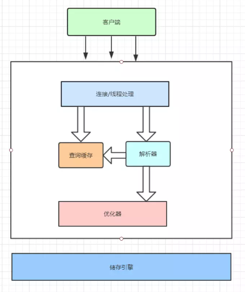
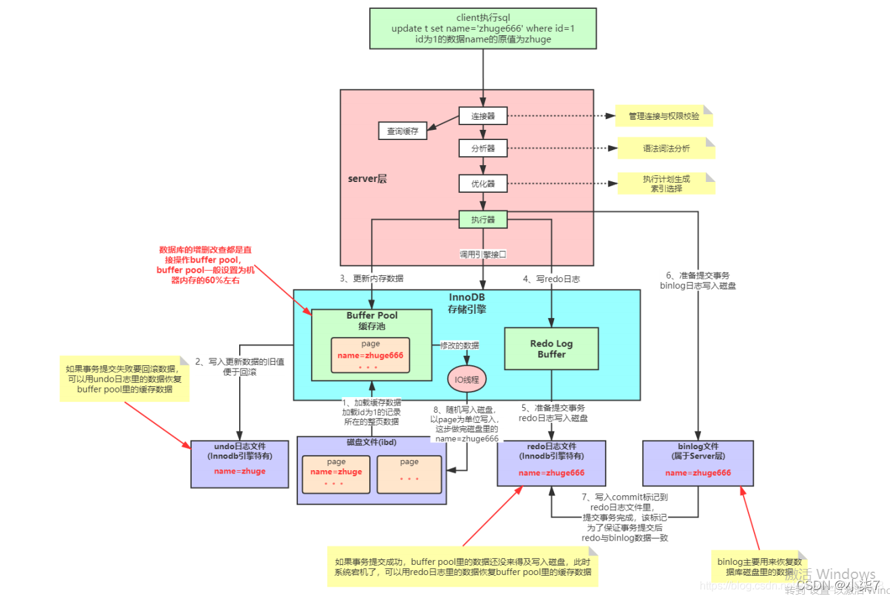
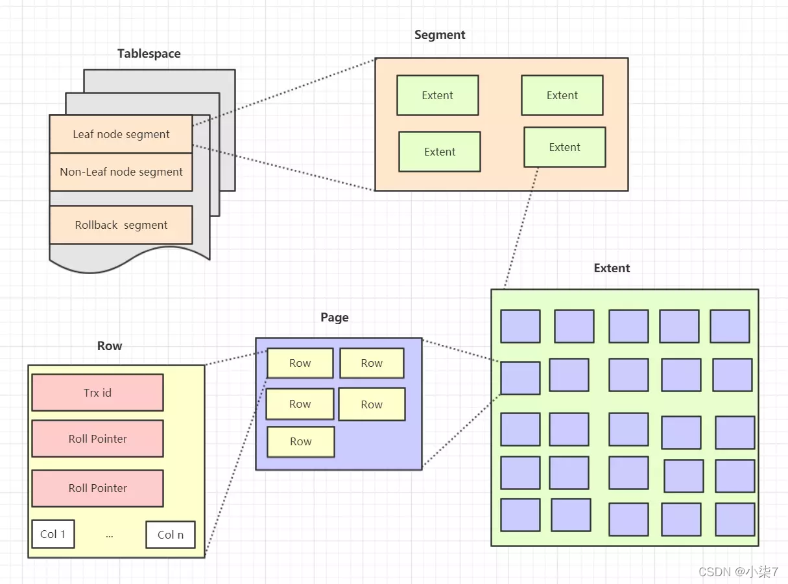
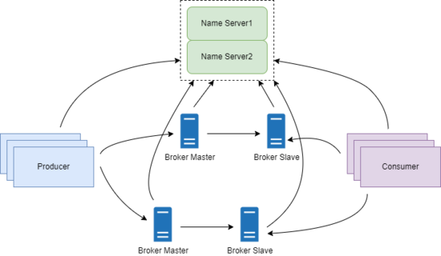
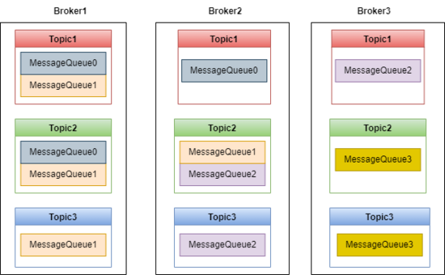
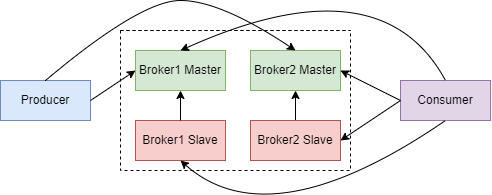
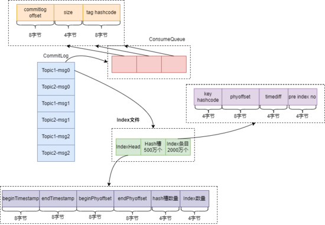
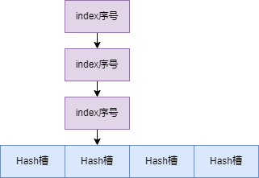

# 经典系统架构图

## Mysql

### Mysql逻辑架构

### 详细架构图

### 逻辑存储结构图

​			从InnoDb 存储引擎的逻辑存储结构看，所有数据都被逻辑地存放在一个空间中，称之为表空间（tablespace）。表空间又由段（segment），区（extent），**页（page）**组成。

​			页在一些文档中有时候也称为块（block）。

​			InnoDb 逻辑存储结构图如下：

表空间（tablespace）

+ 表空间是Innodb存储引擎逻辑的最高层，所有的数据都存放在表空间中。
+ 默认情况下，Innodb存储引擎有一个共享表空间ibdata1,即所有数据都存放在这个表空间中内。
+ 如果启用了innodb_file_per_table参数，需要注意的是每张表的表空间内存放的只是数据、索引、和插入缓冲Bitmap，其他类的数据，比如回滚(undo)信息、插入缓冲检索页、系统事物信息，二次写缓冲等还是放在原来的共享表内的。

段（segment）

+ 表空间由段组成，常见的段有数据段、索引段、回滚段等。

+ InnoDB存储引擎表是索引组织的，因此数据即索引，索引即数据。数据段即为B+树的叶子结点，索引段即为B+树的非索引结点。
+ 在InnoDB存储引擎中对段的管理都是由引擎自身所完成，DBA不能也没必要对其进行控制。

区（extent）

+ 区是由连续页组成的空间，在任何情况下每个区的大小都为1MB。
+ 为了保证区中页的连续性，InnoDB存储引擎一次从磁盘申请4~5个区。

+ 默认情况下，InnoDB存储引擎页的大小为16KB，一个区中一共64个连续的区。

页（page）

+ 页是InnoDB磁盘管理的最小单位。
+ 在InnoDB存储引擎中，默认每个页的大小为16KB。
+ 从InnoDB1.2.x版本开始，可以通过参数innodb_page_size将页的大小设置为4K，8K，16K。
+ InnoDB存储引擎中，常见的页类型有：数据页，undo页，系统页，事务数据页，插入缓冲位图页，插入缓冲空闲列表页等。

## Rocket MQ

### 集群架构

### MessageQueue

### Consumer

图中，Topic1 的消息写入了两个 MessageQueue，两个队列保存在 Broker1 和 Broker2 上。

RocketMQ 通过 Consumer Group 实现消息广播。比如上图中有两个消费者组，每个消费者组有两个消费者。

一个消费者可以消费多个 MessageQueue，但是同一个 MessageQueue 只能被同一个消费者组的一个消费者消费。比如 MessageQueue0 只能被 Consumer Group1 中的 Consumer1 消费， 不能被 Consumer2 消费。

### Broker 高可用集群

​			Broker 通过主从集群来实现消息高可用。跟 Kafka 不同的是，RocketMQ 并没有 Master 节点选举功能，而是采用多 Master 多 Slave 的集群架构。Producer 写入消息时写入 Master 节点，Slave 节点主动从 Master 节点拉取数据来保持跟 Master 节点的数据一致。

​			Consumer 消费消息时，既可以从 Master 节点拉取数据，也可以从 Slave 节点拉取数据。 到底是从 Master 拉取还是从 Slave 拉取取决于 Master 节点的负载和 Slave 的同步情况 。如果 Master 负载很高，Master 会通知 Consumer 从 Slave 拉取消息，而如果 Slave 同步消息进度延后，则 Master 会通知 Consumer 从 Master 拉取数据。总之，从 Master 拉取还是从 Slave 拉取由 Master 来决定。

​			如果 Master 节点发生故障，RocketMQ 会使用基于 raft 协议的 DLedger 算法来进行主从切换。

​			Broker 每隔 30s 向 Name Server 发送心跳，Name Server 如果 120s 没有收到心跳，就会判断 Broker 宕机了。

### 消息存储

RocketMQ 的存储设计是非常有创造性的。存储文件主要有三个：CommitLog、ConsumeQueue、Index。如下图：

### CommitLog
​			RocketMQ 的消息保存在 CommitLog 中，CommitLog 每个文件 1G 大小。有趣的是，文件名并不叫 CommitLog，而是用消息的偏移量来命名。比如第一个文件文件名是 0000000000000000000，第二个文件文件名是 00000000001073741824，依次类推就可以得到所有文件的文件名。

有了上面的命名规则，给定一个消息的偏移量，就可以根据二分查找快速找到消息所在的文件，并且用消息偏移量减去文件名就可以得到消息在文件中的偏移量。

Reocket MQ 写 CommitLog 时采用顺序写，大大提高了写入性能。

### ConsumeQueue
​			如果直接从 CommitLog 中检索 Topic 中的一条消息，效率会很低，因为需要从文件的第一条消息开始依次查找。引入了 ConsumeQueue 作为 CommitLog 的索引文件，会让检索效率大增。

​			刚开始不理解 ConsumeQueue 和 MessageQueue 的区别，网上查了一些资料发现，每个ConsumeQueue对应一个上面介绍的 MessageQueue，MessageQueue 只是一个概念模型。

ConsumeQueue 中的元素内容如下：

+ 前 8 个字节记录消息在 CommitLog 中的偏移量。
+ 中间 4 个字节记录消息消息大小。
+ 最后 8 个字节记录消息中 tag 的 hashcode。

这个 tag 的作用非常重要，假如一个 Consumer 订阅了 TopicA，Tag1 和 Tag2，那这个 Consumer 的订阅关系如下图：

可以看到，这个订阅关系是一个 hash 类型的结构，key 是 Topic 名称，value 是一个 SubscriptionData 类型的对象，这个对象封装了 tag。

拉取消息时，首先从 Name Server 获取订阅关系，得到当前 Consumer 所有订阅 tag 的 hashcode 集合 codeSet，然后从 ConsumerQueue 获取一条记录，判断最后 8 个字节 tag hashcode 是否在 codeSet 中，以决定是否将该消息发送给Consumer。

### index 文件
​			RocketMQ 支持按照消息的属性查找消息，为了支持这个功能，RocketMQ 引入了 Index 索引文件。Index 文件有三部分组成，文件头 IndexHead、500万个 hash 槽和 2000 万个 Index 条目组成。

#### IndexHead

​			总共有 6 个元素组成，前两个元素表示当前这个 Index 文件中第一条消息和最后一条消息的落盘时间，第三、第四两个元素表示当前这个 Index 文件中第一条消息和最后一条消息在 CommitLog 文件中的物理偏移量，第五个元素表示当前这个 Index 文件中 hash 槽的数量，第六个元素表示当前这个 Index 文件中索引条目的个数。

​			查找的时候除了传入 key 还需要传入第一条消息和最后一条消息的落盘时间，这是因为 Index 文件名是时间戳命名的，传入落盘时间可以更加精确地定位 Index 文件。

#### Hash 槽

​			熟悉 Java 中 HashMap 的同学应该都比较熟悉 Hash 槽这个概念了，其实就是 Hash 结构的底层数组。Index 文件中的 Hash 槽有 500 万个数组元素，每个元素是 4 个字节 int 类型元素，保存当前槽下最新的那个 index 条目的序号。

​			这里 Hash 槽解决 Hash 冲突的方式是链表法，如下图：

#### Index 条目

​			每个 Index 条目中，key 的 hashcode 占 4 个字节，phyoffset 表示消息在 CommitLog 中的物理偏移量占 8 个字节，timediff  表示消息的落盘时间与 header 里的 beginTimestamp 的差值占 4 个字节，pre index no 占 4 个字节。

​			pre index no 保存的是当前的 Hash 槽中前一个 index 条目的序号，一般在 key 发生 Hash 冲突时才会有值，否则这个值就是 0，表示当前元素是 Hash 槽中第一个元素。

​			Index 条目中保存 timediff，是为了防止 key 重复。 查找 key 时，在 key 相同的情况下， 如果传入的时间范围跟 timediff 不满足，则会查找 pre index no 这个条目。

#### 本节总结

通过上面的分析，我们可以总结一个通过 key 在 Index 文件中查找消息的流程，如下：

+ 计算 key 的 hashcode；
+ 根据 hashcode 在 Hash 槽中查找位置 s
+ 计算 Hash 槽在 Index 文件中位置 40+(s-1)*4
+ 读取这个槽的值，也就是Index条目序号 n；
+ 计算该 index 条目在 Index 文件中的位置，公式：40 + 500万 * 4 + (n-1) * 20；
+ 读取这个条目，比较 key 的 hashcode 和 index 条目中 hashcode是否相同，以及 key 传入的时间范围跟 Index 条目中的 timediff 是否匹配。如果条件不符合，则查找 pre index no 这个条目，找到后，从 CommitLog 中取出消息。