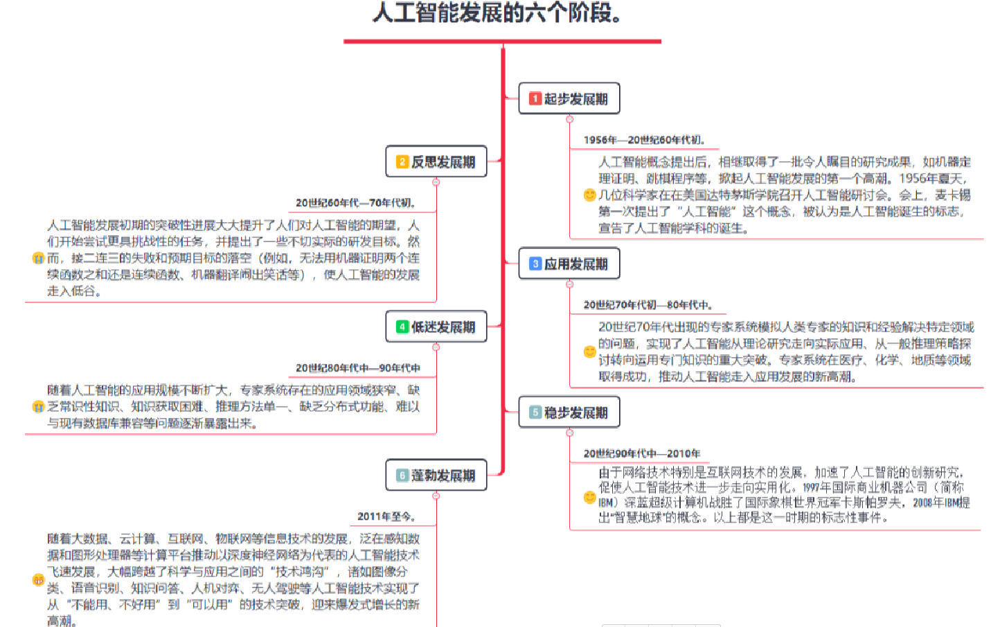
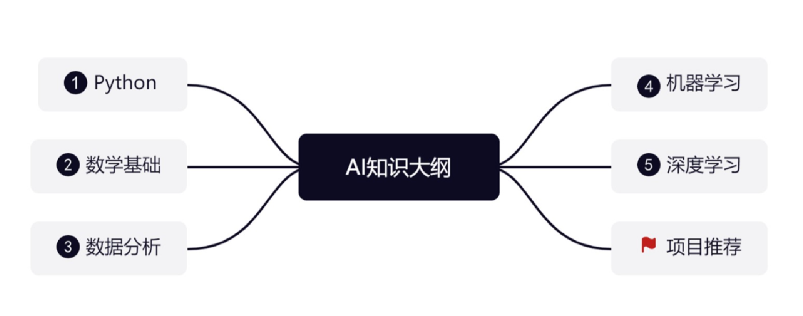
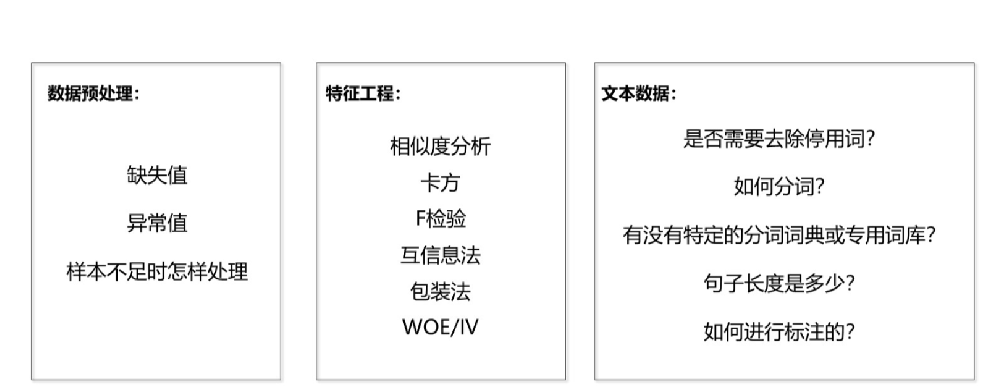
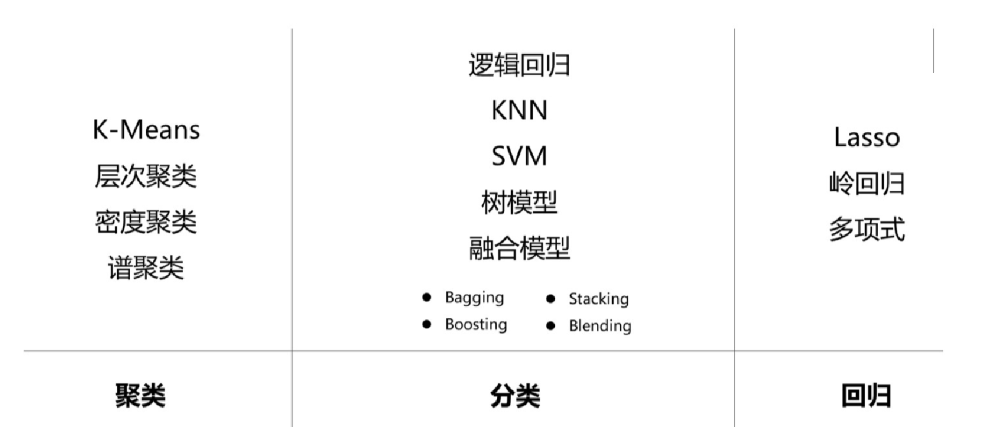
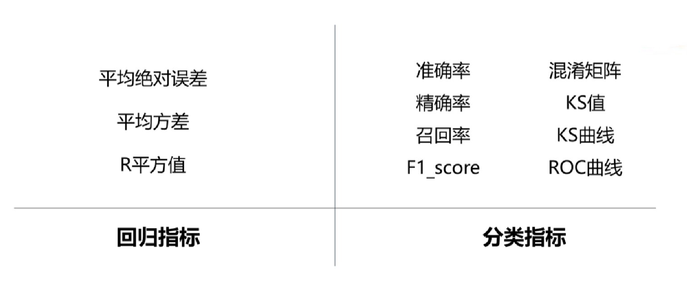

# IT领域

## 概述

+ 计算机的发展历史：我们所使用的计算工具是随着生产的发展和社会的进步，从简单到复杂、从低级到高级的发展过程，计算工具相继出现了算盘、计算尺、手摇机械计算机、电动机械计算机等。世界上第一台电子数字计算机（ENIAC）于1946年在美国宾夕法尼亚大学诞生，这台计算机共用了18000多个电子管组成，占地170平方米，总重量为30t，耗电150kw/h，运算速度达5000次/s，是计算机发展史上的第一个里程碑。
+ 计算机的作用：提升人对于数据的能力，到如今计算机还包含了数据存储、流转、展示等功能
+ 个人在计算机软件领域发展划分：人工只能、应用服务、基建设施

## 人工智能领域

### 概述

+ 人工智能，简称AI，是英文artificial intelligence的缩写。
+ 人工智能是一门学科。它是研究、开发用于模拟、延伸和扩展人的智能的理论、方法、技术及应用系统的一门新的技术科学，其研究的主要内容包括：机器学习、计算机视觉、智能语音、自然语言理解、智能机器人等方面。
+ 它是当前科学技术迅速发展及新思想、新理论、新技术不断涌现的形势下产生的一个学科，也是一门涉及数学、计算机科学、哲学、认知心理学和心理学、信息论、控制论等学科的交叉和边缘学科。
+ 简单来说：人工智能（artificial intelligence）——使一部机器的反应方式想人类一样进行感知，认识，决策，执行的人工程序或系统。

### 历史

1. 第一次人工智能热潮：20世纪50年代到60年代 第一次热潮：图灵测试：以图灵测试为标志，数学证明系统，知识推理系统，专家系统等里程碑式的技术和应用在研究者中掀起了第一次热潮。然而，在那个年代，无论是计算的的运算速度还是相关程序设计预算法理论，都远不足以支撑人工智能发展需要。而且热潮退却后，人们清晰认识到，这个时候的人工智能，除了通过测试外，它还干不成什么事！至2017年的今天，仍未有计算机真正意义上通过图灵测试。
2. 第二次人工智能热潮：20世纪80年代到90年代 第二次热潮：语音识别在这个阶段基于统计模型的技术悄然兴起，人工神经网络也在模式识别等应用领域有所建树。20世纪80-90年代，人工智能再次提上了风口浪尖，最为显著的就是语音识别的突破了。过去的语音识别更多的是专家系统也就是让机器认识每个音节音素，然后通过音节音素去分辨字和单词。但是这样的模型，越是用人类的思维去要求机器，机器越是学不懂，不仅只能认知很少范围的字节，而且不能分辨每个人的发音和说话方式，只能识别机器声音。后来，开创了统计学的模式：用数据本身建立大型基于语音数据的语料库，并在这个基础上基于统计学让机器自我运算和输出，但是还达不到机器自我学习深化的过程。
3. 第三次人工智能热潮**2006年至今 第三次热潮：深度学习**，今天的人工智能研究中，深度学习无人不谈，无人不识。之前好多做不了的事情，现在可以做到了，或者换句话说，就是能满足人们的需求了。第三次人工智能浪潮区别前两次在于，人工智能的产品打破了人们的预期，是真正做到了在识别方面比人类本身更智能更高效，是真正可以用的东西。
   1. 首先，计算机的计算性能和处理能力大幅提高。符合摩尔定律而指数级增长的计算机性能最终跨过了门槛。
   2. 其次，互联网的蓬勃发展为搜索引擎等公司带来了高质量的大数据。并且正是因计算机性能的提高人们得以储存和利用这些数据。

### 主要分支

#### 概述

通讯、感知与行动是现代人工智能的三个关键能力，在这里我们将根据这些能力/应用对这三个技术领域进行介绍：

- 计算机视觉（CV）、
- 自然语言处理（NLP）
  　 - 在NLP领域中，将覆盖文本挖掘/分类、机器翻译和语音识别。
- 机器人

#### 计算机视觉

计算机视觉（CV）是指机器感知环境的能力。这一技术类别中的经典任务有图像形成、图像处理、图像提取和图像的三维推理。物体检测和人脸识别是其比较成功的研究领域。

**当前阶段：**

计算机视觉现已有很多应用，这表明了这类技术的成就，也让我们将其归入到应用阶段。随着深度学习的发展，机器甚至能在特定的案例中实现超越人类的表现。但是，这项技术离社会影响阶段还有一定距离，那要等到机器能在所有场景中都达到人类的同等水平才行（感知其环境的所有相关方面）

#### 语音识别

语音识别是指识别语音（说出的语言）并将其转换成对应文本的技术。相反的任务（文本转语音/TTS）也是这一领域内一个类似的研究主题。

**当前阶段:**

语音识别已经处于应用阶段很长时间了。最近几年，随着大数据和深度学习技术的发展，语音识别进展颇丰，现在已经非常接近社会影响阶段了。　　

语音识别领域仍然面临着声纹识别和鸡尾酒会效应，等一些特殊情况的难题。现代语音识别系统严重依赖于云，在离线时可能就无法取得理想的工作效果。

#### 文本挖掘/分类

这里的文本挖掘主要是指文本分类，该技术可用于理解、组织和分类结构化或非结构化文本文档。其涵盖的主要任务有句法分析、情绪分析和垃圾信息检测。

**当前阶段：**

　　我们将这项技术归类到应用阶段，因为现在有很多应用都已经集成了基于文本挖掘的情绪分析或垃圾信息检测技术。文本挖掘技术也在智能投顾的开发中有所应用，并且提升了用户体验。文本挖掘和分类领域的一个瓶颈出现在歧义和有偏差的数据上。

#### 机器翻译

机器翻译（MT）是利用机器的力量自动将一种自然语言（源语言）的文本翻译成另一种语言（目标语言）。

**当前阶段：**

　　机器翻译是一个见证了大量发展历程的应用领域。该领域最近由于神经机器翻译而取得了非常显著的进展，但仍然没有全面达到专业译者的水平；但是，我们相信在大数据、云计算和深度学习技术的帮助下，机器翻译很快就将进入社会影响阶段。

　　在某些情况下，俚语和行话等内容的翻译会比较困难（受限词表问题）。

​		专业领域的机器翻译（比如医疗领域）表现通常不好。

#### 机器人

机器人学（Robotics）研究的是机器人的设计、制造、运作和应用，以及控制它们的计算机系统、传感反馈和信息处理。

机器人可以分成两大类：固定机器人和移动机器人。固定机器人通常被用于工业生产（比如用于装配线）。常见的移动机器人应用有货运机器人、空中机器人和自动载具。机器人需要不同部件和系统的协作才能实现最优的作业。其中在硬件上包含传感器、反应器和控制器；另外还有能够实现感知能力的软件，比如定位、地图测绘和目标识别。

**当前阶段：**

自上世纪[Robot]一词诞生以来，人们已经为工业制造业设计了很多机器人。工业机器人是增长最快的应用领域，它们在20世纪80年代将这一领域带入了应用阶段。在安川电机、Fanuc、ABB、库卡等公司的努力下，我们认为进入21世纪之后，机器人领域就已经进入了社会影响阶段，此时各种工业机器人已经主宰了装配生产线。此外，软体机器人在很多领域也有广泛的应用，比如在医疗行业协助手术或在金融行业自动执行承销过程。

但是，法律法规和[机器人威胁论]，可能会妨碍机器人领域的发展。还有设计和制造机器人需要相对较高的投资。

### 学习大纲

#### 概述

#### 机器学习

从机器学习开始就正式进入到了人工智能的领域。ML涉及的算法都是白盒算法，使用可解释的数学公式去拟合数据、学习参数然后进行预测，最后对模型进行评估。

这部分的知识需要大家从数据处理过程开始就多进行总结与反思：

+ 数据清洗过程与特征工程是怎么做的？为什么会最终选用这些方法？
+ 文本数据集常用的处理方法有哪些？适用的场景的是什么？

机器学习算法因为都有可解释性，所以**大家需要搞懂数学原理，并知道模型之间的差异、以及适用于什么数据集**。

对于回归任务与分类任务，我们也需要知道各种评估指标间的差异与使用场景。

#### 深度学习

深度学习是黑盒算法，不具可解释性，初学者通常会觉得它比较神秘。但它的基础神经网络，可以说是由众多个逻辑回归函数组成

机器学习的特征工程步骤是要靠手动完成的，而且需要大量领域专业知识

深度学习通常由多个层组成，它们通常将更简单的模型组合在一起，通过将数据从一层传递到另一层来构建更复杂的模型。通过大量数据的训练自动得到模型，不需要人工设计特征提取环节。

有些人认为深度学习是机器学习的进阶。你可能已经体验到了深度学习编程的成果而不自知！观看 Netflix时你有没有注意到它的推荐内容？一些流媒体音乐服务会根据你听过的歌曲或者你点过赞标过“喜欢”的歌曲来为你推荐歌曲目录。这两种能力都基于深度学习。谷歌的语音识别和图像识别算法也使用了深度学习。

正如机器学习被认定为一种人工智能一样，深度学习通常被认定为机器学习的一种——有人称之为机器学习子集。机器学习使用预测模型等更为简单的概念，而深度学习使用意在模仿人类思考和学习方式的人工神经网络。你可还记得高中生物学中提到过，人类大脑的主要细胞成分和主要计算元素是神经元，每个神经元连接就像一台小型计算机。大脑中的神经元网络负责处理视觉、感觉、嗅觉等各种输入。

与机器学习一样，深度学习计算机系统也需要我们输入大量的信息，但这些信息通常以巨大数据集的形式存在，因为深度学习系统需要大量数据才能充分了解信息进而返回准确的结果。然后人工神经网络根据数据提出一系列二进制真/假问题，涉及高度复杂的数学计算，并根据收到的答案对数据进行分类。

因此，尽管机器学习和深度学习都属于人工智能的一般分类，并且都从数据输入中“学习”，但机器学习和深度学习之间存在一些关键差异。

基本的机器学习应用程序包括预测程序（例如预测股票市场的价格或下一次飓风袭击的时间和地点）、垃圾邮件标识符以及为医疗患者设计循证治疗计划的程序。除了上面提到的 Netflix、音乐流媒体服务和面部识别的例子之外，深度学习另一个广为人知的应用领域便是自动驾驶汽车——该程序使用多层神经网络来做一些事情，比如确定要避开的物体、识别交通灯并知道何时加速或减速。

### 题外话

#### 强人工智能

强人工智能观点认为“有可能”制造出“真正”能推理和解决问题的智能机器，并且，这样的机器将被认为是具有知觉、有自我意识的。强人工智能可以有两类：

- 人类的人工智能，即机器的思考和推理就像人的思维一样。
- 非人类的人工智能，即机器产生了和人完全不一样的知觉和意识，使用和人完全不一样的推理方式。

#### 弱人工智能

弱人工智能观点认为“不可能”制造出能“真正”地推理和解决问题的智能机器，这些机器只不过“看起来”像是智能的，但是并不真正拥有智能，也不会有自主意识。

弱人工智能是对比强人工智能才出现的，因为人工智能的研究一度处于停滞不前的状态下，直到类神经网络有了强大的运算能力加以模拟后，才开始改变并大幅超前。但人工智能研究者不一定同意弱人工智能，也不一定在乎或者了解强人工智能和弱人工智能的内容与差别，对定义争论不休。

就当下的人工智能研究领域来看，研究者已大量造出“看起来”像是智能的机器，获取相当丰硕的理论上和实质上的成果，如2009年康乃尔大学教授Hod Lipson 和其博士研究生Michael Schmidt 研发出的 Eureqa计算机程序，只要给予一些数据，这计算机程序自己只用几十个小时计算就推论出牛顿花费多年研究才发现的牛顿力学公式，等于只用几十个小时就自己重新发现牛顿力学公式，这计算机程序也能用来研究很多其他领域的科学问题上。这些所谓的弱人工智能在神经网络发展下已经有巨大进步，但对于要如何集成成强人工智能，现在还没有明确定论。

## 应用服务领域

### 概述

这个领域通常来说就是每个人使用电脑APP，或者手机APP，最为贴近人们的生活，对于大多数人来说，能够感知到计算机领域位置带来的生活改变。

领域通常分为两类：

+ 企业管理数字化
+ 互联网服务
+ 各类生活或者工作App

### 工作分类

+ 前端开发工程师
+ 后端开发工程
+ 测试工程师
+ 运维工程师
+ 网络安全工程师
+ ......

### 当前现状

从2000年开始到现在互联网发展繁荣昌盛的20多年，中国的IT行业发展迅速，产生了诸多的IT岗位：前端开发工程师、后端开发工程师、测试工程师、运维工程师、网络安全工程师等等，当前也是就业人数最多的it应用方向。不过相对于人工智能、基建设施，门槛偏低，能够通过短时间的培训或自学实现入行，因为这个IT的方向最中重要的偏应用，虽然很多面试中会问到某些框架或中间件的实现原理，但核心仍然是为了更好的为应用提供服务，这部分的研究属性和创新属性相对较低。

### 与其他两个领域

+ 人工智能、基建设施都是门槛相对较高的两个领域、应用服务领域门槛相对较低
+ IT行业各个方向发展虽然不同，但是彼此有着千丝万缕的关系，应用服务想要提升系统性能和用户体验，就需要依托于其他两个领域，其他两个领域的工作成果往往会反哺应用服务领域
+ 三者之间的关系形成一个闭环，相互相辅相成

## 基建设施领域

### 概述

偏向于计算机底层原理

+ 数据库设计
+ 中间件开发
+ 编程语言优化
+ ......

这一部分的内容通常是去解决一些编程无法处理或现有中间件不满足应用的一些问题，比如一门新的编程语言（Go）、一种新的数据库（TiDB）、一个新的中间件（如：Kafka）.....等等。通常来说，一个新的基建设施，可能会极大的改变当前的It发现现状，但是这种机会少之又少，运气、能力二者缺一不可。这种事情往往需要这个行业一起去发展，单靠某一个人或者企业很难实现，而且需要经过长时间的检验才可以。

### go历史

设计Go语言是为了解决当时Google开发遇到的以下这些问题：

+ 大量的C++代码，同时又引入了Java和Python
+ 成千上万的工程师
+ 数以万计行的代码
+ 分布式的编译系统
+ 数百万的服务器

其主要有以下几个方面的痛点

+ 编译慢
+ 失控的依赖
+ 每个工程师只是用了一个语言里面的一部分
+ 程序难以维护（可读性差、文档不清晰等）
+ 更新的花费越来越长
+ 交叉编译困难

　　所以，他们当时设计Go的目标是为了消除各种缓慢和笨重、改进各种低效和扩展性。Go是由那些开发大型系统的人设计的，同时也是为了这些人服务的；它是为了解决工程上的问题，不是为了研究语言设计；它还是为了让我们的编程变得更舒适和方便。但是结合Google当时内部的一些现实情况，如很多工程师都是C系的，所以新设计的语言一定要易学习，最好是C-like的语言；因为有太多的分布式系统、太多的开发者，所以新的语言一定要可以Scale，这个包括开发、工程师、代码、部署和依赖；20年没有出新的语言了，所以新设计的语言必须是现代化的（例如内置GC）等情况。

### go应用方向

+  区块链应用
+ 后端服务器应用（并发）
+ 云计算和云服务开发（热门）