# DDD

## 参考资料

+ [结合DDD讲清楚：后端系统分析七大维度（长文多图）](https://juejin.cn/post/7201665010199330877#heading-17)

## 核心概念

+ 战略设计：限界上下文、通用语言，子域
+ 战术设计：聚合、实体、值对象、资源库、领域服务、领域事件、模块

### 领域

DDD中最重要的一个概念，也是黑话中说的最多的，领域指的是特定的业务问题领域，是专门用来确定业务的边界。

### 子域

有时候一个业务领域可能比较复杂，因此会被分为多个子域，子域分为了如下几种:

- 核心子域：业务成功的核心竞争力。用人话来说，就是领域中最重要的子域，如果没有它其他的都不成立，比如用户服务这个领域中的用户子域
- 通用子域：不是核心，但被整个业务系统所使用。在领域这个层面中，这里指的是通用能力，比如通用工具，通用的数据字典、枚举这类（感叹DDD简直恨不得无孔不入）。在整个业务系统这个更高层面上，也会有通用域的存在，指的通用的服务（用户服务、权限服务这类公共服务可以作为通用域）。
- 支撑子域：不是核心，不被整个系统使用，完成业务的必要能力。

### 通用语言

指的是一个领域内，同一个名词必须是同一个意思，即统一交流的术语。比如我们在搞用户中心的时候，用户统一指的就是系统用户，而不能用其他名词来表达，目的是提高沟通的效率以及增加设计的可读性

### 限界上下文

限界上下文指的是领域的边界，通常来说，在比较高的业务层面上，一个限界上下文之内即一个领域。这里用一张不太好看的图来解释

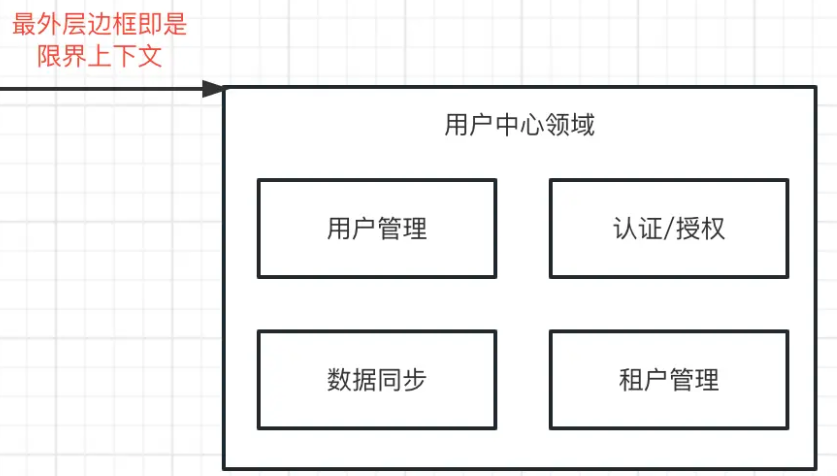

### 事件风暴

指的是领域内的业务事件，比如用户中心中，新增用户，授权，用户修改密码等业务事件。

### 头脑风暴

用最俗的人话解释，就是一堆人坐在一个小会议室中开会，去梳理业务系统都有哪些业务事件。

### 领域事件

领域内，子域和子域之间交互的事件，如用户服务中用户和角色交互是为用户分配角色，或者是为角色批量绑定用户，这里的领域事件有两个，一个是“为用户分配角色”,另一个是“为角色批量绑定用户”。

### 实体

这里可以理解为有着唯一标识符的东西，比如用户实体。

### 值对象

实体的具体化，比如用户实体中的张三和李四。

实体和值对象可以简单的理解成java中类和对象，只不过这里通常需要对应数据实体。

### 聚合

实体和实体之间需要共同协作来让业务运转，比如我们的授权就是给用户分配一个角色，这里涉及到了用户和角色两个实体，这个聚合即是用户和角色的关系。

### 聚合根

聚合根是聚合的管理者，即一个聚合中必定是有个聚合根的，通常它也是对外的接口。比如说，在给用户分配角色这个事件中涉及两个实体分别是用户和角色，这时候用户就是聚合根。而当这个业务变成给角色批量绑定用户的时候，聚合根就变成了角色。即使没有这样一个名词，我们也会有这样一个标准，让业务按照既定规则来运行，举个上文中的例子，给用户A绑定角色1，用户为聚合根，这样往后去查看用户拥有的角色，也是以用户的唯一标识来查，即访问聚合必须通过聚合根来访问，这个也就是聚合根的作用。

### 事件模型

领域事件是一个领域模型中极其重要的部分，用来表示领域中发生的事件。忽略不相关的领域活动，同时明确领域专家要跟踪或希望被通知的事情，或与其他模型对象中的状态更改相关联

**领域事件 = 事件发布 + 事件存储 + 事件分发 + 事件处理。**

> 比如下订单后，给用户增长积分与赠送优惠券的需求。如果使用瀑布流的方式写代码。一个个逻辑调用，那么不同用户，赠送的东西不同，逻辑就会变得又臭又长。这里的比较好的方式是，用户下订单成功后，发布领域事件，积分聚合与优惠券聚合监听订单发布的领域事件进行处理。

### 架构设计

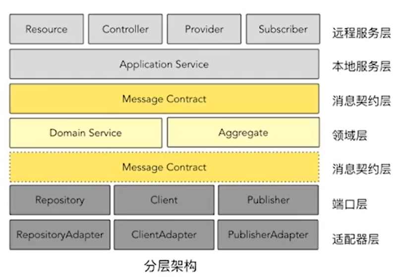

+ 远程服务层：提供对外的服务接口，通过调用本地的服务实现功能
+ 本地服务层：完成实际功能的组成
+ 消息契约层：在本地服务层之间流转的对象可能并不适合领域层的对象，所以这一层实现了一个对象的适配
+ 领域层：真正实现各个领域的工作内容
+ 消息契约层：对外发送消息的时候，Pojo对象与消息对象之间的转换
+ 端口层：实现远程调用、消息传递、事件发布等功能
+ 适配器层：实现对象之间的转化

## 流程三剑客

用例图是从外部视角描述系统，但是分析系统总是要深入系统内部的，其中流程视图就是描述系统内如何流转的视图。活动图、序列图、状态机图是流程视图中最重要的三种视图，我们称为流程三剑客。三者侧重点有所不同：活动图侧重于逻辑分支，顺序图侧重于交互，状态机图侧重于状态流转。

### 活动图

活动图适合描述复杂逻辑分支，设想这样一种业务场景，球队需要选出一名球员成为球队的足球先生，选拔标准如下：前场、中场、后场、门将各选出一名候选球员。前场队员依次比较进球数、助攻数，中场队员依次比较助攻数、抢断数，后场队员依次比较解围数、抢断数，门将依次比较扑救数、扑点数，如果所有指标均相同则抽签。每个位置有人选之后，全体教练组投票，如果投票数相同则抽签。

我们经常说一图胜千言，其中一个重要原因是文字是线性的，所以表达逻辑分支能力不如流程视图，而在流程视图中表达逻辑分支能力最强的是活动图。

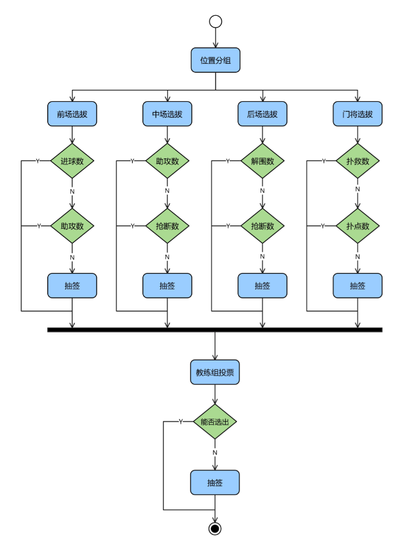

### 顺序图

顺序图侧重于交互，适合按照时间顺序体现一个业务流程中交互细节，但是顺序图并不擅长体现复杂逻辑分支。

如果某个逻辑分支特别重要，可以选择再画一个顺序图。例如支付流程中有支付成功正常流程，也有支付失败异常流程，这两个流程都非常重要，所以可以用两张顺序图体现。回到本文实例，我们可以通过顺序图体现球员从提出转会到比赛全流程。

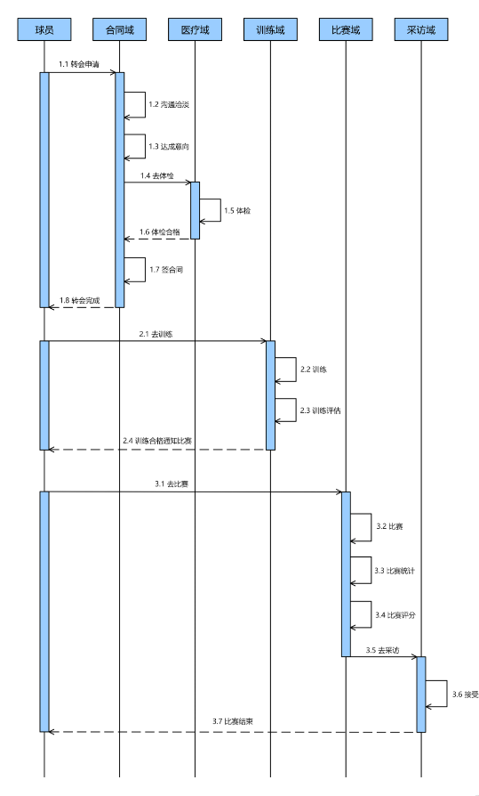

### 状态机图

假设一条数据有ABC三种状态，从正常业务角度来看，状态只能从A流转到B，再从B流转到C，不能乱序也不可逆。但是可能出现这种异常情况：数据当前状态为A，接收异步消息更改状态，B消息由于延时晚于C消息，最终导致状态先改为C再改为B，那么此时状态就是错误的。

状态机图侧重于状态流转，说明了哪些状态之间可以相互流转，再结合状态机代码模式，可以解决上述状态异常情况。回到本文实例，我们可以通过状态机图表示球员从提出转会到签约整个状态流程。

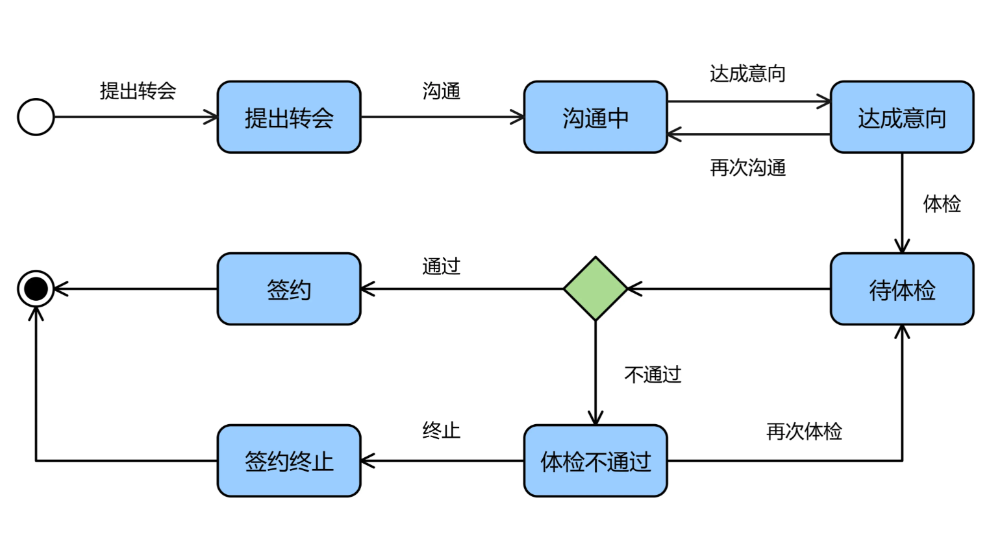

## 领域与数据

对比两组概念：值对象与实体，领域对象与数据对象。

实体是具有唯一标识的对象，唯一标识会伴随实体对象整个生命周期并且不可变更。值对象本质上是属性的集合，没有唯一标识。

领域对象与数据对象一个重要的区别是值对象存储方式。领域对象在包含值对象的同时也保留了值对象的业务含义，而数据对象可以使用更加松散的结构保存值对象，简化数据库设计。

现在我们需要管理足球运动员基本信息和比赛数据，对应领域模型和数据模型应该如何设计？姓名、身高、体重是一名运动员本质属性，加上唯一编号可以对应实体对象。跑动距离，传球成功率，进球数是运动员比赛表现，这些属性的集合可以对应值对象。

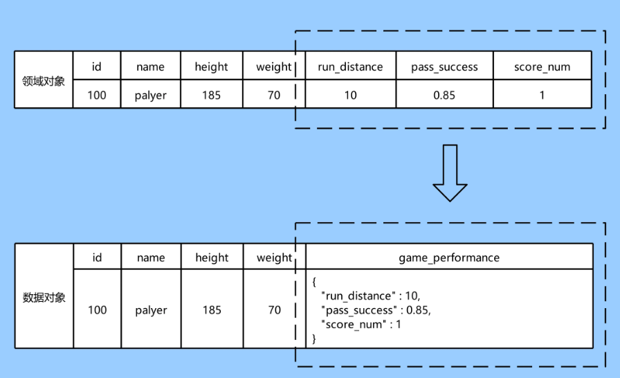

我们根据图示编写领域对象与数据对象代码：

~~~java

// 数据对象
public class FootballPlayerDO {
    private Long id;
    private String name;
    private Integer height;
    private Integer weight;
    private String gamePerformance;
}

// 领域对象
public class FootballPlayerDMO {
    private Long id;
    private String name;
    private Integer height;
    private Integer weight;
    private GamePerformanceVO gamePerformanceVO;
}

public class GamePerformanceVO {
    private Double runDistance;
    private Double passSuccess;
    private Integer scoreNum;
}
~~~

为什么要采用JSON存储值对象？因为脚本化是一种拓展灵活性的方式，脚本化不仅指使用groovy、QLExpress脚本增强系统灵活性，还包括松散可扩展的数据结构。数据模型抽象出了姓名、身高、体重这些基本属性，对于频繁变化的比赛表现属性，这些属性值可能经常变化，甚至属性本身也是经常变化，可能会加上射门次数，突破次数等，所以采用松散结构进行存储。

如果需要根据JSON结构中KEY进行检索，例如查询进球数大于5的球员，这也不是没有办法。我们可以将MySQL表中数据平铺到ES中，一条数据根据JSON KEY平铺变成多条数据，这样就可以进行检索了。

### 纵横做设计

复杂业务之所以复杂，一个重要原因是涉及角色或者类型较多，很难平铺直叙地进行设计，所以我们需要增加分析维度。其中最常见的是增加横向和纵向两个维度，本文也着重讨论两个维度。总体而言横向扩展的是思考广度，纵向扩展的是思考深度，对应到系统设计而言可以总结为：纵向做隔离，横向做编排。

我们首先分析一个下单场景做铺垫。当前有ABC三种订单类型，

+ A订单价格9折，物流最大重量不能超过8公斤，不支持退款。
+ B订单价格8折，物流最大重量不能超过5公斤，支持退款。
+ C订单价格7折，物流最大重量不能超过1公斤，支持退款。

按照需求字面含义平铺直叙地写代码也并不难：

~~~java
public class OrderServiceImpl implements OrderService {

    @Resource
    private OrderMapper orderMapper;

    @Override
    public void createOrder(OrderBO orderBO) {
        if (null == orderBO) {
            throw new RuntimeException("参数异常");
        }
        if (OrderTypeEnum.isNotValid(orderBO.getType())) {
            throw new RuntimeException("参数异常");
        }
        // A类型订单
        if (OrderTypeEnum.A_TYPE.getCode().equals(orderBO.getType())) {
            orderBO.setPrice(orderBO.getPrice() * 0.9);
            if (orderBO.getWeight() > 9) {
                throw new RuntimeException("超过物流最大重量");
            }
            orderBO.setRefundSupport(Boolean.FALSE);
        }
        // B类型订单
        else if (OrderTypeEnum.B_TYPE.getCode().equals(orderBO.getType())) {
            orderBO.setPrice(orderBO.getPrice() * 0.8);
            if (orderBO.getWeight() > 8) {
                throw new RuntimeException("超过物流最大重量");
            }
            orderBO.setRefundSupport(Boolean.TRUE);
        }
        // C类型订单
        else if (OrderTypeEnum.C_TYPE.getCode().equals(orderBO.getType())) {
            orderBO.setPrice(orderBO.getPrice() * 0.7);
            if (orderBO.getWeight() > 7) {
                throw new RuntimeException("超过物流最大重量");
            }
            orderBO.setRefundSupport(Boolean.TRUE);
        }
        // 保存数据
        OrderDO orderDO = new OrderDO();
        BeanUtils.copyProperties(orderBO, orderDO);
        orderMapper.insert(orderDO);
    }
}

~~~

上述代码从功能上完全可以实现业务需求，但是程序员不仅要满足功能，还需要思考代码的可维护性。如果新增一种订单类型，或者新增一个订单属性处理逻辑，那么我们就要在上述逻辑中新增代码，如果处理不慎就会影响原有逻辑。

为了避免牵一发而动全身这种情况，设计模式中的开闭原则要求我们面向新增开放，面向修改关闭，我认为这是设计模式中最重要的一条原则。

需求变化通过扩展，而不是通过修改已有代码实现，这样就保证代码稳定性。扩展也不是随意扩展，因为事先定义了算法，扩展也是根据算法扩展，用抽象构建框架，用实现扩展细节。标准意义的二十三种设计模式说到底最终都是在遵循开闭原则。

如何改变平铺直叙的思考方式？这就要为问题分析加上纵向和横向两个维度，可以选择使用分析矩阵方法，其中纵向表示策略，横向表示场景。

### 纵向做隔离（策略模式）

纵向维度表示策略，不同策略在逻辑上和业务上应该是隔离的，

本实例包括

+ 优惠策略、
+ 物流策略
+ 退款策略，

策略作为抽象，不同订单类型去扩展这个抽象，策略模式非常适合这种场景。本文详细详细分析优惠策略，物流策略和退款策略同理。

~~~java
// 优惠策略
public interface DiscountStrategy {
    public void discount(OrderBO orderBO);
}

// A类型优惠策略
@Component
public class TypeADiscountStrategy implements DiscountStrategy {

    @Override
    public void discount(OrderBO orderBO) {
        orderBO.setPrice(orderBO.getPrice() * 0.9);
    }
}

// B类型优惠策略
@Component
public class TypeBDiscountStrategy implements DiscountStrategy {

    @Override
    public void discount(OrderBO orderBO) {
        orderBO.setPrice(orderBO.getPrice() * 0.8);
    }
}

// C类型优惠策略
@Component
public class TypeCDiscountStrategy implements DiscountStrategy {

    @Override
    public void discount(OrderBO orderBO) {
        orderBO.setPrice(orderBO.getPrice() * 0.7);
    }
}

// 优惠策略工厂
@Component
public class DiscountStrategyFactory implements InitializingBean {
    private Map<String, DiscountStrategy> strategyMap = new HashMap<>();

    @Resource
    private TypeADiscountStrategy typeADiscountStrategy;
    @Resource
    private TypeBDiscountStrategy typeBDiscountStrategy;
    @Resource
    private TypeCDiscountStrategy typeCDiscountStrategy;

    public DiscountStrategy getStrategy(String type) {
        return strategyMap.get(type);
    }

    @Override
    public void afterPropertiesSet() throws Exception {
        strategyMap.put(OrderTypeEnum.A_TYPE.getCode(), typeADiscountStrategy);
        strategyMap.put(OrderTypeEnum.B_TYPE.getCode(), typeBDiscountStrategy);
        strategyMap.put(OrderTypeEnum.C_TYPE.getCode(), typeCDiscountStrategy);
    }
}

// 优惠策略执行
@Component
public class DiscountStrategyExecutor {
    private DiscountStrategyFactory discountStrategyFactory;

    public void discount(OrderBO orderBO) {
        DiscountStrategy discountStrategy = discountStrategyFactory.getStrategy(orderBO.getType());
        if (null == discountStrategy) {
            throw new RuntimeException("无优惠策略");
        }
        discountStrategy.discount(orderBO);
    }
}

~~~

### 横向做编排

横向维度表示场景，一种订单类型在广义上可以认为是一种业务场景，在场景中将独立的策略进行串联，**模板方法**设计模式适用于这种场景。

模板方法模式是一般使用抽象类定义一个算法骨架，同时定义一些抽象方法，这些抽象方法延迟到子类实现，这样子类不仅遵守了算法骨架约定，也实现了自己的算法。既保证了规约也兼顾灵活性，这就是用抽象构建框架，用实现扩展细节。

~~~java
// 创建订单服务
public interface CreateOrderService {
    public void createOrder(OrderBO orderBO);
}

// 抽象创建订单流程
public abstract class AbstractCreateOrderFlow {

    @Resource
    private OrderMapper orderMapper;

    public void createOrder(OrderBO orderBO) {
        // 参数校验
        if (null == orderBO) {
            throw new RuntimeException("参数异常");
        }
        if (OrderTypeEnum.isNotValid(orderBO.getType())) {
            throw new RuntimeException("参数异常");
        }
        // 计算优惠
        discount(orderBO);
        // 计算重量
        weighing(orderBO);
        // 退款支持
        supportRefund(orderBO);
        // 保存数据
        OrderDO orderDO = new OrderDO();
        BeanUtils.copyProperties(orderBO, orderDO);
        orderMapper.insert(orderDO);
    }

    public abstract void discount(OrderBO orderBO);

    public abstract void weighing(OrderBO orderBO);

    public abstract void supportRefund(OrderBO orderBO);
}

// 实现创建订单流程
@Service
public class CreateOrderFlow extends AbstractCreateOrderFlow {

    @Resource
    private DiscountStrategyExecutor discountStrategyExecutor;
    @Resource
    private ExpressStrategyExecutor expressStrategyExecutor;
    @Resource
    private RefundStrategyExecutor refundStrategyExecutor;

    @Override
    public void discount(OrderBO orderBO) {
        discountStrategyExecutor.discount(orderBO);
    }

    @Override
    public void weighing(OrderBO orderBO) {
        expressStrategyExecutor.weighing(orderBO);
    }

    @Override
    public void supportRefund(OrderBO orderBO) {
        refundStrategyExecutor.supportRefund(orderBO);
    }
}
~~~

### 综合应用

上述实例业务和代码并不复杂，其实复杂业务场景也不过是简单场景的叠加、组合和交织，无外乎也是通过纵向做隔离、横向做编排寻求答案。

#### 纵向隔离

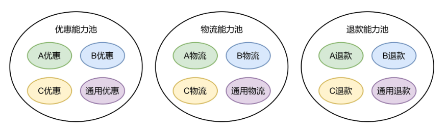

#### 横向隔离

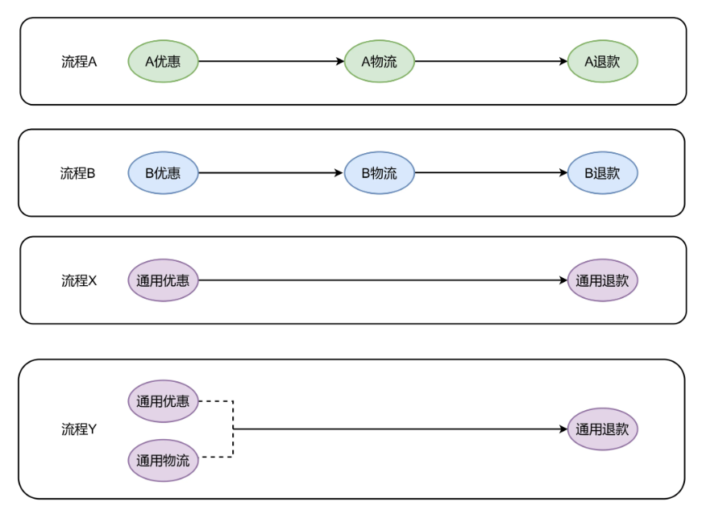

纵向维度抽象出能力池这个概念，能力池中包含许多能力，不同的能力按照不同业务维度聚合，例如优惠能力池，物流能力池，退款能力池。我们可以看到两种程度的隔离性，能力池之间相互隔离，能力之间也相互隔离。

横向维度将能力从能力池选出来，按照业务需求串联在一起，形成不同业务流程。因为能力可以任意组合，所以体现了很强的灵活性。除此之外，不同能力既可以串行执行，如果不同能力之间没有依赖关系，也可以如同流程Y一样并行执行，提升执行效率。

#### 使用

此时可以回到本文足球运动员管理系统，如果我们采用纵横思维，分析足球先生选拔业务场景可以得到下图：

**横向能力**

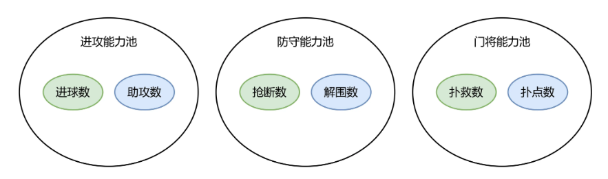

**纵向能力**

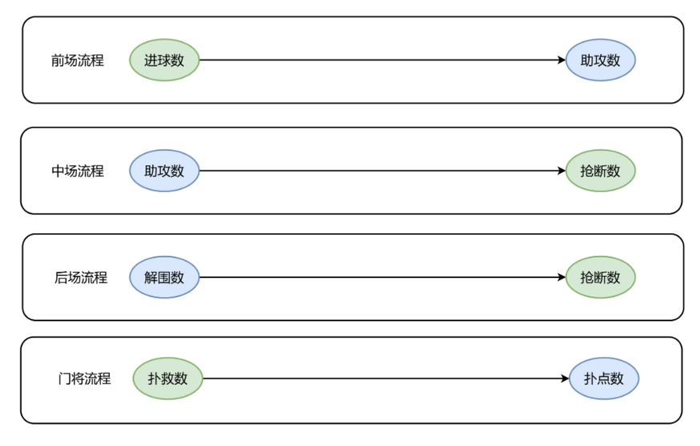

纵向隔离出进攻能力池，防守能力池，门将能力池，横向编排出前场、中场、后场、门将四个流程，在不同流程中可以任意从能力池中选择能力进行组合，而不是编写冗长的判断逻辑，显著提升了代码可扩展性。

## 分层看架构

架构总体而言分为两个层次，第一种层次是指本项目在整个公司位于哪一层。

持久层、缓存层、中间件、业务中台、服务层、网关层、客户端和代理层是常见的分层架构，

大多数情况下业务需求最终会体现在服务层，不同的领域对应不同的微服务。

第二种层次是指本项目内部代码的组织方式，一般分为接口层，访问层，业务层，领域层，外部访问层，基础层。

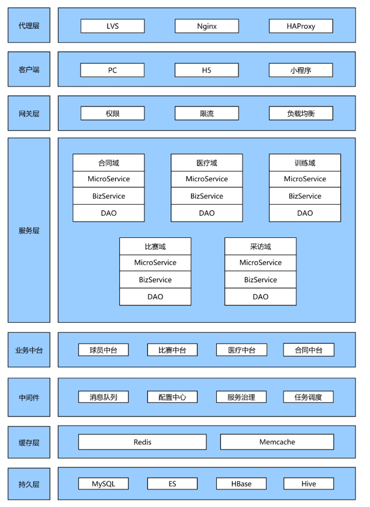

**api**

接口层：提供面向外部接口声明和DTO

**controller**

访问层：提供HTTP访问入口

**service**

业务层：提供BO对象，领域层和业务层都包含业务，但是用途不同。业务层可以组合不同领域业务，并且可以增加流控、监控、日志、权限控制切面，相较于领域层更为丰富

**domain**

领域层：提供DMO、VO、事件、DO和数据访问，核心是根据领域进行分包，领域内高内聚，领域间低耦合

**dependency**

外部访问层：在这个模块中调用外部RPC服务，解析返回码和返回数据

**infrastructure**

基础层：包含通用基础功能，例如基础工具，缓存工具，打印日志，消息发送

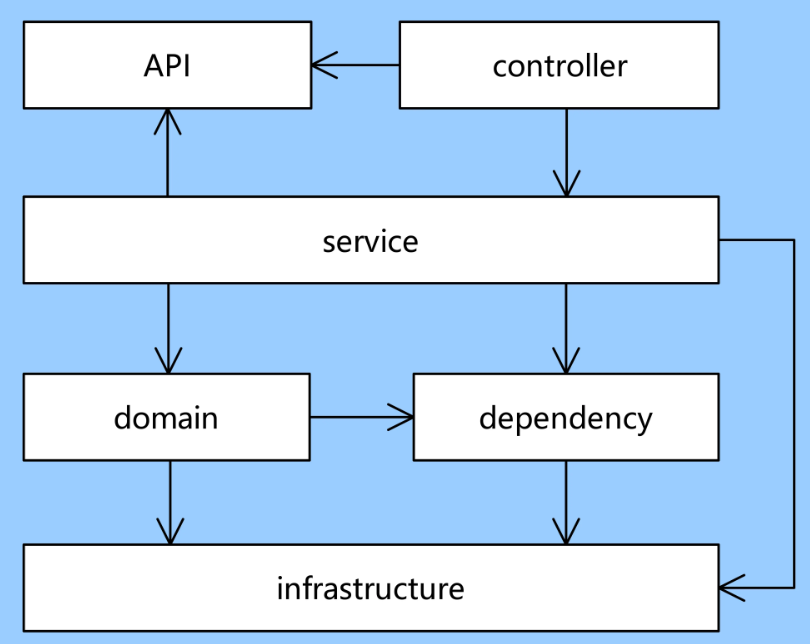

本文展开领域层进行分析。领域层核心是按照领域进行分包，并且提供DMO、VO、事件、DO和数据访问，领域内高内聚，领域间低耦合

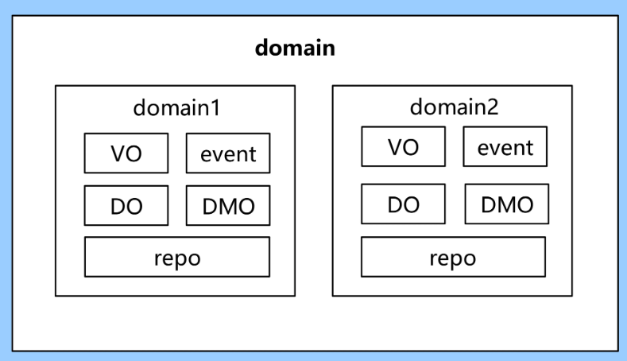

## 接口看对接

当一个接口代码编写完成后，那么这个接口如何调用，输入和输出参数是什么，这些问题需要在接口文档中得到回答。接口文档生成有两种方式：第一种是自动生成，例如使用Swagger，第二种方式是手工生成。

自动生成优点是代码即文档，还具有调试功能，在公司内部进行联调时非常方便。但是如果接口是提供给外部第三方使用，那么还是需要手工编写接口文档。对于一个接口的描述无外乎接口名称、接口说明、接口协议，输入参数、输出参数信息。

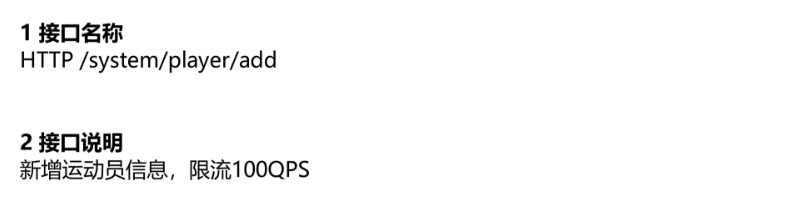

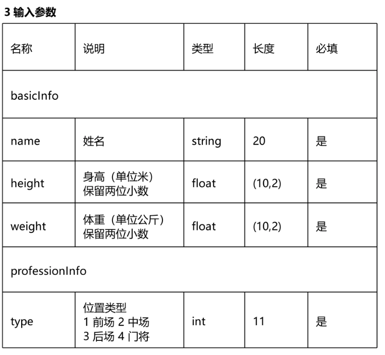

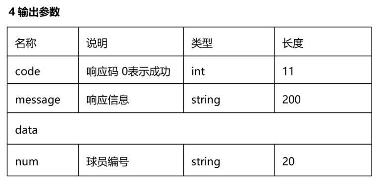

## 用途及案例

### 微服务的服务领域划分

所谓的战略阶段，其实就是前期去规划业务如何拆分服务，服务之间如何交互。战术阶段，就是工程上的应用，用工程化做的比较好的java语言举例子，就是把**传统的三层架构变成了四层架构甚至是N层架构**。

这是对于DDD在战略阶段做的事情：

假如目前我司有个客服系统，内部的客服人员使用这个系统对外上亿的用户提供了形形色色的服务，同时内部人员觉得我们的客服系统也非常好用，老板觉得我们的系统做的非常好，可以拿出去对外售卖以提高公司的利润，那么这时候问题就来了，客服系统需要怎样去改造，才能够支持对外售卖呢？经过激烈的讨论，大致需求如下：

- 对外售卖的形式有两种，分别是SaaS模式和私有化部署的模式。
- SaaS模式需要新开发较为复杂的基础设施来支持，比如租户管理，用户管理，基于用户购买的权限系统，能够根据购买情况来给予不同租户不同的权限。而私有化的时候，由于客户是打包购买，这时候权限系统就不需要再根据用户购买来判断。
- 数据同步能力，很多公司原本已经有一套员工管理系统，通常是HR系统或者是ERP，这时候客服系统也有一套员工管理，需要把公司人员一个一个录入进去，非常麻烦，因此需要和公司原有的数据来进行同步。
- 老板的野心还比较大，希望造出来的这套基础设施可以为公司其他业务系统赋能，能支持其他业务系统对外售卖

在经过比较细致的梳理（DDD管这个叫事件风暴/头脑风暴）之后，我们整理出了主要的业务事件，大致如下：

1. 用户可以自行注册租户，也可以由运营在后台为用户开通租户，每个租户内默认有一个超级管理员，租户开通之后默认有系统一个月的试用期，试用期超级管理员即可在管理端进行用户管理，添加子用户，分配一些基本权限，同时子用户可以使用系统的一些基本功能。

2. 高级的功能，比如客服中的机器人功能是属于要花钱买的，试用期不具备此权限，用户必须出钱购买。每次购买之后会生成购买订单，订单对应的商品即为高级功能包。

3. 权限系统需要能够根据租户购买的功能以及用户拥有的角色来鉴权，如果是私有化，由于客户此时购买的是完整系统，所以此时权限系统仅仅根据用户角色来鉴权即可。

4. 基础设施还需要对其他业务系统赋能。

根据上面的业务流程，我们梳理出了下图中的实体

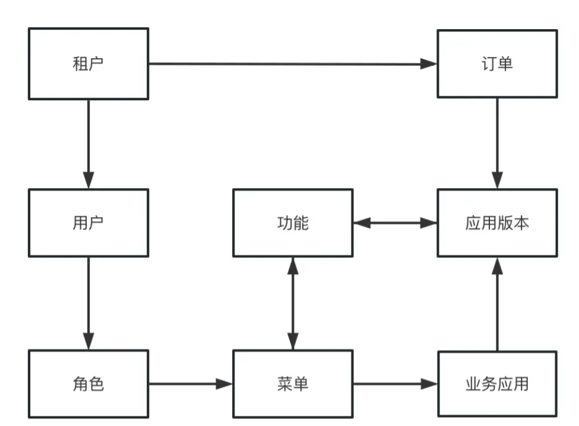

最后再根据实体和实体之间的交互，划分出了用户中心服务以及计费服务，这两个服务是两个通用能力服务，然后又划分出了基于通用服务的业务层，分别是租户管理端和运营后台以及提供给业务接入的应用中心，架构图如下：

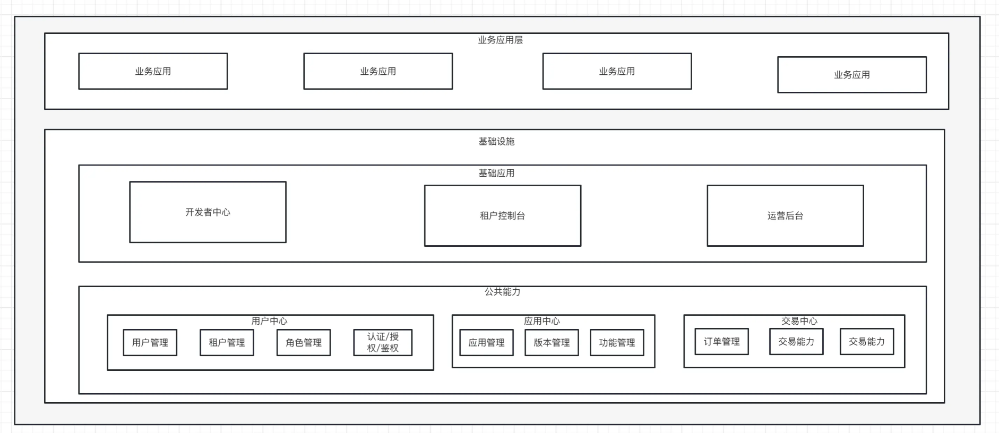

基础设施层即为我们要做的东西，为业务应用层提供通用的用户权限能力、以及售卖的能力，同时构建开发者中心、租户控制台以及运营后台三个基础设施应用。

### 工程层面

这个是对于DDD在战术设计阶段的运用，以java项目来举例子，现在的搞微服务的，都是把工程分为了主要的三层，即控制层->逻辑层->数据层，但是到了DDD这里，则是多了一层，变成了控制层->逻辑层->领域能力层->数据层。这里一层一层来解释下：

|    分层    |                             描述                             |
| :--------: | :----------------------------------------------------------: |
|   控制层   |       对外暴漏的接口层，举个例子，java工程的controller       |
|   逻辑层   |                       主要的业务逻辑层                       |
| 领域能力层 | 模型层，系统的核心，负责表达业务概念，业务状态信息以及业务规则。即包含了该领域（问题域）所有复杂的业务知识抽象和规则定义。 |
|   数据层   |                 操作数据，java中主要是dao层                  |

## MVC迁移DDD

### 包模块划分

~~~bash
│
│    ├─interface   用户接口层 
│    │    └─controller    控制器，对外提供（Restful）接口
│    │    └─facade      外观模式，对外提供本地接口和dubbo接口
│    │    └─mq          mq消息，消费者消费外部mq消息
│    │ 
│    ├─application 应用层
│    │    ├─assembler     装配器
│    │    ├─dto           数据传输对象，xxxCommand/xxxQuery/xxxVo     
│    │    │    ├─command  接受增删改的参数
│    │    │    ├─query    接受查询的参数
│    │    │    ├─vo       返回给前端的vo对象
│    │    ├─service       应用服务，负责领域的组合、编排、转发、转换和传递
│    │    ├─repository    查询数据的仓库接口
│    │    ├─listener      事件监听定义
│    │ 
│    ├─domain      领域层
│    │    ├─entity        领域实体
│    │    ├─valueobject   领域值对象
│    │    ├─service       领域服务
│    │    ├─repository    仓库接口，增删改的接口
│    │    ├─acl           防腐层接口
│    │    ├─event         领域事件
│    │ 
│    ├─infrastructure  基础设施层
│    │    ├─converter     实体转换器
│    │    ├─repository    仓库
│    │    │    ├─impl     仓库实现
│    │    │    ├─mapper   mybatis mapper接口
│    │    │    ├─po       数据库orm数据对象 
│    │    ├─ack        实体转换器
│    │    ├─mq            mq消息
│    │    ├─cache         缓存
│    │    ├─util          工具类
│    │    
│   

~~~

### 仓储层

在我们日常的代码中，使用Repository模式是一个很简单，但是又能得到很多收益的事情。最大的收益就是可以彻底和底层实现解耦，让上层业务可以快速自发展。

以目前逆向模型举例，现有

- OrderDO
- OrderDAO

可以通过以下几个步骤逐渐的实现Repository模式：

1. 生成Order实体类，初期字段可以和OrderDO保持一致
2. 生成OrderDataConverter，通过MapStruct基本上2行代码就能完成
3. 写单元测试，确保Order和OrderDO之间的转化100%正确
4. 生成OrderRepository接口和实现，通过单测确保OrderRepository的正确性
5. 将原有代码里使用了OrderDO的地方改为Order
6. 将原有代码里使用了OrderDAO的地方都改为用OrderRepository
7. 通过单测确保业务逻辑的一致性。

有一点要注意，目前我们用mybatis，dao操作都是含有业务含义的，正常的repository不应该有这种方法，目前repository中的含有业务含义的方法只是兼容方案，最终态都要干掉的。

极端DDD推崇者要求在repository中只存在save与byId两个聚合方法。这个当然需要根据实际业务场景来决定，但是还是建议仅保存这两个方法，其他业务需求查询聚合的方法单独开一个queryRepository实现不同数据的查询聚合与页面数据展示。保证数据的`增删改入口唯一

### 隔离三方依赖-adapter

思想和repository是一致的，以调用payApi为例：

1. 在domain新建adapter包
2. 新建PayAdapter接口
3. 在infrastructure中定义adapter的实现，转换内部模型和外部模型，调用pay接口，返回内部模型dto
4. 将原先业务中调用rpc的地方改成adapter
5. 单测对比rpc和adapter，保证正确性

### CQRS参数显式化

能力链项目，定义command，query包，通过能力链来体现Command，Query，包括继承CommandService、QueryService，Po继承CommandPo，QueryPo

非能力链项目，在application定义command，query包，参数和类名要体现CQRS。

### 战略设计-domain

重新设计聚合和实体，可能和现有模型有差异，如果模型差距不大，直接将能力点内的逻辑，迁移到实体中，

将原来调用repository的含业务含义的方法，换成save，同时删除含业务含义的方法，这个时候可以考虑用jpa替换mybatis，这里就看各个子域的选择了，如果用jpa的话 dao层可以干掉。至此，原biz里的大多数类已迁移完成。

### 抽离技术组件

同样是符合六边形架构的思想，把mqProducer，JsonUtil等技术组件，在domain定义接口，在infrastructure写实现，替换步骤和adapter类似。

### 业务流程模块化-application

如果是用能力链的项目，能力链的service就可以是application。如果原先service中的业务逻辑混杂，甚至连参数组装都是在service中体现的。那么需要把逻辑归到聚合根中，当前聚合根无法完全包裹的，防止在领域模型中体现。在应用服务层中为能力链的体现。 	 	
