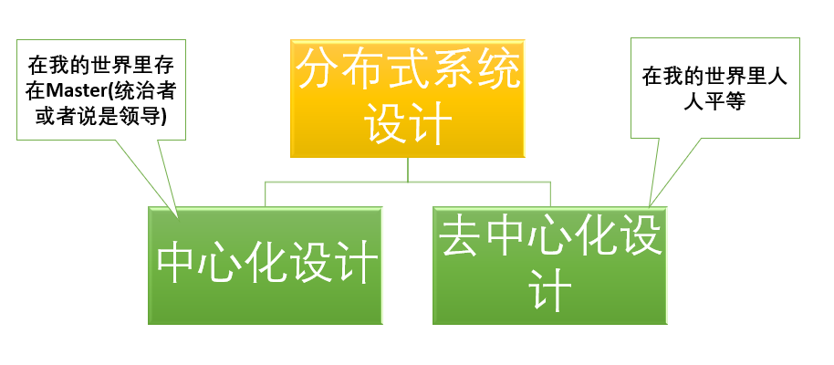
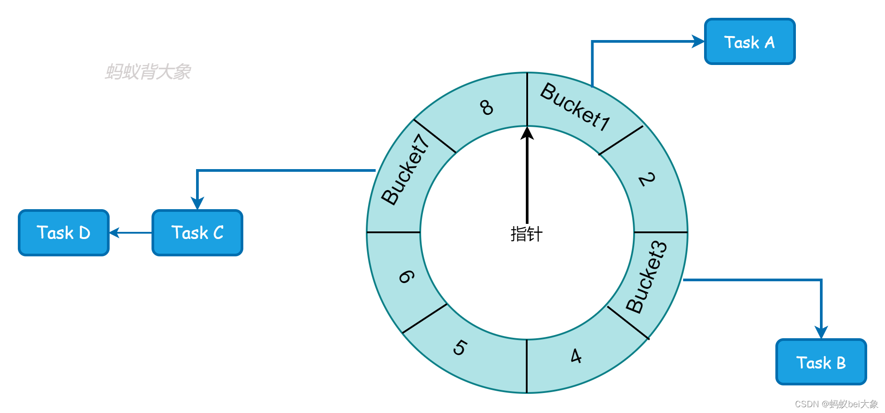
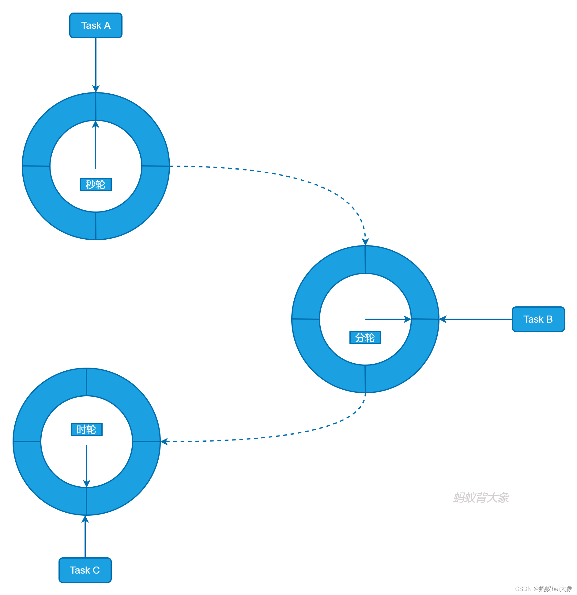
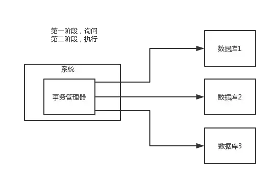
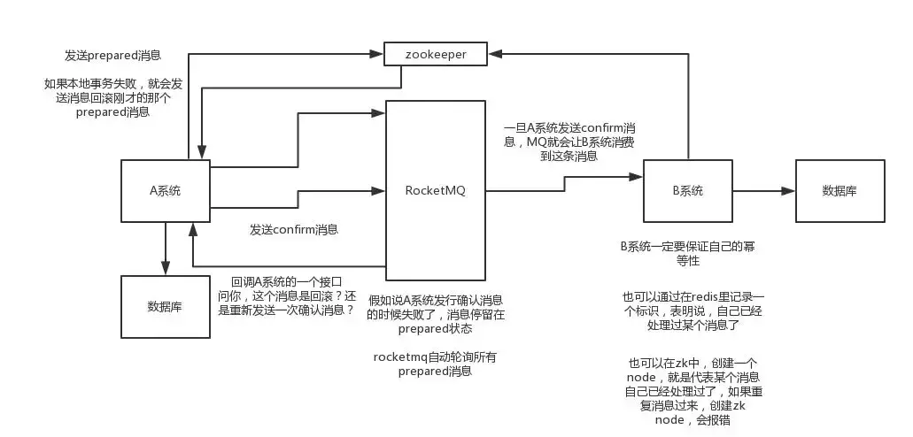

# 分布式理论

## 分布式

### 谈谈你对于分布式理解？

1. 分布式的理论是针对大型复杂的系统产生的概念
   1. 从分-总的结构来看：其中微服务是分布式的基础，众多不同功能的微服务集群通过组合，最终形成一个能够对外提供服务的系统。
   2. 从总-分的结构来看：分布式就是对原来的的服务架构进行拆分或者进行扩展，比如增加机器处理更多的流量、业务拆分处理不同的业务请求
2. 分布式系统根据处理的业务，可以多种种类：分布式文件系统、分布式缓存、分布式计算、分布式数据库等；
3. 分布式系统解决了以往单体服务的性能瓶颈，但是也带来了诸多其他的问题，比如：高可用和一致性问题。针对这些问题，产生了系统设计的相关理论：CAP、BASE理论等，它们是分布式系统设计的理论基础
4. 还需要考虑就是整个系统的性能，虽然通过增加机器，系统处理问题的效率能够得到提升，但这算是一个最笨的方法，为了应对高并发的场景，我们最重要的是需要去考虑提升单服务、单接口的请求处理效率，那么通常的处理方式有：提升数据查询的效率、关键时刻加入缓存、一个接口内如果存在多个远程调用，那么就可以采用多线程+异步的远程调用方式、最后为了保护系统免于高并发，从而压力突然上升，可以采用消息队列，进行一个流量削峰。

### 基本概念

#### 微服务

​		微服务就是很小的服务，小到一个服务只对应一个单一的功能，只做一件事。这个服务可以单独部署运行，服务之间通过远程调用协同工作，每个微服务都是由独立的小团队开发，测试，部署，上线，负责它的整个生命周期。

#### 集群

集群（cluster）是指在多台不同的服务器中部署相同应用或服务模块，构成一个集群，通过负载均衡设备对外提供服务。

**两个特点**

+ 可扩展性：集群中的服务节点，可以动态的添加机器，从而增加集群的处理能力。
+ 高可用性：如果集群某个节点发生故障，这台节点上面运行的服务，可以被其他服务节点接管，从而增强集群的高可用性。

**两大能力**

+ 负载均衡：负载均衡能把任务比较均衡地分布到集群环境下的计算和网络资源。
+ 集群容错：当我们的系统中用到集群环境，因为各种原因在集群调用失败时，集群容错起到关键性的作用。

#### 分布式概念

​		为了解决单个物理服务器容量和性能瓶颈问题而采用的优化手段，将一个业务拆分成不同的子业务，分布在不同的机器上执行。服务之间通过远程调用协同工作，对外提供服务。该领域需要解决的问题极多，在不同的技术层面上，又包括：

+ 分布式缓存、
+ 分布式数据库、
+ 分布式计算、
+ 分布式文件系统等，
+ 一些技术如`MQ`、`Redis`、`zookeeper`等都跟分布式有关。

从理念上讲，分布式的实现有两种形式：

+ **水平扩展**：当一台机器扛不住流量时，就通过添加机器的方式，将流量平分到所有服务器上，所有机器都可以提供相同的服务；
+ **垂直拆分**：前端有多种查询需求时，一台机器扛不住，可以将不同的业务需求分发到不同的机器上，比如A机器处理余票查询的请求，B机器处理支付的请求。

### 分布式系统设计理念

#### 分布式系统的目标与要素

​		分布式系统的目标是提升系统的整体性能和吞吐量另外还要尽量保证分布式系统的容错性（假如增加10台服务器才达到单机运行效果2倍左右的性能，那么这个分布式系统就根本没有存在的意义）。

​		即使采用了分布式系统，我们也要尽力运用并发编程、高性能网络框架等等手段提升单机上的程序性能。

#### 中心化和去中心化

**中心化设计**

- **两个角色：** 中心化的设计思想很简单，分布式集群中的节点机器按照角色分工，大体上分为两种角色： **“领导”** 和 **“干活的”**
- **角色职责：** “领导”通常负责分发任务并监督“干活的”，发现谁太闲了，就想发设法地给其安排新任务，确保没有一个“干活的”能够偷懒，如果“领导”发现某个“干活的”因为劳累过度而病倒了，则是不会考虑先尝试“医治”他的，而是一脚踢出去，然后把他的任务分给其他人。其中微服务架构 **K8s** 就恰好采用了这一设计思路。
- 中心化设计的问题
  1. 中心化的设计存在的最大问题是“领导”的安危问题，如果“领导”出了问题，则群龙无首，整个集群就奔溃了。但我们难以同时安排两个“领导”以避免单点问题。
  2. 中心化设计还存在另外一个潜在的问题，既“领导”的能力问题：可以领导10个人高效工作并不意味着可以领导100个人高效工作，所以如果系统设计和实现得不好，问题就会卡在“领导”身上。
- **领导安危问题的解决办法：** 大多数中心化系统都采用了主备两个“领导”的设计方案，可以是热备或者冷备，也可以是自动切换或者手动切换，而且越来越多的新系统都开始具备自动选举切换“领导”的能力，以提升系统的可用性。

**去中心化设计**

- **众生地位平等：** 在去中心化的设计里，通常没有“领导”和“干活的”这两种角色的区分，大家的角色都是一样的，地位是平等的，全球互联网就是一个典型的去中心化的分布式系统，联网的任意节点设备宕机，都只会影响很小范围的功能。
- **“去中心化”不是不要中心，而是由节点来自由选择中心。** （集群的成员会自发的举行“会议”选举新的“领导”主持工作。最典型的案例就是 ZooKeeper 及Go语言实现的 Etcd ）
- **去中心化设计的问题：** 去中心化设计里最难解决的一个问题是 **“脑裂”问题** ，这种情况的发生概率很低，但影响很大。脑裂指一个集群由于网络的故障，被分为至少两个彼此无法通信的单独集群，此时如果两个集群都各自工作，则可能会产生严重的数据冲突和错误。一般的设计思路是，当集群判断发生了脑裂问题时，规模较小的集群就“自杀”或者拒绝服务。

#### 分布式与集群的区别是什么？

- 分布式： 一个业务分拆多个子业务，部署在不同的服务器上
- 集群： 同一个业务，部署在多个服务器上。比如之前做电商网站搭的redis集群以及solr集群都是属于将redis服务器提供的缓存服务以及solr服务器提供的搜索服务部署在多个服务器上以提高系统性能、并发量解决海量存储问题。

## CAP定理

在理论计算机科学中，CAP定理（CAP theorem），又被称作布鲁尔定理（Brewer’s theorem），它指出对于一个分布式计算系统来说，不可能同时满足以下三点：

| 选项                              | 描述                                                         |
| --------------------------------- | ------------------------------------------------------------ |
| Consistency（一致性）             | 指数据在多个副本之间能够保持一致的特性（严格的一致性）       |
| Availability（可用性）            | 指系统提供的服务必须一直处于可用的状态，每次请求都能获取到非错的响应（不保证获取的数据为最新数据） |
| Partition tolerance（分区容错性） | 分布式系统在遇到任何网络分区故障的时候，仍然能够对外提供满足一致性和可用性的服务，除非整个网络环境都发生了故障 |

`**Spring Cloud`在`CAP`法则上主要满足的是`A`和`P`法则，`Dubbo` 和 `Zookeeper` 在 CAP 法则主要满足的是C和P法则**

​		CAP仅适用于原子读写的NOSQL场景中，并不适合数据库系统。现在的分布式系统具有更多特性比如扩展性、可用性等等，在进行系统设计和开发时，我们不应该仅仅局限在CAP问题上。

**注意：不是所谓的3选2（不要被网上大多数文章误导了）**

​		现实生活中，大部分人解释这一定律时，常常简单的表述为：“一致性、可用性、分区容忍性三者你只能同时达到其中两个，不可能同时达到”。实际上这是一个非常具有误导性质的说法，而且在CAP理论诞生12年之后，CAP之父也在2012年重写了之前的论文。

​		**当发生网络分区的时候，如果我们要继续服务，那么强一致性和可用性只能2选1。也就是说当网络分区之后P是前提，决定了P之后才有C和A的选择。也就是说分区容错性（Partition tolerance）我们是必须要实现的。**

## `BASE`理论

​		`BASE`理论由`eBay`架构师`Dan Pritchett`提出，在2008年上被分表为论文，并且`eBay`给出了他们在实践中总结的基于BASE理论的一套新的分布式事务解决方案。

​		**BASE** 是 `Basically Available`（基本可用） 、`Soft-state`（软状态） 和 `Eventually Consistent`（最终一致性） 三个短语的缩写。`BASE`理论是对`CAP`中一致性和可用性权衡的结果，其来源于对大规模互联网系统分布式实践的总结，是基于`CAP`定理逐步演化而来的，它大大降低了我们对系统的要求。

### `BASE`理论的核心思想

​		即使无法做到强一致性，但每个应用都可以根据自身业务特点，采用适当的方式来使系统达到最终一致性。也就是牺牲数据的一致性来满足系统的高可用性，系统中一部分数据不可用或者不一致时，仍需要保持系统整体“主要可用”。

​		针对数据库领域，`BASE`思想的主要实现是对业务数据进行拆分，让不同的数据分布在不同的机器上，以提升系统的可用性，当前主要有以下两种做法：

- 按功能划分数据库
- 分片（如开源的`Mycat`、`Amoeba`等）。

​       由于拆分后会涉及分布式事务问题，所以eBay在该BASE论文中提到了如何用最终一致性的思路来实现高性能的分布式事务。

### BASE理论三要素

#### 1. 基本可用

基本可用是指分布式系统在出现不可预知故障的时候，允许损失部分可用性。但是，这绝不等价于系统不可用。

比如：

- **响应时间上的损失**：正常情况下，一个在线搜索引擎需要在0.5秒之内返回给用户相应的查询结果，但由于出现故障，查询结果的响应时间增加了1~2秒
- **系统功能上的损失**：正常情况下，在一个电子商务网站上进行购物的时候，消费者几乎能够顺利完成每一笔订单，但是在一些节日大促购物高峰的时候，由于消费者的购物行为激增，为了保护购物系统的稳定性，部分消费者可能会被引导到一个降级页面

#### 2. 软状态

​		软状态指允许系统中的数据存在中间状态，并认为该中间状态的存在不会影响系统的整体可用性，即允许系统在不同节点的数据副本之间进行数据同步的过程存在延时

#### 3. 最终一致性

​		最终一致性强调的是系统中所有的数据副本，在经过一段时间的同步后，最终能够达到一个一致的状态。因此，最终一致性的本质是需要系统保证最终数据能够达到一致，而不需要实时保证系统数据的强一致性。

## 一致性模型

+ 强一致性：数据保持一致，不能有任何不同，数据高度一致，但是系统的可用性大程度降低
+ 因果一致性：保证顺序结果一致，执行顺序保持一致
+ 会话一致性：同一个有效会话中读写一致性
+ 最终一致性：弱一致性，分布式事务中的消息最终一致性，短时间内会用一定的影响，系统高度可用

# 高并发核心思想

​		想进一切办法提高对外暴漏服务的瞬时并发量，并在长时间内维持这个并发量，处理瞬时并发的周期要短，同时不能积压并发请求，提高并发量最核心是提升单节点的并发量。相同节点的集群，它的并发量的核心其实就是单点并发能力，分布式部署应该是最后一个用资源换取吞吐量的方案。所以提高单节点的并发量，最重要的就是提高单个接口的并发量。

并发量提升的方面：

1. 代码层面：最好能够异步多线程操作
2. 数据存储层面：提升Mysql的写入和查询，这其中包括了Sql的优化、Mysql的配置优化，读多写少的情况下，可以引入数据库的读写分离或者缓存
3. 第三方调用接口层面：如果是强依赖性串行调用，最好采用多线程调用（网络开销会比较严重）
4. 高并发情况下，最好能够引入消息队列：能够起到流量削峰的作用，保护服务的性能稳定，也可以随时增加消费者的服务，提升系统的消费能力

# 常见分布式问题

## 限流

#### 常见的限流算法有哪些？

1. 计数器算法 
4. 时间窗口算法借助 Redis的有序集合可以实现。
5. 漏桶算法可以使用Redis-Cell来实现。
6. 令牌算法可以解决Google的guava包来实现。

## 定时任务处理

### 延时任务处理原理有哪些？

1. 最基本的方式：将所有的任务放到一个数组中，然后进行轮询每一个任务，当某个任务达到启动的时间后，那么就执行该任务，
   1. 缺点是要一直遍历这个数组，对于CPU会不友好
2. 第二种的方式：使用堆排序的方式：简单来说就是维持一个最小堆，每次取最顶端的任务执行即可，但是如果任务比较多，那么可能会有超时的可能性，当然也可以通过分批次优化的方式去执行， 通常使用这个的方式的有：Timer，ScheduledThreadPoolExetor
3. 第三种方式：采用时间轮的方式，将时间划分为一个刻度，然后将同一时间执行的任务组织为一个链表，当到达该刻度的时候，就去批量执行这个定时任务，但是随着时间的增加，时间刻度就会越来越多，这个时候，产生了类似钟表结构的分层时间轮，可以起到优化作用

### 时间轮概念

​		时间轮的核心思想：将单位时间分成若干个时间间隔，每个时间间隔包含了时间单位除以若干时间间隔的时间量，时间轮转动到对应的时间间隔就执行当前时间间隔对应的可执行的任务。

### 简单的时间轮

​		在论文《Hashed and Hierarchical Timing Wheels》 中每一个时间间隔叫做 bucket 。 bucket的作用用于存放当前时间间隔内存在的需要执行的任务。例如现在有四个任务A、B、C、D分别要在一秒的三个不同的时间段执行，A、B在两个不同的时间段执行，C、D在同一个时间段执行

当时间轮的指针从`Bucket-1`的开始时间到结束时间段的过程中，会去遍历`Bucket`的链表中的任务，将需要执行的任务从链表中拿出来执行。已上图的例子每一秒时间轮的指针走一圈。

> Tips: 
>
> `bucket`中存放的任务是时间轮一个时间间隔中的任务，也就是说这些任务是一个时间段里面的任务。例如：`100ms`和`80ms`需要执行的任务都说存在`bucket1`。

进一步思考，如果你一分钟执行一次，那么时间轮的刻度就需要分成480个时间段，随着单位时间刻度的增加会让时间论的刻度越来越多。这样对于计算机来说就是消耗更多的内存。这种如何解决，在论文中提出另一个概念就是：分层时间轮

### 分层时间轮

在生活中分层时间轮也是比比皆是，例如在手表长最长的指针代表秒针，中间的代表分针，最短的代表时针。例如我有三个任务 A、B、C分别在以下时间执行：

- A六十秒的时候执行一次
- B十五分钟的时候执行一次
- C六点位置的时候执行一次

如下图所示：

​		秒时间轮完成一圈触发分时间轮刻度往下一个，分时间轮完成一周触发时时间轮往下一个刻度。分层时间轮之间的刻度关系可以自己定义。不需要和时间刻度表上一样的。具体取决于业务的需要。例如：Linux的Corntab只支持分钟，而Java的Quartz可以支持到秒。

### 总结
1. 时间轮是一种高效来利用线程资源来进行批量化调度的一种调度模型。提高利用率，但是时间轮调度器的时间精度可能不是很高，对于精度要求特别高的调度任务可能不太适合。因为时间轮算法的精度取决于，也就是时间间隔，时间间隔越小精度越高。时间轮的使用在各大框架与中间件中有使用，netty，kafka,jraft（这个是fork netty的）。
2. 时间轮的使用在各大框架与中间件中有使用，netty、kafka、jraft（这个是fork netty的）。

## 分布式调度

### 问题点

我们开发定时任务一般都是使用quartz或者spring-task（`ScheduledExecutorService`），无论是使用quartz还是spring-task，我们都会至少遇到两个痛点：

1. 重复多次执行而引发系统逻辑的错误。
2. Quartz的集群仅仅只是用来HA，节点数量的增加并不能给我们的每次执行效率带来提升，即不能实现水平扩展。

### 概念

1. 同⼀个定时任务程序部署多份，只应该有⼀个定时任务在执⾏
2. 定时任务的拆分，即为把⼀个⼤的作业任务拆分为多个⼩的作业任务，同时执⾏

### 场景

- 订单审核、出库
- 订单超时⾃动取消、⽀付退款
- 礼券同步、⽣成、发放作业
- 物流信息推送、抓取作业、退换货处理作业
- 数据积压监控、⽇志监控、服务可⽤性探测作业
- 定时备份数据
- ⾦融系统每天的定时结算 数据归档、清理作业 报表、离线数据分析作业

### 特性

主要有两个特性

1. 运⾏在分布式集群环境下的调度任务，同⼀个定时任务程序可以部署多份，但是只应该有⼀个定时任务在执行
2. 可以把⼀个⼤的作业任务拆分为多个⼩的作 业任务，同时执⾏

### 方案对比

1. GitHub ： xxl-job 使用的人更多一些，大概是 Elastic-Job 的 2 倍
2. 功能性对比
   1. xxl-job ：侧重的业务实现的简单和管理的方便，学习成本简单，失败策略和路由策略丰富。推荐使用在“用户基数相对少，服务器数量在一定范围内”的情景下使用。
   2. elastic-job ：关注的是数据，增加了弹性扩容和数据分片的思路，以便于更大限度的利用分布式服务器的资源。但是学习成本相对高些，推荐在“数据量庞大，且部署服务器数量较多”时使用。

## 分布式ID生成方法

### 特点

1. 全局唯一
2. 高可用
3. 高性能
4. 简单可用

### 方案

#### UUID/GUID

**优点**

1. 容易实现，产生快
2. ID唯一
3. 无需要中心化服务器
4. 不会泄露商业机密

**缺点**

1. 可读性过差
2. 占用空间过多。
3. 影响数据库性能

#### 数据库递增

**优点**

1. 容易产生
2. 可读性好，容易记住
3. 存储很小

**缺点**

1. 需要中心化的服务器，并且需要处理单节点的问题，而且有性能瓶颈的问题。
2. 如果ID暴露给公共访问，会泄露商业机密，通过减法获取每日单量
3. 需要访问一次数据库获取ID

**补充**：增加影子服务，相当于是主从系统，保证当主库挂掉以后，影子服务可以被使用，保证系统的高可用

#### 随机数

**优点**

1. 可读性高
2. 占用存储小，4个字节即可。
3. 随机，不会泄露机密

**缺点**

1. 需要中心化的服务
2. 需要两步操作

#### 随机字符串

**优点**

1. 短、5个字节可以保存10亿个ID
2. 可读性高
3. 随机，不会泄露信息

**缺点**

1. ID可能不唯一，需要检查和处理

#### 雪花算法

**组成部分：**

1. 符号位：占用1位
2. 时间戳，占用4位
3. 机器ID，占用10位
4. 序列号，占用12位

**优点**

1. 存储少，8个字节
2. 可读性高
3. 性能好，可以去中心化产生ID，也可以独立节点生成

**缺点**

1. 时间回拨会产生重复ID
2. ID生成有规律性，信息容易泄露

**补充**：为了解决时钟回拨问题，导致ID重复，后面有人专门提出了解决的方案

1. 百度开源的分布式唯一ID生成器 UidGenerator
2. Leaf - 美团点评分布式ID生成系统

## 分布式事务

### 概念

​		需要对不在同一台数据库上的数据进行增删改，数据库自身的事务不能够满足要求，这个时候需要在代码层实现事务的管理

### 解决方案

#### 二阶段提交

两阶段提交，有一个**事务管理器**的概念，负责协调多个数据库（[资源管理器](https://so.csdn.net/so/search?q=资源管理器&spm=1001.2101.3001.7020)）的事务，

1. 事务管理器先问问各个数据库你准备好了吗？
2. 如果每个数据库都回复 ok，那么就正式提交事务，在各个数据库上执行操作；如果任何其中一个数据库回答不 ok，那么就回滚事务。

这种分布式事务方案，比较适合单块应用里，跨多个库的分布式事务，**而且因为严重依赖于数据库层面来搞定复杂的事务，效率很低，绝对不适合高并发的场景**。

#### 三阶段提交TCC

TCC 的全称是：Try、Confirm、Cancel。

- Try 阶段：这个阶段说的是对各个服务的资源做检测以及对资源进行**锁定或者预留**。
- Confirm 阶段：这个阶段说的是在各个服务中**执行实际的操作**。
- Cancel 阶段：如果任何一个服务的业务方法执行出错，那么这里就需要**进行补偿**，就是执行已经执行成功的业务逻辑的回滚操作。（把那些执行成功的回滚）

这种方案说实话几乎很少人使用，我们用的也比较少，但是也有使用的场景。因为这个**事务回滚**实际上是**严重依赖于你自己写代码来回滚和补偿**了，会造成补偿代码巨大，非常之恶心。

#### 可靠消息+消息事务+最终一致性

大概的意思就是：

1. A 系统先发送一个 prepared 消息到 mq，如果这个 prepared 消息发送失败那么就直接取消操作别执行了；
2. 如果这个消息发送成功过了，那么接着执行本地事务，如果成功就告诉 mq 发送确认消息，如果失败就告诉 mq 回滚消息；
3. 如果发送了确认消息，那么此时 B 系统会接收到确认消息，然后执行本地的事务；
4. mq 会自动**定时轮询**所有 prepared 消息回调你的接口，问你，这个消息是不是本地事务处理失败了，所有没发送确认的消息，是继续重试还是回滚？一般来说这里你就可以查下数据库看之前本地事务是否执行，如果回滚了，那么这里也回滚吧。这个就是避免可能本地事务执行成功了，而确认消息却发送失败了。
5. 这个方案里，要是系统 B 的事务失败了咋办？重试咯，自动不断重试直到成功，如果实在是不行，要么就是针对重要的资金类业务进行回滚，比如 B 系统本地回滚后，想办法通知系统 A 也回滚；或者是发送报警由人工来手工回滚和补偿。
6. 这个还是比较合适的，目前国内互联网公司大都是这么玩儿的，要不你举用 RocketMQ 支持的，要不你就自己基于类似 ActiveMQ？RabbitMQ？自己封装一套类似的逻辑出来，总之思路就是这样子的。

#### 最大努力通知

这个方案的大致意思就是：

1. 系统 A 本地事务执行完之后，发送个消息到 MQ；
2. 这里会有个专门消费 MQ 的**最大努力通知服务**，这个服务会消费 MQ 然后写入数据库中记录下来，或者是放入个内存队列也可以，接着调用系统 B 的接口；
3. 要是系统 B 执行成功就 ok 了；要是系统 B 执行失败了，那么最大努力通知服务就定时尝试重新调用系统 B，反复 N 次，最后还是不行就放弃。

### 其他问题

#### 什么是TCC空回滚？

**问题描述：**账户服务是两个节点的集群，在 try 阶段账户服务 1 这个节点发生了故障，try 阶段在不考虑重试的情况下，全局事务必须要走向结束状态，这样就需要在账户服务上执行一次 cancel 操作，这样就空跑了一次回滚操作。

**解决方案：**增加一个状态日志表，判断try是否执行成功，在 Rollback 阶段判断记录是否存在，如果不存在，则不执行回滚操作。

#### 什么是TCC悬挂问题？

**问题描述：**悬挂是指因为网络问题，RM 开始没有收到 try 指令，但是执行了 Rollback 后 RM 又收到了 try 指令并且预留资源成功，这时全局事务已经结束，最终导致预留的资源不能释放

**解决方法：**是执行 Rollback 方法时先判断 状态日志表，如果没有，则向日志表插入一条记录，状态是STATUS_SUSPENDED，并且不再执行回滚操作

#### 什么是TCC幂等性问题？

**问题描述：**在 commit/cancel 阶段，因为 TC 没有收到分支事务的响应，需要进行重试，这就要分支事务支持幂等。

**解决方案：**增加日志表，提交事务时首先会判断表中是否已经有记录，如果有记录，则判断事务执行状态并返回。这样如果判断到事务的状态已经是 STATUS_COMMITTED，就不会再次提交，保证了幂等。如果日志表中没有记录，则插入一条记录，供后面重试时判断。

## 分布式锁

### 概念

​		现在的服务大多以集群的方式对外进行服务，但是当多个同样的服务操作同一个资源（增删改）时，容易导致这一个资源的嬉戏发生问题，常见的业务场景：12306 火车售票系统、 电商秒杀系统，此时需要对于这个资源进行上锁，仅允许一个服务对该资源进行操作

### 解决方案

#### Redis

#### Zookeeper

当分布式锁存在顺序性的问题时，Zookeeper 是实现分布式锁不错的选择

## Seesion 共享

### Session会话管理

​		Session是服务器用来保存用户操作的一系列会话信息，由Web容器进行管理。单机情况下，不存在Session共享的情况，分布式情况下，如果不进行Session共享会出现请求落到不同机器要重复登录的情况，

### Session会话共享解决方案

#### session复制

1. 在集群中的几台服务器之间同步session对象，使得每台服务器上都保存所有的session信息，这样任何一台宕机都不会导致session的数据丢失，服务器使用session时，直接从本地获取。
2. 这种方式在应用集群达到数千台的时候，就会出现瓶颈，每台都需要备份session，出现内存不够用的情况。

#### 使用Nginx负载均衡

1. 使用Nginx负载均衡的ip_hash策略实现用户每次访问都绑定到同一台具体的后台tomcat服务器实现session总是存在；
2. 这种方式不符合对系统的高可用要求，因为一旦某台服务器宕机，那么该机器上的session也就不复存在了，用户请求切换到其他机器后么有session，无法完成业务处理。

#### 利用cookie记录session

1. session记录在客户端，每次请求服务器的时候，将session放在请求中发送给服务器，服务器处理完请求后再将修改后的session响应给客户端。这里的客户端就是cookie。
2. 利用cookie记录session的也有缺点，比如受cookie大小的限制，能记录的信息有限；每次请求响应都需要传递cookie，影响性能，如果用户关闭cookie，访问就不正常。但是由于cookie的简单易用，可用性高，支持应用服务器的线性伸缩，而大部分要记录的session信息比较小，因此事实上，许多网站或多或少的在使用cookie记录session。

#### session服务器-- Spring Session

1. 使用框架的会话管理工具，也就是**Spring session**，由Spring session框架为我们提供，可以说是目前非常完美的session共享解决方案；
2. 当Web服务器接收到http请求后，当请求进入对应的Filter进行过滤，将原本需要由web服务器创建会话的过程转交给Spring-Session进行创建，本来创建的会话保存在Web服务器内存中，通过Spring-Session创建的会话信息可以保存第三方的服务中，如：redis,mysql等。Web服务器之间通过连接第三方服务来共享数据，实现Session共享！

## 时钟同步问题

### 问题点

1. 执行关于时间的任务时，需要集群内的时间统一
   1. 比如分时任务调度，需要执行定时任务

### 解决方案

1. 集群中服务节点均可访问互联网
2. 集群中某一个节点可以访问互联网或都不能访问互联网

## 分布式服务追踪与调用链

### 概念

​		在微服务中，如果服务与服务之间的依赖关系非常复杂，如果某个服务出现了一些问题，很难追查到原因，特别是服务与服务之间调用的时候。

​		在微服务系统中，随着业务的发展，系统会变得越来越大，那么**各个服务之间的调用关系也就变得越来越复杂**。一个 HTTP 请求会调用多个不同的微服务来处理返回最后的结果，在这个调用过程中，可能会因为某个服务出现网络延迟过高或发送错误导致请求失败，这个时候，对请求调用的监控就显得尤为重要了。Spring Cloud Sleuth 提供了分布式服务链路监控的解决方案

​		服务与服务之间调用关系 链路指的：一串联多个服务组成一个流程 调用链关系

### 解决方案

####  Zipkin 与 Sleuth

1. Zipkin 是一个开放源代码分布式的跟踪系统，由Twitter公司开源，它致力于收集服务的定时数据，以解决微服务架构中的延迟问题，包括数据的收集、存储、查找和展现。 每个服务向zipkin报告计时数据，例如用户每次请求服务的处理时间等，可方便的监测系统中存在的瓶颈。 zipkin会根据调用关系通过Zipkin UI生成依赖关系图。

2. Spring Cloud Sleuth为服务之间调用提供链路追踪。通过Sleuth可以很清楚的了解到一个服务请求经过了哪些服务，每个服务处理花费了多长。从而让我们可以很方便的理清各微服务间的调用关系。此外Sleuth可以帮助我们：
   1. 耗时分析: 通过Sleuth可以很方便的了解到每个采样请求的耗时，从而分析出哪些服务调用比较耗时;
   2. 可视化错误: 对于程序未捕捉的异常，可以通过集成Zipkin服务界面上看到; 链路优化: 对于调用比较频繁的服务，可以针对这些服务实施一些优化措施。
   3. Spring Cloud Sleuth可以结合Zipkin，将信息发送到Zipkin，利用Zipkin的存储来存储信息，利用Zipkin Ui来展示数据。

#### 服务跟踪原理

1. 为了实现请求跟踪，当请求发送到分布式系统的入口端点时， 只需要服务跟踪框架为该请求创建一个唯的跟踪标识， 同时在分布式系统内部流转的时候，框架始终保持传递该唯一标识， 直到返回给请求方为止，这个唯一标识就是前 文中提到的Trace ID。通过Trace ID的记录，我们就能将所有请求过程的日志关联起来。 
2. 为了统计各处理单元的时间延迟，当请求到达各个服务组件时，或是处理逻辑到达某个状态时，也通过一个唯一 标识来标记它的开始、 具体过程以及结束，该标识就是前文中提到的Span ID。对于每个Span来说，它必须有开始和结束两个节点，通过记录开始Span和结束Span的时间戳，就能统计出该Span的时间延迟，除了时间戳记录之外，它还可以包含一些其他元数据， 比如事件名称、请求信息等
3. **TranceId作用是整个微服务调用链过程中保证唯一。Spanid记录每次一请求。在微服务中，TranceId与Spanid会放在请求头中进行传递。Trancdid 每次请求都是一样的，而Spanid 每请求一次就会重新生成一个。一个TranceId由多个Spanid组合起来，获取到整个微服务调用依赖关系。**

## 高性能负载均衡集群

### 概念

LVS +KeepAlived + Nginx 实现高性能的负载均衡集群

### 组件

**LVS：**LVS是一个开源的软件，可以实现传输层四层负载均衡。LVS是Linux Virtual Server的缩写，意思是Linux虚拟服务器。目前有三种IP负载均衡技术（VS/NAT、VS/TUN和VS/DR）；八种调度算法（rr,wrr,lc,wlc,lblc,lblcr,dh,sh）。

**KeepAlived：**LVS可以实现负载均衡，但是不能够进行健康检查，比如一个rs出现故障，LVS 仍然会把请求转发给故障的rs服务器，这样就会导致请求的无效性。keepalive 软件可以进行健康检查，而且能同时实现 LVS 的高可用性，解决 LVS 单点故障的问题，其实 keepalive 就是为 LVS 而生的。

**Nginx：**反向代理软件

## 一致性Hash算法

### 概述

​		**一致性Hash是一种特殊的Hash算法，由于其均衡性、持久性的映射特点，被广泛的应用于负载均衡领域和分布式存储**，如nginx和memcached都采用了一致性Hash来作为集群负载均衡的方案。

​		**普通的Hash函数**最大的作用是**散列**，或者说是将一系列在形式上具有相似性质的数据，打散成随机的、均匀分布的数据。**不难发现，这样的Hash只要集群的数量N发生变化，之前的所有Hash映射就会全部失效**。如果集群中的每个机器提供的服务没有差别，倒不会产生什么影响，但对于分布式缓存这样的系统而言，映射全部失效就意味着之前的缓存全部失效，后果将会是灾难性的。**一致性Hash通过构建环状的Hash空间**代替线性Hash空间的方法解决了这个问题。

良好的分布式cahce系统中的一致性hash算法应该满足以下几个方面：

- **平衡性(Balance)**

平衡性是指哈希的结果能够尽可能分布到所有的缓冲中去，这样可以使得所有的缓冲空间都得到利用。很多哈希算法都能够满足这一条件。

- **单调性(Monotonicity)**

单调性是指如果已经有一些内容通过哈希分派到了相应的缓冲中，又有新的缓冲区加入到系统中，那么哈希的结果应能够保证原有已分配的内容可以被映射到新的缓冲区中去，而不会被映射到旧的缓冲集合中的其他缓冲区。

- **分散性(Spread)**

在分布式环境中，终端有可能看不到所有的缓冲，而是只能看到其中的一部分。当终端希望通过哈希过程将内容映射到缓冲上时，由于不同终端所见的缓冲范围有可能不同，从而导致哈希的结果不一致，最终的结果是相同的内容被不同的终端映射到不同的缓冲区中。这种情况显然是应该避免的，因为它导致相同内容被存储到不同缓冲中去，降低了系统存储的效率。分散性的定义就是上述情况发生的严重程度。好的哈希算法应能够尽量避免不一致的情况发生，也就是尽量降低分散性。

- **负载(Load)**

负载问题实际上是从另一个角度看待分散性问题。既然不同的终端可能将相同的内容映射到不同的缓冲区中，那么对于一个特定的缓冲区而言，也可能被不同的用户映射为不同的内容。与分散性一样，这种情况也是应当避免的，因此好的哈希算法应能够尽量降低缓冲的负荷。

- **平滑性(Smoothness)**

平滑性是指缓存服务器的数目平滑改变和缓存对象的平滑改变是一致的。

### 总结

+ 哈希环的大小是2的32次方-1，然后node节点可以均匀分布在哈希环上
+ 数据按顺序存储在每个节点上
+ 新增一个节点时，只会影响临近的两个节点
+ 删除一个节点时，数据迁移到顺时针临近的下一个节点
+ 好处是：
  + 节点的扩展性强
  + 同时为了避免数据倾斜，可以采用虚拟节点的方式

### 一致性Hash算法原理

简单来说，一致性哈希将整个哈希值空间组织成一个虚拟的圆环，如假设某哈希函数H的值空间为0-232-1（即哈希值是一个32位无符号整形），整个哈希空间环如下：整个空间按顺时针方向组织。0和232-1在零点中方向重合。

下一步将各个服务器使用Hash进行一次哈希，具体可以选择服务器的ip或主机名作为关键字进行哈希，这样每台机器就能确定其在哈希环上的位置，这里假设将上文中四台服务器使用ip地址哈希后在环空间的位置如下：

接下来使用如下算法定位数据访问到相应服务器：将数据key使用相同的函数Hash计算出哈希值，并确定此数据在环上的位置，从此位置沿环顺时针“行走”，第一台遇到的服务器就是其应该定位到的服务器。

例如我们有Object A、Object B、Object C、Object D四个数据对象，经过哈希计算后，在环空间上的位置如下：

根据一致性哈希算法，数据A会被定为到Node A上，B被定为到Node B上，C被定为到Node C上，D被定为到Node D上。

**下面分析一致性哈希算法的容错性和可扩展性**。现假设Node C不幸宕机，可以看到此时对象A、B、D不会受到影响，只有C对象被重定位到Node D。一般的，在一致性哈希算法中，如果一台服务器不可用，则受影响的数据仅仅是此服务器到其环空间中前一台服务器（即沿着逆时针方向行走遇到的第一台服务器）之间数据，其它不会受到影响。

下面考虑另外一种情况，如果在系统中增加一台服务器Node X，如下图所示：

此时对象Object A、B、D不受影响，只有对象C需要重定位到新的Node X 。一般的，在一致性哈希算法中，如果增加一台服务器，则受影响的数据仅仅是新服务器到其环空间中前一台服务器（即沿着逆时针方向行走遇到的第一台服务器）之间数据，其它数据也不会受到影响。

**综上所述，一致性哈希算法对于节点的增减都只需重定位环空间中的一小部分数据，具有较好的容错性和可扩展性**

# 系统性能优化

## 性能指标

###  1. 基本数据

HPS：每秒点击数

TPS：每秒交易数

QPS：每秒处理查询数

### 2.业内标准

金融：1000~50000 TPS

保险：100~100000 TPS

制造：10~5000 TPS

电子商务：10000TPS~1000000 TPS

中型网站：1000~50000TPS

小型网站：500~10000TPS

### 3. 优化方向

1. 数据库性能
2. 应用程序
3. 中间件
4. 网路状况
5. 操作系统
   1. CPU密集型
      1. 升级服务器、增加数量
   2. IO密集型
      1. 增加内存，但是效果未必能够成倍增加

### 4. 监控工具

#### JVM 监控工具

1. jconsole
2. jvisualvm（推荐）

安装插件

根据需要配置地址

视图了解

## 总结

### 数据统计

##### 简单服务

Nginx：主要Cpu密集型，在运行过程中，消耗CPU资源，内存仅占用十几M，吞吐量一般会在23351左右，限制原因时Cpu线程之间的频繁切换

GateWay：主要Cpu密集型，在运行过程中，消耗CPU资源，内存仅占用十几M，线程数量在50左右，吞吐量一般会在10000左右，限制原因时Cpu线程之间的频繁切换

简单服务接口服务：简单的Hello请求  内存仅占用十几M，线程数量在50左右，吞吐量一般会在10000左右

GateWay+简单Hello：吞吐量一般会在3000左右，说明在服务调用的时候，降低了吞吐量性能

Nginx+GateWay+简单Hello：吞吐量会在800左右，说明在服务调用的时候，降低了吞吐量性能

### 访问数据库

（首页）口服务：线程数量在50左右，吞吐量一般会在**270**左右(不包含静态资源的下载如果有静态资源，吞吐量在 7 )  响应时间90%  0.267s

​		原因分析：页面渲染 + 访问数据库

​		有限条件的处理：

   	1. DB (MySql优化)
   	2. 日志的级别调成Error，只打印错误日志
   	3. 没有字段的查询（10ms），加上索引（3ms），所以性能提升一倍，吞吐量提升到了**700**，加访问静态资源 7左右。
   	4. 模板渲染速度(VUE /  CSS / thyleaf) 打开缓存  吞吐量 290 提升在20左右
   	5. 静态资源()

（三级菜单）复杂业务逻辑啊：线程数量在50左右，吞吐量一般会在2左右  响应时间90%  0.5s

​		原因分析：访问数据库

#### 综上

单独的系统服务都不错，但是加上中间件，性能会大幅度下降，中间件越多，性能损失越大，经常损失在网络IO之间。所以优化策略

1. 所有数据库检索字段加索引（**性能会提升15倍**），重点时设计数据库
   1. 数据库设计：检索的类都要有索引
   2. 查询逻辑：
      1. 一次行查找所有的数据
      2. 存储在List、map中，然后进行挑选相应的数据
2. 页面模板开启缓存性能提升10%最有
3. 静态资源（动态资源）管理交给Nginx，数据交给后端，静态资源交给Nginx
4. JVM内存优化（特别高的访问量会导致内存不够用），提升Jvm 1G，整体性能上升很多

前面的缓存可以将原来15~30的吞吐量提升到50~100之间，所以最重要的时利用分布式缓存提升性能，DB仅仅承担数据的持久化工作。本地缓存，mybatis的二级缓存，单体还好，但是不适合分布式应用

### 分布式缓存使用

#### 问题点：

1. 堆外缓存溢出
   + 原因：lettuce + Netty（ lettuce 的 bug 导致 Netty 异常，Lettuce使用内存后不会及时释放内存，虽然调整大内存后可以短时间规避，但是不能够长久运行，默认是 300M 的大小）
   + 解决方案：
     + 第一种：升级 Lettuce 
     + 第二种：切换使用 Jedis，在Spring Data内部，对两个客户端都有过封装，所以我们可以直接操作RedisTmpalte即可

# 分布式架构通信

## Netty

​		`Java Nio` 的包装，方便构建`Nio`

## RMI

​		`Java RMI（Remote Method Invocation）`为远程方法调用，是允许运行在一个Java虚拟机的对象调用运行在另一个Java虚拟机上的对象的方法。 这两个虚拟机可以是运行在相同计算机上的不同进程中，也可以是运行在网络上的不同计算机中。

+　优点：可以用于分布式开发，避免重复造轮子
+　缺点：调用过程很慢，而且该过程是不可靠的，容易发生不可预料的错误，比如网络错误等

# 分布式系统设计策略

### 一致性算法

​		`Paxos`问题是指分布式的系统中存在故障，但不存在恶意（corrupt）节点的场景（即可能消息丢失或重复，但无错误消息 	）下的共识达成问题。这也是分布式共识领域最为常见的问题。解决Paxos问题的算法主要有Paxos系列算法和Raft算法。

#### `Paxos`

  	 `Paxos `算法被广泛应用在`Chubby`、`ZooKeeper`这样的分布式系统中。	

​		`Paxos`是第一个广泛应用的共识算法，其原理基于“两阶段提交”算法并进行泛化和扩展，通过消息传递来逐步消除系统中的不确定状态，是后来不少共识算法（如Raft、ZAB等）设计的基础。算法的基本原理是将节点分为三种逻辑角色，在实现上同一个节点可以担任多个角色：

1. Proposer（提案者）：提出一个提案，等待大家批准（chosen）为结案（value）。系统中提案都拥有一个自增的唯一提案号。往往由客户端担任该角色；

2. Acceptor（接受者）：负责对提案进行投票，接受（accept）提案。往往由服务端担任该角色；

3. Learner（学习者）：获取批准结果，并可以帮忙传播，不参与投票过程。可能为客户端或服务端。

​        算法需要满足Safety和Liveness两方面的约束要求。实际上这两个基础属性也是大部分分布式算法都该考虑的：

**Safety约束：**

- 保证决议（value）结果是对的，无歧义的，不会出现错误情况。
- 只有是被Proposers提出的提案才可能被最终批准；
- 在一次执行中，只批准（chosen）一个最终决议。被多数接受（accept）的结果成为决议；

**Liveness约束：**

​		**Paxos不保证系统随时处在一致的状态。但由于每次达成一致的过程中至少有超过一半的节点参与，这样最终整个系统都会获知共识的结果**。

#### Raft

​		Raft算法面向对多个决策达成一致的问题，分解了Leader选举、日志复制和安全方面的考虑，并通过约束减少了不确定性的状态空间。Raft算法包括三种角色：Leader（领导者）、Candidate（候选领导者）和Follower（跟随者），决策前通过选举一个全局的leader来简化后续的决策过程。Leader角色十分关键，决定日志（log）的提交。日志只能由Leader向Follower单向复制。

​		典型的过程包括以下两个主要阶段：

- Leader选举：开始所有节点都是Follower，在随机超时发生后未收到来自Leader或Candidate消息，则转变角色为Candidate，提出选举请求。最近选举阶段（Term）中得票超过一半者被选为Leader；如果未选出，随机超时后进入新的阶段重试。Leader负责从客户端接收log，并分发到其他节点；
- 同步日志：Leader会找到系统中日志最新的记录，并强制所有的Follower来刷新到这个记录，数据的同步是单向的。

#### Gossip

​		Gossip是一个带冗余的容错算法，更进一步，Gossip是一个最终一致性算法。虽然无法保证在某个时刻所有节点状态一致，但可以保证在”最终“所有节点一致，”最终“是一个现实中存在，但理论上无法证明的时间点。

​		因为Gossip不要求节点知道所有其他节点，因此又具有去中心化的特点，节点之间完全对等，不需要任何的中心节点。实际上Gossip可以用于众多能接受“最终一致性”的领域：失败检测、路由同步、Pub/Sub、动态负载均衡。

​		但Gossip的缺点也很明显，冗余通信会对网路带宽、CUP资源造成很大的负载，而这些负载又受限于通信频率，该频率又影响着算法收敛的速度。

### 可靠性指标

​		可靠性（availability），或者说可用性，是描述系统可以提供服务能力的重要指标。高可靠的分布式系统往往需要各种复杂的机制来进行保障。

​		通常情况下，服务的可用性可以用服务承诺（Service Level Agreement，SLA SLA）、服务指标（Service Level Indicator，SLI）、服务目标（Service Level Objective，SLO）等方面进行衡量。

#### 几个9的指标

​		很多领域里谈到服务的高可靠性，都喜欢用几个9的指标来进行衡量。几个9，其实是概率意义上粗略反映了系统能提供服务的可靠性指标，最初是电信领域提出的概念。

表4-1给出同指标下每年允许服务出现不可用时间的参考值。

表4-1　同指标下，每年允许服务出现不可用时间的参考值

​		一般来说，单点的服务器系统至少应能满足两个9；普通企业信息系统三个9就肯定足够了（大家可以统计下自己企业内因系统维护每年要停多少时间），系统能达到四个9已经是领先水平了（参考AWS等云计算平台）。电信级的应用一般需要能达到五个9，这已经很厉害了，一年里面最多允许出现五分钟左右的服务不可用。六个9以及以上的系统，就更加少见了，要实现往往意味着极高的代价。

#### 两个核心时间

一般地，描述系统出现故障的可能性和故障出现后的恢复能力，有两个基础的指标：MTBF和MTTR：

- MTBF（Mean Time Between Failures）：平均故障间隔时间，即系统可以无故障运行的预期时间；
- MTTR（Mean Time to Repair）：平均修复时间，即发生故障后，系统可以恢复到正常运行的预期时间。

MTBF衡量了系统发生故障的频率，如果一个系统的MTBF很短，则往往意味着该系统可用性低；而MTTR则反映了系统碰到故障后服务的恢复能力，如果系统的MTTR过长，则说明系统一旦发生故障，需要较长时间才能恢复服务。

一个高可用的系统应该是具有尽量长的MTBF和尽量短的MTTR。

#### 提高可靠性

​		如何提升系统的可靠性呢？有两个基本思路：一是让系统中的单个组件都变得更可靠；二是干脆消灭单点。

​		然而，依靠单点实现的可靠性毕竟是有限的。要想进一步地提升，那就只好消灭单点，通过主从、多活等模式让多个节点集体完成原先单点的工作。这可以从概率意义上改善服务对外的整体可靠性，这也是分布式系统的一个重要用途。

# 理论性能

## 几个并发量级

评价一个网站的“大小”，处于视角的不同，有很多种衡量的方法，类似文章数，页面数之类的数据非常明显，也没有什么可以争议的。但对于并发来说，争议非常之多，这里就从一个技术的角度开始，谈谈几个Web网站的数量级。

相信很多人谈论一个网站的热度，总免不了会询问日均PV，同时在线人数、注册用户数等运营数据，说实话从技术角度来说，这几个数值没有一个可以放在一起比较的——一个静态网站的PV跟一个SNS类/Web Game网站的PV根本就不是一回事。由于互联网有一个传说中的“3秒定律”，可能当下更多的网站技术指标要求1.5秒以内加载整页，或者至少可以达到阅读的标准。如果要较真什么“同时在线”，毫不客气的说，对于HTTP这类短链接的网络协议来说，在WebSocket还不普及的时代，能统计在线纯属扯淡，唯一能做的只是取个时间段，计算下访问用户而已。这些依然可以换算成QPS（Quest Per Second每秒请求数）。就并发而言，我唯一推崇的只有理论最大QPS和悲观QPS。

这里就大致根据理论最大QPS，给网站做几个分类

**50QPS以下——小网站**

没什么好说的，简单的小网站而已，就如同[本站](http://www.litrin.net/)这样，你可以用最简单的方法快速搭建，短期没有太多的技术瓶颈，只要服务器不要太烂就好。

**50～100QPS——DB极限型**

大部分的关系型数据库的每次请求大多都能控制在0.01秒左右，即便你的网站每页面只有一次DB请求，那么页面请求无法保证在1秒钟内完成100个请求，这个阶段要考虑做Cache或者多DB负载。无论那种方案，网站重构是不可避免的。

**300～800QPS——带宽极限型**

目前服务器大多用了IDC提供的“百兆带宽”，这意味着网站出口的实际带宽是8M Byte左右。假定每个页面只有10K Byte，在这个并发条件下，百兆带宽已经吃完。首要考虑是CDN加速／异地缓存，多机负载等技术。

**500～1000QPS——内网带宽极限＋Memcache极限型**

由于Key/value的特性，每个页面对memcache的请求远大于直接对DB的请求，Memcache的悲观并发数在2w左右，看似很高，但事实上大多数情况下，首先是有可能在次之前内网的带宽就已经吃光，接着是在8K QPS左右的情况下，Memcache已经表现出了不稳定，如果代码上没有足够的优化，可能直接将压力转嫁到了DB层上，这就最终导致整个系统在达到某个阀值之上，性能迅速下滑。

**1000～2000QPS——FORK/SELECT，锁模式极限型**

好吧，一句话：线程模型决定吞吐量。不管你系统中最常见的锁是什么锁，这个级别下，文件系统访问锁都成为了灾难。这就要求系统中不能存在中央节点，所有的数据都必须分布存储，数据需要分布处理。总之，关键词：分布

**2000QPS以上——C10K极限**

尽管现在很多应用已经实现了C25K，但短板理论告诉我们，决定网站整体并发的永远是最低效的那个环节。我承认我生涯中从未遇到过2000QPS以上，甚至1.5K以上的网站，希望有此经验的哥们可以一起交流下

## 服务器

操作系统对于进程中的线程数有一定的限制：

+ Windows 每个进程中的线程数不允许超过 2000
+ Linux 每个进程中的线程数不允许超过 1000

在 Java 中每开启一个线程需要耗用 **1MB** 的 JVM 内存空间用于作为**线程栈**之用。

## Nginx

理论性能是万级别，配置高一些的可能可以达到8万级别，一般的也就是3~5万左右的水平，所以折中按照4万计算

### Tomcat

Tomcat 9 可以支持数万个并发连接，具体取决于硬件配置和网络环境等因素。

单机 Tomcat 的 QPS 在 2w 左右。这个和你的 Tomcat 配置有很大关系举个例子 Tomcat 支持的连接器有 NIO、NIO.2 和 APR。AprEndpoint 是通过 JNI 调用 APR 本地库而实现非阻塞 I/O 的，性能更好，Tomcat 配置 APR 为 连接器的话，QPS 可以达到 3w 左右。

## Netty

可以支持数万并发连接。

在所有使用默认配置的情况下，单台服务器能够达到4万次请求解析

### 测试用例说明

1. 部署1台Netty服务器，部署8台并发测试客户端，每个客户端跑1024个并发；
2. 分为1次连接请求1000次数据和1次连接请求1次数据循环1000次；
3. Netty服务器为Cent OS 6.5 64位，阿里云8核16G内存，JVM使用默认配置，没有进行任何调优；
4. 并发客户端为Windows Server 2008 R2  64位企业版，阿里云8核16G内存，NET Framework 4.5运行环境，没有进行任何调优；
5. 通讯数据格式为：4字节长度+JSON串，服务器负责接收JSON串，进行解析和返回；

## Redis

Redis 是一个内存数据库，可以支持数十万到数百万的并发连接。

Redis 官方的[性能测试报告](https://so.csdn.net/so/search?q=性能测试报告&spm=1001.2101.3001.7020)：[https://redis.io/topics/benchmarks](https://links.jianshu.com/go?to=https%3A%2F%2Fredis.io%2Ftopics%2Fbenchmarks) 。从报告中，我们可以得出 Redis 的单机 QPS 可以达到 8w+（CPU 性能有关系，也和执行的命令也有关系比如执行 SET 命令甚至可以达到 10w+QPS）。

## MySQL

MySQL 单机的 QPS 为 大概在 4k 左右。

## MongoDB

写入性能

+ 每文档1000字符，10线程同一时候写。每秒平均写入22413 个文档。
+ 每文档10K字符。10线程同一时候写。每秒平均写入9038个文档.
+ 文档为35K的byte组。每秒平均写入2588个文档.

## 消息中间件

### ActiveMQ

单机吞吐量：万级

时效性：豪级

### Kafka

单机写入TPS约在十万条/秒，甚至可能达到百万条/s

时效性：毫级

主题个数：百级

### RabbitMQ

单机吞吐量：万级

时效性：微秒

主题个数：百万级

### RocketMQ

单机吞吐量：十万级

时效性：毫级

主题个数：千级

消息积压能力：十亿级别

在阿里内部，RocketMQ 很好地服务了集团大大小小上千个应用，在每年的双十一当天，更有不可思议的万亿级消息通过 RocketMQ 流转（在 2017 年的双 11 当天，整个阿里巴巴集团通过 RocketMQ 流转的线上消息达到了万亿级，峰值 TPS 达到 5600 万），在阿里大中台策略上发挥着举足轻重的作用。

