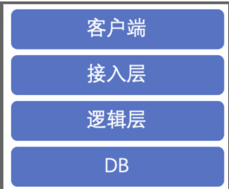
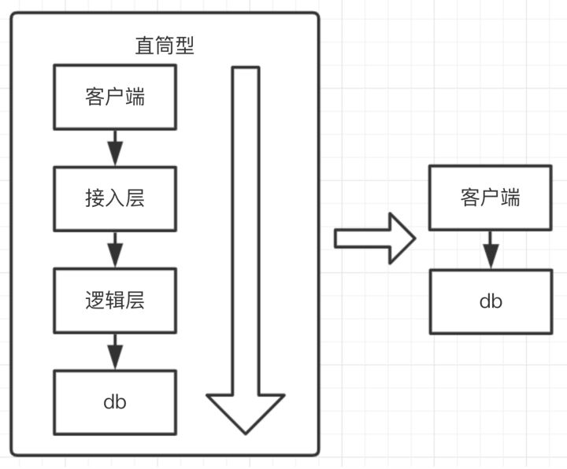
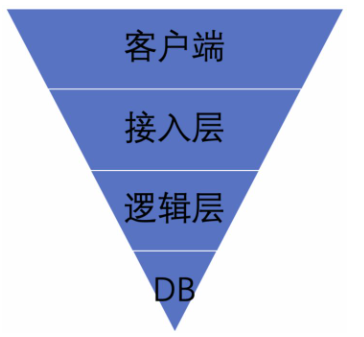
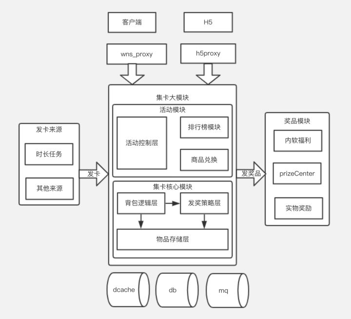
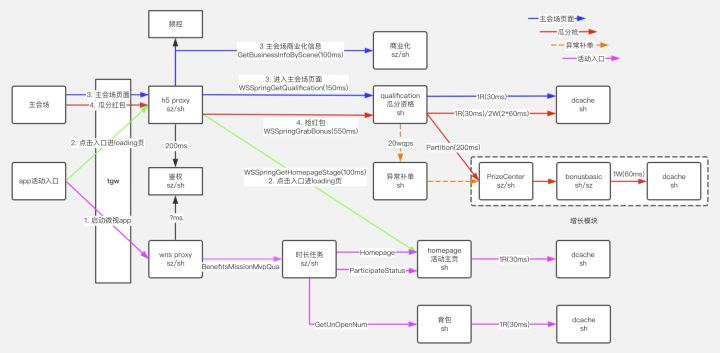
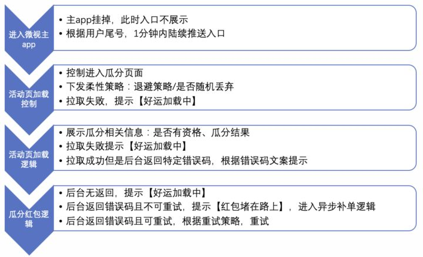
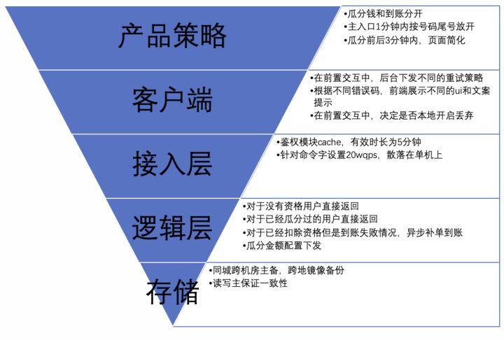

# 秒杀系统设计案例

## **秒杀系统的难点**

1. 友好的用户体验，
   1. 用户不能接受破窗的体验，例如：系统超时、系统错误的提示，或者直接 404 页面，
2. 瞬时高并发流量的挑战木桶短板理论，
   1. 整个系统的瓶颈往往都在 DB，如何设计出高并发、高可用系统？

## 如何设计

​		 上图是一个典型的互联网业务，用户完成一个写操作，一般会通过接入层和逻辑层，这里的服务都是无状态，可以通过平行拓展去解决高并发的问题；到了 db 层，必须要落到介质中，可以是磁盘/ssd/内存，如果出现 key 的冲突，会有一些并发控制技术，例如 cas/加锁/串行排队等。

### 直筒型

​			直筒型业务，指的是用户请求 1:1 的洞穿到 db 层，如下图所示。在比较简单的业务中，才会采用这个模型。随着业务规模复杂度上来，一定会有 db 和逻辑层分离、逻辑层和接入层分离。

### 漏斗型

​			漏斗型业务，指的是，用户的请求，从客户端到 db 层，层层递减，递减的程度视业务而定。例如当 10w 人去抢 1 个物品时，db 层的请求在个位数量级，这就是比较理想的模型。如下图所示

这个模型，是高并发的基础，翻译一下就是下面这些：

- 及早发现，及早拒绝
- Fast Fail
- 前端保护后端

### 如何实现漏斗型系统

​			漏斗型系统需要从产品策略/客户端/接入层/逻辑层/DB 层全方位立体的设计。

#### 产品策略

- 轻重逻辑分离，以秒杀为例，将抢到和到账分开；

- - 抢到，是比较轻的操作，库存扣成功后，就可以成功了
  - 到账，是比较重的操作，需要涉及到到事务操作

- 用户分流，以整点秒杀活动为例，在 1 分钟内，陆续对用户放开入口，将所有用户请求打散在 60s 内，请求就可以降一个数量级

- 页面简化，在秒杀开始的时候，需要简化页面展示，该时刻只保留和秒杀相关的功能。例如，秒杀开始的时候，页面可以不展示推荐的商品。

#### 客户端

- 重试策略非常关键，如果用户秒杀失败了，频繁重试，会加剧后端的雪崩。如何重试呢？根据后端返回码的约定，有两种方法：

- - 不允许重试错误，此时 ui 和文案都需要有一个提示。同时不允许重试
  - 可重试错误，需要策略重试，例如二进制退避法。同时文案和 ui 需要提示。

- ui 和文案，秒杀开始前后，用户的所有异常都需要有精心设计的 ui 和文案提示。例如：【当前活动太火爆，请稍后再重试】【你的货物堵在路上，请稍后查看】等

- 前端随机丢弃请求可以作为降级方案，当用户流量远远大于系统容量时，人工下发随机丢弃标记，用户本地客户端开始随机丢弃请求。

#### 接入层

1. 所有请求需要鉴权，校验合法身份

- - 如果是长链接的服务，鉴权粒度可以在 session 级别；如果是短链接业务，需要应对这种高并发流量，例如 cache 等

2. 根据后端系统容量，需要一个全局的限流功能，通常有两种做法：

- - 设置好 N 后，动态获取机器部署情况 M，然后下发单机限流值 N/M。要求请求均匀访问，部署机器统一。
  - 维护全局 key，以时间戳建 key。有热 key 问题，可以通过增加更细粒度的 key 或者定时更新 key 的方法。

3. 对于单用户/单 ip 需要频控，主要是防黑产和恶意用户。如果秒杀是有条件的，例如需要完成 xxx 任务，解锁资格，对于获得资格的步骤，可以进行安全扫描，识别出黑产和恶意用户。

#### 逻辑层

- 逻辑层首先应该进入校验逻辑，例如参数的合法性，是否有资格，如果失败的用户，快速返回，避免请求洞穿到 db。

- 异步补单，对于已经扣除秒杀资格的用户，如果发货失败后，通常的两种做法是：

- - 事务回滚，回滚本次行为，提示用户重试。这个代价特别大，而且用户重试和前面的重试策略结合的话，用户体验也不大流畅。
  - 异步重做，记录本次用户的 log，提示用户【稍后查看，正在发货中】，后台在峰值过后，启动异步补单。需要服务支持幂等

- 对于发货的库存，需要处理热 key。通常的做法是，维护多个 key，每个用户固定去某个查询库存。对于大量人抢红包的场景，可以提前分配。

#### 存储层

对于业务模型而言，对于 db 的要求需要保证几个原则：

- 可靠性

- - 主备：主备能互相切换，一般要求在同城跨机房
  - 异地容灾：当一地异常，数据能恢复，异地能选主
  - 数据需要持久化到磁盘，或者更冷的设备

- 一致性

- - 对于秒杀而言，需要严格的一致性，一般要求主备严格的一致。

## 实践——微视集卡瓜分系统

微视集卡瓜分项目属于微视春节项目之一。用户的体验流程如下：

### 架构图

- 客户端主要是微视主 app 和 h5 页面，主 app 是入口，h5 页面是集卡活动页面和瓜分页面。
- 逻辑部分为分：发卡来源、集卡模块、奖品模块，发卡来源主要是任务模块；集卡模块主要由活动模块和集卡模块组成。瓜分部分主要在活动控制层。
- 奖品模块主要是发钱和其他奖品。

### 瓜分降级预案

为了做好瓜分时刻的高并发，对整个系统需要保证两个重要的事情：

- 全链路梳理，包括调用链的合理性和时延设置
- 降级服务预案分析，提升系统的鲁棒性

如下图所示，是针对瓜分全链路调用分析如下图，需要特别说明的几点：

- 时延很重要，需要全链路分析。不但可以提高吞吐量，而且可以快速暴露系统的瓶颈。
- 峰值时刻，补单逻辑需要关闭，避免加剧雪崩。

我们的降级预案大概如下：

- 一级预案，瓜分时刻前后 5 分钟自动进入：

- - 入口处 1 分钟内陆续放开入口倒计时，未登录用户不弹入口
  - 主会场排队，以进入主会场 100w qps 为例，超过了进入排队，由接入层频控控制
  - 拉取资格接口排队，拉取资格接口 100w qps，超过了进入排队，由接入层频控控制
  - 抢红包排队，抢红包 100w qps，超过了进入排队，由接入层频控控制
  - 红包到账排队，如果资格扣除成功，现金发放失败，进入排队，24 小时内到账。异步补单
  - 入口处调用后端非关键 rpc: ParticipateStatus，手动关闭
  - 异步补单逻辑关闭。

- 二级预案，后端随机丢请求，接入层频控失效或者下游服务过载，手动开启进入

- 三级预案，前端随机丢请求，后端服务过载或者宕机进入。手动开启

综上，整个瓜分时刻体验如下所示：

回顾下漏斗模型，总结下整个实践：

