# 打车系统设计

## 初版设计

### 需求说明

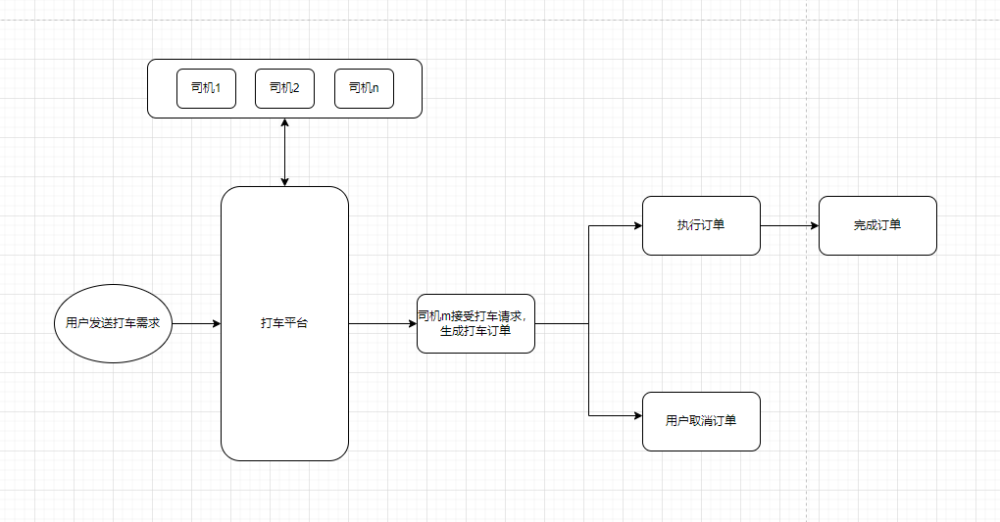

### 业务说明

+ 用户发送打车需求，需求内容宝库
  + 接车点
  + 终点位置
+ 打车平台司机推送订单消息，原则是尽可能不要让顾客等太久
  + **先进行抢单**：向周围三公里的司机推送打车需求，先让司机进行抢单
  + 1分钟内没有人抢单，那么就开启推送**主动推送模式**，优先推送闲置状态的司机，15秒内没有接单回复，自动推送下一个司机
  + 如果主动推送失败，那么就进一步扩大司机的搜索范围进行推送，与此同时，抢单机制依旧开启，一旦有司机接收打车需求，那么马上生成打车订单
+ 执行订单：司机到打车点接顾客 -> 确认行驶路线 -> 定时上报行车位置 -> 抵达终点
+ 完成订单

### 执行订单说明

+ 司机接受订单后，司机到底出发点，点击**”我已到达出发点“**，系统根据出发点位置与手机定位，确认属实，然后给用户发送信息
+ 接到顾客后，可以将提前生成的行驶路线交给用户确认
+ 客户端根据车辆行驶的节点**定时上传路线坐标**（可以是关键路口的坐标），可以使用Nosql进行存储
+ 如果车辆偏离坐标，马上同时向司机和用户发送
+ 抵达重点，确认完成订单

## 订单监控设计

### 订单监控问题

1. 如果使用服务端监控订单状态，那么服务端会因为订单太多而压力变大，所以客户端主动推送实时位置更好，服务端针对司机、用户推送的订单状态进行比对和同步，然后写入数据库
2. 如果订单异常，则促发警告系统，由服务端进行监控，将数据存入到缓存中，针对异常的订单进行轮训处理，需要保证每个异常的订单都被一个服务处理，不能被重复的处理

### 业务架构图

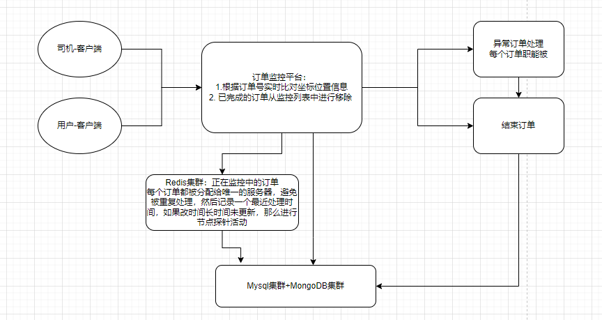

### 设计说明

1. Redis用来记录正在进行中的订单
2. 监控平台主从设计
   1. 主节点功能：定时轮训异常订单（长时间未更新、订单状态不正常）、监控从节点、重新分配任务订单、消息路由
   2. 从节点功能：定时更新Redis集群的信息
3. 注意事项
   1. 每个订单都被分配给唯一的服务器，避免被重复处理，然后记录一个最近处理时间，
   2. 如果某个订单长时间未更新，那么进行节点探针活动，从节点死亡的话就重新为订单分配服务节点

## 前言

### 参考资料

+ [csdn-打车软件系统分析与设计方案](https://blog.csdn.net/baidu_40395808/article/details/120711481?ops_request_misc=%257B%2522request%255Fid%2522%253A%2522166435978016781432931654%2522%252C%2522scm%2522%253A%252220140713.130102334..%2522%257D&request_id=166435978016781432931654&biz_id=0&utm_medium=distribute.pc_search_result.none-task-blog-2~all~sobaiduend~default-1-120711481-null-null.142^v50^control,201^v3^control_1&utm_term=%E6%89%93%E8%BD%A6%E7%B3%BB%E7%BB%9F%E8%AE%BE%E8%AE%A1&spm=1018.2226.3001.4187)

### 引言

随着移动互联网的发展，各行各业纷纷进行升级转型。在传统出租车行业，由于司机绕路、拒载等行为普遍存在，“打车难”、“打车贵”等问题层出不穷。因此，针对这些痛点，打车软件应运而生。打车软件，又称网约车平台，是指以互联网技术为依托构建的服务平台，通过接入符合条件的车辆和驾驶员，整合供需信息，提供非巡游的预约出租汽车服务[1]。

本文的主要工作是完成打车软件的分析与设计。为设计一款具有市场竞争力的打车软件，有必要了解当前的市场环境，因此本文首先回顾中国网约车行业的发展历程，并对网约车市场现状加以分析。

### 网约车行业发展历程

+ 在探索期，网约车平台逐渐兴起：2010年，易到用车上线；2012年，滴滴打车和快的打车上线；2014年，Uber进入中国，同年，嘀嗒拼车成立；2015年，神州租车推出神州专车业务。
+ 2015-2016两年间，网约车行业进入竞争激烈的市场启动期。在这一阶段，发生了两次重大的合并事件：一是滴滴打车和快的打车宣布合并，市场完成初步洗牌；二是滴滴在合并之后又将Uber中国收入囊中，市场进入寡头化。另一方面，传统车企和租赁公司也开始向网约车市场进军，首汽集团的首汽约车、吉利集团的曹操专车于2015年先后上线。
+ 2016年7月，《网络预约出租汽车经营服务管理暂行办法》颁布，网约车的合法地位得以肯定。此后，网约车行业进入高速发展期。随着美团打车、高德地图以及汽车主机厂的纷纷入局，网约车市场的竞争持续加剧。

### 网约车市场现状分析

+ 目前，中国移动出行市场规模快速增长，移动出行用户将近5亿人，汽车出行市场容量达3800亿元[3]。网约车服务品牌和业务模式大致分为三类：一类是C2C模式的互联网平台，如滴滴出行、嘀嗒出行；一类是B2C模式的车企和租赁公司，车企如上汽投资的享道出行、广汽投资的如祺出行、吉利的曹操出行及三大央企（长安、一汽、东风）投资的T3出行；租赁公司如首汽约车、神州专车等。此外，最近兴起的一类是B2B2C模式的互联网聚合平台，以高德和美团为代表，又被称为“平台之上的平台”，方便用户一键呼叫多个第三方平台的网约车服务。
+ 整体而言，当前的中国网约车市场呈现“一超多强”的竞争格局。滴滴出行占据大部分市场份额，截至2018年12月31日，滴滴出行app安装渗透率达14.71%，是位列第二的神州专车的10倍以上[4]。滴滴的商业模式属于“纯平台”模式，这种模式轻量化运营、用户和数据变现前景可期，但具有较高的进入壁垒。而且由于政府对平台的监管趋严、合规压力大，运力短缺问题短期内将持续困扰“纯平台”企业[5]。在这种前有围堵（滴滴）后有追兵（合规政策）的局势下，若无颠覆性的技术和极端的政治因素出现，“纯平台”模式很难再出现有威胁的新企业。
+ 相较“纯平台”模式，“平台+运力”模式尚有机会进入网约车市场分一杯羹。“平台+运力”的网约车公司背靠具有区域优势的租赁公司、整车厂等，受到当地政府的支持，合规化程度较高，投入相对较少，能够在盈利性和运力保障间寻求平衡。
+ 另外，从长期来看，网约车市场整体需求将持续高涨。一是随着疫情的好转，企业相继复工，出行市场逐渐复苏，网约车市场用户规模将会恢复性增长[6]；二是随着城镇化水平提升，经济持续发展，基础设施持续完善，中国未来城镇居民出行需求将持续增长；三是由于私家车的限购及征收拥堵税，随着移动共享出行的日益成熟，共享出行将受到更多消费者的青睐。
+ 因此，在需求旺盛且有待开垦的二线城市，“平台+运力”模式的网约车企业仍具有一定的发展空间。下文将以这样的企业为业务方，完成打车软件的系统分析与方案设计。

## 系统需求分析

### 乘坐端需求

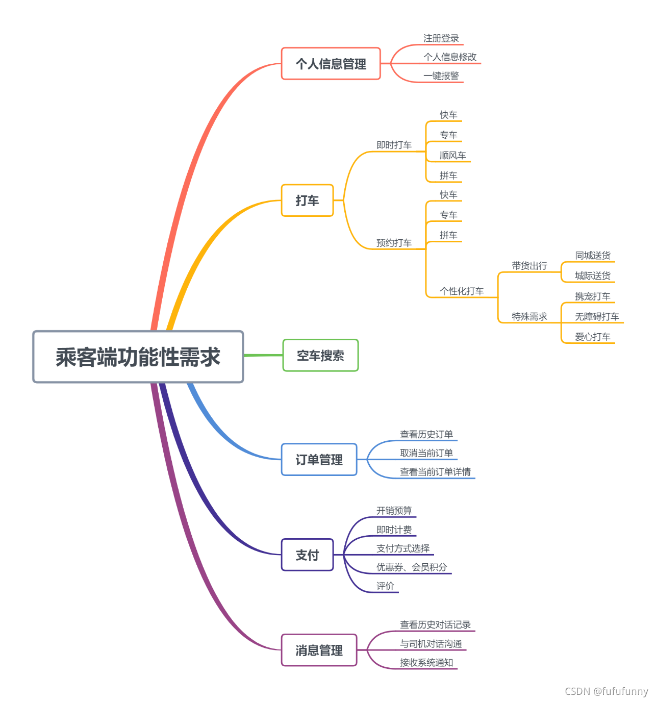

### 司机端功能性需求

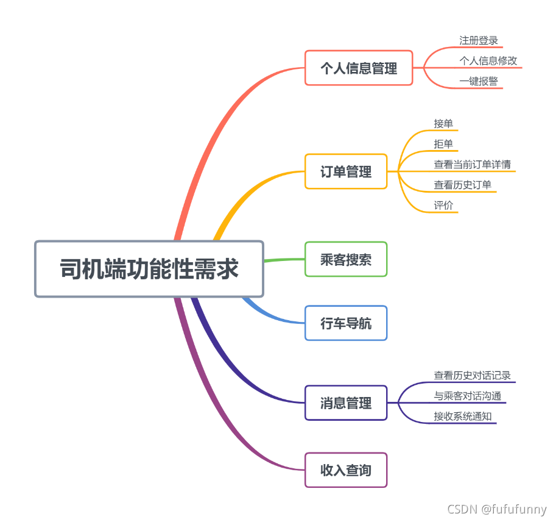

## 系统模型

系统以乘客、司机、第三方地图、第三方支付、以及第三方安全中心为边界。

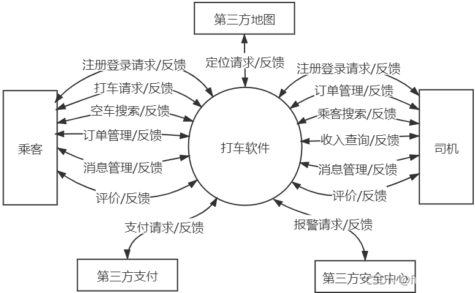‘

打车软件顶层数据流图

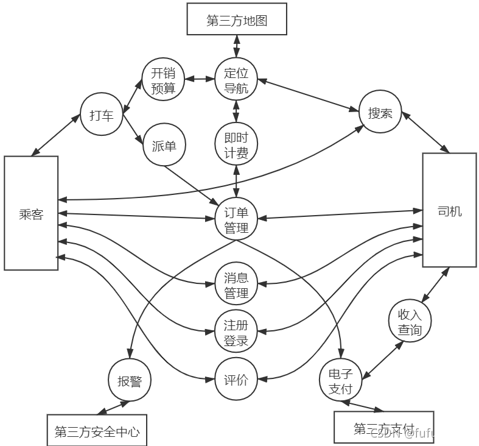

## 软件设计方案

### 功能设计

对比乘客端与司机端的功能性需求发现：乘客端与司机端的很多功能是相似的、甚至相同的。因此，相似或相同的功能可并入一个模块处理。最终整个打车软件系统可分为个人信息、打车、定位、订单管理、消息管理五个模块。

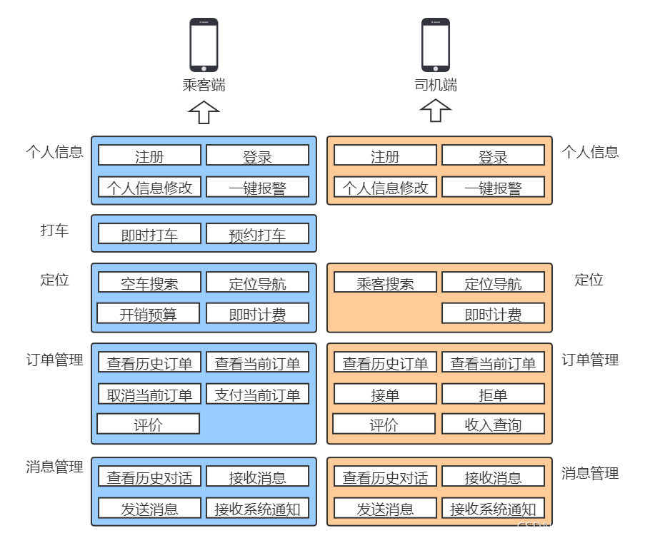

### 数据设计

#### 数据库概念设计

打车软件系统的E-R图如图 7所示，可以看到：一个乘客可以预定和支付多个订单，一个司机也可以接收多个订单；但一个司机只能驾驶一辆网约车。另外，司机与乘客之间还存在搭乘、对话及评价关系。

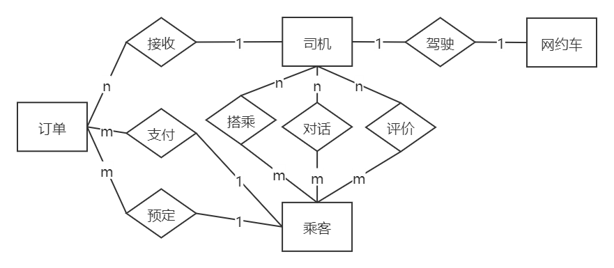

#### 数据库逻辑设计

根据系统模型，本文为打车软件系统设计了8个数据表，包括乘客信息表、司机信息表、乘客位置表、司机位置表、订单记录表、消息记录表、乘客评价记录表、司机评价记录表。各数据表的设计结构如下：

+ 乘客信息表（passenger）：记录乘客端用户的基本信息，乘客用户注册时添加的用户名、密码、姓名、性别、手机号等基本信息都会存入该表中。该表的主键为乘客编号。
+ 司机信息表（driver）：记录司机端用户的基本信息，司机端用户注册时添加的用户名、密码、姓名、性别、手机号、身份证号、驾驶证号等基本信息都会存入该表中。该表的主键为司机编号。
+ 乘客位置表（passenger_location）：记录当前乘客的位置信息，包括位置编号、经度、纬度、当前时刻、乘客编号、乘客状态。该表主键为位置编号。
+ 司机位置表（driver_location）：记录当前司机的位置信息，包括位置编号、经度、纬度、当前时刻、司机编号、司机状态。该表主键为位置编号。
+ 订单记录表（order）：记录每次打车订单的基本信息，包括订单编号、乘客编号、司机编号、起点、终点、打车时间、上车时间等基本信息。该表主键为订单编号。
+ 消息记录表（message）：记录乘客与司机的对话信息，包括消息编号、订单编号、消息发送者编号、消息接收者编号、消息发送时间。该表主键为消息编号。
+ 乘客评价表（passenger_review）：记录司机给乘客的评价信息，包括评价编号、乘客编号、订单编号、评价等级、评价内容、评价人编号、评价时间。该表主键为评价编号。
+ 司机评价表（driver_review）：记录乘客给司机的评价信息，包括评价编号、司机编号、订单编号、评价等级、评价内容、评价人编号、评价时间。该表主键为评价编号。

### 系统架构

系统设计采用MVC（Model View Controller）框架模式，这种框架模式以数据、界面显示、业务逻辑分离的方法组织代码，在改良和个性化定制界面及用户交互的同时，不需要重新编写业务逻辑，使代码具有较好的可扩展性、可复用性、可维护性及灵活性。

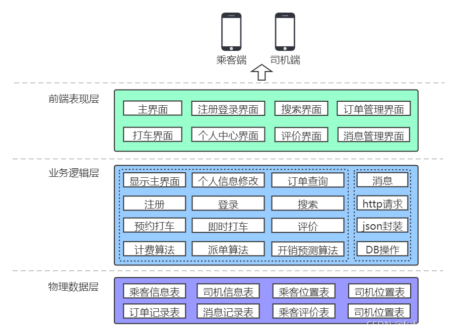

其中，前端表现层主要接收用户请求，并为用户呈现信息；业务逻辑层调用模型完成相应的业务，与数据库联动处理增删改查操作；物理数据层用于存储业务相关数据。

### 系统部署

打车软件基于C/S模型，其乘客端和司机端属于移动客户端，客户端之间通过网络进行通信，服务器端使用负载均衡和集群化的方式来应对高并发的业务需求。

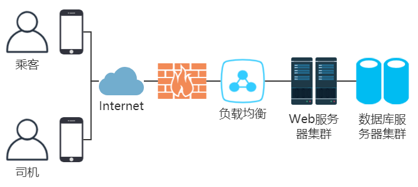

### 关键技术

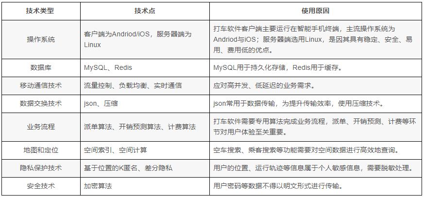

