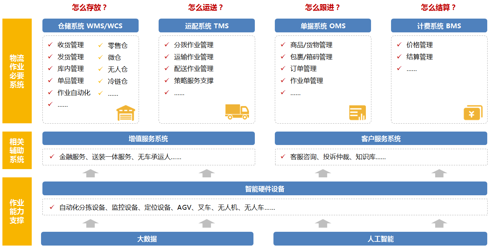
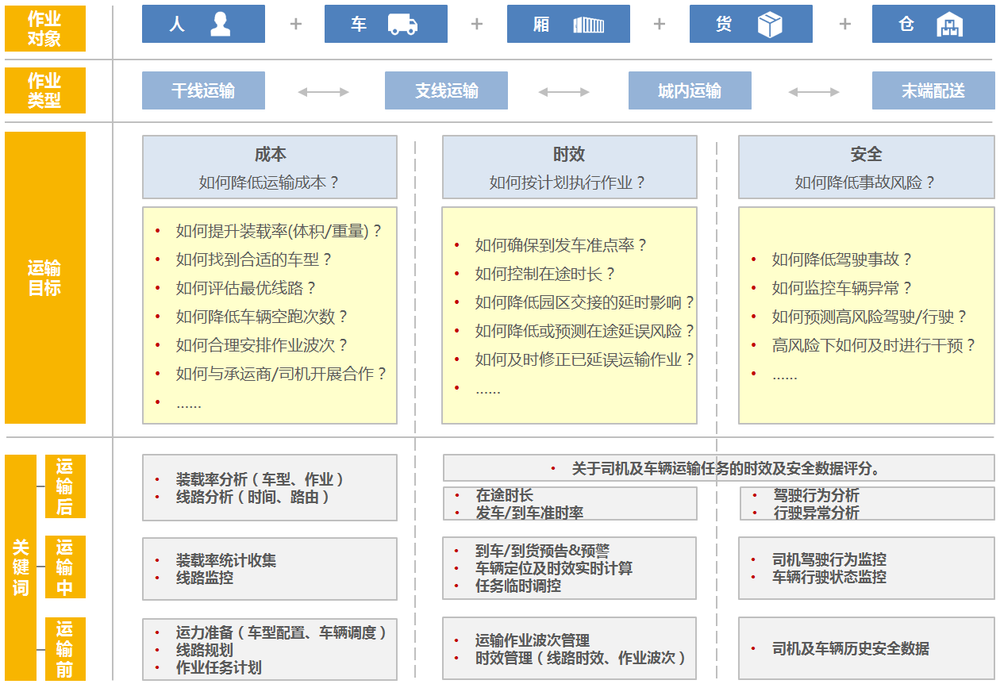
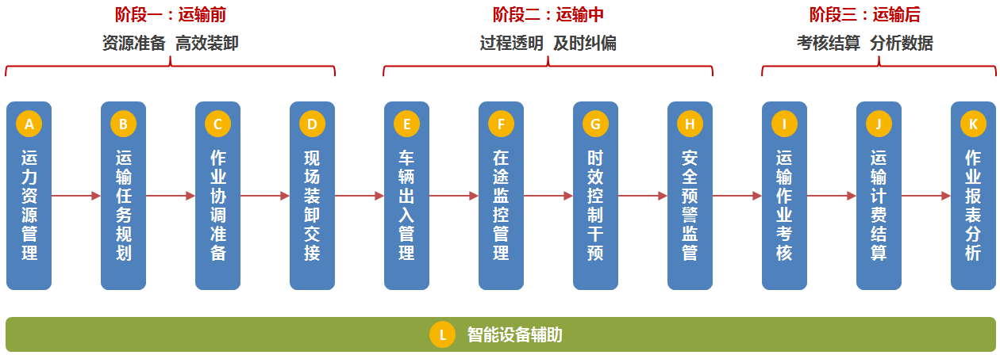
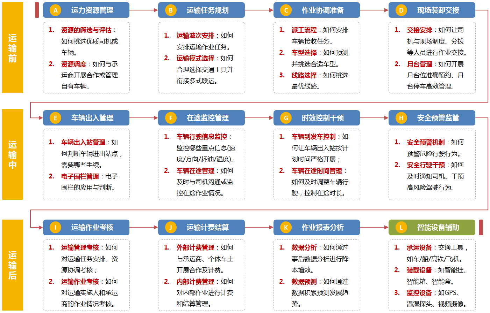
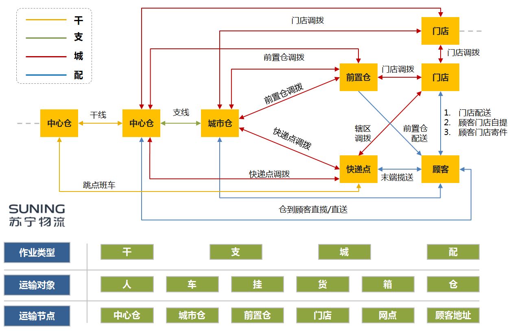
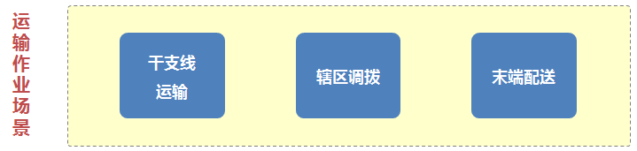
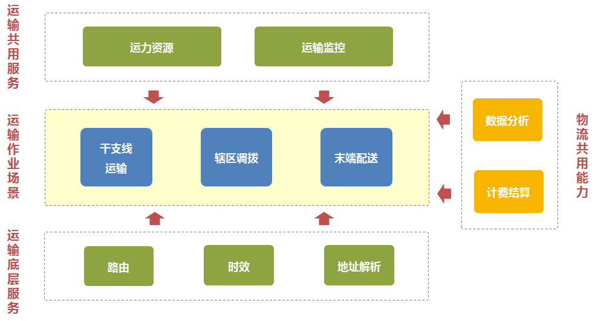
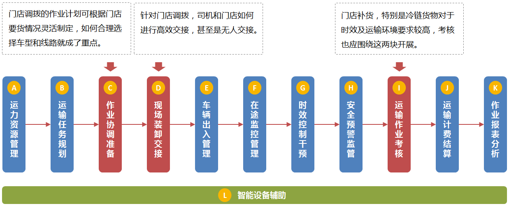

# 物流系统设计

## 概述

### 框架构成

1. 进行物流运输系统研究之前，可以先了解下运输系统在整体物流信息框架下的位置。
2. 广义上的物流系统可以视为由多个作业子系统组成，以一般综合型物流系统为例，在整体框架上可以分为仓储系统、运配系统、单据（跟单）系统和计费系统，这四块是物流作业中的核心和必要系统，而根据企业性质和业务需要的不同，物流系统可能还会包含一些相应的辅助系统，如增值服务系统、客户服务系统等。
3. 并且在物流系统的深度上，基于硬件设备的信息化应用，和对作业自动化、智能化的目标追求，使得如今热炒的“大数据”和“人工智能”也逐步成为大型物流系统的标配。

4. 物流系统从单据接收或制成开始，通过仓库拣货发货，再通过分拨进行运输、末端配送，然后进行考核、结算，所有流程都离不开系统的支撑。
5. 根据邮政局2017年的数据，运输作业总费用已占据物流总费用的近55%，而运输也是物流各作业环节中最直接的效能体现。粗犷来看，“物流”可以简单的视为点和线的关系，即如何在点之间找到合适的线，而运输的过程正是对“线”的动态演绎。所以，这里就由运输开始逐步说一说物流系统是如何设计、物流产品功能是如何规划的。

### 运输系统设计方法浅谈

我所定义的运输的实质如下：**想办法选择合适的交通载体让货物尽量按规定的时间节点以最低的成本安全完好的送达目的地。**

这里有三个关键词：

1、 **成本**：运输作业和物流中其它面向C端的作业线不同，虽然交通载体多样，但毕竟作业形式有限，且容易学习模仿。所以，在运输作业模式同质化越来越严重的今天，谁能有效的降低占物流费用大头的运输成本，谁就已在这场物流竞赛中占得了先机。

2、 **时效**：对时效的有效控制，不仅可以为末端用户带来较强的用户体验，还能让物流作业链中的各环节严格按计划衔接开展，让资源的使用更为高效和合理。但是对时效的控制，绝对不是单纯的货或车到的越早越好，货和车比原定计划到达的过早可能会导致园区或仓库的月台不能及时安排货位或车位，甚至导致园区或仓库的后续作业计划被打乱。所以时效是要让货或车无限趋近于计划的时间准确到达。

3、 **安全**：安全不必多说，事故越少则损失越小，但完全杜绝事故也是非常困难的。企业运输作业的百万公里事故率需力争压至1.5%以下，若百万公里事故率会高于3%，那就可能会引起运输作业线的崩盘。

所以，在设计运输系统产品功能时，应更多的考虑如何进行**降本**、确保**准时**和保障**安全**。在进行具体系统和产品功能规划时，若比较迷惘，不妨先围绕这三点进行思考，即如何降低运输成本？如何按计划准时执行作业？如何降低事故风险？

在有了初步方向的同时，可以更为细化的对问题再进行分解，以降低运输成本为例，可以根据运输作业中所涉及的方方面面再进行二次提问，例如为了降低运输成本，还可以再拆解为如何提升装载率？如何找到合适车型？如何评估最优线路？如何合理安排作业班次，降低车辆空跑率？

在针对成本、时效、安全三个方面讲问题逐步细化后，不难发现，为了解决这些问题，系统的产品功能已经可以初拟出一些关键词，而这些关键词又可以再逐步完善和发散，形成一系列的功能模块或功能点。

### 运输作业环节的拆解与分析

当然以上的初步提问式分析法可能还停留在概念层面，具体运输产品设计时要怎么去做、需要考虑什么，还得再根据实际的运输作业流程来进行逐步拆解。首先是第一步对运输过程的阶段性拆解，运输过程可以简单粗暴的分为运输前、运输中、运输后三大阶段。

1. 运输前，重点工作包括对运力资源的管理、对运输任务的规划、作业前的各事项协调准备、现场装卸车的交接，而这个阶段的侧重点可以归纳为“资源准备、高效装卸“；
2. 运输中，重点工作包括对车辆出入站的管理（不同交通工具管理模式不同）、对交通工具在途的监控管理、对交通载体的时效控制、对危险驾驶行为的预警和及时干预，这个阶段的侧重点可以概括为“过程透明、及时纠偏”；

3. 运输后，重点工作包括对车队或车辆的合理考核、对运输任务的计费结算、对各类重点环节的数据收集及有效分析，这个阶段最重要的工作就是收集运输过程的相关数据，包括作业数据、计费数据、车辆及司机状态数据等，再通过分析加工能产生四大类参考数据：
4. 运输作业数据，正常的运输作业数据记录，如到发车时间、装载率等数据；
5. 作业考核数据，对运输调度人员、司机及车辆的管理及作业考核数据，如发车及时率、在途时长、行驶路线偏移情况等数据；
6. 计费结算数据，对运输作业相关费用数据的记录，但不同的运输模式会直接影响到计费结算的机制；
7. 管理决策数据，根据数据的分析可为管理人员提供决策依据，如根据以往的路线行驶情况可以估算出两点之间使用什么交通工具或跑什么路线将会更为高效、如根据以往的货量判断次日或次月调度的车辆最适合使用什么样的车型等。
8. 除此之外，运输过程还离不开各类硬件设备的支撑，例如承运设备、装载设备、监控设备，所以在做系统性的产品规划时，也必须考虑到对这些硬件设备的兼容和对接问题。

通过三大阶段和十二个环节的初步拆解，运输作业的主体流程已经有了雏形，为了配合这个主体流程我们所做的系统及产品应该可以满足基本的运输需要。但是若想在主流运输系统市场中脱颖而出，真正的做到能够为作业降本、守时、保安全，还需再继续细分运输作业环节的关注点，即在原有12个环节的基础上，将具体的关注点进行细化分析。

以第一个环节“运力资源管理”为例，运力资源管理其实可以再细化为两个攻研课题：资源的筛选与评估、资源调度管理。再单说“资源筛选与评估”这一个课题，资源筛选与评估即如何为司机及车辆建立合理的评估机制，并通过评估机制去合理筛选优质的司机及车辆资源，且这样的评估机制也并非是单一的，根据车辆归属（自有车辆/外协车辆/临时车辆）不同，其评估机制也一定有所不同。

## 案例

### 苏宁运输系统设计案例

以苏宁运输系统为例（由于会涉及到企业一些内部信息这里也会做一些脱敏处理），与其他物流企业不同，苏宁物流主要有两个特点：

1. 苏宁物流的业态多样，覆盖全面，是国内较少的几乎需要支撑全业态运输作业模式的企业。在17年收购天天快递后，目前干、支、城、配四种运输形式都包括在内，从中心仓、零售仓、小店仓的干支线运输到前置仓、门店、快递点、顾客家的市内调拨和末端揽送都有覆盖。且公路、高铁、航空，以及无人车、无人机等多种运输方式，大小件等货物运输能力，无车承运人、同城配等业务模式也都需要进行系统支撑。（如图5所示）
2.  苏宁物流的系统基本都是自主开发，各类型系统拆分较细，各司其职，所以耦合性低，但业务要求及个性化需求更多。

首先在系统设计时，先看一下系统所需支撑的运输作业模式，苏宁目前主要运输作业模式如下图所示：

在面对这样业务形态广、运输模式多的系统设计时，通常可考虑将整体设计分为四步开展：

#### 场景初步梳理

由于苏宁所需支撑的运输模式及场景较多，所以在进行系统设计时还需先进行合理的设计场景粗分。目前苏宁运输产品根据场景主要分为三大块，干支线运输、辖区调拨（含前置仓/门店/快递点）以及末端配送。这三块既是运输场景中三个独立运输模式，也可以视为使用共用底层服务（运力资源/运输监控/计费结算/数据分析等）的整体运输流程中的三个环节。

#### 基于初步场景的共用服务和能力梳理

所有运输作业场景基本都基于一套共用的服务和数据资源，以苏宁运输系统为例，针对运输作业的支撑，主要有三类共用服务：

1. **运输侧特有的共用服务**，这类是指基于运输作业的一些常用功能及服务，例如运力资源管理和运输监控管理。运力资源池包括对人、车、承运商（车队）等主要运输资源的统一管理，运输监控管理包括地图监控系统、GPS解析等服务能力，这些都是无论什么运输场景和作业模式均可共用的运输服务能力；
2. **运输底层服务**，这类是指针对运输的一些底层服务能力的设计，如路由规划、时效控制、地址解析等，这些是运输作业可以顺利执行的基础保障；、
3. **物流共用能力**，这类只是整个物流域系统的一些通用服务或能力，如数据分析和计费结算。在苏宁的物流域系统中，大数据和计费都是独立运行的系统，可对整个物流域进行统一的支撑。

#### 基于初步场景和共用能力的单一场景细化梳理

在梳理出整体框架后，则可以开始针对单一场景进行细化补充。这里以作业模式较为复杂的辖区调拨为例。

辖区调拨包括了仓往前置仓、仓往门店、仓往网点、前置仓往门店、前置仓往网点、门店往网点、分拨往网点等细分作业场景的正向以及逆向调拨（可参考之前介绍的图5场景）。由于篇幅原因不能逐一细化介绍，这里就以仓往门店的调拨运输为例。

仓往门店的调拨其实还可以进一步细分为三类，一是大件（如大电器、家具）的调拨；二是常温小件的调拨；三是对温度要求较高的小件冷链运输的调拨。这三类在车辆要求、时效要求上也有所不同，但是因为同是辖区门店调拨，所以基本关注点可以视为是一致的。门店调拨其实除去共用服务外，最关注的就是作业协调准备、现场高效交接和合理的考核规则

1.  **作业协调准备**：因为门店调拨一般都是同一城市一个或几个仓库往多个门店间的货物运输，且门店要货也存在不确定性，有些门店可能几天才会发起一次补货，所以门店调拨的作业计划可根据门店当日或隔日的实际要货情况灵活制定，于是如何合理选择车型和规划线路就成了重点。故此时的系统设计重点将是围绕辖区调拨开展车型和线路的短频且合理的系统智能推荐，以帮助运输调度人员进行降本。（关于车线智能推荐我会专门介绍，如果有兴趣的朋友可以关注下我的个人微信：ernestzhong）

2. **门店现场交接**：针对门店调拨，司机和门店如何进行高效交接，甚至是无人交接。目前行业内大小便利店和电器店众多，在门店调拨的交接方式上也各不相同。以常温小件调拨为例，目前比较常用的作业模式是，司机夜间送货到门店进行无人交接，通过提前排班用系统设置好的门磁卡打开店门，在指定的[视频监控](https://cloud.tencent.com/solution/video_surveillance_storage?from=10680)可覆盖的区域内进行卸货交接。且车辆进出电子围栏时系统会自动触发到发车判断，以方便对司机作业的时效性进行考核。这一套流程看似简单，但是其细节还需要不断的打磨和完善，例如针对每次卸货操作的视频监控的截取时间，是根据车辆进出门店的电子围栏时间判断截取，还是根据门店门磁卡的刷卡时间计算截取？这里并没有标准答案，但是其实在系统设计时都需要细心斟酌、全面考量。

3. **运输作业考核**：门店补货，特别是冷链货物对于时效及运输环境要求较高，考核也会围绕这两块开展。但是具体如何考核会涉及到企业内部的一些敏感信息，这里就不做太多介绍。

#### 基于单一场景作业流程的系统融合贯通

最后一步，其实也是最为复杂的一步。就是将多个场景进行最后的融合贯通，让我们所涉及的每个场景的独立流程都能衔接起来。当然这里需要考虑的因素较多，且会涉及到整个物流域大部分系统的对接与交互。

最后再说几点运输系统规划和功能设计时比较容易陷入的误区：

1. 不要抓小失大，在设计运输系统产品时一切的核心都是为了**降本**（省）、**准时**（准）、**安全**（稳）。
2. 信息化、数字化不代表给作业人员带来更多的操作步骤，特别对运输作业来说，千万不要给司机在驾车过程中安插太多需要操作系统的行为要求。
3. 系统设计不能不近乎人情，判断标准绝不是单一的。以司机驾驶行为监控为例，驾车过程中抽烟可能对一些公司或车队来说是明令禁止的，是应该通过系统记录并给予惩罚的行为；而对于一些跑长途干线的司机来说，抽烟又或许能够帮助司机提神醒脑，所以在做司机行为监控时系统是否应该抓取司机的抽烟行为呢……（当然并不鼓励驾车吸烟行为）

