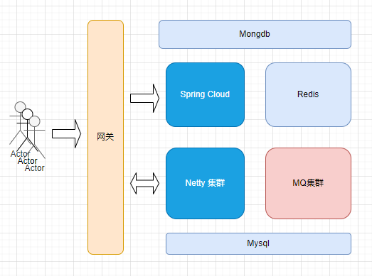
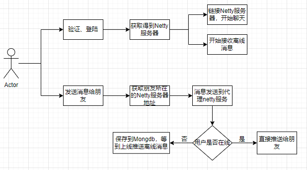
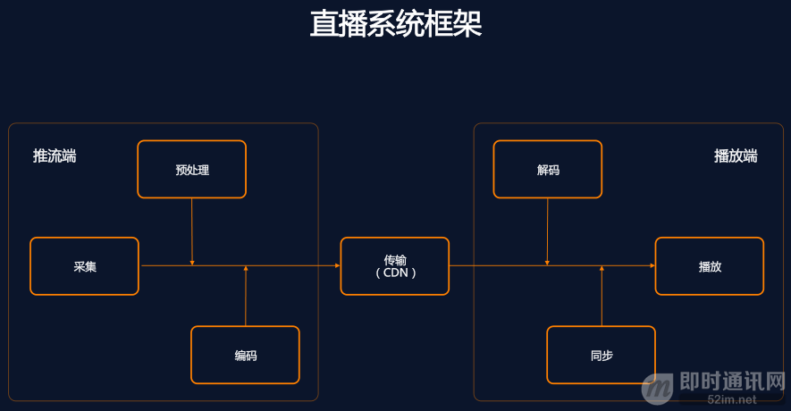
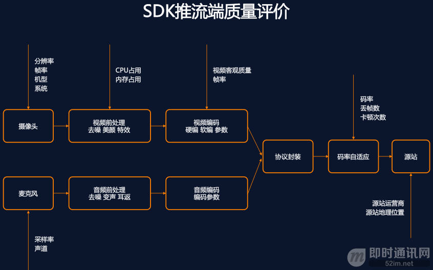
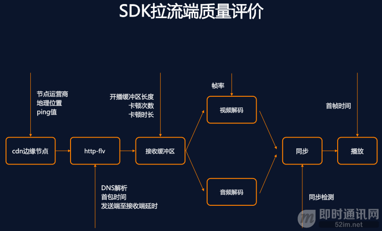

# 聊天系统设计

## 资源主要来源

[即时通信网](http://www.52im.net/)

## 前言

1. `IM`发展至今，已是非常重要的互联网应用形态之一，尤其移动互联网时代，它正以无与论比的优势降低了沟通成本和交流门槛，对各种应用形态产生了深远影响。

2. 做为`IM`开发者或即将成为`IM`开发者的技术人员，`IM`的价值和重要性不言自明。但从技术实现来说，`IM`系统的开发（尤其是移动端`IM`）还是存在许多技术难点和坑点的。也正因如此，优质的`IM`开发资料、实践成果，对于没有太多技术储备的新手来说，尤其难以获得。

## 前置问题点

### IM到底该用UDP还是TCP协议

1. 现在的移动端IM、推送系统，既面对移动互联网的不确定性，又面对智能终端频繁的系统休眠、网络切换，还要考虑服务端的承载成本，对于在线服务而言UDP是比TCP更适合的方式。但是由于数据完整性、安全性的需要，又不应完全放弃TCP的可靠与安全。
2. 所以，个人认为，更恰当的方式应该是：两种通信协议同时使用，各有侧重。UDP用于保持大量终端的在线与控制，应用与业务则通过TCP去实现。这个和FTP服务控制与数据分离，采取不同的连接，有异曲同工之处。
3. 事实上，这个也是即时通讯巨头QQ所采用的方式。早期的时候，QQ还是主要使用TCP协议，而后来就转向了采用UDP的方式来保持在线，TCP的方式来上传和下载数据。现在，UDP是QQ的默认工作方式，表现良好。相信这个也被沿用到了微信上。
4. 简单的考证：登录PC版QQ，关闭多余的QQ窗口只留下主窗口，并将其最小化。几分钟过后，查看系统网络连接，会发现QQ进程已不保有任何TCP连接，但有UDP网络活动。这时在发送聊天信息，或者打开其他窗口和功能，将发现QQ进程会启用TCP连接。

### IM的数据通信格式选型

IM应用开发的前期技术选型时，关于数据通信格式的选择，在同行的眼里，同样是个极富争议的话题。

**精略分析一下，究其原因，大概在于以下几点：**

- 可选择的协议或封装格式多种多样：XMPP、Protobuf、JSON、私有2进制、MQTT、定格化XML、Plain text等等；
- 同一种格式并不能适用于大多数的场景：如：移动端IM或消息推送的应用场景下如用XMPP协议，多数情况下都会被喷；
- 开发者对所选格式有各自的偏好：有的人或团队对某种或某几种格式有不一样的经验和技术积累，也促成了他们对某种或某几种协议的偏好。

**结论**：**强列建议将Protobuf作为你的即时通讯应用数据传输格式**

个人总结的适用Protobuf的场合

- 需要和其它系统做消息交换的，对消息大小很敏感的。那么protobuf适合了，它语言无关，消息空间相对xml和json等节省很多。
- 小数据的场合。如果你是大数据，用它并不适合。
- 项目语言是c++、java、python的，因为它们可以使用google的源生类库，序列化和反序列化的效率非常高。其它的语言需要第三方或者自己写，序列化和反序列化的效率不保证。总体而言，protobuf还是非常好用的，被很多开源系统用于数据通信的工具，在google也是核心的基础库。

### TCP的移动端IM仍然需要心跳保活？

1. TCP协议自身先天就有KeepAlive机制，为何基于它的通讯链接，仍然需要在应用层实现额外的心跳保活？本文将从移动端IM实践的角度告诉你，即使使用的是TCP协议，应用层的心跳保活仍旧必不可少。
2. 为什么需要在应用层做心跳，难道 TCP 不是个可靠连接吗？我们不能够依赖 TCP 做断线检测吗？比如使用 TCP 的 KeepAlive 机制来实现。应用层心跳是目前的最佳实践吗？怎么样的心跳才是最佳实践。
3. 使用 TCP 长连接来实现业务的最大驱动力在于：在当前连接可用的情况下，每一次请求都只是简单的数据发送和接受，免去了 DNS 解析，连接建立等时间，大大加快了请求的速度，同时也有利于接受服务器的实时消息。但前提是连接可用。使用 TCP 长连接来实现业务的最大驱动力在于：在当前连接可用的情况下，每一次请求都只是简单的数据发送和接受，免去了 DNS 解析，连接建立等时间，大大加快了请求的速度，同时也有利于接受服务器的实时消息。但前提是连接可用。
4. 为什么我们需要使用应用层心跳来做检测，而不是直接使用 TCP 的特性呢？TCP 是一个基于连接的协议，其连接状态是由一个状态机进行维护，连接完毕后，双方都会处于 established 状态，这之后的状态并不会主动进行变化，这意味着如果上层不进行任何调用，一直使 TCP 连接空闲，那么这个连接虽然没有任何数据，但仍是保持连接状态。
5. 因为 TCP KeepAlive 是用于检测连接的死活，而心跳机制则附带一个额外的功能：检测通讯双方的存活状态。两者听起来似乎是一个意思，但实际上却大相径庭。

## IM系统的架构

### 简单系统架构图设计

**说明**：

1. 网关部分部分负责用户的登录验证
2. Spring Cloud负责处理正常的业务逻辑
3. Netty服务处理负责作为聊天的服务器集群
4. Mysql主要用来处理用户数据
5. Redis在用户登录之后存储一些用户的数据
6. Mongdb作为离线消息数据的缓存
7. 当用户登陆之后，会进行消息的推送，需要通过MQ进行推送
8. 两个用户在不同的Netty上登陆，消息推送经过一个消息路由的Netty服务集群进行推送
9. Netty集群与ZK一起使用，通过ZK实现对于Netty服务的一个监控

### 简易流程设计

1. 用户登陆会获得可用的Netty服务信息，保存到本地，选择合适的Netty服务器进行消息推送
2. 消息发送会有确认机制，超过时间会进行重传
3. 每个消息会存在独立的id，投递之前避免消息的重复消费

### 群聊消息设计

#### 核心问题

1. 核心问题一：群消息，只存一份，为每个成员设置一个群消息队列，会有大量数据冗余，并不合适。
2. 怎么知道每个成员读了哪些消息：可以利用群消息的偏序关系，记录每个成员的last_ack_msgid（last_ack_time），这条消息之前的消息已读，这条消息之后的消息未读。该方案意味着，对于群内的每一个用户，只需要记录一个值即可

#### 群消息发送的流程

- 1）A发出群消息；
- 2）server收到消息后，一来要将群消息落地，二来要查询群里有哪些群成员，以便实施推送；
- 3）对于群成员，查询在线状态；
- 4）对于在线的群成员，实施推送。

#### 如何保证接收方一定收到群消息？

+ 各个收到消息后，要修改各群成员的last_ack_msgid，以告诉系统，这一条消息确认收到了。
+ 对于在线的群友，收到群消息后，第一时间会ack、修改last_ack_msgid。
+ 对于离线的群友，会在下一次登录时，拉取未读的所有群离线消息，并将last_ack_msgid修改为最新的一条消息。

#### 如果ack丢失，群友会不会拉取重复的群消息？

会，可以根据msgid在客户端本地做去重，即使系统层面收到了重复的消息，仍然可以保证良好的用户体验。

#### 已读回执流程的设计

对于发送方发送的任何一条群消息，都需要知道，这条消息有多少人已读多少人未读，就需要一个基础表来记录这个关系。

**消息回执表：**用来记录消息的已读回执

>  msg_acks(sender_uid, msgid, recv_uid, gid,if_ack);

各字段的含义为：发送方UID，消息ID，回执方UID，群ID，回执标记。

**接着，server收到消息后，除了要：**

- 1）将群消息落地；
- 2）查询群里有哪些群成员，以便实施推送；

**之外，还需要：**

- 3）插入每条消息的初始回执状态。

**接收方修改last_ack_msgid的流程，会变为：**

- 1）发送ack请求；
- 2）修改last_ack_msgid，并且，修改已读回执if_ack状态；
- 3）查询发送方在线状态；
- 4）向发送方实时推送已读回执（如果发送方在线）；

**如果发送方不在线，ta会在下次登录的时候：**

- 5）从关联表里拉取每条消息的已读回执。

**这里的初步结论是：**

- 如果发送方在线：会实时被推送已读回执；
- 如果发送方不在线：会在下次在线时拉取已读回执。

#### 优化

**对于群消息已读回执，一般来说：**

- 如果发送方在线，会实时被推送已读回执；
- 如果发送方不在线，会在下次在线时拉取已读回执。

**如果要对进行优化，可以：**

- 接收方累计收到N条群消息再批量ack；
- 发送方轮询拉取已读回执。

物理删除已读回执数据，定时删除或归档非核心历史数据。

### 直播（音视频）系统的设计

注意：直播系统会有很多细节上的设计，这里仅仅做一个简单的了解

主要流程

- 视音频信号实时采集；
- 经过预处理和音视频编码；
- 封装发送到CDN源站；
- 播放端从CDN边缘拉到数据；
- 然后进行解码；
- 经过音视频同步之后；
- 给观众展现出来。

**在推流端和播放端分别做了非常完善的质量监测体系（见下图）：**

- 在推流端，数据的源头是摄像头采集到的画面和麦克风采集到的声音，不同的机型和系统，摄像头和麦克风的能力完全不同，所以我们首先对摄像头的分辨率、帧率、机型等关键信息进行收集；
- 接下来是视频前处理的过程，比如去噪、美颜、特效等，这些都是非常耗CPU和内存资源的操作，所以这个环节对CPU和内存的占用做了详细的上报；
- 前处理之后会进行视频编码，视频编码的质量影响整个视频的观看体验，对视频编码器，主要是上报了视频编码的客观质量和编码器的输出帧率；
- 音频数据的采集编码过程和视频类似；
- 编码完成之后的数据会进行协议封装，然后进入码率自适应模块，码率自适应模块的功能主要是调整输出码率以适应用户的网络带宽，在用户网络变差的时候，自适应模块会主动丢弃一些数据以降低对网络的压力，推流端的卡顿也主要是发生在这里，所以在这里对自适应模块的输出码率，丢帧数量，卡顿次数都做了详尽的统计；
- 数据最后到达到CDN服务商的源站，CDN服务商分配的源站节点是否合理，是否和用户在同一地域，同一运营商，都直接影响到用户的连接质量，所以源站节点的地理位置和运营商信息，也是对质量评价非常重要的信息。

**我们再来看看拉流（播放）端，拉流端整体的流程和推流端是一个反过来的流程（见下图）：**

- 客户端先经过DNS解析，连接到CDN的边缘节点，和推流端类似，需要对DNS解析时间，边缘节点的运营商、地理位置、RTT值等关键信息进行采集；
- 从CDN边缘节点拿到的http-flv数据会先经过解封装送到接收缓冲区，在这个阶段可以对CDN服务节点的首包时间，发送至接收的端到端延时进行统计；
- 接收缓冲区的长度决定了拉流端的网络抗性，这里可以采集到卡顿的次数和时长，缓冲区本身的长度也是需要监控的点；
- 数据从缓冲区输出，会分别进行音频和视频的解码，经过音视频同步，进入播放环节。这里从拉流启动到播放出第一帧画面的时间就是首帧时间。

