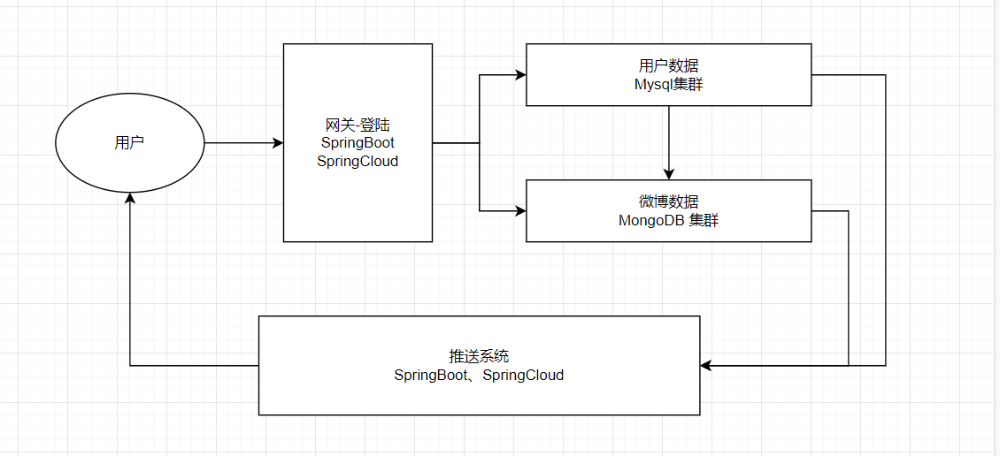

# 概论

## 说明

聊天系统，可以说是互联网最基本的一个应用需求，聊天的形式也可以说是多种多样的，比如：

+ 一对一：好友模式
+ 一对多：广播模式
+ 多对多：群聊模式

针对以上三种模式，其实产生了多种不同的显示科技产品，它们以不同的形式表现出来，但归根结底仍然是人与人之间通信方式的一个变种，比如

+ 微信：好友聊天，群聊
+ 微博、知乎、朋友圈、抖音、快手：类似一对多消息广播+离线消息处理
+ 直播：高并发群聊系统
+ 弹幕：一对多+离线消息系统

随着需求的改变，对于技术本身实际上是量变引起质变的一个过程，技术本身的变化其实并不多，最重要的是基于不同种类业务和用户量，从而设计出最符合当前应用的系统架构才是一个架构师最重要的职责。

## 相关文章

**IM群聊方面的文章：**

《[快速裂变：见证微信强大后台架构从0到1的演进历程（一）](http://www.52im.net/thread-168-1-1.html)》

《[如何保证IM实时消息的“时序性”与“一致性”？](http://www.52im.net/thread-714-1-1.html)》

《[IM单聊和群聊中的在线状态同步应该用“推”还是“拉”？](http://www.52im.net/thread-715-1-1.html)》

《[IM群聊消息如此复杂，如何保证不丢不重？](http://www.52im.net/thread-753-1-1.html)》

《[微信后台团队：微信后台异步消息队列的优化升级实践分享](http://www.52im.net/thread-801-1-1.html)》

《[移动端IM中大规模群消息的推送如何保证效率、实时性？](http://www.52im.net/thread-1221-1-1.html)》

《[现代IM系统中聊天消息的同步和存储方案探讨](http://www.52im.net/thread-1230-1-1.html)》

《[关于IM即时通讯群聊消息的乱序问题讨论](http://www.52im.net/thread-1436-1-1.html)》

《[IM群聊消息的已读回执功能该怎么实现？](http://www.52im.net/thread-1611-1-1.html)》

《[IM群聊消息究竟是存1份(即扩散读)还是存多份(即扩散写)？](http://www.52im.net/thread-1616-1-1.html)》

《[一套高可用、易伸缩、高并发的IM群聊、单聊架构方案设计实践](http://www.52im.net/thread-2015-1-1.html)》

《[[技术脑洞\] 如果把14亿中国人拉到一个微信群里技术上能实现吗？](http://www.52im.net/thread-2017-1-1.html)》

《[IM群聊机制，除了循环去发消息还有什么方式？如何优化？](http://www.52im.net/thread-2213-1-1.html)》

《[网易云信技术分享：IM中的万人群聊技术方案实践总结](http://www.52im.net/thread-2707-1-1.html)》

《[阿里钉钉技术分享：企业级IM王者——钉钉在后端架构上的过人之处](http://www.52im.net/thread-2848-1-1.html)》

《[IM群聊消息的已读未读功能在存储空间方面的实现思路探讨](http://www.52im.net/thread-3054-1-1.html)》

\>> [更多同类文章 ……](http://www.52im.net/forum.php%3Fmod%3Dcollection%26action%3Dview%26ctid%3D20)

**[2] 更多直播技术的文章：**

《[移动端实时音视频直播技术详解（一）：开篇](http://www.52im.net/thread-853-1-1.html)》

《[移动端实时音视频直播技术详解（二）：采集](http://www.52im.net/thread-955-1-1.html)》

《[移动端实时音视频直播技术详解（三）：处理](http://www.52im.net/thread-960-1-1.html)》

《[移动端实时音视频直播技术详解（四）：编码和封装](http://www.52im.net/thread-965-1-1.html)》

《[移动端实时音视频直播技术详解（五）：推流和传输](http://www.52im.net/thread-967-1-1.html)》

《[移动端实时音视频直播技术详解（六）：延迟优化](http://www.52im.net/thread-972-1-1.html)》

《[理论联系实际：实现一个简单地基于html\]5的实时视频直播](http://www.52im.net/thread-875-1-1.html)》

《[实时视频直播客户端技术盘点：Native、html\]5、WebRTC、微信小程序](http://www.52im.net/thread-1564-1-1.html)》

《[Android直播入门实践：动手搭建一套简单的直播系统](http://www.52im.net/thread-1154-1-1.html)》

《[淘宝直播技术干货：高清、低延时的实时视频直播技术解密](http://www.52im.net/thread-3220-1-1.html)》

《[技术干货：实时视频直播首屏耗时400ms内的优化实践](http://www.52im.net/thread-2087-1-1.html)》

《[新浪微博技术分享：微博实时直播答题的百万高并发架构实践](http://www.52im.net/thread-2022-1-1.html)》

《[实时音频的混音在视频直播中的技术原理和实践总结](http://www.52im.net/thread-1904-1-1.html)》

《[七牛云技术分享：使用QUIC协议实现实时视频直播0卡顿！](http://www.52im.net/thread-1406-1-1.html)》

《[近期大热的实时直播答题系统的实现思路与技术难点分享](http://www.52im.net/thread-1369-1-1.html)》

《[P2P技术如何将实时视频直播带宽降低75%？](http://www.52im.net/thread-1289-1-1.html)》

《[网易云信实时视频直播在TCP数据传输层的一些优化思路](http://www.52im.net/thread-1254-1-1.html)》

《[首次披露：快手是如何做到百万观众同场看直播仍能秒开且不卡顿的？](http://www.52im.net/thread-1033-1-1.html)》

《[浅谈实时音视频直播中直接影响用户体验的几项关键技术指标](http://www.52im.net/thread-953-1-1.html)》

《[技术揭秘：支持百万级粉丝互动的Facebook实时视频直播](http://www.52im.net/thread-541-1-1.html)》

《[移动端实时视频直播技术实践：如何做到实时秒开、流畅不卡](http://www.52im.net/thread-530-1-1.html)》

《[实现延迟低于500毫秒的1080P实时音视频直播的实践分享](http://www.52im.net/thread-528-1-1.html)》

《[浅谈开发实时视频直播平台的技术要点](http://www.52im.net/thread-475-1-1.html)》

# 聊天系统设计

## 资源主要来源

[即时通信网](http://www.52im.net/)

## 前言

1. `IM`发展至今，已是非常重要的互联网应用形态之一，尤其移动互联网时代，它正以无与论比的优势降低了沟通成本和交流门槛，对各种应用形态产生了深远影响。

2. 做为`IM`开发者或即将成为`IM`开发者的技术人员，`IM`的价值和重要性不言自明。但从技术实现来说，`IM`系统的开发（尤其是移动端`IM`）还是存在许多技术难点和坑点的。也正因如此，优质的`IM`开发资料、实践成果，对于没有太多技术储备的新手来说，尤其难以获得。

## 概要设计

### 第一版设计

#### 架构图

#### 业务描述

1. 两个客户端可以链接到服务器
2. 当前客户端可以发送消息到指定的另一个客户端
3. 当前客户端可以接受来自另一个客户端的消息

#### 需求分析：
因为需求简单，就是网路同行和数据的转发，所以简单的Netty就可以了

#### 技术选型：

1. Netty：负责构建通信使用的服务器

### 第二版设计

#### 架构图

#### 业务描述

1. 多个客户链接到服务器
2. 客户端之间存在好友关系，非好友之间不能发送消息
3. 增加理想消息功能，客户端可以发送消息给离线的好友
4. 用户登录后，会自动获取离线消息

#### 需求分析

1. 服务端需要增加数据存储功能，主要存储两方面数据：用户数据、用户离线消息
2. 服务端增加用户登陆验证功能
3. 两个好友不在同一个服务器上面，如何实现消息的传输

#### 问题解决

1. 增加用户数据存储的Mysql进行用户数据存储
2. 增加NoSql服务器，保存需要发送的离线消息
3. 增加缓存，用于记录某个用户登陆信息和链接的消息服务器信息
4. 增加消息转发服务器，消息服务器接收到的消息同意发送到消息转发服务器
5. 增加离线消息处理服务器，当用户登陆时，从消息存储服务其中拿到消息，然后发送到消息转发服务器，进行消息推送

#### 技术选型

1. Netty：负责构建不同消息服务器：常规、转发、离线等消息服务器
2. Netty可以与ZK一起使用，通过ZK实现对于Netty服务的一个监控
3. SpringBoot、SpringCloud：负责用户的登陆验证功能
4. MySql集群：负责用户相关数据存储
5. MongoDB集群：负责存储用户的离线数据
6. Redis集群：记录当前登陆的用户信息（包括链接的消息服务器的信息）
7. 消息中间件：处理离校消息，减轻离线消息服务器的压力

### 工作流程的设计

#### 业务流程图

#### 业务说明

1. 用户登陆会获得可用的Netty服务信息，保存到本地，选择合适的Netty服务器进行消息推送
2. 消息发送会有确认机制，超过时间会进行重传
3. 每个消息会存在独立的id，投递之前避免消息的重复消费

## 详细设计要点

### IM到底该用UDP还是TCP协议

#### 描述

1. 现在的移动端IM、推送系统，既面对移动互联网的不确定性，又面对智能终端频繁的系统休眠、网络切换，还要考虑服务端的承载成本，对于在线服务而言UDP是比TCP更适合的方式。但是由于数据完整性、安全性的需要，又不应完全放弃TCP的可靠与安全。
2. 所以，个人认为，更恰当的方式应该是：两种通信协议同时使用，各有侧重。UDP用于保持大量终端的在线与控制，应用与业务则通过TCP去实现。这个和FTP服务控制与数据分离，采取不同的连接，有异曲同工之处。
3. 事实上，这个也是即时通讯巨头QQ所采用的方式。早期的时候，QQ还是主要使用TCP协议，而后来就转向了采用UDP的方式来保持在线，TCP的方式来上传和下载数据。现在，UDP是QQ的默认工作方式，表现良好。相信这个也被沿用到了微信上。
4. 简单的考证：登录PC版QQ，关闭多余的QQ窗口只留下主窗口，并将其最小化。几分钟过后，查看系统网络连接，会发现QQ进程已不保有任何TCP连接，但有UDP网络活动。这时在发送聊天信息，或者打开其他窗口和功能，将发现QQ进程会启用TCP连接。

#### 总结

实际应用中TCP和UDP都会被使用

+ UDP 进行一些数据完整性不太重要的工作：比如在线状态、消息发送，但是猜测会有确认机制
+ TCP 会进行一些数据传输工作：比如：文件上传下载的功能

### 通信数据格式选型

IM应用开发的前期技术选型时，关于数据通信格式的选择，在同行的眼里，同样是个极富争议的话题。

**精略分析一下，究其原因，大概在于以下几点：**

- 可选择的协议或封装格式多种多样：XMPP、Protobuf、JSON、私有2进制、MQTT、定格化XML、Plain text等等；
- 同一种格式并不能适用于大多数的场景：如：移动端IM或消息推送的应用场景下如用XMPP协议，多数情况下都会被喷；
- 开发者对所选格式有各自的偏好：有的人或团队对某种或某几种格式有不一样的经验和技术积累，也促成了他们对某种或某几种协议的偏好。

**结论**：**强列建议将Protobuf作为你的即时通讯应用数据传输格式**

个人总结的适用Protobuf的场合

- 需要和其它系统做消息交换的，对消息大小很敏感的。那么protobuf适合了，它语言无关，消息空间相对xml和json等节省很多。
- 小数据的场合。如果你是大数据，用它并不适合。
- 项目语言是c++、java、python的，因为它们可以使用google的源生类库，序列化和反序列化的效率非常高。其它的语言需要第三方或者自己写，序列化和反序列化的效率不保证。总体而言，protobuf还是非常好用的，被很多开源系统用于数据通信的工具，在google也是核心的基础库。

### TCP的移动端IM仍然需要心跳保活？

1. TCP协议自身先天就有KeepAlive机制，为何基于它的通讯链接，仍然需要在应用层实现额外的心跳保活？本文将从移动端IM实践的角度告诉你，即使使用的是TCP协议，应用层的心跳保活仍旧必不可少。
2. 为什么需要在应用层做心跳，难道 TCP 不是个可靠连接吗？我们不能够依赖 TCP 做断线检测吗？比如使用 TCP 的 KeepAlive 机制来实现。应用层心跳是目前的最佳实践吗？怎么样的心跳才是最佳实践。
3. 使用 TCP 长连接来实现业务的最大驱动力在于：在当前连接可用的情况下，每一次请求都只是简单的数据发送和接受，免去了 DNS 解析，连接建立等时间，大大加快了请求的速度，同时也有利于接受服务器的实时消息。但前提是连接可用。使用 TCP 长连接来实现业务的最大驱动力在于：在当前连接可用的情况下，每一次请求都只是简单的数据发送和接受，免去了 DNS 解析，连接建立等时间，大大加快了请求的速度，同时也有利于接受服务器的实时消息。但前提是连接可用。
4. 为什么我们需要使用应用层心跳来做检测，而不是直接使用 TCP 的特性呢？TCP 是一个基于连接的协议，其连接状态是由一个状态机进行维护，连接完毕后，双方都会处于 established 状态，这之后的状态并不会主动进行变化，这意味着如果上层不进行任何调用，一直使 TCP 连接空闲，那么这个连接虽然没有任何数据，但仍是保持连接状态。
5. 因为 TCP KeepAlive 是用于检测连接的死活，而心跳机制则附带一个额外的功能：检测通讯双方的存活状态。两者听起来似乎是一个意思，但实际上却大相径庭。

### 群聊细节点

核心问题

1. 核心问题一：群消息，只存一份，为每个成员设置一个群消息队列，会有大量数据冗余，并不合适。
2. 怎么知道每个成员读了哪些消息：可以利用群消息的偏序关系，记录每个成员的last_ack_msgid（last_ack_time），这条消息之前的消息已读，这条消息之后的消息未读。该方案意味着，对于群内的每一个用户，只需要记录一个值即可

#### 群消息发送的流程

- A发出群消息；
- server收到消息后，一来要将群消息落地，二来要查询群里有哪些群成员，以便实施推送；
- 对于群成员，查询在线状态；
- 对于在线的群成员，实施推送。

#### 如何保证接收方一定收到群消息？

+ 各个收到消息后，要修改各群成员的last_ack_msgid，以告诉系统，这一条消息确认收到了。
+ 对于在线的群友，收到群消息后，第一时间会ack、修改last_ack_msgid。
+ 对于离线的群友，会在下一次登录时，拉取未读的所有群离线消息，并将last_ack_msgid修改为最新的一条消息。

#### 如果ack丢失，群友会不会拉取重复的群消息？

会，可以根据msgid在客户端本地做去重，即使系统层面收到了重复的消息，仍然可以保证良好的用户体验。

#### 已读回执流程的设计

对于发送方发送的任何一条群消息，都需要知道，这条消息有多少人已读多少人未读，就需要一个基础表来记录这个关系。

**消息回执表：**用来记录消息的已读回执

>  msg_acks(sender_uid, msgid, recv_uid, gid,if_ack);

各字段的含义为：发送方UID，消息ID，回执方UID，群ID，回执标记。

**接着，server收到消息后，除了要：**

- 将群消息落地；
- 查询群里有哪些群成员，以便实施推送；

**之外，还需要：**

- 插入每条消息的初始回执状态。

**接收方修改last_ack_msgid的流程，会变为：**

- 发送ack请求；
- 修改last_ack_msgid，并且，修改已读回执if_ack状态；
- 查询发送方在线状态；
- 向发送方实时推送已读回执（如果发送方在线）；

**如果发送方不在线，ta会在下次登录的时候：**

- 从关联表里拉取每条消息的已读回执。

**这里的初步结论是：**

- 如果发送方在线：会实时被推送已读回执；
- 如果发送方不在线：会在下次在线时拉取已读回执。

#### 优化

**对于群消息已读回执，一般来说：**

- 如果发送方在线，会实时被推送已读回执；
- 如果发送方不在线，会在下次在线时拉取已读回执。

**如果要对进行优化，可以：**

- 接收方累计收到N条群消息再批量ack；
- 发送方轮询拉取已读回执。

物理删除已读回执数据，定时删除或归档非核心历史数据。

# 微博系统设计

## 前言

1. 微博基本需求：系统的设计要看到最原始的业务需求，微博最基本的功能就是：**每个人可以随意发布自己的想法到网络上**
2. 进阶需求一：**社交功能**，可以看到关注者发送的微博信息。
3. 进阶需求二：微博广场功能，可以随机的看到各类微博信息。
4. 进阶需求三：微博热点功能：当下微博的热点话题功能

## 概要设计

### 第一版设计

#### 用例图

#### 架构图

#### 业务需求

1. 每个人可以登陆
2. 每个人可以发布自己的微博（朋友圈)信息
3. 可以看到关注人的微博信息

#### 技术选型

1. SpringBoot、SpringCloud 负责用户的登陆
2. Mysql集群用来存储用户基本数据
3. MongoDB用户存储用户的微博数据信息

### 第二版设计

#### 用例图

#### 架构图

#### 业务说明

1. 新增微博广场，可以推送用户最近感兴趣的话题进行推送
2. 微博热点功能，形成一个微博热搜榜，专门进行热点数据展示

#### 技术选型

1. SpringBoot、SpringCloud 负责用户的登陆
2. Mysql集群：用来存储用户基本数据
3. MongoDB集群：用户存储用户的微博数据信息
4. Redis集群：用来缓存热点的微博数据

## 详细设计要点

### 微博信息应该服务端推送还是客户端拉取？

+ 微博的用户量在4亿以上，可能更多，所以如果用主动推送的方式，那么服务器的压力会非常大，所以优先选择客户端拉取的方案
+ 对于**关注者的微博拉取**，可以发关注者的信息、客户端能够看到的最近一条的微博id，最终返回关注着的微博列表信息
+ 针对**特别关注的微博**，有看到提议说是使用主动推送，但是我个人觉得没有必要，因为如果他的特别关注很多的话，服务端的压力就会非常大了
+ 对于**热搜微博的拉取**，客户端可以保存一个本地的微博热榜，拉取的方式分为两种，
  + 第一种定时任务，后台循环拉取
  + 第二种手动拉取：当手动点击更新数据的时候，进行一次拉取

### 推送系统为什么分成三个？

虽然系统的功能都是推送微博，但是业务需求的出发点有很大的不同，所以在设计的时候，针对不同的需求，进行专门的系统设计

### 关注人微博推送系统说明

这个系统不走缓存，主要结合MongoDB进行使用，返回查询的人的微博列表信息，所以也是最基础的微博信息

### 微博广场推送系统说明

1. 这部分数据主要保存最新的微博数据，
2. 数据主要保存在Redis集群当中，结合Redis的内存淘汰策略，当有用户发送新的微博时，可以主动更新到这个Redis集群当中，
3. 当内存达到一定程度的时候，删除一些旧的数据
4. 微博广场推送系统需要根据用户画像进行微博推送 ->  这部分包含推荐算法的东西

### 微博热搜推送系统说明

1. 这部分是微博系统中比较难的部分，所以单独做一份系统，同时也会有一个单独的Redis集群作为缓存，
2. **对热榜数据需要进行缓存和实时更新，通常来说热点数据的访问点一般都会很大，所以这个redis集群的从点的数量也会比微博广场中redis集群的从节点的数量多**，主要为实现高并发读的场景。
3. 热点系统会维护实时维护一个热点列表，并做出一个热度排序列表，存储热度最高的一批数据，这批数据是冗余数据，会直接保存在当前的热点服务器当中

### 假如有一个明星，粉丝量高达1亿，要查看他的粉丝列表，数据该如何返回？

1. 数据量很大，所以肯定会做分库分表
2. 查看一亿粉丝的列表，只返回一部分，比如某个库当中的一部分，不作全量查询
3. 或者在缓存一部分数据，每隔一段时间更新

## 海量数据的存储

### 概述

分库分表的方案存在多种，针对不同的数据类型，需要采用不同的分库分表方案，由此实现资源与性能之间的合理话

### 针对微博类型数据

**问题描述：**这是一个由量变引起质变的问题，处理起来非常棘手

**业务描述：**

1. 每个人都会发表一篇博文，所以博文本身会关联两个重要的属性：发表人+发表时间
2. 随着时间的增减，博文的数量也会稳定的增加，如果分库分表不合理，后期可能会面临频繁的Rehash的情况

**相关文档：**[微博数据库经历的变迁](https://blog.csdn.net/lz0426001/article/details/50817701?ops_request_misc=&request_id=&biz_id=102&utm_term=%E5%BE%AE%E5%8D%9A%20%E6%95%B0%E6%8D%AE%E5%BA%93%E8%AE%BE%E8%AE%A1&utm_medium=distribute.pc_search_result.none-task-blog-2~all~sobaiduweb~default-5-50817701.142^v68^js_top,201^v4^add_ask,213^v2^t3_control1&spm=1018.2226.3001.4187)

**第一阶段**：初期

+ 数据库主从读写分离，数据量不是很大，主要为了微博读取数据的高并发量

**第二阶段：**爆发

+ 为了应对突增的数据库压了，先通过购买高性能机器的方式解决，虽然看上去高性能硬件的价格会比普通硬件高很多，但是争取来的时间是最宝贵的，很有可能在产品生命的初期由于一些性能上的问题引发产品故障，直接导致用户流失，更加得不偿失。所以，**个人认为在前期的爆发阶段，暴力投入资金解决问题其实反而是最划算的**。
+ 然后进行系统拆分：**将用户、关系、博文、转发、评论等功能模块分别独立存储，并在垂直拆分的基础上，对于一些预期会产生海量数据的业务模块再次进行了二次拆分**，以博文为例。博文是微博用户主要产生的内容，可预见会随着时间维度不断增大，最终会变得非常巨大，如何在满足业务性能需求的情况下，尽可能地使用较少的成本存储，这是我们面临的一个比较有挑战性的问题。
  + 首先，**将索引同内容进行了拆分**，因为索引所需存储空间较少，而内容存储所需空间较大，且这两者的使用需求也不尽相同，访问频次也会不同，需要区别对待。
  + 然后，**分别对索引和内容采用先 hash，再按照时间维度拆分的方式进行水平拆分**，尽量保障每张表的容量在可控范围之内，以保证查询的性能指标。
  + 最后，**业务先通过索引获得实际所需内容的 id，再通过内容库获得实际的内容**，并通过部署 memcached 来加速整个过程，虽然看上去步骤变多，但实际效果完全可以满足业务需求。

**第三阶段：**沉淀阶段

+ **开始着重进行自动化的建设**：相继建设改造了备份系统、监控系统、AutoDDL 系统、MHA 系统、巡检系统、慢查系统、maya 中间件系统

### 针对用户关系

**问题描述：**假设用户量是20亿，那么这个表的最大数据量就是**20亿*20亿**

**业务分析：**

1. 这个数据量可以预测得到最大值，而且不会面临表数据的爆发式增长
2. 而且这种数据没有强时间的属性关系

**查询分析：**主要会有两种查询方式

1. 查询我自己的关注列表
2. 查询关注我的用户id列表

**数据库设计：**

1. 采用对于主键id进行Hash的水平分表方式
2. 当表数据达到一定峰值的时间，进行水平2倍扩容
3. 旧表的数据进行rehash操作，对数据进行迁移

# 直播系统的设计

注意：直播系统会有很多细节上的设计，这里仅仅做一个简单的了解

主要流程

- 视音频信号实时采集；
- 经过预处理和音视频编码；
- 封装发送到CDN源站；
- 播放端从CDN边缘拉到数据；
- 然后进行解码；
- 经过音视频同步之后；
- 给观众展现出来。

**在推流端和播放端分别做了非常完善的质量监测体系（见下图）：**

- 在推流端，数据的源头是摄像头采集到的画面和麦克风采集到的声音，不同的机型和系统，摄像头和麦克风的能力完全不同，所以我们首先对摄像头的分辨率、帧率、机型等关键信息进行收集；
- 接下来是视频前处理的过程，比如去噪、美颜、特效等，这些都是非常耗CPU和内存资源的操作，所以这个环节对CPU和内存的占用做了详细的上报；
- 前处理之后会进行视频编码，视频编码的质量影响整个视频的观看体验，对视频编码器，主要是上报了视频编码的客观质量和编码器的输出帧率；
- 音频数据的采集编码过程和视频类似；
- 编码完成之后的数据会进行协议封装，然后进入码率自适应模块，码率自适应模块的功能主要是调整输出码率以适应用户的网络带宽，在用户网络变差的时候，自适应模块会主动丢弃一些数据以降低对网络的压力，推流端的卡顿也主要是发生在这里，所以在这里对自适应模块的输出码率，丢帧数量，卡顿次数都做了详尽的统计；
- 数据最后到达到CDN服务商的源站，CDN服务商分配的源站节点是否合理，是否和用户在同一地域，同一运营商，都直接影响到用户的连接质量，所以源站节点的地理位置和运营商信息，也是对质量评价非常重要的信息。

**我们再来看看拉流（播放）端，拉流端整体的流程和推流端是一个反过来的流程（见下图）：**

- 客户端先经过DNS解析，连接到CDN的边缘节点，和推流端类似，需要对DNS解析时间，边缘节点的运营商、地理位置、RTT值等关键信息进行采集；
- 从CDN边缘节点拿到的http-flv数据会先经过解封装送到接收缓冲区，在这个阶段可以对CDN服务节点的首包时间，发送至接收的端到端延时进行统计；
- 接收缓冲区的长度决定了拉流端的网络抗性，这里可以采集到卡顿的次数和时长，缓冲区本身的长度也是需要监控的点；
- 数据从缓冲区输出，会分别进行音频和视频的解码，经过音视频同步，进入播放环节。这里从拉流启动到播放出第一帧画面的时间就是首帧时间。

# 百万直播群聊设计

## 与普通IM群聊的区别

群聊是大家比较熟悉的即时通讯（IM）场景，直播间内聊天和群聊，二者有相似性，但也有本质的区别。

**对比二者的特点，直播消息与IM群聊主要有以下区别：**

+ **参与人数不同：**IM群聊的参与人数上千人就是很大的群了。但对于高热度的大型直播场景，例如国庆、阅兵、春晚等，单直播间累计用户是百万甚至千万量级的集合，同时在线人数可达数百万人。
+ **组织关系不同：**IM用户进群退群，是相对低频的操作，用户集合相对固定，用户进出的变更频度不会特别高。而用户进出直播间，是非常频繁的，高热度直播的单直播间每秒面临上万用户的进出变更。
+ **持续时间不同：**IM群聊建立后，聊天持续时间可能比较长，几天到数月都有。而直播间大部分持续不超过几个小时。

## 核心技术挑战

**挑战一：**直播间内用户的维护

- 单直播间每秒上万用户的进出变更（实际进入直播间峰值不超过2万QPS，退出也不超过2万QPS）；
- 单直播间同时数百万用户在线；
- 单直播间累计用户达千万量级。

支持在线百万、累积千万两个集合，每秒4万QPS更新，有一定压力，但有支持高读写性能的存储应该可以解决，例如redis。

**挑战二：**百万在线用户的消息下发

**面对百万在线用户，上下行都有大量的消息，从直播用户端视角分析：**

- **消息的实时性：**如果消息服务端做简单消峰处理，峰值消息的堆积，会造成整体消息延时增大，且延时可能产生很大的累积效应，消息与直播视频流在时间线上产生很大的偏差，影响用户观看直播时互动的实时性；
- **端体验和性能：**端展示各类用户聊天和系统消息，一般一屏不超过10-20条。如果每秒有超过20条的消息下发，端上展示的消息基本会持续刷屏。再考虑到有礼物消息的特效等，大量的消息，对端的处理和展示，带来持续高负荷。所以，对于一个长时间观看直播的用户端来说，如果出现持续的大量消息，端的消息消费会有显著的性能压力，且过多消息会有累积效应。

由于技术挑战一不难解决，以下内容主要讨论技术挑战二。

## 技术设计目标

- 实时性方面：端和端的消息要达到秒级；
- 性能方面：消息服务能支持同一直播间内百万以上用户同时在线下发；
- 峰值处理：对于峰值时的过多消息，丢弃是合理适当的处理方式；
- 基于合理的端用户体验，单直播间内每秒消息数假设不超过N条。

**现在：**问题的核心是，如何做到把不超过N条的消息，在S秒内，下发到直播间内的百万用户（假设 N<=20，S<=2）。

## 普通IM群聊优化方案

**拆分用户列表：**支持百万量级用户列表查询，比较常规的思路是支持基于群groupID的批量查询，例如一次可以查出100个用户，1万QPS查询就可以支持到百万；基于群groupID把用户数据的存储，分散到多个主从实例和分片上，控制好打散粒度不出现热点，基本能做到，只是存储资源可能消耗较多。

**对于动态路由查询：**表面上看，面临的问题与**拆分用户列表**类似，但却有些不同。因为群的用户列表，是基于群groupID做key，建立一个表或多个打散的表；而device-i-j的查询是完全分散的，也是需要批量查询能力，但是完全分散的设备信息查询，不能只针对特定key做优化，需要动态路由服务支持整体上达到百万QPS的查询性能。

**对于长连接服务下发：**由于长连接服务不依赖外部的存储服务，如果整体要支持百万量级的下发能力，若长连接单实例能支持1万的下发能力，整体上100个实例就能支持到百万量级下发。

**基于以上分析：**支持百万量级的消息下发，初见曙光。似乎只要优化好用户列表、动态路由的存储/查询和长连接的容量扩容，但所有的前提是需要消耗大量存储和机器资源。

**考虑到直播业务的实际情况，现实不容乐观：**

- 一方面，平时没有热点直播时，可能单场直播并发在线用户数峰值不超过1万人，甚至不到1000；在业务初期，整体直播在线用户峰值可能也不超过10万。这就意味着，为了支持百万量级的峰值，资源整体上有几十倍的冗余；
- 另一方面，如果突然来了一场热度非常高的直播，可能需要支持的不只是100万量级消息下发，可能是500万以上的量级（例如国庆阅兵、春晚等）。这样的话，每次大型直播得提前预估可能的在线用户峰值，如果超过当前设计容量，需要对用户列表、动态路由查询、长连接服务，分别扩容和压测；或者在可接受的情况下，做服务降级或拒绝服务。

而实际上：在线用户峰值量级很难估计准确，这样会造成实际资源利用率很低，扩缩容的操作频繁，运维成本高。是否选择这个方案，也是很令人纠结。

## 普通群聊多群组方案

也有人提过拆分多个群组的方案。

**例如：**如果一个群组最多支持1万用户，开100个群就可以支持一百万用户；再建立一个虚拟群，将这100个群关联起来，似乎可行。

但如果仔细分析，会发现以上提到的几个问题：拆分用户列表、动态路由查询、长连接下发，高压力依然存在，还是不可避免。

**除此之外，多群组还会引入其他问题：**

+ 问题一：多群组消息不同步。如果两个用户在一起看直播，而所属群不同，看到的消息会完全不同；
+ 问题二：直播场景用户是动态进出的，也就是说群组成员非常不稳定，在线用户峰值波动也比较大。如果是根据在线人数增长，动态新开群组，可能第一个群用户已经很多了，第二个群刚开始用户比较少；或者，在峰值期间开了比较多的群，随着热度降低用户离开，用户变得分散，一些群的用户可能较稀少，聊天互动较少，这时需要缩容合并群。如何平衡多个群的用户，达到好的业务效果，也是比较难做的。

基于以上分析，不能选择多群组方案。

## 基于组播mcast方案

### 跳出原有的思维

**先暂时抛开群收发消息流程：**对于消息下发来说，如果一定要说一个步骤是必不可少的，那一定是长连接下发这步了。没有通过长连接下发，消息就无法最终到达用户。

当然有人说轮询拉取也可以替代长连接下发，来获取消息，但显然轮询拉取的性能压力和实时性与长连接下发相比差很多，故不在讨论范围。

**如果能简化为：**给长连接服务下发消息时指定一个类似的groupID，长连接服务能直接拆分到所有群组用户相关的长连接connect-j，就可以省略掉用户列表拆分和动态路由查询的百万量级查询。

**这样的话：**消息下发的压力将主要由长连接服务来承受，服务端也不需要对多个系统扩容，直播消息的优化可能会大为简化。

**根据这个思路：**相当于在长连接服务中，对连接connect也建立群组的概念。基于连接组的设想，我们设计了一套长连接的组播mcast机制。

### 长连接组播mcast基本概念

- 每个长连接组播mcast有全局唯一的标识mcastID；
- 长连接组播mcast支持创建、删除、修改、查询等管理操作；
- 长连接组播mcast是若干长连接在线用户的连接connect的集合；
- 一个用户user-i在设备device-i-j上，对于特定应用APP-k来说，建立唯一的一个长连接connect-j-k（此处暂时不区别登录用户和非登录用户）；
- 长连接组播mcast与组内长连接connect-j-k的关系维护，不需要额外的独立存储，是维护在每个长连接服务的实例上。

### 长连接组播mcast路由的记录维护

**具体过程描述如下：**

- 一条消息msg-1推送，目的地是ID为mcast-m组播；
- 后端业务模块根据目的mcast-m，做一致性hash选择出mcast路由分发模块实例mcastRouter- i，发送msg-1到mcastRouter-i；
- mcast分发路由模块实例mcastRouter-i，根据mcast-m的组播路由mcastRoute-m，查找所对应的接入实例路由记录列表mcastLcsList-m，拆分出mcast-m所有的长连接接入实例lcs-1..lcs-M，分别并发发送msg-1到长连接实例上；
- 一个长连接服务实例lcs-j，收到消息msg-1推送后，根据组播mcast-m查找组播连接列表mcastConnectList-m，查出mcast-m内所有的连接connect-m-1..connect-m-N，并发推送msg-1到消息客户端sdk-m-1..sdk-m-N；
- 消息客户端sdk-m-o收到msg-1后，递交给上层业务（例如直播sdk）。

### 项目架构图

# 直播弹幕设计

## 业务需求

1. 某人发布一场直播
2. 任何人都可以进入到直播间，观看直播
3. 观众可以发送弹幕

## 需求分析

1. 直播类似于一个群聊，群聊包含的信息有：直播间基本信息、主播信息、观众列表
2. 观众可以随意进出直播间，所以直播间的观众列表是一个高频动态读写的情况，使用缓存是最合适的情况
3. 观众可以发送弹幕信息，且弹幕可以对所有人显示

## 设计思路

1. Redis集群保存直播期间的用户信息，包含观众列表
2. 当某个用户发送一条弹幕给到服务端，服务端直接转发信息给到消息分发服务器
3. 消息分发服务器从Redis集群获取直播观众列表，而每个观众信息中包含了对应的服务器信息
4. 消息分发服务器连接者所有的消息传输服务器，根据列表中每个观众提供的服务器信息，消息分发服务器蒋消息发送给消息传输服务器
5. 每个消息传输服务器维护着一个正在连接着自身的用户列表
6. 最终消息传输服务器根据消息中携带的用户消息将消息推送给用户

