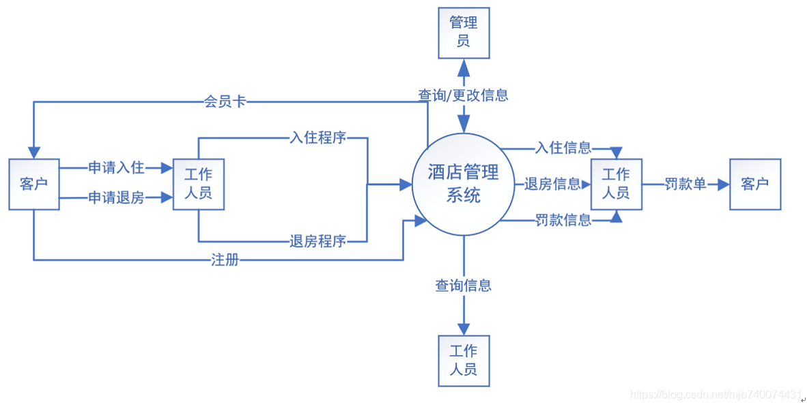
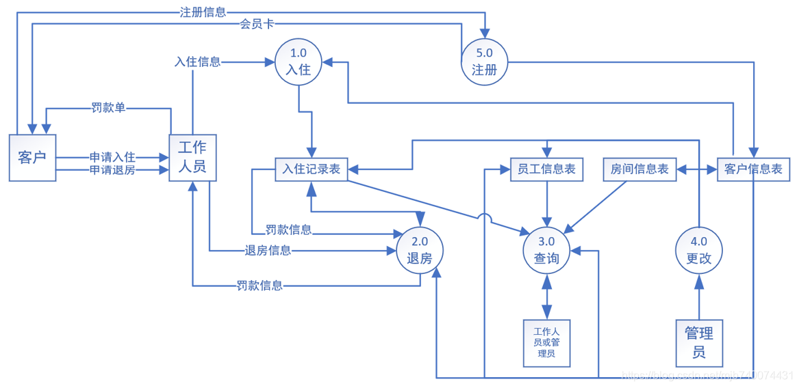
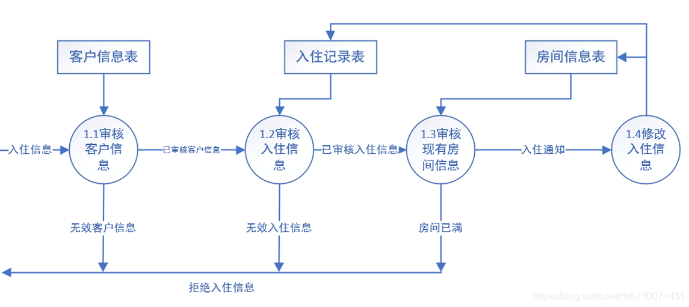
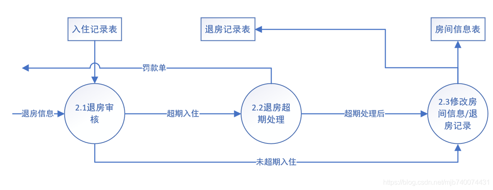
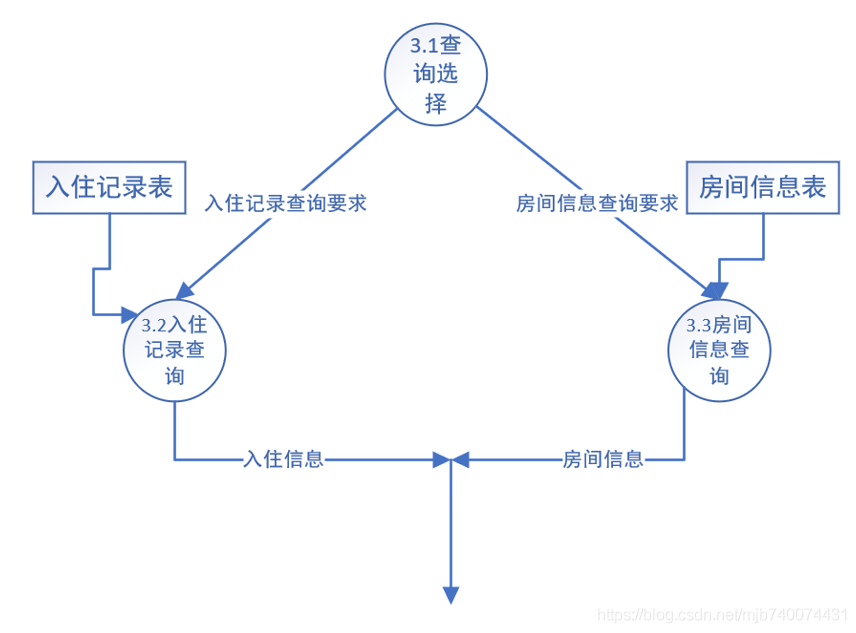
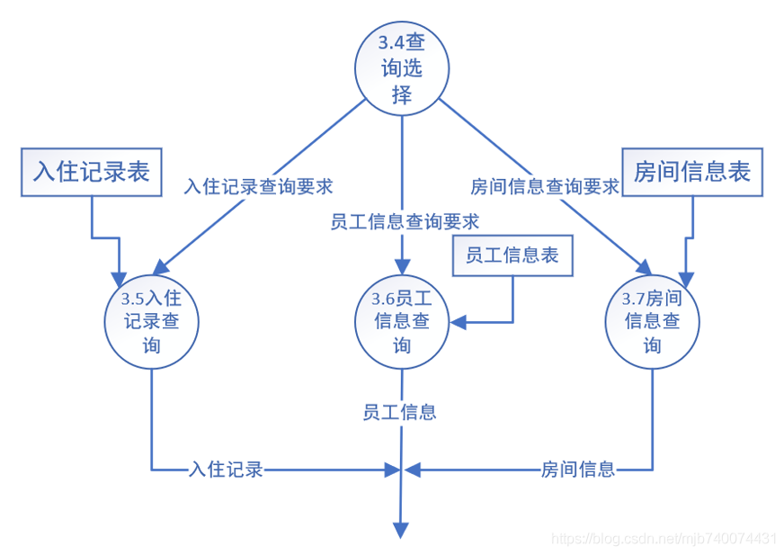
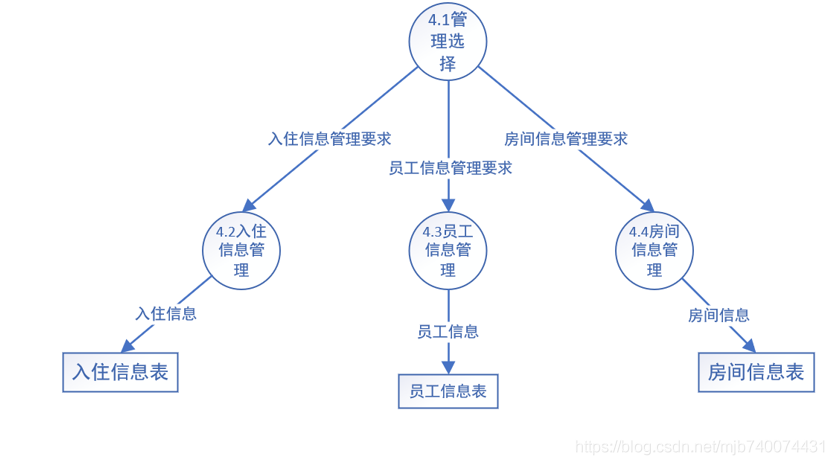
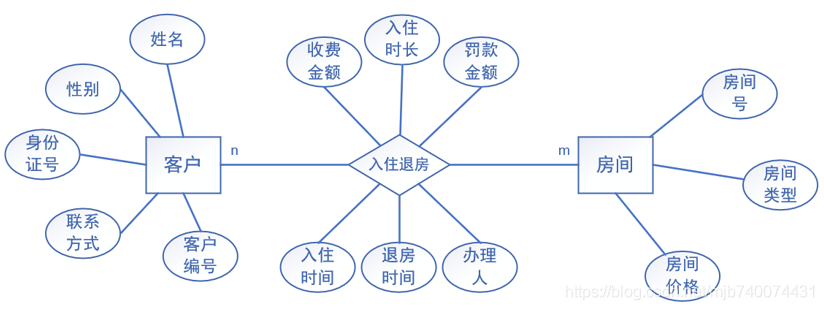
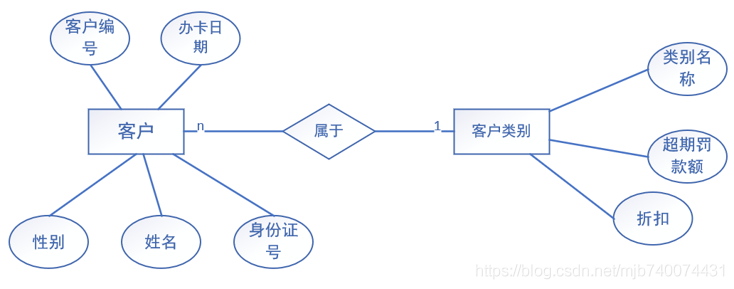
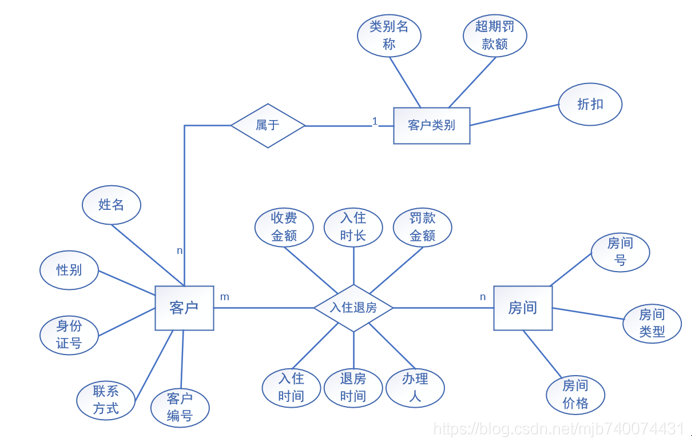

# 酒店系统设计

## 需求分析

### 软件需求

1. 酒店管理系统用于满足酒店工作人员和管理人员的需求。
2. 酒店管理人员和工作人员可以为酒店房间加入入住和退房记录，并生成相应的报表用于查阅，确认和保存，酒店工作人员可以浏览、查询、统计、添加酒店房间的入住离开信息。管理员可以查询房间信息、查询员工信息、更改房间信息、更改员工信息等。
3. 客户可以申请入住酒店，酒店工作人员需要对客户的姓名、性别、身份证号、房间号、入住时间、联系方式等信息进行记录，客户退房时进行退房记录。
4. 理员和员工可以通过姓名、入住日期、身份证号、房间号、联系方式等信息查询客户入住和离开情况。

### 功能描述

根据需求分析，得到系统的功能需求。作为一个酒店管理系统，应满足入住办理、入住信息查询、房间查询、退房办理等功能，其功能要求如下：

1. 入住办理。客户凭借会员卡入住，每当有客人需要入住时进行办理程序。工作人员需要记录客人的姓名、性别、身份证号、入住时间、联系方式等。若办理入住的房间不为空则不允许办理入住。
2. 入住信息查询。工作人员可以对已入住的客户进行信息查询。需要支持精准查询，如通过房间号查询、通过姓名查询、通过入住日期查询、通过联系方式查询等，也要支持模糊查询，如通过姓氏查询、通过入住年月查询、通过性别查询等。
3. 房间查询。管理员可以查询某个房间是否为空以及历史入住/退房信息等。可以查询的信息有：房间类型、房间价格、房间当前是否为空等，若当前房间已被入住，则需要额外显示入住人姓名、入住人联系方式、入住人入住时间等信息。
4. 退房办理。当客户退房时进行退房办理。工作人员需要记录入住人退房时间、罚款等信息。若退房的房间为空，则不允许办理。
5. 员工查询。 管理员可以对酒店员工信息进行查询，可查询员工姓名、性别、联系方式等。
6. 更改房间信息。 管理员可以更改房间信息，如房间类型、价格、增加房间、删除房间等。
7. 更改员工信息。管理员可以更改员工信息，如姓名、性别、职位、增加员工、删除员工等。

### 数据流图

数据流图

1. 顶层数据流图
   通过对用户需求进行分析并对其进行归纳和总结，得到用户的顶层数据流图

2. 对顶层数据从流图进行分解，形成第2层的数据流图

   第二层数据流图得到客户申请入住，客户申请退房，工作人员查询，管理员查询，管理员修改等业务的数据流程图，为进一步设计奠定基础。

3. 第三层数据流图
   将第二层的数据流图中的每个业务进行分解，得到各业务的子数据流图，就形成第三层的数据流图。第三层数据流图分为入住申请，退房申请，工作人员查询，房间信息维护，员工信息维护。

​		3.1  客户入住数据流图（图1-4）。客户入住数据流包括审核员工信息，审核入住信息，审核现有房间信息，修改房间信息/入住记录。

​		3.2 客户退房数据流图（图1-5）。客户退房数据流包括退房申请，退房超期处理，修改房间信息/退房记录。

​	3.3 工作人员查询业务流图（图1-6）。工作人员查询业务流包括入住记录查询，房间信息查询。

3.4  管理员查询业务流图（图1-7）。管理员查询业务流包括入住记录查询，房间信息查询，员工信息查询

3.5 管理员管理业务流图（图1-8）管理员管理业务流包括入住信息管理，房间信息管理，员工信息管理。

## 概念结构设计阶段

### 局部E-R图

根据不同的对象，从第三层数据流图开始，分别设计各分E-R图。
（1） 由图1-4第三层数据流图（客户入住）和图1-5第三层数据流图（客户退房）抽象出的分E-R图如图1-9所示。

（2） 由图10-3 第二层数据的数据流图中抽象出客户注册的分E-R图如图1-10所示。

（3）由图1-2的数据流图抽象出的分E-R图见图

### 整体E-R图

合并各分E-R图，消除属性冲突、命名冲突和结构冲突等三类冲突，再消除不必要的冗余，得到系统初步E-R图。

系统E-R图各实体的属性如下：

1. 房间（room）：房间号，房间类型，房间价格。
2.  客户（customer）：客户编号，客户姓名，客户性别，客户身份证号，客户联系方式，办卡日期。
3. 员工（worker）：员工编号，员工姓名，员工性别，员工身份证号，员工职位，员工工资，员工密码。
4. 管理员（manager）：管理员编号，管理员姓名，管理员联系方式，管理员密码。
5. 客户类别（customer type）：类别名称，折扣，超时罚款金额。

各E-R图中联系的属性如下：

1. 入住记录（in history）：入住编号，客户姓名，入住 时间，应退房时间，客户类别，办理人。
2. 退房记录（out history）：退房编号，客户姓名，入住时间，退房时间，罚款，办理人。

## 逻辑结构设计阶段

### E-R图向关系模式转换

**生成关系模式**

客户类别和客户的联系是1：n，可以将它们之间的联系与n端实体客户合并；管理员与客户、员工、房间也是1：n，同样可以将其中的联系与n端实体合并，而客户与房间之间的入住和退房联系方式是n：m，将其联系转化称独立的关系模式。具体的基本E-R图向关系模式的转化如下所述。

1. 房间：房间（房间号，房间类型，房间价格）。
2. 客户：客户（客户编号，客户姓名，客户性别，客户身份证号，客户类别，客户联系方式，办证时间）。
3. 员工：员工（员工编号，员工姓名，员工性别，员工身份证号，员工职位，员工工资，员工密码）。
4. 管理员：管理员（管理员编号，管理员姓名，管理员密码）。
5. 客户类别：客户类别（类别编号，类别名称，超时罚款金额，折扣）。
6. 入住记录：入住记录（入住编号，客户姓名，客户类型，客户入住时间，客户应退房时间，房间号，办理人）。
7. 退房记录：退房记录（退房编号，客户姓名，客户类型，客户入住时间，客户退房时间，房间号，罚款金额，办理人）。

**关系模式的优化**

1. 关系模式room，customer，，manager，customer type，in history,out history不存在非主属性对主属性的部分函数依赖，也不存在传递函数依赖，已经达到3NF 。但worker存在传递函数依赖，优化为员工（员工编号，员工姓名，员工性别，员工身份证号，员工职位，员工密码）。

### 施加约束

1. 域约束
   域是属性可能具有的值的集合。域定义包括语义成分和物理成分，除了满足一定的物理成分外，还必须满足一定的语义要求。例如，性别的取值为字符型，宽度为2个字符.只要满足上述两个条件就满足物理要求。但是满足物理成分的数据不一定是有意义的。因此域还必须满足一定的语义要求。
   另一种约束类型为值是否为必填项，即值是否为空。对于某些值必须设计为必填项，才能确保数据有意义。例如客户的姓名必须为必填项。
2. 唯一性约束
   唯一性约束是约束的另一种类型。这种约束一班由DBMS来施加，因为它能创建数据结构来使唯一性检查更快地进行。为了达到这个目的，可以使用唯一性索引。
   在本系统中，客户编号，客户身份证号，员工编号等必须不重复，可通过为客户编号，客户身份证号，员工编号等分别创建唯一性索引，以实现唯一性索引。
3. 联系约束
   1. 参照完整性约束
      所有的参照完整性约束都限制在外键上。如关系模式入住记录：入住记录（入住编号，客户姓名，客户类型，客户入住时间，客户应退房时间，房间号，办理人）。
      客户姓名作为外键，约束说明它的值必须在客户信息表中存在，否则这条数据就没有意义。
   2. 联系基数
      联系基数约束来源于对象连接属性的基数设定。在本系统中，客户类型与客户是1：n的约束，因此一个用户一定与一个用户类型相联系，一个用户类型有多个用户。

4. 业务规则约束
  业务规则约束是针对指定应用的逻辑和要求的，它们来源于使用数据库组织中的应用程序和策略。酒店管理应用中的业务规则是：
  1. 房间的价格为0~99999
  2. 性别的取值是‘男’或‘女’
  3. 如果房间已订出就不能再被申请入住
  4. 如果房间没有订出就不能申请退房
  5. 如果入住超期，按天收取罚金

由于业务规则是依赖于应用的，因此在SQL Server中，通过创建触发器来实现业务规则的校验和限制。

## 数据库的建立

### 数据库存储结构

将酒店管理系统的数据库名称设为HotelManagementLibrary，数据库只有一个数据文件和一个日志文件，保存在默认路径下。
创建数据库命令为
CREATE DATABASE HotelManagementLibrary
为数据库中各基本表建立的索引如下所述。

1. 基本表Room，Customer，Worker，Manager的主码RoomID，CustomerID，WorkerID，ManagerID的值唯一，且经常出现在连接、查询条件和操作中出现，建立唯一性索引。
2. 基本表Room、Customer的属性RoomType和CustomerType经常在查询条件中出现，因此建立唯一性索引。
3. 入住记录表InHistory和退房记录表OutHistory的属性CustomerName和RoomID经常在查询条件中出现，考虑建立索引。

### 表和视图的创建

1. 客户信息表

   ~~~sql
   CREATE TABLE Customer (
   	CustomerID nvarchar(10) PRIMARY KEY,
   	CustomerName nvarchar(10) NOT NULL,
   	CustomerSex nvarchar(2) DEFAULT '男' CHECK (CustomerSex = '男'
   	OR CustomerSex = '女'),
   	CustomerIDNumber nvarchar(18) NOT NULL,
   	CustomerType nvarchar(10) NOT NULL,
   	CustomerPhone nvarchar(11) NOT NULL,
   	CustomerCreateDate date NOT NULL,
   	FOREIGN KEY (CustomerType)
   		REFERENCES CustomerType (TypeName)
   );
   
   ~~~

2. 员工信息表

   ~~~sql
   CREATE TABLE Worker (
   	WorkerID nvarchar(10) PRIMARY KEY,
   	WorkerName nvarchar(10) NOT NULL,
   	WorkerSex nvarchar(2) DEFAULT '男' CHECK (WorkerSex = '男'
   	OR WorkerSex = '女'),
   	WorkerIDNumber nvarchar(18) NOT NULL,
   	WorkerPosition nvarchar(10) NOT NULL,
   	WorkerPassword nvarchar(20) NOT NULL
   );
   ~~~

3. 房间信息表

   ~~~sql
   CREATE TABLE Room (
   	RoomID nvarchar(10) PRIMARY KEY,
   	RoomType nvarchar(10) NOT NULL,
   	RoomPrice float NOT NULL,
   	RoomState nvarchar(10) DEFAULT '未入住' CHECK (RoomState = '已入住'
   	OR RoomState = '未入住')
   );
   ~~~

4. 管理员信息表

   ~~~sql
   CREATE TABLE Manager (
   	ManagerID nvarchar(10) PRIMARY KEY,
   	ManagerName nvarchar(10) NOT NULL,
   	ManagerPassword nvarchar(20) NOT NULL
   );
   
   ~~~

5. 客户类型表

   ~~~sql
   CREATE TABLE CustomerType (
   	TypeName nvarchar(10) PRIMARY KEY,
   	Discount float NOT NULL,
   	Fine float NOT NULL
   );
   ~~~

6. 入住记录表

   ~~~sql
   CREATE TABLE InHistory (
   	InID nvarchar(10) PRIMARY KEY,
   	CustomerID nvarchar(10) NOT NULL,
   	CustomerType nvarchar(10) NOT NULL,
   	CustomerInDate date NOT NULL,
   	CustomerOutDate date NOT NULL,
   	RoomID nvarchar(10) NOT NULL,
   	Worker nvarchar(10) NOT NULL,
   	FOREIGN KEY (CustomerID)
   		REFERENCES Customer (CustomerID),
   	FOREIGN KEY (CustomerType)
   		REFERENCES CustomerType (TypeName),
   	FOREIGN KEY (RoomID)
   		REFERENCES Room (RoomID),
   	FOREIGN KEY (Worker)
   		REFERENCES Worker (WorkerID)
   );
   ~~~

7. 退房记录表

   ~~~sql
   CREATE TABLE OutHistory (
   	OutID nvarchar(10) PRIMARY KEY,
   	CustomerID nvarchar(10) NOT NULL,
   	CustomerType nvarchar(10) NOT NULL,
   	CustomerInDate nvarchar(10) NOT NULL,
   	CustomerOutDate nvarchar(10) NOT NULL,
   	RoomID nvarchar(10) NOT NULL,
   	Worker nvarchar(10) NOT NULL,
   	FOREIGN KEY (CustomerID)
   		REFERENCES Customer (CustomerID),
   	FOREIGN KEY (CustomerType)
   		REFERENCES CustomerType (TypeName),
   	FOREIGN KEY (RoomID)
   		REFERENCES Room (RoomID),
   	FOREIGN KEY (Worker)
   		REFERENCES Worker (WorkerID)
   );
   
   ~~~

   
