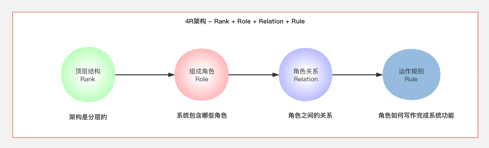
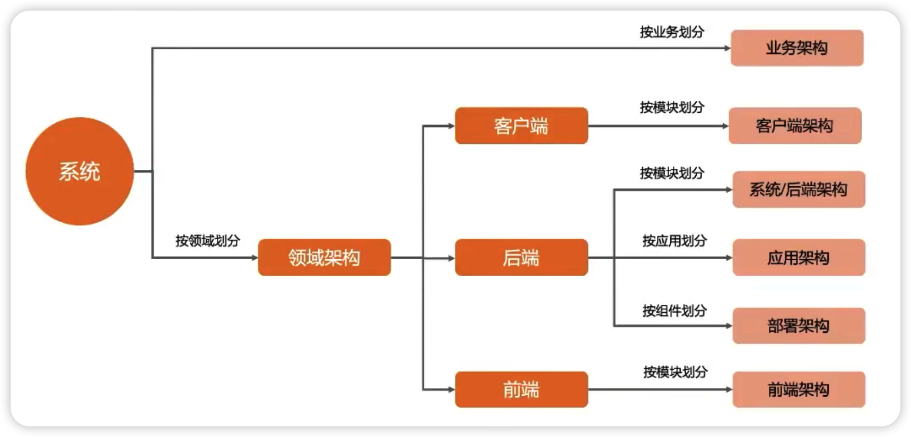
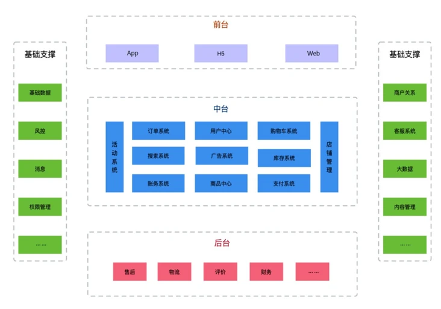
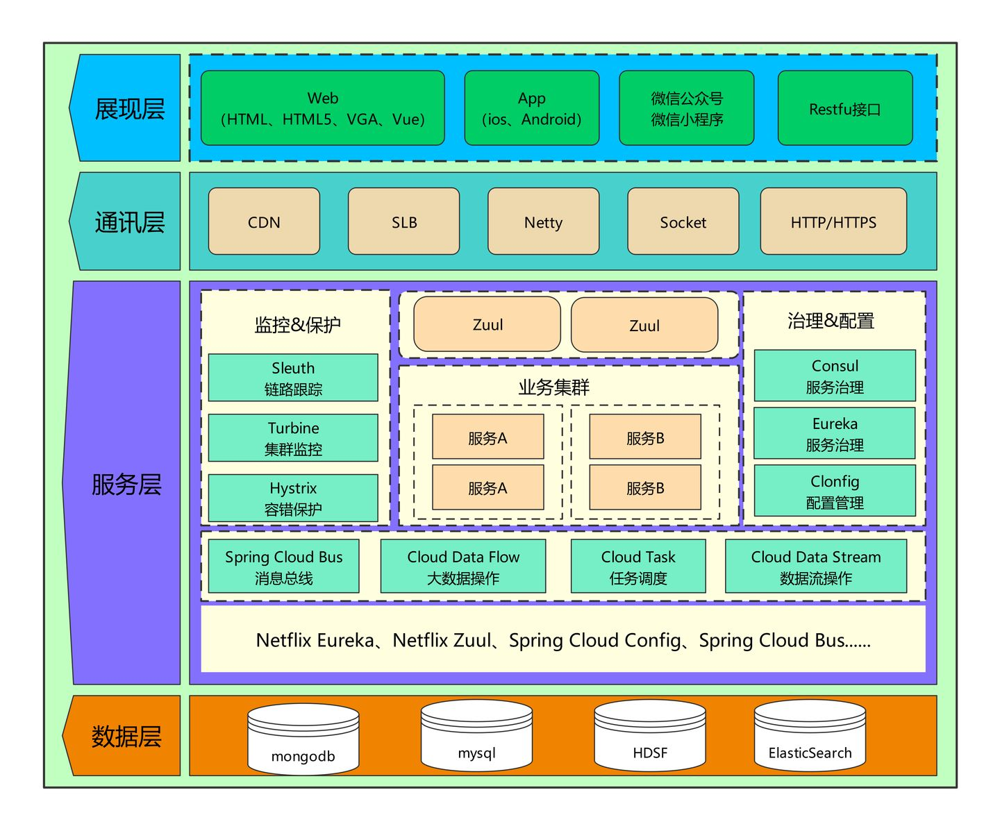
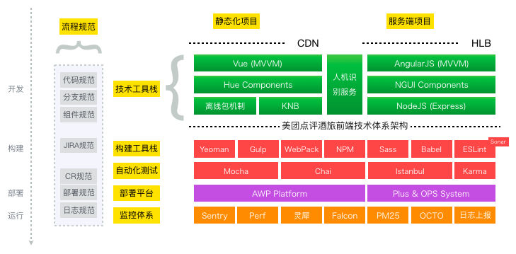
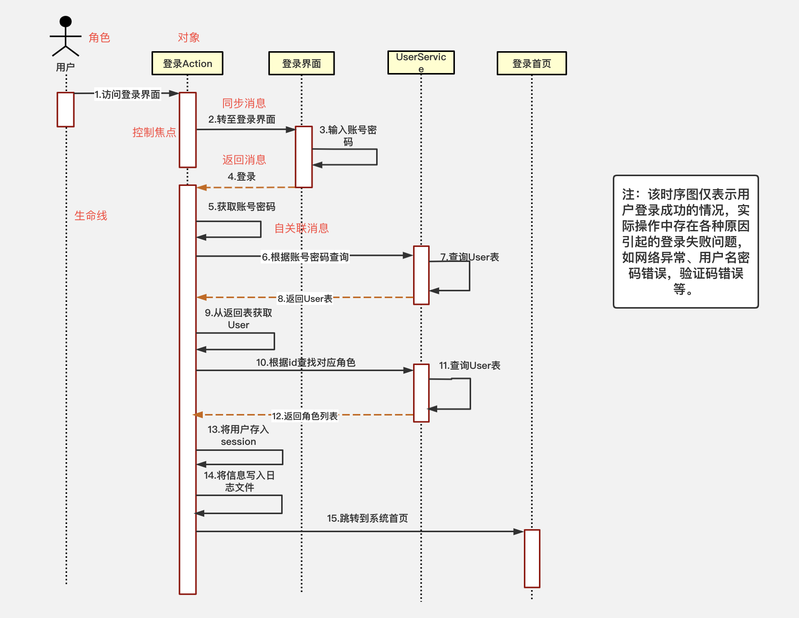
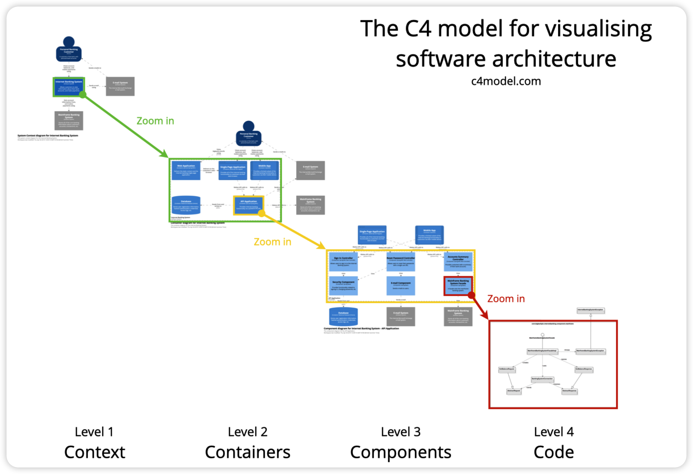
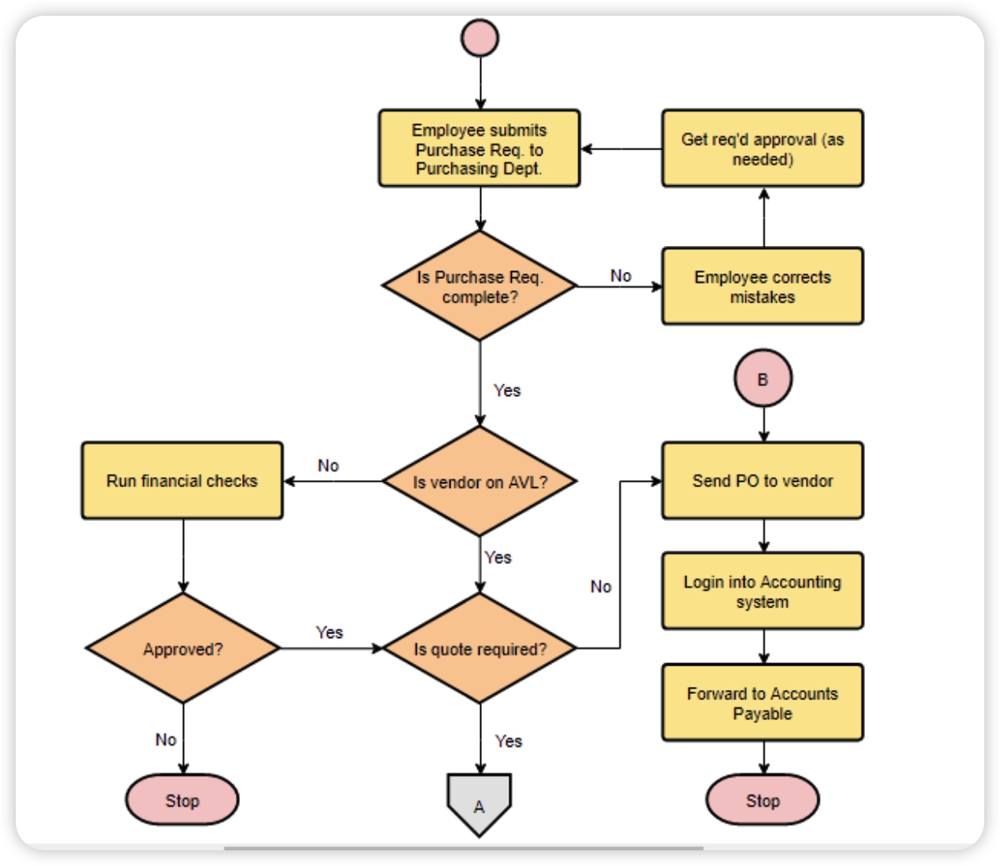

# 如何画好系统架构图

## 什么是架构图

​			在谈什么是架构图之前，我们先来聊聊什么是架构。软件架构指的是软件系统的顶层设计（Rank），它定义了系统由哪些角色（Role）组成，角色之间的关系（Relation）和运作规则（Rule），如下图所示。

​			再回到我们的问题，到底什么是架构图，从字面意思上来讲，架构图 = 架构 + 图，它是你当前架构的一种表达方式，当然架构设计的领域是很多的，比如业务架构，系统架构，技术架构，模型架构等等。。。

​			针对不同的架构类型，当然也就需要用不同的架构图去表现它，我们都知道现实世界到软件世界的映射，是一个不断抽象的过程，这其中的方法就是不断的建立模型，所以架构的过程其实就是建模的过程，而架构图表现的就是你建模的方式。

## 为什么要画架构图

​			既然架构的过程就是建模的过程，为什么我们要费时费力的去画架构图呢？直接用代码或者文字体现不就行了吗？我觉得这个问题可以从 2 点方面来回答：

​			从技术角度来讲：架构图相比其他表现方式，可以更方便的表明当前系统的结构体系，减少同事或者与客户之间的认知障碍，达到统一认知。

​			从阅读角度来讲：图的表现力远远高于文字的表现力，这也是为什么人们常说“一图胜千言，NO 图 NO BB”。

## 架构图分类

​			根据我们工作职责的不同，我们所需要体现的架构图也会有所不同，比如你是一个PD，你考虑的更多是产品架构，比如你是一个前端，你考虑的更多是前端技术体系和模块的架构，那么这里总结了一下我们常见的不同架构分类，主要有以下内容。

现在我们知道了架构的分类，那么我们如何开始去画一张架构图呢？这里有几个路径，你可以参考一下：

+ 搞清楚要画的架构图的类型
+ 抽离架构图中的关键要素
+ 梳理各个要素之间的关系：包含关系 、引用关系、同级关系等等
+ 根据以上信息串联起来，并标识清楚。

接下来我们看看几个常见的架构的描述和其示意图，和我们上面的 4R 一起做个对比。

### 业务架构
​			对应我们 4R 中的Rank，也就是顶层结构。

​			业务架构指的是使用一套方法论/逻辑对产品（项目）所涉及到的业务进行边界划分，核心点就是把业务边界通过不同颜色模块标识出来，并做分组，同时不需要去考虑具体技术点。

使用场景：

+ 产品人员规划业务
+ 给高 P 汇报业务
+ 给新员工培训业务体系

比如一个电商系统的业务架构图如下。

### 应用架构
对应我们 4R 中的Role，也就是组成角色。

应用架构是对整个系统实现的总体上的架构，需要指出系统的层次、系统开发的原则、系统各个层次的应用服务，通过不同的颜色来标识角色，自顶向下分层设计。

使用场景：

+ 整体引用架构规划设计
+ 架构培训

例如，下图就将系统分为数据层、服务层、通讯层、展现层，并细分写明每个层次的应用服务。

### 技术架构

​			对应我们 4R 中的 Relation，也就是角色关系。

​			应用架构本身只关心需要哪些应用系统，哪些平台来满足业务目标的需求，而不会关心在整个构建过程中你需要使用哪些技术。

​			技术架构则是应接应用架构的技术需求，并根据识别的技术需求，进行技术选型，把各个关键技术和技术之间的关系描述清楚。技术架构解决的问题包括：纯技术层面的分层、开发框架的选择、开发语言的选择、涉及非功能性需求的技术选择。

​			比如下面这张美团点评酒旅前端团队的技术体系结构图。

### 序列图

​			对应我们 4R 中的 Rule，也就是运作规则。

​			序列图，又称时序图，是一种UML交互图。它通过描述具体场景中，对象之间发送消息的时间顺序显示多个对象之间的动态协作。

​			比如下面这张用户登录过程的序列图。

## C4 模型

​			这里再推荐一个现在很流行的 C4 架构模型，其官网为：https://c4model.com/

​			C4 架构模型由一系列分层的软件架构图组成，这些架构图用于描述上下文、容器、组件和代码。C4 图的层次结构提供了不同的抽象级别，每种抽象级别都与不同的受众有关。

​			C4 代表 上下文（Context）、容器（Container）、组件（Component）和代码（Code），是一系列分层的图表，可以用这些图表来描述不同Level的软件架构，每种图表都适用于不同的受众。可以将其视为代码的谷歌地图。

## 总结

​			好，最后我们再来总结一下，本文主要讲解了什么是软件架构设计，基于软件架构的 4R 的理论我们可以映射到业务架构，应用架构，技术架构以及时序流程，同时还推荐了近些年比较流行的 C4架构模型。

​		文章的最后再来推荐下我常用的画图工具：

+ 架构图：draw.io 本地版，内部有非常多的预设标准，非常强大。
+ processOn：网页版工具，也非常强大，如果你有同步的需求，可以使用它。
+ UML 图：https://plantuml.com/zh/ ，有非常多的示例，同时 VScode / webstorm都有对应的插件，可以方便的在编辑器中书写

​			最后，一张好的架构图不仅仅可以形象的描述业务领域的抽象设计，同时也要有美观的展示，它应该能帮助阅读者更好的了解当前系统的层次结构，同时也能帮助开发者自己更好的去设计和完善系统，最后还是那句话：“一图胜千言，NO 图 NO BB”。

​			另外在平时工作中，我们画的最多的还有一种图，就是流程图，比如下面这种

## 参考资料

+ `4R` 架构理论：https://www.jianshu.com/p/cdce0b40ec5d
+ 前阿里 `P9` 教你如何画好一张架构图：https://www.bilibili.com/video/BV1764y1a7PD
+ 程序员的架构修炼：https://segmentfault.com/a/1190000038579086
+ `C4` Model：https://c4model.com/
  