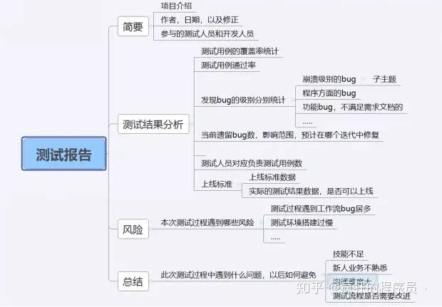

# 软件测试

## 概述

### 软件缺陷

​			软件缺陷：又称之为“Bug”。即计算机软件或程序中存在的某种破坏正常运行能力的问题、错误，或者隐藏的功能缺陷。

缺陷的表现形式：

+ 软件没有实现产品规格说明书所要求的功能模块；
+ 软件中出现了产品规格说明指明不应该出现的错误；
+ 软件实现了产品规格说明中没有提到的功能需求；
+ 软件没有实现虽然产品规格说明没有明确提及但应该实现的目标；
+ 软件难以理解、不易使用、运行缓慢、用户体验不友好；

产生软件缺陷的原因：

+ 需求不清晰；
+ 系统结构较为复杂；
+ 对程序逻辑路径或者数据范围考虑不全面；
+ 确保设计时间的精准同步；
+ 存在系统性、可靠性的隐患问题；
+ 系统运行环境的复杂；
+ 通信端口较多时影响系统的安全性、适用性；
+ 设计技术系统兼容的问题；

缺陷的属性：

+ 缺陷标识：标识唯一；
+ 缺陷类型：缺陷种类；
+ 缺陷严重程度：指因缺陷引起的故障对软件产品的影响程度；
+ 缺陷优先级：指缺陷必须被修复的紧急程度；
+ 缺陷状态：通过一个跟踪修复过程的进展情况；
+ 缺陷起源：缺陷引起的故障或事件第一次被检测到的阶段；
+ 缺陷来源：引起缺陷的原因；
+ 缺陷根源：反正错误的根本因素；

### 软件测试的定义及原则

定义：软件测试是为了发现错误而执行程序或系统的过程。

原则：

1. 测试显示Bug的存在：
2. 穷举测试不可能；
3. 尽早地进行测试；
4. 缺陷群：（二八定律：约80%的问题被发现在20%的模块中）；
5. 杀虫剂悖论；
6. 测试是上下文相关的；
7. 有无谬误；
8. 软件测试是有风险的行为；

## 软件测试过程与策略

### 软件测试策略概述

软件测试策略是软件工程过程的一个软件测试的模板，也就是把特定的测试用例方法放置进去的一系列步骤：

软件测试包含的特征：

1. 测试从模块层开始，然后扩大延伸到整个基于计算机的系统集合中；
2. 不同的测试技术适用于不同的时间点；
3. 测试由开发人员及独立的测试组来管理的；
4. 测试和调试时不同的活动，但是调试必须能够适应任何测试策略；

软件测试充分性准则：

1. 对任何软件都存在有限的充分测试集合；
2. 若果一个软件系统在一个测试数据集合上的测试是充分的，那么再多测试一些数据也应该是充分的；
3. 即使对软件所有成分都进行了充分测试，也并不表名整个软件的测试已经充分；
4. 即使对软件系统整体的测试是充分的，也并不意味着软件系统中各个成分都已经充分的得到了测试；
5. 软件测试的充分性与软件的需求和软件的实现都相关；
6. 软件越复杂，需要的测试数据就越多；
7. 测试的越多，进一步测试所能得到的充分性增长就越少；

## 软件测试的分类

### 软件开发阶段划分：

1. 单元测试：指对软件中的最小可测试单元进行检查和验证，单元测试需要从软件的内部结构出发设计测试用例。多个模块可以独立地进行测试。
2. 集成测试：组装测试/联合测试：将所有模块按照设计要求组装成子系统或者系统进行集成测试。
3. 系统测试：将已经确认的软件、计算机硬件、外设、网络等其他元素结合在一起，进行信息系统的各种组装测试 和确认测试，系统测试是针对整个产品的测试。
4. 验收测试：交付测试：确保软件准备就绪。

### 测试技术划分：

1. 白盒测试：结构性测试/透明盒测试/逻辑驱动测试/基于代码的测试：
2. 黑盒测试：功能测试：通过测试每个功能是否都能正常使用。（输入数据/输出数据）
3. 灰盒测试：介于白盒测试和黑盒测试之间的一种测试方法：不仅关注输出、输入的正确性，同时也关注程序内部的情况。

### 被测试软件是否实际运行划分：

1. 静态测试：指不运行被测程序本身，仅通过分析或检查源程序的语法、结构、过程、接口等来检查程序的正确性。
   1. 对于代码测试：主要测试代码是否符合相应的标准和规范；
   2. 对于界面测试：主要测试软件的实际界面与需求中的说明是否相符；
   3. 对于文档测试：主要测试用户和需求说明是否符合用户的实际需求；
2. 动态方法：指通过运行被测程序，检查运行结果与预期结果的差异，并分析运行效率、正确性、健壮性等性能。

### 测试实施组织划分：

1. 开发方测试：验证测试/α测试
2. 用户测试：β测试
3. 第三方测试

### 测试类型划分：

1. 功能测试：主要针对产品需求说明书对软件进行测试，验证软件功能是否符合需求，包括对原定功能的检验以及测试软件是否存在冗余功能、遗漏功能。
2. 界面测试：主要对系统的界面进行测试，测试用户界面是否友好，软件是否方便易用、系统设计是否合理、界面位置是否正确等问题。
3. 性能测试：主要测试系统的性能是否满足用户需求，即在特定的运行条件下验证系统的能力状态。性能测试主要是通过自动化的测试工具模拟正常、峰值、异常负载状况、对系统的各项性能指标进行测试。
4. 强度测试：迫使系统在异常的资源配置下运行。目的是找出因资源不足或者资源争用而导致的错误。
5. 压力测试：主要是在超负荷环境中，检验系统是否能够正常运行。
6. 安全测试：测试系统防止非法入侵的能力。
7. 兼容性测试：测试软件产品在不同的平台、不同的工具软件或者相同工具软件不同的版本下的兼容性。
8. 安装测试：主要校验软件是否可以正确安装、安装文件的各项设置是否有效、安装后是否影响整个计算机系统、卸载软件时是否可以卸载干净、卸载软件之后是否影响整个计算机系统。
9. 文档测试：主要检查内部或外部文档的清晰性和准确性。

## 测试流程:

1. 阅读相关技术文档（如产品PRD、UI设计、产品流程图等）。
2. 参加需求评审会议。
3. 根据最终确定的需求文档编写测试计划。
4. 编写测试用例（等价类划分法、边界值分析法等）。
5. 用例评审(主要参与人员：开发、测试、产品、测试leader)。
6. 开发提交代码至SVN或者GIT ，配管搭建测试环境。
7. 执行测试用例，记录发现的问题。
8. 验证bug与回归测试。
9. 编写测试报告。
10. 产品上线。

## 测试报告

## 相关问题

### 给你一个网站，你如何测试？

1. 查找需求说明、网站设计 m 等相关文档，分析测试需求。

2. 制定测试计划，确定测试范围和测试策略，一般包括以下几个部分：

   + 功能性测试；
   + 界面测试；
   + 性能测试；
   + 数据库测试；
   + 安全性测试；
   + 兼容性测试

3. 设计测试用例：

   + 功能性测试可以包括，但不限于以下几个方面：

     + 链接测试。链接是否正确跳转，是否存在空页面和无效页面，是否有不正确的出错信息返回等。提交功能的测试。
     +  多媒体元素是否可以正确加载和显示。多语言支持是否能够正确显示选择的语言等。

   + 界面测试可以包括但不限于一下几个方面：

     + 页面是否风格统一，美观
     + 文字检查
     + 对于必须但为安装的空间，是否提供自动下载并安装的功能
     + 控件是否正常使用
     + 页面布局是否合理，重点内容和热点内容是否突出 

     

### 一台客户端有三百个客户与三百个客户端有三百个客户对服务器施压，有什么区别? ?

​			300 个用户在一个客户端上，会占用客户机更多的资源，而影响测试的结果。线程之间可能发生干扰，而产生一些异常。300 个用户在一个客户端上，需要更大的带宽。IP 地址的问题，可能需要使用 IP Spoof 来绕过服务器对于单一 IP 地址最大连接数的限制。所有用户在一个客户端上，不必考虑分布式管理的问题；而用户分布在不同的客户端上，需要考虑使用控制器来整体调配不同客户机上的用户。同时，还需要给予相应的权限配置和防火墙设置。

​			你工作中遇到最具价值的bug，就是重大bug咯，例如app性能测试测哪些，那你就看一看性能测试的视频咯
​         

### 黑盒测试和白盒测试各自的优点和缺点？

黑盒测试

**优点：**比较简单，不需要了解程序内部的代码及实现；与软件的内部实现无关；从用户角度出发，能很容易的知道用户会用到哪些功能，会遇到哪些问题；基于软件开发文档，所以也能知道软件实现了文档中的哪些功能；在做软件自动化测试时较为方便。

**缺点：**不可能覆盖所有的代码，覆盖率较低，大概只能达到总代码量的 30%；自动化测试的复用性较低。

白盒测试

**优点：**帮助软件测试人员增大代码的覆盖率，提高代码的质量，发现代码中隐藏的问题。

**缺点：**程序运行会有很多不同的路径，不可能测试所有的运行路径；测试基于代码，只能测试开发人员做的对不对，而不能知道设计的正确与否，可能会漏掉一些功能需求；系统庞大时，测试开销会非常大。

​                       

### 如何测试一个 纸杯？

+ 功能度：用水杯装水看漏不漏；水能不能被喝到
+ 安全性：杯子有没有毒或细菌
+ 可靠性：杯子从不同高度落下的损坏程度
+ 可移植性：杯子在不同的地方、温度等环境下是否都可以正常使用
+ 兼容性：杯子是否能够容纳果汁、白水、酒精、汽油等
+ 易用性：杯子是否烫手、是否有防滑措施、是否方便饮用
+ 用户文档：使用手册是否对杯子的用法、限制、使用条件等有详细描述
+ 疲劳测试：将杯子盛上水（案例一）放 24 小时检查泄漏时间和情况；盛上汽油（案例二）放 24 小时检查泄漏时间和情况等
+ 压力测试：用根针并在针上面不断加重量，看压强多大时会穿透

## 资料

[2021年软件测试面试题大全](https://blog.csdn.net/hard_days/article/details/110388559?ops_request_misc=%257B%2522request%255Fid%2522%253A%2522166117196916782425115512%2522%252C%2522scm%2522%253A%252220140713.130102334.pc%255Fall.%2522%257D&request_id=166117196916782425115512&biz_id=0&utm_medium=distribute.pc_search_result.none-task-blog-2~all~first_rank_ecpm_v1~pc_rank_34-13-110388559-null-null.142^v42^pc_rank_34,185^v2^control&utm_term=%E8%BD%AF%E4%BB%B6%E6%B5%8B%E8%AF%95&spm=1018.2226.3001.4187)