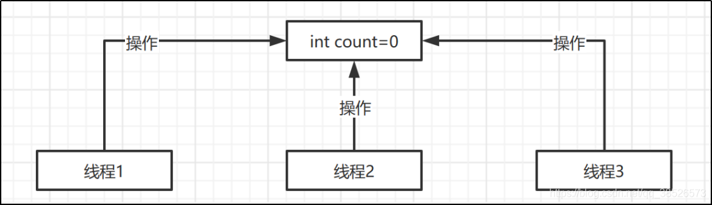
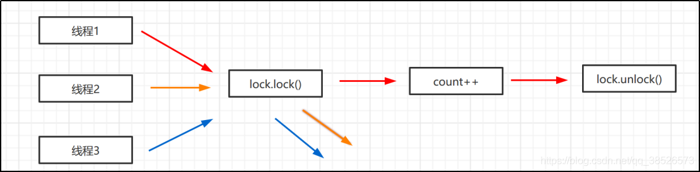
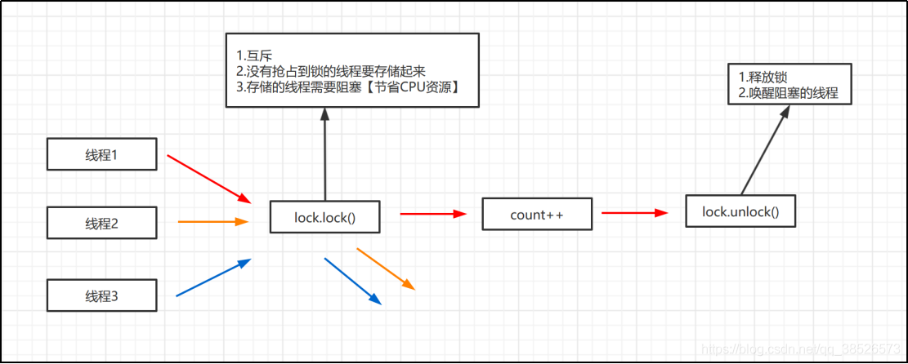
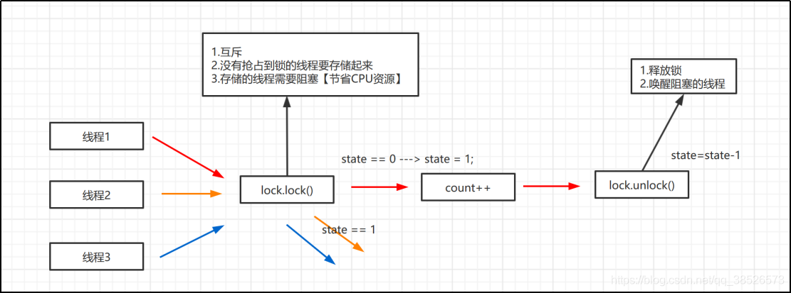
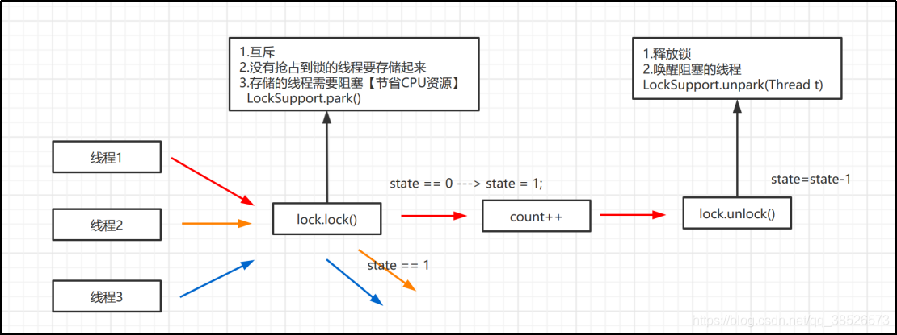
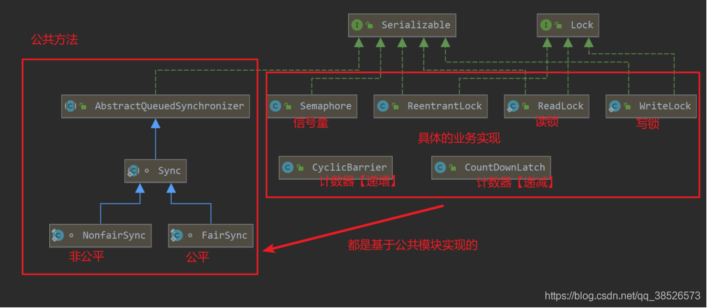

# Lock

## [说明](http://localhost:3000/#/./docs/11.阅读源码/docs/11.StringBuilder?id=说明)

本文主要针对`Jdk 8`进行解读， 不同版本之间可能存在一定的变化

## 特性

1. Lock 是个接口，规定了具体的手动锁该实现哪些方法
2. Condition 实际上也是公平锁的一种体现

## Lock 接口

~~~java
public interface Lock {
    void lock();
    void lockInterruptibly() throws InterruptedException;
    boolean tryLock();
    boolean tryLock(long time, TimeUnit unit) throws InterruptedException;
    void unlock();
    Condition newCondition();
}
~~~

# AbstractQueuedSynchronizer

## 原文阅读

[AQS源码阅读](https://blog.csdn.net/qq_38526573/article/details/106433739?ops_request_misc=%257B%2522request%255Fid%2522%253A%2522166176588816781432942962%2522%252C%2522scm%2522%253A%252220140713.130102334.pc%255Fall.%2522%257D&request_id=166176588816781432942962&biz_id=0&utm_medium=distribute.pc_search_result.none-task-blog-2~all~first_rank_ecpm_v1~hot_rank-2-106433739-null-null.142^v42^pc_rank_34,185^v2^control&utm_term=AQS%20%E6%BA%90%E7%A0%81&spm=1018.2226.3001.4187)

## 场景模拟

### 演练

我们先来看下这样一个场景

在这里我们有一个能被多个线程共享操作的资源，在这个场景中应该能看出我们的数据是不安全的，因为我们并不能保证我们的操作是原子操作对吧。基于这个场景我们通过代码来看看效果

~~~java
package com.example.demo;

public class AtomicDemo {
    // 共享变量
    private static int count = 0;

    // 操作共享变量的方法
    public static void incr(){
        // 为了演示效果  休眠一下子
        try {
            Thread.sleep(1);
            count ++;
        } catch (InterruptedException e) {
            e.printStackTrace();
        }
    }
    public static void main(String[] args) throws InterruptedException {
        for (int i = 0; i < 1000 ; i++) {
            new Thread(()->AtomicDemo.incr()).start();
        }
        Thread.sleep(4000);
        System.out.println("result:" + count);
    }
}
~~~

通过执行发现，执行的结果是一个不确定的值，但总是会小于等于1000，至于原因，是因为incr() 方法不是一个原子操作。为什么不是原子操作这个咱们今天就不深究此处了。迎合今天的主题，我们通过Lock来解决

~~~java
package com.example.demo;

import java.util.concurrent.locks.Lock;
import java.util.concurrent.locks.ReentrantLock;

public class AtomicDemo {

    // 共享变量
    private static int count = 0;

    private static Lock lock = new ReentrantLock();

    // 操作共享变量的方法
    public static void incr(){
        // 为了演示效果  休眠一下子
        try {
            lock.lock();
            Thread.sleep(1);
            count ++;
        } catch (InterruptedException e) {
            e.printStackTrace();
        }finally {
            lock.unlock();
        }
    }
    public static void main(String[] args) throws InterruptedException {
        for (int i = 0; i < 1000 ; i++) {
            new Thread(()->AtomicDemo.incr()).start();
        }
        Thread.sleep(4000);
        System.out.println("result:" + count);
    }
}
~~~

然后我们运行发现结果都是 1000了，这也就是1000个线程都去操作这个 count 变量，结果符合我们的预期了。那lock到底是怎么实现的呢？

### 需求分析

我们先来分析分析

我们自己假设下，如果要你去设计这样的方法，你应该要怎么设计，他们需要实现哪些功能，首先是lock方法，它是不是要满足这几个功能。

需求清楚了，那我们怎么设计呢？
第一个互斥怎么做，也就是多个线程只有一个线程能抢占到资源，这个时候我们可以这样设置

~~~java
// 给一个共享资源
Int state = 0 ; // 0表示资源没有被占用，可以抢占
if(state == 0 ){
   // 表示可以获取锁
}else{
   // 表示锁被抢占 需要阻塞等待
}
~~~

然后就是没有抢占到锁的线程的存储，我们可以通过一个队列，利用FIFO来实现存储。最后就是线程的阻塞和唤醒。大家说说有哪些阻塞线程的方式呀？

1. wait/notify: 不合适，不能唤醒指定的线程
2. Sleep：休眠，类似于定时器
3. Condition：可以唤醒特定线程
4. LockSupport:
   1. LockSupport.park():阻塞当前线程
   2. LockSupport.unpark(Thread t):唤醒特定线程

结合今天的主题，我们选择LockSupport来实现阻塞和唤醒。

​			好了，到这儿我们已经猜想到了Lock中的实现逻辑，但是在探究源码之前我们还有个概念需要先和大家讲下，因为这个是我们源码中会接触到的一个，先讲了，看的时候就比较轻松了对吧。

### AQS类图

​			通过类图我们可以发现右车的业务应用其实内在都有相识的设计，这里我们只需要搞清楚其中的一个，其他的你自己应该就可以看懂~，好了我们就具体结合前面的案例代码，以`ReentrantLock`为例来介绍`AQS`的代码。

# ReentrantLock

## 特性

1. 实现了 Lock 接口，
2. 通过内部类继承AQS，从而实现了锁的功能
3. 默认操作AQS锁，同时实现非公平锁与公平锁

## 源码

### 类特点

~~~java
public class ReentrantLock implements Lock, java.io.Serializable {
    private static final long serialVersionUID = 7373984872572414699L;
    /** Synchronizer providing all implementation mechanics */
    private final Sync sync;

    abstract static class Sync extends AbstractQueuedSynchronizer {
    }
}
~~~

### 新建锁

~~~java
public ReentrantLock() {
    sync = new NonfairSync();
}
~~~

### 非公平锁

1. 尝试获取锁，，如果获取锁，就线程独占
2. 如果再次占有锁，那么自动升级为可重入锁

~~~java
static final class NonfairSync extends Sync {
    private static final long serialVersionUID = 7316153563782823691L;

    /**
     * 
     */
    final void lock() {
        if (compareAndSetState(0, 1))
            // 设置线程独占
            setExclusiveOwnerThread(Thread.currentThread());
        else
            acquire(1);
    }

    protected final boolean tryAcquire(int acquires) {
        return nonfairTryAcquire(acquires);
    }
}

final boolean nonfairTryAcquire(int acquires) {
    final Thread current = Thread.currentThread();
    int c = getState();
    if (c == 0) {
        if (compareAndSetState(0, acquires)) {
            setExclusiveOwnerThread(current);
            return true;
        }
    }
    // 设置重入锁
    else if (current == getExclusiveOwnerThread()) {
        // 设置重入锁
        int nextc = c + acquires;
        if (nextc < 0) // overflow
            throw new Error("Maximum lock count exceeded");
        setState(nextc);
        return true;
    }
    return false;
}

~~~

说明

1. `Lock()` 的时候尝试占有锁，如果独占成功，那么设置独占线程为自己
2. 如果锁已经被占用，那么检查线程是否是自己
3. 如果是自己那么就设置为重入锁

### 公平锁

~~~java
static final class FairSync extends Sync {
    private static final long serialVersionUID = -3000897897090466540L;

    // 获取锁
    final void lock() {
        acquire(1);
    }

    protected final boolean tryAcquire(int acquires) {
        final Thread current = Thread.currentThread();
        int c = getState();
        if (c == 0) {
            if (!hasQueuedPredecessors() &&
                compareAndSetState(0, acquires)) {
                setExclusiveOwnerThread(current);
                return true;
            }
        }
        else if (current == getExclusiveOwnerThread()) {
            int nextc = c + acquires;
            if (nextc < 0)
                throw new Error("Maximum lock count exceeded");
            setState(nextc);
            return true;
        }
        return false;
    }
}

~~~

AQS accquire

~~~java
public final void acquire(int arg) {
    if (!tryAcquire(arg) &&acquireQueued(addWaiter(Node.EXCLUSIVE), arg))
        selfInterrupt();
}

/**
 * 从头部开始，依次获取等待的线程，由此实现公平锁
 * 如果没有获取得到锁，就加入到等待的线程队列中
 */
private Node addWaiter(Node mode) {
    Node node = new Node(Thread.currentThread(), mode);
    Node pred = tail;
    if (pred != null) {
        node.prev = pred;
        if (compareAndSetTail(pred, node)) {
            pred.next = node;
            return node;
        }
    }
    enq(node);
    return node;
}

~~~

# Condition

## 特性

1. 可以实现精准唤醒
2. 原来也是在AQS双端虚拟队列上得到的功能扩展，通过同步队列和等待队列实现了精准唤醒
3. 分析上述方法的大概过程：

   1. 先将当前线程包装创建为节点。
   2. 释放当前线程占有的锁，
   3. while循环判断当前节点是否存在队列中，
      1. 如果没有则阻塞，继续while判断
      2. 如果存在，则退出while循环，执行下面的代码
   4. 此时说明节点已经在同步队列中，调用acquireQueude方法，重新开始竞争锁，
   5. 得到锁后返回，退出该方法。

## 源码

### 新建

~~~java
    private Lock lock = new ReentrantLock();
    private Condition condition1 = lock.newCondition();
    private Condition condition2 = lock.newCondition();
    private Condition condition3 = lock.newCondition();
~~~

### 建立等待唤醒的列表

~~~java
/** First node of condition queue. */
private transient Node firstWaiter;
/** Last node of condition queue. */
private transient Node lastWaiter;

private Node addConditionWaiter() {
    Node t = lastWaiter;
    // If lastWaiter is cancelled, clean out.
    if (t != null && t.waitStatus != Node.CONDITION) {
        unlinkCancelledWaiters();
        t = lastWaiter;
    }
    Node node = new Node(Thread.currentThread(), Node.CONDITION);
    if (t == null)
        firstWaiter = node;
    else
        t.nextWaiter = node;
    lastWaiter = node;
    return node;
}

~~~

### 精准唤醒

~~~java
public final void signal() {
    if (!isHeldExclusively())
        throw new IllegalMonitorStateException();
    Node first = firstWaiter;
    if (first != null)
        doSignal(first);
}

// 唤醒第一个等待的线程
private void doSignal(Node first) {
    do {
        if ( (firstWaiter = first.nextWaiter) == null)
            lastWaiter = null;
        first.nextWaiter = null;
    } while (!transferForSignal(first) && (first = firstWaiter) != null);
}
~~~

