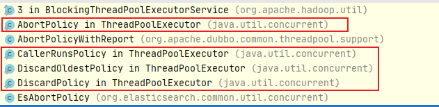

# 线程池

## [说明](http://localhost:3000/#/./docs/11.阅读源码/docs/11.StringBuilder?id=说明)

本文主要针对`Jdk 8`进行解读， 不同版本之间可能存在一定的变化

## 特性

1. 线程池的工作流程 优先核心线程--> 其次工作队列 ---> 扩展最大线程-->最后拒绝策略
2. 当线程池一条线程奔溃后，不影响其他线程的正常运行
3. 线程池发生异常的时候，最好还是手动去捕获
4. 而且如果线程池的线程频繁发生异常，会导致线程池频繁创建线程，导致资源频繁被损耗

## 核心参数

~~~java
ThreadPoolExecutor threadPool = new ThreadPoolExecutor(
                //等待线程参数
                3,
                //最大线程参数
                5,
                //线程存活时间
			    3,
			    //时间单位
    			TimeUnit.MINUTES,
                // 等待的阻塞队列容量
                new LinkedBlockingDeque<>(3),
                Executors.defaultThreadFactory(),
                // AbortPolicy 超出承载会拒绝，报异常
                // CallerRunsPolicy 哪里来的去哪里，让main线程去处理  (常用策略)
                // DiscardPolicy 超出承载不处理，但是不会报异常
                // DiscardOldestPolicy  尝试去执行，会竞争，如果不成功，也会丢弃任务
                new ThreadPoolExecutor.CallerRunsPolicy()
	);
// 允许核心线程在存货时间之后进行自动销毁
threadPool.allowsCoreThreadTimeOut();

~~~

## 工作流程

### `execute`

线程池的执行流程

~~~java
public void execute(Runnable command) {
	// 判断指令是否为null
    if (command == null)
        throw new NullPointerException();

    int c = ctl.get();
    // 判断当前的工作线程数量
    if (workerCountOf(c) < corePoolSize) {
        // 启动工作线程添加任务
        if (addWorker(command, true))
            return;
        c = ctl.get();
    }
    // 向任务队列添加任务
    if (isRunning(c) && workQueue.offer(command)) {
        int recheck = ctl.get();
        if (!isRunning(recheck) && remove(command))
            reject(command);
        else if (workerCountOf(recheck) == 0)
            addWorker(null, false);
    }
    // 执行拒绝策略
    else if (!addWorker(command, false))
        reject(command);
}

~~~

### `addWorker`

启动工作线程

~~~~java
private final BlockingQueue<Runnable> workQueue;

private boolean addWorker(Runnable firstTask, boolean core) {
    retry:
    for (int c = ctl.get();;) {
        // 检查工作队列是否空
        if (runStateAtLeast(c, SHUTDOWN)
            && (runStateAtLeast(c, STOP)
                || firstTask != null
                || workQueue.isEmpty()))
            return false;

        for (;;) {
            if (workerCountOf(c)
                >= ((core ? corePoolSize : maximumPoolSize) & COUNT_MASK))
                return false;
            if (compareAndIncrementWorkerCount(c))
                break retry;
            c = ctl.get();  // Re-read ctl
            if (runStateAtLeast(c, SHUTDOWN))
                continue retry;
            // else CAS failed due to workerCount change; retry inner loop
        }
    }

    // 开始追加任务
    boolean workerStarted = false;
    boolean workerAdded = false;
    Worker w = null;
    try {
        // 添加新的任务
        w = new Worker(firstTask);
        //  启动一个新的线程
        final Thread t = w.thread;
        if (t != null) {
            final ReentrantLock mainLock = this.mainLock;
            mainLock.lock();
            try {
                // Recheck while holding lock.
                // Back out on ThreadFactory failure or if
                // shut down before lock acquired.
                // 检查任务的状态
                int c = ctl.get();
                if (isRunning(c) ||
                    (runStateLessThan(c, STOP) && firstTask == null)) {
                    if (t.getState() != Thread.State.NEW)
                        throw new IllegalThreadStateException();
                    workers.add(w);
                    workerAdded = true;
                    int s = workers.size();
                    if (s > largestPoolSize)
                        largestPoolSize = s;
                }
            } finally {
                mainLock.unlock();
            }
            // 开始执行任务
            if (workerAdded) {
                t.start();
                workerStarted = true;
            }
        }
    } finally {
        if (! workerStarted)
            addWorkerFailed(w);
    }
    return workerStarted;
}

private final HashSet<Worker> workers = new HashSet<>();

/**
 * 追加任务运行失败
 */
private void addWorkerFailed(Worker w) {
    final ReentrantLock mainLock = this.mainLock;
    mainLock.lock();
    try {
        if (w != null)
            workers.remove(w);
        decrementWorkerCount();
        tryTerminate();
    } finally {
        mainLock.unlock();
    }
}
~~~~

### `reject`

执行拒绝策略

~~~java
final void reject(Runnable command) {
    handler.rejectedExecution(command, this);
}

public interface RejectedExecutionHandler {
    void rejectedExecution(Runnable r, ThreadPoolExecutor executor);
}
~~~

4种拒绝策略

1. 直接抛出抛出异常
2. 调用者自己执行
3. 丢弃最早的任务
4. 直接丢弃，不做任何处理

## 其他

### `worker`

1. 线程池内置任务对象，实现了`Runnable`接口， 可以去执行的一个线程任务

~~~java
  private final class Worker extends AbstractQueuedSynchronizer implements Runnable{
      
  }
~~~

