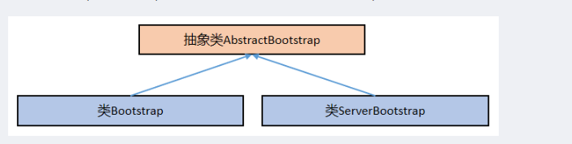

# Netty 源码

## 资料

+ [源码阅读](https://blog.csdn.net/weixin_44364444/article/details/113502652?utm_medium=distribute.pc_relevant.none-task-blog-2~default~baidujs_utm_term~default-0-113502652-blog-81255501.pc_relevant_antiscanv2&spm=1001.2101.3001.4242.1&utm_relevant_index=3)

## 传统Bio

BIO模型。庞大的线程消耗，消费消息如果很漫长，这个服务就是个灾难。

~~~java
public void server(int port) throws IOException{
    final ServerSocket socket=new ServerSocket(port);
    for (;;){
        //接受连接
        final Socket clientSock = socket.accept();
        System.out.println("Accept connection from"+ clientSock);
        //创建一个线程来处理连接
        new Thread(new Runnable() {
            @Override
            public void run() {
                OutputStream out;
                try {
                    out=clientSock.getOutputStream();
                    ... doSomeThing...
                    //将消息写给已连接的客户端
                    out.write("Hello world".getBytes(Charset.forName("UTF-8")));
                    out.flush();
                    clientSock.close();
                }
                ...略...
            }
        }).start();
    }    
}

~~~

## 传统Nio

~~~java
public static void main(String[] args) throws IOException {
    //创建ServerSocketChannel，处理接入连接
    ServerSocketChannel serverSocketChannel=ServerSocketChannel.open();
    //创建Selector
    Selector selector=Selector.open();
    //设置是否为非阻塞
    serverSocketChannel.configureBlocking(false);
    //创建注册channel进selector的创立连接时间
    serverSocketChannel.register(selector, SelectionKey.OP_ACCEPT);
    //绑定端口号
    serverSocketChannel.socket().bind(new InetSocketAddress(8080));
    while (true){
        if(serverSocketChannel.isOpen()){
            // 通过 Selector 选择 Channel
            int selectNums = selector.select(1000L);
            if (selectNums == 0) {
                continue;
            }
            // 遍历可选择的 Channel 的 SelectionKey 集合
            for (SelectionKey selectKey:selector.selectedKeys()) {
                // 忽略无效的 SelectionKey
                if (!selectKey.isValid()) {
                    continue;
                }
                //新建立的连接
                if(selectKey.isAcceptable()){
                    //获取新连接创建的channel
                    SocketChannel socketChannel= ((ServerSocketChannel) selectKey.channel()).accept();
                    if(socketChannel!=null){
                        //设置为非阻塞
                        socketChannel.configureBlocking(false);
                        //注册进selector
                        socketChannel.register(selector,SelectionKey.OP_READ);
                    }
                }
                //处理读时间
                if(selectKey.isReadable()){
                    SocketChannel socketChannel= (SocketChannel) selectKey.channel();
                    if(socketChannel!=null){
                        //读取数据
                        ByteBuffer buffer = ByteBuffer.allocate(1024);
                        int bytesRead = socketChannel.read(buffer);
                        if(bytesRead==-1){
                            socketChannel.register(selector,0);
                            socketChannel.close();
                        }else{
                            buffer.flip();
                            byte[] bytes = new byte[buffer.remaining()];
                            System.arraycopy(buffer.array(), buffer.position(), bytes, 0, buffer.remaining());
                            System.out.println(new String(bytes, "UTF-8"));
                        }
                    }
                }
            }
        }
    }
}

~~~

+ Channels：与支持非阻塞读取的文件，socket等建立连接。
+ Buffers：本质是一块内存，用于和NIO通道进行交互。
+ Selectors：把Channel和需要的事件注册到Selector上面，告诉一组channel中的哪一个有IO事件。
+ SelectionKeys：维护IO事件状态和绑定

## Netty

### NioEventLoopGroup

~~~java
bossGroup 和 workerGroup 是整个 Netty 的核心对象，
    我在上一篇文章讲解了服务器构建的主从 Reactor 多线程模式（也叫做服务器的 1+M+N 模式），
    其中的主 Reactor 就是这里的 bossGroup 里面的 EventLoop、从 Reactor 就是这里的 workerGroup 里面的 EventLoop。
bossGroup 用于接收 TCP 连接请求，
    建立连接后会把连接转接给 workerGroup 来处理连接上的后续请求，
    比如读取请求数据-->解码请求数据-->进行业务处理-->编码响应数据-->发送响应数据这一整套流程。

EventLoopGroup 是一个线程组，其中的每一个线程都在循环执行着三件事情：
select：轮训注册在其中的 Selector 上的 Channel 的 IO 事件
processSelectedKeys：在对应的 Channel 上处理 IO 事件
runAllTasks：再去以此循环处理任务队列中的其他任务

~~~

~~~java
protected MultithreadEventExecutorGroup(int nThreads, Executor executor, EventExecutorChooserFactory chooserFactory, Object... args) {
    this.terminatedChildren = new AtomicInteger();
    this.terminationFuture = new DefaultPromise(GlobalEventExecutor.INSTANCE);
    if (nThreads <= 0) {
        throw new IllegalArgumentException(String.format("nThreads: %d (expected: > 0)", nThreads));
    } else {
        // 新建线程池
        if (executor == null) {
            executor = new ThreadPerTaskExecutor(this.newDefaultThreadFactory());
        }

        this.children = new EventExecutor[nThreads];

        // 遍历线程
        int j;
        for(int i = 0; i < nThreads; ++i) {
            boolean success = false;
            boolean var18 = false;

            try {
                var18 = true;
                this.children[i] = this.newChild((Executor)executor, args);
                success = true;
                var18 = false;
            } catch (Exception var19) {
                throw new IllegalStateException("failed to create a child event loop", var19);
            } finally {
                if (var18) {
                    if (!success) {
                        int j;
                        for(j = 0; j < i; ++j) {
                            this.children[j].shutdownGracefully();
                        }

                        for(j = 0; j < i; ++j) {
                            EventExecutor e = this.children[j];

                            try {
                                while(!e.isTerminated()) {
                                    e.awaitTermination(2147483647L, TimeUnit.SECONDS);
                                }
                            } catch (InterruptedException var20) {
                                Thread.currentThread().interrupt();
                                break;
                            }
                        }
                    }

                }
            }

            if (!success) {
                for(j = 0; j < i; ++j) {
                    this.children[j].shutdownGracefully();
                }

                for(j = 0; j < i; ++j) {
                    EventExecutor e = this.children[j];

                    try {
                        while(!e.isTerminated()) {
                            e.awaitTermination(2147483647L, TimeUnit.SECONDS);
                        }
                    } catch (InterruptedException var22) {
                        Thread.currentThread().interrupt();
                        break;
                    }
                }
            }
        }

        this.chooser = chooserFactory.newChooser(this.children);
        // 监听 事件
        FutureListener<Object> terminationListener = new FutureListener<Object>() {
            public void operationComplete(Future<Object> future) throws Exception {
                if (MultithreadEventExecutorGroup.this.terminatedChildren.incrementAndGet() == MultithreadEventExecutorGroup.this.children.length) {
                    MultithreadEventExecutorGroup.this.terminationFuture.setSuccess((Object)null);
                }

            }
        };
        EventExecutor[] var24 = this.children;
        j = var24.length;

        for(int var26 = 0; var26 < j; ++var26) {
            EventExecutor e = var24[var26];
            e.terminationFuture().addListener(terminationListener);
        }

        Set<EventExecutor> childrenSet = new LinkedHashSet(this.children.length);
        Collections.addAll(childrenSet, this.children);
        this.readonlyChildren = Collections.unmodifiableSet(childrenSet);
    }
}

~~~

~~~java
protected EventLoop newChild(Executor executor, Object... args) throws Exception {
    EventLoopTaskQueueFactory queueFactory = args.length == 4 ? (EventLoopTaskQueueFactory)args[3] : null;
    return new NioEventLoop(this, executor, (SelectorProvider)args[0], ((SelectStrategyFactory)args[1]).newSelectStrategy(), (RejectedExecutionHandler)args[2], queueFactory);
}
~~~

回到问题的起点，我们是要探究代码 EventLoopGroup workerGroup = new NioEventLoopGroup()的执行内幕，到此为止，答案已经清晰了，总结如下：

1. NioEventLoopGroup 的无参数构造函数会调用 NioEventLoopGroup 的有参数构造函数，最终把参
   + nThreads=16
   + executor=null
   + chooserFactory=DefaultEventExecutorChooserFactory.INSTANCE
   + selectorProvider=SelectorProvider.provider()
   + selectStrategyFactory=DefaultSelectStrategyFactory.INSTANCE
   + rejectedExecutionHandler=RejectedExecutionHandlers.reject()

传递给父类 MultithreadEventLoopGroup 的有参数构造函数。

2. 父类 MultithreadEventLoopGroup 的有参数构造函数创建一个 NioEventLoop 的容器 children = new EventExecutor[nThreads]，并构建出 16 个 NioEventLoop 的实例放入其中。
3. 构建每一个 NioEventLoop 调用的是 children[i] = newChild(executor, args)。
4. newChild()方法最终调用了 NioEventLoop 的构造函数，初始化其中的选择器、任务队列、执行器等成分。

### ServerBootstrap

ServerBootstrap 提供了一些列的链式配置方法，具体而言就是 ServerBootstrap 对象的一个配置方法（比如.group()）处理完配置参数之后，会将当前 ServerBootstrap 对象返回，这样就能紧随其后继续调用该对象的其他配置方法（比如.channel()）。这是面向对象语言中常见的一种编程模式。

