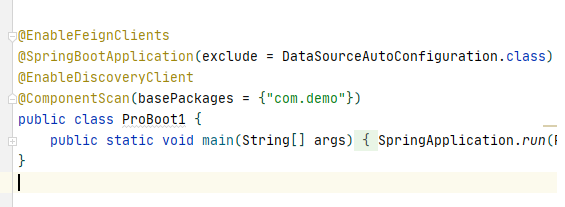
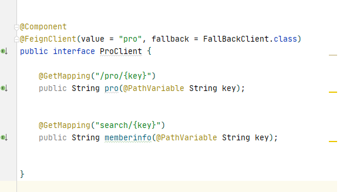

# OpenFeign

## 使用示例

1. 开始Feign客户端

2. 远程调用

# 源码分析

## `@EnableFeignClients`

1. 开启远程调用功能

~~~java
@Retention(RetentionPolicy.RUNTIME)
@Target(ElementType.TYPE)
@Documented
//FeignClients注册器
@Import(FeignClientsRegistrar.class)
public @interface EnableFeignClients {

    //注解的配置
	//......

}

//实现了ImportBeanDefinitionRegistrar接口，去看registerBeanDefinitions()方法
class FeignClientsRegistrar implements ImportBeanDefinitionRegistrar,
ResourceLoaderAware, EnvironmentAware {
    
    @Override
	public void registerBeanDefinitions(AnnotationMetadata metadata,
			BeanDefinitionRegistry registry) {
		registerDefaultConfiguration(metadata, registry);
		registerFeignClients(metadata, registry);
	}
}

~~~

### `registerBeanDefinitions`

1. 扫描所有的@FeignClient注解，并进行注册
2. `registerFeignClients`源码部分在【其他】

~~~java

#FeignClientsRegistrar
public void registerBeanDefinitions(AnnotationMetadata metadata,
		BeanDefinitionRegistry registry) {
    //注册@EnableFeignClients上定义的defaultConfiguration默认配置类
	registerDefaultConfiguration(metadata, registry);
    //扫描所有的@FeignClient注解
	registerFeignClients(metadata, registry);
}

~~~

### `registerDefaultConfiguration`

~~~java
#FeignClientsRegistrar
private void registerDefaultConfiguration(AnnotationMetadata metadata,
		BeanDefinitionRegistry registry) {
    //获取@EnableFeignClients配置的信息
	Map<String, Object> defaultAttrs = metadata
			.getAnnotationAttributes(EnableFeignClients.class.getName(), true);
    //判断是否配置了defaultConfiguration
	if (defaultAttrs != null && defaultAttrs.containsKey("defaultConfiguration")) {
		String name;
        //判断配置在defaultConfiguration是否为内部类，拼接对应的类名
		if (metadata.hasEnclosingClass()) {
			name = "default." + metadata.getEnclosingClassName();
		}
		else {
			name = "default." + metadata.getClassName();
		}
        //跟进去
		registerClientConfiguration(registry, name,
				defaultAttrs.get("defaultConfiguration"));
	}
}

#FeignClientsRegistrar
private void registerClientConfiguration(BeanDefinitionRegistry registry, Object name,
		Object configuration) {
	BeanDefinitionBuilder builder = BeanDefinitionBuilder
			.genericBeanDefinition(FeignClientSpecification.class);
	builder.addConstructorArgValue(name);
	builder.addConstructorArgValue(configuration);
    //将@EnableFeignClients中的配置信息注册到容器中
	registry.registerBeanDefinition(
			name + "." + FeignClientSpecification.class.getSimpleName(),
			builder.getBeanDefinition());
}

~~~

### `registerFeignClients`

~~~java
#FeignClientsRegistrar
public void registerFeignClients(AnnotationMetadata metadata,
		BeanDefinitionRegistry registry) {
    //获取类路径扫描器
	ClassPathScanningCandidateComponentProvider scanner = getScanner();
    //设置资源加载器
	scanner.setResourceLoader(this.resourceLoader);
	Set<String> basePackages;
    //获取@EnableFeignClients的注解信息
	Map<String, Object> attrs = metadata
			.getAnnotationAttributes(EnableFeignClients.class.getName());
    //创建@FeignClient类型的过滤器
	AnnotationTypeFilter annotationTypeFilter = new AnnotationTypeFilter(
			FeignClient.class);
	final Class<?>[] clients = attrs == null ? null
			: (Class<?>[]) attrs.get("clients");
	if (clients == null || clients.length == 0) {
		scanner.addIncludeFilter(annotationTypeFilter);
        //获取包路径
		basePackages = getBasePackages(metadata);
	}
	else {
		//......
	}
    //遍历包路径
	for (String basePackage : basePackages) {
        //获取该包路径下带@FeignClient的BD信息
		Set<BeanDefinition> candidateComponents = scanner
				.findCandidateComponents(basePackage);
		for (BeanDefinition candidateComponent : candidateComponents) {
			if (candidateComponent instanceof AnnotatedBeanDefinition) {
				AnnotatedBeanDefinition beanDefinition = (AnnotatedBeanDefinition) candidateComponent;
				AnnotationMetadata annotationMetadata = beanDefinition.getMetadata();
				Assert.isTrue(annotationMetadata.isInterface(),
						"@FeignClient can only be specified on an interface");
                //获取@FeignClient的注解信息
				Map<String, Object> attributes = annotationMetadata
						.getAnnotationAttributes(
								FeignClient.class.getCanonicalName());
                //获取@FeignClient上配置的名称，优先级为contextId>value>name>serviceId
				String name = getClientName(attributes);
                //注册@FeignClient的配置信息
				registerClientConfiguration(registry, name,
						attributes.get("configuration"));
                //注册加了@FeignClient的类到容器中
				registerFeignClient(registry, annotationMetadata, attributes);
			}
		}
	}
}

// 这里可能会注入多个 FeignClient 对象
#FeignClientsRegistrar
private void registerFeignClient(BeanDefinitionRegistry registry,
		AnnotationMetadata annotationMetadata, Map<String, Object> attributes) {
    //返回添加了@FeignClient注解的Class的全限定名，  包名.类名
	String className = annotationMetadata.getClassName();
    
    //FeignClientFactoryBean是一个FactoryBean，用它来创建具体的FeignClient
	BeanDefinitionBuilder definition = BeanDefinitionBuilder
			.genericBeanDefinition(FeignClientFactoryBean.class);
	validate(attributes);
    
    //向FeignClientFactoryBean添加@FeignClient中配置的一些注解信息
	definition.addPropertyValue("url", getUrl(attributes));
	definition.addPropertyValue("path", getPath(attributes));
	String name = getName(attributes);
	definition.addPropertyValue("name", name);
	String contextId = getContextId(attributes);
	definition.addPropertyValue("contextId", contextId);
	definition.addPropertyValue("type", className);
	definition.addPropertyValue("decode404", attributes.get("decode404"));
	definition.addPropertyValue("fallback", attributes.get("fallback"));
	definition.addPropertyValue("fallbackFactory", attributes.get("fallbackFactory"));
	definition.setAutowireMode(AbstractBeanDefinition.AUTOWIRE_BY_TYPE);
	String alias = contextId + "FeignClient";
	AbstractBeanDefinition beanDefinition = definition.getBeanDefinition();
	boolean primary = (Boolean) attributes.get("primary");
	beanDefinition.setPrimary(primary);
	String qualifier = getQualifier(attributes);
	if (StringUtils.hasText(qualifier)) {
		alias = qualifier;
	}
	BeanDefinitionHolder holder = new BeanDefinitionHolder(beanDefinition, className,
			new String[] { alias });
    
    //将FeignClientFactoryBean注册到容器中
	BeanDefinitionReaderUtils.registerBeanDefinition(holder, registry);
}

~~~

这一步完成后，所有的加了@FeignClient的类就会被解析成FeignClientFactoryBean类型的BeanDefinition加入到容器中，FeignClientFactoryBean包含了@FeignClient上配置的信息，以及保存了当前添加@FeignClient注解的Class名称。之后就是Spring容器在refresh()内会去实例化该FeignClient，而FeignClientFactoryBean是FactoryBean类型，所以会调用它的getObject()进行实例化。

### `FeignClientFactoryBean`

1. FeignClientFactoryBean ： Feign 对象实例化，最终会被加入到容器中

~~~java
#FeignClientFactoryBean
public Object getObject() throws Exception {
	return getTarget();
}

#FeignClientFactoryBean
<T> T getTarget() {
    //获取FeignContext，在FeignAutoConfiguration自动装配进来
	FeignContext context = this.applicationContext.getBean(FeignContext.class);
    //创建builder对象，用来生成Feign
	Feign.Builder builder = feign(context);
    //如果没有在@FeignClient配置了url，说明要负载均衡
	if (!StringUtils.hasText(this.url)) {
       	//构造url
		if (!this.name.startsWith("http")) {
			this.url = "http://" + this.name;
		}
		else {
			this.url = this.name;
		}
        //http://服务名
		this.url += cleanPath();
        //创建负载均衡代理类
		return (T) loadBalance(builder, context,
				new HardCodedTarget<>(this.type, this.name, this.url));
	}
    
    //说明url存在，使用硬编码的方式
	if (StringUtils.hasText(this.url) && !this.url.startsWith("http")) {
        //直接拼接url
		this.url = "http://" + this.url;
	}
	String url = this.url + cleanPath();
    //获取客户端对象
	Client client = getOptional(context, Client.class);
	if (client != null) {
        //Ribbon客户端对象LoadBalancerFeignClient
		if (client instanceof LoadBalancerFeignClient) {
			client = ((LoadBalancerFeignClient) client).getDelegate();
		}
		builder.client(client);
	}
    //在FeignAutoConfiguration自动装配进来
	Targeter targeter = get(context, Targeter.class);
    //生成动态代理对象
	return (T) targeter.target(this, builder, context,
			new HardCodedTarget<>(this.type, this.name, url));
}

~~~

## `FeignAutoConfiguration`

1. 包涵了Feign启动所需要的所有组件
2. 判断是否需要引入`Hystrix`

~~~~java
@Configuration
@ConditionalOnClass(Feign.class)
@EnableConfigurationProperties({ FeignClientProperties.class,
		FeignHttpClientProperties.class })
public class FeignAutoConfiguration {
	
    //FeignContext，内部保存了创建FeignClient所需的组件
	@Bean
	public FeignContext feignContext() {
		FeignContext context = new FeignContext();
		context.setConfigurations(this.configurations);
		return context;
	}

    //以下是两个相对的条件
	@Configuration
	@ConditionalOnClass(name = "feign.hystrix.HystrixFeign")//引入hystrix
	protected static class HystrixFeignTargeterConfiguration {
		@Bean
		@ConditionalOnMissingBean
		public Targeter feignTargeter() {
            //创建Hystrix类型
			return new HystrixTargeter();
		}
	}

	@Configuration
	@ConditionalOnMissingClass("feign.hystrix.HystrixFeign")//未引入hystrix
	protected static class DefaultFeignTargeterConfiguration {
		@Bean
		@ConditionalOnMissingBean
		public Targeter feignTargeter() {
            //创建默认类型
			return new DefaultTargeter();
		}

	}
    
    //下面还有HttpClient,Okhttp的配置
}

~~~~

FeignAutoConfiguration 配置类会自动装配一些用来创建 FeignClient 实例的 Bean 信息。

### `FeignClientFactoryBean`

#### 创建生成Feign的Builder对象

~~~java
#FeignClientFactoryBean
protected Feign.Builder feign(FeignContext context) {
	FeignLoggerFactory loggerFactory = get(context, FeignLoggerFactory.class);
	Logger logger = loggerFactory.create(this.type);
    //设置Logger、Encoder、Decoder等组件
	Feign.Builder builder = get(context, Feign.Builder.class)
			.logger(logger)
			.encoder(get(context, Encoder.class))
			.decoder(get(context, Decoder.class))
			.contract(get(context, Contract.class));
    //配置builder
	configureFeign(context, builder);
	return builder;
}

#FeignClientFactoryBean
protected void configureFeign(FeignContext context, Feign.Builder builder) {
	FeignClientProperties properties = this.applicationContext
			.getBean(FeignClientProperties.class);
    //从.properties配置文件中加载配置
	if (properties != null) {
		if (properties.isDefaultToProperties()) {
			configureUsingConfiguration(context, builder);
			configureUsingProperties(
					properties.getConfig().get(properties.getDefaultConfig()),
					builder);
			configureUsingProperties(properties.getConfig().get(this.contextId),
					builder);
		}
		else {
			configureUsingProperties(
					properties.getConfig().get(properties.getDefaultConfig()),
					builder);
			configureUsingProperties(properties.getConfig().get(this.contextId),
					builder);
			configureUsingConfiguration(context, builder);
		}
	}
    //配置类@Bean加载配置
	else {
		configureUsingConfiguration(context, builder);
	}
}

~~~

在加载配置到builder对象中后，就是去生成代理对象的逻辑。

#### 创建Feign代理对象

首先来看看创建负载均衡代理对象

~~~java
#FeignClientFactoryBean
protected <T> T loadBalance(Feign.Builder builder, FeignContext context,
		HardCodedTarget<T> target) {
    //获取客户端对象
	Client client = getOptional(context, Client.class);
	if (client != null) {
		builder.client(client);
        //获取Targeter，分别有HystrixTargeter和DefaultTargeter类型
		Targeter targeter = get(context, Targeter.class);
        //创建代理对象，跟进去，是一个接口方法，分别对应上面两种类型的实现
		return targeter.target(this, builder, context, target);
	}
	throw new IllegalStateException(
			"No Feign Client for loadBalancing defined. Did you forget to include spring-cloud-starter-netflix-ribbon?");
}

~~~

先分析DefaultTargeter类型的代理对象

### DefaultTargeter创建代理对象

~~~java
#DefaultTargeter
public <T> T target(FeignClientFactoryBean factory, Feign.Builder feign,
      FeignContext context, Target.HardCodedTarget<T> target) {
   return feign.target(target);
}

#Feign
public <T> T target(Target<T> target) {
    //跟进去
   return build().newInstance(target);
}

#Feign.Builder
public Feign build() {
  //构建SynchronousMethodHandler工厂
  SynchronousMethodHandler.Factory synchronousMethodHandlerFactory =
      new SynchronousMethodHandler.Factory(client, retryer, requestInterceptors, logger,
          logLevel, decode404, closeAfterDecode, propagationPolicy);
  //设置组件对象
  ParseHandlersByName handlersByName =
      new ParseHandlersByName(contract, options, encoder, decoder, queryMapEncoder,
          errorDecoder, synchronousMethodHandlerFactory);
  //创建ReflectiveFeign实例，invocationHandlerFactory是InvocationHandlerFactory.Default类型
  return new ReflectiveFeign(handlersByName, invocationHandlerFactory, queryMapEncoder);
}

#ReflectiveFeign  是Feign的实现类
public <T> T newInstance(Target<T> target) {
  //target内部保存了当前加了@FeignClient的接口Class，apply()会解析出接口中的方法和方法上的注解
  //key是方法名，value是SynchronousMethodHandler类型，内部持有这个方法和注解的所有信息
  Map<String, MethodHandler> nameToHandler = targetToHandlersByName.apply(target);
  Map<Method, MethodHandler> methodToHandler = new LinkedHashMap<Method, MethodHandler>();
  List<DefaultMethodHandler> defaultMethodHandlers = new LinkedList<DefaultMethodHandler>();
  //target.type()就是获取接口的Class
  //遍历所有的接口方法
  for (Method method : target.type().getMethods()) {
    if (method.getDeclaringClass() == Object.class) {
      //Object的方法不管
      continue;
    } else if (Util.isDefault(method)) {
      //default 类型的方法，要加入到defaultMethodHandlers集合
      DefaultMethodHandler handler = new DefaultMethodHandler(method);
      defaultMethodHandlers.add(handler);
      methodToHandler.put(method, handler);
    } else {
      //非Object，default的方法，从nameToHandler中取出添加到methodToHandler集合
      methodToHandler.put(method, nameToHandler.get(Feign.configKey(target.type(), method)));
    }
  }
  //InvocationHandler工厂创建InvocationHandler对象
  InvocationHandler handler = factory.create(target, methodToHandler);
  //创建代理对象
  T proxy = (T) Proxy.newProxyInstance(target.type().getClassLoader(),
      new Class<?>[] {target.type()}, handler);
  for (DefaultMethodHandler defaultMethodHandler : defaultMethodHandlers) {
    //将default方法绑定在代理对象上
    defaultMethodHandler.bindTo(proxy);
  }
  //返回代理对象
  return proxy;
}

~~~

到这里代理对象也创建完成了，接下来就该去看看InvocationHandler的invoke方法是在哪实现的。

### InvocationHandler对象调用invoke()

~~~java
#InvocationHandlerFactory.Default
public InvocationHandler create(Target target, Map<Method, MethodHandler> dispatch) {
  //创建了FeignInvocationHandler类型的InvocationHandler，直接看它的invoke方法
  return new ReflectiveFeign.FeignInvocationHandler(target, dispatch);
}

# ReflectiveFeign
public Object invoke(Object proxy, Method method, Object[] args) throws Throwable {
  if ("equals".equals(method.getName())) {
    try {
      Object otherHandler =
          args.length > 0 && args[0] != null ? Proxy.getInvocationHandler(args[0]) : null;
      return equals(otherHandler);
    } catch (IllegalArgumentException e) {
      return false;
    }
  } else if ("hashCode".equals(method.getName())) {
    return hashCode();
  } else if ("toString".equals(method.getName())) {
    return toString();
  }
  //dispatch就是在构造中赋值的，在#ReflectiveFeign的newInstance()方法中的methodToHandler
  //key为接口中的方法，value为SynchronousMethodHandler和DefaultMethodHandler类型
  //所以接下来就去看这两个类型的invoke方法
  return dispatch.get(method).invoke(args);
}

~~~

#### DefaultMethodHandler的invoke()

~~~java
public Object invoke(Object[] argv) throws Throwable {
  if (handle == null) {
    throw new IllegalStateException(
        "Default method handler invoked before proxy has been bound.");
  }
  //default修饰的方法就直接执行
  return handle.invokeWithArguments(argv);
}

~~~

#### SynchronousMethodHandler的invoke()

~~~java

public Object invoke(Object[] argv) throws Throwable {
  //将方法参数构建成RequestTemplate，这个对象相信大家都很熟悉
  RequestTemplate template = buildTemplateFromArgs.create(argv);
  Options options = findOptions(argv);
  Retryer retryer = this.retryer.clone();
  while (true) {
    try {
      //执行请求
      return executeAndDecode(template, options);
    } catch (RetryableException e) {
      try {
        //重试机制
        retryer.continueOrPropagate(e);
      } 
      //......
    }
  }
}

#SynchronousMethodHandler
Object executeAndDecode(RequestTemplate template, Options options) throws Throwable {
  //调用RequestInterceptor，根据template生成Request对象
  Request request = targetRequest(template);
  //......
  //响应对象
  Response response;
  long start = System.nanoTime();
  try {
    //调用客户端的execute执行请求
    response = client.execute(request, options);
  } catch (IOException e) {
    //......
  }
  long elapsedTime = TimeUnit.NANOSECONDS.toMillis(System.nanoTime() - start);
  boolean shouldClose = true;
  try {
    //......
    //对response进行解码
    if (Response.class == metadata.returnType()) {
      if (response.body() == null) {
        return response;
      }
      if (response.body().length() == null ||
          response.body().length() > MAX_RESPONSE_BUFFER_SIZE) {
        shouldClose = false;
        return response;
      }
      byte[] bodyData = Util.toByteArray(response.body().asInputStream());
      return response.toBuilder().body(bodyData).build();
    }
    if (response.status() >= 200 && response.status() < 300) {
      if (void.class == metadata.returnType()) {
        return null;
      } else {
        Object result = decode(response);
        shouldClose = closeAfterDecode;
        return result;
      }
    } else if (decode404 && response.status() == 404 && void.class != metadata.returnType()) {
      Object result = decode(response);
      shouldClose = closeAfterDecode;
      return result;
    } else {
      throw errorDecoder.decode(metadata.configKey(), response);
    }
  }
  //......
}

~~~

真正执行请求的client.execute(request, options)是一个接口方法，是由不同的客户端工具进行实现。如果没有导入Ribbon，那么就用feign自带的Client.Default内部进行实现。Client是一个接口。

~~~java
#Client.Default
public Response execute(Request request, Options options) throws IOException {
  //convertAndSend()发送请求
  HttpURLConnection connection = convertAndSend(request, options);
  //convertResponse()响应解码
  return convertResponse(connection, request);
}

~~~

### Ribbon

如果导入了Ribbon，那么就是LoadBalancerFeignClient实现，内部使用Ribbon进行负载均衡

#### LoadBalancerFeignClient -- 负载均衡

~~~java
#LoadBalancerFeignClient
    
private CachingSpringLoadBalancerFactory lbClientFactory;
    
public Response execute(Request request, Request.Options options) throws IOException {
	try {
		URI asUri = URI.create(request.url());
		String clientName = asUri.getHost();
		URI uriWithoutHost = cleanUrl(request.url(), clientName);
		FeignLoadBalancer.RibbonRequest ribbonRequest = new FeignLoadBalancer.RibbonRequest(
				this.delegate, request, uriWithoutHost);
		IClientConfig requestConfig = getClientConfig(options, clientName);
		return lbClient(clientName)
				.executeWithLoadBalancer(ribbonRequest, requestConfig).toResponse();
	}
	//......
}

~~~

到这里，没有导入Hystrix创建代理对象的流程就分析完了，一些具体解析的方法并没有去详细分析，因为我们主要是理解openfeign的执行流程，所以分析创建代理对象，然后到真正执行请求的地方就行了。接下来是去分析引入了Hystrix后是如何创建代理。

#### CachingSpringLoadBalancerFactory -- 创建LB

~~~java
public class CachingSpringLoadBalancerFactory {

	protected final SpringClientFactory factory;

	protected LoadBalancedRetryFactory loadBalancedRetryFactory = null;

	private volatile Map<String, FeignLoadBalancer> cache = new ConcurrentReferenceHashMap<>();

	public CachingSpringLoadBalancerFactory(SpringClientFactory factory) {
		this.factory = factory;
	}

	public CachingSpringLoadBalancerFactory(SpringClientFactory factory,
			LoadBalancedRetryFactory loadBalancedRetryPolicyFactory) {
		this.factory = factory;
		this.loadBalancedRetryFactory = loadBalancedRetryPolicyFactory;
	}

    // 创建 LoadBalance 对象
	public FeignLoadBalancer create(String clientName) {
		FeignLoadBalancer client = this.cache.get(clientName);
		if (client != null) {
			return client;
		}
		IClientConfig config = this.factory.getClientConfig(clientName);
		ILoadBalancer lb = this.factory.getLoadBalancer(clientName);
		ServerIntrospector serverIntrospector = this.factory.getInstance(clientName,
				ServerIntrospector.class);
		client = this.loadBalancedRetryFactory != null
				? new RetryableFeignLoadBalancer(lb, config, serverIntrospector,
						this.loadBalancedRetryFactory)
				: new FeignLoadBalancer(lb, config, serverIntrospector);
		this.cache.put(clientName, client);
		return client;
	}
}
~~~

#### SpringClientFactory

~~~java

// 将自定义的Irule 加入了进来
public SpringClientFactory() {
    super(RibbonClientConfiguration.class, NAMESPACE, "ribbon.client.name");
}

public ILoadBalancer getLoadBalancer(String name) {
    return getInstance(name, ILoadBalancer.class);
}

@Override
public <C> C getInstance(String name, Class<C> type) {
    C instance = super.getInstance(name, type);
    if (instance != null) {
        return instance;
    }
    IClientConfig config = getInstance(name, IClientConfig.class);
    return instantiateWithConfig(getContext(name), type, config);
}

// 这里会对LB进行实例化与初始化
static <C> C instantiateWithConfig(AnnotationConfigApplicationContext context,
                                   Class<C> clazz, IClientConfig config) {
    C result = null;

    try {
        Constructor<C> constructor = clazz.getConstructor(IClientConfig.class);
        result = constructor.newInstance(config);
    }
    catch (Throwable e) {
        // Ignored
    }
    if (result == null) {
        result = BeanUtils.instantiate(clazz);
        if (result instanceof IClientConfigAware) {
            ((IClientConfigAware) result).initWithNiwsConfig(config);
        }
        if (context != null) {
            context.getAutowireCapableBeanFactory().autowireBean(result);
        }
    }

    return result;
}
~~~

#### RibbonClientConfiguration

~~~java
@Configuration(proxyBeanMethods = false)
@EnableConfigurationProperties
@Import({ HttpClientConfiguration.class, OkHttpRibbonConfiguration.class,
		RestClientRibbonConfiguration.class, HttpClientRibbonConfiguration.class })
public class RibbonClientConfiguration {
	// 设置超时时间
	public static final int DEFAULT_CONNECT_TIMEOUT = 1000;
	public static final int DEFAULT_READ_TIMEOUT = 1000;
	public static final boolean DEFAULT_GZIP_PAYLOAD = true;
	@RibbonClientName
	private String name = "client";
	@Autowired
	private PropertiesFactory propertiesFactory;
	@Bean
	@ConditionalOnMissingBean
	public IClientConfig ribbonClientConfig() {
		DefaultClientConfigImpl config = new DefaultClientConfigImpl();
		config.loadProperties(this.name);
		config.set(CommonClientConfigKey.ConnectTimeout, DEFAULT_CONNECT_TIMEOUT);
		config.set(CommonClientConfigKey.ReadTimeout, DEFAULT_READ_TIMEOUT);
		config.set(CommonClientConfigKey.GZipPayload, DEFAULT_GZIP_PAYLOAD);
		return config;
	}
    // 设置负载均衡策略
	@Bean
	@ConditionalOnMissingBean
	public IRule ribbonRule(IClientConfig config) {
		if (this.propertiesFactory.isSet(IRule.class, name)) {
			return this.propertiesFactory.get(IRule.class, config, name);
		}
		ZoneAvoidanceRule rule = new ZoneAvoidanceRule();
		rule.initWithNiwsConfig(config);
		return rule;
	}
	@Bean
	@ConditionalOnMissingBean
	public IPing ribbonPing(IClientConfig config) {
		if (this.propertiesFactory.isSet(IPing.class, name)) {
			return this.propertiesFactory.get(IPing.class, config, name);
		}
		return new DummyPing();
	}
	@Bean
	@ConditionalOnMissingBean
	@SuppressWarnings("unchecked")
	public ServerList<Server> ribbonServerList(IClientConfig config) {
		if (this.propertiesFactory.isSet(ServerList.class, name)) {
			return this.propertiesFactory.get(ServerList.class, config, name);
		}
		ConfigurationBasedServerList serverList = new ConfigurationBasedServerList();
		serverList.initWithNiwsConfig(config);
		return serverList;
	}

	@Bean
	@ConditionalOnMissingBean
	public ServerListUpdater ribbonServerListUpdater(IClientConfig config) {
		return new PollingServerListUpdater(config);
	}

	@Bean
	@ConditionalOnMissingBean
	public ILoadBalancer ribbonLoadBalancer(IClientConfig config,
			ServerList<Server> serverList, ServerListFilter<Server> serverListFilter,
			IRule rule, IPing ping, ServerListUpdater serverListUpdater) {
		if (this.propertiesFactory.isSet(ILoadBalancer.class, name)) {
			return this.propertiesFactory.get(ILoadBalancer.class, config, name);
		}
		return new ZoneAwareLoadBalancer<>(config, rule, ping, serverList,
				serverListFilter, serverListUpdater);
	}

	@Bean
	@ConditionalOnMissingBean
	@SuppressWarnings("unchecked")
	public ServerListFilter<Server> ribbonServerListFilter(IClientConfig config) {
		if (this.propertiesFactory.isSet(ServerListFilter.class, name)) {
			return this.propertiesFactory.get(ServerListFilter.class, config, name);
		}
		ZonePreferenceServerListFilter filter = new ZonePreferenceServerListFilter();
		filter.initWithNiwsConfig(config);
		return filter;
	}

	@Bean
	@ConditionalOnMissingBean
	public RibbonLoadBalancerContext ribbonLoadBalancerContext(ILoadBalancer loadBalancer,
			IClientConfig config, RetryHandler retryHandler) {
		return new RibbonLoadBalancerContext(loadBalancer, config, retryHandler);
	}

	@Bean
	@ConditionalOnMissingBean
	public RetryHandler retryHandler(IClientConfig config) {
		return new DefaultLoadBalancerRetryHandler(config);
	}

	@Bean
	@ConditionalOnMissingBean
	public ServerIntrospector serverIntrospector() {
		return new DefaultServerIntrospector();
	}

	@PostConstruct
	public void preprocess() {
		setRibbonProperty(name, DeploymentContextBasedVipAddresses.key(), name);
	}

	static class OverrideRestClient extends RestClient {

		private IClientConfig config;

		private ServerIntrospector serverIntrospector;

		protected OverrideRestClient(IClientConfig config,
				ServerIntrospector serverIntrospector) {
			super();
			this.config = config;
			this.serverIntrospector = serverIntrospector;
			initWithNiwsConfig(this.config);
		}

		@Override
		public URI reconstructURIWithServer(Server server, URI original) {
			URI uri = updateToSecureConnectionIfNeeded(original, this.config,
					this.serverIntrospector, server);
			return super.reconstructURIWithServer(server, uri);
		}

		@Override
		protected Client apacheHttpClientSpecificInitialization() {
			ApacheHttpClient4 apache = (ApacheHttpClient4) super.apacheHttpClientSpecificInitialization();
			apache.getClientHandler().getHttpClient().getParams().setParameter(
					ClientPNames.COOKIE_POLICY, CookiePolicy.IGNORE_COOKIES);
			return apache;
		}
	}
}

~~~

#### ILoadBalancer

~~~java
public interface ILoadBalancer {

	public void addServers(List<Server> newServers);

	public Server chooseServer(Object key);

	public void markServerDown(Server server);

	@Deprecated
	public List<Server> getServerList(boolean availableOnly);

    public List<Server> getReachableServers();
	public List<Server> getAllServers();
}

~~~

#### 最终创建--FeignLoadBalancer

1. 继承 IClientConfigAware

~~~java
public class FeignLoadBalancer extends
		AbstractLoadBalancerAwareClient<FeignLoadBalancer.RibbonRequest, FeignLoadBalancer.RibbonResponse> {
}

public abstract class 
    AbstractLoadBalancerAwareClient<S extends ClientRequest, T extends IResponse> 
    extends LoadBalancerContext implements IClient<S, T>, IClientConfigAware {
}
~~~

####  AbstractLoadBalancerAwareClient 执行

~~~java
public T executeWithLoadBalancer(final S request, final IClientConfig requestConfig) throws ClientException {
    // 构建负载的command
    LoadBalancerCommand<T> command = buildLoadBalancerCommand(request, requestConfig);

    try {
        // 提交远程调用的任务
        return command.submit(
            new ServerOperation<T>() {
                @Override
                public Observable<T> call(Server server) {
                    // 获取请求路径
                    URI finalUri = reconstructURIWithServer(server, request.getUri());
                    S requestForServer = (S) request.replaceUri(finalUri);
                    try {
                        // 获取调用返回
                        return Observable.just(AbstractLoadBalancerAwareClient.this.execute(requestForServer, requestConfig));
                    } 
                    catch (Exception e) {
                        return Observable.error(e);
                    }
                }
            })
            .toBlocking()
            .single();
    } catch (Exception e) {
        Throwable t = e.getCause();
        if (t instanceof ClientException) {
            throw (ClientException) t;
        } else {
            throw new ClientException(e);
        }
    }

}
~~~

### `HystrixTargeter`

~~~java
#HystrixTargeter
public <T> T target(FeignClientFactoryBean factory, Feign.Builder feign,
		FeignContext context, Target.HardCodedTarget<T> target) {
    //判断是否为HystrixFeign类型
	if (!(feign instanceof feign.hystrix.HystrixFeign.Builder)) {
        //这里会调用ReflectiveFeign的那段逻辑
		return feign.target(target);
	}
	feign.hystrix.HystrixFeign.Builder builder = (feign.hystrix.HystrixFeign.Builder) feign;
	String name = StringUtils.isEmpty(factory.getContextId()) ? factory.getName()
			: factory.getContextId();
	SetterFactory setterFactory = getOptional(name, context, SetterFactory.class);
	if (setterFactory != null) {
		builder.setterFactory(setterFactory);
	}
    //是否设置降级
	Class<?> fallback = factory.getFallback();
	// 是否有失败返回值
    if (fallback != void.class) {
		return targetWithFallback(name, context, target, builder, fallback);
	}
	Class<?> fallbackFactory = factory.getFallbackFactory();
	if (fallbackFactory != void.class) {
		return targetWithFallbackFactory(name, context, target, builder,
				fallbackFactory);
	}
    
    //执行到这说明没有设置降级，又会回到ReflectiveFeign
	return feign.target(target);
}

~~~

虽然导入了Hystrix，但是内部还是会判断是否设置过降级，如果没有，会回到普通的调用链路。上面的降级分支最终都会合并到一起，所以分析一个方法就行。

~~~java
#HystrixTargeter
private <T> T targetWithFallback(String feignClientName, FeignContext context,
		Target.HardCodedTarget<T> target, HystrixFeign.Builder builder,
		Class<?> fallback) {
	T fallbackInstance = getFromContext("fallback", feignClientName, context,
			fallback, target.type());
    //创建代理对象，跟进去
	return builder.target(target, fallbackInstance);
}

#HystrixFeign.Builder
public <T> T target(Target<T> target, T fallback) {
  //newInstance会回到ReflectiveFeign逻辑，我们关心的是引入hystrix后，InvocationHandler的类型
  //在build中会设置InvocationHandlerFactory的类型
  return build(fallback != null ? new FallbackFactory.Default<T>(fallback) : null)
      .newInstance(target);
}

#HystrixFeign.Builder
Feign build(final FallbackFactory<?> nullableFallbackFactory) {
  super.invocationHandlerFactory(new InvocationHandlerFactory() {
    @Override
    public InvocationHandler create(Target target,
                                    Map<Method, MethodHandler> dispatch) {
      //最终返回了HystrixInvocationHandler实例，所以去看它的invoke方法
      return new HystrixInvocationHandler(target, dispatch, setterFactory,
          nullableFallbackFactory);
    }
  });
  super.contract(new HystrixDelegatingContract(contract));
  return super.build();
}

#HystrixInvocationHandler
public Object invoke(final Object proxy, final Method method, final Object[] args)
    throws Throwable {
  //......
  HystrixCommand<Object> hystrixCommand =
      new HystrixCommand<Object>(setterMethodMap.get(method)){
      	@Override
		protected Object run() throws Exception {
		  try {
            //在这里回到SynchronousMethodHandler和DefaultMethodHandler的invoke逻辑
		    return HystrixInvocationHandler.this.dispatch.get(method).invoke(args);
		  } catch (Exception e) {
		    throw e;
		  } catch (Throwable t) {
		    throw (Error) t;
		  }
		}	
      //......
  };
  //最终调用到Hystrix处理逻辑
  return hystrixCommand.execute();
}

~~~

到这里Hystrix的代理逻辑也分析完了，它和默认创建代理对象的逻辑就是invoke()的实现不同，它只是对请求加了熔断降级的处理，其他的流程基本一致。

以上就是openfeign源码分析的整体流程，首先从feign的功能是如何开启的开始分析，然后到FeignClient是如何添加到容器当中，接着分析FeignClient是如何被代理创建，最后分析了默认方式和引入Hystrix的方式分别是如何执行的。总的来说，如果只是理解openfeign的大概执行流程，了解这么多已经足够了，但还想知道一些对象具体是如何解析创建出来、请求响应是如何执行的，那请大家自行研究。·

#### `execute`

~~~java

public Future<R> queue() {
    
    final Future<R> delegate = toObservable().toBlocking().toFuture();

    final Future<R> f = new Future<R>() {
        @Override
        public boolean cancel(boolean mayInterruptIfRunning) {
            if (delegate.isCancelled()) {
                return false;
            }

            if (HystrixCommand.this.getProperties().executionIsolationThreadInterruptOnFutureCancel().get()) {
               interruptOnFutureCancel.compareAndSet(false, mayInterruptIfRunning);
            }

            final boolean res = delegate.cancel(interruptOnFutureCancel.get());
            if (!isExecutionComplete() && interruptOnFutureCancel.get()) {
                final Thread t = executionThread.get();
                if (t != null && !t.equals(Thread.currentThread())) {
                    t.interrupt();
                }
            }
            return res;
        }

    };
    /* special handling of error states that throw immediately */
    if (f.isDone()) {
        try {
            f.get();
            return f;
        } catch (Exception e) {
            Throwable t = decomposeException(e);
            if (t instanceof HystrixBadRequestException) {
                return f;
            } else if (t instanceof HystrixRuntimeException) {
                HystrixRuntimeException hre = (HystrixRuntimeException) t;
                switch (hre.getFailureType()) {
                    // 判断命令执行失败的原因
                    case COMMAND_EXCEPTION:
                    case TIMEOUT:
                        return f;
                    default:
                        throw hre;
                }
            } else {
                throw Exceptions.sneakyThrow(t);
            }
        }
    }
    return f;
}
~~~

