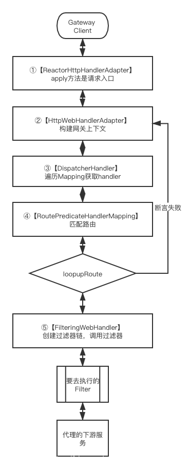

# GateWay

## 概述

### 基本概念

SpringCloud gateway是Spring Cloud生态体系的第二代网关，是基于Spring5.0、Spring Boot 2.0、Reactor等技术开发的网关。底层主要是两大核心:Spring web Filter chain和Spring WebFlux。

+ Filter ：Filter是一个Servlet规范组件；一个请求可以在Http请求到达Servlet前被一个或多个Filter处理，Servlet处理完后返回给Filter,最后返回给用户。
+ WebFlux：它是一个异步非阻塞式的web框架，它的作用不是提升接口请求时间，而是在一些阻塞的场景【例如请求DB，等待DB响应数据、打开大文件等】，可以把线程给其它请求使用，从而提升系统吞吐量。Gateway属于网络IO密集型【网关转发请求到下游服务】，通过WebFlux有效的提升网关转发的吞吐量。

### 其他

+ 路由(Route.java)：由一个id，一个目标uri，一组断言工厂和一组Filter组成
+ RouteDefinition：路由定义，是GatewayProperties类中的一个属性，网关启动后，Springboot帮我们做了映射，上述配置的路由就设置到了 GatewayProperties对象中。
+ 断言(AsyncPredicate)：java8中的断言函数，代码中的predicate属性
+ 过滤器：标准的Spring web Filter；SpringCloud Gateway中包含GlobalFilter和GatewayFilter。

~~~java
public class Route implements Ordered {

	private final String id;

	private final URI uri;

	private final int order;

	private final AsyncPredicate<ServerWebExchange> predicate;

	private final List<GatewayFilter> gatewayFilters;
	/**省略构造函数和get set方法/
}

~~~

+ ServerWebExchange：请求的信息都存储在ServerWebExchange中，在网关上的后续操作都是基于上下文操作的
+ GlobalFilter：全局拦截器，是所有被拦截到的http请求都要去做的处理；
+ GatewayFilter：面向开发人员的，因需适配，当我们需要给符合predicate的url做一些处理时通过配置就可添加

## 流程图

### 网关请求阶段

## 启动源码

### Pom.xml

~~~xml
<dependencies>
    <dependency>
      <groupId>org.springframework.cloud</groupId>
      <artifactId>spring-cloud-starter</artifactId>
      <version>2.2.0.RELEASE</version>
      <scope>compile</scope>
    </dependency>
    <dependency>
      <groupId>org.springframework.cloud</groupId>
      <artifactId>spring-cloud-gateway-core</artifactId>
      <version>2.2.0.RELEASE</version>
      <scope>compile</scope>
    </dependency>
    <dependency>
      <groupId>org.springframework.boot</groupId>
      <artifactId>spring-boot-starter-webflux</artifactId>
      <version>2.2.1.RELEASE</version>
      <scope>compile</scope>
    </dependency>
    <dependency>
      <groupId>org.springframework.cloud</groupId>
      <artifactId>spring-cloud-starter-loadbalancer</artifactId>
      <version>2.2.0.RELEASE</version>
      <scope>compile</scope>
      <optional>true</optional>
    </dependency>
  </dependencies>
~~~

### spring.factories

~~~plain
# Auto Configure
org.springframework.boot.autoconfigure.EnableAutoConfiguration=\
org.springframework.cloud.gateway.config.GatewayClassPathWarningAutoConfiguration,\
org.springframework.cloud.gateway.config.GatewayAutoConfiguration,\
org.springframework.cloud.gateway.config.GatewayCircuitBreakerAutoConfiguration,\
org.springframework.cloud.gateway.config.GatewayLoadBalancerClientAutoConfiguration,\
org.springframework.cloud.gateway.config.GatewayNoLoadBalancerClientAutoConfiguration,\
org.springframework.cloud.gateway.config.GatewayMetricsAutoConfiguration,\
org.springframework.cloud.gateway.config.GatewayRedisAutoConfiguration,\
org.springframework.cloud.gateway.discovery.GatewayDiscoveryClientAutoConfiguration,\
org.springframework.cloud.gateway.config.SimpleUrlHandlerMappingGlobalCorsAutoConfiguration,\
org.springframework.cloud.gateway.config.GatewayReactiveLoadBalancerClientAutoConfiguration

org.springframework.boot.env.EnvironmentPostProcessor=\
org.springframework.cloud.gateway.config.GatewayEnvironmentPostProcessor
~~~

### GatewayAutoConfiguration

1. 其中注入了许多bean

~~~java
@Configuration(proxyBeanMethods = false)
@ConditionalOnProperty(name = "spring.cloud.gateway.enabled", matchIfMissing = true)
@EnableConfigurationProperties
// 需要先找到 WebFluxAutoConfiguration 与 HttpHandlerAutoConfiguration
@AutoConfigureBefore({ HttpHandlerAutoConfiguration.class,
		WebFluxAutoConfiguration.class })
@AutoConfigureAfter({ GatewayLoadBalancerClientAutoConfiguration.class,
		GatewayClassPathWarningAutoConfiguration.class })
@ConditionalOnClass(DispatcherHandler.class)
public class GatewayAutoConfiguration {
    // 读取RouteDefinition做准备
    @Bean
	@Primary
	public RouteDefinitionLocator routeDefinitionLocator(
			List<RouteDefinitionLocator> routeDefinitionLocators) {
		return new CompositeRouteDefinitionLocator(
				Flux.fromIterable(routeDefinitionLocators));
    }
    
    // 加载所有的过滤器
    @Bean
	public FilteringWebHandler filteringWebHandler(List<GlobalFilter> globalFilters) {
		return new FilteringWebHandler(globalFilters);
	}
   
    // RouteDefinition初始化配置 
    @Bean
	public RouteLocator routeDefinitionRouteLocator(GatewayProperties properties,
			List<GatewayFilterFactory> gatewayFilters,
			List<RoutePredicateFactory> predicates,
			RouteDefinitionLocator routeDefinitionLocator,
			ConfigurationService configurationService) {
		return new RouteDefinitionRouteLocator(routeDefinitionLocator, predicates,
				gatewayFilters, properties, configurationService);
	}
}
~~~

### 初始化GlobalFilters

~~~java

public FilteringWebHandler(List<GlobalFilter> globalFilters) {
    this.globalFilters = loadFilters(globalFilters);
}

// 遍历所有 Filter
private static List<GatewayFilter> loadFilters(List<GlobalFilter> filters) {
    return filters.stream().map(filter -> {
        GatewayFilterAdapter gatewayFilter = new GatewayFilterAdapter(filter);
        if (filter instanceof Ordered) {
            int order = ((Ordered) filter).getOrder();
            return new OrderedGatewayFilter(gatewayFilter, order);
        }
        return gatewayFilter;
    }).collect(Collectors.toList());
}
~~~

### 初始化predicates，

~~~java
public RouteDefinitionRouteLocator(RouteDefinitionLocator routeDefinitionLocator,
                                   List<RoutePredicateFactory> predicates,
                                   List<GatewayFilterFactory> gatewayFilterFactories,
                                   GatewayProperties gatewayProperties,
                                   ConfigurationService configurationService) {
    this.routeDefinitionLocator = routeDefinitionLocator;
    this.configurationService = configurationService;
    initFactories(predicates);
    gatewayFilterFactories.forEach(
        factory -> this.gatewayFilterFactories.put(factory.name(), factory));
    this.gatewayProperties = gatewayProperties;
}
~~~

~~~java
private void initFactories(List<RoutePredicateFactory> predicates) {
    predicates.forEach(factory -> {
        String key = factory.name();
        if (this.predicates.containsKey(key)) {
            this.logger.warn("A RoutePredicateFactory named " + key
                             + " already exists, class: " + this.predicates.get(key)
                             + ". It will be overwritten.");
        }
        this.predicates.put(key, factory);
        if (logger.isInfoEnabled()) {
            logger.info("Loaded RoutePredicateFactory [" + key + "]");
        }
    });
}
~~~

### 初始化 getRoutes

~~~java
public Flux<Route> getRoutes() {
    //从RouteDefinitions转换为Route，转换过程在convertToRoute方法中实现
    return this.routeDefinitionLocator.getRouteDefinitions().map(this::convertToRoute)
        .map(route -> {
            if (logger.isDebugEnabled()) {
                logger.debug("RouteDefinition matched: " + route.getId());
            }
            return route;
        });
}
//RouteDefinition到Route的转换
private Route convertToRoute(RouteDefinition routeDefinition) {
    //从routeDefinition获取predicate
    AsyncPredicate<ServerWebExchange> predicate = combinePredicates(routeDefinition);
    //从routeDefinition获取gatewayFilters
    List<GatewayFilter> gatewayFilters = getFilters(routeDefinition);
    //构造Route
    return Route.async(routeDefinition).asyncPredicate(predicate)
        .replaceFilters(gatewayFilters).build();
}

~~~

### 初始化 gatewayFilters

~~~java
//获取GatewayFilters
private List<GatewayFilter> getFilters(RouteDefinition routeDefinition) {
    List<GatewayFilter> filters = new ArrayList<>();
    //如果默认filter不为空，则去加载
    if (!this.gatewayProperties.getDefaultFilters().isEmpty()) {
        filters.addAll(loadGatewayFilters(DEFAULT_FILTERS,
                                          this.gatewayProperties.getDefaultFilters()));
    }
    //如果Filter不为空，则
    if (!routeDefinition.getFilters().isEmpty()) {
        filters.addAll(loadGatewayFilters(routeDefinition.getId(),
                                          routeDefinition.getFilters()));
    }

    AnnotationAwareOrderComparator.sort(filters);
    return filters;
}

@SuppressWarnings("unchecked")
private List<GatewayFilter> loadGatewayFilters(String id,
                                               List<FilterDefinition> filterDefinitions) {
    List<GatewayFilter> filters = filterDefinitions.stream().map(definition -> {
        //从gatewayFilterFactories中根据key获取factory
        GatewayFilterFactory factory = this.gatewayFilterFactories
            .get(definition.getName());
        if (factory == null) {
            throw new IllegalArgumentException(
                "Unable to find GatewayFilterFactory with name "
                + definition.getName());
        }
        //获取definition设置的Filter值
        Map<String, String> args = definition.getArgs();
        if (logger.isDebugEnabled()) {
            logger.debug("RouteDefinition " + id + " applying filter " + args + " to "
                         + definition.getName());
        }

        Map<String, Object> properties = factory.shortcutType().normalize(args,
                                                                          factory, this.parser, this.beanFactory);
        //每一个工厂中都有一个静态内部类Config，目的是存储我们设置的Filter值
        Object configuration = factory.newConfig();
        //将后几个参数的信息绑定到configuration
        ConfigurationUtils.bind(configuration, properties,
                                factory.shortcutFieldPrefix(), definition.getName(), validator,
                                conversionService);
        //获得GatewayFilter
        GatewayFilter gatewayFilter = factory.apply(configuration);
        if (this.publisher != null) {
            this.publisher.publishEvent(new FilterArgsEvent(this, id, properties));
        }
        return gatewayFilter;
    }).collect(Collectors.toList());

    ArrayList<GatewayFilter> ordered = new ArrayList<>(filters.size());
    for (int i = 0; i < filters.size(); i++) {
        GatewayFilter gatewayFilter = filters.get(i);
        if (gatewayFilter instanceof Ordered) {
            ordered.add(gatewayFilter);
        }
        else {
            ordered.add(new OrderedGatewayFilter(gatewayFilter, i + 1));
        }
    }

    return ordered;
}
~~~

## 请求源码

### ReactorHttpHandlerAdapter#apply

请求到网关执行的入口

~~~java
public class ReactorHttpHandlerAdapter implements BiFunction<HttpServerRequest, HttpServerResponse, Mono<Void>> {
	public Mono<Void> apply(HttpServerRequest reactorRequest, HttpServerResponse reactorResponse) {
		NettyDataBufferFactory bufferFactory = new NettyDataBufferFactory(reactorResponse.alloc());
		try {
			//获取请求的request和response
			ReactorServerHttpRequest request = new ReactorServerHttpRequest(reactorRequest, bufferFactory);
			ServerHttpResponse response = new ReactorServerHttpResponse(reactorResponse, bufferFactory);

			if (request.getMethod() == HttpMethod.HEAD) {
				response = new HttpHeadResponseDecorator(response);
			}
			//给到HttpWebHandlerAdapter执行构建
			return this.httpHandler.handle(request, response)
					.doOnError(ex -> logger.trace(request.getLogPrefix() + "Failed to complete: " + ex.getMessage()))
					.doOnSuccess(aVoid -> logger.trace(request.getLogPrefix() + "Handling completed"));
		}
		catch (URISyntaxException ex) {
			if (logger.isDebugEnabled()) {
				logger.debug("Failed to get request URI: " + ex.getMessage());
			}
			reactorResponse.status(HttpResponseStatus.BAD_REQUEST);
			return Mono.empty();
		}
	}
}

~~~

### HttpWebHandlerAdapter#handle

构建网关上下文ServerWebExchange

~~~java
public class HttpWebHandlerAdapter extends WebHandlerDecorator implements HttpHandler {
	public Mono<Void> handle(ServerHttpRequest request, ServerHttpResponse response) {

		if (this.forwardedHeaderTransformer != null) {
			request = this.forwardedHeaderTransformer.apply(request);
		}
		//根据请求的request、response构建网关上下文
		ServerWebExchange exchange = createExchange(request, response);

		LogFormatUtils.traceDebug(logger, traceOn ->
				exchange.getLogPrefix() + formatRequest(exchange.getRequest()) +
						(traceOn ? ", headers=" + formatHeaders(exchange.getRequest().getHeaders()) : ""));

		return getDelegate().handle(exchange)
				.doOnSuccess(aVoid -> logResponse(exchange))
				.onErrorResume(ex -> handleUnresolvedError(exchange, ex))
				.then(Mono.defer(response::setComplete));
	}
}

~~~

### DispatcherHandler

用于Http请求处理器/控制器的中央分发处理器，把请求分发给已经注册的处理程序处理，DispatcherHandler遍历Mapping获取对应的handler，网关一共有6个handlerMapping【此处会找到RoutePredicateHandlerMapping，通过RoutePredicateHandlerMapping获取FilteringWebHandler，通过FilteringWebHandler获取】

~~~java
public class DispatcherHandler implements WebHandler, ApplicationContextAware {
	public Mono<Void> handle(ServerWebExchange exchange) {
		if (this.handlerMappings == null) {
			return createNotFoundError();
		}
		//遍历mapping获取handler
		return Flux.fromIterable(this.handlerMappings)
				.concatMap(mapping -> mapping.getHandler(exchange))
				.next()
				.switchIfEmpty(createNotFoundError())
				.flatMap(handler -> invokeHandler(exchange, handler))
				.flatMap(result -> handleResult(exchange, result));
	}
}

~~~

~~~java
public class RoutePredicateHandlerMapping extends AbstractHandlerMapping {

	private final FilteringWebHandler webHandler;

	private final RouteLocator routeLocator;

	private final Integer managementPort;

	private final ManagementPortType managementPortType;
	//网关启动时进行了初始化
	public RoutePredicateHandlerMapping(FilteringWebHandler webHandler,
			RouteLocator routeLocator, GlobalCorsProperties globalCorsProperties,
			Environment environment) {
		this.webHandler = webHandler;
		this.routeLocator = routeLocator;

		this.managementPort = getPortProperty(environment, "management.server.");
		this.managementPortType = getManagementPortType(environment);
		setOrder(1);
		setCorsConfigurations(globalCorsProperties.getCorsConfigurations());
	}

	protected Mono<?> getHandlerInternal(ServerWebExchange exchange) {
		// don't handle requests on management port if set and different than server port
		if (this.managementPortType == DIFFERENT && this.managementPort != null
				&& exchange.getRequest().getURI().getPort() == this.managementPort) {
			return Mono.empty();
		}
		exchange.getAttributes().put(GATEWAY_HANDLER_MAPPER_ATTR, getSimpleName());

		return lookupRoute(exchange)
				// .log("route-predicate-handler-mapping", Level.FINER) //name this
				.flatMap((Function<Route, Mono<?>>) r -> {
					exchange.getAttributes().remove(GATEWAY_PREDICATE_ROUTE_ATTR);
					if (logger.isDebugEnabled()) {
						logger.debug(
								"Mapping [" + getExchangeDesc(exchange) + "] to " + r);
					}

					exchange.getAttributes().put(GATEWAY_ROUTE_ATTR, r);
					//返回FilteringWebHandler
					return Mono.just(webHandler);
				}).switchIfEmpty(Mono.empty().then(Mono.fromRunnable(() -> {
					exchange.getAttributes().remove(GATEWAY_PREDICATE_ROUTE_ATTR);
					if (logger.isTraceEnabled()) {
						logger.trace("No RouteDefinition found for ["
								+ getExchangeDesc(exchange) + "]");
					}
				})));
	}
}

~~~

###  RoutePredicateHandlerMapping#lookupRoute

匹配路由，根据routeLocator获取我们在配置我文件中配置的Route，和当前请求的路由做匹配

~~~java
public class RoutePredicateHandlerMapping extends AbstractHandlerMapping {
	protected Mono<Route> lookupRoute(ServerWebExchange exchange) {
		//routeLocator获取我们在配置我文件中配置的Route
		return this.routeLocator.getRoutes()
				.concatMap(route -> Mono.just(route).filterWhen(r -> {
					exchange.getAttributes().put(GATEWAY_PREDICATE_ROUTE_ATTR, r.getId());
					//当前请求的路由做匹配
					return r.getPredicate().apply(exchange);
				})
						.doOnError(e -> logger.error(
								"Error applying predicate for route: " + route.getId(),
								e))
						.onErrorResume(e -> Mono.empty()))
				.next()
				.map(route -> {
					if (logger.isDebugEnabled()) {
						logger.debug("Route matched: " + route.getId());
					}
					validateRoute(route, exchange);
					return route;
				});
	}
}

~~~

### FilteringWebHandler

创建过滤器链，执行过滤器

~~~java
public class FilteringWebHandler implements WebHandler {
	//创建过滤器链
	public Mono<Void> handle(ServerWebExchange exchange) {
		Route route = exchange.getRequiredAttribute(GATEWAY_ROUTE_ATTR);
		List<GatewayFilter> gatewayFilters = route.getFilters();

		List<GatewayFilter> combined = new ArrayList<>(this.globalFilters);
		combined.addAll(gatewayFilters);
		AnnotationAwareOrderComparator.sort(combined);

		if (logger.isDebugEnabled()) {
			logger.debug("Sorted gatewayFilterFactories: " + combined);
		}

		return new DefaultGatewayFilterChain(combined).filter(exchange);
	}

	private static class DefaultGatewayFilterChain implements GatewayFilterChain {
		//调用过滤器
		public Mono<Void> filter(ServerWebExchange exchange) {
			return Mono.defer(() -> {
				if (this.index < filters.size()) {
					GatewayFilter filter = filters.get(this.index);
					DefaultGatewayFilterChain chain = new DefaultGatewayFilterChain(this,
							this.index + 1);
					//执行调用
					return filter.filter(exchange, chain);
				}
				else {
					return Mono.empty(); // complete
				}
			});
		}
	}
}

~~~

## 自定义Filter

### GlobalFilter

GlobalFilter具体的实现方式是实现接口，每个filter都实现了GlobalFilter接口

~~~java
public class GlobalTestFilter implements GlobalFilter, Ordered {

    @Override
    public Mono<Void> filter(ServerWebExchange exchange, GatewayFilterChain chain) {
        if("符合业务逻辑，处理完业务逻辑，继续执行下一个filter"){
            return chain.filter(exchange);
        }
        //不符合业务逻辑，直接返回
        return "按照不符合业务逻辑处理";
    }
}

~~~

### GatewayFilter

GatewayFilter具体的实现方式是工厂，每个工厂都继承了AbstractGatewayFilterFactory

~~~java
public class TestGatewayFilterFactory extends AbstractGatewayFilterFactory<TestGatewayFilterFactory.Config> {

    public TestGatewayFilterFactory() {
        super(TestGatewayFilterFactory.Config.class);
    }

    @Override
    public GatewayFilter apply(Config config) {
        return (exchange, chain) -> {
            if("符合条件，处理业务逻辑，继续执行下一个Filter"){
                return chain.filter(exchange);
            }
             // 不符合条件，直接返回
            return "false";
        };
    }

    public static class Config {

        private String businessAttributes;

        public String getBusinessAttributes() {
            return businessAttributes;
        }

        public void setBusinessAttributes(String businessAttributes) {
            this.businessAttributes = businessAttributes;
        }
    }
}

~~~

