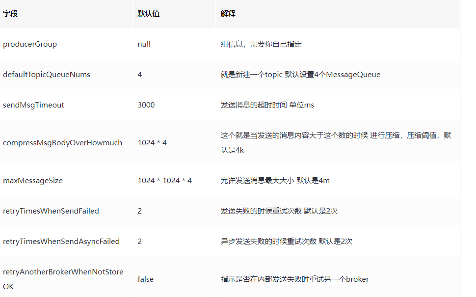
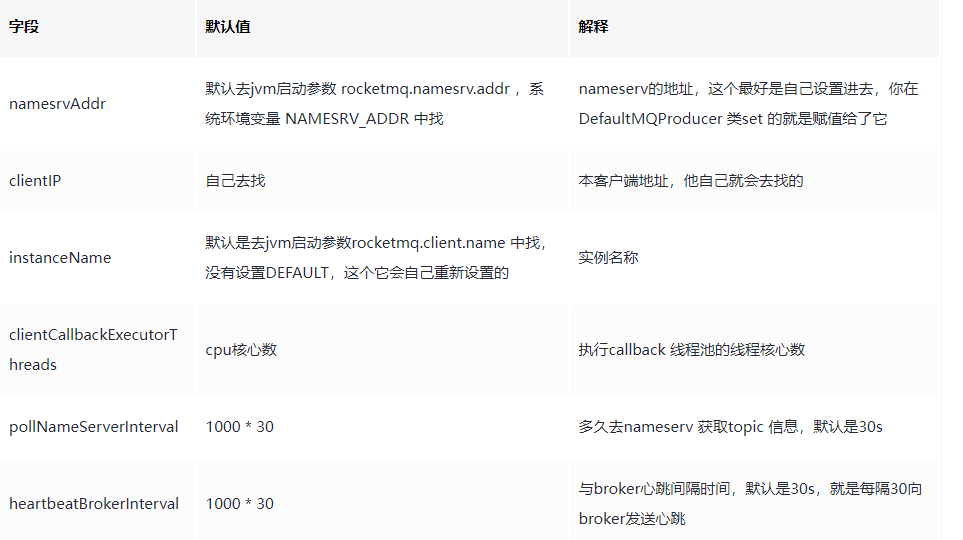
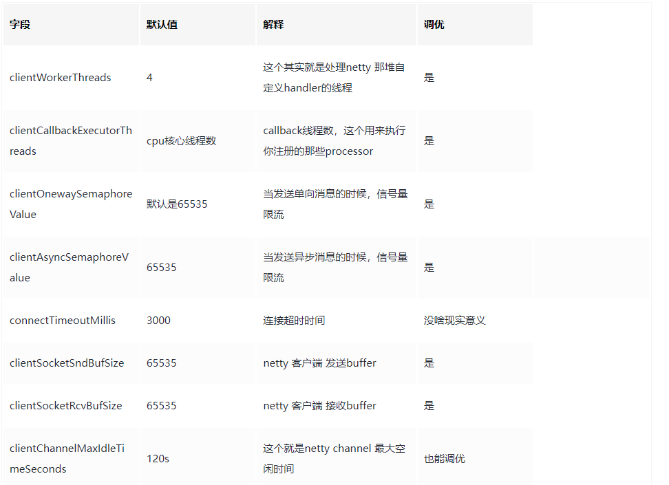
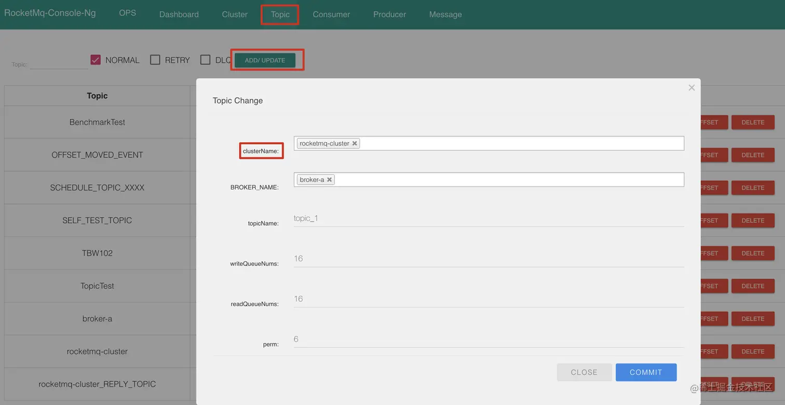

# RecoketMQ 源码

## 基本架构

+ Producer： 消息发布的角色，支持分布式集群方式部署，`Producer`通过`MQ`的负载均衡模块选择相应的`Broker`集群队列进行消息投递，投递的过程支持快速失败并且低延迟。
+ Consumer：消息消费的角色，支持分布式集群方式部署。支持以`push`推，`pull`拉两种模式对消息进行消费。同时也支持集群方式和广播方式的消费，它提供实时消息订阅机制，可以满足大多数用户的需求。
+ NameServer：`NameServer`是一个非常简单的`Topic`路由注册中心，其角色类似`Dubbo`中的`zookeeper`，支持`Broker`的动态注册与发现。主要包括两个功能：
  + `Broker`管理，`NameServer`接受`Broker`集群的注册信息并且保存下来作为路由信息的基本数据。然后提供心跳检测机制，检查`Broker`是否还存活；
  + 路由信息管理，每个`NameServer`将保存关于`Broker`集群的整个路由信息和用于客户端查询的队列信息。然后`Producer`和`Conumser`通过`NameServer`就可以知道整个`Broker`集群的路由信息，从而进行消息的投递和消费。
+ `BrokerServer`：`Broker`主要负责消息的存储、投递和查询以及服务高可用保证，为了实现这些功能，`Broker`包含了以下几个重要子模块：
  + `Client Manager`：负责管理客户端(`Producer`/`Consumer`)和维护`Consumer`的`Topic`订阅信息
  + `Store Service`：提供方便简单的API接口处理消息存储到物理硬盘和查询功能。
  + `HA Service`：高可用服务，提供`Master Broker` 和 `Slave Broker`之间的数据同步功能。
  + Index Service`：根据特定的`Message key`对投递到`Broker`的消息进行索引服务，以提供消息的快速查询。

## NameServer 启动

### 概述

NameServer是一个非常简单的`Topic`路由注册中心，其角色类似`Dubbo`中的`zookeeper`，支持`Broker`的动态注册与发现。主要包括两个功能：

- `Broker`管理，`NameServer`接受`Broker`集群的注册信息并且保存下来作为路由信息的基本数据。然后提供心跳检测机制，检查`Broker`是否还存活；
- 路由信息管理，每个`NameServer`将保存关于`Broker`集群的整个路由信息和用于客户端查询的队列信息。然后`Producer`和`Conumser`通过`NameServer`就可以知道整个`Broker`集群的路由信息，从而进行消息的投递和消费。

### 工作流程

Broker启动的时候会向所有的`NameServer`注册，生产者在发送消息时会先从NameServer中获取Broker消息服务器的地址列表，根据负载均衡算法选取一台Broker消息服务器发送消息。NameServer与每台Broker之间保持着长连接，并且每隔10秒会检查Broker是否存活，如果检测到Broker超过120秒未发送心跳，则从路由注册表中将该Broker移除。

但是路由的变化`不会马上通知消息生产`者，这是为了`降低NameServe的复杂性`，所以在RocketMQ中需要消息的`发送端提供容错机制来保证消息发送的高可用性`，

### 主方法

`NameServer`位于`RocketMq`项目的`namesrv`模块下，主类是`org.apache.rocketmq.namesrv.NamesrvStartup`，代码如下：

~~~java
public static NamesrvController createNamesrvController(String[] args) 
        throws IOException, JoranException {
    // 省略解析命令行代码
    ...

    // nameServer的相关配置
    final NamesrvConfig namesrvConfig = new NamesrvConfig();
    //  nettyServer的相关配置
    final NettyServerConfig nettyServerConfig = new NettyServerConfig();
    // 端口写死了。。。
    nettyServerConfig.setListenPort(9876);
    if (commandLine.hasOption('c')) {
        // 处理配置文件
        String file = commandLine.getOptionValue('c');
        if (file != null) {
            // 读取配置文件，并将其加载到 properties 中
            InputStream in = new BufferedInputStream(new FileInputStream(file));
            properties = new Properties();
            properties.load(in);
            // 将 properties 里的属性赋值到 namesrvConfig 与 nettyServerConfig
            MixAll.properties2Object(properties, namesrvConfig);
            MixAll.properties2Object(properties, nettyServerConfig);

            namesrvConfig.setConfigStorePath(file);

            System.out.printf("load config properties file OK, %s%n", file);
            in.close();
        }
    }

    // 处理 -p 参数，该参数用于打印nameServer、nettyServer配置，省略
    ...

    // 将 commandLine 的所有配置设置到 namesrvConfig 中
    MixAll.properties2Object(ServerUtil.commandLine2Properties(commandLine), namesrvConfig);
    // 检查环境变量：ROCKETMQ_HOME
    if (null == namesrvConfig.getRocketmqHome()) {
        // 如果不设置 ROCKETMQ_HOME，就会在这里报错
        System.out.printf("Please set the %s variable in your environment to match 
                the location of the RocketMQ installation%n", MixAll.ROCKETMQ_HOME_ENV);
        System.exit(-2);
    }

    // 省略日志配置
    ...

    // 创建一个controller
    final NamesrvController controller = 
            new NamesrvController(namesrvConfig, nettyServerConfig);

    // 将当前 properties 合并到项目的配置中，并且当前 properties 会覆盖项目中的配置
    controller.getConfiguration().registerConfig(properties);

    return controller;
}
~~~

这个方法有点长，不过所做的事就两件：

1. 处理配置
2. 创建`NamesrvController`实例

#### 处理配置

咱们先简单地看下配置的处理。在我们启动项目中，可以使用`-c /xxx/xxx.conf`指定配置文件的位置，然后在`createNamesrvController(...)`方法中，通过如下代码

~~~java
InputStream in = new BufferedInputStream(new FileInputStream(file));
properties = new Properties();
properties.load(in);
~~~

将配置文件的内容加载到`properties`对象中，然后调用`MixAll.properties2Object(properties, namesrvConfig)`方法将`properties`的属性赋值给`namesrvConfig`，``MixAll.properties2Object(...)`代码如下：

~~~java

public static void properties2Object(final Properties p, final Object object) {
    Method[] methods = object.getClass().getMethods();
    for (Method method : methods) {
        String mn = method.getName();
        if (mn.startsWith("set")) {
            try {
                String tmp = mn.substring(4);
                String first = mn.substring(3, 4);
                // 首字母小写
                String key = first.toLowerCase() + tmp;
                // 从Properties中获取对应的值
                String property = p.getProperty(key);
                if (property != null) {
                    // 获取值，并进行相应的类型转换
                    Class<?>[] pt = method.getParameterTypes();
                    if (pt != null && pt.length > 0) {
                        String cn = pt[0].getSimpleName();
                        Object arg = null;
                        // 转换成int
                        if (cn.equals("int") || cn.equals("Integer")) {
                            arg = Integer.parseInt(property);
                        // 其他类型如long,double,float,boolean都是这样转换的，这里就省略了    
                        } else if (...) {
                            ...
                        } else {
                            continue;
                        }
                        // 反射调用
                        method.invoke(object, arg);
                    }
                }
            } catch (Throwable ignored) {
            }
        }
    }
}
~~~

这个方法非常简单:

1. 先获取到`object`中的所有`setXxx(...)`方法
2. 得到`setXxx(...)`中的`Xxx`
3. 首字母小写得到`xxx`
4. 从`properties`获取`xxx`属性对应的值，并根据`setXxx(...)`方法的参数类型进行转换
5. 反射调用`setXxx(...)`方法进行赋值

这里之后，`namesrvConfig`与`nettyServerConfig`就赋值成功了。

#### 创建`NamesrvController`实例

我们再来看看`createNamesrvController(...)`方法的第二个重要功能：创建`NamesrvController`实例.

创建`NamesrvController`实例的代码如下：

~~~java
final NamesrvController controller = new NamesrvController(namesrvConfig, nettyServerConfig);
~~~

我们直接进入`NamesrvController`的构造方法：

~~~java
/**
 * 构造方法，一系列的赋值操作
 */
public NamesrvController(NamesrvConfig namesrvConfig, NettyServerConfig nettyServerConfig) {
    this.namesrvConfig = namesrvConfig;
    this.nettyServerConfig = nettyServerConfig;
    this.kvConfigManager = new KVConfigManager(this);
    this.routeInfoManager = new RouteInfoManager();
    this.brokerHousekeepingService = new BrokerHousekeepingService(this);
    this.configuration = new Configuration(log, this.namesrvConfig, this.nettyServerConfig);
    this.configuration.setStorePathFromConfig(this.namesrvConfig, "configStorePath");
}
~~~

构造方法里只是一系列的赋值操作，没做什么实质性的工作，就先不管了。

#### 启动`nameServer`：`NamesrvStartup#start`

让我们回到一开始的`NamesrvStartup#main0`方法，

~~~java
public static NamesrvController main0(String[] args) {

    try {
        NamesrvController controller = createNamesrvController(args);
        start(controller);
        ...
    } catch (Throwable e) {
        e.printStackTrace();
        System.exit(-1);
    }

    return null;
}

~~~


接下来我们来看看`start(controller)`方法中做了什么，进入`NamesrvStartup#start`方法：


~~~java
public static NamesrvController start(final NamesrvController controller) throws Exception {
    if (null == controller) {
        throw new IllegalArgumentException("NamesrvController is null");
    }
    // 初始化
    boolean initResult = controller.initialize();
    if (!initResult) {
        controller.shutdown();
        System.exit(-3);
    }
    // 关闭钩子，可以在关闭前进行一些操作
    Runtime.getRuntime().addShutdownHook(new ShutdownHookThread(log, new Callable<Void>() {
        @Override
        public Void call() throws Exception {
            controller.shutdown();
            return null;
        }
    }));
    // 启动
    controller.start();

    return controller;
}

~~~

`start(...)`方法的逻辑也十分简洁，主要包含3个操作：

1. 初始化，想必是做一些启动前的操作
2. 添加关闭钩子，所谓的关闭钩子，可以理解为一个线程，可以用来监听jvm的关闭事件，在jvm真正关闭前，可以进行一些处理操作，这里的关闭前的处理操作就是`controller.shutdown()`方法所做的事了，所做的事也很容易想到，无非就是关闭线程池、关闭已经打开的资源等，这里我们就不深究了
3. 启动操作，这应该就是真正启动`nameServer`服务了

接下来我们主要来探索初始化与启动操作流程。

#### 初始化：`NamesrvController#initialize`

初始化的处理方法是`NamesrvController#initialize`，代码如下：

~~~java
public boolean initialize() {
    // 加载 kv 配置
    this.kvConfigManager.load();
    // 创建 netty 远程服务
    this.remotingServer = new NettyRemotingServer(this.nettyServerConfig, 
            this.brokerHousekeepingService);
    // netty 远程服务线程
    this.remotingExecutor = Executors.newFixedThreadPool(
            nettyServerConfig.getServerWorkerThreads(), 
            new ThreadFactoryImpl("RemotingExecutorThread_"));
    // 注册，就是把 remotingExecutor 注册到 remotingServer
    this.registerProcessor();

    // 开启定时任务，每隔10s扫描一次broker，移除不活跃的broker
    this.scheduledExecutorService.scheduleAtFixedRate(new Runnable() {
        @Override
        public void run() {
            NamesrvController.this.routeInfoManager.scanNotActiveBroker();
        }
    }, 5, 10, TimeUnit.SECONDS);

    // 省略打印kv配置的定时任务
    ...

    // Tls安全传输，我们不关注
    if (TlsSystemConfig.tlsMode != TlsMode.DISABLED) {
        ...
    }

    return true;
}
~~~

这个方法所做的事很明了，代码中都已经注释了，代码看着多，实际干的就两件事：

1. 处理netty相关：创建远程服务与工作线程
2. 开启定时任务：移除不活跃的broker

什么是`NettyRemotingServer`呢？在本文开篇介绍`NamerServer`的功能时，提到`NameServer`是一个简单的注册中心，这个`NettyRemotingServer`就是对外开放的入口，用来接收`broker`的注册消息的，当然还会处理一些其他消息，我们后面会分析到。

#####  创建`NettyRemotingServer`

我们先来看看`NettyRemotingServer`的创建过程：

~~~java
public NettyRemotingServer(final NettyServerConfig nettyServerConfig,
        final ChannelEventListener channelEventListener) {
    super(nettyServerConfig.getServerOnewaySemaphoreValue(), 
            nettyServerConfig.getServerAsyncSemaphoreValue());
    this.serverBootstrap = new ServerBootstrap();
    this.nettyServerConfig = nettyServerConfig;
    this.channelEventListener = channelEventListener;

    int publicThreadNums = nettyServerConfig.getServerCallbackExecutorThreads();
    if (publicThreadNums <= 0) {
        publicThreadNums = 4;
    }

    // 创建 publicExecutor
    this.publicExecutor = Executors.newFixedThreadPool(publicThreadNums, new ThreadFactory() {
        private AtomicInteger threadIndex = new AtomicInteger(0);
        @Override
        public Thread newThread(Runnable r) {
            return new Thread(r, "NettyServerPublicExecutor_" 
                    + this.threadIndex.incrementAndGet());
        }
    });

    // 判断是否使用 epoll
    if (useEpoll()) {
        // boss
        this.eventLoopGroupBoss = new EpollEventLoopGroup(1, new ThreadFactory() {
            private AtomicInteger threadIndex = new AtomicInteger(0);
            @Override
            public Thread newThread(Runnable r) {
                return new Thread(r, String.format("NettyEPOLLBoss_%d", 
                    this.threadIndex.incrementAndGet()));
            }
        });
        // worker
        this.eventLoopGroupSelector = new EpollEventLoopGroup(
                nettyServerConfig.getServerSelectorThreads(), new ThreadFactory() {
            private AtomicInteger threadIndex = new AtomicInteger(0);
            private int threadTotal = nettyServerConfig.getServerSelectorThreads();

            @Override
            public Thread newThread(Runnable r) {
                return new Thread(r, String.format("NettyServerEPOLLSelector_%d_%d", 
                    threadTotal, this.threadIndex.incrementAndGet()));
            }
        });
    } else {
        // 这里也是创建了两个线程
        ...
    }
    // 加载ssl上下文
    loadSslContext();
}

~~~

整个方法下来，其实就是做了一些赋值操作，我们挑重点讲:

1. `serverBootstrap`：熟悉netty的小伙伴应该对这个很熟悉了，这个就是netty服务端的启动类
2. `publicExecutor`：这里创建了一个名为`publicExecutor`线程池，暂时并不知道这个线程有啥作用，先混个脸熟吧
3. `eventLoopGroupBoss`与`eventLoopGroupSelector`线程组：熟悉netty的小伙伴应该对这两个线程很熟悉了，这就是netty用来处理连接事件与读写事件的线程了，`eventLoopGroupBoss`对应的是netty的`boss`线程组，`eventLoopGroupSelector`对应的是`worker`线程组

到这里，netty服务的准备工作本完成了。

##### 创建netty服务线程池

让我们再回到`NamesrvController#initialize`方法，`NettyRemotingServer`创建完成后，接着就是netty远程服务线程池了：

~~~java
this.remotingExecutor = Executors.newFixedThreadPool(
    nettyServerConfig.getServerWorkerThreads(), 
    new ThreadFactoryImpl("RemotingExecutorThread_"));
~~~

创建完成线程池后，接着就是注册了，也就是`registerProcessor`方法所做的工作：

~~~java
this.registerProcessor();
~~~

在`registerProcessor()`中 ，会把当前的 `NamesrvController` 注册到 `remotingServer`中：

~~~java
private void registerProcessor() {
    if (namesrvConfig.isClusterTest()) {
        this.remotingServer.registerDefaultProcessor(
            new ClusterTestRequestProcessor(this, namesrvConfig.getProductEnvName()),
            this.remotingExecutor);
    } else {
        // 注册操作
        this.remotingServer.registerDefaultProcessor(
            new DefaultRequestProcessor(this), this.remotingExecutor);
    }
}
~~~

最终注册到为`NettyRemotingServer`的`defaultRequestProcessor`属性：

~~~java
@Override
public void registerDefaultProcessor(NettyRequestProcessor processor, ExecutorService executor) {
    this.defaultRequestProcessor 
            = new Pair<NettyRequestProcessor, ExecutorService>(processor, executor);
}
~~~

好了，到这里`NettyRemotingServer`相关的配置就准备完成了，这个过程中一共准备了4个线程池：

1. `publicExecutor`：暂时不知道做啥的，后面遇到了再分析
2. `eventLoopGroupBoss`：处理netty连接事件的线程组
3. `eventLoopGroupSelector`：处理netty读写事件的线程池
4. `remotingExecutor`：暂时不知道做啥的，后面遇到了再分析

##### 创建定时任务

准备完netty相关配置后，接着代码中启动了一个定时任务：

~~~java
this.scheduledExecutorService.scheduleAtFixedRate(new Runnable() {
    @Override
    public void run() {
        NamesrvController.this.routeInfoManager.scanNotActiveBroker();
    }
}, 5, 10, TimeUnit.SECONDS);
~~~

这个定时任务位于`NamesrvController#initialize`方法中，每10s执行一次，任务内容由`RouteInfoManager#scanNotActiveBroker`提供，它所做的主要工作是监听`broker`的上报信息，及时移除不活跃的`broker`，关于源码的具体分析，我们后面再详细分析。


#### 启动：`NamesrvController#start`

分析完`NamesrvController`的初始化流程后，让我们回到`NamesrvStartup#start`方法：

~~~java
public static NamesrvController start(final NamesrvController controller) throws Exception {

    ...
    
    // 启动
    controller.start();

    return controller;
}

~~~

接下来，我们来看看`NamesrvController`的启动流程：

~~~java
public void start() throws Exception {
    // 启动nettyServer
    this.remotingServer.start();
    // 监听tls配置文件的变化，不关注
    if (this.fileWatchService != null) {
        this.fileWatchService.start();
    }
}
~~~

这个方法主要调用了`NettyRemotingServer#start`，我们跟进去：

~~~java
public void start() {
    ...

    ServerBootstrap childHandler =
        // 在 NettyRemotingServer#init 中准备的两个线程组
        this.serverBootstrap.group(this.eventLoopGroupBoss, this.eventLoopGroupSelector)
            .channel(useEpoll() ? EpollServerSocketChannel.class : NioServerSocketChannel.class)

            // 省略 option(...)与childOption(...)方法的配置
            ...
            // 绑定ip与端口
            .localAddress(new InetSocketAddress(this.nettyServerConfig.getListenPort()))
            .childHandler(new ChannelInitializer<SocketChannel>() {
                @Override
                public void initChannel(SocketChannel ch) throws Exception {
                    ch.pipeline()
                        .addLast(defaultEventExecutorGroup, 
                            HANDSHAKE_HANDLER_NAME, handshakeHandler)
                        .addLast(defaultEventExecutorGroup,
                            encoder,
                            new NettyDecoder(),
                            new IdleStateHandler(0, 0, 
                                nettyServerConfig.getServerChannelMaxIdleTimeSeconds()),
                            connectionManageHandler,
                            serverHandler
                        );
                }
            });

    if (nettyServerConfig.isServerPooledByteBufAllocatorEnable()) {
        childHandler.childOption(ChannelOption.ALLOCATOR, PooledByteBufAllocator.DEFAULT);
    }

    try {
        ChannelFuture sync = this.serverBootstrap.bind().sync();
        InetSocketAddress addr = (InetSocketAddress) sync.channel().localAddress();
        this.port = addr.getPort();
    } catch (InterruptedException e1) {
        throw new RuntimeException("this.serverBootstrap.bind().sync() InterruptedException", e1);
    }

    ...
}

~~~

这个方法中，主要处理了`NettyRemotingServer`的启动，关于其他一些操作并非我们关注的重点，就先忽略了。

可以看到，这个方法里就是处理了一个`netty`的启动流程，关于`netty`的相关操作，非本文重点，这里就不多作说明了。这里需要指出的是，在netty中，如果`Channel`是出现了`连接/读/写`等事件，这些事件会经过`Pipeline`上的`ChannelHandler`上进行流转，`NettyRemotingServer`添加的`ChannelHandler`如下：

~~~java
ch.pipeline()
    .addLast(defaultEventExecutorGroup, 
        HANDSHAKE_HANDLER_NAME, handshakeHandler)
    .addLast(defaultEventExecutorGroup,
        encoder,
        new NettyDecoder(),
        new IdleStateHandler(0, 0, 
            nettyServerConfig.getServerChannelMaxIdleTimeSeconds()),
        connectionManageHandler,
        serverHandler
    );

~~~

这些`ChannelHandler`只要分为几类：

1. `handshakeHandler`：处理握手操作，用来判断tls的开启状态
2. `encoder`/`NettyDecoder`：处理报文的编解码操作
3. `IdleStateHandler`：处理心跳
4. `connectionManageHandler`：处理连接请求
5. `serverHandler`：处理读写请求

这里我们重点关注的是`serverHandler`，这个`ChannelHandler`就是用来处理`broker`注册消息、`producer`/`consumer`获取topic消息的，这也是我们接下来要分析的重点。

执行完`NamesrvController#start`，`NameServer`就可以对外提供连接服务了。


### 总结

本文主要分析了`NameServer`的启动流程，整个启动流程分为3步：

1. 创建`controller`：这一步主要是解析`nameServer`的配置并完成赋值操作
2. 初始化`controller`：主要创建了`NettyRemotingServer`对象、`netty`服务线程池、定时任务
3. 启动`controller`：就是启动`netty` 服务

好了，本文的分析就到这里了，下篇文章我们继续分析`NameServer`。

## NameServer 消息处理

### 处理业务请求的`ChannelHandler`#serverHandler

`NamesrvController`启动后，就可以处理`Broker/Producer/Consumer`的请求消息了，处理该类型消息的`ChannelHandler`为`serverHandler`，也就是`NettyRemotingServer.NettyServerHandler`（`NettyServerHandler`是`NettyRemotingServer`的内部类），代码如下：

```java
    @ChannelHandler.Sharable
    class NettyServerHandler extends SimpleChannelInboundHandler<RemotingCommand> {
        @Override
        protected void channelRead0(ChannelHandlerContext ctx, RemotingCommand msg) throws Exception {
            processMessageReceived(ctx, msg);
        }
    }
```

### `NettyRemotingAbstract#processMessageReceived`

~~~java
public void processMessageReceived(ChannelHandlerContext ctx, RemotingCommand msg) throws Exception {
    final RemotingCommand cmd = msg;
    if (cmd != null) {
        switch (cmd.getType()) {
            // 请求消息
            case REQUEST_COMMAND:
                // todo
                processRequestCommand(ctx, cmd);
                break;
            // 响应消息
            case RESPONSE_COMMAND:
                // todo
                processResponseCommand(ctx, cmd);
                break;
            default:
                break;
        }
    }
}
~~~

### `REQUEST_COMMAND`命令的处理方法

```java
public void processRequestCommand(final ChannelHandlerContext ctx, final RemotingCommand cmd) {
    // 根据 code 从 processorTable 获取 Pair
    final Pair<NettyRequestProcessor, ExecutorService> matched = this.processorTable.get(cmd.getCode());
    // 找不到默认值
    final Pair<NettyRequestProcessor, ExecutorService> pair = null == matched ? this.defaultRequestProcessor : matched;
    final int opaque = cmd.getOpaque();

    if (pair != null) {
        Runnable run = new Runnable() {
            @Override
            public void run() {
                try {
                    doBeforeRpcHooks(RemotingHelper.parseChannelRemoteAddr(ctx.channel()), cmd);
                    final RemotingResponseCallback callback = new RemotingResponseCallback() {
                        @Override
                        public void callback(RemotingCommand response) {
                            doAfterRpcHooks(RemotingHelper.parseChannelRemoteAddr(ctx.channel()), cmd, response);
                            // 不是 单向
                            if (!cmd.isOnewayRPC()) {
                                if (response != null) {
                                    response.setOpaque(opaque);
                                    response.markResponseType();
                                    try {
                                        ctx.writeAndFlush(response);
                                    } catch (Throwable e) {
                                        log.error("process request over, but response failed", e);
                                        log.error(cmd.toString());
                                        log.error(response.toString());
                                    }
                                } else {
                                }
                            }
                        }
                    };
                    // 异步netty请求处理器
                    if (pair.getObject1() instanceof AsyncNettyRequestProcessor) {
                        AsyncNettyRequestProcessor processor = (AsyncNettyRequestProcessor)pair.getObject1();
                        processor.asyncProcessRequest(ctx, cmd, callback);
                    } else {
                        // 不是 异步请求处理器 从 pair 中拿到 Processor 进行处理
                        NettyRequestProcessor processor = pair.getObject1();
                        // todo 处理请求
                        RemotingCommand response = processor.processRequest(ctx, cmd);
                        callback.callback(response);
                    }
                } 
                ...
            }
        };

        if (pair.getObject1().rejectRequest()) {
            final RemotingCommand response = RemotingCommand.createResponseCommand(RemotingSysResponseCode.SYSTEM_BUSY,
                "[REJECTREQUEST]system busy, start flow control for a while");
            response.setOpaque(opaque);
            ctx.writeAndFlush(response);
            return;
        }

        try {
            final RequestTask requestTask = new RequestTask(run, ctx.channel(), cmd);
            pair.getObject2().submit(requestTask);
        } catch (RejectedExecutionException e) {
           ...
        }
    } else {
        ...
    }
}
```

这个方法主要流程为，先获取`Pair`对象，然后将处理操作封装为`Runnable`对象，接着把`Runnable`对象提交到线程池中。

这个`Pair`对象是啥呢？还记得我们在`NamesrvController#initialize`方法中创建的`remotingExecutor`吗，它最终注册到为`NettyRemotingServer`的`defaultRequestProcessor`属性：

~~~java
@Override
public void registerDefaultProcessor(NettyRequestProcessor processor, ExecutorService executor) {
    this.defaultRequestProcessor 
            = new Pair<NettyRequestProcessor, ExecutorService>(processor, executor);
}
~~~

这里获取的`Pair`对象正是`defaultRequestProcessor`，`pair.getObject2()`得到的线程池正是`remotingExecutor`，`pair.getObject1()`得到的`processor`是`DefaultRequestProcessor`.

这里我们就明白了，`remotingExecutor`线程池就是用来处理远程请求的。远程命令的处理逻辑在`Runnable#run`方法中：

~~~java
public void run() {
    try {
        doBeforeRpcHooks(RemotingHelper.parseChannelRemoteAddr(ctx.channel()), cmd);
        ...
        // 处理请求
        if (pair.getObject1() instanceof AsyncNettyRequestProcessor) {
            AsyncNettyRequestProcessor processor = 
                    (AsyncNettyRequestProcessor)pair.getObject1();
            processor.asyncProcessRequest(ctx, cmd, callback);
        } else {
            NettyRequestProcessor processor = pair.getObject1();
            // 处理请求
            RemotingCommand response = processor.processRequest(ctx, cmd);
            callback.callback(response);
        }
    } catch (Throwable e) {
        ...
    }
}
~~~

代码中区分了同步与异步请求两种方式，实际上最终都会进入到`DefaultRequestProcessor#processRequest`方法中：

~~~java
public RemotingCommand processRequest(ChannelHandlerContext ctx,
        RemotingCommand request) throws RemotingCommandException {

    ...

    switch (request.getCode()) {
        ..
        // 操作kv 配置信息
        case RequestCode.PUT_KV_CONFIG:
            return this.putKVConfig(ctx, request);
        case RequestCode.GET_KV_CONFIG:
            return this.getKVConfig(ctx, request);
        case RequestCode.DELETE_KV_CONFIG:
            return this.deleteKVConfig(ctx, request);
        // todo 查询broker版本信息
        case RequestCode.QUERY_DATA_VERSION:
            return queryBrokerTopicConfig(ctx, request);
            // todo 注册broker
        case RequestCode.REGISTER_BROKER:
            // 获取版本
            Version brokerVersion = MQVersion.value2Version(request.getVersion());
            // 做版本兼容
            // 大于等于V3_0_11
            if (brokerVersion.ordinal() >= MQVersion.Version.V3_0_11.ordinal()) {
                // todo
                return this.registerBrokerWithFilterServer(ctx, request);
            } else {
                return this.registerBroker(ctx, request);
            }
            // todo 注销broker
        case RequestCode.UNREGISTER_BROKER:
            return this.unregisterBroker(ctx, request);

        // todo 根据topic获取路由信息
        case RequestCode.GET_ROUTEINFO_BY_TOPIC:
            return this.getRouteInfoByTopic(ctx, request);
        // 省略其他消息的处理    
        ...
        default:
            break;
    }
    return null;
}

~~~

这个方法就是用来处理网络请求的，处理的请求消息会比较多，这里我们仅关注以下类型的消息：

- 获取`broker`版本信息：请求`code`为`QUERY_DATA_VERSION`，用来查询`broker`的版本信息
- `broker`注册：请求`code`为`REGISTER_BROKER`，`broker`启动时，会将自己的信息注册到`nameServer`
- `broker`注销：请求`code`为`UNREGISTER_BROKER`，`broker`停止前，会发消息告诉`nameServer`自己将要关闭
- 获取`topic`路由信息：根据 `topic` 获取路由信息，其实就是`topic`对应的`broker`、`messageQueue`信息

接下来我们就分析来介绍下这几种消息的实现。

#### `broker`的注册与注销消息

在`broker`启动时，会向`NamerServer`发送注册消息；在`broker`关闭前，会向`NameServer`发送关闭消息。

我们先来看注册消息，处理`broker`注册消息的方法为`DefaultRequestProcessor#registerBrokerWithFilterServer`，我们直接看重要代码：

~~~java
public RemotingCommand registerBrokerWithFilterServer(ChannelHandlerContext ctx, 
        RemotingCommand request) throws RemotingCommandException {
    ...

    // 处理注册
    RegisterBrokerResult result = this.namesrvController.getRouteInfoManager().registerBroker(
        requestHeader.getClusterName(),
        requestHeader.getBrokerAddr(),
        requestHeader.getBrokerName(),
        requestHeader.getBrokerId(),
        requestHeader.getHaServerAddr(),
        registerBrokerBody.getTopicConfigSerializeWrapper(),
        registerBrokerBody.getFilterServerList(),
        ctx.channel());
    ...
}

~~~

这里我们去除了不必要的代码，仅保留了注册的方法，这里调用的是`RouteInfoManager#registerBroker`方法，在分析这个方法前，我们先来了解下`RouteInfoManager`的基本信息，它的几个重要成员变量如下：

~~~java
public class RouteInfoManager {
    ...
    private final ReadWriteLock lock = new ReentrantReadWriteLock();
    // todo topic -> queuedata  topic消息队列的路由信息，消息发送时根据路由表进行负载均衡。
    private final HashMap<String/* topic */, List<QueueData>> topicQueueTable;
    // todo broker名称 -> broker信息  Broker基础信息，包含brokerName、所属集群名称、主备Broker地址
    private final HashMap<String/* brokerName */, BrokerData> brokerAddrTable;
    // todo 集群名字 -> broker名称 Broker集群信息，存储集群中所有Broker的名称
    private final HashMap<String/* clusterName */, Set<String/* brokerName */>> clusterAddrTable;
    // todo broker地址-> broker活跃信息  Broker状态信息，NameServer每次收到心跳包时会替换该信息。
    private final HashMap<String/* brokerAddr */, BrokerLiveInfo> brokerLiveTable;
    // todo broker地址 -> 一堆过滤器 Broker上的FilterServer列表，用于类模式消息过滤。
    //  类模式过滤机制在4.4及以后版本被废弃
    private final HashMap<String/* brokerAddr */, List<String>/* Filter Server */> filterServerTable;
}

~~~

前面提到过`NameServer`是一个非常简单的`Topic`路由注册中心，这个`HashMap`就是`NameServer`实现注册中心的关键！

1. `topicQueueTable`：存放保存`topic`与`Queue`的关系，`value`类型为`List`，表明一个`topic`可以有多个`queue`，`QueueData`的成员变量如下：

~~~java
public class QueueData implements Comparable<QueueData> {
 // 所在的 borker 的名称   
 private String brokerName;
 // 读写数
 private int readQueueNums;
 private int writeQueueNums;
 private int perm;
 private int topicSynFlag;
 ...
}
~~~

2. `brokerAddrTable`：记录`broker`的具体信息，`key`为`broker`名称，`value`为`broker`具体信息，`BrokerData`的成员变量如下：

~~~java
public class BrokerData implements Comparable<BrokerData> {
 // 所在集群的名称   
 private String cluster;
 // broker名称
 private String brokerName;
 // borkerId对应的服务器地址，一个brokerName可以有多个broker服务器
 private HashMap<Long, String> brokerAddrs;
}
~~~

3. `clusterAddrTable`：集群信息，保存集群名称对应的`brokerName`
4. `brokerLiveTable`：存活的`broker`信息，`key`为`broker`地址，`value`为具体的`broker`服务器，`BrokerLiveInfo`的成员变量如下：

~~~java
class BrokerLiveInfo {
 // 上一次心跳更新时间
 private long lastUpdateTimestamp;
 private DataVersion dataVersion;
 // 表示网络连接的channel，由netty提供
 private Channel channel;
 // 高可用的服务地址
 private String haServerAddr;
 ...
}
~~~

了解完成这些后，再回过头来看`RouteInfoManager#registerBroker`方法，我们就会发现所谓的注册就是往以上几个`HashMap`中`put`数据的操作:

~~~java
public RegisterBrokerResult registerBroker(
    final String clusterName,
    final String brokerAddr,
    final String brokerName,
    final long brokerId,
    final String haServerAddr,
    final TopicConfigSerializeWrapper topicConfigWrapper,
    final List<String> filterServerList,
    final Channel channel) {
    RegisterBrokerResult result = new RegisterBrokerResult();
    try {
        try {
            // 第一步 路由注册加写锁
            this.lock.writeLock().lockInterruptibly();

            // 判断broker所属集群是否存在
            Set<String> brokerNames = this.clusterAddrTable.get(clusterName);
            if (null == brokerNames) {
                brokerNames = new HashSet<String>();
                this.clusterAddrTable.put(clusterName, brokerNames);
            }
            brokerNames.add(brokerName);

            boolean registerFirst = false;

            // 第二步，维护brokerData信息
            BrokerData brokerData = this.brokerAddrTable.get(brokerName);
            if (null == brokerData) {
                registerFirst = true;
                brokerData = new BrokerData(clusterName, brokerName, new HashMap<Long, String>());
                this.brokerAddrTable.put(brokerName, brokerData);
            }
            Map<Long, String> brokerAddrsMap = brokerData.getBrokerAddrs();
            //Switch slave to master: first remove <1, IP:PORT> in namesrv, then add <0, IP:PORT>
            //The same IP:PORT must only have one record in brokerAddrTable
            Iterator<Entry<Long, String>> it = brokerAddrsMap.entrySet().iterator();
            while (it.hasNext()) {
                Entry<Long, String> item = it.next();
                if (null != brokerAddr && brokerAddr.equals(item.getValue()) && brokerId != item.getKey()) {
                    it.remove();
                }
            }

            String oldAddr = brokerData.getBrokerAddrs().put(brokerId, brokerAddr);
            registerFirst = registerFirst || (null == oldAddr);

            // 第三步 创建或更新topic路由元数据
            // broker是主节点
            if (null != topicConfigWrapper
                && MixAll.MASTER_ID == brokerId) {
                // topic配置信息发生变化  或 初次注册
                if (this.isBrokerTopicConfigChanged(brokerAddr, topicConfigWrapper.getDataVersion())
                    || registerFirst) {
                    ConcurrentMap<String, TopicConfig> tcTable =
                        topicConfigWrapper.getTopicConfigTable();
                    if (tcTable != null) {
                        for (Map.Entry<String, TopicConfig> entry : tcTable.entrySet()) {
                            // todo 创建或更新topic路由元数据，并填充topicQueueTable
                            this.createAndUpdateQueueData(brokerName, entry.getValue());
                        }
                    }
                }
            }

            // 第四步 更新brokerLiveTable
            BrokerLiveInfo prevBrokerLiveInfo = this.brokerLiveTable.put(brokerAddr,
                new BrokerLiveInfo(
                    System.currentTimeMillis(),
                    topicConfigWrapper.getDataVersion(),
                    channel,
                    haServerAddr));
            if (null == prevBrokerLiveInfo) {
                log.info("new broker registered, {} HAServer: {}", brokerAddr, haServerAddr);
            }

            // 第5，注册broker的过滤器Server地址列表
            if (filterServerList != null) {
                if (filterServerList.isEmpty()) {
                    this.filterServerTable.remove(brokerAddr);
                } else {
                    this.filterServerTable.put(brokerAddr, filterServerList);
                }
            }

            if (MixAll.MASTER_ID != brokerId) {
                String masterAddr = brokerData.getBrokerAddrs().get(MixAll.MASTER_ID);
                if (masterAddr != null) {
                    BrokerLiveInfo brokerLiveInfo = this.brokerLiveTable.get(masterAddr);
                    if (brokerLiveInfo != null) {
                        result.setHaServerAddr(brokerLiveInfo.getHaServerAddr());
                        result.setMasterAddr(masterAddr);
                    }
                }
            }
        } finally {
            // 释放锁
            this.lock.writeLock().unlock();
        }
    } catch (Exception e) {
        log.error("registerBroker Exception", e);
    }

    return result;
}
~~~

这样一来，这个方法所做的工作就一目了然了，就是把`broker`上报的信息包装下，然后放到这几个`hashMap`中。

了解完成注册操作后，注销操作就不难理解了，它是跟注册相反的操作，所做的事就是从这几个`hashMap`中移除`broker`对应的信息，处理方法为`RouteInfoManager#unregisterBroker`，代码中确实是进行`hashMap`移除的相关操作，这里就不分析了。

#### 根据`topic`获取路由信息

在`producer`或`consumer`启动时，都需要根据`topic`从`NameServer`获取对应的路由信息，处理消息的方法为`DefaultRequestProcessor#getRouteInfoByTopic`

~~~java
public RemotingCommand getRouteInfoByTopic(ChannelHandlerContext ctx,
    RemotingCommand request) throws RemotingCommandException {
    // 创建response
    final RemotingCommand response = RemotingCommand.createResponseCommand(null);
    // 获取请求头
    final GetRouteInfoRequestHeader requestHeader =
        (GetRouteInfoRequestHeader) request.decodeCommandCustomHeader(GetRouteInfoRequestHeader.class);

    // todo 获取某个topic的路由信息
    TopicRouteData topicRouteData = this.namesrvController.getRouteInfoManager().pickupTopicRouteData(requestHeader.getTopic());

    // topicRouteData不为null
    if (topicRouteData != null) {
        // 是否支持顺序消费 默认false
        if (this.namesrvController.getNamesrvConfig().isOrderMessageEnable()) {
            String orderTopicConf =
                this.namesrvController.getKvConfigManager().getKVConfig(NamesrvUtil.NAMESPACE_ORDER_TOPIC_CONFIG,
                    requestHeader.getTopic());
            topicRouteData.setOrderTopicConf(orderTopicConf);
        }

        // 组装响应并返回
        // 序列化json
        byte[] content = topicRouteData.encode();
        response.setBody(content);
        response.setCode(ResponseCode.SUCCESS);
        response.setRemark(null);
        return response;
    }

    // 如果不存在 返回topic不存在code
    response.setCode(ResponseCode.TOPIC_NOT_EXIST);
    response.setRemark("No topic route info in name server for the topic: " + requestHeader.getTopic()
        + FAQUrl.suggestTodo(FAQUrl.APPLY_TOPIC_URL));
    return response;
}

~~~

这个方法里调用了`RouteInfoManager#pickupTopicRouteData`方法，又是`RouteInfoManager`，这里我们就可以想象到，获取`topic`路由信息的操作，大致又是操作`RouteInfoManager`中的几个`HashMap`了：

~~~java
public TopicRouteData pickupTopicRouteData(final String topic) {
    TopicRouteData topicRouteData = new TopicRouteData();
    boolean foundQueueData = false;
    boolean foundBrokerData = false;
    Set<String> brokerNameSet = new HashSet<String>();
    List<BrokerData> brokerDataList = new LinkedList<BrokerData>();
    topicRouteData.setBrokerDatas(brokerDataList);

    HashMap<String, List<String>> filterServerMap = new HashMap<String, List<String>>();
    topicRouteData.setFilterServerTable(filterServerMap);

    try {
        try {
            // 读锁
            this.lock.readLock().lockInterruptibly();
            // 获取topic 获取queuedata 列表
            List<QueueData> queueDataList = this.topicQueueTable.get(topic);
            // 如果不为null
            if (queueDataList != null) {
                topicRouteData.setQueueDatas(queueDataList);
                // 设置foundQueueData
                foundQueueData = true;

                // 获取queuedata 对应broker name
                Iterator<QueueData> it = queueDataList.iterator();
                while (it.hasNext()) {
                    QueueData qd = it.next();
                    brokerNameSet.add(qd.getBrokerName());
                }

                // 再根据broker name 取broker地址列表中 获取broker信息
                for (String brokerName : brokerNameSet) {
                    // 根据broker 名字 获取broker信息
                    BrokerData brokerData = this.brokerAddrTable.get(brokerName);
                    if (null != brokerData) {
                        BrokerData brokerDataClone = new BrokerData(brokerData.getCluster(), brokerData.getBrokerName(), (HashMap<Long, String>) brokerData
                            .getBrokerAddrs().clone());
                        brokerDataList.add(brokerDataClone);
                        // 设置foundBrokerData
                        foundBrokerData = true;
                        // 处理filter 就是根据broker地址获取对应filter集合 也就是某个broker可能对应一堆filter集合
                        for (final String brokerAddr : brokerDataClone.getBrokerAddrs().values()) {
                            List<String> filterServerList = this.filterServerTable.get(brokerAddr);
                            filterServerMap.put(brokerAddr, filterServerList);
                        }
                    }
                }
            }
        } finally {
            this.lock.readLock().unlock();
        }
    } catch (Exception e) {
        log.error("pickupTopicRouteData Exception", e);
    }

    log.debug("pickupTopicRouteData {} {}", topic, topicRouteData);

    if (foundBrokerData && foundQueueData) {
        return topicRouteData;
    }
    return null;
}
~~~

从代码中来看，操作的是`topicQueueTable`，根据`topic`从`topicQueueTable`中获取对应的`queue`数据后，剩下的无非就是对数据进行包装、过滤等，构造返回值，这里就不细讲了。

#### 查询`broker`版本信息

在`broker`注册到`nameServer`前，会先发一个`code`为`QUERY_DATA_VERSION`的消息，判断版本号是否有变化再决定是否进行注册，处理该消息的代码为：

~~~java
public RemotingCommand processRequest(ChannelHandlerContext ctx,
        RemotingCommand request) throws RemotingCommandException {

    ...

    switch (request.getCode()) {
        ...
        // 查询dataVersion
        case RequestCode.QUERY_DATA_VERSION:
            return queryBrokerTopicConfig(ctx, request);
        ...
    
    ...
}

~~~

进入`DefaultRequestProcessor#queryBrokerTopicConfig`方法，代码如下：

~~~java

public RemotingCommand queryBrokerTopicConfig(ChannelHandlerContext ctx,
    RemotingCommand request) throws RemotingCommandException {
    final RemotingCommand response = RemotingCommand.createResponseCommand(QueryDataVersionResponseHeader.class);
    final QueryDataVersionResponseHeader responseHeader = (QueryDataVersionResponseHeader) response.readCustomHeader();
    final QueryDataVersionRequestHeader requestHeader =
        (QueryDataVersionRequestHeader) request.decodeCommandCustomHeader(QueryDataVersionRequestHeader.class);
    DataVersion dataVersion = DataVersion.decode(request.getBody(), DataVersion.class);

    // todo 关键代码：判断版本是否发生变化
    Boolean changed = this.namesrvController.getRouteInfoManager().isBrokerTopicConfigChanged(requestHeader.getBrokerAddr(), dataVersion);
    if (!changed) {
        // 如果没改变，就更新最后一次的上报时间为当前时间
        this.namesrvController.getRouteInfoManager().updateBrokerInfoUpdateTimestamp(requestHeader.getBrokerAddr());
    }

    DataVersion nameSeverDataVersion = this.namesrvController.getRouteInfoManager().queryBrokerTopicConfig(requestHeader.getBrokerAddr());
    response.setCode(ResponseCode.SUCCESS);
    response.setRemark(null);

    // 返回 nameServer当前的版本号
    if (nameSeverDataVersion != null) {
        response.setBody(nameSeverDataVersion.encode());
    }
    responseHeader.setChanged(changed);
    return response;
}

~~~

这个方法主要包含3个操作：

##### 判断`broker`版本是否发生变化

这部分的判断，就是判断上报的版本号与`NameServer`保存的版本号是否一致：

~~~java
public boolean isBrokerTopicConfigChanged(final String brokerAddr, 
        final DataVersion dataVersion) {
    // 继续查询
    DataVersion prev = queryBrokerTopicConfig(brokerAddr);
    return null == prev || !prev.equals(dataVersion);
}
~~~

这个方法就是判断逻辑了，只是一个简单的`equals`操作，继续看`DataVersion`的查询：

~~~java
public DataVersion queryBrokerTopicConfig(final String brokerAddr) {
    BrokerLiveInfo prev = this.brokerLiveTable.get(brokerAddr);
    if (prev != null) {
        return prev.getDataVersion();
    }
    return null;
}
~~~

又是对`RouteInfoManager`那几个`hashMap`的操作，最终是从`brokerLiveTable`获取到了`NameServer`保存的版本号。

##### 版本没有发生变化时的操作

如果版本没有发生变化，就更新当前时间为最新上报时间，这个流程没法啥好说的，直接上代码：

~~~java
public void updateBrokerInfoUpdateTimestamp(final String brokerAddr) {
    BrokerLiveInfo prev = this.brokerLiveTable.get(brokerAddr);
    if (prev != null) {
        prev.setLastUpdateTimestamp(System.currentTimeMillis());
    }
}
~~~

又是对`RouteInfoManager`那几个`hashMap`的操作，这里需要注意的是，当`DataVersion`没有发生变化，才会更新`BrokerLiveInfo#lastUpdateTimestamp`成员变量的值为当前时间。

那么当`DataVersion`发生变化时，就不会更新`BrokerLiveInfo#lastUpdateTimestamp`的值了吗？并不是，如果`DataVersion`发生了变化，就表明`broker`需要再次注册，`BrokerLiveInfo#lastUpdateTimestamp`会在注册请求里被改变了。

##### 查询当前版本号

查询当前版本号，使用的方法是`RouteInfoManager#queryBrokerTopicConfig`，在上面的**1. 判断broker版本是否发生变化**中就用过了，这里就不再赘述了。

####  定时任务：检测`broker`是否存活


在前面分析`NamesrvController#initialize`时，我们提到该方法启动了一个定时任务：

~~~java
// 开启定时任务，每隔10s扫描一次broker，移除不活跃的broker
this.scheduledExecutorService.scheduleAtFixedRate(new Runnable() {
    @Override
    public void run() {
        NamesrvController.this.routeInfoManager.scanNotActiveBroker();
    }
}, 5, 10, TimeUnit.SECONDS);

~~~

它调用的方法是`RouteInfoManager#scanNotActiveBroker`，代码如下：

~~~java
public void scanNotActiveBroker() {
    // brokerLiveTable：存放活跃的broker，就是找出其中不活跃的，然后移除，操作的是 brokerLiveTable
    Iterator<Entry<String, BrokerLiveInfo>> it = this.brokerLiveTable.entrySet().iterator();
    while (it.hasNext()) {
        Entry<String, BrokerLiveInfo> next = it.next();
        // 上一次的心跳时间
        long last = next.getValue().getLastUpdateTimestamp();
        // 根据心跳时间判断是否存活，超时时间为2min
        if ((last + BROKER_CHANNEL_EXPIRED_TIME) < System.currentTimeMillis()) {
            RemotingUtil.closeChannel(next.getValue().getChannel());
            // 移除
            it.remove();
            // 处理channel的关闭，这个方法里会处理其他 hashMap 的移除
            this.onChannelDestroy(next.getKey(), next.getValue().getChannel());
        }
    }
}

~~~

这个方法先是遍历`brokerLiveTable`，然后判断每个`BrokerLiveInfo`的最近一次的上报时间，判断是否超时，如果最近的上报时间距离当前超过了2分钟，说明该`broker`可能挂了，就将它从`brokerLiveTable`移除，然后调用`RouteInfoManager#onChannelDestroy`方法，移除其他`hashMap`的`broker`.

### 总结

本文分析了`NameServer`对请求消息的处理，`nameServer`底层使用netty进行通讯，处理`broker`、`producer`、`consumer`请求消息的`ChannelHandler`为`NettyServerHandler`，最终的处理方法为`DefaultRequestProcessor#processRequest`，这个方法会处理众多的请求，我们重点分析了`注册/注销broker消息`、`获取topic路由消息`、`获取broker版本信息`的处理流程。

`注册/注销broker消息`、`获取topic路由消息`、`获取broker版本信息`最终都是在`RouteInfoManager`类中处理，这个类中有几个非常重要的、类型为`HashMap`的成员变量如下：

1. `topicQueueTable`：存放保存`topic`与`Queue`的关系，`value`类型为`List`，表明一个`topic`可以有多个`queue`
2. `brokerAddrTable`：记录`broker`的具体信息，`key`为`broker`名称，`value`为`broker`具体信息
3. `clusterAddrTable`：集群信息，保存集群名称对应的`brokerName`
4. `brokerLiveTable`：存活的`broker`信息，`key`为`broker`地址，`value`为具体的`broker`服务器

这个几成员变量就是`NameServer`被称为注册中心的原因所在，所谓的`注册/注销broker`，就是往这几个`hashMap`中`put`或`remove`相关的`broker`信息；`获取topic路由消息`就是从`topicQueueTable`中获取`broker/messageQueue`等信息。

而`nameServer`所谓的"注册"、“发现”、“心跳”等，都是对`RouteInfoManager`这几个`hashMap`成员变量进行操作的。

## producer 启动流程

本文我们来分析`rocketMq` `producer` 发送消息的流程.

`producer`发送消息的示例在`org.apache.rocketmq.example.simple.Producer`类中，代码如下：

~~~java
public class Producer {
    public static void main(String[] args) throws MQClientException, InterruptedException {
        // 1. 创建 DefaultMQProducer 对象
        DefaultMQProducer producer = new DefaultMQProducer("please_rename_unique_group_name");

       
        producer.setNamesrvAddr("127.0.0.1:9876");
        /*
         * Launch the instance.
         */
        // todo 2. 启动 producer
        producer.start();

        for (int i = 0; i < 1000; i++) {
            try {

              
                Message msg = new Message(
                    "TopicTest" /* Topic */,
                    "TagA" /* Tag */,
                    ("Hello RocketMQ " + i).getBytes(RemotingHelper.DEFAULT_CHARSET) /* Message body */
                );


                // 3. 发送消息
                SendResult sendResult = producer.send(msg);

                System.out.printf("%s%n", sendResult);
            } 
            ...
        }
        producer.shutdown();
    }
}
~~~

以上代码分三步走：

1. 创建 `DefaultMQProducer` 对象
2. 启动 `producer`
3. 发送消息

接下来我们的分析也按这三步进行。

### `DefaultMQProducer`构造方法

我们看下DefaultMQProducer 这个类有哪些功能：

- 功能一：给消息生产者配置参数，调整参数就是调用这个类的api，比如上面我们设置nameserv地址`producer.setNamesrvAddr("127.0.0.1:9876");`，可以把它看作一个配置类，
- 功能二：发送消息的功能，这里它发送消息都是调用`defaultMQProducerImpl` 这个类，
- 功能三：它实现`MQAdmin` 接口里面关于topic与`MessageQueue`的操作。

我们来看下它里面有哪些重要的参数：



DefaultMQProducer这个类还继承了一个`ClientConfig` ，这`ClientConfig` 不用看就知道是个`客户端配置类`，我们看看它里面重要字段的解释：



`DefaultMQProducer`还实现一个`MQProducer` 接口，不用看，这个`MQProducer` 接口就是一堆`send`方法与`start，shutdown`方法，然后让`DefaultMQProducer`去实现。`DefaultMQProducer`构造方法代码如下：

~~~java
public DefaultMQProducer(final String producerGroup) {
    // 继续调用
    this(null, producerGroup, null);
}


/**
 * 最终调用的构造方法
 */
public DefaultMQProducer(final String namespace, 
        final String producerGroup, RPCHook rpcHook) {
    this.namespace = namespace;
    this.producerGroup = producerGroup;
    defaultMQProducerImpl = new DefaultMQProducerImpl(this, rpcHook);
}

~~~

这个方法就是简单地赋了值，然后创建了`DefaultMQProducerImpl`实例，我们继续看`DefaultMQProducerImpl`的构造方法：

~~~java
public DefaultMQProducerImpl(final DefaultMQProducer defaultMQProducer, RPCHook rpcHook) {
    this.defaultMQProducer = defaultMQProducer;
    this.rpcHook = rpcHook;

    // 5w大小的链表队列，异步发送线程池队列
    this.asyncSenderThreadPoolQueue = new LinkedBlockingQueue<Runnable>(50000);
    // 默认的异步发送线程池
    this.defaultAsyncSenderExecutor = new ThreadPoolExecutor(
        Runtime.getRuntime().availableProcessors(),// 核心线程池数，cpu核数
        Runtime.getRuntime().availableProcessors(), // 最大线程池数，cpu核数
        1000 * 60,
        TimeUnit.MILLISECONDS,
        this.asyncSenderThreadPoolQueue,
        new ThreadFactory() {
            private AtomicInteger threadIndex = new AtomicInteger(0);

            @Override
            public Thread newThread(Runnable r) {
                return new Thread(r, "AsyncSenderExecutor_" + this.threadIndex.incrementAndGet());
            }
        });
}

~~~

这个构造方法依然还是处理赋值操作，并没做什么实质性内容，就不继续深究了。

### `DefaultMQProducer#start`：启动`producer`

接着我们来看看`producer`的启动流程，进入`DefaultMQProducer#start`方法：

~~~java
public void start() throws MQClientException {
    this.setProducerGroup(withNamespace(this.producerGroup));
    // 调用 defaultMQProducerImpl 的 start() 方法
    this.defaultMQProducerImpl.start();
    // 消息轨迹相关，我们不关注
    if (null != traceDispatcher) {
        ...
    }
}
~~~

这个方法先是调用了`defaultMQProducerImpl#start`方法，然后处理消息轨迹相关操作，关于`rocketMq`消息轨迹相关内容，本文就不过多探讨了，我们将目光聚集于`DefaultMQProducerImpl#start(boolean)`方法：

~~~java
public void start(final boolean startFactory) throws MQClientException {
    switch (this.serviceState) {
        // 刚创建还没有启动
        case CREATE_JUST:
            // 设置为启动失败状态
            this.serviceState = ServiceState.START_FAILED;

            // 检查group配置
            this.checkConfig();

            // 只要group组 不是CLIENT_INNER_PRODUCER， 就重新设置下实例名称
            if (!this.defaultMQProducer.getProducerGroup().equals(MixAll.CLIENT_INNER_PRODUCER_GROUP)) {
                // 改变生产者的instanceName 为进程id
                this.defaultMQProducer.changeInstanceNameToPID();
            }

            // todo 创建MQClientInstance 实例（封装了网络处理API，消息生产者、消费者和Namesrv、broker打交道的网络通道）
            this.mQClientFactory = MQClientManager.getInstance().getOrCreateMQClientInstance(this.defaultMQProducer, rpcHook);

            // todo 进行注册
            boolean registerOK = mQClientFactory.registerProducer(this.defaultMQProducer.getProducerGroup(), this);
            if (!registerOK) {
                // 没有注册成功，设置状态为创建没有启动，然后抛出之前已经注册的异常
                this.serviceState = ServiceState.CREATE_JUST;
                throw new MQClientException("The producer group[" + this.defaultMQProducer.getProducerGroup()
                    + "] has been created before, specify another name please." + FAQUrl.suggestTodo(FAQUrl.GROUP_NAME_DUPLICATE_URL),
                    null);
            }

            // topic --> topic info
            this.topicPublishInfoTable.put(this.defaultMQProducer.getCreateTopicKey(), new TopicPublishInfo());

            // 是否启动 client实例，默认是true
            if (startFactory) {
                // todo 核心
                mQClientFactory.start();
            }

            // 启动生产者成功
            log.info("the producer [{}] start OK. sendMessageWithVIPChannel={}", this.defaultMQProducer.getProducerGroup(),
                this.defaultMQProducer.isSendMessageWithVIPChannel());
            // 设置状态running
            this.serviceState = ServiceState.RUNNING;
            break;
        case RUNNING:
        case START_FAILED:
        case SHUTDOWN_ALREADY:
            throw new MQClientException("The producer service state not OK, maybe started once, "
                + this.serviceState
                + FAQUrl.suggestTodo(FAQUrl.CLIENT_SERVICE_NOT_OK),
                null);
        default:
            break;
    }

    // todo 发送心跳到所有broker
    this.mQClientFactory.sendHeartbeatToAllBrokerWithLock();

    // 定时扫描异步请求的返回结果
    this.timer.scheduleAtFixedRate(new TimerTask() {
        @Override
        public void run() {
            try {
                RequestFutureTable.scanExpiredRequest();
            } catch (Throwable e) {
                log.error("scan RequestFutureTable exception", e);
            }
        }
    }, 1000 * 3, 1000);
}
~~~


这个方法并不复杂相关内容都已经作了注释，这里重点提出3个方法：

1. `mQClientFactory.start()`：执行方法为`MQClientInstance#start`，这个方法里会启动一些组件，我们稍后会分析。
2. `mQClientFactory.sendHeartbeatToAllBrokerWithLock()`：发送心跳到所有的`broker`，最终执行的方法为`MQClientAPIImpl#sendHearbeat`：

~~~java
public int sendHearbeat(
    final String addr,
    final HeartbeatData heartbeatData,
    final long timeoutMillis
) throws RemotingException, MQBrokerException, InterruptedException {
    // request 的 code 为 HEART_BEAT
    RemotingCommand request = RemotingCommand
        .createRequestCommand(RequestCode.HEART_BEAT, null);
    request.setLanguage(clientConfig.getLanguage());
    request.setBody(heartbeatData.encode());
    // 异步调用
    RemotingCommand response = this.remotingClient
        .invokeSync(addr, request, timeoutMillis);
    assert response != null;
    switch (response.getCode()) {
        case ResponseCode.SUCCESS: {
            return response.getVersion();
        }
        default:
            break;
    }

    throw new MQBrokerException(response.getCode(), response.getRemark(), addr);
}

~~~

这里是与`broker`通信，`request` 的 `code` 为 `HEART_BEAT`，后面的分析中我们会看到，`producer`也会同`nameServer`通信。

定时扫描异步请求的返回结果：最终执行的方法为`RequestFutureTable.scanExpiredRequest()`，关于该方法的内容，我们在分析`producer`发送异步消息时再分析。

#### `MQClientInstance#start`：启动`MQClientInstance`

接下来我们来看看`MQClientInstance`的启动，方法为`MQClientInstance#start`，代码如下：

~~~java
public void start() throws MQClientException {

    synchronized (this) {
        switch (this.serviceState) {
            case CREATE_JUST:
                // 先设置 失败
                this.serviceState = ServiceState.START_FAILED;
                // If not specified,looking address from name server
                // 判断namesrv 是否为null
                if (null == this.clientConfig.getNamesrvAddr()) {
                    this.mQClientAPIImpl.fetchNameServerAddr();
                }
                // todo Start request-response channel
                // 启动远程服务，这个方法只是装配了netty客户端相关配置
                // todo 注意：1. 这里是netty客户端，2. 这里并没有创建连接
                this.mQClientAPIImpl.start();
                // Start various schedule tasks
                // todo 开启任务调度
                this.startScheduledTask();
                // Start pull service
                // todo 开启 拉取服务
                this.pullMessageService.start();
                // Start rebalance service
                // todo 开启平衡服务
                this.rebalanceService.start();
                // Start push service
                // todo 启用内部的 producer
                this.defaultMQProducer.getDefaultMQProducerImpl().start(false);
                log.info("the client factory [{}] start OK", this.clientId);
                // 设置状态为running
                this.serviceState = ServiceState.RUNNING;
                break;
            case START_FAILED:
                throw new MQClientException("The Factory object[" + this.getClientId() + "] has been created before, and failed.", null);
            default:
                break;
        }
    }
}

~~~

这个方法进行的操作在注释中已经说明得很清楚了，接下来我们对以上的部分操作做进一步分析。

##### `mQClientAPIImpl.start()`：配置netty客户端

在看`MQClientAPIImpl` 的启动方法之前，我们需要看下它的构造:

~~~java
public MQClientAPIImpl(final NettyClientConfig nettyClientConfig,
    final ClientRemotingProcessor clientRemotingProcessor,
    RPCHook rpcHook, final ClientConfig clientConfig) {
    // 客户端配置
    this.clientConfig = clientConfig;
    topAddressing = new TopAddressing(MixAll.getWSAddr(), clientConfig.getUnitName());
    // todo netty client
    this.remotingClient = new NettyRemotingClient(nettyClientConfig, null);
    this.clientRemotingProcessor = clientRemotingProcessor;

    // 注册rpc hook
    this.remotingClient.registerRPCHook(rpcHook);
    // 注册 processor CHECK_TRANSACTION_STATE 检查事务状态
    this.remotingClient.registerProcessor(RequestCode.CHECK_TRANSACTION_STATE, this.clientRemotingProcessor, null);

    // 通知消费者id已更改
    this.remotingClient.registerProcessor(RequestCode.NOTIFY_CONSUMER_IDS_CHANGED, this.clientRemotingProcessor, null);

    // 重置消费者客户端偏移量
    this.remotingClient.registerProcessor(RequestCode.RESET_CONSUMER_CLIENT_OFFSET, this.clientRemotingProcessor, null);

    // 从客户端拉取消费者状态
    this.remotingClient.registerProcessor(RequestCode.GET_CONSUMER_STATUS_FROM_CLIENT, this.clientRemotingProcessor, null);

    // 获取消费者运行状态
    this.remotingClient.registerProcessor(RequestCode.GET_CONSUMER_RUNNING_INFO, this.clientRemotingProcessor, null);

    // 消费信息
    this.remotingClient.registerProcessor(RequestCode.CONSUME_MESSAGE_DIRECTLY, this.clientRemotingProcessor, null);

    this.remotingClient.registerProcessor(RequestCode.PUSH_REPLY_MESSAGE_TO_CLIENT, this.clientRemotingProcessor, null);
}
~~~

`clientConfig`这个是关于`client`配置的一些信息，然后往后创建了一个`NettyRemotingClient`对象，这个就是`netty client`，封装了一些同步异步的发送，接着`clientRemotingProcessor`，这个就是netty收到消息时候处理类，然后下面这一堆注册`processor`这个就不看了，其实就是当收到这些code的消息时候让哪个processor来处理。

先来看下`clientConfig` 有哪些配置字段需要我们关注：



看下`NettyRemotingClient` 的构造方法：

~~~java
public NettyRemotingClient(final NettyClientConfig nettyClientConfig,
    final ChannelEventListener channelEventListener) {
    // 设置 异步与单向请求的信号量
    super(nettyClientConfig.getClientOnewaySemaphoreValue(), nettyClientConfig.getClientAsyncSemaphoreValue());
    // netty配置文件
    this.nettyClientConfig = nettyClientConfig;
    // listener
    this.channelEventListener = channelEventListener;

    // 这个是netty 客户端回调线程数，默认是cpu核数
    int publicThreadNums = nettyClientConfig.getClientCallbackExecutorThreads();
    // 如果小于等于0 默认为4
    if (publicThreadNums <= 0) {
        publicThreadNums = 4;
    }

    // 设置线程池
    this.publicExecutor = Executors.newFixedThreadPool(publicThreadNums, new ThreadFactory() {
        private AtomicInteger threadIndex = new AtomicInteger(0);

        @Override
        public Thread newThread(Runnable r) {
            return new Thread(r, "NettyClientPublicExecutor_" + this.threadIndex.incrementAndGet());
        }
    });

    // selector 线程为1
    this.eventLoopGroupWorker = new NioEventLoopGroup(1, new ThreadFactory() {
        private AtomicInteger threadIndex = new AtomicInteger(0);

        @Override
        public Thread newThread(Runnable r) {
            return new Thread(r, String.format("NettyClientSelector_%d", this.threadIndex.incrementAndGet()));
        }
    });

    // 是否启用tls
    if (nettyClientConfig.isUseTLS()) {
        try {
            sslContext = TlsHelper.buildSslContext(true);
            log.info("SSL enabled for client");
        } catch (IOException e) {
            log.error("Failed to create SSLContext", e);
        } catch (CertificateException e) {
            log.error("Failed to create SSLContext", e);
            throw new RuntimeException("Failed to create SSLContext", e);
        }
    }
}

~~~

首先是调用父类的构造，创建2个`信号量Semaphore`，这两个分别用来对单向发送，异步发送进行限流，默认是65535。之后就是创建public线程池，这个线程池主要是用来处理你注册那堆processor，默认线程数是cpu核心数，再往后就是创建netty niogroup组就1个线程，这个主要是用来处理连接的，最后就是判断是否使用ssl，使用的话创建ssl context。

再来看`NettyRemotingClient#start`方法，代码如下：

~~~java
@Override
public void start() {
    // 默认 4个线程
    this.defaultEventExecutorGroup = new DefaultEventExecutorGroup(
        nettyClientConfig.getClientWorkerThreads(),
        new ThreadFactory() {

            private AtomicInteger threadIndex = new AtomicInteger(0);

            @Override
            public Thread newThread(Runnable r) {
                return new Thread(r, "NettyClientWorkerThread_" + this.threadIndex.incrementAndGet());
            }
        });

    Bootstrap handler = this.bootstrap.group(this.eventLoopGroupWorker).channel(NioSocketChannel.class)
        .option(ChannelOption.TCP_NODELAY, true) // 不使用tcp中的DELAY算法，就是有小包也要发送出去
        .option(ChannelOption.SO_KEEPALIVE, false) // keeplive false
            // 链接超时 默认3s
        .option(ChannelOption.CONNECT_TIMEOUT_MILLIS, nettyClientConfig.getConnectTimeoutMillis())
            //发送buffer 默认是65535
        .option(ChannelOption.SO_SNDBUF, nettyClientConfig.getClientSocketSndBufSize())
            // 接收buffer 默认是65535
        .option(ChannelOption.SO_RCVBUF, nettyClientConfig.getClientSocketRcvBufSize())
        .handler(new ChannelInitializer<SocketChannel>() {
            @Override
            public void initChannel(SocketChannel ch) throws Exception {
                ChannelPipeline pipeline = ch.pipeline();
                // 是否启用tls
                if (nettyClientConfig.isUseTLS()) {
                    if (null != sslContext) {
                        pipeline.addFirst(defaultEventExecutorGroup, "sslHandler", sslContext.newHandler(ch.alloc()));
                        log.info("Prepend SSL handler");
                    } else {
                        log.warn("Connections are insecure as SSLContext is null!");
                    }
                }
                pipeline.addLast(
                        // 使用这个线程组处理下面这写processor 默认是4个线程
                    defaultEventExecutorGroup,
                    new NettyEncoder(), // 编码
                    new NettyDecoder(), // 解码
                    new IdleStateHandler(0, 0, nettyClientConfig.getClientChannelMaxIdleTimeSeconds()),
                    new NettyConnectManageHandler(), // 连接管理
                    new NettyClientHandler());  // todo netty client handler 处理接收到的消息
            }
        });

    // todo 扫描消息获取结果，每秒执行1次
    this.timer.scheduleAtFixedRate(new TimerTask() {
        @Override
        public void run() {
            try {
                // todo 扫描响应表
                NettyRemotingClient.this.scanResponseTable();
            } catch (Throwable e) {
                log.error("scanResponseTable exception", e);
            }
        }
    }, 1000 * 3, 1000);

    if (this.channelEventListener != null) {
        this.nettyEventExecutor.start();
    }
}
~~~

对于这个方法，说明有两个点:

1. 方法里使用的是`Bootstrap`而非`ServerBootstrap`，表示这是netty客户端
2. 整个方法中并没有创建连接

##### `startScheduledTask()`：启动定时任务

启动定时任务的方法为`MQClientInstance#startScheduledTask`，代码如下：

~~~java
private void startScheduledTask() {
    if (null == this.clientConfig.getNamesrvAddr()) {
        // todo 获取namesrv地址， 2分钟执行一次
        this.scheduledExecutorService.scheduleAtFixedRate(new Runnable() {

            @Override
            public void run() {
                try {
                    MQClientInstance.this.mQClientAPIImpl.fetchNameServerAddr();
                } catch (Exception e) {
                    log.error("ScheduledTask fetchNameServerAddr exception", e);
                }
            }
        }, 1000 * 10, 1000 * 60 * 2, TimeUnit.MILLISECONDS);
    }

    this.scheduledExecutorService.scheduleAtFixedRate(new Runnable() {

        @Override
        public void run() {
            try {
                // todo 从namesrv上面更新topic的路由信息,默认30s
                MQClientInstance.this.updateTopicRouteInfoFromNameServer();
            } catch (Exception e) {
                log.error("ScheduledTask updateTopicRouteInfoFromNameServer exception", e);
            }
        }
    }, 10, this.clientConfig.getPollNameServerInterval(), TimeUnit.MILLISECONDS);

    this.scheduledExecutorService.scheduleAtFixedRate(new Runnable() {

        @Override
        public void run() {
            try {
                // todo 清除下线broker
                MQClientInstance.this.cleanOfflineBroker();
                // todo 发送心跳到所有broker上面
                MQClientInstance.this.sendHeartbeatToAllBrokerWithLock();
            } catch (Exception e) {
                log.error("ScheduledTask sendHeartbeatToAllBroker exception", e);
            }
        }
    }, 1000, this.clientConfig.getHeartbeatBrokerInterval(), TimeUnit.MILLISECONDS);

    this.scheduledExecutorService.scheduleAtFixedRate(new Runnable() {

        @Override
        public void run() {
            try {
                // todo 持久化consumer offset 可以放在本地文件，也可以推送到 broker
                MQClientInstance.this.persistAllConsumerOffset();
            } catch (Exception e) {
                log.error("ScheduledTask persistAllConsumerOffset exception", e);
            }
        }
    }, 1000 * 10, this.clientConfig.getPersistConsumerOffsetInterval(), TimeUnit.MILLISECONDS);

    this.scheduledExecutorService.scheduleAtFixedRate(new Runnable() {

        @Override
        public void run() {
            try {
                // todo 调整线程池的线程数量，并没有用上
                MQClientInstance.this.adjustThreadPool();
            } catch (Exception e) {
                log.error("ScheduledTask adjustThreadPool exception", e);
            }
        }
    }, 1, 1, TimeUnit.MINUTES);
}

~~~

这里共有5个定时任务：

1. 定时获取 `nameServer` 的地址，`MQClientInstance#start`一开始会调用`MQClientAPIImpl#fetchNameServerAddr`获取`nameServer`，这里也调用了这个方法
2. 定时更新`topic`的路由信息，这里会去`nameServer`获取路由信息，之后再分析
3. 定时发送心跳信息到`nameServer`，在`DefaultMQProducerImpl#start(boolean)`中，我们也提到了向`nameServer`发送心跳信息，两处调用的是同一个方法
4. 持久化消费者的消费偏移量，这个仅对消费者`consumer`有效，后面分析消费者时再作分析
5. 调整线程池的线程数量，不过追踪到最后，发现这个并没有生效，就不多说了

##### 定时更新`topic`的路由信息

这个就是它的定时任务，默认是30s执行一次的。我们看下`updateTopicRouteInfoFromNameServer()`:

~~~java
public void updateTopicRouteInfoFromNameServer() {
    // 从消费者端与生产者端 获取topic集合
    Set<String> topicList = new HashSet<String>();

    // Consumer
    {
        Iterator<Entry<String, MQConsumerInner>> it = this.consumerTable.entrySet().iterator();
        while (it.hasNext()) {
            Entry<String, MQConsumerInner> entry = it.next();
            MQConsumerInner impl = entry.getValue();
            if (impl != null) {
                Set<SubscriptionData> subList = impl.subscriptions();
                if (subList != null) {
                    for (SubscriptionData subData : subList) {
                        topicList.add(subData.getTopic());
                    }
                }
            }
        }
    }

    // Producer
    {
        Iterator<Entry<String, MQProducerInner>> it = this.producerTable.entrySet().iterator();
        while (it.hasNext()) {
            Entry<String, MQProducerInner> entry = it.next();
            MQProducerInner impl = entry.getValue();
            if (impl != null) {
                Set<String> lst = impl.getPublishTopicList();
                topicList.addAll(lst);
            }
        }
    }

    // 遍历topic集合，进行更新路由信息
    for (String topic : topicList) {
        // todo
        this.updateTopicRouteInfoFromNameServer(topic);
    }
}

~~~

它是将`consumer` 与`producer` 所有`topic` 放到一个`topic集合`中，然后遍历这个集合，一个一个topic请求更新。

接下来我们来看下这个`updateTopicRouteInfoFromNameServer` 方法，这方法有点长，我们一部分一部分的介绍，大体上分为2个部分吧，第一个部分是获取对应`topic`的信息，然后第二部分就是`更新本地的topic table 缓存`。

**获取部分代码**：

~~~java
public boolean updateTopicRouteInfoFromNameServer(final String topic, boolean isDefault,
    DefaultMQProducer defaultMQProducer) {
    try {
        if (this.lockNamesrv.tryLock(LOCK_TIMEOUT_MILLIS, TimeUnit.MILLISECONDS)) {
            try {
                TopicRouteData topicRouteData;
                // 默认 并且 defaultMQProducer不为空，当topic不存在的时候会进入这个if中
                if (isDefault && defaultMQProducer != null) {
                    topicRouteData = this.mQClientAPIImpl.getDefaultTopicRouteInfoFromNameServer(defaultMQProducer.getCreateTopicKey(),
                        1000 * 3);
                    if (topicRouteData != null) {
                        for (QueueData data : topicRouteData.getQueueDatas()) {
                            int queueNums = Math.min(defaultMQProducer.getDefaultTopicQueueNums(), data.getReadQueueNums());
                            data.setReadQueueNums(queueNums);
                            data.setWriteQueueNums(queueNums);
                        }
                    }
                } else {
                    // todo 获取topicRoute信息
                    topicRouteData = this.mQClientAPIImpl.getTopicRouteInfoFromNameServer(topic, 1000 * 3);
                }
                ...
}

~~~

if是true这段是你没有`topic` 然后需要创建topic 的时候干的事，它会向`nameserv`获取`topic` 为`TBW102`的值，然后获取它对应的那个`topicRouteData`。

fasle的时候进入`else`里面，这个就是拿着topic去`nameserv`那获取对应的`topicRouteData`。 这里需要解释下这个`TopicRouteData`，可以理解为里面存了两部分内容，`一是broker 地址信息，二是messagequeue 对应哪个broker上面`。稍微看下：

~~~java
/**
 * 包含两部分内容，一是broker 地址信息，二是messagequeue 对应哪个broker上面
 */
public class TopicRouteData extends RemotingSerializable {
    // 顺序消息配置内容，来自kvConfig
    private String orderTopicConf;
    // topic队列元数据
    private List<QueueData> queueDatas;
    // topic分布的broker元数据
    private List<BrokerData> brokerDatas;
    // broker上过滤服务器的地址列表
    private HashMap<String/* brokerAddr */, List<String>/* Filter Server */> filterServerTable;
}
~~~

接着我们追踪下从`nameserv获取topic信息的代码`：

~~~java
/**
 * 从namesrv获取topic路由信息
 * @param topic topic名称
 * @param timeoutMillis 超时时间，默认3s
 * @param allowTopicNotExist 允许这个topic不存在
 */
public TopicRouteData getTopicRouteInfoFromNameServer(final String topic, final long timeoutMillis,
    boolean allowTopicNotExist) throws MQClientException, InterruptedException, RemotingTimeoutException, RemotingSendRequestException, RemotingConnectException {
    // 获取路由信息的请求头
    GetRouteInfoRequestHeader requestHeader = new GetRouteInfoRequestHeader();
    requestHeader.setTopic(topic);

    // 创建RemotingCommand 创建请求实体
    // 发送请求的 code 为 GET_ROUTEINFO_BY_TOPIC
    RemotingCommand request = RemotingCommand.createRequestCommand(RequestCode.GET_ROUTEINFO_BY_TOPIC, requestHeader);

    // todo 进行同步调用，获取结果
    RemotingCommand response = this.remotingClient.invokeSync(null, request, timeoutMillis);
    assert response != null;
    switch (response.getCode()) {
        // topic不存在
        case ResponseCode.TOPIC_NOT_EXIST: {
            // 允许topic不存在
            if (allowTopicNotExist) {
                log.warn("get Topic [{}] RouteInfoFromNameServer is not exist value", topic);
            }

            break;
        }
        // 成功
        case ResponseCode.SUCCESS: {
            // 获取内容
            byte[] body = response.getBody();
            if (body != null) {
                return TopicRouteData.decode(body, TopicRouteData.class);
            }
        }
        default:
            break;
    }

    // 抛异常
    throw new MQClientException(response.getCode(), response.getRemark());
}

~~~

我们可以看到，先是封装了一个获取路由的请求头，然后将`topic` 设置到请求头里面，然后又将请求头封装成`RemotingCommand`，其实不管是`requestHeader`还是`RemotingCommand`，其实都是存储信息的一些实体，只是代表的含义不一样而已，你可以把`RemotingCommand` 看作是`http协议`的格式，想想http有请求行，请求头，请求体，然后他这个`requestHeader`算是个请求头，然后`RemotingCommand`里面还有`body`属性可以看作是请求体，需要注意的是，它设置了一个`RequestCode`是`GET_ROUTEINTO_BY_TOPIC`，其实`nameserv`就是根据这个请求code判断出来你要干什么，只有你把`GET_ROUTEINTO_BY_TOPIC` 告诉nameserv的时候，`nameserv`才能知道你要从我这里获取这个topic的路由信息。

> 这里发送向`NameServer`发送消息的`code`是`GET_ROUTEINFO_BY_TOPIC`，这点在前面分析`nameServer`的消息处理时也分析过了，并且还分析了当消息送达`nameServer`后，`nameServer`是如何返回`topic`数据的，遗忘的小伙伴可以看下之前分析`nameServer`的文章。[RocketMQ源码3-NameServer 消息处理 第3节](https://juejin.cn/post/7208484366954774587)

接着就是调用`remotingClient`发送消息了，它这里用的是`同步发送`的方式（这里暂时先不说了，其实就是使用netty client 发送消息， 后面有提到），也就是阻塞等着响应过来，超时时间默认是`3s`，再往下看如果这个响应code是`success`的话，就把body弄出来然后反序列化话成 `TopicRouteData`对象。

其实这里有个问题，就是我们有多个nameserv ，比如说我们有3台nameserv ，那么`生产者是找谁获取的呢？`其实它是这个样子的，你上次用的那个nameserv要是还ok的话，也就是连接没断的话，它会继续使用你上次用的个，如果你是第一次发起这种请求，没有与nameserv创建过连接或者是上次创建的那个连接不好使了，这个时候就会有个计数器，轮询的使用 ，也就是`计数器值+1%namserv地址个数`的形式，如果不理解的同学可以找个`轮询算法`看下，其实都是使用`计数器+1 % 列表`的个数，这样能够选出来一个列表的位置来，再根据这个位置去列表中获取一下具体的值，好了这个轮询算法我们先解释这么多 ，如果能够正常创建连接，直接使用这个连接了就，如果不能使用，也就是创建连接失败，访问不通等等，这时候继续循环使用这个轮询算法获取下一个地址，然后创建连接，如果能够创建成功，返回对应的channel就可以了，然后client可以往这个channel上发送请求了，这个channel的话可以看作两端的通道，管道都可以。如果不成功继续循环，他这里循环次数是你配置nameserv地址的个数。

```java
@Override
public RemotingCommand invokeSync(String addr, final RemotingCommand request, long timeoutMillis)
    throws InterruptedException, RemotingConnectException, RemotingSendRequestException, RemotingTimeoutException {
    // 开始时间
    long beginStartTime = System.currentTimeMillis();
    // todo 轮询获取namesrv地址Channel
    final Channel channel = this.getAndCreateChannel(addr);
    if (channel != null && channel.isActive()) {
        try {
            // 执行开始之前的rpchook
            doBeforeRpcHooks(addr, request);
            long costTime = System.currentTimeMillis() - beginStartTime;
            // 判断超时 之前有获取链接的操作，可能会出现超时的情况
            if (timeoutMillis < costTime) {
                throw new RemotingTimeoutException("invokeSync call timeout");
            }
            // todo 进行同步执行，获取响应
            RemotingCommand response = this.invokeSyncImpl(channel, request, timeoutMillis - costTime);
            // 执行之后的rpchook
            doAfterRpcHooks(RemotingHelper.parseChannelRemoteAddr(channel), request, response);
            return response;
            // 远程发送请求异常
        } catch (RemotingSendRequestException e) {
            log.warn("invokeSync: send request exception, so close the channel[{}]", addr);
            // 关闭channel
            this.closeChannel(addr, channel);
            throw e;
            // 超时异常
        } catch (RemotingTimeoutException e) {
            // 如果超时 就关闭cahnnel话，就关闭channel 默认是不关闭的
            if (nettyClientConfig.isClientCloseSocketIfTimeout()) {
                this.closeChannel(addr, channel);
                log.warn("invokeSync: close socket because of timeout, {}ms, {}", timeoutMillis, addr);
            }
            log.warn("invokeSync: wait response timeout exception, the channel[{}]", addr);
            throw e;
        }
    } else {
        this.closeChannel(addr, channel);
        throw new RemotingConnectException(addr);
    }
}

```

好了，这里我们就把获取路由信息的部分看完了，接着就是解析这个TopicRouteData 然后放到生产者本地缓存起来了。

##### 更新本地路由缓存

这块内容也是比较长，我们一段一段看下：

~~~java
if (topicRouteData != null) {
    // 之前的
    TopicRouteData old = this.topicRouteTable.get(topic);
    // 对比，看是否发生变化
    boolean changed = topicRouteDataIsChange(old, topicRouteData);
    // 没有发生变化
    if (!changed) {
        // 调用isNeedUpdateTopicRouteInfo 再次判断是否需要更新
        changed = this.isNeedUpdateTopicRouteInfo(topic);
    } else {
        log.info("the topic[{}] route info changed, old[{}] ,new[{}]", topic, old, topicRouteData);
    }

~~~

他这里先是从 `topic table`中获取对应`topic` 的老数据，然后 拿老的 与新请求的进行对比，判断一下有没有变动，如果没有变动的话，就调用`isNeedUpdateTopicRouteInfo` 方法再判断一下需要更新，这个方法其实就是遍历所有的producer 或者是consumer，然后看看他们的topic table里面是不是都有这个topic 没有的话就需要更新下。

```java
if (changed) {
    TopicRouteData cloneTopicRouteData = topicRouteData.cloneTopicRouteData();

    // 更新broker地址
    for (BrokerData bd : topicRouteData.getBrokerDatas()) {
        this.brokerAddrTable.put(bd.getBrokerName(), bd.getBrokerAddrs());
    }

    // Update Pub info
    // 更新推送消息/就是更新生产者topic信息
    {
        // todo 将topic 转成topic publish
        TopicPublishInfo publishInfo = topicRouteData2TopicPublishInfo(topic, topicRouteData);
        publishInfo.setHaveTopicRouterInfo(true);
        // 调用所有的producer 更新对应的topic info
        Iterator<Entry<String, MQProducerInner>> it = this.producerTable.entrySet().iterator();
        while (it.hasNext()) {
            Entry<String, MQProducerInner> entry = it.next();
            MQProducerInner impl = entry.getValue();
            if (impl != null) {
                // 更新 topic publishinfo
                impl.updateTopicPublishInfo(topic, publishInfo);
            }
        }
    }

    // Update sub info
    // 更新订阅信息 更新消费者topic信息
    {
        Set<MessageQueue> subscribeInfo = topicRouteData2TopicSubscribeInfo(topic, topicRouteData);
        Iterator<Entry<String, MQConsumerInner>> it = this.consumerTable.entrySet().iterator();
        while (it.hasNext()) {
            Entry<String, MQConsumerInner> entry = it.next();
            MQConsumerInner impl = entry.getValue();
            if (impl != null) {
                impl.updateTopicSubscribeInfo(topic, subscribeInfo);
            }
        }
    }
    log.info("topicRouteTable.put. Topic = {}, TopicRouteData[{}]", topic, cloneTopicRouteData);
    // 添加到route表中
    this.topicRouteTable.put(topic, cloneTopicRouteData);
    return true;
}

```

这里首先是更新了一下`brokerAddrTable`这个map ，这map里面然后就是缓存着`broker name-> broker地址的集合`

接着就是将 `topicRouteData`转成`topicPublishInfo` ，然后 `haveTopicRouterInfo`设置成true，就是说明它这个`topicPublishInfo` 里面存着对应的`topicRouteData`信息。

~~~java
// 将topic 路由信息转成topic publish 信息 提供给消息发送者发送消息使用
public static TopicPublishInfo topicRouteData2TopicPublishInfo(final String topic, final TopicRouteData route) {
    TopicPublishInfo info = new TopicPublishInfo();
    info.setTopicRouteData(route);
    if (route.getOrderTopicConf() != null && route.getOrderTopicConf().length() > 0) {
        String[] brokers = route.getOrderTopicConf().split(";");
        for (String broker : brokers) {
            String[] item = broker.split(":");
            int nums = Integer.parseInt(item[1]);
            for (int i = 0; i < nums; i++) {
                MessageQueue mq = new MessageQueue(topic, item[0], i);
                info.getMessageQueueList().add(mq);
            }
        }

        info.setOrderTopic(true);
    } else {
        List<QueueData> qds = route.getQueueDatas();
        Collections.sort(qds);
        for (QueueData qd : qds) {
            if (PermName.isWriteable(qd.getPerm())) {
                BrokerData brokerData = null;
                for (BrokerData bd : route.getBrokerDatas()) {
                    if (bd.getBrokerName().equals(qd.getBrokerName())) {
                        brokerData = bd;
                        break;
                    }
                }

                if (null == brokerData) {
                    continue;
                }

                // 判断有没有master
                if (!brokerData.getBrokerAddrs().containsKey(MixAll.MASTER_ID)) {
                    continue;
                }
                // 创建对应的 messageQueue
                for (int i = 0; i < qd.getWriteQueueNums(); i++) {
                    MessageQueue mq = new MessageQueue(topic, qd.getBrokerName(), i);
                    info.getMessageQueueList().add(mq);
                }
            }
        }

        info.setOrderTopic(false);
    }

    return info;
}

~~~

这里就是将返回的`topicRouteData` 转成对应的`topicPublishInfo`，这个`topicPublishInfo`其实里面就是`MessageQueue`，比如说我`topicRouteData` 里面返回2个broker ，然后每个broker的`writeQueueNums` 个数是4个，这个时候它生成的MessageQueue就是8个，然后每个broker对应着4个`MessageQueue`。

接着就是遍历更新各个`producer`的`topicPublishInfoTable` 对应`topic`信息。 好了，到这我们的更新topic信息的解析就结束了。

### 创建topic

有这么一个场景：
 我发送某个消息的时候指定的那个`topic不存在`（就是之前没有创建过）消息生产者是怎样处理的，默认的话如果topic不存在的话，消息生产者会先去`nameserv`拉下topic信息（从nameserv获取topic信息流程），要是还不存在的话，

~~~java
private TopicPublishInfo tryToFindTopicPublishInfo(final String topic) {
    /**
     * 第一次发送消息时，本地没有缓存topic的路由信息，查询
     * NameServer尝试获取路由信息，如果路由信息未找到，再次尝试用默
     * 认主题DefaultMQProducerImpl#createTopicKey去查询
     */
    /**
     * 生产环境，不建议开启自动创建主题
     * 原因如：https://mp.weixin.qq.com/s/GbSlS3hi8IE0kznTynV4ZQ
     */
    TopicPublishInfo topicPublishInfo = this.topicPublishInfoTable.get(topic);
    if (null == topicPublishInfo || !topicPublishInfo.ok()) {
        this.topicPublishInfoTable.putIfAbsent(topic, new TopicPublishInfo());
        // 首先，使用topic 从NameServer尝试获取路由信息
        this.mQClientFactory.updateTopicRouteInfoFromNameServer(topic);
        topicPublishInfo = this.topicPublishInfoTable.get(topic);
    }

    if (topicPublishInfo.isHaveTopicRouterInfo() || topicPublishInfo.ok()) {
        return topicPublishInfo;
    } else {
        // isDefault 为true 其次，使用默认的topic从NameServer尝试获取路由信息
        this.mQClientFactory.updateTopicRouteInfoFromNameServer(topic, true, this.defaultMQProducer);
        topicPublishInfo = this.topicPublishInfoTable.get(topic);
        return topicPublishInfo;
    }
}

~~~

这里就走else的代码了，其实还是调用的`updateTopicRouteInfoFromNameServer`重载方法，这里这个`isDefault` 是`true`了。这个时候就获取一下`默认topic的路由信息`，这个默认topic是`TBW102`，发送消息就选择`TBW102`这个topic的broker发送，broker收到消息后会自动创建这个topic，这里需要注意的是broker得支持自动创建，这里是有个参数配置的`autoCreateTopicEnable` 设置成`true`就可以了。

`topic`我们一般是不会在`producer`中自动创建的，一般使用`RocketMQ的可视化控制台`，然后创建`topic`，指定对应的`queue num`,指定`broker`等等，类似下面这个东西

