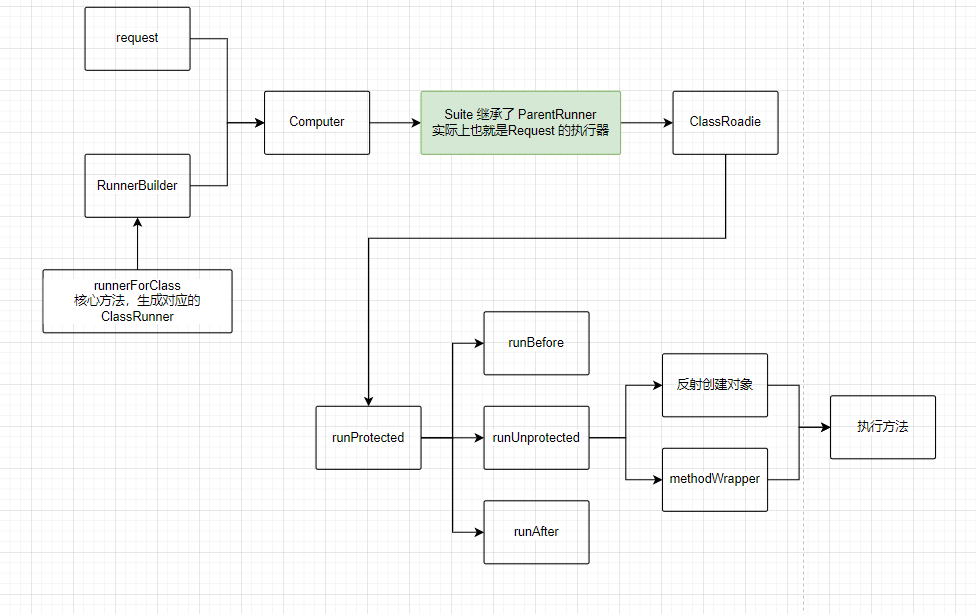
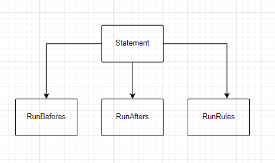

# Junit4

## 概述

JUnit4是一个易学易用的Java单元测试框架，一般我们在写完一段代码或一个方法的时候，都要测试一下这段代码和这个方法的逻辑是不是正确，输入一定的数据，返回的数据是不是我们想要的结果，即我们在写单个业务代码针对结果进行测试。这时Junit就派上了大用场了。

## 特点

+ JUnit 是一个开放的资源框架，用于编写和运行测试。
+ 提供注解来识别测试方法。
+ 提供断言来测试预期结果。
+ JUnit 测试允许你编写代码更快，并能提高质量。
+ JUnit 优雅简洁。没那么复杂，花费时间较少。
+ JUnit测试可以自动运行并且检查自身结果并提供即时反馈。所以也没有必要人工梳理测试结果的报告。
+ JUnit测试可以被组织为测试套件，包含测试用例，甚至其他的测试套件。
+ JUnit在一个条中显示进度。如果运行良好则是绿色；如果运行失败，则变成红色

## 相关注解

|     注解      |                             描述                             |
| :-----------: | :----------------------------------------------------------: |
|     @Test     |              测试注解，标记一个方法作为测试用例              |
|    @Before    |           每个测试之前执行，便于某些必要的先决条件           |
| @BeforeClass  | 附着在静态方法，必须执行一次并在类的所有测试之前，这种一般用来处理一些贡献配置方法，如数据库连接 |
|    @After     |                       每个测试之后执行                       |
|  @AfterClass  |            所有测试之后执行，可以用来清理一些资源            |
|    @Ignore    |                    被标注的方法不会被执行                    |
|   @Runwith    |             放在测试类名之前，用来确定来怎么类型             |
|  @Parameters  |                      用于使用参数化功能                      |
| @SuiteClasses |                         用于套件测试                         |

[相关教程](https://blog.csdn.net/qq_34264849/article/details/88243278?ops_request_misc=&request_id=&biz_id=102&utm_term=junit4&utm_medium=distribute.pc_search_result.none-task-blog-2~all~sobaiduweb~default-1-88243278.nonecase&spm=1018.2226.3001.4187)

## 源码部分

### 基本流程

### Request

#### RunnerRequest

更简单了，就是直接构造传入Runner对象来创建

#### SortingRequest

大致作用就是可以将@Test的方法进行排序。
Runner对象需要实现org.junit.runner.manipulation.Sortable

#### FilterRequest

+ 大致作用就是可以将@Test的方法进行过滤，即表示是否运行,重写shouldRun方法。Runner对象需要实现org.junit.runner.manipulation.Filterable
+ 跟@Ignore差不多，只不过FilterRequest是编程式，@Ignore是注解式

**因为junit是intellij发起入口测试的，所以上面的SortingRequest和FilterRequest其实不能手动自己去创建，所以可以暂时忽略，除非研究下怎么自己创建。或者扩展intellij的junit插件等。**

#### ClassRequest

基础类

##### AllDefaultPossibilitiesBuilder

- 此类利用了RunnerBuilder，有一个抽象方法#runnerForClass来创建Runner,
- 根据代码来看，是利用了根据**工厂方法**模式来创建的对象（和Request#getRunner是相同的手法）。（从名字来看，好像是构建者模式，不要被误导了）

##### JUnit4Builder

- 直接默认用BlockJUnit4ClassRunner来作为Runner运行测试。
  也是目前junit4版本的默认实现0

### ParentRunner

测试的主要执行流程定义

#### 重要逻辑

##### run(程序入口)

~~~java
public void run(final RunNotifier notifier) {
    EachTestNotifier testNotifier = new EachTestNotifier(notifier,
                                                         getDescription());
    testNotifier.fireTestSuiteStarted();
    try {
        Statement statement = classBlock(notifier);
        statement.evaluate();
    } catch (AssumptionViolatedException e) {
        testNotifier.addFailedAssumption(e);
    } catch (StoppedByUserException e) {
        throw e;
    } catch (Throwable e) {
        testNotifier.addFailure(e);
    } finally {
        testNotifier.fireTestSuiteFinished();
    }
}
~~~

##### @BeforeClass @AfterClass 逻辑组织

~~~java
    protected Statement classBlock(final RunNotifier notifier) {
        Statement statement = childrenInvoker(notifier);
        if (!areAllChildrenIgnored()) {
            statement = withBeforeClasses(statement);
            statement = withAfterClasses(statement);
            statement = withClassRules(statement);
            statement = withInterruptIsolation(statement);
        }
        return statement;
    }
~~~

#### Junit4ClassRunner

目标测试方法的执行器，弗雷是

##### @test逻辑组织

~~~java
    protected Statement methodBlock(final FrameworkMethod method) {
        Object test;
        try {
            test = new ReflectiveCallable() {
                @Override
                protected Object runReflectiveCall() throws Throwable {
                    return createTest(method);
                }
            }.run();
        } catch (Throwable e) {
            return new Fail(e);
        }

        Statement statement = methodInvoker(method, test);
        statement = possiblyExpectingExceptions(method, test, statement);
        statement = withPotentialTimeout(method, test, statement);
        statement = withBefores(method, test, statement);
        statement = withAfters(method, test, statement);
        statement = withRules(method, test, statement);
        statement = withInterruptIsolation(statement);
        return statement;
    }
~~~

#### ClassRoadie

测试的主要执行Before、After方法

### Statement(重要)

完成了Junit的调用链（责任链）的处理逻辑， 在RunAfter的中间，加入RunBefore的逻辑，在RunBefore的逻辑中加入了RunTest的逻辑，可谓精妙，但是这种方式对于后期的扩展感觉存在一定的弊端，扩展性方面可能存在一定的局限性

#### RunBefores

~~~java

public class RunBefores extends Statement {
    private final Statement next;

   private final Object target;

    private final List<FrameworkMethod> befores;

    public RunBefores(Statement next, List<FrameworkMethod> befores, Object target) {
        this.next = next;
        this.befores = befores;
        this.target = target;
    }

    @Override
    public void evaluate() throws Throwable {
        for (FrameworkMethod before : befores) {
            invokeMethod(before);
        }
        // 运行真正的 Test
        next.evaluate();
    }

	// 执行静态方法
    protected void invokeMethod(FrameworkMethod method) throws Throwable {
        method.invokeExplosively(target);
    }
}
~~~

#### RunAfters

~~~java
public class RunAfters extends Statement {
    private final Statement next;

    private final Object target;

    private final List<FrameworkMethod> afters;

    public RunAfters(Statement next, List<FrameworkMethod> afters, Object target) {
        this.next = next;
        this.afters = afters;
        this.target = target;
    }

    @Override
    public void evaluate() throws Throwable {
        List<Throwable> errors = new ArrayList<Throwable>();
        try {
            // 执行 runBefore 逻辑
            next.evaluate();
        } catch (Throwable e) {
            errors.add(e);
        } finally {
            // 执行 runAfter 逻辑
            for (FrameworkMethod each : afters) {
                try {
                    invokeMethod(each);
                } catch (Throwable e) {
                    // 异常处理
                    errors.add(e);
                }
            }
        }
        MultipleFailureException.assertEmpty(errors);
    }

    protected void invokeMethod(FrameworkMethod method) throws Throwable {
        method.invokeExplosively(target);
    }
}
~~~

### 总结

就设计而言，Junit4 采用了大量的面向接口设计，同时 Statement 的设计方式，相对来说也比较新颖，是个不错的实现方式。同时可以看到Junit其实还有很多扩展的东西，目前上述的内容仅仅是把核心的一些实现主要逻辑进行了罗列，后面可以继续深入好好学习
