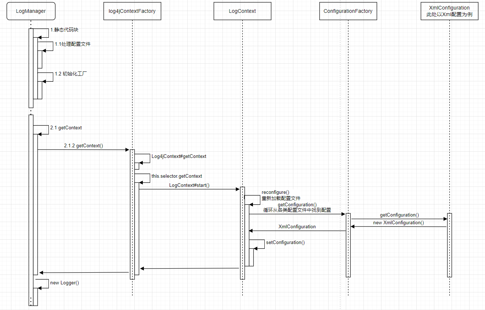
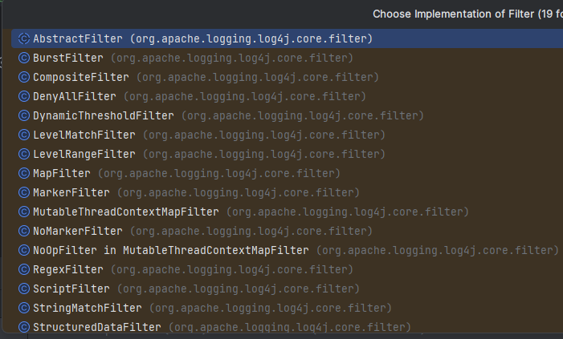
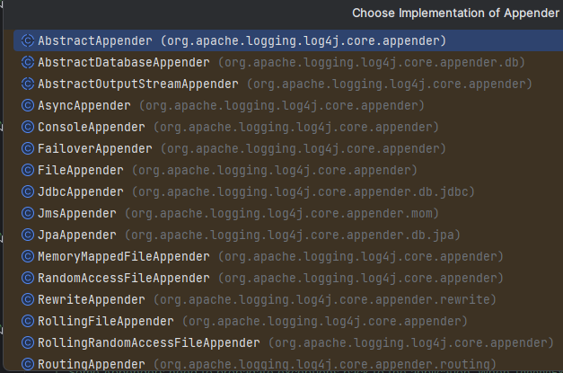

# Lo4j2

## 启动流程



1. 核心入口是LogManager
2. 通过LonManager获取得到LongContext，这里对于Context的创建会通过LogContextFactory（一般默认的都是Log4jContextFactory， 其中会通过不同的Selector帮助成立对应的 Logger）,**其中LogManager静态代码块最主要的工作就是产生出一个LogContextFactory。**
3. 然后LogContextFactory会通过Selector建立对应的LogContext；
4. LogContext（对应的Context类型）会执行start方法，然后LogContext作为父类再去执行start方法；
5. LogContext#start(), 会去读取配置文件，会有三种形式：xml、yml、properties、json
6. 会经过 XmlConfiguration
7. 成功创建Context后，会根据Class创建对应的Logger
8. 调用对应的LonggerContext创建Logger，然后进行返回

## 同步日志运行流程

1. AbstractLogger.info():模板方法，定义logger的工作
2. Logger.isEnabled():是否打印当前日志，有两种判断条件
   1. Logger.filter()：走过滤器的逻辑后，会返回对应的过滤Reslut结果，已控制是否记录日志、怎么样记录日志，过滤器的结果有：（提示：log4j2的此机制与logback是一样的。）
      1. `ACCEPT`：(不需要再走后面的过滤器了，)需要记录当前日志。
      2. `NEUTRAL`：需不需要记录当前日志，由后续过滤器决定。若所有过滤器返回的结果都是NEUTRAL，那么需要记录日志。
      3. `DENY`：(不需要再走后面的过滤器了，)不需要记录当前日志。

   2. Logger的level(最常使用的一种方式)：判断当前的Logger的日志级别是否大于输出的日志级别。

3. AbstractLogger.logMessage()
4. AbstractMessage.newMessage()->new SimpleMessage()
5. LogConfig.log():日志打印的主要逻辑
6. LogEventFactory:DefaultLogEventFactory.createLogEvent():将日志包装成为一个logEvent
7. LogConfig.callAppends(): 获取对应的 Appender
8. AppendContrl.append(): 调用 appender 打印日志
9. AbstractOutputStreamAppend.wirte(): 打印到控制台

## 过滤器




| 过滤器                 | 说明                                                         | 是否常用 |
| ---------------------- | ------------------------------------------------------------ | -------- |
| StringMatchFilter      | 如果格式化后(即：最终)的`日志信息中包含${指定的字符串}`，则onMatch，否则onMismatch<br/>即： `msg.contains(this.text) ? onMatch : onMismatch;` | 是       |
| LevelRangeFilter       | 若`${maxLevel} <= 日志级别 <= ${minLevel}`， 则onMatch，否则onMismatch<br/>如： 即为只记录日志info及warn级别的日志。 | 是       |
| RegexFilter            | 如果`日志信息匹配${指定的正则表达式}`，则onMatch，否则onMismatch<br/>注：可通过useRawMsg属性来控制这个日志信息是格式化处理后(即：最终)的日志信息，还是格式化处理前(即：代码中输入)的日志信息。 | 是       |
| ThresholdFilter        | 若`日志级别 >= ${指定的日志级别}`， 则onMatch，否则onMismatch | 是       |
| LevelMatchFilter       | 如果`日志级别等于${指定的日志级别}`，则onMatch，否则onMismatch | 是       |
| ThreadContextMapFilter | 通过context(可以理解为一个Map)中对应的key-value值进行过滤<br/>注：上下文默认是ThreadContext，也可以自定义使用ContextDataInjectorFactory配置ContextDataInjector来指定。 | 是       |
| DynamicThresholdFilte  | 待补充                                                       | 是       |
| CompositeFilter        | 组合过滤器,即：按照xml配置中的配置，一个过滤器一个过滤器的走，如果在这过程中，任意一个过滤器ACCEPT或DENY了，那么就不会往后走了，直接返回对应的结果。 | 是       |
| TimeFilter             | 如果记录日志时的当前时间落在每天指定的时间范围[start, end]内，则onMatch，否则onMismatch<br />如：<TimeFilter start="05:00:00" end="05:30:00" onMatch="ACCEPT" onMismatch="DENY"/> | 否       |
| ...                    | ...                                                          | ...      |


## 基本组件

### LogContext

LoggerContext在Logging System中扮演了锚点的角色。根据情况的不同，一个应用可能同时存在于多个有效的LoggerContext中。在同一LoggerContext下，log system是互通的。如：Standalone Application、Web Applications、Java EE Applications、”Shared” Web Applications 和REST Service Containers，就是不同广度范围的log上下文环境。

### Configuration

每一个LoggerContext都有一个有效的Configuration。Configuration包含了所有的Appenders、上下文范围内的过滤器、LoggerConfigs以及StrSubstitutor.的引用。在重配置期间，新与旧的Configuration将同时存在。当所有的Logger对象都被重定向到新的Configuration对象后，旧的Configuration对象将被停用和丢弃。

### Logger

如前面所述， Loggers 是通过调用LogManager.getLogger方法获得的。Logger对象本身并不实行任何实际的动作。它只是拥有一个name 以及与一个LoggerConfig相关联。它继承了AbstractLogger类并实现了所需的方法。当Configuration改变时，Logger将会与另外的LoggerConfig相关联，从而改变这个Logger的行为。

###  LoggerConfig

当Logger在configuration中被描述时，LoggerConfig对象将被创建。LoggerConfig包含了一组过滤器。LogEvent在被传往Appender之前将先经过这些过滤器。过滤器中包含了一组Appender的引用。Appender则是用来处理这些LogEvent的。

每一个LoggerConfig会被指定一个Log级别。可用的Log级别包括TRACE, DEBUG,INFO, WARN, ERROR 以及FATAL。需要注意的是，在log4j2中，Log的级别是一个Enum型变量，是不能继承或者修改的。如果希望获得更多的分割粒度，可用考虑使用Markers来替代。

### Filter

与防火墙过滤的规则相似，log4j2的过滤器也将返回三类状态：Accept（接受）, Deny（拒绝） 或Neutral（中立）。其中，Accept意味着不用再调用其他过滤器了，这个LogEvent将被执行；Deny意味着马上忽略这个event，并将此event的控制权交还给过滤器的调用者；Neutral则意味着这个event应该传递给别的过滤器，如果再没有别的过滤器可以传递了，那么就由现在这个过滤器来处理。

### Appender

由logger的不同来决定一个logging request是被禁用还是启用只是log4j2的情景之一。log4j2还允许将logging request中log信息打印到不同的目的地中。在log4j2的世界里，不同的输出位置被称为Appender。目前，Appender可以是console、文件、远程socket服务器、Apache Flume、JMS以及远程 UNIX 系统日志守护进程。一个Logger可以绑定多个不同的Appender。

可以调用当前Configuration的addLoggerAppender函数来为一个Logger增加。如果不存在一个与Logger名称相对应的LoggerConfig，那么相应的LoggerConfig将被创建，并且新增加的Appender将被添加到此新建的LoggerConfig中。尔后，所有的Loggers将会被通知更新自己的LoggerConfig引用（PS：一个Logger的LoggerConfig引用是根据名称的匹配长度来决定的，当新的LoggerConfig被创建后，会引发一轮配对洗牌）。

在某一个Logger中被启用的logging request将被转发到该Logger相关联的的所有Appenders上，并且还会被转发到LoggerConfig的父级的Appenders上。

这样会产生一连串的遗传效应。例如，对LoggerConfig B来说，它的父级为A，A的父级为root。如果在root中定义了一个Appender为console，那么所有启用了的logging request都会在console中打印出来。另外，如果LoggerConfig A定义了一个文件作为Appender，那么使用LoggerConfig A和LoggerConfig B的logger 的logging request都会在该文件中打印，并且同时在console中打印。

如果想避免这种遗传效应的话，可以在configuration文件中做如下设置：

> additivity="false" // 默认为true

这样，就可以关闭Appender的遗传效应了。

## Appender



Append 会根据不同的类型输出到不同的位置，相对来说还是非常灵活的

### ConsoleAppender

~~~java
public final class ConsoleAppender extends AbstractOutputStreamAppender<OutputStreamManager> {}
~~~

### AsyncAppender（不推荐，效率低下）

~~~java
public final class AsyncAppender extends AbstractAppender {}
~~~

## 异步日志运行流程

### 概述

+ Log4j 2包含基于LMAX Disruptor库的下一代异步记录器。在多线程场景中，异步记录器的吞吐量比Log4j 1.x和Logback高18倍，延迟低。有关详细信息，请参阅异步日志记录性能否则，Log4j 2明显优于Log4j 1.x，Logback和java.util.logging，尤其是在多线程应用程序中LMAX Disruptor技术。异步记录器在内部使用Disruptor，一个无锁的线程间通信库，而不是队列，从而产生更高的吞吐量和更低的延迟。
+ 原因在于log4j2使用了LMAX, 一个无锁的线程间通信库代替了, logback和log4j之前的队列. 并发性能大大提升, 下期文章将研究一下LMAX, 到底是什么使所有记录器异步Log4j-2.9及更高版本在类路径上需要disruptor-3.3.4.jar或更高版本。 在Log4j-2.9之前，需要disruptor-3.0.0.jar或更高版本。
+ 这是最简单的配置，并提供最佳性能。要使所有记录器异步，请将disruptor jar添加到类路径，并设置系统的VM启动参数：`log4j2.contextSelector设置为org.apache.logging.log4j.core.async.AsyncLoggerContextSelector`.
+ 默认情况下，异步记录器不会将位置传递给I/O线程。

### 说明

LogEvent 的处理，经过了两个 RingBuffer，相对来说处理逻辑还是比较复杂的

+ AsyncLoggerDisruptor 发布消息-> RingBufferLogEventHandler
+ AsyncLoggerConfigDisruptor #tryEnqueue -> AsyncLoggerConfigDisruptor #onEvent -> 打印日志

### 使用方式

引入依赖

```xml
<dependency>
    <groupId>com.lmax</groupId>
    <artifactId>disruptor</artifactId>
    <version>3.4.0</version>
</dependency>

```

JVM配置启动参数

-DLog4jContextSelector=org.apache.logging.log4j.core.async.AsyncLoggerContextSelector

log4j2.xml使用AsyncRoot/AsyncLogger替代Root/Logger

~~~xml
<?xml version="1.0" encoding="UTF-8"?>
<Configuration status="WARN">
    <properties>
        <property name="LOG_HOME">logs</property>
        <property name="SYSTEM_LEVEL">debug</property>
    </properties>
    <Appenders>


        <Console name="Console" target="SYSTEM_OUT">
            <Filters>
                <MarkerFilter marker="MESSAGE" onMatch="DENY" onMismatch="NEUTRAL"/>
                <MarkerFilter marker="TRACE" onMatch="DENY" onMismatch="NEUTRAL"/>
                <ThresholdFilter level="${SYSTEM_LEVEL}" onMatch="ACCEPT" onMismatch="DENY"/>
            </Filters>
            <!--36 表示，当前类做所在包的层级显示多少， 当为1 时：Log4j2Test 为36 时:com.fjp.log.logClass.Log4j2Test -->
            <!--            <PatternLayout pattern="%d{HH:mm:ss.SSS} [%t] %-5level  %logger{33} - %msg%n"/>-->
            <PatternLayout
                    pattern="%d{HH:mm:ss.SSS} [%t] %highlight{%-5level}{FATAL=red, ERROR=red, WARN=yellow, INFO=cyan, DEBUG=cyan,TRACE=blue}  %logger{33} - %msg%n"/>
        </Console>


        <RollingFile name="RollingFileSystem" fileName="${LOG_HOME}/system.log"
                     filePattern="${LOG_HOME}/$${date:yyyy-MM}/$${date:yyyy-MM-dd}/system/system-%d{yyyy-MM-dd}-%i.log.gz"
                     bufferSize="4096" immediateFlush="true" bufferedIO="true" append="false">
            <Filters>
                <MarkerFilter marker="MESSAGE" onMatch="ACCEPT" onMismatch="ACCEPT"/>
                <MarkerFilter marker="TRACE" onMatch="ACCEPT" onMismatch="ACCEPT"/>
                <ThresholdFilter level="${SYSTEM_LEVEL}" onMatch="ACCEPT" onMismatch="ACCEPT"/>
            </Filters>

            <PatternLayout
                    charset="utf-8"
                    pattern="%d{yyyy-MM-dd HH:mm:ss.SSS} %highlight{%-5level}{FATAL=red, ERROR=red, WARN=yellow, INFO=cyan, DEBUG=cyan,TRACE=blue}  %logger{33} - %msg%n"/>

            <Policies>
                <!--当日志大小达到10KB以及当前日期与日志的开始日期不匹配时滚动日志的策略-->
                <TimeBasedTriggeringPolicy/>
                <SizeBasedTriggeringPolicy size="100MB"/>
            </Policies>

        </RollingFile>
    </Appenders>
    <Loggers>

        <!--        传统方式     -->
<!--        <Root level="debug">-->
<!--            <AppenderRef ref="Console"/>-->
<!--            <AppenderRef ref="RollingFileSystem"/>-->
<!--        </Root>-->
        <!--    异步方式    -->
        <AsyncRoot level="info">
            <AppenderRef ref="Console"/>
            <AppenderRef ref="RollingFileSystem"/>
        </AsyncRoot>
    </Loggers>
</Configuration>

~~~


### AsyncLoggerContextSelector

说明：生成 AsyncLoggerContext

#createContext

~~~java
// 启动时创建 asyncLoggerContext
@Override
protected LoggerContext createContext(final String name, final URI configLocation) {
    return new AsyncLoggerContext(name, null, configLocation);
}
~~~


### AsyncLoggerContext

说明：启动并生成 loggerDisruptor

~~~java
public class AsyncLoggerContext extends LoggerContext {
    
    // 重写了 newInstance 方法，所以在 LoggerContext 在 getLoger 的时候，AsyncLoggerContext 执行的是下面的这个方法
    @Override
    protected Logger newInstance(final LoggerContext ctx, final String name, final MessageFactory messageFactory) {
        return new AsyncLogger(ctx, name, messageFactory, loggerDisruptor);
    }

    @Override
    public void start() {
        loggerDisruptor.start();
        super.start();
    }
}
~~~

已启动一个RingBuffer

~~~JAVA
public synchronized void start() {
    if (disruptor != null) {
        LOGGER.trace(
            "[{}] AsyncLoggerDisruptor not starting new disruptor for this context, using existing object.",
            contextName);
        return;
    }
    LOGGER.trace("[{}] AsyncLoggerDisruptor creating new disruptor for this context.", contextName);
    ringBufferSize = DisruptorUtil.calculateRingBufferSize("AsyncLogger.RingBufferSize");
    final WaitStrategy waitStrategy = DisruptorUtil.createWaitStrategy("AsyncLogger.WaitStrategy");

    final ThreadFactory threadFactory = new Log4jThreadFactory("AsyncLogger[" + contextName + "]", true, Thread.NORM_PRIORITY) {
        @Override
        public Thread newThread(final Runnable r) {
            final Thread result = super.newThread(r);
            backgroundThreadId = result.getId();
            return result;
        }
    };
    asyncQueueFullPolicy = AsyncQueueFullPolicyFactory.create();

    disruptor = new Disruptor<>(RingBufferLogEvent.FACTORY, ringBufferSize, threadFactory, ProducerType.MULTI,
                                waitStrategy);

    final ExceptionHandler<RingBufferLogEvent> errorHandler = DisruptorUtil.getAsyncLoggerExceptionHandler();
    disruptor.setDefaultExceptionHandler(errorHandler);

    final RingBufferLogEventHandler[] handlers = {new RingBufferLogEventHandler()};
    disruptor.handleEventsWith(handlers);

    LOGGER.debug("[{}] Starting AsyncLogger disruptor for this context with ringbufferSize={}, waitStrategy={}, "
                 + "exceptionHandler={}...", contextName, disruptor.getRingBuffer().getBufferSize(), waitStrategy
                 .getClass().getSimpleName(), errorHandler);
    disruptor.start();

    LOGGER.trace("[{}] AsyncLoggers use a {} translator", contextName, useThreadLocalTranslator ? "threadlocal"
                 : "vararg");
    super.start();
}

~~~


### AsyncLogger

说明：用来发布日志信息

~~~java
public class AsyncLogger extends Logger implements EventTranslatorVararg<RingBufferLogEvent>{
    
    @Override
    public void log(final Level level, final Marker marker, final String fqcn, final StackTraceElement location,
                    final Message message, final Throwable throwable) {
        getTranslatorType().log(fqcn, location, level, marker, message, throwable);
    }

    private void logWithThreadLocalTranslator(final String fqcn, final StackTraceElement location, final Level level,
                                              final Marker marker, final Message message, final Throwable thrown) {
        // Implementation note: this method is tuned for performance. MODIFY WITH CARE!

        final RingBufferLogEventTranslator translator = getCachedTranslator();
        initTranslator(translator, fqcn, location, level, marker, message, thrown);
        initTranslatorThreadValues(translator);
        publish(translator);
    }


	// 发布logEvent
    private void publish(final RingBufferLogEventTranslator translator) {
        // 将 logEvent 发布
        if (!loggerDisruptor.tryPublish(translator)) {
            // 如果 ringbuffer 满了的处理逻辑
            handleRingBufferFull(translator);
        }
    }

    private void handleRingBufferFull(final RingBufferLogEventTranslator translator) {
        if (AbstractLogger.getRecursionDepth() > 1) { // LOG4J2-1518, LOG4J2-2031
            // If queue is full AND we are in a recursive call, call appender directly to prevent deadlock
            AsyncQueueFullMessageUtil.logWarningToStatusLogger();
            logMessageInCurrentThread(translator.fqcn, translator.level, translator.marker, translator.message,
                                      translator.thrown);
            translator.clear();
            return;
        }
        final EventRoute eventRoute = loggerDisruptor.getEventRoute(translator.level);
        switch (eventRoute) {
            case ENQUEUE:
                loggerDisruptor.enqueueLogMessageWhenQueueFull(translator);
                break;
            case SYNCHRONOUS:
                logMessageInCurrentThread(translator.fqcn, translator.level, translator.marker, translator.message,
                                          translator.thrown);
                translator.clear();
                break;
            case DISCARD:
                translator.clear();
                break;
            default:
                throw new IllegalStateException("Unknown EventRoute " + eventRoute);
        }
    }    
}
~~~


`AsyncLogger#logWithThreadLocalTranslator()`，将日志相关的信息转换成`RingBufferLogEvent`（RingBuffer是Disruptor的无所队列），然后将其发布到RingBuffer中。

### AsyncLoggerDisruptor

说明：真正的日志发布器

~~~java
class AsyncLoggerDisruptor extends AbstractLifeCycle {
    // 发布 logevent 到 RingBuffer 中
    boolean tryPublish(final RingBufferLogEventTranslator translator) {
        try {
            return this.disruptor.getRingBuffer().tryPublishEvent(translator);
        } catch (NullPointerException var3) {
            this.logWarningOnNpeFromDisruptorPublish(translator);
            return false;
        }
    }    
}
~~~


### RingBufferLogEventHandler

日志处理器，调用`RingBufferLogEvent`的`execute`方法

~~~java
public class RingBufferLogEventHandler implements SequenceReportingEventHandler<RingBufferLogEvent> {
    @Override
    public void onEvent(final RingBufferLogEvent event, final long sequence,
                        final boolean endOfBatch) throws Exception {
        try {
            event.execute(endOfBatch);
        }
        finally {
            event.clear();
            // notify the BatchEventProcessor that the sequence has progressed.
            // Without this callback the sequence would not be progressed
            // until the batch has completely finished.
            notifyCallback(sequence);
        }
    }
}

~~~

### RingBufferLogEvent

说明：LogEvent 实体类

放入到 Ringbuffer 中的 logEvent

~~~java
public class RingBufferLogEvent implements LogEvent, ReusableMessage, CharSequence, ParameterVisitable {
    public void execute(final boolean endOfBatch) {
        this.endOfBatch = endOfBatch;
        asyncLogger.actualAsyncLog(this);
    }
}
~~~

**AsyncLogger #actualAsyncLog**

说明 AsyncLog 处理逻辑

~~~java
// 处理 logEvent
public void actualAsyncLog(final RingBufferLogEvent event) {
    final LoggerConfig privateConfigLoggerConfig = privateConfig.loggerConfig;
    final List<Property> properties = privateConfigLoggerConfig.getPropertyList();

    if (properties != null) {
        onPropertiesPresent(event, properties);
    }

    privateConfigLoggerConfig.getReliabilityStrategy().log(this, event);
}

~~~

### AwaitCompletionReliabilityStrategy 

#log

说明：获取策略，处理log

~~~java
@Override
public void log(final Supplier<LoggerConfig> reconfigured, final String loggerName, final String fqcn,
                final StackTraceElement location, final Marker marker, final Level level, final Message data,
                final Throwable t) {
    final LoggerConfig config = getActiveLoggerConfig(reconfigured);
    try {
        config.log(loggerName, fqcn, location, marker, level, data, t);
    } finally {
        config.getReliabilityStrategy().afterLogEvent();
    }
}
~~~

AsyncLoggerConfig #log

说明：异步处理逻辑

~~~java
 @Override
protected void log(final LogEvent event, final LoggerConfigPredicate predicate) {
   
   	// 本次执行逻辑
    if (predicate == LoggerConfigPredicate.ALL && SYNC_LOGGER_ENTERED.get() == Boolean.FALSE && hasAppenders()) {

        ASYNC_LOGGER_ENTERED.set(Boolean.TRUE);
        try {
            // 先用同步的逻辑处理日志
            super.log(event, LoggerConfigPredicate.SYNCHRONOUS_ONLY);
			// 异步的处理逻辑（）
            logToAsyncDelegate(event);
        } finally {
            ASYNC_LOGGER_ENTERED.set(Boolean.FALSE);
        }
    } else {
        // 下次执行逻辑
        super.log(event, predicate);
    }
}


private void logToAsyncDelegate(final LogEvent event) {
    if (!isFiltered(event)) {
        // Passes on the event to a separate thread that will call
        // asyncCallAppenders(LogEvent).
        populateLazilyInitializedFields(event);
        // 发送到真正的异步处理逻辑 RingBuffer
        if (!delegate.tryEnqueue(event, this)) {
            handleQueueFull(event);
        }
    }
}

~~~

### AsyncLoggerConfigDisruptor

异步处理逻辑配置

```java
// 放入到 第二个 RingBuffer 中
@Override
public boolean tryEnqueue(final LogEvent event, final AsyncLoggerConfig asyncLoggerConfig) {
    final LogEvent logEvent = prepareEvent(event);
    return disruptor.getRingBuffer().tryPublishEvent(translator, logEvent, asyncLoggerConfig);
}


// 消费逻辑
@Override
public void onEvent(final Log4jEventWrapper event, final long sequence, final boolean endOfBatch)
    throws Exception {
    event.event.setEndOfBatch(endOfBatch);
    // 日志处理
    event.loggerConfig.logToAsyncLoggerConfigsOnCurrentThread(event.event);
    event.clear();
    notifyIntermediateProgress(sequence);
}

```

### AsyncLoggerConfig

~~~java
// 再次进入到 Config.log 
void logToAsyncLoggerConfigsOnCurrentThread(final LogEvent event) {
    log(event, LoggerConfigPredicate.ASYNCHRONOUS_ONLY);
}


@Override
protected void log(final LogEvent event, final LoggerConfigPredicate predicate) {
    if (predicate == LoggerConfigPredicate.ALL &&
        ASYNC_LOGGER_ENTERED.get() == Boolean.FALSE &&
        hasAppenders()) {
        ASYNC_LOGGER_ENTERED.set(Boolean.TRUE);
        try {
            super.log(event, LoggerConfigPredicate.SYNCHRONOUS_ONLY);
            logToAsyncDelegate(event);
        } finally {
            ASYNC_LOGGER_ENTERED.set(Boolean.FALSE);
        }
    } else {
       // 本次执行部分
        super.log(event, predicate);
    }
}


~~~


### LoggerConfig 

#processLogEvent

~~~java
public void log(final LogEvent event) {
    log(event, LoggerConfigPredicate.ALL);
}

private void processLogEvent(final LogEvent event, final LoggerConfigPredicate predicate) {
    event.setIncludeLocation(this.isIncludeLocation());
    if (predicate.allow(this)) {
        this.callAppenders(event);
    }

    this.logParent(event, predicate);
}

// 执行 appender 输出日志
protected void callAppenders(final LogEvent event) {
    AppenderControl[] controls = this.appenders.get();

    for(int i = 0; i < controls.length; ++i) {
        controls[i].callAppender(event);
    }

}
~~~


#
