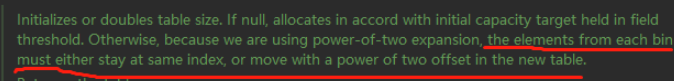

# HashMap

## 说明

本文主要针对`Jdk 8`进行解读， 不同版本之间可能存在一定的变化

## 特性

1. 数据结构是：数组+链表+红黑树，其实也就是一个Node[]（Node 数组，里面保存Node的链表结构，链表可以转化为红黑树）
2. Map 可以存入一个Null元素作为 key，因为 HashMap针对 null 进行了特殊处理
3. 负载因子0.75（负载因子是可以进行配置的）
4. 链表转化为树的临界值为8，但是需要先保证 HashMap 的元素个数大于 64，否则优先进行扩容；
5. HashMap 扩容，每次会扩容2倍
6. 扩容时，链表内的Node会考虑低位链和高位链，低位链放在原来的hash桶中，高位链放在当前hash桶+扩容大小的hash桶中
7. HashMap中哈希冲突的解决方法就是拉链法

## 其他特性

### 负载因子-0.75

[关于负载因子：原文](https://blog.csdn.net/weixin_44182651/article/details/125927263?ops_request_misc=%257B%2522request%255Fid%2522%253A%2522166175759616780366531465%2522%252C%2522scm%2522%253A%252220140713.130102334..%2522%257D&request_id=166175759616780366531465&biz_id=0&utm_medium=distribute.pc_search_result.none-task-blog-2~all~sobaiduend~default-1-125927263-null-null.142^v42^pc_rank_34,185^v2^control&utm_term=HashMap%20%E8%B4%9F%E8%BD%BD%E5%9B%A0%E5%AD%90&spm=1018.2226.3001.4187)

HashMap负载因子，与扩容机制有关；即若当前容器的容量，达到设定最大值，就需要要执行扩容操作。举个例子：当前的容器容量是16，负载因子是0.75；16*0.75=12，也就是说，当容量达到了12的时就会执行扩容操作。作用很简单，相当于是一个扩容机制的阈值。当超过了这个阈值，就会触发扩容机制。

#### 原因解释

在考虑HashMap时，首先要想到的是HashMap只是一个数据结构，既然是数据结构最主要的就是节省时间和空间。负载因子的作用肯定也是节省时间和空间。为什么节省呢？我们考虑两种极端情况。

##### 负载因子是1.0

数据一开始是保存在数组里，当发生了Hash碰撞的时候，就是在这个数据节点上，生出一个链表，当链表长度达到一定长度的时候，就会把链表转化为红黑树。

当负载因子是1.0时，也就意味着，只有当数组的8个值（这个图表示了8个）全部填充了，才会发生扩容。这就带来了很大的问题，因为Hash冲突时避免不了的。

后果：当负载因子是1.0的时候，意味着会出现大量的Hash的冲突，底层的红黑树变得异常复杂。对于查询效率极其不利。这种情况就是牺牲了时间来保证空间的利用率。

**因此一句话总结就是负载因子过大，虽然空间利用率上去了，但是时间效率降低了。**

##### 负载因子是0.5

后果：负载因子是0.5的时候，这也就意味着，当数组中的元素达到了一半就开始扩容，既然填充的元素少了，Hash冲突也会减少，那么底层的链表长度或者是红黑树的高度就会降低。查询效率就会增加。

但是，此时空间利用率就会大大的降低，原本存储1M的数据，现在就意味着需要2M的空间。

总之，就是负载因子太小，虽然时间效率提升了，但是空间利用率降低了。

##### 负载因子0.75

时间和空间的权衡，负载因子是0.75的时，空间利用率比较高，而且避免了相当多的Hash冲突，使得底层的链表或者是红黑树的高度比较低，提升了空间效率。

### 扩容倍数-2

[原文](https://blog.csdn.net/qq_42949615/article/details/124517000?ops_request_misc=%257B%2522request%255Fid%2522%253A%2522166175804016781683973408%2522%252C%2522scm%2522%253A%252220140713.130102334..%2522%257D&request_id=166175804016781683973408&biz_id=0&utm_medium=distribute.pc_search_result.none-task-blog-2~all~baidu_landing_v2~default-1-124517000-null-null.142^v42^pc_rank_34,185^v2^control&utm_term=HashMap%20%E6%AF%8F%E6%AC%A1%E6%89%A9%E5%AE%B92%E5%80%8D&spm=1018.2226.3001.4187)

红线标注意思大概就是：以二次幂展开，容器的元素要么保持原来的索引，要么以二次幂的偏移量出现在新表中。**也就是说hashmap采用2倍扩容，可以尽可能的减少元素位置的移动**

#### 总结

1. **尽可能的减少元素位置的移动。**
2. **使元素均匀的散布`hashmap`中，减少hash碰撞。**

## 新建

### 默认

~~~java
 HashMap<Integer,Integer> map = new HashMap<>();
~~~

源码：

~~~java
// 默认加载因子0.75
static final float DEFAULT_LOAD_FACTOR = 0.75f;
final float loadFactor;
// 初始化为数组中包含链表/二叉树
transient Node<K,V>[] table;

public HashMap() {
    this.loadFactor = DEFAULT_LOAD_FACTOR; // all other fields defaulted
}

// hashmap每个节点的数据结构
static class Node<K,V> implements Map.Entry<K,V> {
    final int hash;
    final K key;
    V value;
    Node<K,V> next;

    Node(int hash, K key, V value, Node<K,V> next) {
        this.hash = hash;
        this.key = key;
        this.value = value;
        this.next = next;
    }

    public final K getKey()        { return key; }
    public final V getValue()      { return value; }
    public final String toString() { return key + "=" + value; }

    public final int hashCode() {
        return Objects.hashCode(key) ^ Objects.hashCode(value);
    }

    public final V setValue(V newValue) {
        V oldValue = value;
        value = newValue;
        return oldValue;
    }

    // 重写equal方法
    public final boolean equals(Object o) {
        if (o == this)
            return true;
        if (o instanceof Map.Entry) {
            Map.Entry<?,?> e = (Map.Entry<?,?>)o;
            if (Objects.equals(key, e.getKey()) &&
                Objects.equals(value, e.getValue()))
                return true;
        }
        return false;
    }
}
~~~

### 设定初始值

~~~java
HashMap<Integer,Integer> map = new HashMap<Integer,Integer>(8);
~~~

~~~java
HashMap<Integer,Integer> map = new HashMap<Integer,Integer>(8,0.2f);
~~~

源码

~~~java
public HashMap(int initialCapacity) {
    this(initialCapacity, DEFAULT_LOAD_FACTOR);
}

 // 初始化的两个值
 public HashMap(int initialCapacity, float loadFactor) {
     if (initialCapacity < 0)
         throw new IllegalArgumentException("Illegal initial capacity: " +
                                            initialCapacity);
     if (initialCapacity > MAXIMUM_CAPACITY)
         initialCapacity = MAXIMUM_CAPACITY;
     if (loadFactor <= 0 || Float.isNaN(loadFactor))
         throw new IllegalArgumentException("Illegal load factor: " +
                                            loadFactor);
     this.loadFactor = loadFactor;
     this.threshold = tableSizeFor(initialCapacity);
 }

// 计算大小
static final int tableSizeFor(int cap) {
    int n = cap - 1;
    n |= n >>> 1;
    n |= n >>> 2;
    n |= n >>> 4;
    n |= n >>> 8;
    n |= n >>> 16;
    return (n < 0) ? 1 : (n >= MAXIMUM_CAPACITY) ? MAXIMUM_CAPACITY : n + 1;
}
~~~

## 添加/更新元素

~~~java
HashMap<Integer,Integer> map = new HashMap<Integer,Integer>(8);
map.put(2,2);
~~~

源码：

~~~java
// 链表转化为树的临界值
static final int TREEIFY_THRESHOLD = 8;

public V put(K key, V value) {
    return putVal(hash(key), key, value, false, true);
}

// 计算Key的hash值
static final int hash(Object key) {
    int h;
    return (key == null) ? 0 : (h = key.hashCode()) ^ (h >>> 16);
}

// put 流程
final V putVal(int hash, K key, V value, boolean onlyIfAbsent,
                   boolean evict) {
    Node<K,V>[] tab; Node<K,V> p; int n, i;
  
    // 判断是否为空
    if ((tab = table) == null || (n = tab.length) == 0)
        n = (tab = resize()).length;
    // 如果对应的key为null,之间加入数据
    if ((p = tab[i = (n - 1) & hash]) == null)
        tab[i] = newNode(hash, key, value, null);
    else {
        Node<K,V> e; K k;
        if (p.hash == hash &&
            ((k = p.key) == key || (key != null && key.equals(k))))
            e = p;
         // 如果是树状态，就把值放入树中，涉及到二叉树的算法
        else if (p instanceof TreeNode)
            e = ((TreeNode<K,V>)p).putTreeVal(this, tab, hash, key, value);
        // 如果不是树，那么就判断链表的长度
        else {
            for (int binCount = 0; ; ++binCount) {
                if ((e = p.next) == null) {
                    // 如果对应hash为null，直接放入新的值
                    p.next = newNode(hash, key, value, null);
                    // 然后判断是否需要转化为二叉树
                    if (binCount >= TREEIFY_THRESHOLD - 1) // -1 for 1st
                        treeifyBin(tab, hash);
                    break;
                }
                // 如果直接替换hash相同的元素
                if (e.hash == hash &&
                    ((k = e.key) == key || (key != null && key.equals(k))))
                    break;
                p = e;
            }
        }
        if (e != null) { // existing mapping for key
            V oldValue = e.value;
            if (!onlyIfAbsent || oldValue == null)
                e.value = value;
            afterNodeAccess(e);
            return oldValue;
        }
    }
    ++modCount;
    // 如果添加后，需要扩容，那么，就在此进行扩容
    if (++size > threshold)
        resize();
    afterNodeInsertion(evict);
    return null;
}

// Map扩容方法
final Node<K,V>[] resize() {
    Node<K,V>[] oldTab = table;
    int oldCap = (oldTab == null) ? 0 : oldTab.length;
    int oldThr = threshold;
    int newCap, newThr = 0;
    if (oldCap > 0) {
        if (oldCap >= MAXIMUM_CAPACITY) {
            threshold = Integer.MAX_VALUE;
            return oldTab;
        }
        else if ((newCap = oldCap << 1) < MAXIMUM_CAPACITY &&
                 oldCap >= DEFAULT_INITIAL_CAPACITY)
            // 每次扩容1倍大小
            newThr = oldThr << 1; // double threshold
    }
    else if (oldThr > 0) // initial capacity was placed in threshold
        newCap = oldThr;
    else {               // zero initial threshold signifies using defaults
        newCap = DEFAULT_INITIAL_CAPACITY;
        newThr = (int)(DEFAULT_LOAD_FACTOR * DEFAULT_INITIAL_CAPACITY);
    }
    if (newThr == 0) {
        float ft = (float)newCap * loadFactor;
        newThr = (newCap < MAXIMUM_CAPACITY && ft < (float)MAXIMUM_CAPACITY ?
                  (int)ft : Integer.MAX_VALUE);
    }
    threshold = newThr;
    @SuppressWarnings({"rawtypes","unchecked"})
    Node<K,V>[] newTab = (Node<K,V>[])new Node[newCap];
    table = newTab;
    if (oldTab != null) {
        for (int j = 0; j < oldCap; ++j) {
            Node<K,V> e;
            if ((e = oldTab[j]) != null) {
                oldTab[j] = null;
                if (e.next == null)
                    newTab[e.hash & (newCap - 1)] = e;
                else if (e instanceof TreeNode)
                    ((TreeNode<K,V>)e).split(this, newTab, j, oldCap);
                else { // preserve order
                    Node<K,V> loHead = null, loTail = null;
                    Node<K,V> hiHead = null, hiTail = null;
                    Node<K,V> next;
                    do {
                        next = e.next;
                        if ((e.hash & oldCap) == 0) {
                            if (loTail == null)
                                loHead = e;
                            else
                                loTail.next = e;
                            loTail = e;
                        }
                        else {
                            if (hiTail == null)
                                hiHead = e;
                            else
                                hiTail.next = e;
                            hiTail = e;
                        }
                    } while ((e = next) != null);
                    if (loTail != null) {
                        loTail.next = null;
                        newTab[j] = loHead;
                    }
                    if (hiTail != null) {
                        hiTail.next = null;
                        newTab[j + oldCap] = hiHead;
                    }
                }
            }
        }
    }
    return newTab;
}

// 向树中添加新的值，其中涉及到二叉树的平衡算法
final TreeNode<K,V> putTreeVal(HashMap<K,V> map, Node<K,V>[] tab,
                                       int h, K k, V v) {
    Class<?> kc = null;
    boolean searched = false;
    TreeNode<K,V> root = (parent != null) ? root() : this;
    for (TreeNode<K,V> p = root;;) {
        int dir, ph; K pk;
        if ((ph = p.hash) > h)
            dir = -1;
        else if (ph < h)
            dir = 1;
        else if ((pk = p.key) == k || (k != null && k.equals(pk)))
            return p;
        else if ((kc == null &&
                  (kc = comparableClassFor(k)) == null) ||
                 (dir = compareComparables(kc, k, pk)) == 0) {
            if (!searched) {
                TreeNode<K,V> q, ch;
                searched = true;
                if (((ch = p.left) != null &&
                     (q = ch.find(h, k, kc)) != null) ||
                    ((ch = p.right) != null &&
                     (q = ch.find(h, k, kc)) != null))
                    return q;
            }
            dir = tieBreakOrder(k, pk);
        }

        TreeNode<K,V> xp = p;
        if ((p = (dir <= 0) ? p.left : p.right) == null) {
            Node<K,V> xpn = xp.next;
            TreeNode<K,V> x = map.newTreeNode(h, k, v, xpn);
            if (dir <= 0)
                xp.left = x;
            else
                xp.right = x;
            xp.next = x;
            x.parent = x.prev = xp;
            if (xpn != null)
                ((TreeNode<K,V>)xpn).prev = x;
            moveRootToFront(tab, balanceInsertion(root, x));
            return null;
        }
    }
}

// 从链表转化为树 	
final void treeifyBin(Node<K,V>[] tab, int hash) {
    int n, index; Node<K,V> e;
    if (tab == null || (n = tab.length) < MIN_TREEIFY_CAPACITY)
        resize();
    else if ((e = tab[index = (n - 1) & hash]) != null) {
        TreeNode<K,V> hd = null, tl = null;
        // 利用do while循环将链表转化为二叉树
        do {
            TreeNode<K,V> p = replacementTreeNode(e, null);
            if (tl == null)
                hd = p;
            else {
                p.prev = tl;
                tl.next = p;
            }
            tl = p;
        } while ((e = e.next) != null);
        if ((tab[index] = hd) != null)
            hd.treeify(tab);
    }
}
~~~

## 查找元素

~~~java
HashMap<Integer,Integer> map = new HashMap<Integer,Integer>(8);
map.get(1);
~~~

源码：

~~~java
public V get(Object key) {
    Node<K,V> e;
    return (e = getNode(hash(key), key)) == null ? null : e.value;
}

// 计算Key的hash值
static final int hash(Object key) {
    int h;
    return (key == null) ? 0 : (h = key.hashCode()) ^ (h >>> 16);
}

// 通过计算hash值返回结点
final Node<K,V> getNode(int hash, Object key) {
    Node<K,V>[] tab; Node<K,V> first, e; int n; K k;
    if ((tab = table) != null && (n = tab.length) > 0 &&
        (first = tab[(n - 1) & hash]) != null) {
        if (first.hash == hash && // always check first node
            ((k = first.key) == key || (key != null && key.equals(k))))
            return first;
        if ((e = first.next) != null) {
            if (first instanceof TreeNode)
                // 从二叉树中获取值
                return ((TreeNode<K,V>)first).getTreeNode(hash, key);
            do {
                if (e.hash == hash &&
                    ((k = e.key) == key || (key != null && key.equals(k))))
                    return e;
            } while ((e = e.next) != null);
        }
    }
    return null;
}
~~~

## 移除元素

~~~java
HashMap<Integer,Integer> map = new HashMap<Integer,Integer>(8);
map.remove(1);
~~~

源码：

~~~java
public V remove(Object key) {
    Node<K,V> e;
    return (e = removeNode(hash(key), key, null, false, true)) == null ?
        null : e.value;
}

// 移除元素
final Node<K,V> removeNode(int hash, Object key, Object value,
                           boolean matchValue, boolean movable) {
    Node<K,V>[] tab; Node<K,V> p; int n, index;
    if ((tab = table) != null && (n = tab.length) > 0 &&
        (p = tab[index = (n - 1) & hash]) != null) {
        Node<K,V> node = null, e; K k; V v;
        if (p.hash == hash &&
            ((k = p.key) == key || (key != null && key.equals(k))))
            node = p;
        else if ((e = p.next) != null) {
            
            if (p instanceof TreeNode)
                node = ((TreeNode<K,V>)p).getTreeNode(hash, key);
            else {
                do {
                    if (e.hash == hash &&
                        ((k = e.key) == key ||
                         (key != null && key.equals(k)))) {
                        node = e;
                        break;
                    }
                    p = e;
                } while ((e = e.next) != null);
            }
        }
        if (node != null && (!matchValue || (v = node.value) == value ||
                             (value != null && value.equals(v)))) {
          	// 如果在树中，就从树中移除
            if (node instanceof TreeNode)    
                ((TreeNode<K,V>)node).removeTreeNode(this, tab, movable);
            else if (node == p)
                tab[index] = node.next;
            else
                p.next = node.next;
            ++modCount;
            --size;
            afterNodeRemoval(node);
            return node;
        }
    }
    return null;
}
~~~

