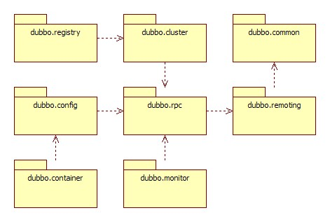

# 代码架构

## 整体设计

图例说明：

- 图中左边淡蓝背景的为服务消费方使用的接口，右边淡绿色背景的为服务提供方使用的接口，位于中轴线上的为双方都用到的接口。
- 图中从下至上分为十层，各层均为单向依赖，右边的黑色箭头代表层之间的依赖关系，每一层都可以剥离上层被复用，其中，Service 和 Config 层为 API，其它各层均为 SPI。
- 图中绿色小块的为扩展接口，蓝色小块为实现类，图中只显示用于关联各层的实现类。
- 图中蓝色虚线为初始化过程，即启动时组装链，红色实线为方法调用过程，即运行时调用链，紫色三角箭头为继承，可以把子类看作父类的同一个节点，线上的文字为调用的方法

## 各层说明

- **Config 配置层**：对外配置接口，以 `ServiceConfig`, `ReferenceConfig` 为中心，可以直接初始化配置类，也可以通过spring 解析配置生成配置类
- **Proxy 服务代理层**：服务接口透明代理，生成服务的客户端 Stub 和服务器端 Skeleton, 以 `ServiceProxy` 为中心，扩展接口为 `ProxyFactory`
- **Registry 注册中心层**：封装服务地址的注册与发现，以服务 URL 为中心，扩展接口为 `RegistryFactory`, `Registry`, `RegistryService`
- **Cluster 路由层**：封装多个提供者的路由及负载均衡，并桥接注册中心，以 `Invoker` 为中心，扩展接口为 `Cluster`, `Directory`, `Router`, `LoadBalance`
- **Monitor 监控层**：RPC 调用次数和调用时间监控，以 `Statistics` 为中心，扩展接口为 `MonitorFactory`, `Monitor`, `MonitorService`
- **Protocol 远程调用层**：封装 RPC 调用，以 `Invocation`, `Result` 为中心，扩展接口为 `Protocol`, `Invoker`, `Exporter`
- **Exchange 信息交换层**：封装请求响应模式，同步转异步，以 `Request`, `Response` 为中心，扩展接口为 `Exchanger`, `ExchangeChannel`, `ExchangeClient`, `ExchangeServer`
- **Transport 网络传输层**：抽象 mina 和 netty 为统一接口，以 `Message` 为中心，扩展接口为 `Channel`, `Transporter`, `Client`, `Server`, `Codec`
- **Serialize 数据序列化层**：可复用的一些工具，扩展接口为 `Serialization`, `ObjectInput`, `ObjectOutput`, `ThreadPool`

## 模块分包

模块说明：

- **dubbo-common 公共逻辑模块**：包括 Util 类和通用模型。
- **dubbo-remoting 远程通讯模块**：相当于 Dubbo 协议的实现，如果 RPC 用 RMI协议则不需要使用此包。
- **dubbo-rpc 远程调用模块**：抽象各种协议，以及动态代理，只包含一对一的调用，不关心集群的管理。
- **dubbo-cluster 集群模块**：将多个服务提供方伪装为一个提供方，包括：负载均衡, 容错，路由等，集群的地址列表可以是静态配置的，也可以是由注册中心下发。
- **dubbo-registry 注册中心模块**：基于注册中心下发地址的集群方式，以及对各种注册中心的抽象。
- **dubbo-monitor 监控模块**：统计服务调用次数，调用时间的，调用链跟踪的服务。
- **dubbo-config 配置模块**：是 Dubbo 对外的 API，用户通过 Config 使用Dubbo，隐藏 Dubbo 所有细节。
- **dubbo-container 容器模块**：是一个 Standlone 的容器，以简单的 Main 加载 Spring 启动，因为服务通常不需要 Tomcat/JBoss 等 Web 容器的特性，没必要用 Web 容器去加载服务。

整体上按照分层结构进行分包，与分层的不同点在于：

- Container 为服务容器，用于部署运行服务，没有在层中画出。
- Protocol 层和 Proxy 层都放在 rpc 模块中，这两层是 rpc 的核心，在不需要集群也就是只有一个提供者时，可以只使用这两层完成 rpc 调用。
- Transport 层和 Exchange 层都放在 remoting 模块中，为 rpc 调用的通讯基础。
- Serialize 层放在 common 模块中，以便更大程度复用。

## 依赖关系

图例说明：

- 图中小方块 Protocol, Cluster, Proxy, Service, Container, Registry, Monitor 代表层或模块，蓝色的表示与业务有交互，绿色的表示只对 Dubbo 内部交互。
- 图中背景方块 Consumer, Provider, Registry, Monitor 代表部署逻辑拓扑节点。
- 图中蓝色虚线为初始化时调用，红色虚线为运行时异步调用，红色实线为运行时同步调用。
- 图中只包含 RPC 的层，不包含 Remoting 的层，Remoting 整体都隐含在 Protocol 中。

## 调用链

展开总设计图的红色调用链，如下：

## 暴露服务时序

展开总设计图右边服务提供方暴露服务的蓝色初始化链，时序图如下：

## 引用服务时序

展开总设计图左边服务消费方引用服务的绿色初始化链，时序图如下：

## 领域模型

在 Dubbo 的核心领域模型中：

- Protocol 是服务域，它是 Invoker 暴露和引用的主功能入口，它负责 Invoker 的生命周期管理。
- Invoker 是实体域，它是 Dubbo 的核心模型，其它模型都向它靠拢，或转换成它，它代表一个可执行体，可向它发起 invoke 调用，它有可能是一个本地的实现，也可能是一个远程的实现，也可能一个集群实现。
- Invocation 是会话域，它持有调用过程中的变量，比如方法名，参数等。

## 基本设计原则

- 采用 Microkernel + Plugin 模式，Microkernel 只负责组装 Plugin，Dubbo 自身的功能也是通过扩展点实现的，也就是 Dubbo 的所有功能点都可被用户自定义扩展所替换。
- 采用 URL 作为配置信息的统一格式，所有扩展点都通过传递 URL 携带配置信息。

# 服务调用

## 服务调用扩展点

如上图所示，从服务调用的角度来看，Dubbo 在链路中提供了丰富的扩展点，覆盖了负载均衡方式、选址前后的拦截器、服务端处理拦截器等。 简单来说 Dubbo 发起远程调用的时候，主要工作流程可以分为消费端和服务端两个部分。

消费端的工作流程如下：

- 通过 Stub 接收来自用户的请求，并且封装在 `Invocation` 对象中
- 将 `Invocation` 对象传递给 `ClusterFilter`（**扩展点**）做选址前的请求预处理，如请求参数的转换、请求日志记录、限流等操作都是在此阶段进行的
- 将Invocation对象传递给Cluster（扩展点）进行集群调用逻辑的决策，如快速失败模式、安全失败模式等决策都是在此阶段进行的
  - `Cluster` 调用 `Directory` 获取所有可用的服务端地址信息
  - `Directory` 调用 `StateRouter`（**扩展点**，推荐使用） 和 `Router`（**扩展点**） 对服务端的地址信息进行路由筛选，此阶段主要是从全量的地址信息中筛选出本次调用允许调用到的目标，如基于打标的流量路由就是在此阶段进行的
  - `Cluster` 获得从 `Directory` 提供的可用服务端信息后，会调用 `LoadBalance` （**扩展点**）从多个地址中选择出一个本次调用的目标，如随机调用、轮询调用、一致性哈希等策略都是在此阶段进行的
  - `Cluster` 获得目标的 `Invoker` 以后将 `Invocation` 传递给对应的 `Invoker`，并等待返回结果，如果出现报错则执行对应的决策（如快速失败、安全失败等）
- 经过上面的处理，得到了带有目标地址信息的 `Invoker`，会再调用 `Filter`（**扩展点**）进行选址后的请求处理（由于在消费端侧创建的 `Filter` 数量级和服务端地址量级一致，如无特殊需要建议使用 `ClusterFilter` 进行扩展拦截，以提高性能）
- 最后 `Invocation` 会被通过网络发送给服务端

服务端的工作流程如下：

- 服务端通信层收到请求以后，会将请求传递给协议层构建出 `Invocation`
- 将 `Invocation` 对象传递给 `Filter` （**扩展点**）做服务端请求的预处理，如服务端鉴权、日志记录、限流等操作都是在此阶段进行的
- 将 `Invocation` 对象传递给动态代理做真实的服务端调用

## Filter（拦截器）

拦截器可以实现服务提供方和服务消费方调用过程拦截，Dubbo 本身的大多功能均基于此扩展点实现，每次远程方法执行，该拦截都会被执行，请注意对性能的影响。 其中在消费端侧，`ClusterFilter` 用于选址前的拦截和 `Filter` 用于选址后的拦截。如无特殊需要使用 `ClusterFilter` 进行扩展拦截，以提高性能。

在 Dubbo 3 中，`Filter` 和 `ClusterFilter` 的接口签名被统一抽象到 `BaseFilter` 中，开发者可以分别实现 `Filter` 或 `ClusterFilter` 的接口来实现自己的拦截器。 如果需要拦截返回状态，可以直接实现 `BaseFilter.Listener` 的接口，Dubbo 将自动识别，并进行调用。

~~~java
package org.apache.dubbo.rpc;

public interface BaseFilter {
   
    Result invoke(Invoker<?> invoker, Invocation invocation) throws RpcException;
    interface Listener {

        void onResponse(Result appResponse, Invoker<?> invoker, Invocation invocation);

        void onError(Throwable t, Invoker<?> invoker, Invocation invocation);
    }
}
~~~

~~~java
package org.apache.dubbo.rpc;

@SPI(scope = ExtensionScope.MODULE)
public interface Filter extends BaseFilter {
}
~~~

~~~java
package org.apache.dubbo.rpc.cluster.filter;

@SPI(scope = ExtensionScope.MODULE)
public interface ClusterFilter extends BaseFilter {
}
~~~

特别的，如果需要在 Consumer 侧生效 `Filter` 或 `ClusterFilter`，需要增加 `@Activate` 注解，并且需要指定 `group` 的值为 `consumer`。

~~~java
@Activate(group = CommonConstants.CONSUMER)
~~~

如果需要在 Provider 侧生效 `Filter` 或 `ClusterFilter`，需要增加 `@Activate` 注解，并且需要指定 `group` 的值为 `provider`。

~~~java
@Activate(group = CommonConstants.PROVIDER)
~~~

## Router（路由选址）

路由选址提供从多个服务提供方中选择**一批**满足条件的目标提供方进行调用的能力。 Dubbo 的路由主要需要实现 3 个接口，分别是负责每次调用筛选的 `route` 方法，负责地址推送后缓存的 `notify` 方法，以及销毁路由的 `stop` 方法。 在 Dubbo 3 中推荐实现 `StateRouter` 接口，能够提供高性能的路由选址方式。

~~~java
package org.apache.dubbo.rpc.cluster.router.state;

public interface StateRouter<T> {

    BitList<Invoker<T>> route(BitList<Invoker<T>> invokers, URL url, Invocation invocation,
                     boolean needToPrintMessage, Holder<RouterSnapshotNode<T>> nodeHolder) throws RpcException;

    void notify(BitList<Invoker<T>> invokers);

    void stop();
}
~~~

~~~java
package org.apache.dubbo.rpc.cluster;

public interface Router extends Comparable<Router> {

    @Deprecated
    List<Invoker<T>> route(List<Invoker<T>> invokers, URL url, Invocation invocation) throws RpcException;
    
    <T> RouterResult<Invoker<T>> route(List<Invoker<T>> invokers, URL url, Invocation invocation,
                                                     boolean needToPrintMessage) throws RpcException;

    <T> void notify(List<Invoker<T>> invokers);

    void stop();
}
~~~

## Cluster（集群规则）

~~~java
package org.apache.dubbo.rpc.cluster.support;

public abstract class AbstractClusterInvoker<T> implements ClusterInvoker<T> {
    
    protected abstract Result doInvoke(Invocation invocation, List<Invoker<T>> invokers,
                                       LoadBalance loadbalance) throws RpcException;
}
~~~

## LoadBalance（负载均衡）

负载均衡提供从多个服务提供方中选择**一个**目标提供方进行调用的能力。

~~~java
package org.apache.dubbo.rpc.cluster;

public interface LoadBalance {
    
    <T> Invoker<T> select(List<Invoker<T>> invokers, URL url, Invocation invocation) throws RpcException;
}
~~~

# 资料来源

[Dubbo官方文档](https://cn.dubbo.apache.org/zh-cn/overview/mannual/java-sdk/reference-manual/architecture/)

# SPI-Filter

## 消费端

对于服务消费者，在其创建服务引用的代理时则会通过 Protocol#refer 来创建 Invoker。其中会调用ProtocolFilterWrapper#refer 完成了Invoker 的 Filter 包装。

## 服务端

于服务提供者，在其服务发布时会调用 Protocol#export 生成对应 Exporter，其中会调用 ProtocolFilterWrapper#export 完成了Invoker 的 Filter 包装。

~~~java

/*
 * Licensed to the Apache Software Foundation (ASF) under one or more
 * contributor license agreements.  See the NOTICE file distributed with
 * this work for additional information regarding copyright ownership.
 * The ASF licenses this file to You under the Apache License, Version 2.0
 * (the "License"); you may not use this file except in compliance with
 * the License.  You may obtain a copy of the License at
 *
 *     http://www.apache.org/licenses/LICENSE-2.0
 *
 * Unless required by applicable law or agreed to in writing, software
 * distributed under the License is distributed on an "AS IS" BASIS,
 * WITHOUT WARRANTIES OR CONDITIONS OF ANY KIND, either express or implied.
 * See the License for the specific language governing permissions and
 * limitations under the License.
 */
package org.apache.dubbo.rpc.cluster.filter;

import org.apache.dubbo.common.URL;
import org.apache.dubbo.common.constants.CommonConstants;
import org.apache.dubbo.common.extension.Activate;
import org.apache.dubbo.common.utils.UrlUtils;
import org.apache.dubbo.rpc.Exporter;
import org.apache.dubbo.rpc.Invoker;
import org.apache.dubbo.rpc.Protocol;
import org.apache.dubbo.rpc.ProtocolServer;
import org.apache.dubbo.rpc.RpcException;
import org.apache.dubbo.rpc.model.ScopeModelUtil;

import java.util.List;

import static org.apache.dubbo.common.constants.CommonConstants.REFERENCE_FILTER_KEY;
import static org.apache.dubbo.common.constants.CommonConstants.SERVICE_FILTER_KEY;

@Activate(order = 100)
public class ProtocolFilterWrapper implements Protocol {

    @Override
    public int getDefaultPort() {
        return protocol.getDefaultPort();
    }

    /**
     * 服务端接口暴露时调用
     */
    @Override
    public <T> Exporter<T> export(Invoker<T> invoker) throws RpcException {
        if (UrlUtils.isRegistry(invoker.getUrl())) {
            return protocol.export(invoker);
        }
        FilterChainBuilder builder = getFilterChainBuilder(invoker.getUrl());
        return protocol.export(builder.buildInvokerChain(invoker, SERVICE_FILTER_KEY, CommonConstants.PROVIDER));
    }

    /**
     * 构建 filter 的 调用链
     */
    private <T> FilterChainBuilder getFilterChainBuilder(URL url) {
        return ScopeModelUtil.getExtensionLoader(FilterChainBuilder.class, url.getScopeModel())
                .getDefaultExtension();
    }

    /**
     * 接口调用时进行调用
     */
    @Override
    public <T> Invoker<T> refer(Class<T> type, URL url) throws RpcException {
        if (UrlUtils.isRegistry(url)) {
            return protocol.refer(type, url);
        }
        FilterChainBuilder builder = getFilterChainBuilder(url);
        return builder.buildInvokerChain(protocol.refer(type, url), REFERENCE_FILTER_KEY, CommonConstants.CONSUMER);
    }
}

~~~

## 启动流程

### Spring 添加 dubbo

1. 添加Maven依赖
2. 启动类添加注解@EnableDubbo
3. 配置信息添加Dubbo内容

~~~xml
<dependency>
    <groupId>org.apache.dubbo</groupId>
    <artifactId>dubbo-spring-boot-starter</artifactId>
</dependency>
~~~

~~~java
@SpringBootApplication
@EnableDubbo
public class GenericProviderBoot {
    public static void main(String[] args) {
        SpringApplication.run(GenericProviderBoot.class,args);
    }
}
~~~

~~~yml
server:
  port: 8001

# dubbo 配置信息
dubbo:
  registry:
    address: nacos://localhost:8848
    group: sample-demo
  application:
    name: generic-provider
    qos-enable: false
  protocol:
    name: dubbo
    port: 20880
~~~

### dubbo-spring-boot-autoconfigure

#### spring.factories

~~~txt
org.springframework.boot.autoconfigure.EnableAutoConfiguration=\
# 核心启动配置类
org.apache.dubbo.spring.boot.autoconfigure.DubboAutoConfiguration,\

org.apache.dubbo.spring.boot.autoconfigure.DubboRelaxedBindingAutoConfiguration,\
org.apache.dubbo.spring.boot.autoconfigure.DubboListenerAutoConfiguration
org.springframework.context.ApplicationListener=\
org.apache.dubbo.spring.boot.context.event.WelcomeLogoApplicationListener
org.springframework.boot.env.EnvironmentPostProcessor=\
org.apache.dubbo.spring.boot.env.DubboDefaultPropertiesEnvironmentPostProcessor
org.springframework.context.ApplicationContextInitializer=\
org.apache.dubbo.spring.boot.context.DubboApplicationContextInitializer
~~~

#### DubboAutoConfiguration

1. 加载配置文件
2. 启动扫描注册DubboService

~~~java

@ConditionalOnProperty(
    prefix = "dubbo",
    name = {"enabled"},
    matchIfMissing = true
)
@Configuration
@AutoConfigureAfter({DubboRelaxedBindingAutoConfiguration.class})
// 读取配置文件
@EnableConfigurationProperties({DubboConfigurationProperties.class})
// 启动 Dubbo 注册
@EnableDubboConfig
public class DubboAutoConfiguration {
    public DubboAutoConfiguration() {
    }

    @ConditionalOnProperty(
        prefix = "dubbo.scan.",
        name = {"base-packages"}
    )
    @ConditionalOnBean(
        name = {"dubbo-service-class-base-packages"}
    )
    
    // 启动Dubbo自己的服务注册
    @Bean
    public ServiceAnnotationPostProcessor serviceAnnotationBeanProcessor(@Qualifier("dubbo-service-class-base-packages") Set<String> packagesToScan) {
        return new ServiceAnnotationPostProcessor(packagesToScan);
    }
}
~~~

#### @EnabbleDubboConfig

~~~java
@Target({ElementType.TYPE})
@Retention(RetentionPolicy.RUNTIME)
@Inherited
@Documented
// 重要
@Import(DubboConfigConfigurationRegistrar.class)
public @interface EnableDubboConfig {

    boolean multiple() default true;
}

~~~

#### DubboConfigConfigurationRegistrar

完成BeanDefinition的注册

~~~java
public class DubboConfigConfigurationRegistrar implements ImportBeanDefinitionRegistrar {

    @Override
    public void registerBeanDefinitions(AnnotationMetadata importingClassMetadata, BeanDefinitionRegistry registry) {
        // initialize dubbo beans
        DubboSpringInitializer.initialize(registry);
    }
}

~~~