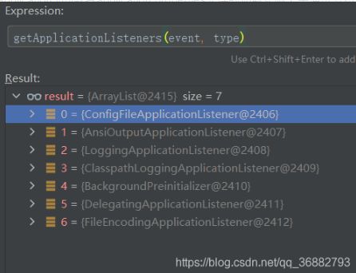
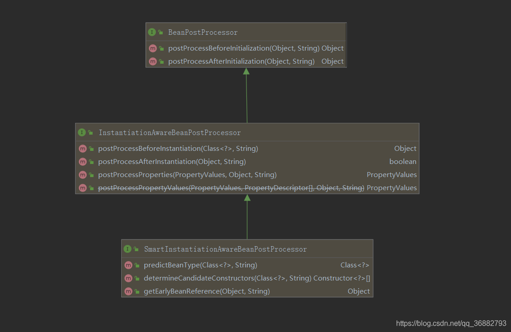

# SpringBoot 流程

## 概述

1. Spring 允许自定初始化器
2. Spring 允许自定义监听器
3. 但是Spring 不允许自定义容器启动时的监听器所监听的事件
4. Spring 的核心在与利用 BeanFactory 创建 IOC 容器，实现对于程序中需要使用的Bean进行托管，具体方法在Refreash中


## 启动

~~~java
@EnableFeignClients
@EnableDiscoveryClient
@ComponentScan(basePackages = {"com.krest"})
@SpringBootApplication(exclude={DataSourceAutoConfiguration.class})
@RibbonClient(name = "service02-mybatis-plus", configuration= MySelfRule.class)
@EnableAspectJAutoProxy     // 开启Aop功能
public class Service06_cloud {
    public static void main(String[] args) {
        // 使用Spring框架入口
        SpringApplication.run(Service06_cloud.class,args);
    }
}
~~~

## 创建SpringApplication对象

~~~java
public static ConfigurableApplicationContext run(Class<?> primarySource, String... args) {
    return run(new Class<?>[] { primarySource }, args);
}

// 启动Spring项目
public static ConfigurableApplicationContext run(Class<?>[] primarySources, String[] args) {
    return new SpringApplication(primarySources).run(args);
}


// 加载资源
public SpringApplication(ResourceLoader resourceLoader, Class<?>... primarySources) {
    this.resourceLoader = resourceLoader;
    Assert.notNull(primarySources, "PrimarySources must not be null");
    this.primarySources = new LinkedHashSet<>(Arrays.asList(primarySources));
    this.webApplicationType = WebApplicationType.deduceFromClasspath();
    // 获得初始化器
    setInitializers((Collection) getSpringFactoriesInstances(ApplicationContextInitializer.class));
    // 设置监听器
    setListeners((Collection) getSpringFactoriesInstances(ApplicationListener.class));
    this.mainApplicationClass = deduceMainApplicationClass();
}


~~~


### 主要属性

~~~java
// 答应标志
private Banner banner;
// 资源加载器
private ResourceLoader resourceLoader;
private ConfigurableEnvironment environment;
// 启动类型
private WebApplicationType webApplicationType;
// 初始化器
private List<ApplicationContextInitializer<?>> initializers;
// 监听器
private List<ApplicationListener<?>> listeners;
private boolean lazyInitialization = false;
~~~

#### WebApplicationType

```java
public enum WebApplicationType {
   NONE,
   SERVLET,
   REACTIVE;
```

#### ConfigurableEnvironment

~~~java
public interface ConfigurableEnvironment extends Environment, ConfigurablePropertyResolver{}
~~~


### 获取启动类型

1. 获取启动类型
2. 默认是SERVLET类型

~~~java
static WebApplicationType deduceFromClasspath() {
   
    if (ClassUtils.isPresent(WEBFLUX_INDICATOR_CLASS, null) && !ClassUtils.isPresent(WEBMVC_INDICATOR_CLASS, null)
        && !ClassUtils.isPresent(JERSEY_INDICATOR_CLASS, null)) {
        return WebApplicationType.REACTIVE;
    }
    for (String className : SERVLET_INDICATOR_CLASSES) {
        if (!ClassUtils.isPresent(className, null)) {
            return WebApplicationType.NONE;
        }
    }
    return WebApplicationType.SERVLET;
}

~~~


### 获取初始化器

#### 主要代码

~~~java
setInitializers((Collection) getSpringFactoriesInstances(ApplicationContextInitializer.class));
~~~

#### 配置文件

~~~bash
# Application Context Initializers
org.springframework.context.ApplicationContextInitializer=\
org.springframework.boot.context.ConfigurationWarningsApplicationContextInitializer,\
org.springframework.boot.context.ContextIdApplicationContextInitializer,\
org.springframework.boot.context.config.DelegatingApplicationContextInitializer,\
org.springframework.boot.rsocket.context.RSocketPortInfoApplicationContextInitializer,\
org.springframework.boot.web.context.ServerPortInfoApplicationContextInitializer
~~~


### 获取监听器

#### 主要代码

~~~java
setListeners((Collection) getSpringFactoriesInstances(ApplicationListener.class));
~~~

#### 配置文件

~~~properties
org.springframework.context.ApplicationListener=\
org.springframework.boot.ClearCachesApplicationListener,\
org.springframework.boot.builder.ParentContextCloserApplicationListener,\
org.springframework.boot.context.FileEncodingApplicationListener,\
org.springframework.boot.context.config.AnsiOutputApplicationListener,\
org.springframework.boot.context.config.ConfigFileApplicationListener,\
org.springframework.boot.context.config.DelegatingApplicationListener,\
org.springframework.boot.context.logging.ClasspathLoggingApplicationListener,\
org.springframework.boot.context.logging.LoggingApplicationListener,\
org.springframework.boot.liquibase.LiquibaseServiceLocatorApplicationListener
~~~


## SpringBoot.run()

### 主要流程

~~~java
public ConfigurableApplicationContext run(String... args) {
    StopWatch stopWatch = new StopWatch();
    stopWatch.start();
    // 上下文配置
    ConfigurableApplicationContext context = null;
   // 初始化异常报告类
    Collection<SpringBootExceptionReporter> exceptionReporters = new ArrayList<>();
    configureHeadlessProperty();
    // 监听器启动事件
    SpringApplicationRunListeners listeners = getRunListeners(args);
    listeners.starting();
    try {
        // 准备环境启动
        ApplicationArguments applicationArguments = new DefaultApplicationArguments(args);
        ConfigurableEnvironment environment = prepareEnvironment(listeners, applicationArguments);
        configureIgnoreBeanInfo(environment);
        // 打印Banner
        Banner printedBanner = printBanner(environment);
        context = createApplicationContext();
        // 获取异常类的监听器
        exceptionReporters = getSpringFactoriesInstances(SpringBootExceptionReporter.class,
                                                         new Class[] { ConfigurableApplicationContext.class }, context);
        // 准备上下文
        prepareContext(context, environment, listeners, applicationArguments, printedBanner);
        // 刷新上下文
        refreshContext(context);
        afterRefresh(context, applicationArguments);
        // 停止计时
        stopWatch.stop();
        if (this.logStartupInfo) {
            new StartupInfoLogger(this.mainApplicationClass).logStarted(getApplicationLog(), stopWatch);
        }
        // 监听器启动事件
        listeners.started(context);
        callRunners(context, applicationArguments);
    }
    catch (Throwable ex) {
        handleRunFailure(context, ex, exceptionReporters, listeners);
        throw new IllegalStateException(ex);
    }

    try {
        listeners.running(context);
    }
    catch (Throwable ex) {
        handleRunFailure(context, ex, exceptionReporters, null);
        throw new IllegalStateException(ex);
    }
    // 返回上下文
    return context;
}

~~~


### 返回类型 ConfigurableApplicationContext

~~~java
// 继承自 ApplicationContext
public interface ConfigurableApplicationContext extends ApplicationContext, Lifecycle, Closeable{}
~~~

#### ApplicationContext

```java
public interface ApplicationContext extends EnvironmentCapable, ListableBeanFactory, HierarchicalBeanFactory,
      MessageSource, ApplicationEventPublisher, ResourcePatternResolver {}
```

##### Environment

~~~java
public interface EnvironmentCapable {
	Environment getEnvironment();
}
~~~

~~~java
public interface Environment extends PropertyResolver {
	String[] getActiveProfiles();
	String[] getDefaultProfiles();
	@Deprecated
	boolean acceptsProfiles(String... profiles);
	boolean acceptsProfiles(Profiles profiles);

}
~~~

##### ListableBeanFactory

~~~java
public interface ListableBeanFactory extends BeanFactory {
    boolean containsBeanDefinition(String var1);
    int getBeanDefinitionCount();
    String[] getBeanDefinitionNames();
    String[] getBeanNamesForType(ResolvableType var1);
    String[] getBeanNamesForType(ResolvableType var1, boolean var2, boolean var3);
    String[] getBeanNamesForType(@Nullable Class<?> var1);
    String[] getBeanNamesForType(@Nullable Class<?> var1, boolean var2, boolean var3);
    <T> Map<String, T> getBeansOfType(@Nullable Class<T> var1) throws BeansException;
    <T> Map<String, T> getBeansOfType(@Nullable Class<T> var1, boolean var2, boolean var3) throws BeansException;
    String[] getBeanNamesForAnnotation(Class<? extends Annotation> var1);
    Map<String, Object> getBeansWithAnnotation(Class<? extends Annotation> var1) throws BeansException;
    @Nullable
    <A extends Annotation> A findAnnotationOnBean(String var1, Class<A> var2) throws NoSuchBeanDefinitionException;
}
~~~

##### HierarchicalBeanFactory

~~~java
public interface HierarchicalBeanFactory extends BeanFactory {
    @Nullable
    BeanFactory getParentBeanFactory();
    boolean containsLocalBean(String var1);
}
~~~

##### MessageSource

~~~java
public interface MessageSource {
	@Nullable
	String getMessage(String code, @Nullable Object[] args, @Nullable String defaultMessage, Locale locale);
	String getMessage(String code, @Nullable Object[] args, Locale locale) throws NoSuchMessageException;
	String getMessage(MessageSourceResolvable resolvable, Locale locale) throws NoSuchMessageException;
}

~~~

##### ApplicationEventPublisher

~~~java
@FunctionalInterface
public interface ApplicationEventPublisher {
	default void publishEvent(ApplicationEvent event) {
		publishEvent((Object) event);
    }
	void publishEvent(Object event);
}

~~~

##### ResourcePatternResolver

```
public interface ResourcePatternResolver extends ResourceLoader {
   String CLASSPATH_ALL_URL_PREFIX = "classpath*:";
   Resource[] getResources(String locationPattern) throws IOException;

}
```


###  StopWatch- 开始计时

#### start

~~~java
// 开始计时
public void start(String taskName) throws IllegalStateException {
    if (this.currentTaskName != null) {
        throw new IllegalStateException("Can't start StopWatch: it's already running");
    }
    this.currentTaskName = taskName;
    this.startTimeNanos = System.nanoTime();
}
~~~


#### stop

~~~java
// 记录停止时间，也就是整个任务启动花费了多少时间
public void stop() throws IllegalStateException {
    if (this.currentTaskName == null) {
        throw new IllegalStateException("Can't stop StopWatch: it's not running");
    }
    long lastTime = System.nanoTime() - this.startTimeNanos;
    this.totalTimeNanos += lastTime;
    this.lastTaskInfo = new TaskInfo(this.currentTaskName, lastTime);
    if (this.keepTaskList) {
        this.taskList.add(this.lastTaskInfo);
    }
    ++this.taskCount;
    this.currentTaskName = null;
}
~~~


 ### SpringBootExceptionReporter-异常播报

#### 类结构

~~~java
// 记录失败的内容
public class FailureAnalysis {
	private final String description;
	private final String action;
	private final Throwable cause;
}
~~~

#### 从配置文件中加载错误的报告类

~~~java
private boolean report(FailureAnalysis analysis, ClassLoader classLoader) {
    List<FailureAnalysisReporter> reporters = SpringFactoriesLoader.loadFactories(FailureAnalysisReporter.class,
                                                                                  classLoader);
    if (analysis == null || reporters.isEmpty()) {
        return false;
    }
    // 如果存在异常就打印异常
    for (FailureAnalysisReporter reporter : reporters) {
        reporter.report(analysis);
    }
    return true;
}
~~~

~~~bash
# FailureAnalysisReporters
org.springframework.boot.diagnostics.FailureAnalysisReporter=\
org.springframework.boot.diagnostics.LoggingFailureAnalysisReporter
~~~

#### 打印异常

通过日志打印异常

~~~java
@Override
public void report(FailureAnalysis failureAnalysis) {
    if (logger.isDebugEnabled()) {
        logger.debug("Application failed to start due to an exception", failureAnalysis.getCause());
    }
    if (logger.isErrorEnabled()) {
        logger.error(buildMessage(failureAnalysis));
    }
}
~~~


#### Catch中handle异常

~~~java
private void handleRunFailure(ConfigurableApplicationContext context, Throwable exception,
                              Collection<SpringBootExceptionReporter> exceptionReporters, SpringApplicationRunListeners listeners) {
    try {
        try {
            handleExitCode(context, exception);
            if (listeners != null) {
                listeners.failed(context, exception);
            }
        }
        finally {
            reportFailure(exceptionReporters, exception);
            if (context != null) {
                context.close();
            }
        }
    }
    catch (Exception ex) {
        logger.warn("Unable to close ApplicationContext", ex);
    }
    ReflectionUtils.rethrowRuntimeException(exception);
}

~~~


#### 集体打印异常

~~~java
private void reportFailure(Collection<SpringBootExceptionReporter> exceptionReporters, Throwable failure) {
    try {
        for (SpringBootExceptionReporter reporter : exceptionReporters) {
            if (reporter.reportException(failure)) {
                registerLoggedException(failure);
                return;
            }
        }
    }
    catch (Throwable ex) {
        // Continue with normal handling of the original failure
    }
    if (logger.isErrorEnabled()) {
        logger.error("Application run failed", failure);
        registerLoggedException(failure);
    }
}

~~~


### Listeners.Start

#### 监听器启动

~~~java

void starting() {
    for (SpringApplicationRunListener listener : this.listeners) {
        listener.starting();
    }
}
~~~


#### 广播事件

添加监听器到广播器，然后广播时间

~~~java

public EventPublishingRunListener(SpringApplication application, String[] args) {
    this.application = application;
    this.args = args;
    this.initialMulticaster = new SimpleApplicationEventMulticaster();
    for (ApplicationListener<?> listener : application.getListeners()) {
        this.initialMulticaster.addApplicationListener(listener);
    }
}

// SimpleApplicationEventMulticaster 发布应用启动事件
public void starting() {
    this.initialMulticaster.multicastEvent(new ApplicationStartingEvent(this.application, this.args));
}


// 开始广播
@Override
public void multicastEvent(ApplicationEvent event) {
    multicastEvent(event, resolveDefaultEventType(event));
}


// 广播
@Override
public void multicastEvent(final ApplicationEvent event, @Nullable ResolvableType eventType) {
    ResolvableType type = (eventType != null ? eventType : resolveDefaultEventType(event));
    Executor executor = getTaskExecutor();
    for (ApplicationListener<?> listener : getApplicationListeners(event, type)) {
        if (executor != null) {
            executor.execute(() -> invokeListener(listener, event));
        }
        else {
            invokeListener(listener, event);
        }
    }
}

//调用监听器发布事件
protected void invokeListener(ApplicationListener<?> listener, ApplicationEvent event) {
    ErrorHandler errorHandler = getErrorHandler();
    if (errorHandler != null) {
        try {
            doInvokeListener(listener, event);
        }
        catch (Throwable err) {
            errorHandler.handleError(err);
        }
    }
    else {
        doInvokeListener(listener, event);
    }
}


~~~


#### 依次通过监听器发布事件

~~~java
@SuppressWarnings({"rawtypes", "unchecked"})
private void doInvokeListener(ApplicationListener listener, ApplicationEvent event) {
    try {
        // 各个监听器会调用这个方法对事件进行发布
        listener.onApplicationEvent(event);
    }
    catch (ClassCastException ex) {
        String msg = ex.getMessage();
        if (msg == null || matchesClassCastMessage(msg, event.getClass())) {
            // Possibly a lambda-defined listener which we could not resolve the generic event type for
            // -> let's suppress the exception and just log a debug message.
            Log logger = LogFactory.getLog(getClass());
            if (logger.isTraceEnabled()) {
                logger.trace("Non-matching event type for listener: " + listener, ex);
            }
        }
        else {
            throw ex;
        }
    }
}
~~~


### environment

#### 主要作用

1. 确认运行环境
2. 获取环境变量
3. 加载配置文件

#### 准备程序运行的环境

~~~java
private ConfigurableEnvironment prepareEnvironment(SpringApplicationRunListeners listeners,
                                                   ApplicationArguments applicationArguments) {
    // Create and configure the environment
    // 确认启动的环境为Serverlet
    ConfigurableEnvironment environment = getOrCreateEnvironment();
    configureEnvironment(environment, applicationArguments.getSourceArgs());
    ConfigurationPropertySources.attach(environment);
    // 监听器发布环境准备事件
    listeners.environmentPrepared(environment);
    bindToSpringApplication(environment);
    if (!this.isCustomEnvironment) {
        environment = new EnvironmentConverter(getClassLoader()).convertEnvironmentIfNecessary(environment,
                                                                                               deduceEnvironmentClass());
    }
    ConfigurationPropertySources.attach(environment);
    return environment;
}

~~~

#### 确定程序运行环境

~~~java
private ConfigurableEnvironment getOrCreateEnvironment() {
    if (this.environment != null) {
        return this.environment;
    }
    switch (this.webApplicationType) {
        // 默认为 ServerLet 运行环境
        case SERVLET:
            return new StandardServletEnvironment();
        case REACTIVE:
            return new StandardReactiveWebEnvironment();
        default:
            return new StandardEnvironment();
    }
}
~~~

#### 配置程序运行环境 

#### ConfigurableEnvironment


##### StandardServletEnvironment

###### 继承与实现关系

我们先看看StandardServletEnvironment的继承关系，最上面是从AbstractEnvironment继承来的：


#### 监听器广播环境准备事件-加载配置文件

​		在 listeners.environmentPrepared(environment); 时会发送环境准备事件，环境准备事件要通知七个监听器如下图。对于 Springboot 的配置文件application.yml或者application.properties文件的加载实际上是通过发布环境准备事件完成的，完成这项功能的就是 ConfigFileApplicationListener。




### 打印Banner

#### 入口

~~~java
private Banner printBanner(ConfigurableEnvironment environment) {
    // 判断是否打印Banner
    if (this.bannerMode == Banner.Mode.OFF) {
        return null;
    }
    // 选择资源加载器
    ResourceLoader resourceLoader = (this.resourceLoader != null) ? this.resourceLoader
        : new DefaultResourceLoader(getClassLoader());
    // 创建spring Banner对象
    SpringApplicationBannerPrinter bannerPrinter = new SpringApplicationBannerPrinter(resourceLoader, this.banner);
    
    if (this.bannerMode == Mode.LOG) {
        return bannerPrinter.print(environment, this.mainApplicationClass, logger);
    }
    // 执行打印
    return bannerPrinter.print(environment, this.mainApplicationClass, System.out);
}
~~~

 #### 打印 Banner

~~~java
Banner print(Environment environment, Class<?> sourceClass, Log logger) {
    // 获取banner
    Banner banner = getBanner(environment);
    try {
        // 使用日志的方式创建String
        logger.info(createStringFromBanner(banner, environment, sourceClass));
    }
    catch (UnsupportedEncodingException ex) {
        logger.warn("Failed to create String for banner", ex);
    }
 	// 放回需要打印的 banner 对象   
    return new PrintedBanner(banner, sourceClass);
}
~~~

#### 获取 Banner

~~~~java
// 默认的banner
private static final Banner DEFAULT_BANNER = new SpringBootBanner();

private Banner getBanner(Environment environment) {
    Banners banners = new Banners();
    // 图片banner
    banners.addIfNotNull(getImageBanner(environment));
    // 文字bannner
    banners.addIfNotNull(getTextBanner(environment));
    // 如果有不止一个banner，那么就返回 Banner 对象
    if (banners.hasAtLeastOneBanner()) {
        return banners;
    }
    if (this.fallbackBanner != null) {
        return this.fallbackBanner;
    }
	// 如果没有指定的Banner，那么就返回默认的banner 
    return DEFAULT_BANNER;
}
~~~~

#### 默认 Banner

~~~java
class SpringBootBanner implements Banner {

	private static final String[] BANNER = { "", "  .   ____          _            __ _ _",
			" /\\\\ / ___'_ __ _ _(_)_ __  __ _ \\ \\ \\ \\", "( ( )\\___ | '_ | '_| | '_ \\/ _` | \\ \\ \\ \\",
			" \\\\/  ___)| |_)| | | | | || (_| |  ) ) ) )", "  '  |____| .__|_| |_|_| |_\\__, | / / / /",
			" =========|_|==============|___/=/_/_/_/" };

	private static final String SPRING_BOOT = " :: Spring Boot :: ";

	private static final int STRAP_LINE_SIZE = 42;

}
~~~


### 创建上下文环境

+ 很明显，因为我们知道 webApplicationType 值是 servlet，所以这里创建的是`AnnotationConfigServletWebServerApplicationContext` 类型的上下文
+ 这里需要注意：AnnotationConfigServletWebServerApplicationContext 构造函数中会创建 AnnotatedBeanDefinitionReader。而在 AnnotatedBeanDefinitionReader 构造函数中会调用 AnnotationConfigUtils.registerAnnotationConfigProcessors(this.registry);，该方法将一些必要Bean(如ConfigurationClassPostProcessor、AutowiredAnnotationBeanPostProcessor、CommonAnnotationBeanPostProcessor 等)注入到了容器中。

#### createApplicationContext

~~~java
context = createApplicationContext();

protected ConfigurableApplicationContext createApplicationContext() {
    Class<?> contextClass = this.applicationContextClass;
    if (contextClass == null) {
        try {
            switch (this.webApplicationType) {
                case SERVLET:
                    contextClass = Class.forName(DEFAULT_SERVLET_WEB_CONTEXT_CLASS);
                    break;
                case REACTIVE:
                    contextClass = Class.forName(DEFAULT_REACTIVE_WEB_CONTEXT_CLASS);
                    break;
                default:
                    contextClass = Class.forName(DEFAULT_CONTEXT_CLASS);
            }
        }
        catch (ClassNotFoundException ex) {
            throw new IllegalStateException(
                "Unable create a default ApplicationContext, please specify an ApplicationContextClass", ex);
        }
    }
    return (ConfigurableApplicationContext) BeanUtils.instantiateClass(contextClass);
}
~~~


### 准备上下文环境

#### 概述

1. 这一步已经存在了工厂Bean

#### prepareContext

~~~java
prepareContext(context, environment, listeners, applicationArguments, printedBanner);

private void prepareContext(ConfigurableApplicationContext context, ConfigurableEnvironment environment,
                            SpringApplicationRunListeners listeners, ApplicationArguments applicationArguments, Banner printedBanner) {
    // 设置运行环境
    context.setEnvironment(environment);
    // 执行容器后置处理 ： 可以注册beanName策略生成器、设置资源加载器，设置转换服务等。
    // 但这里默认是没有做任何处理。目的是留给后续可以扩展
    postProcessApplicationContext(context);
    // 执行初始化的方法
    applyInitializers(context);
    // 监听器打印上下文准备信息
    listeners.contextPrepared(context);
    if (this.logStartupInfo) {
        logStartupInfo(context.getParent() == null);
        logStartupProfileInfo(context);
    }
    // 获取bean工厂
    ConfigurableListableBeanFactory beanFactory = context.getBeanFactory();
    // 注册 springApplicationArguments等一系列bean
    beanFactory.registerSingleton("springApplicationArguments", applicationArguments);
    if (printedBanner != null) {
        // 找到 Banner Bean
        beanFactory.registerSingleton("springBootBanner", printedBanner);
    }
    // 判断是否可以属性覆盖
    if (beanFactory instanceof DefaultListableBeanFactory) {
        ((DefaultListableBeanFactory) beanFactory)
        .setAllowBeanDefinitionOverriding(this.allowBeanDefinitionOverriding);
    }
    // 判断是否是懒加载
    if (this.lazyInitialization) {
        context.addBeanFactoryPostProcessor(new LazyInitializationBeanFactoryPostProcessor());
    }
    // 这里加载的实际上是启动类
    Set<Object> sources = getAllSources();
    Assert.notEmpty(sources, "Sources must not be empty");
    load(context, sources.toArray(new Object[0]));
    // 监听器发布 上下文准备完成事件
    listeners.contextLoaded(context);
}

~~~

#### 获取BeanFactory

1. BeanFactory 就是一个Map集合，存储了许多的Class对象

~~~java
public class DefaultListableBeanFactory extends AbstractAutowireCapableBeanFactory implements ConfigurableListableBeanFactory, BeanDefinitionRegistry, Serializable {
    @Nullable
    private static Class<?> javaxInjectProviderClass;
    private static final Map<String, Reference<DefaultListableBeanFactory>> serializableFactories;
    @Nullable
    private String serializationId;
    private boolean allowBeanDefinitionOverriding = true;
    private boolean allowEagerClassLoading = true;
    @Nullable
    private Comparator<Object> dependencyComparator;
    private AutowireCandidateResolver autowireCandidateResolver = new SimpleAutowireCandidateResolver();
    private final Map<Class<?>, Object> resolvableDependencies = new ConcurrentHashMap(16);
    private final Map<String, BeanDefinition> beanDefinitionMap = new ConcurrentHashMap(256);
    private final Map<Class<?>, String[]> allBeanNamesByType = new ConcurrentHashMap(64);
    private final Map<Class<?>, String[]> singletonBeanNamesByType = new ConcurrentHashMap(64);
    private volatile List<String> beanDefinitionNames = new ArrayList(256);
    private volatile Set<String> manualSingletonNames = new LinkedHashSet(16);
    @Nullable
    private volatile String[] frozenBeanDefinitionNames;
    private volatile boolean configurationFrozen = false;
}
~~~


#### Load -> 注册工厂单例 bean 

~~~java
protected void load(ApplicationContext context, Object[] sources) {
    if (logger.isDebugEnabled()) {
        logger.debug("Loading source " + StringUtils.arrayToCommaDelimitedString(sources));
    }
    BeanDefinitionLoader loader = createBeanDefinitionLoader(getBeanDefinitionRegistry(context), sources);
    if (this.beanNameGenerator != null) {
        loader.setBeanNameGenerator(this.beanNameGenerator);
    }
    if (this.resourceLoader != null) {
        loader.setResourceLoader(this.resourceLoader);
    }
    if (this.environment != null) {
        loader.setEnvironment(this.environment);
    }
    loader.load();
}

// 实际执行
int load() {
    int count = 0;
    for (Object source : this.sources) {
        count += load(source);
    }
    return count;
}

// 加载所有的资源
private int load(Object source) {
    Assert.notNull(source, "Source must not be null");
    if (source instanceof Class<?>) {
        return load((Class<?>) source);
    }
    if (source instanceof Resource) {
        return load((Resource) source);
    }
    if (source instanceof Package) {
        return load((Package) source);
    }
    if (source instanceof CharSequence) {
        return load((CharSequence) source);
    }
    throw new IllegalArgumentException("Invalid source type " + source.getClass());
}
~~~


#### load Class

注册启动类BeanClass

~~~java
private int load(Class<?> source) {
    // 判断是否存在 groovy 加载方式
    if (isGroovyPresent() && GroovyBeanDefinitionSource.class.isAssignableFrom(source)) {
        GroovyBeanDefinitionSource loader = BeanUtils.instantiateClass(source, GroovyBeanDefinitionSource.class);
        load(loader);
    }

    // 判断是否是Component Class
    if (isComponent(source)) {
        this.annotatedReader.register(source);
        return 1;
    }
    return 0;
}


private boolean isComponent(Class<?> type) {
    if (MergedAnnotations.from(type, SearchStrategy.TYPE_HIERARCHY).isPresent(Component.class)) {
        return true;
    }
    return !type.getName().matches(".*\\$_.*closure.*") && !type.isAnonymousClass()
        && type.getConstructors() != null && type.getConstructors().length != 0;
}

// 注册 组件bean
public void register(Class<?>... componentClasses) {
    for (Class<?> componentClass : componentClasses) {
        registerBean(componentClass);
    }
}

// 注册 bean
public void registerBean(Class<?> beanClass) {
    doRegisterBean(beanClass, null, null, null, null);
}

// 这里的 beanClass 其实就是启动类的 beanClass 
private <T> void doRegisterBean(Class<T> beanClass, @Nullable String name,
                                @Nullable Class<? extends Annotation>[] qualifiers, @Nullable Supplier<T> supplier,
                                @Nullable BeanDefinitionCustomizer[] customizers) {

    AnnotatedGenericBeanDefinition abd = new AnnotatedGenericBeanDefinition(beanClass);
    if (this.conditionEvaluator.shouldSkip(abd.getMetadata())) {
        return;
    }

    abd.setInstanceSupplier(supplier);
    ScopeMetadata scopeMetadata = this.scopeMetadataResolver.resolveScopeMetadata(abd);
    // 设置作用域
    abd.setScope(scopeMetadata.getScopeName());
    String beanName = (name != null ? name : this.beanNameGenerator.generateBeanName(abd, this.registry));

    AnnotationConfigUtils.processCommonDefinitionAnnotations(abd);
    // 判断相关属性
    if (qualifiers != null) {
        for (Class<? extends Annotation> qualifier : qualifiers) {
            if (Primary.class == qualifier) {
                abd.setPrimary(true);
            }
            else if (Lazy.class == qualifier) {
                abd.setLazyInit(true);
            }
            else {
                abd.addQualifier(new AutowireCandidateQualifier(qualifier));
            }
        }
    }
    if (customizers != null) {
        for (BeanDefinitionCustomizer customizer : customizers) {
            customizer.customize(abd);
        }
    }

    BeanDefinitionHolder definitionHolder = new BeanDefinitionHolder(abd, beanName);
    definitionHolder = AnnotationConfigUtils.applyScopedProxyMode(scopeMetadata, definitionHolder, this.registry);
    BeanDefinitionReaderUtils.registerBeanDefinition(definitionHolder, this.registry);
}


public static void registerBeanDefinition(BeanDefinitionHolder definitionHolder, BeanDefinitionRegistry registry) throws BeanDefinitionStoreException {
    String beanName = definitionHolder.getBeanName();
    registry.registerBeanDefinition(beanName, definitionHolder.getBeanDefinition());
    String[] aliases = definitionHolder.getAliases();
    if (aliases != null) {
        String[] var4 = aliases;
        int var5 = aliases.length;

        for(int var6 = 0; var6 < var5; ++var6) {
            String alias = var4[var6];
            registry.registerAlias(beanName, alias);
        }
    }
}

~~~

#### 监听器执行

最终执行的是监听器的 onApplicationEvent 方法


### 刷新上下文环境--Spring容器负责

#### 概述

1. prepareRefresh ： 初始化前的准备工作，例如对系统属性或者环境变量进行准备及验证。在某些情况下项目的使用需要读取某些系统变量，那么在启动时候，就可以通过准备函数来进行参数的校验。

2. obtainFreshBeanFactory ：初始化BeanFactory，并进行XML 文件读取（如果需要的话）。 这一步之后ApplicationContext就具有BeanFactory 所提供的功能，也就是可以进行Bean的提取等基础操作了。

3. prepareBeanFactory ：对BeanFactory 进行各种功能填充。

4. postProcessBeanFactory ： 对 BeanFactory 做额外处理。默认没有实现

5. invokeBeanFactoryPostProcessors ： 激活各种BeanFactory 处理器(调用了各种BeanFactoryPostProcessor)。其中最为关键的是 

   ConfigurationClassPostProcessor ，在这里完成了配置类的解析，生成的注入容器中的bean 的 BeanDefinition。

6. registerBeanPostProcessors ：注册和创建拦截bean创建的bean处理器。BeanPostProcessor 在这一步已经完成了创建。

7. initMessageSource ：为上下文初始化Message 源，即对不同语言的消息体进行国际化处理

8. initApplicationEventMulticaster ：初始化应用消息广播器，并放入"applicationEventMulticaster" bean 中

9. onRefresh ：留给子类来初始化其他bean

10. registerListeners ：在所有注册的bean中查找listener bean，注册到消息广播器中

11. finishBeanFactoryInitialization ：初始化剩下的实例(非惰性)，在这里调用了getBean方法，创建了非惰性的bean实例

12. finishRefresh ：完成刷新过程，通知生命周期处理器 lifecycleProcesseor 刷新过程，同时发出ContextRefreshEvent 通知别人。
    

#### refreshContext

```java
@Override
public void refresh() throws BeansException, IllegalStateException {
    synchronized (this.startupShutdownMonitor) {
        prepareRefresh();
        // 完成了BeanFactory的创建
        ConfigurableListableBeanFactory beanFactory = obtainFreshBeanFactory();
        prepareBeanFactory(beanFactory);
        try {
            // BeanFactory 后置处理器
            postProcessBeanFactory(beanFactory);
            // 注册 BeanFactory 后置处理器
            invokeBeanFactoryPostProcessors(beanFactory);
            // Register bean processors that intercept bean creation.
            registerBeanPostProcessors(beanFactory);
            // 初始化消息机制
            initMessageSource();
            // 初始化广播事件
            initApplicationEventMulticaster();
            // 刷新上下文Bean
            onRefresh();
            // 检查监听器
            registerListeners();
            // 完成BeanFactory初始化
            finishBeanFactoryInitialization(beanFactory);
            // 发布完成刷新事件
            finishRefresh();
        }
        catch (BeansException ex) {
			...
        }

        finally {
			// 重置
            resetCommonCaches();
        }
    }
}

```

#### obtainFreshBeanFactory

~~~java
// Tell the subclass to refresh the internal bean factory.
ConfigurableListableBeanFactory beanFactory = obtainFreshBeanFactory();

protected ConfigurableListableBeanFactory obtainFreshBeanFactory() {
    refreshBeanFactory();
    return getBeanFactory();
}

// BeanFactory 对象
public class DefaultListableBeanFactory 
    extends AbstractAutowireCapableBeanFactory
    implements ConfigurableListableBeanFactory, BeanDefinitionRegistry, Serializable {

    private final Map<String, BeanDefinition> beanDefinitionMap = new ConcurrentHashMap(256);
    private final Map<Class<?>, String[]> allBeanNamesByType = new ConcurrentHashMap(64);
    private final Map<Class<?>, String[]> singletonBeanNamesByType = new ConcurrentHashMap(64);
    private volatile List<String> beanDefinitionNames = new ArrayList(256);
    private volatile Set<String> manualSingletonNames = new LinkedHashSet(16);

}
~~~

#### prepareBeanFactory

1. 为BeanFactory增添一些配置信息
   1. 增加 SpEL 语言的支持
   2. 增加对属性编辑器的支持
   3. 增加对一些内置类，比如 EnvironmentAware、EmbeddedValueResolverAware等。
   4. 设置了依赖功能可忽略的接口
   5. 注册一些固定依赖的属性
   6. 增加 AspectJ 的支持
   7. 将相关环境变量及属性注册以单例模式注册

~~~java
protected void prepareBeanFactory(ConfigurableListableBeanFactory beanFactory) {
    // Tell the internal bean factory to use the context's class loader etc.
    // 设置当前beanFactory 的classLoader 为当前context 的classLoader
    beanFactory.setBeanClassLoader(getClassLoader());
    // 设置beanFactory 的表达式语言处理器，Spring3 增加了表达式语言的支持
    // 默认可以使用 #{bean.xxx}的形式来调用处理相关属性。
    beanFactory.setBeanExpressionResolver(new StandardBeanExpressionResolver(beanFactory.getBeanClassLoader()));
    // 为beanFactory 增加一个默认的propertyEditor，这个主要是针对bean的属性等设置管理的一个工具
    beanFactory.addPropertyEditorRegistrar(new ResourceEditorRegistrar(this, getEnvironment()));

    // Configure the bean factory with context callbacks.
    // 添加BeanPostProcessor
    beanFactory.addBeanPostProcessor(new ApplicationContextAwareProcessor(this));
    // 设置了几个忽略自动装配的接口
    beanFactory.ignoreDependencyInterface(EnvironmentAware.class);
    beanFactory.ignoreDependencyInterface(EmbeddedValueResolverAware.class);
    beanFactory.ignoreDependencyInterface(ResourceLoaderAware.class);
    beanFactory.ignoreDependencyInterface(ApplicationEventPublisherAware.class);
    beanFactory.ignoreDependencyInterface(MessageSourceAware.class);
    beanFactory.ignoreDependencyInterface(ApplicationContextAware.class);

    // BeanFactory interface not registered as resolvable type in a plain factory.
    // MessageSource registered (and found for autowiring) as a bean.
    // 设置了几个自动装配的特殊规则
    beanFactory.registerResolvableDependency(BeanFactory.class, beanFactory);
    beanFactory.registerResolvableDependency(ResourceLoader.class, this);
    beanFactory.registerResolvableDependency(ApplicationEventPublisher.class, this);
    beanFactory.registerResolvableDependency(ApplicationContext.class, this);

    // Register early post-processor for detecting inner beans as ApplicationListeners.
    beanFactory.addBeanPostProcessor(new ApplicationListenerDetector(this));

    // Detect a LoadTimeWeaver and prepare for weaving, if found.
    // 增加对 AspectJ的支持
    if (beanFactory.containsBean(LOAD_TIME_WEAVER_BEAN_NAME)) {
        beanFactory.addBeanPostProcessor(new LoadTimeWeaverAwareProcessor(beanFactory));
        // Set a temporary ClassLoader for type matching.
        beanFactory.setTempClassLoader(new ContextTypeMatchClassLoader(beanFactory.getBeanClassLoader()));
    }

    // Register default environment beans.
    // 添加默认的系统环境bean
    if (!beanFactory.containsLocalBean(ENVIRONMENT_BEAN_NAME)) {
        beanFactory.registerSingleton(ENVIRONMENT_BEAN_NAME, getEnvironment());
    }
    if (!beanFactory.containsLocalBean(SYSTEM_PROPERTIES_BEAN_NAME)) {
        beanFactory.registerSingleton(SYSTEM_PROPERTIES_BEAN_NAME, getEnvironment().getSystemProperties());
    }
    if (!beanFactory.containsLocalBean(SYSTEM_ENVIRONMENT_BEAN_NAME)) {
        beanFactory.registerSingleton(SYSTEM_ENVIRONMENT_BEAN_NAME, getEnvironment().getSystemEnvironment());
    }
}
~~~


#### initMessageSource

~~~java
protected void initMessageSource() {
    ConfigurableListableBeanFactory beanFactory = getBeanFactory();
    if (beanFactory.containsLocalBean(MESSAGE_SOURCE_BEAN_NAME)) {
        this.messageSource = beanFactory.getBean(MESSAGE_SOURCE_BEAN_NAME, MessageSource.class);
        // Make MessageSource aware of parent MessageSource.
        if (this.parent != null && this.messageSource instanceof HierarchicalMessageSource) {
            HierarchicalMessageSource hms = (HierarchicalMessageSource) this.messageSource;
            if (hms.getParentMessageSource() == null) {
                // Only set parent context as parent MessageSource if no parent MessageSource
                // registered already.
                hms.setParentMessageSource(getInternalParentMessageSource());
            }
        }
        if (logger.isTraceEnabled()) {
            logger.trace("Using MessageSource [" + this.messageSource + "]");
        }
    }
    else {
        // Use empty MessageSource to be able to accept getMessage calls.
        DelegatingMessageSource dms = new DelegatingMessageSource();
        dms.setParentMessageSource(getInternalParentMessageSource());
        this.messageSource = dms;
        beanFactory.registerSingleton(MESSAGE_SOURCE_BEAN_NAME, this.messageSource);
        if (logger.isTraceEnabled()) {
            logger.trace("No '" + MESSAGE_SOURCE_BEAN_NAME + "' bean, using [" + this.messageSource + "]");
        }
    }
}

~~~

#### postProcessBeanFactory

1. 没有默认实现

~~~~java
protected void postProcessBeanFactory(ConfigurableListableBeanFactory beanFactory) {
}
~~~~


#### invokeBeanFactoryPostProcessors

1. BeanFactory 作为Spring中容器功能的基础，用于存放所有已经加载的bean，为了保证程序的可扩展性，Spring 针对BeanFactory 做了大量的扩展，如PostProcessor。
2. 和BeanPostProcessor原理一致，Spring提供了对BeanFactory进行操作的处理器BeanFactoryProcessor，简单来说就是获取容器BeanFactory，这样就可以在真正初始化bean之前对bean做一些处理操作。
3. 这一步的功能主要是激活各种 BeanFactoryPostProcessors。

```java
// Invoke factory processors registered as beans in the context.
invokeBeanFactoryPostProcessors(beanFactory);
```


#### registerBeanPostProcessors(beanFactory);

+ `registerBeanPostProcessors` 将 BeanPostProcessor 初始化后并将其 保存到了AbstractBeanFactory#beanPostProcessors，方便之后对 BeanPostProcessor 的调用。
+ 相较于invokeBeanFactoryPostProcessors 方法，这里并没有考虑打硬编码的后处理器的顺序问题。其原因在于invokeBeanFactoryPostProcessors 中不仅要实现BeanFactoryPostProcessor的注册功能，还需要完成激活（执行对应方法）操作，所以需要载入配置中的定义并进行激活。而对于BeanPostProcessor 并不需要马上调用，并且硬编码方式实现的功能是将后处理器提取并调用，这里了并不需要调用，所以不需要考虑硬编码问题。这里只需要将配置文件中的BeanPostProcessor 创建之后出来并注册进行BeanFactory 中即可。需要注意 ： 这里虽然没有调用 BeanPostProcessor，但是 BeanPostProcessor 的实例已经通过 beanFactory.getBean 创建完成。

下面来看看代码：

~~~java
public static void registerBeanPostProcessors(
    ConfigurableListableBeanFactory beanFactory, AbstractApplicationContext applicationContext) {
    // 获取所有后处理器的name
    String[] postProcessorNames = beanFactory.getBeanNamesForType(BeanPostProcessor.class, true, false);

    // Register BeanPostProcessorChecker that logs an info message when
    // a bean is created during BeanPostProcessor instantiation, i.e. when
    // a bean is not eligible for getting processed by all BeanPostProcessors.
    int beanProcessorTargetCount = beanFactory.getBeanPostProcessorCount() + 1 + postProcessorNames.length;
    // BeanPostProcessorChecker 是一个普通的信息打印
    //可能会有些情况当Spring 的配置中的后处理器还没有被注册就已经开始了bean的实例化，便会打印出BeanPostProcessorChecker 中设定的信息
    beanFactory.addBeanPostProcessor(new BeanPostProcessorChecker(beanFactory, beanProcessorTargetCount));

    // Separate between BeanPostProcessors that implement PriorityOrdered,
    // Ordered, and the rest.
    // 保存实现了PriorityOrderd 接口的 后处理器
    List<BeanPostProcessor> priorityOrderedPostProcessors = new ArrayList<>();
    // 保存MergedBeanDefinitionPostProcessor 后处理器
    List<BeanPostProcessor> internalPostProcessors = new ArrayList<>();	
    // 保存实现了Orderd 接口的 后处理器
    List<String> orderedPostProcessorNames = new ArrayList<>();
    // 保存没有实现任何排序接口的后处理器
    List<String> nonOrderedPostProcessorNames = new ArrayList<>();
    // 按照规则筛选出不同的后处理器保存到集合中
    for (String ppName : postProcessorNames) {
        if (beanFactory.isTypeMatch(ppName, PriorityOrdered.class)) {

            BeanPostProcessor pp = beanFactory.getBean(ppName, BeanPostProcessor.class);
            priorityOrderedPostProcessors.add(pp);
            if (pp instanceof MergedBeanDefinitionPostProcessor) {
                internalPostProcessors.add(pp);
            }
        }
        else if (beanFactory.isTypeMatch(ppName, Ordered.class)) {
            orderedPostProcessorNames.add(ppName);
        }
        else {
            nonOrderedPostProcessorNames.add(ppName);
        }
    }

    // First, register the BeanPostProcessors that implement PriorityOrdered.
    // 对实现了PriorityOrderd 接口的 后处理器 进行排序
    sortPostProcessors(priorityOrderedPostProcessors, beanFactory);
    // 注册，实际上就是保存到 AbstractBeanFactory#beanPostProcessors 集合中。在getBean使用的时候直接拿取该属性即可
    registerBeanPostProcessors(beanFactory, priorityOrderedPostProcessors);

    // Next, register the BeanPostProcessors that implement Ordered.
    // 下面逻辑类似
    List<BeanPostProcessor> orderedPostProcessors = new ArrayList<>(orderedPostProcessorNames.size());
    for (String ppName : orderedPostProcessorNames) {
        BeanPostProcessor pp = beanFactory.getBean(ppName, BeanPostProcessor.class);
        orderedPostProcessors.add(pp);
        if (pp instanceof MergedBeanDefinitionPostProcessor) {
            internalPostProcessors.add(pp);
        }
    }
    sortPostProcessors(orderedPostProcessors, beanFactory);
    registerBeanPostProcessors(beanFactory, orderedPostProcessors);

    // Now, register all regular BeanPostProcessors.
    List<BeanPostProcessor> nonOrderedPostProcessors = new ArrayList<>(nonOrderedPostProcessorNames.size());
    for (String ppName : nonOrderedPostProcessorNames) {
        // 创建了 BeanPostProcessor 实例
        BeanPostProcessor pp = beanFactory.getBean(ppName, BeanPostProcessor.class);
        nonOrderedPostProcessors.add(pp);
        if (pp instanceof MergedBeanDefinitionPostProcessor) {
            internalPostProcessors.add(pp);
        }
    }
    registerBeanPostProcessors(beanFactory, nonOrderedPostProcessors);

    // Finally, re-register all internal BeanPostProcessors.
    sortPostProcessors(internalPostProcessors, beanFactory);
    // 这里并不是重复注册， registerBeanPostProcessors 方法会先移除已存在的 BeanPostProcessor 随后重新加入。
    registerBeanPostProcessors(beanFactory, internalPostProcessors);

    // Re-register post-processor for detecting inner beans as ApplicationListeners,
    // moving it to the end of the processor chain (for picking up proxies etc).
    beanFactory.addBeanPostProcessor(new ApplicationListenerDetector(applicationContext));
}

~~~


#### initApplicationEventMulticaster

这里的作用很明显就是提取配置中定义的MessageSource，并将其记录在Spring容器中，也就是AbstractApplicationContext中。如果用户没有设置资源文件，Spring提供了默认的配置 DelegatingMessageSource。

代码逻辑也很简单：在这里Spring 通过 beanFactory.getBean(MESSAGE_SOURCE_BEAN_NAME, MessageSource.class); 来获取名称为 MESSAGE_SOURCE_BEAN_NAME (messageSource) 的bean作为 资源文件。这里也体现出了Spring “约束大于规定”的原则。

```java
protected void initMessageSource() {
    ConfigurableListableBeanFactory beanFactory = getBeanFactory();
    if (beanFactory.containsLocalBean(MESSAGE_SOURCE_BEAN_NAME)) {
        // 获取自定义资源文件。这里可以看出使用了硬编码，默认资源文件为messageSource，否则便获取不到自定义配置资源
        this.messageSource = beanFactory.getBean(MESSAGE_SOURCE_BEAN_NAME, MessageSource.class);
        // Make MessageSource aware of parent MessageSource.
        if (this.parent != null && this.messageSource instanceof HierarchicalMessageSource) {
            HierarchicalMessageSource hms = (HierarchicalMessageSource) this.messageSource;
            if (hms.getParentMessageSource() == null) {
                // Only set parent context as parent MessageSource if no parent MessageSource
                // registered already.
                hms.setParentMessageSource(getInternalParentMessageSource());
            }
        }
        if (logger.isTraceEnabled()) {
            logger.trace("Using MessageSource [" + this.messageSource + "]");
        }
    }
    else {
        // Use empty MessageSource to be able to accept getMessage calls.
        // 如果用户没有配置，则使用默认的的资源文件
        DelegatingMessageSource dms = new DelegatingMessageSource();
        dms.setParentMessageSource(getInternalParentMessageSource());
        this.messageSource = dms;
        beanFactory.registerSingleton(MESSAGE_SOURCE_BEAN_NAME, this.messageSource);
        if (logger.isTraceEnabled()) {
            logger.trace("No '" + MESSAGE_SOURCE_BEAN_NAME + "' bean, using [" + this.messageSource + "]");
        }
    }
}

```


#### onRefresh

1. 没有具体实现，用户可以自定义

~~~java
protected void onRefresh() throws BeansException {
    // For subclasses: do nothing by default.
}
~~~

#### registerListeners

1. 注册硬编码注册的监听器
2. 注册配置注册的监听器
3. 发布早先的监听事件

~~~java
protected void registerListeners() {
    // Register statically specified listeners first.
    // 硬编码方式注册的监听器处理
    for (ApplicationListener<?> listener : getApplicationListeners()) {
        getApplicationEventMulticaster().addApplicationListener(listener);
    }

    // Do not initialize FactoryBeans here: We need to leave all regular beans
    // uninitialized to let post-processors apply to them!
    // 配置文件注册的监听处理器
    String[] listenerBeanNames = getBeanNamesForType(ApplicationListener.class, true, false);
    for (String listenerBeanName : listenerBeanNames) {
        getApplicationEventMulticaster().addApplicationListenerBean(listenerBeanName);
    }

    // Publish early application events now that we finally have a multicaster...
    // 发布之前保存的需要发布的事件
    Set<ApplicationEvent> earlyEventsToProcess = this.earlyApplicationEvents;
    this.earlyApplicationEvents = null;
    if (earlyEventsToProcess != null) {
        for (ApplicationEvent earlyEvent : earlyEventsToProcess) {
            getApplicationEventMulticaster().multicastEvent(earlyEvent);
        }
    }
}

~~~


#### finishBeanFactoryInitialization-- 重点

这一步的目的是 结束BeanFactory 的初始化工作，其中包括如下几步 ：

1. 对 ConversionService 的设置。通过 ConversionService 的配置可以很轻松完成一些类型转换工作。
2. 冻结所有的bean定义 。到这一步，也就说所有的bean定义已经定型了，不可被修改了，也正式可以缓存bean的元数据了。
3. 初始化剩下的非惰性单实例。ApplicationContext 实现的默认行为就是启动时将所有单例 bean提前进行实例化。提前实例化意味着作为初始化过程的一部分，ApplicationContext 实例会创建并配置所有的单例bean。而这个实例化的过程就是在 preInstantiateSingletons 中完成的。

~~~java
protected void finishBeanFactoryInitialization(ConfigurableListableBeanFactory beanFactory) {
    // 1. 对 ConversionService 的设置
    // 如果 BeanFactory 中加载了beanName 为 ConversionService 的bean，并且类型是 ConversionService。那么将其设置为 conversionService
    if (beanFactory.containsBean(CONVERSION_SERVICE_BEAN_NAME) &&
        beanFactory.isTypeMatch(CONVERSION_SERVICE_BEAN_NAME, ConversionService.class)) {
        beanFactory.setConversionService(
            // 重点方法
            beanFactory.getBean(CONVERSION_SERVICE_BEAN_NAME, ConversionService.class));
    }
    if (!beanFactory.hasEmbeddedValueResolver()) {
        beanFactory.addEmbeddedValueResolver(strVal -> getEnvironment().resolvePlaceholders(strVal));
    }
    String[] weaverAwareNames = beanFactory.getBeanNamesForType(LoadTimeWeaverAware.class, false, false);
    // 开始调用 getBean 方法初始化LoadTimeWeaverAware 
    for (String weaverAwareName : weaverAwareNames) {
        getBean(weaverAwareName);
    }

    beanFactory.setTempClassLoader(null);

    // 2. 冻结所有的bean定义，说明注册的bean定义将不被修改或任何进一步的处理
    beanFactory.freezeConfiguration();

    // Instantiate all remaining (non-lazy-init) singletons.
    // 3. 初始化剩下的非惰性单实例
    beanFactory.preInstantiateSingletons();
}

~~~

这里我们需要特别关注一下 `DefaultListableBeanFactory#preInstantiateSingletons`，在这里面，容器创建了所有的非惰性单实例。（之所以不创建原型bean，是因为原型bean没必要进行缓存，每次使用直接创建即可）

##### getBean

###### DefaultSingletonBeanRegistry

~~~JAVA

	/** Cache of singleton objects: bean name to bean instance. */
	//	用于保存BeanName和创建bean实例之间的关系，即缓存bean。 beanname -> instance 
	private final Map<String, Object> singletonObjects = new ConcurrentHashMap<>(256);

	/** Cache of singleton factories: bean name to ObjectFactory. */
	// 用于保存BeanName和常见bean的工厂之间的关系。beanname-> ObjectFactory
	private final Map<String, ObjectFactory<?>> singletonFactories = new HashMap<>(16);

	/** Cache of early singleton objects: bean name to bean instance. */
	// 也是保存BeanName和创建bean实例之间的关系，与singletonObjects 不同的是，如果一个单例bean被保存在此，则当bean还在创建过程中(比如 A类中有B类属性，当创建A类时发现需要先创建B类，这时候Spring又跑去创建B类，A类就会添加到该集合中，表示正在创建)，就可以通过getBean方法获取到了，其目的是用来检测循环引用。
	private final Map<String, Object> earlySingletonObjects = new HashMap<>(16);

	/** Set of registered singletons, containing the bean names in registration order. */
	// 用来保存当前所有已经注册的bean
	private final Set<String> registeredSingletons = new LinkedHashSet<>(256);

	/** Names of beans that are currently in creation. */
	// 用来保存当前正在创建的Bean。也是为了解决循环依赖的问题
	private final Set<String> singletonsCurrentlyInCreation =
			Collections.newSetFromMap(new ConcurrentHashMap<>(16));

	/** Names of beans currently excluded from in creation checks. */
	// 用来保存当前从创建检查中排除的bean名称
	private final Set<String> inCreationCheckExclusions =
			Collections.newSetFromMap(new ConcurrentHashMap<>(16));

	/** List of suppressed Exceptions, available for associating related causes. */
	// 初始化过程中的异常列表
	@Nullable
	private Set<Exception> suppressedExceptions;

	/** Flag that indicates whether we're currently within destroySingletons. */
	// 标志是否在销毁BeanFactory过程中
	private boolean singletonsCurrentlyInDestruction = false;

	/** Disposable bean instances: bean name to disposable instance. */
	// 一次性bean实例：beanName -> 一次性实例。暂未明白
	private final Map<String, Object> disposableBeans = new LinkedHashMap<>();

	/** Map between containing bean names: bean name to Set of bean names that the bean contains. */
	// 包含的Bean名称之间的映射：BeanName  -> Bean包含的BeanName集合
	private final Map<String, Set<String>> containedBeanMap = new ConcurrentHashMap<>(16);

	/** Map between dependent bean names: bean name to Set of dependent bean names. */
	// bean dependent(依赖的集合) : beanName -> 依赖该beanName 的 bean，即 key代表的bean 被value 所依赖
	private final Map<String, Set<String>> dependentBeanMap = new ConcurrentHashMap<>(64);

	/** Map between depending bean names: bean name to Set of bean names for the bean's dependencies. */
	// bean 被哪些bean依赖 ：  beanName -> beanName 所依赖的 bean。即 key 依赖于value这些bean
	private final Map<String, Set<String>> dependenciesForBeanMap = new ConcurrentHashMap<>(64);

~~~

###### 重要属性

下面挑出来几个关键缓存集合来描述：

+ singletonObjects ：ConcurrentHashMap。最简单最重要的缓存Map。保存关系是 beanName ：bean实例关系。单例的bean在创建完成后都会保存在 singletonObjects 中，后续使用直接从singletonObjects 中获取。
+ singletonFactories ：HashMap。这是为了解决循环依赖问题，用于提前暴露对象，保存形式是 beanName : ObjectFactory<?>。
+ earlySingletonObjects ：HashMap。这也是为了解决循环依赖问题。和 singletonFactories 互斥。因为 singletonFactories 保存的是 ObjectFactory。而earlySingletonObjects 个人认为是 singletonFactories 更进一步的缓存，保存的是 ObjectFactory#getObject的结果。
+ registeredSingletons ：LinkedHashSet，用于保存注册过的beanName，
+ singletonsCurrentlyInCreation ： 保存当前正在创建的bean。当一个bean开始创建时将保存其beanName，创建完成后将其移除
+ dependentBeanMap ：保存bean的依赖关系，比如A对象依赖于 B对象，会出现 B ：A。即保存的是key 被value依赖
+ dependenciesForBeanMap ：保存bean的依赖关系，不过和dependentBeanMap 反了过来。A对象依赖于 B对象，会出现 A ：B。保存的是key 依赖于 value


###### getSingleton

我们拿一个简单的场景解释一下 singletonFactories 和 earlySingletonObjects 的关系 。
下面的代码是 DefaultSingletonBeanRegistry#getSingleton(java.lang.String, boolean) 。我们可以看到其判断逻辑，

1. 锁定 singletonObjects，毕竟要操作 singletonObjects
2. 从 singletonFactories 中获取 ObjectFactory 缓存
3. 如果存在 ObjectFactory 缓存，则更进一步提取ObjectFactory#getObject 的singletonObject 对象。将singletonObject 保存到 earlySingletonObjects 缓存中，同时从 singletonFactories 中移除。

~~~java
    
	// 获取了单例，同时解决了循环以来的问题
	@Nullable
    protected Object getSingleton(String beanName, boolean allowEarlyReference) {
        Object singletonObject = this.singletonObjects.get(beanName);
        if (singletonObject == null && this.isSingletonCurrentlyInCreation(beanName)) {
            synchronized(this.singletonObjects) {
                singletonObject = this.earlySingletonObjects.get(beanName);
                if (singletonObject == null && allowEarlyReference) {
                    ObjectFactory<?> singletonFactory = (ObjectFactory)this.singletonFactories.get(beanName);
                    if (singletonFactory != null) {
                        singletonObject = singletonFactory.getObject();
                        this.earlySingletonObjects.put(beanName, singletonObject);
                        this.singletonFactories.remove(beanName);
                    }
                }
            }
        }

        return singletonObject;
    }
~~~

###### doGetBean

下面我们开始进入正题，进行 `AbstractBeanFactory#doGetBean`的内容分析。这个方法是一切的核心(Bean的创建过程也是在这个方法中完成)。首先我们先来整体过一遍方法代码。后面将会对一些关键点进行详细解释。

~~~java
protected <T> T doGetBean(final String name, @Nullable final Class<T> requiredType,
                          @Nullable final Object[] args, boolean typeCheckOnly) throws BeansException {
    // 1. 提取出对应的beanName。会去除一些特殊的修饰符比如 "&"
    final String beanName = transformedBeanName(name);
    Object bean;

    // Eagerly check singleton cache for manually registered singletons.
    // 2. 尝试从缓存获取或者singletonFacotries中的ObjectFactory中获取。后续细讲
    Object sharedInstance = getSingleton(beanName);
    if (sharedInstance != null && args == null) {
        ... 打印日志
            // 3. 返回对应的实例，有时候存在诸如BeanFactory的情况并不直接返回实例本身，而是返回指定方法返回的实例。这一步主要还是针对FactoryBean的处理。
            bean = getObjectForBeanInstance(sharedInstance, name, beanName, null);
    }
    else {
        // 4. 只有单例情况才会尝试解决循环依赖，原型模式直接抛出异常。因为原型模式无法解决循环依赖问题。参考衍生篇关于循环依赖的内容
        if (isPrototypeCurrentlyInCreation(beanName)) {
            throw new BeanCurrentlyInCreationException(beanName);
        }

        // Check if bean definition exists in this factory.
        // 获取父级的 BeanFactory
        BeanFactory parentBeanFactory = getParentBeanFactory();
        // 5. 如果 beanDefinitionMap 中也就是在所有已经加载的类中不包含beanName，则尝试从parentBeanFactory中检测
        if (parentBeanFactory != null && !containsBeanDefinition(beanName)) {
            // Not found -> check parent.
            // 递归到BeanFactory中检测
            String nameToLookup = originalBeanName(name);
            if (parentBeanFactory instanceof AbstractBeanFactory) {
                return ((AbstractBeanFactory) parentBeanFactory).doGetBean(
                    nameToLookup, requiredType, args, typeCheckOnly);
            }
            else if (args != null) {
                // Delegation to parent with explicit args.
                return (T) parentBeanFactory.getBean(nameToLookup, args);
            }
            else if (requiredType != null) {
                // No args -> delegate to standard getBean method.
                return parentBeanFactory.getBean(nameToLookup, requiredType);
            }
            else {
                return (T) parentBeanFactory.getBean(nameToLookup);
            }
        }
        // 如果不仅仅做类型检查则是创建bean，这里需要记录
        if (!typeCheckOnly) {
            // 这里是将 当前创建的beanName 保存到 alreadyCreated 集合中。alreadyCreated 中的bean表示当前bean已经创建了，在进行循环依赖判断的时候会使用
            markBeanAsCreated(beanName);
        }

        try {
            // 6. 将当前 beanName 的 BeanDefinition 和父类BeanDefinition 属性进行一个整合
            final RootBeanDefinition mbd = getMergedLocalBeanDefinition(beanName);
            checkMergedBeanDefinition(mbd, beanName, args);

            // Guarantee initialization of beans that the current bean depends on.
            // 7. 寻找bean的依赖
            // 获取初始化的依赖项
            String[] dependsOn = mbd.getDependsOn();
            // 如果需要依赖，则递归实例化依赖bean
            if (dependsOn != null) {
                for (String dep : dependsOn) {
                    if (isDependent(beanName, dep)) {
                        throw new BeanCreationException(mbd.getResourceDescription(), beanName,
                                                        "Circular depends-on relationship between '" + beanName + "' and '" + dep + "'");
                    }
                    // 缓存依赖调用
                    registerDependentBean(dep, beanName);
                    try {
                        getBean(dep);
                    }
                    catch (NoSuchBeanDefinitionException ex) {
                        throw new BeanCreationException(mbd.getResourceDescription(), beanName,
                                                        "'" + beanName + "' depends on missing bean '" + dep + "'", ex);
                    }
                }
            }

            // Create bean instance.
            // 8 针对不同的Scope 进行bean的创建
            // 实例化依赖的bean便可以实例化mdb本身了
            // singleton 模式的创建
            if (mbd.isSingleton()) {
                sharedInstance = getSingleton(beanName, () -> {
                    try {
                        return createBean(beanName, mbd, args);
                    }
                    catch (BeansException ex) {
                        destroySingleton(beanName);
                        throw ex;
                    }
                });
                bean = getObjectForBeanInstance(sharedInstance, name, beanName, mbd);
            }

            else if (mbd.isPrototype()) {
                // Prototype 模式的创建
                // It's a prototype -> create a new instance.
                Object prototypeInstance = null;
                try {
                    beforePrototypeCreation(beanName);
                    prototypeInstance = createBean(beanName, mbd, args);
                }
                finally {
                    afterPrototypeCreation(beanName);
                }
                bean = getObjectForBeanInstance(prototypeInstance, name, beanName, mbd);
            }

            else {
                String scopeName = mbd.getScope();
                // 指定scope上实例化bean
                final Scope scope = this.scopes.get(scopeName);
                if (scope == null) {
                    throw new IllegalStateException("No Scope registered for scope name '" + scopeName + "'");
                }
                try {
                    Object scopedInstance = scope.get(beanName, () -> {
                        beforePrototypeCreation(beanName);
                        try {
                            // 创建Bean
                            return createBean(beanName, mbd, args);
                        }
                        finally {
                            afterPrototypeCreation(beanName);
                        }
                    });
                    bean = getObjectForBeanInstance(scopedInstance, name, beanName, mbd);
                }
                catch (IllegalStateException ex) {
                    throw new BeanCreationException(beanName,
                                                    "Scope '" + scopeName + "' is not active for the current thread; consider " +
                                                    "defining a scoped proxy for this bean if you intend to refer to it from a singleton",
                                                    ex);
                }
            }
        }
        catch (BeansException ex) {
            cleanupAfterBeanCreationFailure(beanName);
            throw ex;
        }
    }

    // Check if required type matches the type of the actual bean instance.
    // 9 类型转换
    // 检查需要的类型是否符合bean 的实际类型
    if (requiredType != null && !requiredType.isInstance(bean)) {
        try {
            T convertedBean = getTypeConverter().convertIfNecessary(bean, requiredType);
            if (convertedBean == null) {
                throw new BeanNotOfRequiredTypeException(name, requiredType, bean.getClass());
            }
            return convertedBean;
        }
        catch (TypeMismatchException ex) {
            if (logger.isTraceEnabled()) {
                logger.trace("Failed to convert bean '" + name + "' to required type '" +
                             ClassUtils.getQualifiedName(requiredType) + "'", ex);
            }
            throw new BeanNotOfRequiredTypeException(name, requiredType, bean.getClass());
        }
    }
    return (T) bean;
}

~~~


综上所属，doGetBean的 大体流程如下：

1. 将传入的beanName 转化为合适的beanName。因为这里可能传入bean的别名，比如 FactoryBean 这里就是传入 “&beanName” ， 这一步就会将其转化为 “beanName”
2. 尝试从单例缓存中获取 bean，主要是尝试从 singletonObjects 和 singletonFactories 中获取实例。（这一步中还使用了 earlySingletonObjects 来判断循环依赖的问题）
3. 如果第二步获取到了bean，则会针对处理 FactoryBean 这种特殊情况，以获取到正确的bean。（因为Factorybean 的话可能需要将其 getObject 方法的返回值作为bean注入到容器中）。
4. 如果第二步没有获取到bean，则会检测其原型模式下的循环依赖情况，如果原型模式下有循环依赖，则直接抛出异常，因为原型模式下无法解决循环依赖。
5. 如果第四步没有抛出异常，则会判断 当前BeanFactory 中是否包含该beanName 的定义信息，如果不包含，则会递归去 parentBeanFactory 中去寻找beanName的定义信息.
6. 随后查询beanName 的 BeanDefinition 是否具有 父类的BeanDefinition， 如果有，则将 父类的一些属性和子类合并，形成一个新的BeanDefinition ： mdb
7. 获取mdb中的 depends-on 属性，优先将依赖的bean创建，随后再创建当前bean。
8. 到这一步，则说明当前bean尚未创建，则会根据 singleton 或者 prototype 或其他逻辑，走不同的流程来创建bean
9. 创建bean结束后，根据调用者需要的类型进行一个类型转换。比如调用者希望返回一个Integer，这里得到的结果却是String，则会进行一个类型的转换。


###### createBean

**createBean 的整体流程大致如下：**

1. 根据设置的class属性或者根据className来解析Class。
2. 对override 属性进行标记及验证。
3. 应用初始化前的后处理器，解析指定bean是否存在初始化前的短路操作。
4. 创建bean。
5. 返回bean

~~~java


@Override
protected Object createBean(String beanName, RootBeanDefinition mbd, @Nullable Object[] args)
    throws BeanCreationException {


    RootBeanDefinition mbdToUse = mbd;


    // 1. 锁定class, 根据mdb和 beanName 解析出来 class
    Class<?> resolvedClass = resolveBeanClass(mbd, beanName);
    if (resolvedClass != null && !mbd.hasBeanClass() && mbd.getBeanClassName() != null) {
        mbdToUse = new RootBeanDefinition(mbd);
        mbdToUse.setBeanClass(resolvedClass);
    }

    // Prepare method overrides.
    try {
        // 2. 验证及准备覆盖的方法
        mbdToUse.prepareMethodOverrides();
    }
    catch (BeanDefinitionValidationException ex) {
        throw new BeanDefinitionStoreException(mbdToUse.getResourceDescription(),
                                               beanName, "Validation of method overrides failed", ex);
    }

    try {
        // Give BeanPostProcessors a chance to return a proxy instead of the target bean instance.
        // 3. 调用BeanProcessors的方法来替代真正的实例
        Object bean = resolveBeforeInstantiation(beanName, mbdToUse);
        // 如果后处理器真的实现了，则直接返回使用后处理器的bean
        if (bean != null) {
            return bean;
        }
    }
    catch (Throwable ex) {
        throw new BeanCreationException(mbdToUse.getResourceDescription(), beanName,
                                        "BeanPostProcessor before instantiation of bean failed", ex);
    }

    try {
        // 4.  创建bean 的 真正方法
        Object beanInstance = doCreateBean(beanName, mbdToUse, args);
        if (logger.isTraceEnabled()) {
            logger.trace("Finished creating instance of bean '" + beanName + "'");
        }
        return beanInstance;
    }
    catch (BeanCreationException | ImplicitlyAppearedSingletonException ex) {
        throw ex;
    }
    catch (Throwable ex) {
        throw new BeanCreationException(
            mbdToUse.getResourceDescription(), beanName, "Unexpected exception during bean creation", ex);
    }
}

~~~


##### preInstantiateSingletons

~~~java
@Override
public void preInstantiateSingletons() throws BeansException {
    if (logger.isTraceEnabled()) {
        logger.trace("Pre-instantiating singletons in " + this);
    }

    // Iterate over a copy to allow for init methods which in turn register new bean definitions.
    // While this may not be part of the regular factory bootstrap, it does otherwise work fine.
    // 获取所有 beanName
    List<String> beanNames = new ArrayList<>(this.beanDefinitionNames);

    // Trigger initialization of all non-lazy singleton beans...
    for (String beanName : beanNames) {
        // 获取合并后的 BeanDefinition
        RootBeanDefinition bd = getMergedLocalBeanDefinition(beanName);
        // 非抽象 && 单例 && 非惰性加载
        if (!bd.isAbstract() && bd.isSingleton() && !bd.isLazyInit()) {
            // 判断是否是  FactoryBean 类型
            if (isFactoryBean(beanName)) {
                // 如果是 Factorybean 则 拼接 & 前缀获取bean 
                Object bean = getBean(FACTORY_BEAN_PREFIX + beanName);
                if (bean instanceof FactoryBean) {
                    // 判断是否要立即初始化Bean。对于 FactoryBean，可能并不需要立即初始化其getObject 方法代理的对象。
                    final FactoryBean<?> factory = (FactoryBean<?>) bean;
                    boolean isEagerInit;
                    if (System.getSecurityManager() != null && factory instanceof SmartFactoryBean) {
                        isEagerInit = AccessController.doPrivileged((PrivilegedAction<Boolean>)
                                                                    ((SmartFactoryBean<?>) factory)::isEagerInit,
                                                                    getAccessControlContext());
                    }
                    else {
                        isEagerInit = (factory instanceof SmartFactoryBean &&
                                       ((SmartFactoryBean<?>) factory).isEagerInit());
                    }
                    // 如果需要立即初始化，则初始化bean
                    if (isEagerInit) {
                        getBean(beanName);
                    }
                }
            }
            else {
                // 非 FactoryBean 类型直接获取bean
                getBean(beanName);
            }
        }
    }

    // Trigger post-initialization callback for all applicable beans...
    // 触发所有适用bean的初始化后回调。 这里实际上是触发 SmartInitializingSingleton#afterSingletonsInstantiated 方法
    for (String beanName : beanNames) {
        Object singletonInstance = getSingleton(beanName);
        if (singletonInstance instanceof SmartInitializingSingleton) {
            final SmartInitializingSingleton smartSingleton = (SmartInitializingSingleton) singletonInstance;
            if (System.getSecurityManager() != null) {
                AccessController.doPrivileged((PrivilegedAction<Object>) () -> {
                    smartSingleton.afterSingletonsInstantiated();
                    return null;
                }, getAccessControlContext());
            }
            else {
                smartSingleton.afterSingletonsInstantiated();
            }
        }
    }
}

~~~


#### finishRefresh

在 Spring 中还提供了 Lifecycle 接口，Lifecycle 接口包含 start、stop 方法，实现此接口后Spring会保证在启动的时候调用其 start 方法开始生命周期，并在Spring关闭的时候调用stop方法来结束生命周期，通常用来配置后台程序，在启动后一直运行(如对MQ进行轮询等)。而ApplicationContext 的初始化最后证实保证了这一功能的实现。

~~~java
protected void finishRefresh() {
    // 清除资源缓存
    clearResourceCaches();

    // 当Application 启动或停止时，会通过 LifecycleProcessor 来与所有声明的bean周期做状态更新，
    // 而在LifecycleProcessor 的使用前首先需要初始化，这里进行了LifecycleProcessor  的初始化。
    initLifecycleProcessor();

    // 启动所有实现了Lifecycle 接口的bean
    getLifecycleProcessor().onRefresh();

    // 当完成ApplicationContext 初始化的时候，要通过Spring 中的事件发布机制来发出ContextRefreshedEvent 的事件，以保证对应的监听器可以做进一步的逻辑处理。
    publishEvent(new ContextRefreshedEvent(this));

    // 注册 ApplicationContext
    LiveBeansView.registerApplicationContext(this);
}

~~~


#### resetCommonCaches

~~~java
protected void resetCommonCaches() {
    ReflectionUtils.clearCache();
    AnnotationUtils.clearCache();
    ResolvableType.clearCache();
    CachedIntrospectionResults.clearClassLoader(getClassLoader());
}
~~~


### 刷新上下文之后

1. 没有具体实现，用户可以自定义

#### afterRefresh

~~~java
protected void afterRefresh(ConfigurableApplicationContext context, ApplicationArguments args) {
}

~~~


### stopWatch.stop()

1. 容器准备完成


### listeners.started

监听器再次执行环境准备事件


### callRunners

#### 入口

~~~java
callRunners(context, applicationArguments);
~~~

~~~java
private void callRunners(ApplicationContext context, ApplicationArguments args) {
    List<Object> runners = new ArrayList<>();
    runners.addAll(context.getBeansOfType(ApplicationRunner.class).values());
    runners.addAll(context.getBeansOfType(CommandLineRunner.class).values());
    AnnotationAwareOrderComparator.sort(runners);
    for (Object runner : new LinkedHashSet<>(runners)) {
        if (runner instanceof ApplicationRunner) {
            callRunner((ApplicationRunner) runner, args);
        }
        if (runner instanceof CommandLineRunner) {
            callRunner((CommandLineRunner) runner, args);
        }
    }
}

~~~


#### 开始运行

~~~java
private void callRunner(ApplicationRunner runner, ApplicationArguments args) {
    try {
        (runner).run(args);
    }
    catch (Exception ex) {
        throw new IllegalStateException("Failed to execute ApplicationRunner", ex);
    }
}
~~~


### listeners.running

监听器执行系统已经启动了的事件


## 监听器--各个阶段执行不同任务

### 鼻祖监听器

~~~~java
@FunctionalInterface
public interface ApplicationListener<E extends ApplicationEvent> extends EventListener {
	void onApplicationEvent(E event);
}

~~~~


### Spring Boot 需要的监听器

~~~bash
org.springframework.context.ApplicationListener=\
org.springframework.boot.ClearCachesApplicationListener,\
org.springframework.boot.builder.ParentContextCloserApplicationListener,\
org.springframework.boot.context.FileEncodingApplicationListener,\
org.springframework.boot.context.config.AnsiOutputApplicationListener,\
org.springframework.boot.context.config.ConfigFileApplicationListener,\
org.springframework.boot.context.config.DelegatingApplicationListener,\
org.springframework.boot.context.logging.ClasspathLoggingApplicationListener,\
org.springframework.boot.context.logging.LoggingApplicationListener,\
org.springframework.boot.liquibase.LiquibaseServiceLocatorApplicationListener
~~~


### 监听器需要执行的方法

1.  定义了每个监听器必须去做什么事情

~~~java
public interface SpringApplicationRunListener {
    default void starting() {}

	default void environmentPrepared(ConfigurableEnvironment environment) {
	}

	default void contextPrepared(ConfigurableApplicationContext context) {
	}

	default void contextLoaded(ConfigurableApplicationContext context) {
	}
	default void started(ConfigurableApplicationContext context) {
	}

	default void running(ConfigurableApplicationContext context) {
	}

	default void failed(ConfigurableApplicationContext context, Throwable exception) {
	}

}
~~~


### 所有监听器

#### ClearCachesApplicationListener

如果是 ContextRefreshedEvent ，才会促发这个监听器

~~~java
@Override
public void onApplicationEvent(ContextRefreshedEvent event) {
    ReflectionUtils.clearCache();
    clearClassLoaderCaches(Thread.currentThread().getContextClassLoader());
}
~~~


#### ParentContextCloserApplicationListener

默认不会被触发

~~~java
@Override
public void onApplicationEvent(ParentContextAvailableEvent event) {
    maybeInstallListenerInParent(event.getApplicationContext());
}
~~~


####  FileEncodingApplicationListener

##### 概述

如果系统文件编码和环境变量中指定的不同则终止应用启动。具体的方法是比较系统属性file.encoding和环境变量spring.mandatory-file-encoding是否相等(大小写不敏感)。

##### onApplicationEvent

~~~java
@Override
public void onApplicationEvent(ApplicationEnvironmentPreparedEvent event) {
    ConfigurableEnvironment environment = event.getEnvironment();
    if (!environment.containsProperty("spring.mandatory-file-encoding")) {
        return;
    }
    String encoding = System.getProperty("file.encoding");
    String desired = environment.getProperty("spring.mandatory-file-encoding");
    if (encoding != null && !desired.equalsIgnoreCase(encoding)) {
        if (logger.isErrorEnabled()) {
            logger.error("System property 'file.encoding' is currently '" + encoding + "'. It should be '" + desired
                         + "' (as defined in 'spring.mandatoryFileEncoding').");
            logger.error("Environment variable LANG is '" + System.getenv("LANG")
                         + "'. You could use a locale setting that matches encoding='" + desired + "'.");
            logger.error("Environment variable LC_ALL is '" + System.getenv("LC_ALL")
                         + "'. You could use a locale setting that matches encoding='" + desired + "'.");
        }
        throw new IllegalStateException("The Java Virtual Machine has not been configured to use the "
                                        + "desired default character encoding (" + desired + ").");
    }
}

~~~


#### AnsiOutputApplicationListener

##### 概述

+ 根据spring.output.ansi.enabled参数配置AnsiOutput
+  生成ANSI编码的输出，自动尝试检测终端是否支持ANSI。

##### onApplicationEvent

~~~java
@Override
public void onApplicationEvent(ApplicationEnvironmentPreparedEvent event) {
    ConfigurableEnvironment environment = event.getEnvironment();
    Binder.get(environment).bind("spring.output.ansi.enabled", AnsiOutput.Enabled.class)
        .ifBound(AnsiOutput::setEnabled);
    AnsiOutput.setConsoleAvailable(environment.getProperty("spring.output.ansi.console-available", Boolean.class));
}

~~~


#### ConfigFileApplicationListener

##### 概述

加载配置文件

~~~java
/**
 * EnvironmentPostProcessor通过从众所周知的位置加载属性来配置上下文。默认情况下这些属性会被从以下这些目录下的`application.properties`和/或`application.yml`加载：

 - file:./config/
 - file:./
 - classpath:config/ 
 - classpath:

 这个集合是按优先级排序的。(高优先级目录下的属性将覆盖低优先级目录下的属性)
 另外可以使用setSearchLocations(String)和setSearchNames(String)来指定搜索路径和文件名称。
 还将根据活动配置文件加载其他文件。 例如，如果“ Web”配置文件处于活动状态，则将考虑“ application-web.properties”和“ application-web.yml”。
 “ spring.config.name”属性可用于指定要加载的备用名称，“ spring.config.location”属性可用于指定备用搜索位置或特定文件。
 */

public class ConfigFileApplicationListener implements EnvironmentPostProcessor, SmartApplicationListener, Ordered {}

~~~

##### onApplicationEvent

~~~java
@Override
public void onApplicationEvent(ApplicationEvent event) {
    if (event instanceof ApplicationEnvironmentPreparedEvent) {
        // 加载系统变量
        onApplicationEnvironmentPreparedEvent((ApplicationEnvironmentPreparedEvent) event);
    }
    if (event instanceof ApplicationPreparedEvent) {
        // 加载配置文件
        onApplicationPreparedEvent(event);
    }
}
~~~

##### ApplicationEnvironmentPreparedEvent

~~~java
private void onApplicationEnvironmentPreparedEvent(ApplicationEnvironmentPreparedEvent event) {
    List<EnvironmentPostProcessor> postProcessors = loadPostProcessors();
    postProcessors.add(this);
    AnnotationAwareOrderComparator.sort(postProcessors);
    for (EnvironmentPostProcessor postProcessor : postProcessors) {
        postProcessor.postProcessEnvironment(event.getEnvironment(), event.getSpringApplication());
    }
}
~~~

具体看 EnvironmentPostProcessor 部分

##### onApplicationPreparedEvent

~~~java
private void onApplicationEnvironmentPreparedEvent(ApplicationEnvironmentPreparedEvent event) {
    List<EnvironmentPostProcessor> postProcessors = loadPostProcessors();
    postProcessors.add(this);
    AnnotationAwareOrderComparator.sort(postProcessors);
    for (EnvironmentPostProcessor postProcessor : postProcessors) {
        postProcessor.postProcessEnvironment(event.getEnvironment(), event.getSpringApplication());
    }
}

~~~

#### DelegatingApplicationListener

##### 概述

委托给在context.listener.classes环境属性下指定的其他侦听器的ApplicationListener 

##### onApplicationEvent

~~~java
@Override
public void onApplicationEvent(ApplicationEvent event) {
    if (event instanceof ApplicationEnvironmentPreparedEvent) {
        List<ApplicationListener<ApplicationEvent>> delegates = getListeners(
            ((ApplicationEnvironmentPreparedEvent) event).getEnvironment());
        if (delegates.isEmpty()) {
            return;
        }
        this.multicaster = new SimpleApplicationEventMulticaster();
        for (ApplicationListener<ApplicationEvent> listener : delegates) {
            this.multicaster.addApplicationListener(listener);
        }
    }
    if (this.multicaster != null) {
        this.multicaster.multicastEvent(event);
    }
}

~~~

~~~java
@SuppressWarnings("unchecked")
private List<ApplicationListener<ApplicationEvent>> getListeners(ConfigurableEnvironment environment) {
    if (environment == null) {
        return Collections.emptyList();
    }
    String classNames = environment.getProperty(PROPERTY_NAME);
    List<ApplicationListener<ApplicationEvent>> listeners = new ArrayList<>();
    if (StringUtils.hasLength(classNames)) {
        for (String className : StringUtils.commaDelimitedListToSet(classNames)) {
            try {
                Class<?> clazz = ClassUtils.forName(className, ClassUtils.getDefaultClassLoader());
                Assert.isAssignable(ApplicationListener.class, clazz,
                                    "class [" + className + "] must implement ApplicationListener");
                listeners.add((ApplicationListener<ApplicationEvent>) BeanUtils.instantiateClass(clazz));
            }
            catch (Exception ex) {
                throw new ApplicationContextException("Failed to load context listener class [" + className + "]",
                                                      ex);
            }
        }
    }
    AnnotationAwareOrderComparator.sort(listeners);
    return listeners;
}
private static final String PROPERTY_NAME = "context.listener.classes";

~~~

只有当环境准备完成事件发生的时候，然后获取通过配置的`context.listener.classes`属性来获取侦听器实例，然后把这些侦听器加到应用的侦听器集合里面，然后再次发布这个事件。

> ​		这个地方get到我们可以通过实现ApplicationListener的方式来自定义侦听器，通过`context.listener.classes`属性配置的方式将侦听器注册到Spring里面。
> ​		接着我们自定义的监听器就可以监听spring里面的事件了。

####  ClasspathLoggingApplicationListener

##### 简述

就是打印一个日志

##### onApplicationEvent

```java
@Override
public void onApplicationEvent(ApplicationEvent event) {
   if (logger.isDebugEnabled()) {
      if (event instanceof ApplicationEnvironmentPreparedEvent) {
         logger.debug("Application started with classpath: " + getClasspath());
      }
      else if (event instanceof ApplicationFailedEvent) {
         logger.debug("Application failed to start with classpath: " + getClasspath());
      }
   }
}
```


#### LoggingApplicationListener

##### 简述

~~~bash
LoggingApplicationListener是一个LoggingSystem配置的侦听器，如果环境中有配置logging.config属性，
那么这将用于引导启动日志系统，否则将采用默认配置。日志级别可以通过logging.level.*进行自定义，
日志组通过logging.group进行配置。
如果环境中包含为被设置成false的debug或trace属性，
那么Spring, Tomcat, Jetty 和 Hibernate 的Debug和trace日志将被启动。
（i.e. 如果你启动你的应用以这种方式：java -jar myapp.jar [–debug | --trace]，如果你想忽略这些属性，
你可以设置parseArgs为false[setParseArgs(boolean)方法]）
默认情况下，日志只会被输出到控制台，如果需要一个日志文件，通过配置logging.file.path和logging.file.name来实现。
有些系统设置可能会被作为侧面效果进行设置，如果日志配置支持占位符（i.e. log4j or logback），那么他们可以被用到。
~~~


##### onApplicationEvent

~~~java
@Override
public void onApplicationEvent(ApplicationEvent event) {
    if (event instanceof ApplicationStartingEvent) {
        // 启动事件
        onApplicationStartingEvent((ApplicationStartingEvent) event);
    }
    else if (event instanceof ApplicationEnvironmentPreparedEvent) {
        // 环境准备事件
        onApplicationEnvironmentPreparedEvent((ApplicationEnvironmentPreparedEvent) event);
    }
    else if (event instanceof ApplicationPreparedEvent) {
        // 应用准备事件
        onApplicationPreparedEvent((ApplicationPreparedEvent) event);
    }
    else if (event instanceof ContextClosedEvent
             && ((ContextClosedEvent) event).getApplicationContext().getParent() == null) {
        // 上下文关闭事件
        onContextClosedEvent();
    }
    else if (event instanceof ApplicationFailedEvent) {
        // 应用失败事件
        onApplicationFailedEvent();
    }
}

~~~

###### ApplicationStartingEvent

初始化日志系统

~~~java
private void onApplicationStartingEvent(ApplicationStartingEvent event) {
    this.loggingSystem = LoggingSystem.get(event.getSpringApplication().getClassLoader());
    this.loggingSystem.beforeInitialize();
}
~~~

###### loggingSystem

~~~java
/**
	 *一个System属性，可用于指示要使用的LoggingSystem 。
	 */
public static final String SYSTEM_PROPERTY = LoggingSystem.class.getName();
/**
	 *检测并返回正在使用的日志系统。支持Logback和Java日志记录。
	 * @param classLoader the classloader
	 * @return the logging system
	 */
public static LoggingSystem get(ClassLoader classLoader) {
    String loggingSystem = System.getProperty(SYSTEM_PROPERTY);
    if (StringUtils.hasLength(loggingSystem)) {
        if (NONE.equals(loggingSystem)) {
            return new NoOpLoggingSystem();
        }
        return get(classLoader, loggingSystem);
    }
    return SYSTEMS.entrySet().stream().filter((entry) -> ClassUtils.isPresent(entry.getKey(), classLoader))
        .map((entry) -> get(classLoader, entry.getValue())).findFirst()
        .orElseThrow(() -> new IllegalStateException("No suitable logging system located"));
}


~~~

​		从这里可以看到，我们是可以在通过配置系统属性org.springframework.boot.logging.LoggingSystem来指定采用哪个日志系统的，如果org.springframework.boot.logging.LoggingSystem的值是none，则会构建一个空操作日志系统（该日志系统不会做任何事情）。
​		如果没有系统配置，则会SYSTEMS中去选取一个存在的日志系统进行实例化。
​		看下SYSTEMS里面提供的日志系统有哪些：

~~~java
static {
    Map<String, String> systems = new LinkedHashMap<>();
    systems.put("ch.qos.logback.core.Appender", "org.springframework.boot.logging.logback.LogbackLoggingSystem");
    systems.put("org.apache.logging.log4j.core.impl.Log4jContextFactory",
                "org.springframework.boot.logging.log4j2.Log4J2LoggingSystem");
    systems.put("java.util.logging.LogManager", "org.springframework.boot.logging.java.JavaLoggingSystem");
    SYSTEMS = Collections.unmodifiableMap(systems);
}
~~~

##### ApplicationEnvironmentPreparedEvent

对日志系统进行一些设置

~~~java
private void onApplicationEnvironmentPreparedEvent(ApplicationEnvironmentPreparedEvent event) {
    if (this.loggingSystem == null) {
        this.loggingSystem = LoggingSystem.get(event.getSpringApplication().getClassLoader());
    }
    initialize(event.getEnvironment(), event.getSpringApplication().getClassLoader());
}

protected void initialize(ConfigurableEnvironment environment, ClassLoader classLoader) {
    new LoggingSystemProperties(environment).apply();
    this.logFile = LogFile.get(environment);
    if (this.logFile != null) {
        this.logFile.applyToSystemProperties();
    }
    this.loggerGroups = new LoggerGroups(DEFAULT_GROUP_LOGGERS);
    initializeEarlyLoggingLevel(environment);
    initializeSystem(environment, this.loggingSystem, this.logFile);
    initializeFinalLoggingLevels(environment, this.loggingSystem);
    registerShutdownHookIfNecessary(environment, this.loggingSystem);
}
~~~


#### LiquibaseServiceLocatorApplicationListener

##### 概述

使用一个可以和 Spring Boot 可执行jar包配合工作的版本替换liquibase ServiceLocator

##### onApplicationEvent

~~~java
@Override
public void onApplicationEvent(ApplicationStartingEvent event) {
    if (ClassUtils.isPresent("liquibase.servicelocator.CustomResolverServiceLocator",
                             event.getSpringApplication().getClassLoader())) {
        new LiquibasePresent().replaceServiceLocator();
    }
}

~~~


## 初始化器--准备上下文执行

### ConfigurationWarningsApplicationContextInitializer

用作报告常见错误配置的警告（通过分析：如果系统配置包扫描（@ComponentScan）到了org或者org.springframework包就会发出警告并停止系统启动）

~~~java
@Override
public void initialize(ConfigurableApplicationContext context) {
    context.addBeanFactoryPostProcessor(new ConfigurationWarningsPostProcessor(getChecks()));
}
~~~

~~~java
protected Check[] getChecks() {
    return new Check[] { new ComponentScanPackageCheck() };
}
~~~

~~~java
protected static class ComponentScanPackageCheck implements Check {

    private static final Set<String> PROBLEM_PACKAGES;

    static {
        Set<String> packages = new HashSet<>();
        packages.add("org.springframework");
        packages.add("org");
        PROBLEM_PACKAGES = Collections.unmodifiableSet(packages);
    }

    @Override
    public String getWarning(BeanDefinitionRegistry registry) {
        Set<String> scannedPackages = getComponentScanningPackages(registry);
        List<String> problematicPackages = getProblematicPackages(scannedPackages);
        if (problematicPackages.isEmpty()) {
            return null;
        }
        return "Your ApplicationContext is unlikely to start due to a @ComponentScan of "
            + StringUtils.collectionToDelimitedString(problematicPackages, ", ") + ".";
    }

    protected Set<String> getComponentScanningPackages(BeanDefinitionRegistry registry) {
        Set<String> packages = new LinkedHashSet<>();
        String[] names = registry.getBeanDefinitionNames();
        for (String name : names) {
            BeanDefinition definition = registry.getBeanDefinition(name);
            if (definition instanceof AnnotatedBeanDefinition) {
                AnnotatedBeanDefinition annotatedDefinition = (AnnotatedBeanDefinition) definition;
                addComponentScanningPackages(packages, annotatedDefinition.getMetadata());
            }
        }
        return packages;
    }
    private void addComponentScanningPackages(Set<String> packages, AnnotationMetadata metadata) {
        AnnotationAttributes attributes = AnnotationAttributes
            .fromMap(metadata.getAnnotationAttributes(ComponentScan.class.getName(), true));
        if (attributes != null) {
            addPackages(packages, attributes.getStringArray("value"));
            addPackages(packages, attributes.getStringArray("basePackages"));
            addClasses(packages, attributes.getStringArray("basePackageClasses"));
            if (packages.isEmpty()) {
                packages.add(ClassUtils.getPackageName(metadata.getClassName()));
            }
        }
    }

    private void addPackages(Set<String> packages, String[] values) {
        if (values != null) {
            Collections.addAll(packages, values);
        }
    }

    private void addClasses(Set<String> packages, String[] values) {
        if (values != null) {
            for (String value : values) {
                packages.add(ClassUtils.getPackageName(value));
            }
        }
    }
    private List<String> getProblematicPackages(Set<String> scannedPackages) {
        List<String> problematicPackages = new ArrayList<>();
        for (String scannedPackage : scannedPackages) {
            if (isProblematicPackage(scannedPackage)) {
                problematicPackages.add(getDisplayName(scannedPackage));
            }
        }
        return problematicPackages;
    }
    private boolean isProblematicPackage(String scannedPackage) {
        if (scannedPackage == null || scannedPackage.isEmpty()) {
            return true;
        }
        return PROBLEM_PACKAGES.contains(scannedPackage);
    }
    private String getDisplayName(String scannedPackage) {
        if (scannedPackage == null || scannedPackage.isEmpty()) {
            return "the default package";
        }
        return "'" + scannedPackage + "'";
    }
}
~~~


### ContextIdApplicationContextInitializer

会在应用程序启动的时候初始化应用程序的唯一ID。

~~~java
@Override
public void initialize(ConfigurableApplicationContext applicationContext) {
    ContextId contextId = getContextId(applicationContext);
    applicationContext.setId(contextId.getId());
    applicationContext.getBeanFactory().registerSingleton(ContextId.class.getName(), contextId);
}
~~~


### DelegatingApplicationContextInitializer

负责读取核心配置文件 context.initializer.classes 配置项指定的初始化器，

并调用它们的 initialize() 方法来完成对应用上下文的初始化工作。 

~~~java
@Override
public void initialize(ConfigurableApplicationContext context) {
    ConfigurableEnvironment environment = context.getEnvironment();
    List<Class<?>> initializerClasses = getInitializerClasses(environment);
    if (!initializerClasses.isEmpty()) {
        applyInitializerClasses(context, initializerClasses);
    }
}
~~~


### RSocketPortInfoApplicationContextInitializer

 添加了监听器？

~~~java
@Override
public void initialize(ConfigurableApplicationContext applicationContext) {
    applicationContext.addApplicationListener(new Listener(applicationContext));
}
~~~


### ServerPortInfoApplicationContextInitializer

1. 本身是初始化器也是监听器
2. 将内置servlet容器实际使用的监听端口写入到`Environment`环境属性中。这样属性"local.server.port"就可以直接通过`@Value`注入到测试中，或者通过环境属性`Environment`获取。

~~~java
public class ServerPortInfoApplicationContextInitializer implements
		ApplicationContextInitializer<ConfigurableApplicationContext>, ApplicationListener<WebServerInitializedEvent> {

    @Override
    public void initialize(ConfigurableApplicationContext applicationContext) {
        applicationContext.addApplicationListener(this);
    }
    
    @Override
	public void onApplicationEvent(WebServerInitializedEvent event) {
		String propertyName = "local." + getName(event.getApplicationContext()) + ".port";
		setPortProperty(event.getApplicationContext(), propertyName, event.getWebServer().getPort());
	}
    
}
~~~


## BeanFactoryPostProcessor 

 		和BeanPostProcessor原理一致，Spring提供了对BeanFactory进行操作的处理器BeanFactoryProcessor，简单来说就是获取容器BeanFactory，这样就可以在真正初始化bean之前对bean做一些处理操作。



+ BeanFactoryPostProcessor 相比较于 BeanPostProcessor 方法是很简单的，只有一个方法，其子接口也就一个方法。但是他们俩的功能又是类似的，区别就是作用域并不相同。BeanFactoryPostProcessor的作用域范围是容器级别的。它只和你使用的容器有关。如果你在容器中定义一个BeanFactoryPostProcessor ，它仅仅对此容器中的bean进行后置处理。BeanFactoryPostProcessor 不会对定义在另一个容器中的bean进行后置处理，即使这两个容器都在同一容器中。
+ BeanFactoryPostProcessor 可以对 bean的定义(配置元数据)进行处理。Spring IOC 容器允许 BeanFactoryPostProcessor 在容器实际实例化任何其他bean之前读取配置元数据，并有可能修改它，也即是说 BeanFactoryPostProcessor 是直接修改了bean的定义，BeanPostProcessor 则是对bean创建过程中进行干涉。

### 代码分析

​		`invokeBeanFactoryPostProcessors` 方法的作用是**激活**`BeanFactoryPostProcessor` 和 `BeanDefinitionRegistryPostProcessor` 。

为了更好的了解下面的代码，我们先了解几个代码中的规则：

1. BeanFactoryPostProcessor 在本次分析中分为两种类型： BeanFactoryPostProcessor 和其子接口 BeanDefinitionRegistryPostProcessor 。BeanDefinitionRegistryPostProcessor 相较于 BeanFactoryPostProcessor ，增加了一个方法如下。


2. BeanFactoryPostProcessor 的注入分为两种方式：
   1. 配置注入方式：即通过注解或者xml的方式动态的注入到容器中的BeanFactoryPostProcessor
   2. 硬编码注入方式: 这种方式是直接调用 AbstractApplicationContext#addBeanFactoryPostProcessor 方法将 BeanFactoryPostProcessor 添加到 AbstractApplicationContext#beanFactoryPostProcessors 属性中。其中
3. 硬编码注入的BeanFactoryPostProcessor 并不需要也不支持接口排序，而配置注入的方式因为Spring无法保证加载的顺序，所以通过支持PriorityOrdered、Ordered排序接口的排序。
4. 在下面代码分析中会由四个集合
   1. regularPostProcessors ： 记录通过硬编码方式注册的BeanFactoryPostProcessor 类型的处理器
   2. registryProcessors：记录通过硬编码方式注册的BeanDefinitionRegistryPostProcessor 类型的处理器
   3. currentRegistryProcessors ： 记录通过配置方式注册的 BeanDefinitionRegistryPostProcessor 类型的处理器
   4. processedBeans ： 记录当前已经处理过的BeanFactoryPostProcessor 和 BeanDefinitionRegistryPostProcessor


## 环境后置处理器 -- EnvironmentPostProcessor

### 组成

~~~bash
# Environment Post Processors
org.springframework.boot.env.EnvironmentPostProcessor=\
org.springframework.boot.cloud.CloudFoundryVcapEnvironmentPostProcessor,\
org.springframework.boot.env.SpringApplicationJsonEnvironmentPostProcessor,\
org.springframework.boot.env.SystemEnvironmentPropertySourceEnvironmentPostProcessor,\
org.springframework.boot.reactor.DebugAgentEnvironmentPostProcessor
~~~

### 执行流程

~~~java
private void onApplicationEnvironmentPreparedEvent(ApplicationEnvironmentPreparedEvent event) {
    List<EnvironmentPostProcessor> postProcessors = loadPostProcessors();
    postProcessors.add(this);
    // 排序
    AnnotationAwareOrderComparator.sort(postProcessors);
    for (EnvironmentPostProcessor postProcessor : postProcessors) {
        postProcessor.postProcessEnvironment(event.getEnvironment(), event.getSpringApplication());
    }
}

~~~


### PostProcessor

#### SystemEnvironmentPropertySourceEnvironmentPostProcessor

#### SpringApplicationJsonEnvironmentPostProcessor

#### CloudFoundryVcapEnvironmentPostProcessor

#### EnvironmentPostProcessor --读取配置文件


>  从常见的那些约定的位置读取配置文件，比如从以下目录读取application.properties,application.yml等配置文件：
>
> + classpath:
> + file:.
> + classpath:config
> + file:./config/:
>
> 也可以配置成从其他指定的位置读取配置文件

##### postProcessEnvironment

~~~java
@Override
public void postProcessEnvironment(ConfigurableEnvironment environment, SpringApplication application) {
    addPropertySources(environment, application.getResourceLoader());
}


protected void addPropertySources(ConfigurableEnvironment environment, ResourceLoader resourceLoader) {
    RandomValuePropertySource.addToEnvironment(environment);
    new Loader(environment, resourceLoader).load();
}

Loader(ConfigurableEnvironment environment, ResourceLoader resourceLoader) {
    this.environment = environment;
    this.placeholdersResolver = new PropertySourcesPlaceholdersResolver(this.environment);
    this.resourceLoader = (resourceLoader != null) ? resourceLoader : new DefaultResourceLoader();
    this.propertySourceLoaders = SpringFactoriesLoader.loadFactories(PropertySourceLoader.class,
                                                                     getClass().getClassLoader());
}


private static final String DEFAULT_PROPERTIES = "defaultProperties";

private static final String DEFAULT_SEARCH_LOCATIONS = "classpath:/,classpath:/config/,file:./,file:./config/";

private static final String DEFAULT_NAMES = "application";


void load() {
    FilteredPropertySource.apply(this.environment, DEFAULT_PROPERTIES, LOAD_FILTERED_PROPERTY,
                                 (defaultProperties) -> {
                                     this.profiles = new LinkedList<>();
                                     this.processedProfiles = new LinkedList<>();
                                     this.activatedProfiles = false;
                                     this.loaded = new LinkedHashMap<>();
                                     // 初始化文件
                                     initializeProfiles();
                                     while (!this.profiles.isEmpty()) {
                                         Profile profile = this.profiles.poll();
                                         if (isDefaultProfile(profile)) {
                                             addProfileToEnvironment(profile.getName());
                                         }
                                         load(profile, this::getPositiveProfileFilter,
                                              addToLoaded(MutablePropertySources::addLast, false));
                                         this.processedProfiles.add(profile);
                                     }
                                     load(null, this::getNegativeProfileFilter, addToLoaded(MutablePropertySources::addFirst, true));
                                     addLoadedPropertySources();
                                     // 使用对应环境的配置文件
                                     applyActiveProfiles(defaultProperties);
                                 });
}

~~~


#### DebugAgentEnvironmentPostProcessor


## 创建Bean的流程

### createBean（创建bean的准备工作）

~~~java
protected Object createBean(String beanName, RootBeanDefinition mbd, Object[] args) throws BeanCreationException {
    if (this.logger.isDebugEnabled()) {
        this.logger.debug("Creating instance of bean '" + beanName + "'");
    }

    RootBeanDefinition mbdToUse = mbd;
    Class<?> resolvedClass = this.resolveBeanClass(mbd, beanName, new Class[0]);
    if (resolvedClass != null && !mbd.hasBeanClass() && mbd.getBeanClassName() != null) {
        mbdToUse = new RootBeanDefinition(mbd);
        mbdToUse.setBeanClass(resolvedClass);
    }

    try {
        mbdToUse.prepareMethodOverrides();
    } catch (BeanDefinitionValidationException var7) {
        throw new BeanDefinitionStoreException(mbdToUse.getResourceDescription(), beanName, "Validation of method overrides failed", var7);
    }

    Object beanInstance;
    try {
        beanInstance = this.resolveBeforeInstantiation(beanName, mbdToUse);
        if (beanInstance != null) {
            return beanInstance;
        }
    } catch (Throwable var8) {
        throw new BeanCreationException(mbdToUse.getResourceDescription(), beanName, "BeanPostProcessor before instantiation of bean failed", var8);
    }

    beanInstance = this.doCreateBean(beanName, mbdToUse, args);
    if (this.logger.isDebugEnabled()) {
        this.logger.debug("Finished creating instance of bean '" + beanName + "'");
    }

    return beanInstance;
}

~~~


### doCreateBean（开始创建Bean）

可以看到大致逻辑如下：

1. createBeanInstance(beanName, mbd, args) ：实例化bean，将BeanDefinition转换为BeanWrapper
2. applyMergedBeanDefinitionPostProcessors(mbd, beanType, beanName); ： MergedBeanDefinitionPostProcessor 后处理器的应用。bean合并后的处理，比如 @Autowired、@Value注解正是通过 
3. AutowiredAnnotationBeanPostProcessor#postProcessMergedBeanDefinition 此方法实现的预解析。
4. addSingletonFactory(beanName, () -> getEarlyBeanReference(beanName, mbd, bean)); ： 关于循环依赖的处理，添加 ObjectFactory到singletonFactories缓存中，同时这里给了用户一个机会通过调用 SmartInstantiationAwareBeanPostProcessor.getEarlyBeanReference 方法来由用户生成暴露的实例
5. populateBean(beanName, mbd, instanceWrapper); ：对创建的bean内部的一些属性进行填充注入
6. initializeBean(beanName, exposedObject, mbd); ： 初始化bean的一些属性，如Aware 接口的实现， init-method属性等
   循环依赖检查。和第四步不同的是，这里了是判断是否无法解决循环依赖，否则抛出异常。
7. registerDisposableBeanIfNecessary(beanName, bean, mbd); ： 注册DisposableBean
8. 完成创建并返回。

~~~java
// 保存的是 FactoryBean 的beanName -> FactoryBean 的 BeanWrapper
private final ConcurrentMap<String, BeanWrapper> factoryBeanInstanceCache = new ConcurrentHashMap<>();

protected Object doCreateBean(final String beanName, final RootBeanDefinition mbd, final @Nullable Object[] args)
    throws BeanCreationException {

    // Instantiate the bean.
    BeanWrapper instanceWrapper = null;
    if (mbd.isSingleton()) {
        // 单例情况下清除缓存。这里保存的是 FactoryBean 和 BeanWrapper 的映射关系。 
        // factoryBeanInstanceCache 是在创建其他bean的时候缓存了一下 FactoryBean 。至于单例模式下移除而不是获取，因为单例只需要创建一次 ？ 尚未理解。
        instanceWrapper = this.factoryBeanInstanceCache.remove(beanName);
    }
    // 如果没有缓存，则重新创建
    if (instanceWrapper == null) {
        // 1. 根据指定的bean使用对应的策略创建新的实例。如：工厂方法、构造函数自动注入，简单初始化
        instanceWrapper = createBeanInstance(beanName, mbd, args);
    }
    // 获取bean实例
    final Object bean = instanceWrapper.getWrappedInstance();
    // 获取bean类型
    Class<?> beanType = instanceWrapper.getWrappedClass();
    // 将目标类型替换成实际生成的类型.纠正了上面说到类型错误(如果存在)
    if (beanType != NullBean.class) {
        mbd.resolvedTargetType = beanType;
    }

    // Allow post-processors to modify the merged bean definition.
    // 2. 调用  MergedBeanDefinitionPostProcessor 后处理器
    synchronized (mbd.postProcessingLock) {
        if (!mbd.postProcessed) {
            try {
                // 调用  MergedBeanDefinitionPostProcessor#postProcessMergedBeanDefinition 后处理器的方法。
                applyMergedBeanDefinitionPostProcessors(mbd, beanType, beanName);
            }
            catch (Throwable ex) {
                throw new BeanCreationException(mbd.getResourceDescription(), beanName,
                                                "Post-processing of merged bean definition failed", ex);
            }
            mbd.postProcessed = true;
        }
    }

    // Eagerly cache singletons to be able to resolve circular references
    // even when triggered by lifecycle interfaces like BeanFactoryAware.
    // 3. 判断是否需要提早曝光 ： 单例 & 允许循环依赖 & 当前bean已经正在创建中
    // 由于当前bean已经在创建中，本次创建必然是循环引用造成的，所以这里判断是否可以需要提前曝光
    boolean earlySingletonExposure = (mbd.isSingleton() && this.allowCircularReferences &&
                                      isSingletonCurrentlyInCreation(beanName));
    if (earlySingletonExposure) {
        if (logger.isTraceEnabled()) {
            logger.trace("Eagerly caching bean '" + beanName +
                         "' to allow for resolving potential circular references");
        }
        // 4. 为避免后期循环依赖，在bean初始化完成前将创建实例的ObjectFactory 加入工程  -- 解决循环依赖
        addSingletonFactory(beanName, () -> getEarlyBeanReference(beanName, mbd, bean));
    }

    // Initialize the bean instance.
    Object exposedObject = bean;
    try {
        //  5. 对bean进行属性填充，将各个属性值注入，其中如果存在依赖于其他bean的属性，则会递归初始依赖bean
        populateBean(beanName, mbd, instanceWrapper);
        // 调用初始化方法，比如 init-method
        exposedObject = initializeBean(beanName, exposedObject, mbd);
    }
    catch (Throwable ex) {
        if (ex instanceof BeanCreationException && beanName.equals(((BeanCreationException) ex).getBeanName())) {
            throw (BeanCreationException) ex;
        }
        else {
            throw new BeanCreationException(
                mbd.getResourceDescription(), beanName, "Initialization of bean failed", ex);
        }
    }
    // 6. 进行循环依赖检查
    if (earlySingletonExposure) {
        Object earlySingletonReference = getSingleton(beanName, false);
        // earlySingletonReference  只有在检测到有循环依赖的情况下才会不为空
        if (earlySingletonReference != null) {
            // 如果 exposedObject没有在初始化方法中被改变，也就是没有被增强
            if (exposedObject == bean) {
                exposedObject = earlySingletonReference;
            }
            else if (!this.allowRawInjectionDespiteWrapping && hasDependentBean(beanName)) {
                String[] dependentBeans = getDependentBeans(beanName);
                Set<String> actualDependentBeans = new LinkedHashSet<>(dependentBeans.length);
                for (String dependentBean : dependentBeans) {
                    // 检测依赖
                    if (!removeSingletonIfCreatedForTypeCheckOnly(dependentBean)) {
                        actualDependentBeans.add(dependentBean);
                    }
                }
                // 因为bean创建后其所依赖的bean一定是已经创建了的。actualDependentBeans不为空说明当前 bean创建后其依赖的bena却没有全部创建完，也就说说存在循环依赖。
                if (!actualDependentBeans.isEmpty()) {
                    throw new BeanCurrentlyInCreationException(beanName,
                                                               "Bean with name '" + beanName + "' has been injected into other beans [" +
                                                               StringUtils.collectionToCommaDelimitedString(actualDependentBeans) +
                                                               "] in its raw version as part of a circular reference, but has eventually been " +
                                                               "wrapped. This means that said other beans do not use the final version of the " +
                                                               "bean. This is often the result of over-eager type matching - consider using " +
                                                               "'getBeanNamesOfType' with the 'allowEagerInit' flag turned off, for example.");
                }
            }
        }
    }

    // Register bean as disposable.
    try {
        // 7.根据Scopse 注册bean
        registerDisposableBeanIfNecessary(beanName, bean, mbd);
    }
    catch (BeanDefinitionValidationException ex) {
        throw new BeanCreationException(
            mbd.getResourceDescription(), beanName, "Invalid destruction signature", ex);
    }

    return exposedObject;
}

~~~


### createBeanInstance（创建Bean实例）

见名知意 ： 该方法完成了bean的实例创建。

大概逻辑可以概括为：

1. 如果存在工厂方法则使用工厂方法进行初始化
2. 若类有多个构造函数，则根据参数锁定构造函数并初始化
3. 如果即不存在工厂方法也不存在带参构造函数，则使用默认的构造函数进行bean的实例化。

~~~java
	protected BeanWrapper createBeanInstance(String beanName, RootBeanDefinition mbd, @Nullable Object[] args) {
		// Make sure bean class is actually resolved at this point.
		// 解析bean，获取class
		Class<?> beanClass = resolveBeanClass(mbd, beanName);
		// beanClass != null && 当前类不是public && 不允许访问非公共构造函数和方法。抛出异常
		if (beanClass != null && !Modifier.isPublic(beanClass.getModifiers()) && !mbd.isNonPublicAccessAllowed()) {
			throw new BeanCreationException(mbd.getResourceDescription(), beanName,
					"Bean class isn't public, and non-public access not allowed: " + beanClass.getName());
		}
		// 1. 是否有bean的 Supplier 接口，如果有，通过回调来创建bean
		Supplier<?> instanceSupplier = mbd.getInstanceSupplier();
		if (instanceSupplier != null) {
			return obtainFromSupplier(instanceSupplier, beanName);
		}
		// 2. 如果工厂方法不为空，则使用工厂方法初始化策略
		// 通过 @Bean 注解方法注入的bean 或者xml 配置注入 的BeanDefinition 会存在这个值。而注入这个bean的方法就是工厂方法。后面会详细解读
		if (mbd.getFactoryMethodName() != null) {
			// 执行工厂方法，创建bean
			return instantiateUsingFactoryMethod(beanName, mbd, args);
		}

		// Shortcut when re-creating the same bean...
		// 3. 尝试使用构造函数构建bean，后面详解
		// 经过上面两步，Spring确定没有其他方式来创建bean，所以打算使用构造函数来进行创建bean。 但是 bean 的构造函数可能有多个，需要确定使用哪一个。
		// 这里实际上是一个缓存，resolved 表示构造函数是否已经解析完成；autowireNecessary 表示是否需要自动装配
		boolean resolved = false;
		boolean autowireNecessary = false;
		if (args == null) {
			synchronized (mbd.constructorArgumentLock) {
				// 一个类可能有多个不同的构造函数，每个构造函数参数列表不同，所以调用前需要根据参数锁定对应的构造函数或工程方法
				// 如果这个bean的构造函数或者工厂方法已经解析过了，会保存到 mbd.resolvedConstructorOrFactoryMethod 中。这里来判断是否已经解析过了。
				if (mbd.resolvedConstructorOrFactoryMethod != null) {
					resolved = true;
					autowireNecessary = mbd.constructorArgumentsResolved;
				}
			}
		}
		// 如果已经解析过则使用功能解析好的构造函数方法，不需要再次解析。这里的是通过 mbd.resolvedConstructorOrFactoryMethod 属性来缓存解析过的构造函数。
		if (resolved) {
			if (autowireNecessary) {
				// 4. 构造函数自动注入
				return autowireConstructor(beanName, mbd, null, null);
			}
			else {
				// 5. 使用默认构造函数构造
				return instantiateBean(beanName, mbd);
			}
		}

		// 6. 根据参数解析构造函数，并将解析出来的构造函数缓存到mdb 的  resolvedConstructorOrFactoryMethod  属性中
		// 到这一步，说明 bean 是第一次加载，所以没有对构造函数进行相关缓存(resolved 为 false)
		// 调用 determineConstructorsFromBeanPostProcessors  方法来获取指定的构造函数列表。后面详解
		Constructor<?>[] ctors = determineConstructorsFromBeanPostProcessors(beanClass, beanName);
		
		if (ctors != null || mbd.getResolvedAutowireMode() == AUTOWIRE_CONSTRUCTOR ||
				mbd.hasConstructorArgumentValues() || !ObjectUtils.isEmpty(args)) {
			return autowireConstructor(beanName, mbd, ctors, args);
		}

		// Preferred constructors for default construction?
		// 获取最优的构造函数
		ctors = mbd.getPreferredConstructors();
		if (ctors != null) {
			// 构造函数自动注入
			return autowireConstructor(beanName, mbd, ctors, null);
		}

		// No special handling: simply use no-arg constructor.
		// 使用默认构造函数构造
		return instantiateBean(beanName, mbd);
	}

~~~


###  applyMergedBeanDefinitionPostProcessors（合并属性）

~~~java
applyMergedBeanDefinitionPostProcessors(mbd, beanType, beanName);

protected void applyMergedBeanDefinitionPostProcessors(RootBeanDefinition mbd, Class<?> beanType, String beanName) {
    for (BeanPostProcessor bp : getBeanPostProcessors()) {
        if (bp instanceof MergedBeanDefinitionPostProcessor) {
            MergedBeanDefinitionPostProcessor bdp = (MergedBeanDefinitionPostProcessor) bp;
            bdp.postProcessMergedBeanDefinition(mbd, beanType, beanName);
        }
    }
}
~~~


### addSingletonFactory（解决循环依赖）

~~~java
boolean earlySingletonExposure = (mbd.isSingleton() && this.allowCircularReferences &&
                                  isSingletonCurrentlyInCreation(beanName));
if (earlySingletonExposure) {
    if (logger.isTraceEnabled()) {
        logger.trace("Eagerly caching bean '" + beanName +
                     "' to allow for resolving potential circular references");
    }
    // 这里为了避免后期的循环依赖，在bean初始化前将创建实例的ObjectFactory加入工厂中。
    addSingletonFactory(beanName, () -> getEarlyBeanReference(beanName, mbd, bean));
}
~~~

首先我们需要分析出 earlySingletonExposure 为true的条件：

+ bean是单例
+ 允许循环依赖
+ 当前bean正在创建中 ： singletonsCurrentlyInCreation 包含当前bean。在Spring 中 有专门的属性记录 bean的加载状态 -DefaultSingletonBeanRegistry#singletonsCurrentlyInCreation。在bean创建前会将bean添加，bean创建结束后将bean移除。这一点我们在前篇有过提及。

满足上述三个条件后，则会 调用 addSingletonFactory(beanName, () -> getEarlyBeanReference(beanName, mbd, bean)); 方法。这个方法作用是将正在创建的bean缓存起来，主要目的还是用来解决循环依赖的问题。

### populateBean（属性注入）

见名知意，下面这个方法是用来属性注入的。
populateBean 方法则是对bean 属性的注入，上面的 createBeanInstance 方法创建了 bean，但是其内部属性并没有注入，比如通过 @Autowired 注解注入的变量属性，此时还为null，需要对这种属性进行注入，这一步就是完成这种功能。

~~~java
populateBean(beanName, mbd, instanceWrapper);
~~~

在这里方法里按照如下顺序调用了后处理器

+ InstantiationAwareBeanPostProcessor.postProcessAfterInstantiation ： 返回true 才会调用下面两个方法
+ InstantiationAwareBeanPostProcessor.postProcessProperties ： 进行属性的注入。
+ InstantiationAwareBeanPostProcessor.postProcessPropertyValues ： 已过时

### initializeBean（初始化Bean）

到达这一步，其实bean已经创建结束了，这一步是完成最后的功能，提供一些功能的实现，如Aware 接口的实现， init-method、InitializingBean属性等。

~~~java
exposedObject = initializeBean(beanName, exposedObject, mbd);

protected Object initializeBean(final String beanName, final Object bean, @Nullable RootBeanDefinition mbd) {
    // 对特殊的bean进行处理 ： 实现了 Aware、BeanClassLoaderAware、BeanFactoryAware 的处理。后面详解
    if (System.getSecurityManager() != null) {
        AccessController.doPrivileged((PrivilegedAction<Object>) () -> {
            // 激活 Aware  方法
            invokeAwareMethods(beanName, bean);
            return null;
        }, getAccessControlContext());
    }
    else {
        invokeAwareMethods(beanName, bean);
    }

    Object wrappedBean = bean;
    if (mbd == null || !mbd.isSynthetic()) {
        // 调用了bean后处理器的方法
        wrappedBean = applyBeanPostProcessorsBeforeInitialization(wrappedBean, beanName);
    }

    try {
        // 激活自定义的init的方法。
        invokeInitMethods(beanName, wrappedBean, mbd);
    }
    catch (Throwable ex) {
        throw new BeanCreationException(
            (mbd != null ? mbd.getResourceDescription() : null),
            beanName, "Invocation of init method failed", ex);
    }
    if (mbd == null || !mbd.isSynthetic()) {
        // 调用bean后处理器的方法
        wrappedBean = applyBeanPostProcessorsAfterInitialization(wrappedBean, beanName);
    }

    return wrappedBean;
}

~~~

上面关于两个后处理器的调用，本文就不再赘述了，分别调用了 `BeanPostProcessor. postProcessBeforeInitialization`、`BeanPostProcessor.postProcessAfterInitialization` 方法。


#### invokeAwareMethods

方法很简单，完成了 Aware 接口的激活功能。可以简单的说 ：

1. 如果bean实现了BeanNameAware 接口，则将 beanName设值进去
2. 如果bean实现了BeanClassLoaderAware接口，则将 ClassLoader 设值进去
3. 如果bean实现了BeanFactoryAware接口，则将 beanFactory 设值进去

~~~java
private void invokeAwareMethods(final String beanName, final Object bean) {
    if (bean instanceof Aware) {
        if (bean instanceof BeanNameAware) {
            ((BeanNameAware) bean).setBeanName(beanName);
        }
        if (bean instanceof BeanClassLoaderAware) {
            ClassLoader bcl = getBeanClassLoader();
            if (bcl != null) {
                ((BeanClassLoaderAware) bean).setBeanClassLoader(bcl);
            }
        }
        if (bean instanceof BeanFactoryAware) {
            ((BeanFactoryAware) bean).setBeanFactory(AbstractAutowireCapableBeanFactory.this);
        }
    }
}
~~~


#### invokeInitMethods 

激活自定义的init方法

1. 首先需要注意的是，Bean 的初始化方法除了可以使用 init-method 属性(或者 @Bean(initMethod=''”))，还可以通过实现InitializingBean接口，并且在afterPropertiesSet 方法中实现自己初始化的业务逻辑。
2. 调用顺序则是 afterPropertiesSet 先调用，后面调用 init-method 指定的方法

~~~java

	protected void invokeInitMethods(String beanName, final Object bean, @Nullable RootBeanDefinition mbd)
			throws Throwable {
		// 首先检查是否是InitializingBean，如果是的话则需要调用 afterPropertiesSet 方法。
		boolean isInitializingBean = (bean instanceof InitializingBean);
		if (isInitializingBean && (mbd == null || !mbd.isExternallyManagedInitMethod("afterPropertiesSet"))) {
			if (logger.isTraceEnabled()) {
				logger.trace("Invoking afterPropertiesSet() on bean with name '" + beanName + "'");
			}
			// 调用 afterPropertiesSet  方法
			if (System.getSecurityManager() != null) {
				try {
					AccessController.doPrivileged((PrivilegedExceptionAction<Object>) () -> {
						((InitializingBean) bean).afterPropertiesSet();
						return null;
					}, getAccessControlContext());
				}
				catch (PrivilegedActionException pae) {
					throw pae.getException();
				}
			}
			else {
				((InitializingBean) bean).afterPropertiesSet();
			}
		}
		
		if (mbd != null && bean.getClass() != NullBean.class) {
			// 从RootBeanDefinition 中获取initMethod 方法名称
			String initMethodName = mbd.getInitMethodName();
			// 调用initMethod 方法。
			if (StringUtils.hasLength(initMethodName) &&
					!(isInitializingBean && "afterPropertiesSet".equals(initMethodName)) &&
					!mbd.isExternallyManagedInitMethod(initMethodName)) {
				invokeCustomInitMethod(beanName, bean, mbd);
			}
		}
	}

~~~


### 循环依赖检查

Spring 循环依赖的解决仅对单例且非构造函数构造的形式有效，对于原型模式的bean，Spring直接抛出异常，在这个步骤中会检测已经加载的bean 是否已经出现了循环依赖，并判断是否需要抛出异常。

~~~~java
// earlySingletonExposure 为true 说明要校验循环依赖的问题
if (earlySingletonExposure) {
    // 调用了 getSingleton 方法获取缓存中的对象，这里注意传递的false。
    Object earlySingletonReference = getSingleton(beanName, false);
    // 如果 earlySingletonReference  不为空，则说明存在循环依赖
    if (earlySingletonReference != null) {
        // 如果缓存的对象 exposedObject == bean，直接赋值之前暴露出来的bean
        // 这里
        if (exposedObject == bean) {
            exposedObject = earlySingletonReference;
        }
        // allowRawInjectionDespiteWrapping 默认false && beanName 被其他bean依赖
        else if (!this.allowRawInjectionDespiteWrapping && hasDependentBean(beanName)) {
            // 获取依赖于 当前bean的 beanName
            String[] dependentBeans = getDependentBeans(beanName);
            Set<String> actualDependentBeans = new LinkedHashSet<>(dependentBeans.length);
            for (String dependentBean : dependentBeans) {
                // 
                if (!removeSingletonIfCreatedForTypeCheckOnly(dependentBean)) {
                    actualDependentBeans.add(dependentBean);
                }
            }
            // 如果 actualDependentBeans 不为空，则抛出循环依赖的异常
            if (!actualDependentBeans.isEmpty()) {
                throw new BeanCurrentlyInCreationException(beanName,
                                                           "Bean with name '" + beanName + "' has been injected into other beans [" +
                                                           StringUtils.collectionToCommaDelimitedString(actualDependentBeans) +
                                                           "] in its raw version as part of a circular reference, but has eventually been " +
                                                           "wrapped. This means that said other beans do not use the final version of the " +
                                                           "bean. This is often the result of over-eager type matching - consider using " +
                                                           "'getBeanNamesOfType' with the 'allowEagerInit' flag turned off, for example.");
            }
        }
    }
}

...
    // 上面调用的 getSingleton 方法。可以知道这里传递的 allowEarlyReference 为false。
    // 因为当前bean在进行循环创建的时候，就已经将 bean缓存到 earlySingletonObjects 中了
    @Nullable
    protected Object getSingleton(String beanName, boolean allowEarlyReference) {
    Object singletonObject = this.singletonObjects.get(beanName);
    if (singletonObject == null && isSingletonCurrentlyInCreation(beanName)) {
        synchronized (this.singletonObjects) {
            singletonObject = this.earlySingletonObjects.get(beanName);
            if (singletonObject == null && allowEarlyReference) {
                ObjectFactory<?> singletonFactory = this.singletonFactories.get(beanName);
                if (singletonFactory != null) {
                    singletonObject = singletonFactory.getObject();
                    this.earlySingletonObjects.put(beanName, singletonObject);
                    this.singletonFactories.remove(beanName);
                }
            }
        }
    }
    return singletonObject;
}

...
    // 删除给定bean名称的单例实例（如果有的话），但前提是该类型仅用于类型检查以外的用途。
    protected boolean removeSingletonIfCreatedForTypeCheckOnly(String beanName) {
    if (!this.alreadyCreated.contains(beanName)) {
        removeSingleton(beanName);
        return true;
    }
    else {
        return false;
    }
}

...
    protected void removeSingleton(String beanName) {
    synchronized (getSingletonMutex()) {
        super.removeSingleton(beanName);
        this.factoryBeanObjectCache.remove(beanName);
    }
}
...
    // super.removeSingleton(beanName); 如下
    protected void removeSingleton(String beanName) {
    synchronized (this.singletonObjects) {
        this.singletonObjects.remove(beanName);
        this.singletonFactories.remove(beanName);
        this.earlySingletonObjects.remove(beanName);
        this.registeredSingletons.remove(beanName);
    }
}

~~~~


### registerDisposableBeanIfNecessary（销毁）

这一步的目的是实现 destory-method 属性，如果bean配置了该属性，则需要注册以便在销毁时调用。

~~~java
protected void registerDisposableBeanIfNecessary(String beanName, Object bean, RootBeanDefinition mbd) {
    AccessControlContext acc = (System.getSecurityManager() != null ? getAccessControlContext() : null);
    if (!mbd.isPrototype() && requiresDestruction(bean, mbd)) {
        if (mbd.isSingleton()) {
            // Register a DisposableBean implementation that performs all destruction
            // work for the given bean: DestructionAwareBeanPostProcessors,
            // DisposableBean interface, custom destroy method.
            // 单例模式下注册需要销毁的bean，此方法会处理实现DisposableBean的bean
            // 并且对所有的bean使用 DestructionAwareBeanPostProcessor 处理 DisposableBean DestructionAwareBeanPostProcessor
            registerDisposableBean(beanName,
                                   new DisposableBeanAdapter(bean, beanName, mbd, getBeanPostProcessors(), acc));
        }
        else {
            // A bean with a custom scope...
            // 自定义 scope 的处理
            Scope scope = this.scopes.get(mbd.getScope());
            if (scope == null) {
                throw new IllegalStateException("No Scope registered for scope name '" + mbd.getScope() + "'");
            }
            scope.registerDestructionCallback(beanName,
                                              new DisposableBeanAdapter(bean, beanName, mbd, getBeanPostProcessors(), acc));
        }
    }
}

~~~

## populateBean（属性注入）

1. Autowired

   

## initializeBean（初始化Bean）


## Mybatis的自动化配置

### 概念

**SpringBoot 中如何实现MyBatis 的自动装配过程。**


### 依赖

~~~xml
<dependency>
    <groupId>org.mybatis.spring.boot</groupId>
    <artifactId>mybatis-spring-boot-starter</artifactId>
</dependency>
~~~

我们可以推测自动化配置的内容肯定在于此。从 `spring.factories` 文件我们能知道，`MybatisAutoConfiguration` 是MyBatis 被引入的关键类。


### MybatisAutoConfiguration

~~~java
@org.springframework.context.annotation.Configuration
@ConditionalOnClass({ SqlSessionFactory.class, SqlSessionFactoryBean.class })
@ConditionalOnSingleCandidate(DataSource.class)
@EnableConfigurationProperties(MybatisProperties.class)
@AutoConfigureAfter({ DataSourceAutoConfiguration.class, MybatisLanguageDriverAutoConfiguration.class })
public class MybatisAutoConfiguration implements InitializingBean{
	  @Override
  public void afterPropertiesSet() {
    checkConfigFileExists();
  }

  @Bean
  @ConditionalOnMissingBean
  public SqlSessionFactory sqlSessionFactory(DataSource dataSource) throws Exception {
  	...
  }

  @Bean
  @ConditionalOnMissingBean
  public SqlSessionTemplate sqlSessionTemplate(SqlSessionFactory sqlSessionFactory) {
  	...
  }
	
  public static class AutoConfiguredMapperScannerRegistrar implements BeanFactoryAware, ImportBeanDefinitionRegistrar {
 	...
  }

  @org.springframework.context.annotation.Configuration
  @Import(AutoConfiguredMapperScannerRegistrar.class)
  @ConditionalOnMissingBean({ MapperFactoryBean.class, MapperScannerConfigurer.class })
  public static class MapperScannerRegistrarNotFoundConfiguration implements InitializingBean {

    @Override
    public void afterPropertiesSet() {
      logger.debug(
          "Not found configuration for registering mapper bean using @MapperScan, MapperFactoryBean and MapperScannerConfigurer.");
    }

  }
}

~~~

从上面的内容我们可以了解到 MybatisAutoConfiguration 得知以下几件事：

1. MybatisAutoConfiguration 作为配置类，依赖于SqlSessionFactory、SqlSessionFactoryBean、DataSource、DataSourceAutoConfiguration、MybatisLanguageDriverAutoConfiguration等类。同时引入了MybatisProperties 作为 MyBatis 相关配置类。同时实现了InitializingBean 接口，在 创建的时候回调用 afterPropertiesSet 方法。
2. 若其他地方未注入 SqlSessionFactory， 则 MybatisAutoConfiguration 进行注入。这里注入的是通过SqlSessionFactoryBean.getObject 获取的，后面会解释。
3. 若其他地方未注入 SqlSessionTemplate， 则 MybatisAutoConfiguration 进行注入
4. 若其他地方未注入 MapperFactoryBean、MapperScannerConfigurer， 则 MybatisAutoConfiguration 进行注入，并引入 AutoConfiguredMapperScannerRegistrar 类。

我们主要关注下面几个点。

### MybatisAutoConfiguration 的声明。

~~~java
@org.springframework.context.annotation.Configuration
@ConditionalOnClass({ SqlSessionFactory.class, SqlSessionFactoryBean.class })
@ConditionalOnSingleCandidate(DataSource.class)
@EnableConfigurationProperties(MybatisProperties.class)
@AutoConfigureAfter({ DataSourceAutoConfiguration.class, MybatisLanguageDriverAutoConfiguration.class })
public class MybatisAutoConfiguration implements InitializingBean {}
~~~

MybatisAutoConfiguration 的声明上面有一大堆注解。

+ @Configuration ： 声明该类为配置类，不用多说
+ @ConditionalOnClass({ SqlSessionFactory.class, SqlSessionFactoryBean.class }) ： 表示在容器中注入了 SqlSessionFactory、SqlSessionFactoryBean 后才会注入该bean。这里 SqlSessionFactory 类是MyBatis 的的功能的基础， 而SqlSessionFactoryBean 则是实现了 FactoryBean 接口，也是为了适合Spring 获取 SqlSessionFactory。
+ @ConditionalOnSingleCandidate(DataSource.class) ： 表示 容器中有单例的 DataSource 时才注入容器
+ @EnableConfigurationProperties(MybatisProperties.class) ： 启用配置属性。MybatisProperties 中保存了Mybatis 的相关配置信息
+ @AutoConfigureAfter({ DataSourceAutoConfiguration.class, MybatisLanguageDriverAutoConfiguration.class }) ： 作用是控制配置类的加载顺序，在DataSourceAutoConfiguration、MybatisLanguageDriverAutoConfiguration加载后加载本类。


### 读取配置文件

~~~java
@ConfigurationProperties(prefix = "mybatis-plus")
public class MybatisPlusProperties {

    private static final ResourcePatternResolver resourceResolver = new PathMatchingResourcePatternResolver();

    private String configLocation;

    private String[] mapperLocations;

    private String typeAliasesPackage;

    private Class<?> typeAliasesSuperType;

    private String typeHandlersPackage;

    private String typeEnumsPackage;

    private boolean checkConfigLocation = false;

    private ExecutorType executorType;

    private Properties configurationProperties;

    @NestedConfigurationProperty
    private MybatisConfiguration configuration;
}


public MybatisPlusAutoConfiguration(MybatisPlusProperties properties,
                                    ObjectProvider<Interceptor[]> interceptorsProvider,
                                    ResourceLoader resourceLoader,
                                    ObjectProvider<DatabaseIdProvider> databaseIdProvider,
                                    ObjectProvider<List<ConfigurationCustomizer>> configurationCustomizersProvider,
                                    ApplicationContext applicationContext) {
    this.properties = properties;
    this.interceptors = interceptorsProvider.getIfAvailable();
    this.resourceLoader = resourceLoader;
    this.databaseIdProvider = databaseIdProvider.getIfAvailable();
    this.configurationCustomizers = configurationCustomizersProvider.getIfAvailable();
    this.applicationContext = applicationContext;
}


~~~

### 注入SqlSeeionFactory

~~~java
@Bean
@ConditionalOnMissingBean
public SqlSessionFactory sqlSessionFactory(DataSource dataSource) throws Exception {
    MybatisSqlSessionFactoryBean factory = new MybatisSqlSessionFactoryBean();
    factory.setDataSource(dataSource);
    factory.setVfs(SpringBootVFS.class);
    if (StringUtils.hasText(this.properties.getConfigLocation())) {
        factory.setConfigLocation(this.resourceLoader.getResource(this.properties.getConfigLocation()));
    }
    applyConfiguration(factory);
    if (this.properties.getConfigurationProperties() != null) {
        factory.setConfigurationProperties(this.properties.getConfigurationProperties());
    }
    if (!ObjectUtils.isEmpty(this.interceptors)) {
        factory.setPlugins(this.interceptors);
    }
    if (this.databaseIdProvider != null) {
        factory.setDatabaseIdProvider(this.databaseIdProvider);
    }
    if (StringUtils.hasLength(this.properties.getTypeAliasesPackage())) {
        factory.setTypeAliasesPackage(this.properties.getTypeAliasesPackage());
    }
    // TODO 自定义枚举包
    if (StringUtils.hasLength(this.properties.getTypeEnumsPackage())) {
        factory.setTypeEnumsPackage(this.properties.getTypeEnumsPackage());
    }
    if (this.properties.getTypeAliasesSuperType() != null) {
        factory.setTypeAliasesSuperType(this.properties.getTypeAliasesSuperType());
    }
    if (StringUtils.hasLength(this.properties.getTypeHandlersPackage())) {
        factory.setTypeHandlersPackage(this.properties.getTypeHandlersPackage());
    }
    if (!ObjectUtils.isEmpty(this.properties.resolveMapperLocations())) {
        factory.setMapperLocations(this.properties.resolveMapperLocations());
    }
    // TODO 此处必为非 NULL
    GlobalConfig globalConfig = this.properties.getGlobalConfig();
    //注入填充器
    if (this.applicationContext.getBeanNamesForType(MetaObjectHandler.class,
                                                    false, false).length > 0) {
        MetaObjectHandler metaObjectHandler = this.applicationContext.getBean(MetaObjectHandler.class);
        globalConfig.setMetaObjectHandler(metaObjectHandler);
    }
    //注入主键生成器
    if (this.applicationContext.getBeanNamesForType(IKeyGenerator.class, false,
                                                    false).length > 0) {
        IKeyGenerator keyGenerator = this.applicationContext.getBean(IKeyGenerator.class);
        globalConfig.getDbConfig().setKeyGenerator(keyGenerator);
    }
    //注入sql注入器
    if (this.applicationContext.getBeanNamesForType(ISqlInjector.class, false,
                                                    false).length > 0) {
        ISqlInjector iSqlInjector = this.applicationContext.getBean(ISqlInjector.class);
        globalConfig.setSqlInjector(iSqlInjector);
    }
    factory.setGlobalConfig(globalConfig);
    return factory.getObject();
}

~~~


### 自动注入mapper接口

1. 通过加了 Mapper 注解的找到对应的Mapper 文件

~~~java
public static class AutoConfiguredMapperScannerRegistrar
    implements BeanFactoryAware, ImportBeanDefinitionRegistrar, ResourceLoaderAware {
    private BeanFactory beanFactory;
    private ResourceLoader resourceLoader;

    @Override
    public void registerBeanDefinitions(AnnotationMetadata importingClassMetadata, BeanDefinitionRegistry registry) {

        logger.debug("Searching for mappers annotated with @Mapper");
        ClassPathMapperScanner scanner = new ClassPathMapperScanner(registry);
        try {
            if (this.resourceLoader != null) {
                scanner.setResourceLoader(this.resourceLoader);
            }

            List<String> packages = AutoConfigurationPackages.get(this.beanFactory);
            if (logger.isDebugEnabled()) {
                packages.forEach(pkg -> logger.debug("Using auto-configuration base package '{}'", pkg));
            }

            scanner.setAnnotationClass(Mapper.class);
            scanner.registerFilters();
            // 开始执行Mapper扫描
            scanner.doScan(StringUtils.toStringArray(packages));
        } catch (IllegalStateException ex) {
            logger.debug("Could not determine auto-configuration package, automatic mapper scanning disabled.", ex);
        }
    }

    @Override
    public void setBeanFactory(BeanFactory beanFactory) throws BeansException {
        this.beanFactory = beanFactory;
    }

    @Override
    public void setResourceLoader(ResourceLoader resourceLoader) {
        this.resourceLoader = resourceLoader;
    }
}

~~~

~~~java
private void processBeanDefinitions(Set<BeanDefinitionHolder> beanDefinitions) {
    Iterator var3 = beanDefinitions.iterator();

    while(var3.hasNext()) {
        BeanDefinitionHolder holder = (BeanDefinitionHolder)var3.next();
        GenericBeanDefinition definition = (GenericBeanDefinition)holder.getBeanDefinition();
        if (this.logger.isDebugEnabled()) {
            this.logger.debug("Creating MapperFactoryBean with name '" + holder.getBeanName() + "' and '" + definition.getBeanClassName() + "' mapperInterface");
        }

        definition.getConstructorArgumentValues().addGenericArgumentValue(definition.getBeanClassName());
        definition.setBeanClass(this.mapperFactoryBean.getClass());
        definition.getPropertyValues().add("addToConfig", this.addToConfig);
        boolean explicitFactoryUsed = false;
        if (StringUtils.hasText(this.sqlSessionFactoryBeanName)) {
            definition.getPropertyValues().add("sqlSessionFactory", new RuntimeBeanReference(this.sqlSessionFactoryBeanName));
            explicitFactoryUsed = true;
        } else if (this.sqlSessionFactory != null) {
            definition.getPropertyValues().add("sqlSessionFactory", this.sqlSessionFactory);
            explicitFactoryUsed = true;
        }

        if (StringUtils.hasText(this.sqlSessionTemplateBeanName)) {
            if (explicitFactoryUsed) {
                this.logger.warn("Cannot use both: sqlSessionTemplate and sqlSessionFactory together. sqlSessionFactory is ignored.");
            }

            definition.getPropertyValues().add("sqlSessionTemplate", new RuntimeBeanReference(this.sqlSessionTemplateBeanName));
            explicitFactoryUsed = true;
        } else if (this.sqlSessionTemplate != null) {
            if (explicitFactoryUsed) {
                this.logger.warn("Cannot use both: sqlSessionTemplate and sqlSessionFactory together. sqlSessionFactory is ignored.");
            }

            definition.getPropertyValues().add("sqlSessionTemplate", this.sqlSessionTemplate);
            explicitFactoryUsed = true;
        }

        if (!explicitFactoryUsed) {
            if (this.logger.isDebugEnabled()) {
                this.logger.debug("Enabling autowire by type for MapperFactoryBean with name '" + holder.getBeanName() + "'.");
            }

            definition.setAutowireMode(2);
        }
    }
}

~~~

里可以看到，将原先的Mapper 的 BeanDefinition 全部动态替换成了 MapperFactoryBean 的BeanDefinition。比如原先扫描出来的BeanDefinition 是 UserMapper ，这里会将其替换成 MapperFactorybean<UserMapper> 的BeanDefinition 。由于在 ClassPathBeanDefinitionScanner#doScan 中扫描时就已经注册到BeanFactory 中，这里获取的是BeanDefinition 的引用，即是将容器中的每个Mapper的 BeanDefinition 改为了MapperFactoryBean 的 BeanDefinition。

简单一句话来说，就是在Spring容器中为每个Mapper文件动态注册了MapperFactoryBean。后面获取的Mapper都是进过MapperFactoryBean.getObject中获取。


## 自动装配

### 原理

~~~java
@SpringBootApplication
public class DemoApplication {
    public static void main(String[] args) {
        SpringApplication.run(DemoApplication.class, args);
    }
}

~~~


### EnableAutoConfiguration

这时候我们进入 @SpringBootApplication 注解，发现 @SpringBootApplication 注解上赫然写着 @EnableAutoConfiguration 注解，我们再进去 @EnableAutoConfiguration 查看。这里我们发现 @EnableAutoConfiguration 注解通过 @Import(AutoConfigurationImportSelector.class) 引入了一个类AutoConfigurationImportSelector。


### AutoConfigurationImportSelector

AutoConfigurationImportSelector 实现了 DeferredImportSelector 接口

在 Spring 源码分析补充篇一 ：DeferredImportSelector 的处理 中我们介绍了 DeferredImportSelector 的处理流程 ： DeferredImportSelector 的处理过程并非是直接 调用ImportSelector#selectImports方法。而是调用 DeferredImportSelector.Group#process 和 Group#selectImports 方法来完成引入功能。

所以下面我们直接来看 AutoConfigurationImportSelector.AutoConfigurationGroup 中的实现

#### process

~~~java
// org.springframework.boot.autoconfigure.AutoConfigurationImportSelector.AutoConfigurationGroup#process
@Override
public void process(AnnotationMetadata annotationMetadata, DeferredImportSelector deferredImportSelector) {
    // getAutoConfigurationMetadata() 方法读取并解析了spring-autoconfigure-metadata.properties 文件
    // AutoConfigurationEntry 包含，需要自动装配的类和需要排除的类 
    AutoConfigurationEntry autoConfigurationEntry = ((AutoConfigurationImportSelector) deferredImportSelector)
        .getAutoConfigurationEntry(getAutoConfigurationMetadata(), annotationMetadata);
    // 添加到 AutoConfigurationEntry集合中等待加载
    this.autoConfigurationEntries.add(autoConfigurationEntry);
    // 将需要加载的 类添加到  entries 集合中，key 是 需要引入的类，value 是引入该类的类的一些信息
    for (String importClassName : autoConfigurationEntry.getConfigurations()) {
        this.entries.putIfAbsent(importClassName, annotationMetadata);
    }
}

~~~

#### getAutoConfigurationEntry

~~~java
protected AutoConfigurationEntry getAutoConfigurationEntry(AutoConfigurationMetadata autoConfigurationMetadata,                                                           AnnotationMetadata annotationMetadata) {
    // 判断是否启动自动装配
    if (!isEnabled(annotationMetadata)) {
        return EMPTY_ENTRY;
    }
    // 获取 @SpringBootApplication 的注解属性exclude、excludeName。
    AnnotationAttributes attributes = getAttributes(annotationMetadata);
    // 获取未筛选前的配置类。这里读取了spring.factories 文件的内容
    List<String> configurations = getCandidateConfigurations(annotationMetadata, attributes);
    // 去除重复的配置类
    configurations = removeDuplicates(configurations);
    // 获取 需要排除的 配置类
    Set<String> exclusions = getExclusions(annotationMetadata, attributes);
    // 检查需要排除的配置类
    checkExcludedClasses(configurations, exclusions);
    // 移除需要排除的配置类
    configurations.removeAll(exclusions);
    // 根据 spring-autoconfigure-metadata.properties  中的装配条件进行过滤
    configurations = filter(configurations, autoConfigurationMetadata);
    // 给 AutoConfigurationImportListener 发布一个onAutoConfigurationImportEvent事件
    fireAutoConfigurationImportEvents(configurations, exclusions);
    // 封装成一个 AutoConfigurationEntry 返回，其中包含，需要自动装配的类(configurations) 和需要排除的类 (exclusions)
    return new AutoConfigurationEntry(configurations, exclusions);
}

// 这里我们看到可以通过设置 EnableAutoConfiguration.ENABLED_OVERRIDE_PROPERTY 属性来 控制是否开启自动化配置
protected boolean isEnabled(AnnotationMetadata metadata) {
    if (getClass() == AutoConfigurationImportSelector.class) {
        return getEnvironment().getProperty(EnableAutoConfiguration.ENABLED_OVERRIDE_PROPERTY, Boolean.class, true);
    }
    return true;
}

// 加载了 Spring.factories 文件的内容
protected List<String> getCandidateConfigurations(AnnotationMetadata metadata, AnnotationAttributes attributes) {
    // getSpringFactoriesLoaderFactoryClass() 返回的类型是  EnableAutoConfiguration.class。
    List<String> configurations = SpringFactoriesLoader.loadFactoryNames(getSpringFactoriesLoaderFactoryClass(),
                                                                         getBeanClassLoader());
    Assert.notEmpty(configurations, "No auto configuration classes found in META-INF/spring.factories. If you "
                    + "are using a custom packaging, make sure that file is correct.");
    return configurations;
}

/**
	 * Return the class used by {@link SpringFactoriesLoader} to load configuration
	 * candidates.
	 * @return the factory class
	 */
protected Class<?> getSpringFactoriesLoaderFactoryClass() {
    return EnableAutoConfiguration.class;
}

~~~

下面强调几点 ：

+ getCandidateConfigurations ：这个方法是去加载 META-INF/spring.factories 文件的。另外我们又发现 getSpringFactoriesLoaderFactoryClass 返回的就是 EnableAutoConfiguration.class。也即是说，在这一步，Spring以 EnableAutoConfiguration.class的全路径名字作为key 去获取 META-INF/spring.factories 中对应的value。
+ filter(configurations, autoConfigurationMetadata) ：autoConfigurationMetadata 中保存的是 spring-autoconfigure-metadata.properties 解析出来的内容。filter 根据此内容对配置类进行了一个过滤
  

#### selectImports

在 `AutoConfigurationGroup#process` 中我们知道了Spring将需要装配的类缓存到了 `autoConfigurationEntries` 和 `entries` 中

```java
public Iterable<Entry> selectImports() {
    if (this.autoConfigurationEntries.isEmpty()) {
        return Collections.emptyList();
    } else {
        Set<String> allExclusions = (Set)this.autoConfigurationEntries.stream().map(AutoConfigurationImportSelector.AutoConfigurationEntry::getExclusions).flatMap(Collection::stream).collect(Collectors.toSet());
        Set<String> processedConfigurations = (Set)this.autoConfigurationEntries.stream().map(AutoConfigurationImportSelector.AutoConfigurationEntry::getConfigurations).flatMap(Collection::stream).collect(Collectors.toCollection(LinkedHashSet::new));
        processedConfigurations.removeAll(allExclusions);
        return (Iterable)this.sortAutoConfigurations(processedConfigurations, this.getAutoConfigurationMetadata()).stream().map((importClassName) -> {
            return new Entry((AnnotationMetadata)this.entries.get(importClassName), importClassName);
        }).collect(Collectors.toList());
    }
}
```

### 总结

总结
结合上述：

+ 首先需要创建 META-INF/spring.factories 文件，文件中的存储是key-value形式
+ @SpringBootApplication 注解 继承了 @EnableAutoConfiguration 注解。而 @EnableAutoConfiguration 注解中引入了 AutoConfigurationImportSelector 类。
+ AutoConfigurationImportSelector 类会根据 @EnableAutoConfiguration 注解的全路径类名作为 key值加载 META-INF/spring.factories 文件 的value值，value值是预先配置好的，即当 使用 @EnableAutoConfiguration 注解开启自动装配功能时就会加载对应value 所指向的配置类。(如果我们想定义扫描别的key，就可以模仿 AutoConfigurationImportSelector 来实现 )
+ 将value值对应的配置类信息返回，并作为 AutoConfigurationImportSelector#selectImports 方法的返回值返回。
+ Springboot会根据 selectImports 的返回值中的配置类全路径名加载对应的配置类。这些配置类再完成相应的工作实现自动装配功能。

