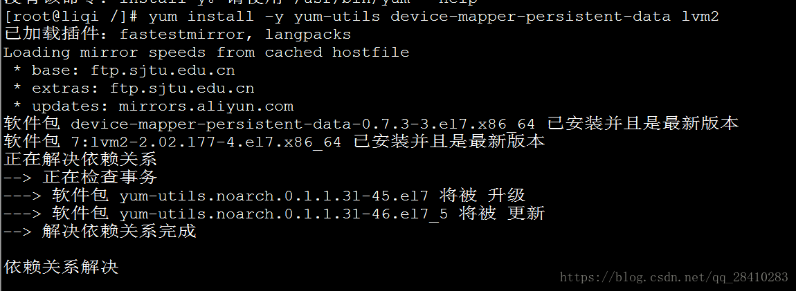
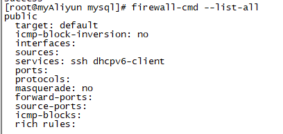
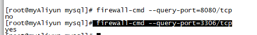
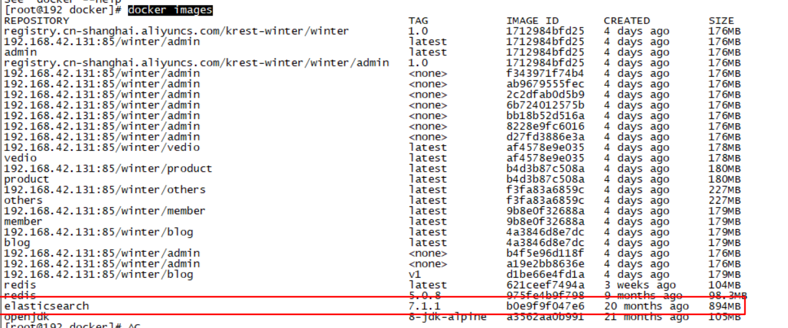
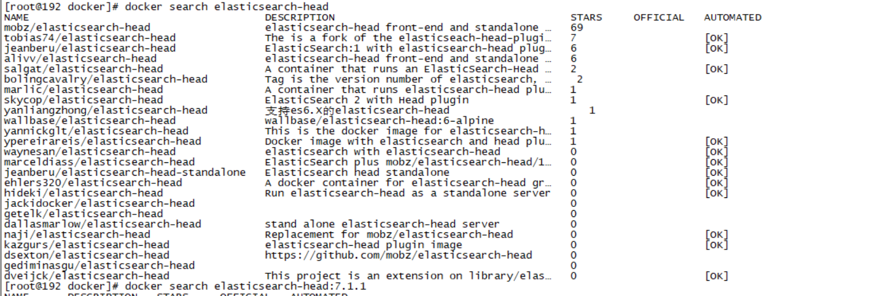
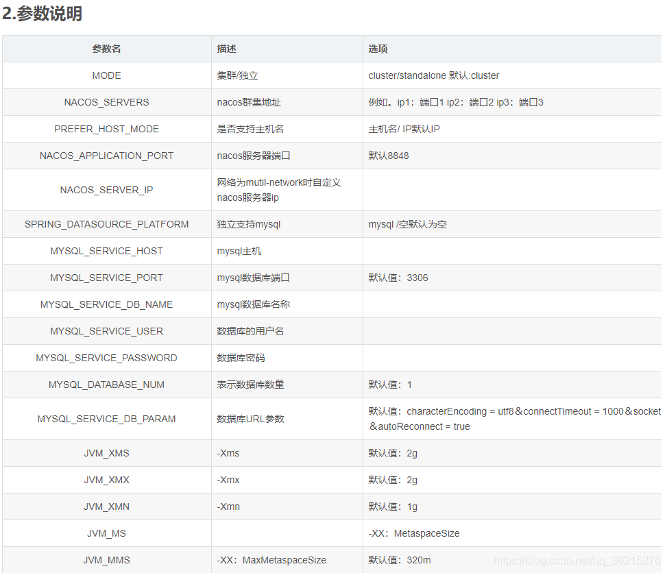
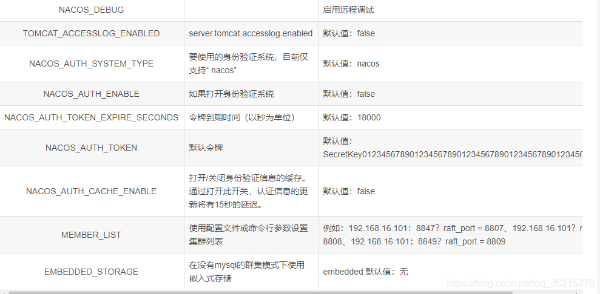
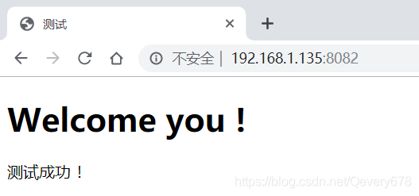
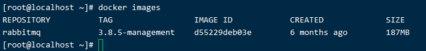

# Docker 基本操作

## 基本介绍

### 什么是Docker？

​		Docker是一个容器化平台，它以容器的形式将你的应用程序及所有的依赖项打包在一起，以确保你的应用程序在任何环境中无缝运行。

### 目的

​		安装一个比较稳定的环境运行程序，docker技术是在操作系统的基础之上，通过操作系统的复用，实现虚拟化，因此docker相比于传统虚拟化技术，资源占用更少，效率更高。

### 由来

1. 2010 年，一对年轻人创办Pass平台，到了2013年，亚马逊、微软、Google也开始做Pass，所以小公司开始对外开源核心技术，也就是Docker的前身，到了2014年，公司得到了C轮融资，专门用来维护Docker，到了2015年得到了D轮融资。

2. Docker的作者已经离开Docker

### 思想

1. 提供了一个标准化的运行环境
2. 轻量级的运行环境，启动更加方便，比虚拟机启动更快
3. 隔离性更加方便，模块下的使用，docker开辟了一个空间，然后提供了一个更好的隔离环境
4. 运行程序的集装箱

### 优势

1. 交付物标准化： Docker是软件工程领域的“标准化”交付组件，最恰到好处的类比是“集装箱”。

   集装箱将零散、不易搬运的大量物品封装成一个整体，集装箱更重要的意义在于它提供了一种通用的封装货物的标准，卡车、火车、货轮、桥吊等运输或搬运工具采用此标准，隧道、桥梁等也采用此标准。以集装箱为中心的标准化设计大大提高了物流体系的运行效率。

   传统的软件交付物包括：应用程序、依赖软件安装包、配置说明文档、安装文档、上线文档等非标准化组件。Docker的标准化交付物称为“镜像”，它包含了应用程序及其所依赖的运行环境，大大简化了应用交付的模式。

2. 一次构建，多次交付，更容易横向扩展

   类似于集装箱的“一次装箱，多次运输”，Docker镜像可以做到“一次构建，多次交付”。当涉及到应用程序多副本部署或者应用程序迁移时，更能体现Docker的价值。

3. 应用隔离，

   集装箱可以有效做到货物之间的隔离，使化学物品和食品可以堆砌在一起运输。Docker可以隔离不同应用程序之间的相互影响，但是比虚拟机开销更小。

4. 更容易进行迁移和扩展，移植性更强，屏蔽底层环境差异

   docker容器几乎可以在任意的平台上运行，包括乌力吉、虚拟机、公有云、私有云、个人电脑、服务器等，这种兼容性让用户可以在不同平台之间轻松的迁移应用。

### 为什么要用docker

1. 标准化应用发布，docker容器包含了运行环境和可执行程序，可以跨平台和主机使用；
2. 节约时间，快速部署和启动，VM启动一般是分钟级，docker容器启动是秒级；
3. 方便构建基于SOA架构或微服务架构的系统，通过服务编排，更好的松耦合；
4. 节约成本，以前一个虚拟机至少需要几个G的磁盘空间，docker容器可以减少到MB级；
5. 方便持续集成，通过与代码进行关联使持续集成非常方便；
6. 可以作为集群系统的轻量主机或节点，在IaaS平台上，已经出现了CaaS，通过容器替代原来的主机。

### Docker容器有几种状态？

1. 运行、
2. 已停止、
3. 重新启动、
4. 已退出


### 一个完整的Docker由哪些部分组成?

1. Docker Client客户端
2. Docker Daemon守护进程
3. Docker Image镜像
4. Docker Container容器


## 安装docker

安装包命令如下：

第一步

```bash
yum install -y yum-utils device-mapper-persistent-data lvm2
```



第二步：建议使用阿里云的地址，国外的地址，下载比较慢，而且很容易链接超时什么的，两个地址，我都贴出来了

```
官网地址
yum-config-manager --add-repo https://download.docker.com/linux/centos/docker-ce.repo
##阿里云地址
yum-config-manager --add-repo http://mirrors.aliyun.com/docker-ce/linux/centos/docker-ce.repo
```


第三步，官网上标注为可选，就直接跳过

### 正式安装docker

```
yum install docker-ce
```


中间需要输入y，确认就好了


### 1. Docker的测试


### 2.Docker的仓库

# Docker的中央仓库

1. Docker官方的中央仓库：这个仓库的镜像最全，但是下载速度比较慢，服务器在国外
2. 国内的镜像网站：网易蜂巢（需要登陆，比较麻烦）、DaoCloud（主要使用daocloud）【http://hub.daocloud.io/】
3. 在公司内部会使用私服的方式拉去镜像
4. 您可以配置 Docker 守护进程默认使用 Docker 官方镜像加速。这样您可以默认通过官方镜像加速拉取镜像，而无需在每次拉取时指定 registry.docker-cn.com。

5. 您可以在 Docker 守护进程启动时传入 `--registry-mirror` 参数：

~~~
$ docker --registry-mirror=https://registry.docker-cn.com daemon
~~~

为了永久性保留更改，您可以修改 `/etc/docker/daemon.json` 文件并添加上 registry-mirrors 键值。

~~~
{
  "registry-mirrors": ["https://v7hr8f7x.mirror.aliyuncs.com"]
}
~~~

修改保存后重启 Docker 以使配置生效。　　　　　　　　

### 3. Docker的镜像操作

1. 使用前先拉取镜像

~~~
docker pull 镜像名称[:tag]
#举例子
docker pull daocloud.io/library/tomcat:8.5.15-jre8
~~~

2. 查看本地的镜像

~~~
docker images
~~~

3. 删除本地镜像

~~~
docker rmi 镜像的唯一标识
# 删除本地所有镜像
docker rmi  -f  $(docker images -qa)

# 删除所有标签为空的镜像
docker rmi  -f  $(docker images -qf dangling=true)

~~~

4. 镜像的导入导出（不规范）

~~~
#将本地的镜像导出
docker save -o 导出的路径 镜像id
#加载本地的镜像文件
docker load -i 镜像名称
~~~

5. 改变docker的名称

~~~
docker tag 镜像标签 更改的名称：版本
~~~


### 4. 容器的操作

1. 运行容器

~~~bash
#简单操作
docker run 镜像的标识|镜像的名称[:tag]
#常规操做
docker run -d -p 宿主机端口:容器端口 --name 容器名称 镜像的标识|镜像的名称[:tag]
#-d 代表后台运行，-p 宿主机端口:容器端口：为了映射当前linux的端口和容器的端口，外部能够访问到docker容器
#--name 容器名称：指定容器的名称
# docker run -d -p 6379:6379 --name myredis docker.io/redis  --net=host
~~~

2. 查看正在运行的容器

~~~bash
docker ps [-a或者-q]
# -a 查看docker的全部
# -q 只查看docker的标识
~~~

3. 查看docker的日志（重要）

~~~bash
docker logs -f 容器id
# -f 代表可以滚动查看日志的最后几行
~~~

4. 进入到容器内部进行操作

~~~bash
docker  exec  -it 容器id bash
~~~

5. 删除容器

~~~bash
# 删除容器前需要先停止容器
docker rm 容器id
# 删除所有容器
docker rm $(docker ps -qa)
~~~

6. 停止容器

~~~bash
#停止容器
docker stop 容器id
#停止全部容器
docker stop $(docker ps -qa)
~~~

7. 启动容器

~~~bash
docker start 容器id
~~~

8. 删除标签为None的镜像

~~~bash
docker rmi $(docker images | grep "<none>" | awk '{print $3}')
~~~

# 防火墙设置

【1】查看目前防火墙

```
firewall-cmd --list-all
```



【2】开放3306端口

```
firewall-cmd --permanent --add-port=3306``/tcp
```

【3】重启防火墙

```
service firewalld restart
```

【4】查看3306端口是否开放

```
firewall-cmd --query-port=3306``/tcp
```



【5】再次查看现在防火墙

```
firewall-cmd --list-all
```


【6】其他

~~~shell
1.防火墙基本操作命令
启动： systemctl start firewalld
关闭： systemctl stop firewalld
查看状态： systemctl status firewalld 
开机禁用  ： systemctl disable firewalld
开机启用  ： systemctl enable firewalld

2.常用命令
查看区域信息:  firewall-cmd --get-active-zo
查看版本： firewall-cmd --version
查看帮助： firewall-cmd --help
显示状态： firewall-cmd --state

3.防火墙打开步骤
（1）查看所有打开的端口： firewall-cmd --zone=public --list-ports (主要是查看有哪些端口开放了，如果需要开放的端口已经打开了，那就没必要再操作了)
（2）开放端口：以开放80端口为例。
firewall-cmd --zone=public --add-port=80/tcp --permanent    （--permanent永久生效，没有此参数重启后失效）
（3）*重要的一步，千万记得重载一下。
 firewall-cmd --reload

4.防火墙关闭。基本操作同开放。
firewall-cmd --zone=public --remove-port=80/tcp --permanent

5.查看端口被哪个进程占用
安装net-tools工具
yum install net-tools
netstat -lnp | grep 8080
~~~

# ElasticSearch 

搜索镜像

~~~
docker search elasticsearch
~~~

拉取镜像

~~~
 docker pull elasticsearch:7.1.1
~~~

查看拉取得到的镜像

~~~
docker images
~~~




通过镜像，启动一个容器，并将9200和9300端口映射到本机（`ElasticSearch`的默认端口是9200，我们把宿主环境9200端口映射到Docker容器中的9200端口）

~~~
docker run -d --name es -p 9200:9200 -p 9300:9300 -e ES_JAVA_OPTS="-Xms512m -Xmx512m" -e "discovery.type=single-node" elasticsearch:7.6.0
~~~


配置跨域，进入容器内部，修改`elasticsearch.yml`

~~~
docker exec -it es /bin/bash
~~~

~~~
[root@c11ef1beb4f3 elasticsearch]# ls
LICENSE.txt  NOTICE.txt  README.textile  bin  config  data  lib  logs  modules  plugins
[root@c11ef1beb4f3 elasticsearch]# cd config/
[root@c11ef1beb4f3 config]# ls
elasticsearch.keystore  ingest-geoip  log4j2.properties  roles.yml  users_roles
elasticsearch.yml       jvm.options   role_mapping.yml   users
[root@c11ef1beb4f3 config]# vi elasticsearch.yml
~~~

新增跨域配置

~~~
cluster.name: "docker-cluster"
network.host: 0.0.0.0
http.cors.enabled: true
http.cors.allow-origin: "*"
  
# minimum_master_nodes need to be explicitly set when bound on a public IP
# set to 1 to allow single node clusters
# Details: https://github.com/elastic/elasticsearch/pull/17288
discovery.zen.minimum_master_nodes: 1
~~~

退出容器

~~~
exit
~~~

重启`ElasticSearch`容器

~~~
docker restart es
~~~

# ElasticSearch-Head

查找镜像

~~~
docker search elasticsearch-Head
~~~



拉取镜像

~~~
# 没有找到7.1.1的版本
docker pull mobz/elasticsearch-head:5
~~~

查看镜像

~~~
docker images
~~~

启动镜像

~~~
docker run -d --name es_head -p 9100:9100 mobz/elasticsearch-head:5
~~~

# 部署ik中文分词插件

进入es容器内部，`/plugins`下新建`ik`文件夹

~~~
[root@iZwz99dhxbd6xwly17tb3bZ ~]# docker exec -it es /bin/bash
[root@970f612c5cac elasticsearch]# ls
LICENSE.txt  NOTICE.txt  README.textile  bin  config  data  lib  logs  modules  plugins
[root@970f612c5cac elasticsearch]# cd plugins/
[root@970f612c5cac plugins]# mkdir ik
[root@970f612c5cac plugins]# ls
ik 
~~~

下载与es对应版本的`ik`压缩包，并解压

注意：这一步有的人服务器不支持zip所以解压不了。我是从电脑上解压后弄成tar.gz文件上传到服务器然后cp到容器内部对应文件夹下，命令

~~~
[root@970f612c5cac plugins]# cd ik
[root@970f612c5cac ik]# wget https://github.com/medcl/elasticsearch-analysis-ik/releases/download/v7.6.0/elasticsearch-analysis-ik-7.6.0.zip
[root@970f612c5cac ik]# unzip elasticsearch-analysis-ik-7.6.0.zip
[root@970f612c5cac ik]# ls
commons-codec-1.9.jar    elasticsearch-analysis-ik-6.3.2.jar  plugin-descriptor.properties
commons-logging-1.2.jar  httpclient-4.5.2.jar                 plugin-security.policy
config                   httpcore-4.4.4.jar
~~~

退出容器，重启es容器

~~~
[root@970f612c5cac ik]# exit
exit
[root@iZwz99dhxbd6xwly17tb3bZ ~]# docker restart es
~~~

# Kibana

查找镜像

~~~
docker search kibana
~~~

拉取镜像

```txt
docker pull docker.io/kibana:7.1.1
```

启动kibana我们的服务器IP是`172.18.63.211es`

```
docker run --restart=always -itd --name kibana --link es:elasticsearch -p 5601:5601 kibana:7.6.0
```

进入容器修改配置文件`kibana.yml`

```
docker exec  -it kibana bash
vi config/kibana.yml
########################
# 指定es的地址
elasticsearch.hosts: ["http://172.17.59.5:9200"]

# 修改外网访问 可选
server.host: "0.0.0.0"
exit
########################
docker restart kibana
```

打开地址：`http://172.18.63.211:5601`


测试分词工具

```
POST _analyze
{
  "text": "检测甘蓝型油菜抗磺酰脲类除草剂基因BnALS3R的引物与应用",
  "analyzer": "hanlp"
}
```

新增索引库

```
PUT achievement
{
  "settings": {
    "number_of_shards": 1,
    "number_of_replicas": 1
  }
}


PUT achievement/_mapping
{
  "properties": {
    "id": {
      "type": "text"
    },
    "owner": {
      "type": "text"
    },
    "title": {
      "type": "text",
      "analyzer": "hanlp"
    },
    "description": {
      "type": "text",
      "analyzer": "hanlp"
    },
    "update_time":{
      "type": "date"
    }
  }
}
```


#　LogStash


添加配置文件

~~~conf
input {        
  file {
    path => "/var/log/glog/*"
    type => "file_2_console"
    start_position => "beginning"
  }
}
output {
  if [type] == "file_2_console" {
      stdout {
       codec => rubydebug
    }
  }
}
~~~


~~~bash
 docker pull logstash:7.6.0
 
 # 
 docker run -d  -v /usr/local/logstash/config/:/usr/share/logstash/pipeline/ -p 4560:4560 -p 4561:4561 -p 4562:4562 -p 4563:4563  --net host --name logstash logstash:7.6.0
~~~


# Redis

首先我们通过Dockr搜索Redis有关的镜像源

```bash
docker search redis
```

接着我们通过Docker下载Redis镜像源

```bash
docker pull redis
```

这里没有设置版本好就会默认下载**latest**的镜像源。

```bash
[root@localhost ~]# docker images
REPOSITORY                TAG                 IMAGE ID            CREATED             SIZE
docker.io/tomcat          latest              aeea3708743f        9 days ago          529 MB
docker.io/rabbitmq        latest              2b5cda43d345        2 weeks ago         151 MB
docker.io/elasticsearch   7.6.0               5d2812e0e41c        2 weeks ago         790 MB
docker.io/redis           latest              44d36d2c2374        2 weeks ago         98.2 MB
docker.io/mysql           latest              791b6e40940c        2 weeks ago         465 MB
[root@localhost ~]# 
```

接着创建并启动Redis容器

首先启动Docker

```bash
[root@localhost ~]# systemctl start docker
```

在Docker中启动Redis

这里我们没有设置容器的别名，`-d`代表后台启动。

```bash
[root@localhost ~]# docker run -d redis
da45019bf760304a66c3dd96b8847a50eddd8c73ff77cd3b3f37a46d7f016834
```

也可以这样启动Redis，其中`-p`代表端口映射，将容器中的6379映射到运行Docker机器中的6379端口，`--name`表示自定义容器名

```bash
[root@localhost ~]# docker run -d -p 6379:6379   --name="myredis"  redis
249dd65794b32310dea5e094f41df845d971b623382ddc1179c404402f576750
[root@localhost ~]# 
```

进入Redis终端

```bash
docker exec ：在运行的容器中执行命令
# 语法
docker exec [OPTIONS] CONTAINER COMMAND [ARG...]
# OPTIONS说明：
-d :分离模式: 在后台运行
-i :即使没有附加也保持STDIN 打开
-t :分配一个伪终端
```

而Docker中的容器ID可以用`docker -ps`来查看

```bash
[root@localhost ~]# docker ps
CONTAINER ID        IMAGE               COMMAND                  CREATED             STATUS              PORTS                    NAMES
249dd65794b3        redis               "docker-entrypoint..."   3 minutes ago       Up 3 minutes        0.0.0.0:6379->6379/tcp   myredis
da45019bf760        redis               "docker-entrypoint..."   18 minutes ago      Up 18 minutes       6379/tcp                 naughty_pasteur
[root@localhost ~]# 
```

`redis-cli`表示运行一个`redis`客户端。

```bash
[root@localhost ~]# docker exec -it da45019bf760 redis-cli
127.0.0.1:6379> 
127.0.0.1:6379> set msg "Hello World Redis"
OK
127.0.0.1:6379> get msg
"Hello World Redis"
127.0.0.1:6379>
```

# Nacos

搜索镜像

~~~
docker search nacos
~~~

拉取镜像

```bash
docker pull nacos/nacos-server:1.4.0
```

创建nacos挂载目录，主要挂载日志和配置文件

```bash
mkdir -p /home/docker/nacos/logs
```

单机启动

~~~
# 不持久化
docker run -d -p 8848:8848 -e MODE=standalone --name nacos -v /home/docker/nacos/logs:/home/nacos/logs 49a2aedd88f2 
~~~

```
# 单机启动 持久化 mysql 
docker run -d -p 8848:8848 --restart=always  -e MODE=standalone -e SPRING_DATASOURCE_PLATFORM=mysql -e MYSQL_SERVICE_HOST=ip  -e MYSQL_SERVICE_PORT=3306  -e MYSQL_SERVICE_USER=用户名 -e MYSQL_SERVICE_PASSWORD=密码-e MYSQL_SERVICE_DB_NAME=nacos_config  -v /home/docker/nacos/
:/home/nacos/logs --name nacos nacos/nacos-server:1.4.0
```

访问地址

~~~
http://192.168.42.130:8848/nacos
~~~

docker-Nacos集群




集群启动命令

```bash
docker run --name nacos-1 --hostname=nacos-1 -d -p 9521:9521 --restart=always  -e MODE=cluster -e SPRING_DATASOURCE_PLATFORM=mysql -e MYSQL_SERVICE_HOST=10.0.1.206 -e MYSQL_SERVICE_PORT=12345 -e MYSQL_SERVICE_USER=root -e MYSQL_SERVICE_PASSWORD=123456 -e MYSQL_SERVICE_DB_NAME=colud -e MYSQL_DATABASE_NUM=1 -e NACOS_USER=nacos -e NACOS_PASSWORD=nacos -e JVM_XMS=256m -e JVM_XMX=256m  -e NACOS_APPLICATION_PORT=9521 -e  NACOS_SERVERS=192.168.182.134:9521,192.168.182.134:9522,192.168.182.134:9523 nacos/nacos-server:1.4.0
其他2个集群启动修改对应的端口即可
```

# Nginx

查找Docker Hub 上的 nginx 镜像

```vbnet
[root@docker ~]# docker search nginx
```

拉去官方的镜像

```vbnet
[root@docker ~]# docker pull nginx
[root@docker ~]# docker images | grep nginx
```

使用默认配置来启动 Nginx 容器实例

```vbnet
[root@docker ~]# docker run  --name zh-nginx-test -p 8081:80 -d nginx
34334551cd6e696785810c77c37f3a1e4a6c21d427d6b559b9b9384add60144c
[root@docker ~]# docker ps 
CONTAINER ID        IMAGE               COMMAND                  CREATED             STATUS              PORTS                  NAMES
34334551cd6e        nginx               "nginx -g 'daemon off"   8 seconds ago       Up 5 seconds        0.0.0.0:8081->80/tcp   zh-nginx-test
```

- **`zh-nginx-test`**  容器名称。
- **-d** 设置容器在在后台一直运行。
- **`-p`**端口进行映射，将本地 8081 端口映射到容器内部的 80 端口。
- 执行以上出现一长串字符，表示容器的ID，一般作为日志的文件名。

- **创建目录 nginx, 用于存放后面的相关东西**

```vbnet
[root@docker ~]# mkdir -p ~/nginx/www ~/nginx/logs ~/nginx/conf
```

- **拷贝容器内 Nginx 默认配置文件到本地当前目录下的 conf 目录**

```vbnet
[root@docker ~]# docker cp 34334551cd6e:/etc/nginx/nginx.conf ~/nginx/conf
```

- **www**: 目录将映射为 nginx 容器配置的虚拟目录。
- **logs**: 目录将映射为 nginx 容器的日志目录。
- **conf**: 目录里的配置文件将映射为 nginx 容器的配置文件。

部署命令

```vbnet
[root@docker ~]# docker run -d -p 8082:80 --name nginx-web -v /usr/local/java/docker/nginx/www:/usr/share/nginx/html -v /usr/local/java/docker/nginx/conf/nginx.conf:/etc/nginx/nginx.conf -v /usr/local/java/docker/nginx/logs:/var/log/nginx nginx
0f17a5a182e68639945d252467ddbb3902dec1d167ba041d7e655c81ad3a0238
```

 命令说明：

- **-p 8082:80：** 将容器的 80 端口映射到主机的 8082 端口。
- **--name nginx-web：**将容器命名为 nginx-web。
- **-v ~/nginx/www:/usr/share/nginx/html：**将我们自己创建的 www 目录挂载到容器的 /usr/share/nginx/html。
- **-v ~/nginx/conf/nginx.conf:/etc/nginx/nginx.conf：**将我们自己创建的 nginx.conf 挂载到容器的 /etc/nginx/nginx.conf。
- **-v ~/nginx/logs:/var/log/nginx：**将我们自己创建的 logs 挂载到容器的 /var/log/nginx。

------

- **启动以上命令后进入 ~/nginx/www 目录：**

```vbnet
[root@docker ~]# cd nginx/www/
```

- **创建 index.html 文件，内容如下：**

```html
[root@docker www]# vim index.html
<!DOCTYPE html>
<html>
<head>
<meta charset="utf-8">
<title>测试</title>
</head>
<body>
    <h1> Welcome you ! </h1>
    <p> 测试成功 ！</p>
</body>
</html>
```



------

> ### **相关命令**

- **如果要重新载入 NGINX 可以使用以下命令发送 HUP 信号到容器：**

```vbnet
[root@docker ~]# docker kill -s HUP container-name
```

- **重启 NGINX 容器命令：**

```vbnet
[root@docker ~]# docker restart container-name
```

# RabbitMQ

1.下载RabbitMq镜像

```bash
 docker pull rabbitmq:3.8.5-management
```

2.查看镜像是否下载成功



3.运行镜像

```bash
docker run --name rabbitmq -d -p 5672:5672 -p 15672:15672 -v /usr/local/java/docker/rabbit/data:/var/lib/rabbitmq rabbitmq:3.8.5-management
```

4.开放服务器端口

分别开放5672 和15672

如果对端口开放不太熟悉的请参考我的博客：https://blog.csdn.net/qq_35771266/article/details/91046567

如果你的是云服务器，还需要在云服务器安全组放开一下这两个端口


# Docker 源码


