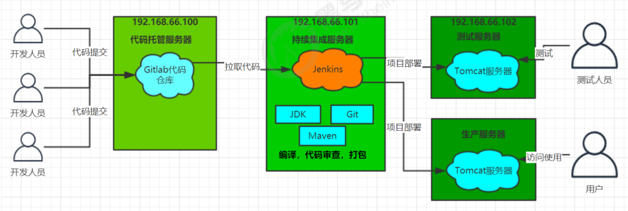

# Jenkins

## 资料来源

[B站黑马程序员Jenkins教程](https://www.bilibili.com/video/BV1kJ411p7mV?spm_id_from=333.337.search-card.all.click)

## 概述

​			Jenkins  是一款流行的开源持续集成（Continuous Integration）工具，广泛用于项目开发，具有自动
化构建、测试和部署等功能。官网：  http://jenkins-ci.org/。

Jenkins的特征：

1. 开源的 Java语言开发持续集成工具，支持持续集成，持续部署。
2. 易于安装部署配置：可通过 yum安装,或下载war包以及通过docker容器等快速实现安装部署，可方便web界面配置管理。
3. 消息通知及测试报告：集成 RSS/E-mail通过RSS发布构建结果或当构建完成时通过e-mail通知，生成JUnit/TestNG测试报告。
4. 分布式构建：支持 Jenkins能够让多台计算机一起构建/测试。
5. 文件识别： Jenkins能够跟踪哪次构建生成哪些jar，哪次构建使用哪个版本的jar等。
6. 丰富的插件支持：支持扩展插件，你可以开发适合自己团队使用的工具，如 git，svn，maven，docker等。

## 安装和持续集成环境配置

### 持续集成流程说明

1. 首先，开发人员每天进行代码提交，提交到Git仓库
2. 然后，Jenkins作为持续集成工具，使用Git工具到Git仓库拉取代码到集成服务器，再配合JDK，Maven等软件完成代码编译，代码测试与审查，测试，打包等工作，在这个过程中每一步出错，都重新再执行一次整个流程。
3. 最后，Jenkins把生成的jar或war包分发到测试服务器或者生产服务器，测试人员或用户就可以访问
   应用

## Pipeline简介

### 概念

​		Pipeline，简单来说，就是一套运行在 Jenkins 上的工作流框架，将原来独立运行于单个或者多个节点
的任务连接起来，实现单个任务难以完成的复杂流程编排和可视化的工作。

### 使用Pipeline有以下好处（来自翻译自官方文档）：
1. 代码：Pipeline以代码的形式实现，通常被检入源代码控制，使团队能够编辑，审查和迭代其传送流
   程。 
2. 持久：无论是计划内的还是计划外的服务器重启，Pipeline都是可恢复的。 
3. 可停止：Pipeline可接收交互式输入，以确定是否继续执行Pipeline。
4.  多功能：Pipeline支持现实世界中复杂的持续交付要求。它支持fork/join、循环执行，并行执行任务的功能。
5.  可扩展：Pipeline插件支持其DSL的自定义扩展 ，以及与其他插件集成的多个选项。

### 如何创建 Jenkins Pipeline呢？

1. Pipeline  脚本是由 Groovy 语言实现的，但是我们没必要单独去学习 Groovy
2. Pipeline  支持两种语法：Declarative(声明式)和 Scripted Pipeline(脚本式)语法
3. Pipeline  也有两种创建方法：可以直接在 Jenkins 的 Web UI 界面中输入脚本；也可以通过创建一个 Jenkinsfile 脚本文件放入项目源码库中（一般我们都推荐在 Jenkins 中直接从源代码控制(SCM)中直接载入 Jenkinsfile Pipeline 这种方法）。

## Pipeline简单使用

### HelloWorld模板

~~~Groovy 
pipeline {
    agent any
    stages {
        stage('Hello') {
            steps {
                echo 'Hello World'
            }
        }
    }
}
~~~

1. stages ：代表整个流水线的所有执行阶段。通常stages只有1个，里面包含多个stage
2. stage ：代表流水线中的某个阶段，可能出现n个。一般分为拉取代码，编译构建，部署等阶段。
3. steps：代表一个阶段内需要执行的逻辑。steps里面是shell脚本，git拉取代码，ssh远程发布等任意内
   容。

### 编写一个简单声明式Pipeline

~~~Grovvy
pipeline {
    agent any
    stages {
        stage('拉取代码') {
            steps {
                echo '拉取代码'
            }
        } stage('编译构建') {
            steps {
                echo '编译构建'
            }
        } stage('项目部署') {
            steps {
                echo '项目部署'
            }
        }
    }
}
~~~

## Pipeline 部署脚本示例

~~~Groovy
//gitlab的凭证
def git_auth = "36a8360b-3146-4bb6-8d6a-d3ef39be5d57"
//gitLab SSH地址
def git_url = "https://gitee.com/krest202/winter.git"
// docker 标签
def tag = "latest"
// 阿里云镜像仓库
def ali_url = "registry.cn-qingdao.aliyuncs.com"
def ali_project = "krest-winter"
def ali_auth = "2a4e634f-3a70-47a3-889f-ed4b1e802b5e"

node {
    //获取project_name变量，得到当前项目的名称,split根据(,)切割每个项目名的，会被切割成为一个数组
    def selectedProjectNames = "${project_name}".split(",")
    def selectedServer = "${publish_server}".split(",")
    stage('删除旧的镜像文件') {
        sshPublisher(
                publishers: [
                        sshPublisherDesc(
                                configName: 'ali_server', transfers: [
                                sshTransfer(
                                        cleanRemote: false, excludes: '', execCommand: "/opt/jenkins_shell/removeImage.sh",
                                        execTimeout: 120000, flatten: false, makeEmptyDirs: false, noDefaultExcludes: false,
                                        patternSeparator: '[, ]+', remoteDirectory: '', remoteDirectorySDF: false, removePrefix: '',
                                        sourceFiles: '')
                        ],
                                usePromotionTimestamp: false, useWorkspaceInPromotion: false, verbose: false
                        )
                ]
        )
    }
    stage('拉取代码') {
        //分支的变量参数
        checkout([$class                           : 'GitSCM', branches: [[name: "*/${branch}"]],
                  doGenerateSubmoduleConfigurations: false,
                  extensions                       : [],
                  submoduleCfg                     : [],
                  //登陆凭证
                  userRemoteConfigs                : [[credentialsId: "${git_auth}", url: "${git_url}"]]])
    }
    stage('安装编译公共子工程') {
        //将公共类放入到仓库中，所以使用install指令
        sh "mvn -f common clean install"
    }
    stage('打包服务项目,生成镜像,上传镜像') {
        // 对获取project_name变量，得到当前项目的名称,split根据(,)切割每个项目名的，会被切割成为一个数组，进行for循环
        for (int i = 0; i < selectedProjectNames.length; i++) {
            // 每遍历一次，会得到项目的名字和端口
            def projectInfo = selectedProjectNames[i];
            // 数组下标为 0，得到项目名字
            def currentProjectName = "${projectInfo}".split("@")[0];
            // 数组下标为 0，得到项目端口
            def currentProjectPort = "${projectInfo}".split("@")[1];
            // 打包并且生成镜像文件
            sh "mvn -f ${currentProjectName} clean package dockerfile:build"
            // 定义镜像名称
            def imageName = "${currentProjectName}:${tag}"
            // 打标签
            sh "docker tag ${imageName}  ${ali_url}/${ali_project}/${imageName}"
            // 上传镜像
            withCredentials([usernamePassword(credentialsId: "${ali_auth}", passwordVariable: 'password', usernameVariable: 'username')]) {
                //登录到Harbor
                sh "docker login -u ${username} -p ${password} ${ali_url}"
                //镜像上传
                sh "docker push ${ali_url}/${ali_project}/${imageName}"
                sh "echo 镜像上传成功"
            }
        }
    }

    stage('部署应用') {
        //部署应用
        for (int i = 0; i < selectedProjectNames.length; i++) {
            //每遍历一次，会得到项目的名字和端口
            def projectInfo = selectedProjectNames[i];
            //数组下标为0，得到项目名字
            def currentProjectName = "${projectInfo}".split("@")[0]
            //数组下标为0，得到项目端口
            def currentProjectPort = "${projectInfo}".split("@")[1]
            for (int j = 0; j < selectedServer.length; j++) {
                def currentServerName = selectedServer[j]
                // 加上参数选择不同的服务器
                sh "echo 部署应用 ${currentServerName} ${currentProjectName} ${currentProjectPort}"
                // 通过远程的 ssh 工具，执行 ssh 脚本，实现镜像的自动部署
                sshPublisher(publishers: [sshPublisherDesc(configName: "${currentServerName}",
                        transfers: [sshTransfer(cleanRemote: false, excludes: '',
                                execCommand: "/opt/jenkins_shell/deploy.sh $ali_url $ali_project $currentProjectName $tag $currentProjectPort",
                                execTimeout: 120000,
                                flatten: false,
                                makeEmptyDirs: false,
                                noDefaultExcludes: false,
                                patternSeparator: '[, ]+', remoteDirectory: '', remoteDirectorySDF: false, removePrefix: '', sourceFiles: '')
                        ],
                        usePromotionTimestamp: false, useWorkspaceInPromotion: false, verbose: false)
                ]
                )
                sh "echo 部署应用成功"
            }
        }
    }

}
~~~

## `SH`部署脚本

~~~shell
#! /bin/sh
#接收外部参数
harbor_url=$1
harbor_project_name=$2
project_name=$3
tag=$4
port=$5
imageName=$harbor_url/$harbor_project_name/$project_name:$tag
echo "$imageName"
#查询容器是否存在，存在则删除
containerId=$(docker ps -a | grep -w ${project_name}:${tag} | awk '{print $1}')
if [ "$containerId" != "" ]; then
  #停掉容器
  docker stop $containerId
  #删除容器
  docker rm $containerId
  echo "成功删除容器"
fi
#查询镜像是否存在，存在则删除
imageId=$(docker images | grep -w $project_name | awk '{print $3}')
if [ "$imageId" != "" ]; then
  #删除镜像
  docker rmi -f $imageId
  echo "成功删除镜像"
fi
# 登录Harbor私服
docker login -u itcast -p Itcast123 $harbor_url
# 下载镜像
docker pull $imageName
# 启动容器
docker run -di -p $port:$port $imageName

~~~

