# SkyWalking 

## 概述

### 简介

Skywalking与2016年11月2日由国人吴晟在Github上传v1.0版本，用于提供分布式链路追踪功能，从5.x开始，成为一个功能较为完善的APM（Application Performance Management）系统，2019年4月17日从Apache孵化器毕业，正式成为Apache顶级项目。提供分布式追踪、服务网格遥测分析、度量聚合和可视化一体化解决方案。官方对自己介绍是专为微服务，云原生和基于容器（Docker，Kubernetes，Mesos）架构而设计。

### 主要功能

- 服务，服务实例，端点指标分析
- **根本原因分析**
- 服务拓扑图分析
- 服务，服务实例和端点依赖性分析
- 慢服务检测
- 性能优化
- **分布式跟踪和上下文传播**
- 数据库访问指标、检测慢速数据库访问语句（包括SQL）
- 告警

### 主要特性

- 多种监控手段，语言探针和service mesh
- 多语言自动探针，Java，.NET Core和Node.JS
- 多种后端存储支持
- 轻量高效
- 模块化，UI、存储、集群管理多种机制可选
- 支持告警
- 优秀的可视化方案

### 架构简介

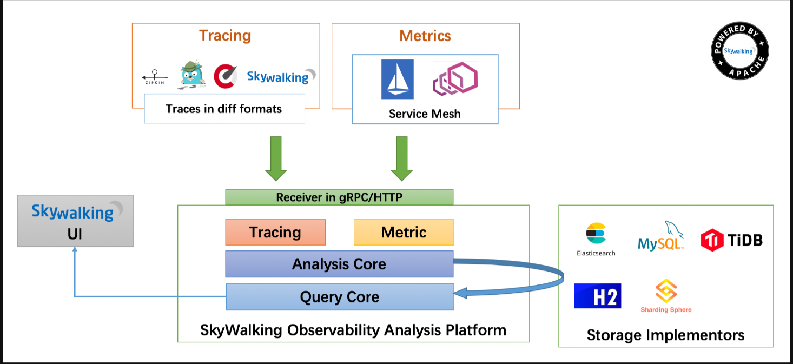

Skywalking总体由四个部分agent、collector、webapp-ui、storage组成。图10-11从上到下是应用层接入，可以使用无入侵性的agent探针接入，通过HTTP或者gRPC讲数据发送至Skywalking分析平台collector，collector对接受到的数据进行聚合分析，最后存储至storage中，这里支持多种存储方式，比较常用的有H2和ElasticSearch，最后可以由webapp-ui对所有的数据进行展示

## 实操

### 文件架构

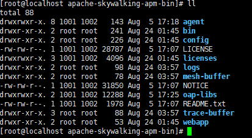

+ agent：探针相关，后面会做更加详细的介绍。
+ bin：这里放的是oapService和webappService的启动脚本，当然也有执行两个脚本的合并脚本startup.sh。
+ config：这里主要存放的是collector的配置信息，我们需要修改这里的application.yml中的有关ElasticSearch的配置，
+ ogs：存放collector和webapp-ui生成的日志。
+ webapp：这里存放的是Skywalking展示UI的jar和配置文件。

### 启动配置（单节点）

#### 服务端配置文件

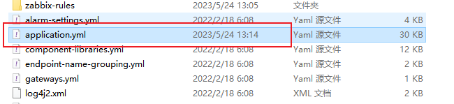

1. 模式为 standalone

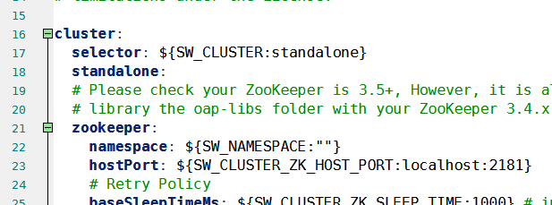

2. 配置存储类型

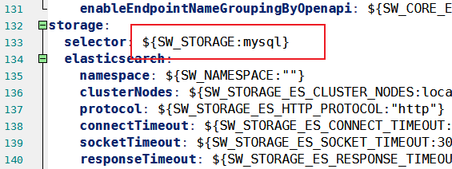

3. 增加数据库配置

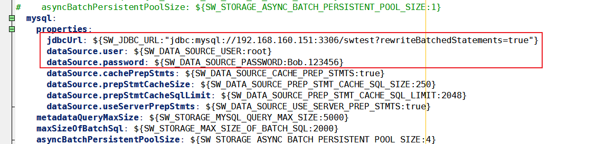

4. 在数据库对应的数据库 swtest

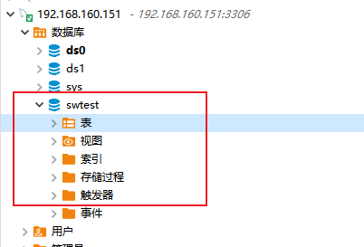

5. 然后在Linux中启动 startup.sh

#### 客户端启动

1. 下载skywalking-agent的java版本
2. 配置文件修改，正确的skywalking server地址

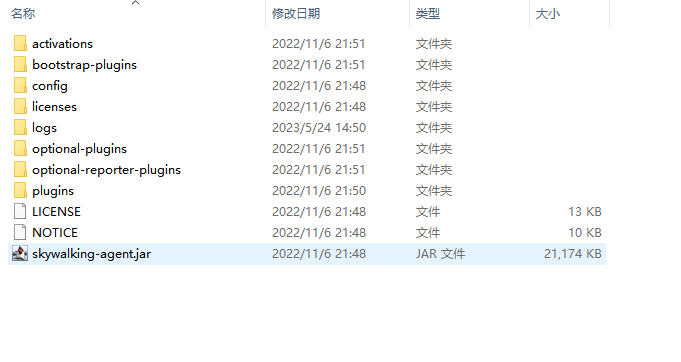

​	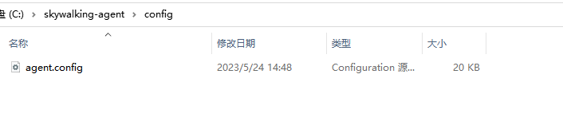

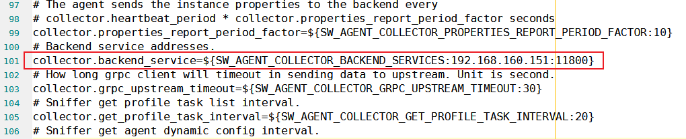

3. Spring-boot中添加依赖，注意需要与 agent 的版本保持一致

~~~xml
        <!-- skywalking 工具类 -->
        <!-- 监控相关 -->
        <dependency>
            <groupId>io.opentracing</groupId>
            <artifactId>opentracing-util</artifactId>
            <version>0.31.0</version>
        </dependency>
        <dependency>
            <groupId>org.apache.skywalking</groupId>
            <artifactId>apm-toolkit-trace</artifactId>
            <version>8.13.0</version>
        </dependency>
        <dependency>
            <groupId>org.apache.skywalking</groupId>
            <artifactId>apm-toolkit-logback-1.x</artifactId>
            <version>8.13.0</version>
        </dependency>
        <dependency>
            <groupId>org.apache.skywalking</groupId>
            <artifactId>apm-toolkit-opentracing</artifactId>
            <version>8.13.0</version>
        </dependency>
~~~

4. 增加 logback-spring.xml

~~~xml

<configuration>
    <!-- 引用 Spring Boot 的 logback 基础配置 -->
    <include resource="org/springframework/boot/logging/logback/defaults.xml" />
    <!-- 变量 yudao.info.base-package，基础业务包 -->
    <springProperty scope="context" name="kirin.info.base-package" source="kirin.info.base-package"/>
    <!-- 格式化输出：%d 表示日期，%X{tid} SkWalking 链路追踪编号，%thread 表示线程名，%-5level：级别从左显示 5 个字符宽度，%msg：日志消息，%n是换行符 -->
    <property name="PATTERN_DEFAULT" value="%d{${LOG_DATEFORMAT_PATTERN:-yyyy-MM-dd HH:mm:ss.SSS}} | %highlight(${LOG_LEVEL_PATTERN:-%5p} ${PID:- }) | %boldYellow(%thread [%tid]) %boldGreen(%-40.40logger{39}) | %m%n${LOG_EXCEPTION_CONVERSION_WORD:-%wEx}"/>

    <!-- 控制台 Appender -->
    <appender name="STDOUT" class="ch.qos.logback.core.ConsoleAppender">　　　　　
        <encoder class="ch.qos.logback.core.encoder.LayoutWrappingEncoder">
            <layout class="org.apache.skywalking.apm.toolkit.log.logback.v1.x.TraceIdPatternLogbackLayout">
                <pattern>${PATTERN_DEFAULT}</pattern>
            </layout>
        </encoder>
    </appender>

    <!-- 文件 Appender -->
    <!-- 参考 Spring Boot 的 file-appender.xml 编写 -->
    <appender name="FILE"  class="ch.qos.logback.core.rolling.RollingFileAppender">
        <encoder class="ch.qos.logback.core.encoder.LayoutWrappingEncoder">
            <layout class="org.apache.skywalking.apm.toolkit.log.logback.v1.x.TraceIdPatternLogbackLayout">
                <pattern>${PATTERN_DEFAULT}</pattern>
            </layout>
        </encoder>
        <!-- 日志文件名 -->
        <file>${LOG_FILE}</file>
        <rollingPolicy class="ch.qos.logback.core.rolling.SizeAndTimeBasedRollingPolicy">
            <!-- 滚动后的日志文件名 -->
            <fileNamePattern>${LOGBACK_ROLLINGPOLICY_FILE_NAME_PATTERN:-${LOG_FILE}.%d{yyyy-MM-dd}.%i.gz}</fileNamePattern>
            <!-- 启动服务时，是否清理历史日志，一般不建议清理 -->
            <cleanHistoryOnStart>${LOGBACK_ROLLINGPOLICY_CLEAN_HISTORY_ON_START:-false}</cleanHistoryOnStart>
            <!-- 日志文件，到达多少容量，进行滚动 -->
            <maxFileSize>${LOGBACK_ROLLINGPOLICY_MAX_FILE_SIZE:-10MB}</maxFileSize>
            <!-- 日志文件的总大小，0 表示不限制 -->
            <totalSizeCap>${LOGBACK_ROLLINGPOLICY_TOTAL_SIZE_CAP:-0}</totalSizeCap>
            <!-- 日志文件的保留天数 -->
            <maxHistory>${LOGBACK_ROLLINGPOLICY_MAX_HISTORY:-30}</maxHistory>
        </rollingPolicy>
    </appender>
    <!-- 异步写入日志，提升性能 -->
    <appender name="ASYNC" class="ch.qos.logback.classic.AsyncAppender">
        <!-- 不丢失日志。默认的，如果队列的 80% 已满,则会丢弃 TRACT、DEBUG、INFO 级别的日志 -->
        <discardingThreshold>0</discardingThreshold>
        <!-- 更改默认的队列的深度，该值会影响性能。默认值为 256 -->
        <queueSize>256</queueSize>
        <appender-ref ref="FILE"/>
    </appender>

    <!-- SkyWalking GRPC 日志收集，实现日志中心。注意：SkyWalking 8.4.0 版本开始支持 -->
    <appender name="GRPC" class="org.apache.skywalking.apm.toolkit.log.logback.v1.x.log.GRPCLogClientAppender">
        <encoder class="ch.qos.logback.core.encoder.LayoutWrappingEncoder">
            <layout class="org.apache.skywalking.apm.toolkit.log.logback.v1.x.TraceIdPatternLogbackLayout">
                <pattern>${PATTERN_DEFAULT}</pattern>
            </layout>
        </encoder>
    </appender>

    <!-- 本地环境 -->
    <springProfile name="local">
        <root level="INFO">
            <appender-ref ref="STDOUT"/>
            <appender-ref ref="GRPC"/> <!-- 本地环境下，如果不想接入 SkyWalking 日志服务，可以注释掉本行 -->
            <appender-ref ref="ASYNC"/>  <!-- 本地环境下，如果不想打印日志，可以注释掉本行 -->
        </root>
    </springProfile>
    <!-- 其它环境 -->
    <springProfile name="dev,test,stage,prod,default">
        <root level="INFO">
            <appender-ref ref="STDOUT"/>
            <appender-ref ref="ASYNC"/>
            <appender-ref ref="GRPC"/>
        </root>
    </springProfile>
</configuration>
~~~

5. Idea 设置启动参数

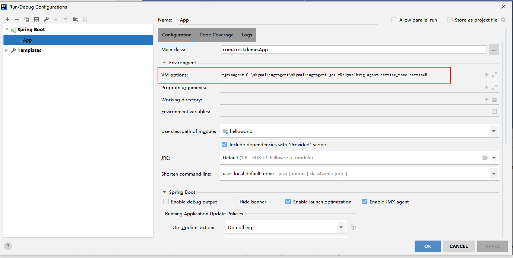

~~~config
--skywalking-agent.jar所在位置
VM options：-javaagent:C:\skywalking-agent\skywalking-agent.jar -Dskywalking.agent.service_name=serviceB

-- 配置指向写入链路数据的服务器地址
Environment viriables:-Dskywalking.collector.backend_service=192.168.160.151:11800
~~~

我这里配置了第一个即生效

6. 启动Spring Boot

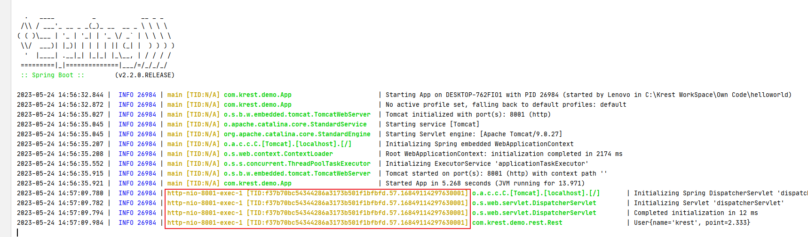

7. 访问某个接口，有如此日志，代表启动成功

8. 查看Skywalking UI页面

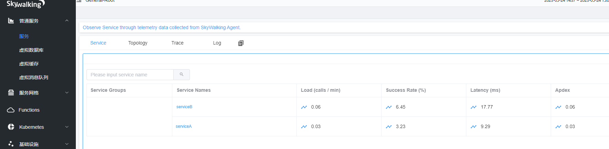

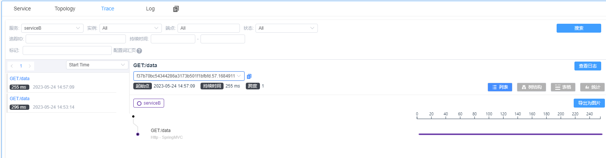

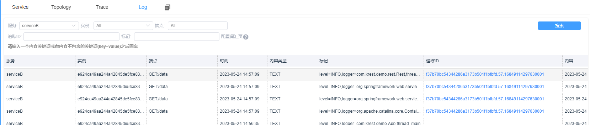

9. 日志详情

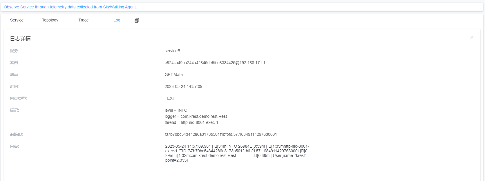

## 总结

Skywalking 最然功能不少，但是最主要的还是被作为链路追踪来使用

### 
