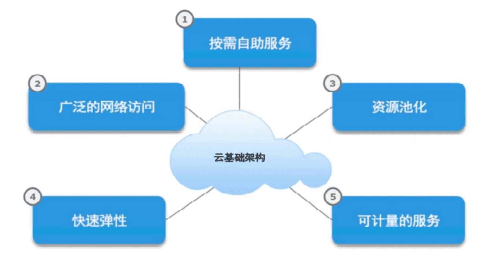
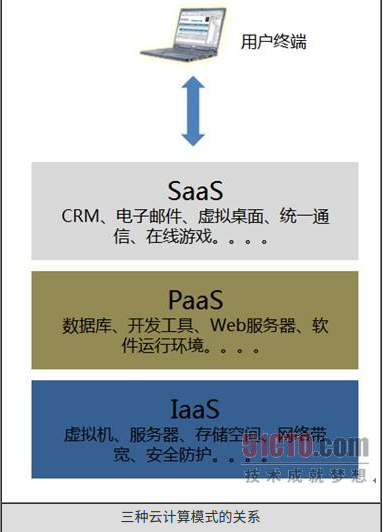
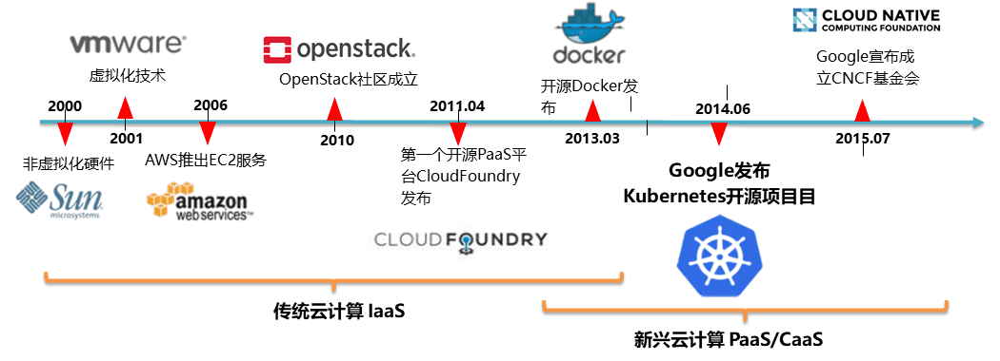
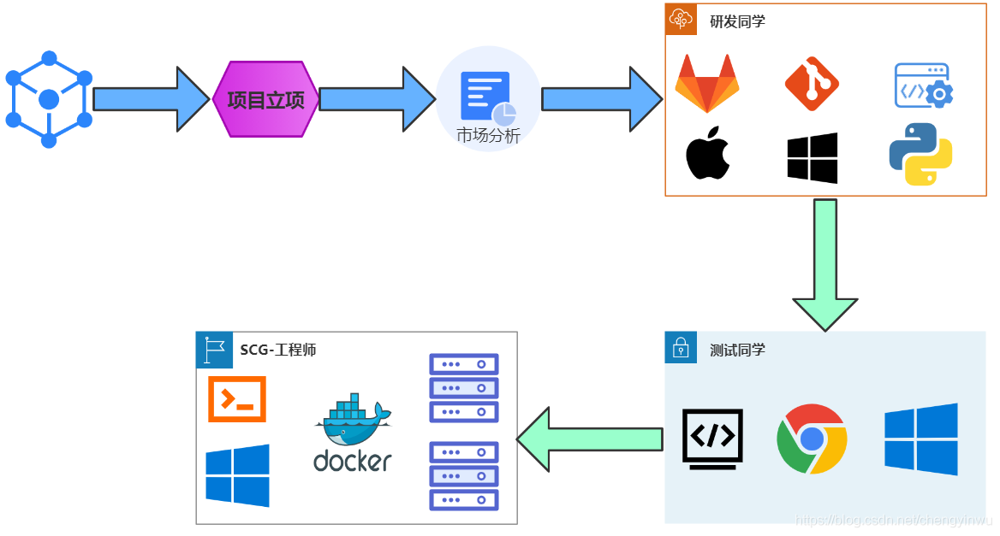
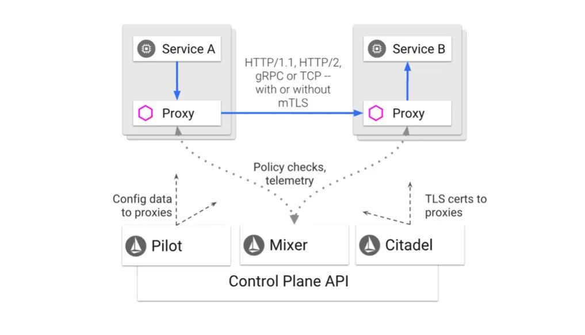

# 云原生

## 相关概念

### 云计算

​		云计算不同于传统的自建机房，云计算就是将计算的抽象为基础设施然后通过网络分发，得益于云计算的无限扩展能力，使得“云计算”就像自来水厂一样，我们可以随时接水，并且不限量，按照自己家的用水量，付费给自来水厂就可以。以下云计算的五个基本特征；

1. 按需自助服务
2. 广泛的网络访问
3. 资源池化
4. 快速弹性
5. 可计量的服务




### 云服务模式

1. IaaS: Infrastructure-as-a-Service（基础设施即服务）：第一层叫做IaaS，有时候也叫做Hardware-as-a-Service，以前如果你想在办公室或者公司的网站上运行一些企业应用，你需要去买服务器，或者别的高昂的硬件来控制本地应用，让你的业务运行起来。但是现在有IaaS，你可以将硬件外包到别的地方去。IaaS公司会提供场外服务器，存储和网络硬件，你可以租用。节省了维护成本和办公场地，公司可以在任何时候利用这些硬件来运行其应用。
   
2. PaaS: Platform-as-a-Service（平台即服务）：第二层就是所谓的PaaS，某些时候也叫做中间件。你公司所有的开发都可以在这一层进行，节省了时间和资源。PaaS公司在网上提供各种开发和分发应用的解决方案，比如虚拟服务器和操作系统。这节省了你在硬件上的费用，也让分散的工作室之间的合作变得更加容易。网页应用管理，应用设计，应用虚拟主机，存储，安全以及应用开发协作工具等。
   
3. SaaS: Software-as-a-Service（软件即服务）：第三层也就是所谓SaaS。这一层是和你的生活每天接触的一层，大多是通过网页浏览器来接入。任何一个远程服务器上的应用都可以通过网络来运行，就是SaaS了。你消费的服务完全是从网页如Netflix, MOG, Google Apps, Box.net, Dropbox或者苹果的iCloud那里进入这些分类。尽管这些网页服务是用作商务和娱乐或者两者都有，但这也算是云技术的一部分
   
4. PaaS基于IaaS实现，SaaS的服务层次又在PaaS之上，三者分别面对不同的需求。




### 云原生

​		云原生顾名思义，就是基于云计算特性所设计的应用服务，得益于云计算快速发展，基于云计算特性所设计的云原生应用相比传统的单体应用在安全性，扩展性，快速迭代，运维等各方便都有巨大的领先优势。云原生并不是指某一种技术，它是一种架构设计理念，只要符合这种架构设计理念的应用，都可以称为 云原生应用

### 容器云的发展历史




云原生是依赖容器作为技术技术来实现的，但是容器并不是什么新潮技术，以下是容器云技术的发展历史，其中有几个关键的历史节点：

+ 早在 06 年的时候 Amazon 基于容器技术构建的 IaaS 平台 AWS，成为所有云计算厂商的鼻祖，由于技术领先的优势 AWS 现在依然也是云计算行业老大
+ 13 年 Docker 的诞生进一步简化容器技术的使用门槛，Docker 公司自以为掌握云时代的核心技术，开始野心勃勃的有意挑战传统的云计算大厂例如 RedHat，Google 的江湖地位，公司股价也是一骑绝尘，却不料被 RedHat 联合 Google 发布的 Kubernetes 击溃，
+ Kubernetes 的成功让大家以为容器技术并非云时代的核心技术，容器编排才是核心技术。（备注：2020 年 K8S 官方宣布只要满足 K8S CRI 接口的容器均可以被 K8S 进行编排，Docker 被时代抛弃）
+ 2015 年借助 Kubernetes 的成功，Google 宣布成立 CNCF 基金会，这是云原生时代的代表性的组织。致力于完善云时代的基础设施，帮助开发者构建更出色的产品

### 为什么用云原生架构？

- 自动恢复：用系统挂掉后，无需人工的介入，可以自动在最短的时间恢复来保证系统的健壮性。

  `Kubernetes Pod` 应用自动恢复的三种策略：

  - `Always`：当容器终止退出后，总是重启容器，默认策略
  - `OnFailure`：当容器异常退出（退出状态码非 0）时，才重启容器
  - `Never`：当容器终止退出，从不重启容器

- 服务安全

  - 服务隔离
  - 资源隔离

- 弹性扩展

  ​		在基于云计算的基本特征所设计的云原生系统，则不存在以上这些问题，在主流的公有云厂商提供 `ECS` 主机基本可以任意扩展和伸缩配置，在资源使用上也提供 **按量付费** 的运行模式，有效避免对于计算资源的限制和浪费

- 快速发布

  ​		随着类似 `Kubernetes` 等云原生基础设置的完善，现代应用的部署方式也跟以前大不相同。相比传统低效的停机发布，云原生服务提供的 `Rolling Update` 滚动升级帮我们实现不停机升级系统的目标，对于需要快速响应市场需求的企业，快速迭代的业务系统的功能对于企业取得市场竞争力显得来说尤为重要

### 高级网关

动态路由，负载均衡，通过网关还可以实现以下高级特性：

- 网关限流（人太多，把门关起来，或者在门口排队）
- 发布方式
  - 蓝绿布署
    - 不停老版本，部署新版本然后进行测试，确认OK，将流量切到新版本，然后老版本同时也升级到新版本
  - 滚动发布
    - 取出一个或者多个服务器停止服务，执行更新，并重新将其投入使用。周而复始，直到集群中所有的实例都更新成新版本
  - 金丝雀发布 / 灰度发布
    - 将小部分用户带到还未开放的新办公场地去体验一下，逐步扩大范围
- 弹性伸缩

网关是微服务的大门，因为网关对于对微服务来说至关重要，是微服务弹性伸缩的能力来源。并且网关的开发成本其实并不高，所以市场面有很多单独的网关产品


### 私有网络（VPC）

**概念：**

​		创建私有网络，公有云上自定义的逻辑隔离网络空间，是一块可我们自定义的网络空间，与我们在数据中心数据中心运行的传统网络相似，托管在VPC内的是我们在私有云上的服务资源，如云主机、负载均衡、云数据库等。我们可以自定义网段划分、IP地址和路由策略等，并通过安全组和网络ACL等实现多层安全防护。同时也可以通过VPN或专线连通VPC与我们的数据中心，灵活部署混合云。

**应用场景**：

1. 安全网络 
    	通过 VPC 网络构建起具有严格安全访问控制的网络，同时兼顾核心数据的安全隔离和来自公网访问的有效接入。用户可以将处理核心数据和业务的核心服务器或数据库系统部署在公网无法访问的子网中，而将面向公网访问的web服务器部署于另一个子网环境中，并将该子网设置与公网连接。在 VPC 网络中，用户可以通过子网	间的访问控制来实现对核心数据和业务服务器的访问控制，在确保核心数据安全可控的同时满足公网的访问需求。
2. 混合云网络 
          通过 `VPC` 网络提供的隧道或` VPN` 服务，建立一套安全高效的网络连接。在` VPC` 中部署` Web` 应用，通过分布式防火墙获得额外的隐私保护和安全性。用户可以创建防火墙规则，使 Web 应用响应 `HTTP/HTTPS` 等请求的同时拒绝访问` Internet`，以此巩固网站的安全保护，从而实现部署于公有云上的应用与部署在自有数据中心的业务之间的互联互通，构建混合云的架构。
3. 托管网站 
          通过` VPC` 网络提供的目的地址 NAT 功能，实现无 `EIP` 的安全访问互联网。
4. 解决网络瓶颈 
          通过 VPC 网络提供的隧道/VPN/专线服务，方便将企业应用部署到云中。  
5. 灾难恢复 
          通过 VPC 网络提供的隧道/VPN/专线服务，方便构建灾备环境。


### 容器编排

​		“编排”主要是指用户如何通过某些工具或者配置来完成一组虚拟机以及关联资源的定义、配置、创建、删除等工作，然后由云计算平台按照这些指定的逻辑来完成的过程。容器编排指的就是够定义容器组织和管理规范的工具，典型的是 `Docker` 公司的 `Compose+Swarm` 组合，以及 `Google` 与 `RedHat` 公司共同主导的 `Kubernetes` 项目。


### 软件研发的生命周期

#### 概念




#### CI/CD

+ 持续集成Continuous Integration（CI）
+ 持续交付Continuous Delivery（CD）：

#### Devops

​		DevOps 一词本身是对于 development 以及 operation 两个词的混合其目的在于**缩短系统开发的生命周期**，在这过程中发布特性、修复bug以及更新均被紧密的结合。听起来似乎有点玄乎，可以这样理解：DevOps 也即是促使开发人员与运维人员之间相互协作的文化。

+ DevOps 的概念似乎与持续交付的概念有些类似，两者均旨在促进开发与运维之间的协作，但是实际上两者差别很大：
+ DevOps 更偏向于一种文化的构建，在 DevOps 文化指导下，团队中将包含了具有不同技能的人员（开发、测试等），
  并通过自动化测试与发布的手段，更快、更高质量的生产软件。

### K8s

#### 基本了解

​		 k8s是一个编排容器的工具，其实也是管理应用的全生命周期的一个工具，从创建应用，应用的部署，应用提供服务，扩容缩容应用，应用更新，都非常的方便，而且可以做到故障自愈，例如一个服务器挂了，可以自动将这个服务器上的服务调度到另外一个主机上进行运行，无需进行人工干涉。那么，问题来了，要运维何用？

​		k8s可以更快的更新新版本，打包应用，更新的时候可以做到不用中断服务，服务器故障不用停机，从开发环境到测试环境到生产环境的迁移极其方便，一个配置文件搞定，一次生成`image`，到处运行。

#### 为什么使用？

​		虽然Docker解决了应用部署隔离底层硬件的差异化，但随着业务的不断增多，单台机器的管理会让人们更加疯狂，所以产生了容器编排，也就是` K8s` 和` Docker Compose+Swarm` ，但是`Docker` 公司最后选择将开源项目与商业产品紧密绑定，打造了一个极端封闭的技术生态。相比之下， `Kubernetes` 社区，正是以一种更加温和的方式，即：以开发者为核心，构建一个相对民主和开放的容器生态。最终`K8s`在容器编排的市场中，赢得了胜利。

#### **容器编排带来的变革**

1. **对于开发人员**
   1. 在K8s中快速定位问题所在点
   2. 在使用服务网格后，即可实现网络部分的功能，比如：断流、分流、路由、负载均衡、限速和触发故障等功能。
   3. 测试过程中，同时部署多套环境，
2. **对于运维人员**
   1. 开发人员通过`jenkins`或者自动化运维平台即可一键式创建，大大降低了运维成本。
   2. 一键式进行扩容和缩容，不仅大大提高了运维效率，而且还节省了不少的服务器资源，提高了资源利用率。
   3. 利用`k8s`的`ingress`即可简单的实现那些负责的逻辑。并且也不会在遇到`nginx`少加一个斜杠和多加一个斜杠的问题。
   4. 对于高可用方面，`k8s`天生的高可用功能，彻底释放了双手，无需再去创建各类高可用工具、检测检查脚本。`k8s`支持进程级别的健康检查，如发现接口超时或者返回值不正确，会自动处理该问题。
   5. 对于中间件搭建方面，根据定义好的`deploy`文件，可以实现秒级搭建各类中间件高可用集群，如`Redis`、`RabbitMQ`、`Zookeeper`等，并且大大减少了出错的概率。
   6. 对于应用端口方面，传统行业中，一个服务器可能跑了很多进程，每个进程都有一个端口，需要人为的去配置端口，并且还需要考虑端口冲突的问题，如果有防火墙的话，还需要配置防火墙，在`k8s`中，端口统一管理，统一配置，每个应用的端口都可设置成一样的，之后通过`service`进行负载均衡。
3. **带来的挑战**
   1. 首先是对于`k8s`的学习本身就是很难的，概念太多，无从入手，可能学习了一个月也无法入门，甚至连集群也搭建不出来，使人望而却步。
   2. `k8s`对运维的技术能力要求比较高，已经不仅仅局限于传统运维，有时候你可能要修改业务代码等。并且需要掌握的知识也需要很多，你可能需要掌握公司所有使用到的代码，比如代码是如何进行编译的、如何正确发布、如何修改代码配置文件等，这对于运维人员，也是一种挑战。
   3. `Kubernetes`之所以被叫做`k8s`，业界有两种说法，通俗的说法是k和s之间有8个字母，另一种比较说法是`k8s`集群至少需要搭建8遍才能搭建成功。当然，在实际使用时，可能不止8遍。k8s的诞生，把运维从传统转变到了`DevOps`方向，需要面临的问题会更多，需要面临的新技术也有很多，但是当你掌握到了`k8s`的核心使用，就会受益终身。
   4. 对于开发人员来说，对开发方式也有一些变化。从`k8s`的诞生到如火如荼，慢慢的`k8s`变成了一种标准，开发再进行代码开发时需要遵循`Docker`和`k8s`规范，严格遵守一次构建，多次部署原则，所有的配置都通过参数、变量或者`k8s`配置管理注入。并且对应用，要求是无状态的，因为`Docker`每次重启都会以最干净的基础启动。无论公司有没有进行业务容器化，遵循`Docker`和`k8s`规范都将成为未来的趋势，2019年7月，某公司因为代码不能和`k8s`兼容，导致一年亏损38亿美元...

#### 重点

​		在这些年踩了无数坑以后，也领悟到了每个技术人员学习`k8s`的痛点在哪里，首先是`k8s`概念不清楚就开始放肆的把应用部署到`k8s`集群中，产生的问题无从入手去解决，其次是`k8s`集群无论如何也搭建不出来，集群扩容也难以下手，然后是持续集成持续部署方面无从下手等等问题，想要搭建一整套`k8s`集群不仅仅局限于`k8s`集群的搭建。还需要对构建、发版、测试、部署流程化，也需要将`GitLab`、`GitRunner`、`Jenkins`、`Harbor`、`Kubernetes`等联系起来。这都是每个使用`k8s`会遇到的问题。


## K8s 入门

### 基本概念

#### 简介

1. `k8s`是一个编排容器的工具，其实也是管理应用的全生命周期的一个工具，从创建应用，应用的部署，应用提供服务，扩容缩容应用，应用更新，都非常的方便，而且可以做到故障自愈，例如一个服务器挂了，可以自动将这个服务器上的服务调度到另外一个主机上进行运行，无需进行人工干涉。那么，问题来了，要运维何用？
2. `k8s`可以**更快的更新新版本，打包应用**，更新的时候可以做到不用中断服务，服务器故障不用停机，从开发环境到测试环境到生产环境的迁移极其方便，一个配置文件搞定，一次生成`image`，到处运行。

#### 生命周期

​		在`k8s`进行管理应用的时候，基本步骤是：**创建集群，部署应用，发布应用，扩展应用，更新应用。**

#### Master 节点组件

1. `Master`节点主要包括 `API Server`、`Scheduler`、`Controller manager`、`etcd`几大组件
   1. `API Server`(提供其他模块之间的数据交互和通信的枢纽（其他模块通过 `API Server `查询或修改数据，只有 `API Server` 才直接和 `etcd` 进行交互）
   2. `Scheduler`（负责对集群内部的资源进行调度，相当于“调度室”）：`Scheduler`负责节点资源管理，接收来自`kube-apiserver`创建`Pods`的任务，收到任务后它会检索出所有符合该`Pod`要求的`Node`节点（通过预选策略和优选策略），开始执行`Pod`调度逻辑。调度成功后将Pod绑定到目标节点上。
   3. `Controller manager`： 作为 `k8s` 集群的管理控制中心，负责集群内 `Node`、`Namespace`、`Service`、`Token`、`Replication` 等资源对象的管理，使集群内的资源对象维持在预期的工作状态。
   4. `Etcd`：`Kubernetes` 中没有用到数据库，它把关键数据都存放在 `etcd` 中，这使 `kubernetes` 的整体结构变得非常简单。在`kubernetes`中，数据是随时发生变化的，比如说用户提交了新任务、增加了新的`Node`、`Node`宕机了、容器死掉了等等，都会触发状态数据的变更。状态数据变更之后呢，`Master`上的`kube-scheduler`和`kube-controller-manager`，就会重新安排工作，它们的工作安排结果也是数据。

#### Node 节点组件

1. Node节点主要包括kubelet、kube-proxy模块和pod对象
   1. Pod是Kubernetes最基本的操作单元。一个Pod代表着集群中运行的一个进程，它内部封装了一个或多个紧密相关的容器。
   2. **Kubelet** 运行在每个计算节点上
      1. **kubelet** 组件通过 api-server 提供的接口监测到 kube-scheduler 产生的 pod 绑定事件，然后从 etcd 获取 pod 清单，下载镜像并启动容器。同时监视分配给该Node节点的 pods，周期性获取容器状态，再通过api-server通知各个组件。
      2. **kube-proxy**：会作为 daemon（守护进程） 跑在每个节点上通过watch的方式监控着etcd中关于Pod的最新状态信息,它一旦检查到一个Pod资源被删除了或新建或ip变化了等一系列变动，它就立即将这些变动，反应在iptables 或 ipvs规则中，以便之后 再有请求发到service时，service可以通过ipvs最新的规则将请求的分发到pod上

#### 组件总结

1. etcd 保存了整个集群的状态；
2. apiserver 提供了资源操作的唯一入口，并提供认证、授权、访问控制、API注册和发现等机制；
3. controller manager 负责维护集群的状态，比如故障检测、自动扩展、滚动更新等；
4. scheduler 负责资源的调度，按照预定的调度策略将Pod调度到相应的机器上；
5. kubelet 负责维护容器的生命周期，同时也负责Volume（CVI）和网络（CNI）的管理；
6. kube-proxy 负责为Service提供cluster内部的服务发现和负载均衡；

#### Replication Controller

​		简称RC,RC是Kubernetes系统中的核心概念之一。它能够保证Pod持续运行，并且在任何时候都有指定数量的Pod副本，在此基础上提供一些高级特性，比如滚动升级和弹性伸缩

#### ReplicaSet

​		ReplicaSet 实现了 Pod 的多副本管理。使用 Deployment 时会自动创建 ReplicaSet，也就是说 Deployment 是通过 ReplicaSet 来管理 Pod 的多个副本，所以我们通常不需要直接使用 ReplicaSet。

#### Deployment

​		应用管理者，是用于部署应用的对象,Deployment内部使用了Replica Set来实现的，我们可以把Deployment看做RC的一次升级.

#### Service

​		Service是一组逻辑pod的抽象，为一组pod提供统一入口，用户只需与service打交道，service提供DNS解析名称，负责追踪pod动态变化并更新转发表，通过负载均衡算法最终将流量转发到后端的pod。Kubernetes里的每个Service其实也可以理解为我们的微服务架构中的一个微服务。

1. Node IP：Node节点的IP地址，即物理网卡的IP地址。
2. ClusterIP：Service在集群内的唯一ip地址，虚拟的IP，只能在 Kubernetes集群里访问。通过ClusterIP，负载均衡的访问后端的Pod
3. NodeIP+NodePort：Service会在集群的每个Node上都启动一个端口，通过NodeIP:NodePort访问后端的Pod

#### Label

​		标签，一个Label是一个key=value的键值对。Label可以被附加到各种资源对象上，例如Node、Pod、Service、RC等，一个资源对象可以定义任意数量的Label。

#### Volume

​		Volume(存储卷)Volume是Pod中能够被多个容器共享的磁盘目录。默认情况下Docker容器中的数据都是非持久化的，在容器消亡后数据也会消失。因此Docker提供了Volume机制以便实现数据的持久化。Kubernetes中Volume的概念与Docker中的Volume类似，但不完全相同。
Kubernetes提供了非常丰富的Volume类型:

1. emptyDir：临时空间，Pod分配到Node时创建，无须指定宿主主机上对应的目录，在Kubernetes会自动分配当前Node的一个目录，当Pod被移除时，emptyDir中的数据也会永久删除。
2. hostPath：为Pod挂载宿主主机上的文件或目录。用于数据永久保存。在不同的Node上具有相同配置的Pod,可能会因为宿主机上的目录和文件不同而导致Volume上的目录和文件的访问结果不一致。
3. gcePersistentDisk：使用谷歌公有云提供的永久磁盘。数据永久保存。
4. NFS：NFS 是 Network File System 的缩写，即网络文件系统。Kubernetes 中通过简单地配置就可以挂载 NFS 到 Pod 中，而 NFS 中的数据是可以永久保存的，同时 NFS 支持同时写操作。k8s挂载NFS

#### Persistent Volume

​		简称PV,就是网盘，网络存储，不属于任何Node,但可以在每个Node上访问。

### 面试部分

#### kube-proxy作用？

​		kube-proxy 运行在所有节点上，它监听 apiserver 中 service 和 endpoint 的变化情况，创建路由规则以提供服务 IP 和负载均衡功能。简单理解此进程是Service的透明代理兼负载均衡器，其核心功能是将到某个Service的访问请求转发到后端的多个Pod实例上。

#### kube-proxy iptables原理？

​		通过API Server的Watch接口实时跟踪Service与Endpoint的变更信息，并更新对应的iptables规则，Client的请求流量则通过iptables的NAT机制“直接路由”到目标Pod。

#### kube-proxy ipvs 原理？

​		IPVS则专门用于高性能负载均衡，并使用更高效的数据结构（Hash表），允许几乎无限的规模扩张，因此被kube-proxy采纳为最新模式。在IPVS模式下，使用iptables的扩展ipset，而不是直接调用iptables来生成规则链。iptables规则链是一个线性的数据结构，ipset则引入了带索引的数据结构，因此当规则很多时，也可以很高效地查找和匹配。可以将ipset简单理解为一个IP（段）的集合，这个集合的内容可以是IP地址、IP网段、端口等，iptables可以直接添加规则对这个“可变的集合”进行操作，这样做的好处在于可以大大减少iptables规则的数量，从而减少性能损耗

#### kube-proxy ipvs和iptables的异同？

​		iptables与IPVS都是基于Netfilter实现的，但因为定位不同，二者有着本质的差别：iptables是为防火墙而设计的；IPVS则专门用于高性能负载均衡，并使用更高效的数据结构（Hash表），允许几乎无限的规模扩张。

与iptables相比，IPVS拥有以下明显优势：

1. 为大型集群提供了更好的可扩展性和性能；
2. 支持比iptables更复杂的复制均衡算法（最小负载、最少连接、加权等）；
3. 支持服务器健康检查和连接重试等功能；
4. 可以动态修改ipset的集合，即使iptables的规则正在使用这个集合。

#### 创建 Pod 过程

1. 客户端提交Pod的配置信息（ 可以是yaml文件定义的信息）到 kube-apiserver。
2. Apiserver 收到指令后，通知给 controller-manager 创建一个资源对象。
3. Controller-manager 通过 api-server 将 pod 的配置信息存储到 etcd 数据中心中。
4. Kube-scheduler 检测到 pod 信息会开始调度预选，会先过滤掉不符合 Pod 资源配置要求的节点，然后开始调度调优，主要是挑选出更适合运行 pod 的节点，然后将 pod 的资源配置单发送到 node 节点上的 kubelet 组件上。
5. Kubelet 根据 scheduler 发来的资源配置单运行pod，运行成功后，将 pod 的运行信息返回给 scheduler，scheduler 将返回的pod运行状况的信息存储到 etcd 数据中心。

#### 删除 Pod 过程：

1. 用户发出删除 pod 命令 
2. Pod 对象随着时间的推移更新，在宽限期（默认情况下30秒），pod 被视为“dead”状态 
3. 将 pod 标记为 “Terminating” 状态 
4. 第三步同时运行，监控到 pod 对象为“Terminating”状态的同时启动 pod 关闭过程 
5. 第三步同时进行，endpoints 控制器监控到 pod 对象关闭，将pod与service匹配的 endpoints 列表中删除 
6. 如果 pod 中定义了 preStop 钩子处理程序，则 pod 被标记为“Terminating”状态时以同步的方式启动执行；若宽限期结束后，preStop 仍未执行结束，第二步会重新执行并额外获得一个2秒的小宽限期 
7. Pod 内对象的容器收到 TERM 信号 
8. 宽限期结束之后，若存在任何一个运行的进程，pod 会收到 SIGKILL 信号 
9. Kubelet 请求 API Server 将此 Pod 资源宽限期设置为0从而完成删除操作

#### Kubernetes如何进行优雅的节点关机维护？

​		由于Kubernetes节点运行大量Pod，因此在进行关机维护之前，建议先使用kubectl drain将该节点的Pod进行驱逐，然后进行关机维护。

#### 如何使用EFK实现日志的统一管理？

1. Elasticsearch：是一个搜索引擎，负责存储日志并提供查询接口；
2. Fluentd：负责从 Kubernetes 搜集日志，每个node节点上面的fluentd监控并收集该节点上面的系统日志，并将处理过后的日志信息发送给Elasticsearch；
3. Kibana：提供了一个 Web GUI，用户可以浏览和搜索存储在 Elasticsearch 中的日志。 通过在每台node上部署一个以DaemonSet方式运行的 fluentd 来收集每台node上的日志。Fluentd将docker日志目录/var/lib/docker/containers和/var/log目录挂载到Pod中，然后Pod会在node节点的/var/log/pods目录中创建新的目录，可以区别不同的容器日志输出，该目录下有一个日志文件链接到/var/lib/docker/contianers目录下的容器日志输出。

#### Kubernetes Metric Service？

1. 主要用于提供核心指标，包括Node、Pod的CPU和内存使用指标。
2. 对其他自定义指标的监控则由Prometheus等组件来完成。

#### Kubernetes中Pod的重启策略？

+ Always：当容器失效时，由kubelet自动重启该容器；
+ OnFailure：当容器终止运行且退出码不为 0 时，由kubelet自动重启该容器；
+ Never：不论容器运行状态如何，kubelet都不会重启该容器。

#### Kubernetes中Pod的健康

1. ExecAction：在容器中执行命令，根据返回的状态码判断容器健康状态， 返回0即表示成功，否则为失败。
2. TCPSocketAction: 通过与容器的某TCP端口尝试建立连接进行诊断， 端口能打开即为表示成功，否则失败。
3. HTTPGetAction：向容器指定 URL 发起 HTTP GET 请求， 响应码为2xx或者是3xx为成功，否则失败。
4. LivenessProbe 探针：用于判断容器是否存活（running状态），如果 LivenessProbe 探针探测到容器不健康，则kubelet将杀掉该容器，并根据容器的重启策略做相应处理。若一个容器不包含 LivenessProbe 探针，kubelet认为该容器的 LivenessProbe 探针返回值用于是“Success”。
5. ReadineeProbe探针：用于判断容器是否启动完成（ready状态）。如果ReadinessProbe探针探测到失败，则Pod的状态将被修改。Endpoint Controller将从Service的Endpoint中删除包含该容器所在Pod的Eenpoint。
6. startupProbe探针：启动检查机制，应用一些启动缓慢的业务，避免业务长时间启动而被上面两类探针kill掉。startupProbe探测成功后再交给livenessProbe。咱们startupProbe配置的是10*10s，

也就是说只要应用在100s内启动都是OK的，而且应用挂掉了10s就会发现问题

#### Pod的常见调度方式？

+ Deployment或RC：该调度策略主要功能就是自动部署一个容器应用的多份副本，以及持续监控副本的数量，在集群内始终维持用户指定的副本数量。
+ NodeSelector：定向调度，当需要手动指定将Pod调度到特定Node上，可以通过Node的标签（Label）和Pod的nodeSelector属性相匹配。
+ NodeAffinity亲和性调度：亲和性调度机制极大的扩展了Pod的调度能力，目前有两种节点亲和力表达：
+ requiredDuringSchedulingIgnoredDuringExecution：硬规则，必须满足指定的规则，调度器才可以调度Pod至Node上（类似nodeSelector，语法不同）。
+ preferredDuringSchedulingIgnoredDuringExecution：软规则，优先调度至满足的Node的节点，但不强求，多个优先级规则还可以设置权重值。
+ Taints和Tolerations（污点和容忍）：
+ Taint：使Node拒绝特定Pod运行；
+ Toleration：为Pod的属性，表示Pod能容忍（运行）标注了Taint的Node。

#### init container pasue

Init 容器是一种特殊容器，在 Pod 内的应用容器启动之前运行。Init 容器可以包括一些应用镜像中不存在的实用工具和安装脚本。

Init 容器与普通的容器非常像，除了如下两点：

1. 它们总是运行到完成。

2. 每个都必须在下一个启动之前成功完成。 如果 Pod 的 Init 容器失败，kubelet 会不断地重启该 Init 容器直到该容器成功为止pause容器主要为每个业务容器提供以下功能： 

   1. PID命名空间：Pod中的不同应用程序可以看到其他应用程序的进程ID。

   2. 网络命名空间：Pod中的多个容器能够访问同一个IP和端口范围。 

   3. IPC命名空间：Pod中的多个容器能够使用SystemV IPC或POSIX消息队列进行通信。 

   4. UTS命名空间：Pod中的多个容器共享一个主机名；

   5. Volumes（共享存储卷） pause container作为pod里其他所有container的parent container，

      主要有两个职责： 

      1. 是pod里其他容器共享Linux namespace的基础 扮演PID 1的角色，
      2. 负责处理僵尸进程

#### deployment升级过程？

1. 初始创建Deployment时，系统创建了一个ReplicaSet，并按用户的需求创建了对应数量的Pod副本。
2. 当更新Deployment时，系统创建了一个新的ReplicaSet，并将其副本数量扩展到1，然后将旧ReplicaSet缩减为2。
3. 之后，系统继续按照相同的更新策略对新旧两个ReplicaSet进行逐个调整。
4. 最后，新的ReplicaSet运行了对应个新版本Pod副本，旧的ReplicaSet副本数量则缩减为0。

#### deployment升级策略？

+ Recreate：设置spec.strategy.type=Recreate，表示Deployment在更新Pod时，会先杀掉所有正在运行的Pod，然后创建新的Pod。
+ RollingUpdate：设置spec.strategy.type=RollingUpdate，表示Deployment会以滚动更新的方式来逐个更新Pod。同时，可以通过设置spec.strategy.rollingUpdate下的两个参数（maxUnavailable和maxSurge）来控制滚动更新的过程。

#### DaemonSet 类型的资源特性？

​		DaemonSet资源对象会在每个Kubernetes集群中的节点上运行，并且每个节点只能运行一个pod，这是它和deployment资源对象的最大也是唯一的区别。因此，在定义yaml文件中，不支持定义replicas。

它的一般使用场景如下：

+ 在去做每个节点的日志收集工作。
+ 监控每个节点的的运行状态。

#### service三种工作模式

1. Userspace方式

   Client Pod要访问Server Pod时,它先将请求发给本机内核空间中的service规则，由它再将请求,转给监听在指定套接字上的kube-proxy，kube-proxy处理完请求，并分发请求到指定Server Pod后,再将请求递交给内核空间中的service,由service将请求转给指定的Server Pod。

2.  iptables模型

   此工作方式是直接由内核中的iptables规则，接受Client Pod的请求，并处理完成后，直接转发给指定Server Pod

3. ipvs模型

   它是直接有内核中的ipvs规则来接受Client Pod请求，并处理该请求,再有内核封包后，直接发给指定的Server Pod。

#### service的四种类型

1. ClusterIp :是 Kubernetes 中默认的服务类型 （ServiceType），选择此种类型，对应的 Service 将被分配一个集群内部的 IP 地址，只能在集群内部被访问
2. nodePort :在每台 Node 的固定端口上暴露服务，选择 NodePort 的服务类型，集群会自动创建一个 ClusterIp 类型的服务，负责处理Node接收到的外部流量。集群外部的 Client 可以通过:的方式访问该服务。
3. LoadBalancer :通过集群外部的负载均衡设备来暴露服务，负载均衡设备一般由云厂商提供或者使用者自行搭建，在 UK8S中，我们通过Cloud Controller Manager插件集成了 ULB，后面会有专门的介绍。需要注意的是，创建一个 LoadBalancer 的 Service，集群会自动创建一个 NodePort 和 ClusterIp 类型的 Service，用于接收从 Ulb 接入的流量。
4. ExternalName : 将服务映射到一个 DNS 域名（如example.test.ucloud.cn）,DNS 域名可通spec.externalName 参数配置。跨集群访问

pod跨名称空间namespace与Service通信

说明：是通过Service的NAME进行通信，而不是Service的IP【因为每次重启Service，NAME不会改变，而IP是会改变的】。

通过Service的ExternalName类型即可实现跨namespace名称空间与Service通信

Service域名格式：$(service name).$(namespace).svc.cluster.local，其中 cluster.local 为指定的集群的域名

#### pod网络模式

1. hostNetwork 主机网络模式 ，相当于 docker run --net=host
2. hostPort。hostPort是直接将容器的端口与所调度的节点上的端口路由
3. NodePort 模式  NodePort 模式 k8s service 默认情况使用 cluster IP 的方式，

#### Service分发后端的策略？

1. RoundRobin：默认为轮询模式，即轮询将请求转发到后端的各个Pod上。
2. SessionAffinity：基于客户端IP地址进行会话保持的模式，即第1次将某个客户端发起的请求转发到后端的某个Pod上，之后从相同的客户端发起的请求都将被转发到后端相同的Pod上。

#### ingress？

1. Kubernetes的Ingress资源对象，用于将不同URL的访问请求转发到不同的Service，以实现HTTP层的业务路由机制。
2. Kubernetes使用了Ingress策略和Ingress Controller，两者结合并实现了一个完整的Ingress负载均衡器。使用Ingress进行负载分发时，Ingress Controller基于Ingress规则将客户端请求直接转发到Service对应的后端Endpoint（Pod）上，从而跳过kube-proxy的转发功能，kube-proxy不再起作用，全过程为：ingress controller + ingress 规则 ----> services。
3. 时当Ingress Controller提供的是对外服务，则实际上实现的是边缘路由器的功能。

#### 镜像的下载策略？

1. Always：镜像标签为latest时，总是从指定的仓库中获取镜像。
2. Never：禁止从仓库中下载镜像，也就是说只能使用本地镜像。
3. IfNotPresent：仅当本地没有对应镜像时，才从目标仓库中下载。默认的镜像下载策略是：当镜像标签是latest时，默认策略是
4. Always；当镜像标签是自定义时（也就是标签不是latest），那么默认策略是IfNotPresent。

#### Scheduler如何将Pod绑定到worker节点？

1. 预选（Predicates）：输入是所有节点，输出是满足预选条件的节点。kube-scheduler根据预选策略过滤掉不满足策略的Nodes。如果某节点的资源不足或者不满足预选策略的条件则无法通过预选。如“Node的label必须与Pod的Selector一致”。
2. 优选（Priorities）：输入是预选阶段筛选出的节点，优选会根据优先策略为通过预选的Nodes进行打分排名，选择得分最高的Node。例如，资源越富裕、负载越小的Node可能具有越高的排名。

#### kubelet监控Worker节点资源是使用什么组件来实现的？

​		kubelet使用cAdvisor对worker节点资源进行监控。在 Kubernetes 系统中，cAdvisor 已被默认集成到 kubelet 组件内，当 kubelet 服务启动时，它会自动启动 cAdvisor 服务，然后 cAdvisor 会实时采集所在节点的性能指标及在节点上运行的容器的性能指标。

#### 如何保证集群的安全性？

1. 基础设施方面：保证容器与其所在宿主机的隔离；

2. 权限方面：
   1. 最小权限原则：合理限制所有组件的权限，确保组件只执行它被授权的行为，通过限制单个组件的能力来限制它的权限范围。
   2. 用户权限：划分普通用户和管理员的角色。

3. 集群方面：
   1. API Server的认证授权：Kubernetes集群中所有资源的访问和变更都是通过Kubernetes API Server来实现的，因此需要建议采用更安全的 HTTPS 或 Token 来识别和认证客户端身份（Authentication），以及随后访问权限的授权（Authorization）环节。
   2. API Server的授权管理：通过授权策略来决定一个API调用是否合法。对合法用户进行授权并且随后在用户访问时进行鉴权，建议采用更安全的RBAC方式来提升集群安全授权。
   3. 敏感数据引入Secret机制：对于集群敏感数据建议使用Secret方式进行保护。
   4. AdmissionControl（准入机制）：对kubernetes api的请求过程中，顺序为：先经过认证 & 授权，然后执行准入操作，最后对目标对象进行操作。

#### RBAC及其特点（优势）？

​		RBAC是基于角色的访问控制，是一种基于个人用户的角色来管理对计算机或网络资源的访问的方法。相对于其他授权模式，RBAC具有如下优势：

+ 对集群中的资源和非资源权限均有完整的覆盖。
+ 整个RBAC完全由几个API对象完成， 同其他API对象一样， 可以用kubectl或API进行操作。
+ 可以在运行时进行调整，无须重新启动API Server。

#### Secret作用？

+ Secret对象，主要作用是保管私密数据，比如密码、OAuth Tokens、SSH Keys等信息。将这些私密信息放在Secret对象中比直接放在Pod或Docker Image中更安全，也更便于使用和分发。
+ 在创建Pod时，通过为Pod指定Service Account来自动使用该Secret。
+ 通过挂载该Secret到Pod来使用它。
+ 在Docker镜像下载时使用，通过指定Pod的spc.ImagePullSecrets来引用它

#### flannel的作用？

+ 它能协助Kubernetes，给每一个Node上的Docker容器都分配互相不冲突的IP地址。
+ 它能在这些IP地址之间建立一个覆盖网络（Overlay Network），通过这个覆盖网络，将数据包原封不动地传递到目标容器内。

#### Calico网络组件实现原理？ 

+ Calico是一个基于BGP的纯三层的网络方案，与OpenStack、Kubernetes、AWS、GCE等云平台都能够良好地集成。
+ Calico在每个计算节点都利用Linux Kernel实现了一个高效的vRouter来负责数据转发。每个vRouter都通过BGP协议把在本节点上运行的容器的路由信息向整个Calico网络广播，并自动设置到达其他节点的路由转发规则。
+ Calico保证所有容器之间的数据流量都是通过IP路由的方式完成互联互通的。Calico节点组网时可以直接利用数据中心的网络结构（L2或者L3），不需要额外的NAT、隧道或者Overlay Network，没有额外的封包解包，能够节约CPU运算，提高网络效率。
+ calico根据iptables规则进行路由转发，并没有进行封包，解包的过程，这和flannel比起来效率就会快多《Flannel》也就是将TCP数据包装在另一种网络包里面进行路由转发和通信，目前已经支持UDP、VxLAN、AWS VPC和GCE路由等数据转发方式。
+ 默认的节点间数据通信方式是UDP转发。

#### 数据持久化的方式有哪些？

Kubernetes 通过数据持久化来持久化保存重要数据，常见的方式有：

+ EmptyDir（空目录）：没有指定要挂载宿主机上的某个目录，直接由Pod内保部映射到宿主机上。类似于docker中的manager volume。

  特性：

  + 同个pod里面的不同容器，共享同一个持久化目录，当pod节点删除时，volume的数据也会被删除。
  + emptyDir的数据持久化的生命周期和使用的pod一致，一般是作为临时存储使用。

+ Hostpath：将宿主机上已存在的目录或文件挂载到容器内部。类似于docker中的bind mount挂载方式。

  特性：

  + 增加了pod与节点之间的耦合。

+ Persistent Volume（简称PV）：如基于NFS服务的PV，也可以基于GFS的PV。它的作用是统一数据持久化目录，方便管理。

#### 简述Kubernetes PV和PVC？

+ PV是对底层网络共享存储的抽象，将共享存储定义为一种“资源”。
+ PVC则是用户对存储资源的一个“申请”。

#### 简述Kubernetes PV生命周期内的阶段？

某个PV在生命周期中可能处于以下4个阶段（Phaes）之一。

+ Available：可用状态，还未与某个PVC绑定。
+ Bound：已与某个PVC绑定。
+ Released：绑定的PVC已经删除，资源已释放，但没有被集群回收。
+ Failed：自动资源回收失败。

#### 简述Kubernetes所支持的存储供应模式？

Kubernetes支持两种资源的存储供应模式：静态模式（Static）和动态模式（Dynamic）。

+ 静态模式：集群管理员手工创建许多PV，在定义PV时需要将后端存储的特性进行设置。

+ 动态模式：集群管理员无须手工创建PV，而是通过StorageClass的设置对后端存储进行描述，标记为某种类型。此时要求PVC对存储的类型进行声明，系统将自动完成PV的创建及与PVC的绑定。

#### 简述Kubernetes CSI模型？

​		Kubernetes CSI 是 Kubernetes 推出与容器对接的存储接口标准，存储提供方只需要基于标准接口进行存储插件的实现，就能使用Kubernetes的原生存储机制为容器提供存储服务。CSI使得存储提供方的代码能和Kubernetes代码彻底解耦，部署也与Kubernetes核心组件分离，显然，存储插件的开发由提供方自行维护，就能为Kubernetes用户提供更多的存储功能，也更加安全可靠。

CSI 包括 CSI Controller和CSI Node：

+ CSI Controller的主要功能是提供存储服务视角对存储资源和存储卷进行管理和操作。
+ CSI Node的主要功能是对主机（Node）上的Volume进行管理和操作。

#### 简述Kubernetes Worker节点加入集群的过程？

通常需要对Worker节点进行扩容，从而将应用系统进行水平扩展。主要过程如下：

1. 在该Node上安装Docker、kubelet和kube-proxy服务；
2. 然后配置kubelet和kubeproxy的启动参数，将Master URL指定为当前Kubernetes集群Master的地址，最后启动这些服务；
3. 通过kubelet默认的自动注册机制，新的Worker将会自动加入现有的Kubernetes集群中；
4. Kubernetes Master在接受了新Worker的注册之后，会自动将其纳入当前集群的调度范围。

#### 简述Kubernetes Pod如何实现对节点的资源控制？

​		Kubernetes集群里的节点提供的资源主要是计算资源，计算资源是可计量的能被申请、分配和使用的基础资源。当前Kubernetes集群中的计算资源主要包括CPU、GPU及Memory。CPU与Memory是被Pod使用的，因此在配置Pod时可以通过参数CPU Request及Memory Request为其中的每个容器指定所需使用的CPU与Memory量，Kubernetes会根据Request的值去查找有足够资源的Node来调度此Pod。

​		通常，一个程序所使用的CPU与Memory是一个动态的量，确切地说，是一个范围，跟它的负载密切相关：负载增加时，CPU和Memory的使用量也会增加。

#### 简述Kubernetes Requests和Limits如何影响Pod的调度？	

​		首先要确保调度后该节点上所有Pod的CPU和内存的Requests总和，不超过该节点能提供给Pod使用的CPU和Memory的最大容量值。request(资源需求)：即运行Pod的节点必须满足运行Pod的最基本需求才能 运行Pod。

• limit(资源限额)：即运行Pod期间，可能内存使用量会增加，那最多能使用多少内存，这就是资源限额。

资源限制：

LimitRange做一个全局限制。如果在部署Pod的时候指定了requests和Limits，则指定的生效。反之则由全局的给Pod加上默认的限制。 LimitRange可以用来限制Pod，也可以限制Container。

总结，LimitRange可以实现的功能：

+ 限制namespace中每个pod或container的最小和最大资源用量。
+ 限制namespace中每个PVC的资源请求范围。
+ 限制namespace中资源请求和限制数量的比例。
+ 配置资源的默认限制。


## Istio

### 基本概念

#### 什么是Istio？

​		Istio提供一种简单的方式来建立已部署的服务的网络，具备**负载均衡，服务到服务认证，监控等等功能，而不需要改动任何服务代码**。简单的说，有了Istio，你的服务就不再需要任何微服务开发框架，也不再需要自己手动实现各种复杂的服务治理功能。只要服务的客户端和服务端可以进行简单的直接网络访问，就可以通过将网络层委托Istio，从而获得一系列的完备功能。可以近似的理解为：

Istio = 微服务[框架](https://so.csdn.net/so/search?q=框架&spm=1001.2101.3001.7020) + 服务治理。

Istio的关键功能:

+ HTTP/1.1，HTTP/2，gRPC和TCP流量的自动区域感知负载平衡和故障切换。
+ 通过丰富的路由规则，容错和故障注入，对流行为的细粒度控制。
+ 支持访问控制，速率限制和配额的可插拔策略层和配置API。
+ 集群内所有流量的自动量度，日志和跟踪，包括集群入口和出口。
+ 安全的服务到服务身份验证，在集群中的服务之间具有强大的身份标识。

#### 微服务的两面性

​		微服务对开发进行了简化，通过将复杂系统切分为若干个微服务来分解和降低复杂度，使得这些微服务易于被小型的开发团队所理解和维护。但是，复杂度并非从此消失。**带来了另外一个复杂度：微服务的连接、管理和监控。**

#### 什么是Service Mesh？

​		Service Mesh是专用的基础设施层，轻量级高性能网络代理。提供安全的、快速的、可靠地服务间通讯，与实际应用部署一起，但对应用透明。应用作为服务的发起方，只需要用最简单的方式将请求发送给本地的服务网格代理，然后网格代理会进行后续操作，如服务发现，负载均衡，最后将请求转发给目标服务。当有大量服务相互调用时，它们之间的服务调用关系就会形成网格。

​		服务网格呈现出一个完整的支撑态势，将所有的服务”架”在网格之上。

​		Istio也可以视为是一种服务网格， 在Istio网站上详细解释了这一概念：

​		如果我们可以在架构中的服务和网络间透明地注入一层，那么该层将赋予运维人员对所需功能的控制，同时将开发人员从编码实现分布式系统问题中解放出来。通常将这个统一的架构层与服务部署在一起，统称为“服务啮合层”。由于微服务有助于分离各个功能团队，因此服务啮合层有助于运维人员从应用特性开发和发布过程中分离出来。通过系统地注入代理到微服务建的网络路径中，Istio将迥异的微服务转变成一个集成的服务啮合层。

#### Istio能做什么?

​		Istio提供了一个完整的解决方案：为整个服务网格提供行为洞察和操作控制，以满足微服务应用程序的多样化需求。

+ 流量控制：控制服务之间的流量和API调用的流向，使得调用更可靠，并使网络在恶劣情况下更加健壮。
+ 可观察性：了解服务之间的依赖关系，以及它们之间流量的本质和流向，从而提供快速识别问题的能力。
+ 策略执行：将组织策略应用于服务之间的互动，确保访问策略得以执行，资源在消费者之间良好分配。策略的更改是通过配置网格而不是修改应用程序代码。
+ 服务身份和安全：为网格中的服务提供可验证身份，并提供保护服务流量的能力，使其可以在不同可信度的网络上流转。

除此之外，Istio针对可扩展性进行了设计，以满足不同的部署需要：

平台支持：Istio旨在在各种环境中运行，包括跨云， 预置，Kubernetes，Mesos等。最初专注于Kubernetes，但很快将支持其他环境。

集成和定制：策略执行组件可以扩展和定制，以便与现有的ACL，日志，监控，配额，审核等解决方案集成。

这些功能极大地减少了应用程序代码，底层平台和策略之间的耦合，使微服务更容易实现。

#### Istio的真正价值

​		Istio 超越 spring cloud和dubbo 等传统开发框架之处， 就在于**不仅仅带来了远超这些框架所能提供的功能， 而且也不需要应用程序为此做大量的改动， 开发人员也不必为上面的功能实现进行大量的知识储备。**Istio 大幅降低微服务架构下应用程序的开发难度，势必极大的推动微服务的普及。个人乐观估计，随着isito的成熟，微服务开发领域将迎来一次颠覆性的变革。后面我们在介绍Istio的架构和功能模块时, 大家可以了解到Istio是如何做到这些的。

### 架构

#### 整体架构

首先来看 istio 官方给出的架构图：


可以看到，istio 就是我们上述提到的 service mesh 架构的一种实现，服务之间的通信（比如这里的 Service A 访问 Service B）会通过代理（默认是 envoy）来进行，而且中间的网络协议支持 HTTP/1.1，HTTP/2，gRPC 或者 TCP，可以说覆盖了主流的通信协议。控制中心做了进一步的细分，分成了 Pilot、Mixer、和 Citadel，它们的各自功能如下：

+ Pilot：为 envoy 提供了服务发现，流量管理和智能路由（AB测试、金丝雀发布等），以及错误处理（超时、重试、熔断）功能。用户通过 pilot 的 API 管理网络相关的资源对象，pilot 会根据用户的配置和服务的信息把网络流量管理变成 envoy 能识别的格式分发到各个 sidecar 代理中。

+ Mixer：为整个集群执行访问控制（哪些用户可以访问哪些服务）和 policy 管理（rate limit，quota 等），并且收集代理观察到的服务之间的流量统计数据

+ Citadel：为服务之间提供认证和证书管理，可以让服务自动升级成 TLS 协议

代理会和控制中心通信，一方面可以获取需要的服务之间的信息，另一方面也可以汇报服务调用的 metrics 数据。知道 istio 的核心架构，再来看看它的功能描述就非常容易理解了。

+ 连接：控制中心可以从集群中获取所有服务的信息，并分发给代理，这样代理就能根据用户的期望来完成服务之间的通信（自动地服务发现、负载均衡、流量控制等）
+ 安全加固：因为所有的流量都是通过代理的，那么代理接收到不加密的网络流量之后，可以自动做一次封装，把它升级成安全的加密流量
+ 控制：用户可以配置各种规则（比如 RBAC 授权、白名单、rate limit 或者 quota 等），当代理发现服务之间的访问不符合这些规则，就直接拒绝掉
+ 观察：所有的流量都经过代理，因此代理对整个集群的访问情况知道得一清二楚，它把这些数据上报到控制中心，那么管理员就能观察到整个集群的流量情况了

### Sidecar 模式

#### 什么是 Sidecar 模式

​		将应用程序的功能划分为单独的进程可以被视为 Sidecar 模式。Sidecar 设计模式允许你为应用程序添加许多功能，而无需额外第三方组件的配置和代码。

#### 使用 Sidecar 模式的优势

- 通过抽象出与功能相关的共同基础设施到一个不同层降低了微服务代码的复杂度。
- 因为你不再需要编写相同的第三方组件配置文件和代码，所以能够降低微服务架构中的代码重复度。
- 降低应用程序代码和底层平台的耦合度。

#### Sidecar 模式如何工作

​		Sidecar 是容器应用模式的一种，也是在 Service Mesh 中发扬光大的一种模式，其中详细描述了节点代理和 Sidecar 模式的 Service Mesh 架构。

​		使用 Sidecar 模式部署服务网格时，无需在节点上运行代理（因此您不需要基础结构的协作），但是集群中将运行多个相同的 Sidecar 副本。从另一个角度看：我可以将一组微服务部署到一个服务网格中，你也可以部署一个有特定实现的服务网格。在 Sidecar 部署方式中，**你会为每个应用的容器部署一个伴生容器。Sidecar 接管进出应用容器的所有流量**。在 Kubernetes 的 Pod 中，**在原有的应用容器旁边运行一个 Sidecar 容器，可以理解为两个容器共享存储、网络等资源，可以广义的将这个注入了 Sidecar 容器的 Pod 理解为一台主机，两个容器共享主机资源**。

​		例如下图 SOFAMesh & SOFA MOSN—基于Istio构建的用于应对大规模流量的Service Mesh解决方案的架构图中描述的，MOSN 作为 Sidecar 的方式和应用运行在同一个 Pod 中，拦截所有进出应用容器的流量，SOFAMesh 兼容 Istio，其中使用 Go 语言开发的 SOFAMosn 替换了 Envoy。



### Sidecar 注入详解

在讲解 Istio 如何将 Envoy 代理注入到应用程序 Pod 中之前，我们需要先了解以下几个概念：

- Sidecar 模式：容器应用模式之一，Service Mesh 架构的一种实现方式。
- Init 容器：Pod 中的一种专用的容器，在应用程序容器启动之前运行，用来包含一些应用镜像中不存在的实用工具或安装脚本。
- iptables：流量劫持是通过 iptables 转发实现的。

#### Init 容器

​		Init 容器是一种专用容器，它在应用程序容器启动之前运行，用来包含一些应用镜像中不存在的实用工具或安装脚本。

​		一个 Pod 中可以指定多个 Init 容器，如果指定了多个，那么 Init 容器将会按顺序依次运行。只有当前面的 Init 容器必须运行成功后，才可以运行下一个 Init 容器。当所有的 Init 容器运行完成后，Kubernetes 才初始化 Pod 和运行应用容器。

​		Init 容器使用 Linux Namespace，所以相对应用程序容器来说具有不同的文件系统视图。因此，它们能够具有访问 Secret 的权限，而应用程序容器则不能。

​		在 Pod 启动过程中，Init 容器会按顺序在网络和数据卷初始化之后启动。每个容器必须在下一个容器启动之前成功退出。如果由于运行时或失败退出，将导致容器启动失败，它会根据 Pod 的 restartPolicy 指定的策略进行重试。然而，如果 Pod 的 restartPolicy 设置为 Always，Init 容器失败时会使用 RestartPolicy 策略。

​		在所有的 Init 容器没有成功之前，Pod 将不会变成 Ready 状态。Init 容器的端口将不会在 Service 中进行聚集。 正在初始化中的 Pod 处于 Pending 状态，但应该会将 Initializing 状态设置为 true。Init 容器运行完成以后就会自动终止。

这里举一个简单的例子

我们部署一个简单的容器，在其中添加了两个init容器，这两个容器init1-container解析myservice域名（服务），如果不能解析（也就是服务没有部署），则会循环打印，不结束。这样后面的init容器和应用容器也就不会部署。容器init2-container解析mydb域名

```
apiVersion: v1
kind: Pod
metadata:
  name: myapp-pod
  labels:
    app: myapp
spec:
  containers:
  - name: myapp-container
    image: busybox
    command: ['sh', '-c', 'echo The app is running! && sleep 3600']
  initContainers:
  - name: init1-container
    image: registry.cn-hangzhou.aliyuncs.com/google_containers/coredns:1.1.3
    command: ['sh', '-c', 'until nslookup myservice; do echo waiting for myservice; sleep 2; done;']     # until后面的nslookup myservice输出状态必须为非0
  - name: init2-container
    image: registry.cn-hangzhou.aliyuncs.com/google_containers/coredns:1.1.3
    command: ['sh', '-c', 'until nslookup mydb; do echo waiting for mydb; sleep 2; done;']    # until后面的nslookup myservice输出状态必须为非0
123456789101112131415161718
```

只有当我们真正部署了myservice和mydb服务，上面的 容器才能正常运行。可以通过查看`kubectl logs myapp-pod -c init-myservice` 查看初始话容器的日志

```
kind: Service
apiVersion: v1
metadata:
  name: myservice
spec:
  ports:
    - protocol: TCP
      port: 80
      targetPort: 9376
---
kind: Service
apiVersion: v1
metadata:
  name: mydb
spec:
  ports:
    - protocol: TCP
      port: 80
      targetPort: 9377
12345678910111213141516171819
```

关于 [Init 容器的详细信息请参考 Init 容器 - Kubernetes 中文指南/云原生应用架构实践手册。](https://jimmysong.io/kubernetes-handbook/concepts/init-containers.html)

#### Sidecar 注入示例分析

比如我们现在有一个yaml文件，这里使用官方的例子bookinfo.yaml

```yml
apiVersion: v1
kind: Service
metadata:
  name: productpage
  labels:
    app: productpage
spec:
  ports:
  - port: 9080
    name: http
  selector:
    app: productpage
---
apiVersion: extensions/v1beta1
kind: Deployment
metadata:
  name: productpage-v1
spec:
  replicas: 1
  template:
    metadata:
      labels:
        app: productpage
        version: v1
    spec:
      containers:
      - name: productpage
        image: istio/examples-bookinfo-productpage-v1:1.8.0
        imagePullPolicy: IfNotPresent
        ports:
        - containerPort: 9080
```

正常情况下我们使用

```bash
kubectl create -f bookinfo.yaml
```

完成部署。

​		现在我们使用istioctl进行一些操作，要想使用istioctl命令需要先下载，进入 [Istio release](https://github.com/istio/istio/releases) 页面，下载对应目标操作系统的安装文件。将 istioctl 客户端二进制文件加到 PATH 中。

​		打开系统配置文件

```
sudo vim /etc/profile
```

在末尾添加istio文件夹下的bin目录

```
export PATH=/soft/istio-1.0.4/bin:$PATH
1
```

现在先用istioctl命令变更一下bookinfo.yaml文件。
（关于istioctl命令，可以参考https://istio.io/zh/docs/reference/commands/istioctl/）

```
istioctl kube-inject -f bookinfo.yaml >> bookinfo_with_sidecar.yaml
1
```

我们将输出导入到一个新的yaml文件，bookinfo_with_sidecar.yaml，这个文件的内容就是注入了istio底层的yaml部署文件。

我们看到 Service 的配置没有变化，所有的变化都在 Deployment 里，Istio 给应用 Pod 注入的配置主要包括：

- Init 容器 istio-init：用于给 Sidecar 容器即 Envoy 代理做初始化，设置 iptables 端口转发
- Envoy sidecar 容器 istio-proxy：运行 Envoy 代理

对比bookinfo_with_sidecar.yaml文件和bookinfo.yaml，可以看到该命令在bookinfo.yaml的基础上做了如下改动：

为每个pod增加了一个代理container，该container用于处理应用container之间的通信，包括服务发现，路由规则处理等。从下面的配置文件中可以看到proxy container通过15001端口进行监听，接收应用container的流量。

为每个pod增加了一个init-container，该container用于配置iptable，将应用container的流量导入到代理container中。

通过该方式，不需要用户手动修改kubernetes的部署文件，即可在部署服务时将sidecar和应用一起部署。

接下来将分别解析下这两个容器。

#### Init 容器解析

Istio 在 Pod 中注入的 Init 容器名为 istio-init，我们在上面 Istio 注入完成后的 YAML 文件中看到了该容器的启动参数：

```
-p 15001 -u 1337 -m REDIRECT -i '*' -x "" -b 9080 -d ""
1
```

我们再检查下该容器的 Dockerfile 看看 ENTRYPOINT 是什么以确定启动时执行的命令。

```
FROM ubuntu:xenial
RUN apt-get update && apt-get install -y \
    iproute2 \
    iptables \
 && rm -rf /var/lib/apt/lists/*

ADD istio-iptables.sh /usr/local/bin/
ENTRYPOINT ["/usr/local/bin/istio-iptables.sh"]
12345678
```

我们看到 istio-init 容器的入口是 /usr/local/bin/istio-iptables.sh 脚本，再按图索骥看看这个脚本里到底写的什么，该脚本的位置在 Istio 源码仓库的 tools/deb/istio-iptables.sh，一共 300 多行，就不贴在这里了。下面我们就来解析下这个启动脚本。

#### Init 容器启动入口

Init 容器的启动入口是 /usr/local/bin/istio-iptables.sh 脚本，该脚本的用法如下：

```
$ istio-iptables.sh -p PORT -u UID -g GID [-m mode] [-b ports] [-d ports] [-i CIDR] [-x CIDR] [-h]
  -p: 指定重定向所有 TCP 流量的 Envoy 端口（默认为 $ENVOY_PORT = 15001）
  -u: 指定未应用重定向的用户的 UID。通常，这是代理容器的 UID（默认为 $ENVOY_USER 的 uid，istio_proxy 的 uid 或 1337）
  -g: 指定未应用重定向的用户的 GID。（与 -u param 相同的默认值）
  -m: 指定入站连接重定向到 Envoy 的模式，“REDIRECT” 或 “TPROXY”（默认为 $ISTIO_INBOUND_INTERCEPTION_MODE)
  -b: 逗号分隔的入站端口列表，其流量将重定向到 Envoy（可选）。使用通配符 “*” 表示重定向所有端口。为空时表示禁用所有入站重定向（默认为 $ISTIO_INBOUND_PORTS）
  -d: 指定要从重定向到 Envoy 中排除（可选）的入站端口列表，以逗号格式分隔。使用通配符“*” 表示重定向所有入站流量（默认为 $ISTIO_LOCAL_EXCLUDE_PORTS）
  -i: 指定重定向到 Envoy（可选）的 IP 地址范围，以逗号分隔的 CIDR 格式列表。使用通配符 “*” 表示重定向所有出站流量。空列表将禁用所有出站重定向（默认为 $ISTIO_SERVICE_CIDR）
  -x: 指定将从重定向中排除的 IP 地址范围，以逗号分隔的 CIDR 格式列表。使用通配符 “*” 表示重定向所有出站流量（默认为 $ISTIO_SERVICE_EXCLUDE_CIDR）。
123456789
```

环境变量位于 $ISTIO_SIDECAR_CONFIG（默认在：/var/lib/istio/envoy/sidecar.env）
通过查看该脚本你将看到，以上传入的参数都会重新组装成 **iptables 命令**的参数。

再参考 istio-init 容器的启动参数，完整的启动命令如下：

```
$ /usr/local/bin/istio-iptables.sh -p 15001 -u 1337 -m REDIRECT -i '*' -x "" -b 9080 -d ""
1
```

该容器存在的意义就是让 Envoy 代理可以拦截所有的进出 Pod 的流量，即将入站流量重定向到 Sidecar，再拦截应用容器的出站流量经过 Sidecar 处理后再出站。

**命令解析**

这条启动命令的作用是：

- 将应用容器的所有流量都转发到 Envoy 的 15001 端口。
- 使用 istio-proxy 用户身份运行， UID 为 1337，即 Envoy 所处的用户空间，这也是 istio-proxy 容器默认使用的用户，见 YAML 配置中的 runAsUser 字段。
- 使用默认的 REDIRECT 模式来重定向流量。
- 将所有出站流量都重定向到 Envoy 代理。
- 将所有访问 9080 端口（即应用容器 productpage 的端口）的流量重定向到 Envoy 代理。
- 因为 Init 容器初始化完毕后就会自动终止，因为我们无法登陆到容器中查看 iptables 信息，但是 Init 容器初始化结果会保留到应用容器和 Sidecar 容器中。

#### istio-proxy 容器解析

为了查看 iptables 配置，我们需要登陆到 Sidecar 容器中使用 root 用户来查看，因为 kubectl 无法使用特权模式来远程操作 docker 容器，所以我们需要登陆到 productpage Pod 所在的主机上使用 docker 命令登陆容器中查看。

查看 productpage Pod 所在的主机。

```
$ kubectl -n default get pod -l app=productpage -o wide
NAME                              READY     STATUS    RESTARTS   AGE       IP             NODE
productpage-v1-745ffc55b7-2l2lw   2/2       Running   0          1d        172.33.78.10   node3
123
```

从输出结果中可以看到该 Pod 运行在 node3 上，使用 vagrant 命令登陆到 node3 主机中并切换为 root 用户。

```
$ vagrant ssh node3
$ sudo -i
12
```

查看 iptables 配置，列出 NAT（网络地址转换）表的所有规则，因为在 Init 容器启动的时候选择给 istio-iptables.sh 传递的参数中指定将入站流量重定向到 Envoy 的模式为 “REDIRECT”，因此在 iptables 中将只有 NAT 表的规格配置，如果选择 TPROXY 还会有 mangle 表配置。iptables 命令的详细用法请参考 [iptables](https://wangchujiang.com/linux-command/c/iptables.html)，规则配置请参考 [iptables 规则配置](http://www.zsythink.net/archives/1517)。

#### 理解  iptables

iptables 是 Linux 内核中的防火墙软件 netfilter 的管理工具，位于用户空间，同时也是 netfilter 的一部分。Netfilter 位于内核空间，不仅有网络地址转换的功能，也具备数据包内容修改、以及数据包过滤等防火墙功能。

在了解 Init 容器初始化的 iptables 之前，我们先来了解下 iptables 和规则配置。

下图展示了 iptables 调用链。


详细的iptable就不讲解了，读者可以参考https://jimmysong.io/istio-handbook/concepts/sidecar-injection-deep-dive.html

### Istio部署

Istio部署教程：https://blog.csdn.net/luanpeng825485697/article/details/84500612

### 服务网格的实现模式

下图是使用Service Mesh架构的最终形式


## KubeSphere

### 概念

​		KubeSphere 是在目前主流容器调度平台 Kubernetes 之上构建的企业级分布式多租户容器平台，提供简单易用的操作界面以及向导式操作方式，在降低用户使用容器调度平台学习成本的同时，极大减轻开发、测试、运维的日常工作的复杂度，旨在解决 Kubernetes 本身存在的存储、网络、安全和易用性等痛点。除此之外，平台已经整合并优化了多个适用于容器场景的功能模块，以完整的解决方案帮助企业轻松应对敏捷开发与自动化运维、微服务治理、多租户管理、工作负载和集群管理、服务与网络管理、应用编排与管理、镜像仓库管理和存储管理等业务场景。

### 功能模块

#### Kubernetes 资源管理

​		对底层 Kubernetes 中的多种类型的资源提供极简的图形化向导式 UI 实现工作负载管理、镜像管理、服务与应用路由管理 (服务发现)、密钥配置管理等，并提供弹性伸缩 (HPA) 和容器健康检查支持，支持数万规模的容器资源调度，保证业务在高峰并发情况下的高可用性。

#### 微服务治理

- 灵活的微服务框架：基于 Istio 微服务框架提供可视化的微服务治理功能，将 Kubernetes 的服务进行更细粒度的拆分
- 完善的治理功能：支持熔断、灰度发布、流量管控、限流、链路追踪、智能路由等完善的微服务治理功能，同时，支持代码无侵入的微服务治理

#### 多租户管理

+ 多租户：提供基于角色的细粒度多租户统一认证与三层级权限管理
+ 统一认证：支持与企业基于 LDAP / AD 协议的集中认证系统对接，支持单点登录 (SSO)，以实现租户身份的统一认证
+ 权限管理：权限等级由高至低分为集群、企业空间与项目三个管理层级，保障多层级不同角色间资源共享且互相隔离，充分保障资源安全性

#### DevOps 工程

+ 开箱即用的 DevOps：基于 Jenkins 的可视化 CI / CD 流水线编辑，无需对 Jenkins 进行配置，同时内置丰富的 CI/CD 流水线插件
  CI/CD 图形化流水线提供邮件通知功能，新增多个执行条件
+ 端到端的流水线设置：支持从仓库 (GitHub / SVN / Git)、代码编译、镜像制作、镜像安全、推送仓库、版本发布、到定时构建的端到端流水线设置
+ 安全管理：支持代码静态分析扫描以对 DevOps 工程中代码质量进行安全管理
+ 日志：日志完整记录 CI / CD 流水线运行全过程

#### Source to Image

​		提供 Source to Image (s2i) 的方式从已有的代码仓库中获取代码，并通过 Source to Image 构建镜像的方式来完成部署，并将镜像推送至目标仓库，每次构建镜像的过程将以任务 (Job) 的方式去完成。

#### 多维度监控

+ KubeSphere 全监控运维功能可通过可视化界面操作，同时，开放标准接口，易于对接企业运维系统，以统一运维入口实现集中化运维
+ 立体化秒级监控：秒级频率、双重维度、十六项指标立体化监控
  + 在集群资源维度，提供 CPU 利用率、内存利用率、CPU 平均负载、磁盘使用量、inode 使用率、磁盘吞吐量、IOPS、网卡速率、容器组运行状态、ETCD 监控、API Server 监控等多项指标
  + 在应用资源维度，提供针对应用的 CPU 用量、内存用量、容器组数量、网络流出速率、网络流入速率等五项监控指标。并支持按用量排序和自定义时间范围查询，快速定位异常
+ 提供按节点、企业空间、项目等资源用量排行
+ 提供服务组件监控，快速定位组件故障

#### 自研多租户告警系统

+ 支持基于多租户、多维度的监控指标告警，目前告警策略支持集群管理员对节点级别和租户对工作负载级别等两个层级
+ 灵活的告警策略：可自定义包含多个告警规则的告警策略，并且可以指定通知规则和重复告警的规则
+ 丰富的监控告警指标：提供节点级别和工作负载级别的监控告警指标，包括容器组、CPU、内存、磁盘、网络等多个监控告警指标
+ 灵活的告警规则：可自定义某监控指标的检测周期长度、持续周期次数、告警等级等
+ 灵活的通知发送规则：可自定义发送通知时间段及通知列表，目前支持邮件通知
+ 自定义重复告警规则：支持设置重复告警周期、最大重复次数并和告警级别挂钩

#### 日志查询与收集
+ 提供多租户日志管理，在 KubeSphere 的日志查询系统中，不同的租户只能看到属于自己的日志信息
+ 多级别的日志查询 (项目/工作负载/容器组/容器以及关键字)、灵活方便的日志收集配置选项等
+ 支持多种日志收集平台，如 Elasticsearch、Kafka、Fluentd

#### 应用管理与编排

- 使用开源的 [OpenPitrix](https://openpitrix.io/) 提供应用商店和应用仓库服务，为用户提供应用全生命周期管理功能
- 用户基于应用模板可以快速便捷地部署一个完整应用的所有服务

#### 基础设施管理

​		提供存储类型管理、主机管理和监控、资源配额管理，并且支持镜像仓库管理、权限管理、镜像安全扫描。内置 Harbor 镜像仓库，支持添加 Docker 或私有的 Harbor 镜像仓库。

#### 多存储类型支持

+ 支持 GlusterFS、CephRBD、NFS 等开源存储方案，支持有状态存储
+ NeonSAN CSI 插件对接 QingStor NeonSAN，以更低时延、更加弹性、更高性能的存储，满足核心业务需求
+ QingCloud CSI 插件对接 QingCloud 云平台各种性能的块存储服务

#### 多网络方案支持

- 支持 Calico、Flannel 等开源网络方案
- 开发了适用于适用于物理机部署 Kubernetes 的 [负载均衡器插件 Porter]

### 架构说明

​		WKubeSphere 采用了前后端分离的架构，实现了面向云原生的设计，后端的各个功能组件可通过 REST API 对接外部系统，可参考 API 文档。KubeSphere 无底层的基础设施依赖，可以运行在任何 Kubernetes、私有云、公有云、VM 或物理环境（BM）之上。


## K8s 安装

### 相关网址

+ kubeSphere 官网

  https://kubesphere.com.cn/docs/quick-start/all-in-one-on-linux/

+ 安装 kubesphere 前置条件

  https://blog.csdn.net/DreamsArchitects/article/details/121035161?ops_request_misc=%257B%2522request%255Fid%2522%253A%2522165175546216780366513102%2522%252C%2522scm%2522%253A%252220140713.130102334.pc%255Fblog.%2522%257D&request_id=165175546216780366513102&biz_id=0&utm_medium=distribute.pc_search_result.none-task-blog-2~blog~first_rank_ecpm_v1~rank_v31_ecpm-4-121035161.nonecase&utm_term=%E4%BA%91%E5%8E%9F%E7%94%9F%E6%9E%B6%E6%9E%84+&spm=1018.2226.3001.4450
  
+ 本地网址

  http://192.168.160.130:30880
  
+ 应用部署仓库

  https://charts.bitnami.com/bitnami

### 版本

~~~
k8s v1.21.5
docker 20.10.8
~~~

### 环境配置

~~~bash
hostnamectl set-hostname master
hostnamectl set-hostname worker1
hostnamectl set-hostname worker2

# 开启时间同步。
yum install -y chrony
systemctl enable chronyd
systemctl start chronyd
timedatectl set-ntp true

# 设置时区
timedatectl set-timezone Asia/Shanghai


# 设置防火墙
iptables -F
systemctl status firewalld
systemctl stop firewalld
systemctl disable firewalld

# 关闭系统不需要服务
systemctl stop postfix && systemctl disable postfix

# yum源配置
yum install -y wget


# 系统依赖
yum -y update
yum install -y openssl openssl-devel
yum install -y socat
yum install -y epel-release
yum install -y conntrack-tools
yum install -y iptables-services
systemctl start iptables.service
systemctl enable iptables.service


# 关闭 Swap 与 SELINUX
swapoff -a && sed -i '/ swap / s/^\(.*\)$/#\1/g' /etc/fstab
setenforce 0 && sed -i 's/^SELINUX=.*/SELINUX=disabled/' /etc/selinux/config

#### Docker
# 移除以前docker相关包
sudo yum remove docker \
                  docker-client \
                  docker-client-latest \
                  docker-common \
                  docker-latest \
                  docker-latest-logrotate \
                  docker-logrotate \
                  docker-engine
# 配置yum源
sudo yum install -y yum-utils
sudo yum-config-manager \
--add-repo \
http://mirrors.aliyun.com/docker-ce/linux/centos/docker-ce.repo

# 安装docker
sudo yum install -y docker-ce docker-ce-cli containerd.io
#以下是在安装k8s的时候使用
yum install -y docker-ce-20.10.7 docker-ce-cli-20.10.7  containerd.io-1.4.6

#启动
systemctl enable docker --now

# 配置加速
sudo mkdir -p /etc/docker
sudo tee /etc/docker/daemon.json <<-'EOF'
{
  "registry-mirrors": ["https://82m9ar63.mirror.aliyuncs.com"],
  "exec-opts": ["native.cgroupdriver=systemd"],
  "log-driver": "json-file",
  "log-opts": {
    "max-size": "100m"
  },
  "storage-driver": "overlay2"
}
EOF
sudo systemctl daemon-reload
sudo systemctl restart docker

~~~


## KK使用

~~~bash
# 下载KK
export KKZONE=cn
curl -sfL https://get-kk.kubesphere.io | VERSION=v2.0.0 sh -
chmod +x kk
./kk create config --with-kubernetes v1.21.5 --with-kubesphere v3.2.1
vi config-sample.yaml

# 查看安装进度
kubectl logs -n kubesphere-system $(kubectl get pod -n kubesphere-system -l app=ks-install -o jsonpath='{.items[0].metadata.name}') -f

# 删除集群
# 初级 All in one 
./kk delete cluster
# 高级配置模式
./kk delete cluster [-f config-sample.yaml]

~~~

config.yaml

~~~yaml
apiVersion: kubekey.kubesphere.io/v1alpha2
kind: Cluster
metadata:
  name: sample
spec:
  hosts:
  - {name: master, address: 192.168.160.130, internalAddress: 192.168.160.130, user: root, password: "123456"}
  - {name: worker1, address: 192.168.160.136, internalAddress: 192.168.160.136, user: root, password: "123456"}
  - {name: worker2, address: 192.168.160.137, internalAddress: 192.168.160.137, user: root, password: "123456"}
  roleGroups:
    etcd:
    - master1
    control-plane:
    - master1
    worker:
    - worker1
    - worker2
  controlPlaneEndpoint:
    ## Internal loadbalancer for apiservers
    # internalLoadbalancer: haproxy
    domain: lb.kubesphere.local
    address: ""
    port: 6443
  kubernetes:
    version: v1.21.5
    clusterName: cluster.local
  network:
    plugin: calico
    kubePodsCIDR: 10.233.64.0/18
    kubeServiceCIDR: 10.233.0.0/18
    ## multus support. https://github.com/k8snetworkplumbingwg/multus-cni
    multusCNI:
      enabled: false
  registry:
    plainHTTP: false
    privateRegistry: ""
    namespaceOverride: ""
    registryMirrors: []
    insecureRegistries: []
  addons: []
~~~


### 单节点

~~~bash
./kk create cluster --with-kubernetes v1.20.9 -f 
~~~


#### Calico网络插件

~~~bash
curl https://docs.projectcalico.org/manifests/calico.yaml -O

kubectl apply -f calico.yaml
~~~

#### 安装 nfs 

~~~bash
## 安装nfs-server
# 在每个机器。
yum install -y nfs-utils


# 在master 执行以下命令 
echo "/nfs/data/ *(insecure,rw,sync,no_root_squash)" > /etc/exports

# 执行以下命令，启动 nfs 服务;创建共享目录
mkdir -p /nfs/data

# 在master执行
systemctl enable rpcbind
systemctl enable nfs-server
systemctl start rpcbind
systemctl start nfs-server
# 使配置生效
exportfs -r
#检查配置是否生效
exportfs

~~~

配置nfs-client

~~~bash
showmount -e 192.168.160.130
mkdir -p /nfs/data
mount -t nfs 192.168.160.130:/nfs/data /nfs/data
~~~

配置sc.yaml

~~~bash
kubectl apply -f sc.yaml
注意：server: 172.31.0.4要修改为自己主节点的私网IP地址。
~~~

~~~bash
## 配置动态供应的默认存储类
## 创建了一个存储类
apiVersion: storage.k8s.io/v1
kind: StorageClass
metadata:
  name: nfs-storage
  annotations:
    storageclass.kubernetes.io/is-default-class: "true"
provisioner: k8s-sigs.io/nfs-subdir-external-provisioner
parameters:
  archiveOnDelete: "true"  ## 删除pv的时候，pv的内容是否要备份

---
apiVersion: apps/v1
kind: Deployment
metadata:
  name: nfs-client-provisioner
  labels:
    app: nfs-client-provisioner
  # replace with namespace where provisioner is deployed
  namespace: default
spec:
  replicas: 1
  strategy:
    type: Recreate
  selector:
    matchLabels:
      app: nfs-client-provisioner
  template:
    metadata:
      labels:
        app: nfs-client-provisioner
    spec:
      serviceAccountName: nfs-client-provisioner
      containers:
        - name: nfs-client-provisioner
          image: registry.cn-hangzhou.aliyuncs.com/lfy_k8s_images/nfs-subdir-external-provisioner:v4.0.2
          # resources:
          #    limits:
          #      cpu: 10m
          #    requests:
          #      cpu: 10m
          volumeMounts:
            - name: nfs-client-root
              mountPath: /persistentvolumes
          env:
            - name: PROVISIONER_NAME
              value: k8s-sigs.io/nfs-subdir-external-provisioner
            - name: NFS_SERVER
              value: 192.168.160.130 ## 指定自己nfs服务器地址
            - name: NFS_PATH  
              value: /nfs/data  ## nfs服务器共享的目录
      volumes:
        - name: nfs-client-root
          nfs:
            server: 192.168.160.130
            path: /nfs/data
---
apiVersion: v1
kind: ServiceAccount
metadata:
  name: nfs-client-provisioner
  # replace with namespace where provisioner is deployed
  namespace: default
---
kind: ClusterRole
apiVersion: rbac.authorization.k8s.io/v1
metadata:
  name: nfs-client-provisioner-runner
rules:
  - apiGroups: [""]
    resources: ["nodes"]
    verbs: ["get", "list", "watch"]
  - apiGroups: [""]
    resources: ["persistentvolumes"]
    verbs: ["get", "list", "watch", "create", "delete"]
  - apiGroups: [""]
    resources: ["persistentvolumeclaims"]
    verbs: ["get", "list", "watch", "update"]
  - apiGroups: ["storage.k8s.io"]
    resources: ["storageclasses"]
    verbs: ["get", "list", "watch"]
  - apiGroups: [""]
    resources: ["events"]
    verbs: ["create", "update", "patch"]
---
kind: ClusterRoleBinding
apiVersion: rbac.authorization.k8s.io/v1
metadata:
  name: run-nfs-client-provisioner
subjects:
  - kind: ServiceAccount
    name: nfs-client-provisioner
    # replace with namespace where provisioner is deployed
    namespace: default
roleRef:
  kind: ClusterRole
  name: nfs-client-provisioner-runner
  apiGroup: rbac.authorization.k8s.io
---
kind: Role
apiVersion: rbac.authorization.k8s.io/v1
metadata:
  name: leader-locking-nfs-client-provisioner
  # replace with namespace where provisioner is deployed
  namespace: default
rules:
  - apiGroups: [""]
    resources: ["endpoints"]
    verbs: ["get", "list", "watch", "create", "update", "patch"]
---
kind: RoleBinding
apiVersion: rbac.authorization.k8s.io/v1
metadata:
  name: leader-locking-nfs-client-provisioner
  # replace with namespace where provisioner is deployed
  namespace: default
subjects:
  - kind: ServiceAccount
    name: nfs-client-provisioner
    # replace with namespace where provisioner is deployed
    namespace: default
roleRef:
  kind: Role
  name: leader-locking-nfs-client-provisioner
  apiGroup: rbac.authorization.k8s.io

~~~

查看运行结果

~~~bash
kubectl get sc
~~~

#### metrics-server （可选）

~~~bash
vi metrics-server.yaml
kubectl apply -f metrics-server.yaml
~~~


镜像使用的是尚硅谷雷神的阿里云镜像 **registry.cn-hangzhou.aliyuncs.com/lfy_k8s_images/metrics-server:v0.4.3**。

~~~yaml

apiVersion: v1
kind: ServiceAccount
metadata:
  labels:
    k8s-app: metrics-server
  name: metrics-server
  namespace: kube-system
---
apiVersion: rbac.authorization.k8s.io/v1
kind: ClusterRole
metadata:
  labels:
    k8s-app: metrics-server
    rbac.authorization.k8s.io/aggregate-to-admin: "true"
    rbac.authorization.k8s.io/aggregate-to-edit: "true"
    rbac.authorization.k8s.io/aggregate-to-view: "true"
  name: system:aggregated-metrics-reader
rules:
- apiGroups:
  - metrics.k8s.io
  resources:
  - pods
  - nodes
  verbs:
  - get
  - list
  - watch
---
apiVersion: rbac.authorization.k8s.io/v1
kind: ClusterRole
metadata:
  labels:
    k8s-app: metrics-server
  name: system:metrics-server
rules:
- apiGroups:
  - ""
  resources:
  - pods
  - nodes
  - nodes/stats
  - namespaces
  - configmaps
  verbs:
  - get
  - list
  - watch
---
apiVersion: rbac.authorization.k8s.io/v1
kind: RoleBinding
metadata:
  labels:
    k8s-app: metrics-server
  name: metrics-server-auth-reader
  namespace: kube-system
roleRef:
  apiGroup: rbac.authorization.k8s.io
  kind: Role
  name: extension-apiserver-authentication-reader
subjects:
- kind: ServiceAccount
  name: metrics-server
  namespace: kube-system
---
apiVersion: rbac.authorization.k8s.io/v1
kind: ClusterRoleBinding
metadata:
  labels:
    k8s-app: metrics-server
  name: metrics-server:system:auth-delegator
roleRef:
  apiGroup: rbac.authorization.k8s.io
  kind: ClusterRole
  name: system:auth-delegator
subjects:
- kind: ServiceAccount
  name: metrics-server
  namespace: kube-system
---
apiVersion: rbac.authorization.k8s.io/v1
kind: ClusterRoleBinding
metadata:
  labels:
    k8s-app: metrics-server
  name: system:metrics-server
roleRef:
  apiGroup: rbac.authorization.k8s.io
  kind: ClusterRole
  name: system:metrics-server
subjects:
- kind: ServiceAccount
  name: metrics-server
  namespace: kube-system
---
apiVersion: v1
kind: Service
metadata:
  labels:
    k8s-app: metrics-server
  name: metrics-server
  namespace: kube-system
spec:
  ports:
  - name: https
    port: 443
    protocol: TCP
    targetPort: https
  selector:
    k8s-app: metrics-server
---
apiVersion: apps/v1
kind: Deployment
metadata:
  labels:
    k8s-app: metrics-server
  name: metrics-server
  namespace: kube-system
spec:
  selector:
    matchLabels:
      k8s-app: metrics-server
  strategy:
    rollingUpdate:
      maxUnavailable: 0
  template:
    metadata:
      labels:
        k8s-app: metrics-server
    spec:
      containers:
      - args:
        - --cert-dir=/tmp
        - --kubelet-insecure-tls
        - --secure-port=4443
        - --kubelet-preferred-address-types=InternalIP,ExternalIP,Hostname
        - --kubelet-use-node-status-port
        image: registry.cn-hangzhou.aliyuncs.com/lfy_k8s_images/metrics-server:v0.4.3
        imagePullPolicy: IfNotPresent
        livenessProbe:
          failureThreshold: 3
          httpGet:
            path: /livez
            port: https
            scheme: HTTPS
          periodSeconds: 10
        name: metrics-server
        ports:
        - containerPort: 4443
          name: https
          protocol: TCP
        readinessProbe:
          failureThreshold: 3
          httpGet:
            path: /readyz
            port: https
            scheme: HTTPS
          periodSeconds: 10
        securityContext:
          readOnlyRootFilesystem: true
          runAsNonRoot: true
          runAsUser: 1000
        volumeMounts:
        - mountPath: /tmp
          name: tmp-dir
      nodeSelector:
        kubernetes.io/os: linux
      priorityClassName: system-cluster-critical
      serviceAccountName: metrics-server
      volumes:
      - emptyDir: {}
        name: tmp-dir
---
apiVersion: apiregistration.k8s.io/v1
kind: APIService
metadata:
  labels:
    k8s-app: metrics-server
  name: v1beta1.metrics.k8s.io
spec:
  group: metrics.k8s.io
  groupPriorityMinimum: 100
  insecureSkipTLSVerify: true
  service:
    name: metrics-server
    namespace: kube-system
  version: v1beta1
  versionPriority: 100
~~~

#### 安装kubesphere

~~~bash
./kk create cluster --with-kubernetes v1.21.5 --with-kubesphere v3.2.1 	
~~~


### 多节点

先执行以下命令以确保您从正确的区域下载 KubeKey

~~~bash
export KKZONE=cn
curl -sfL https://get-kk.kubesphere.io | VERSION=v2.0.0 sh -
chmod +x kk
./kk create cluster --with-kubernetes v1.21.5 --with-kubesphere v3.2.1 	-f k8s.yaml
./kk create cluster -f k8s.yaml
~~~

修改配置文件：vim k8s.yaml

~~~yaml

spec:
  hosts:
  - {name: master, address: 192.168.160.132, internalAddress: 192.168.160.132, user: root, password: 123456}
  - {name: node1, address: 192.168.160.134, internalAddress: 192.168.160.134, user: root, password: 123456}
  - {name: node2, address: 192.168.160.135, internalAddress: 192.168.160.135, user: root, password: 123456}
  roleGroups:
    etcd:
    - master
    master: 
    - master
    worker:
    - node1
    - node2
~~~


### 卸载K8s 相关

~~~bash
# 删除插件
kubectl delete -f XXX.yaml
~~~

~~~bash
kubeadm reset -f
modprobe -r ipip
lsmod
rm -rf ~/.kube/
rm -rf /etc/kubernetes/
rm -rf /etc/systemd/system/kubelet.service.d
rm -rf /etc/systemd/system/kubelet.service
rm -rf /usr/bin/kube*
rm -rf /etc/cni
rm -rf /opt/cni
rm -rf /var/lib/etcd
rm -rf /var/etcd
yum clean all
yum remove kube*

~~~

